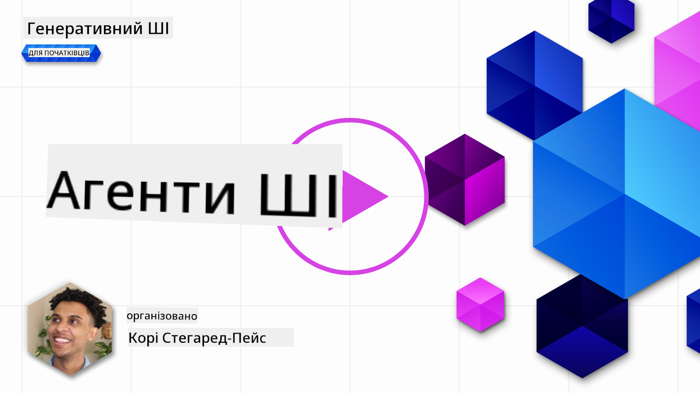
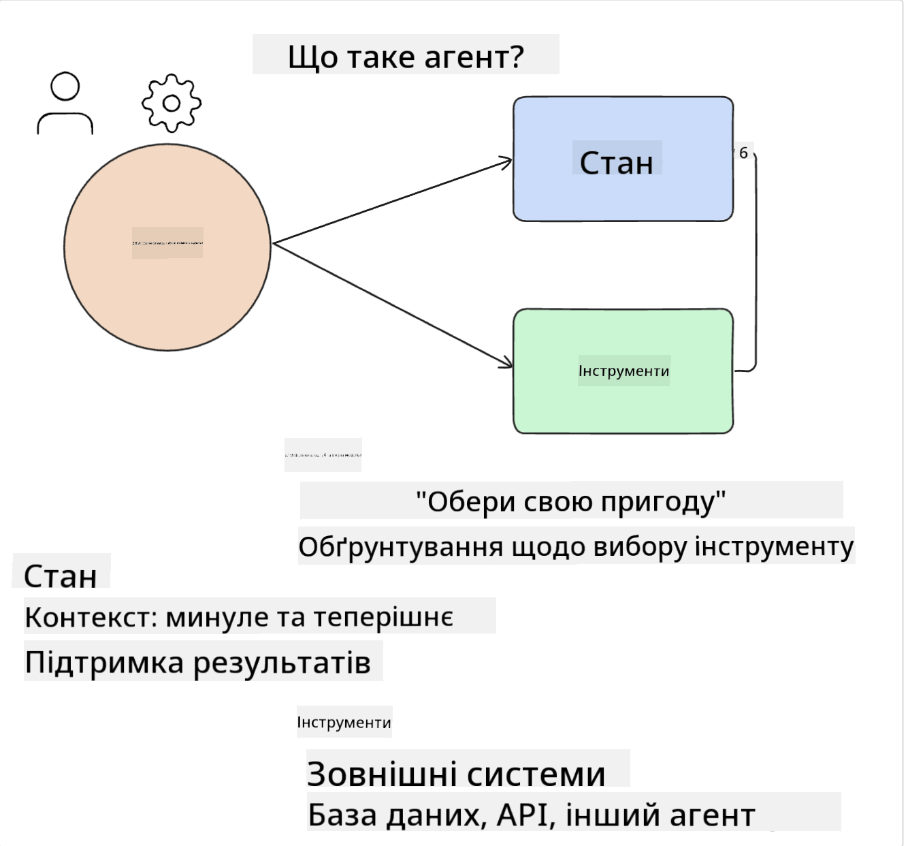
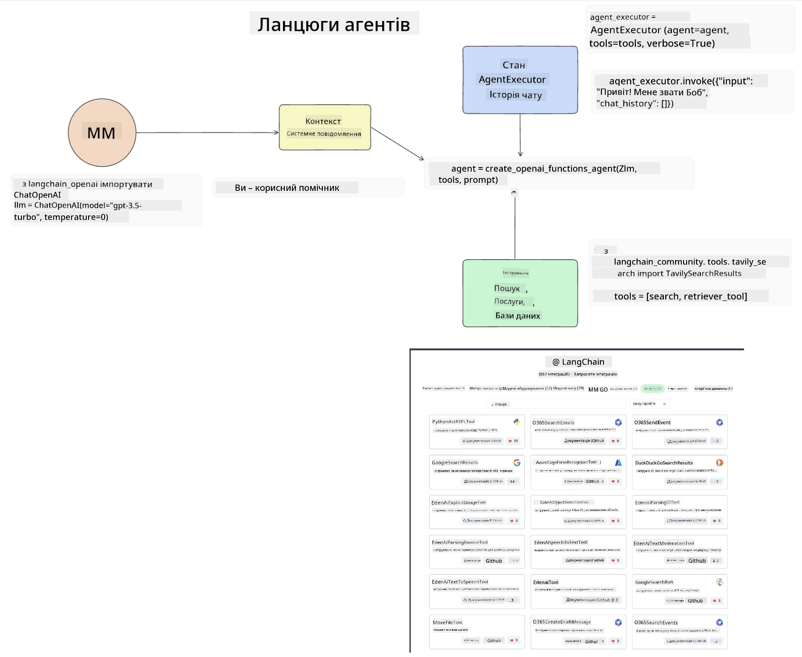
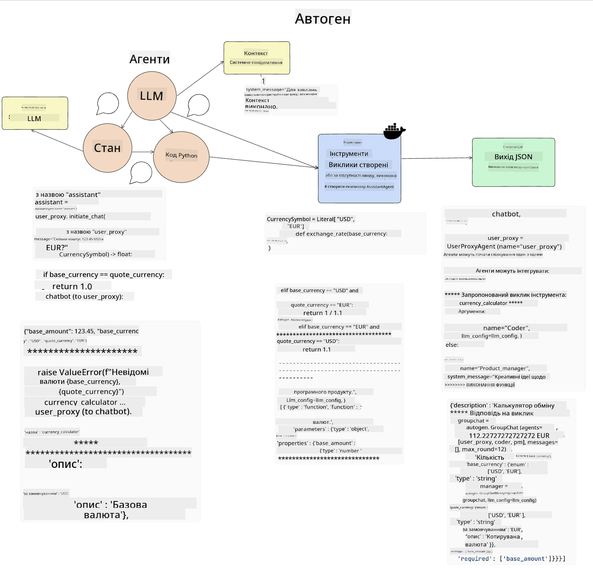
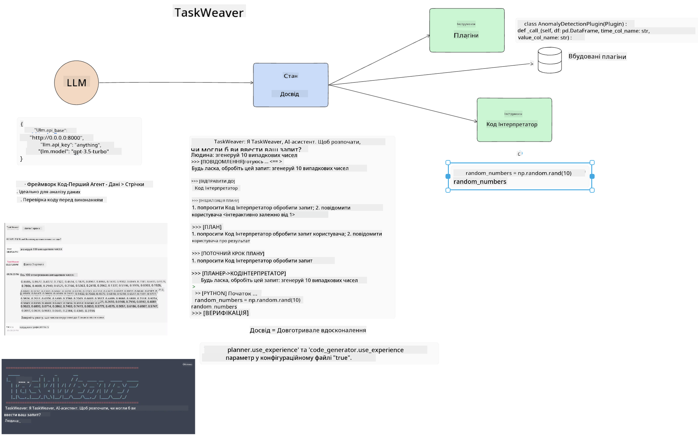

<!--
CO_OP_TRANSLATOR_METADATA:
{
  "original_hash": "11f03c81f190d9cbafd0f977dcbede6c",
  "translation_date": "2025-06-26T00:28:08+00:00",
  "source_file": "17-ai-agents/README.md",
  "language_code": "uk"
}
-->
[](https://aka.ms/gen-ai-lesson17-gh?WT.mc_id=academic-105485-koreyst)

## Вступ

AI-агенти представляють собою захоплюючий розвиток у сфері генеративного штучного інтелекту, дозволяючи великим мовним моделям (LLM) еволюціонувати з асистентів у агентів, здатних виконувати дії. Фреймворки AI-агентів дозволяють розробникам створювати застосунки, які надають LLM доступ до інструментів та управління станом. Ці фреймворки також підвищують видимість, дозволяючи користувачам і розробникам відстежувати дії, заплановані LLM, тим самим покращуючи управління досвідом.

Урок охоплюватиме наступні області:

- Розуміння, що таке AI-агент - Що саме таке AI-агент?
- Дослідження чотирьох різних фреймворків AI-агентів - Що робить їх унікальними?
- Застосування цих AI-агентів у різних випадках використання - Коли слід використовувати AI-агенти?

## Навчальні цілі

Після проходження цього уроку ви зможете:

- Пояснити, що таке AI-агенти і як їх можна використовувати.
- Розуміти відмінності між деякими популярними фреймворками AI-агентів та їх відмінності.
- Розуміти, як функціонують AI-агенти для створення застосунків з ними.

## Що таке AI-агенти?

AI-агенти є дуже захоплюючою сферою у світі генеративного штучного інтелекту. З цим захопленням іноді приходить плутанина термінів та їх застосування. Щоб спростити ситуацію та охопити більшість інструментів, які стосуються AI-агентів, ми будемо використовувати таке визначення:

AI-агенти дозволяють великим мовним моделям (LLM) виконувати завдання, надаючи їм доступ до **стану** та **інструментів**.



Давайте визначимо ці терміни:

**Великі мовні моделі** - Це моделі, на які посилається цей курс, такі як GPT-3.5, GPT-4, Llama-2 тощо.

**Стан** - Це відноситься до контексту, в якому працює LLM. LLM використовує контекст своїх попередніх дій і поточний контекст, керуючи своїм прийняттям рішень для наступних дій. Фреймворки AI-агентів дозволяють розробникам легше підтримувати цей контекст.

**Інструменти** - Щоб виконати завдання, яке запитав користувач і яке LLM запланував, LLM потрібен доступ до інструментів. Деякі приклади інструментів можуть бути базою даних, API, зовнішнім застосунком або навіть іншим LLM!

Ці визначення, сподіваємося, дадуть вам хорошу основу для подальшого розгляду, як вони реалізовані. Давайте дослідимо кілька різних фреймворків AI-агентів:

## LangChain Agents

[LangChain Agents](https://python.langchain.com/docs/how_to/#agents?WT.mc_id=academic-105485-koreyst) є реалізацією визначень, які ми надали вище.

Щоб керувати **станом**, він використовує вбудовану функцію, звану `AgentExecutor`. Це приймає визначені `agent` та `tools`, які доступні йому.

`Agent Executor` також зберігає історію чату, щоб надати контекст чату.



LangChain пропонує [каталог інструментів](https://integrations.langchain.com/tools?WT.mc_id=academic-105485-koreyst), які можна імпортувати у ваш застосунок, до яких LLM може отримати доступ. Вони створені спільнотою та командою LangChain.

Ви можете визначити ці інструменти і передати їх `Agent Executor`.

Видимість є ще одним важливим аспектом при обговоренні AI-агентів. Важливо, щоб розробники застосунків розуміли, який інструмент використовує LLM і чому. Для цього команда LangChain розробила LangSmith.

## AutoGen

Наступний фреймворк AI-агентів, який ми обговоримо, це [AutoGen](https://microsoft.github.io/autogen/?WT.mc_id=academic-105485-koreyst). Основна увага AutoGen зосереджена на розмовах. Агенти є як **розмовними**, так і **налаштовуваними**.

**Розмовні -** LLM можуть почати і продовжити розмову з іншим LLM для завершення завдання. Це робиться шляхом створення `AssistantAgents` і надання їм конкретного системного повідомлення.

```python

autogen.AssistantAgent( name="Coder", llm_config=llm_config, ) pm = autogen.AssistantAgent( name="Product_manager", system_message="Creative in software product ideas.", llm_config=llm_config, )

```

**Налаштовувані** - Агенти можуть бути визначені не тільки як LLM, але і як користувач або інструмент. Як розробник, ви можете визначити `UserProxyAgent`, який відповідає за взаємодію з користувачем для зворотного зв'язку при виконанні завдання. Цей зворотний зв'язок може або продовжити виконання завдання, або зупинити його.

```python
user_proxy = UserProxyAgent(name="user_proxy")
```

### Стан та Інструменти

Щоб змінити та керувати станом, асистент-агент генерує Python-код для завершення завдання.

Ось приклад процесу:



#### LLM Визначений із Системним Повідомленням

```python
system_message="For weather related tasks, only use the functions you have been provided with. Reply TERMINATE when the task is done."
```

Ці системні повідомлення направляють конкретний LLM на те, які функції є релевантними для його завдання. Пам'ятайте, що з AutoGen ви можете мати кілька визначених AssistantAgents з різними системними повідомленнями.

#### Чат Ініційований Користувачем

```python
user_proxy.initiate_chat( chatbot, message="I am planning a trip to NYC next week, can you help me pick out what to wear? ", )

```

Це повідомлення від user_proxy (Людина) є тим, що розпочне процес агента для дослідження можливих функцій, які він повинен виконати.

#### Функція Виконана

```bash
chatbot (to user_proxy):

***** Suggested tool Call: get_weather ***** Arguments: {"location":"New York City, NY","time_periond:"7","temperature_unit":"Celsius"} ******************************************************** --------------------------------------------------------------------------------

>>>>>>>> EXECUTING FUNCTION get_weather... user_proxy (to chatbot): ***** Response from calling function "get_weather" ***** 112.22727272727272 EUR ****************************************************************

```

Після обробки початкового чату агент надішле пропозицію інструменту для виклику. У цьому випадку це функція, званий `get_weather`. Depending on your configuration, this function can be automatically executed and read by the Agent or can be executed based on user input.

You can find a list of [AutoGen code samples](https://microsoft.github.io/autogen/docs/Examples/?WT.mc_id=academic-105485-koreyst) to further explore how to get started building.

## Taskweaver

The next agent framework we will explore is [Taskweaver](https://microsoft.github.io/TaskWeaver/?WT.mc_id=academic-105485-koreyst). It is known as a "code-first" agent because instead of working strictly with `strings` , it can work with DataFrames in Python. This becomes extremely useful for data analysis and generation tasks. This can be things like creating graphs and charts or generating random numbers.

### State and Tools

To manage the state of the conversation, TaskWeaver uses the concept of a `Planner`. The `Planner` is a LLM that takes the request from the users and maps out the tasks that need to be completed to fulfill this request.

To complete the tasks the `Planner` is exposed to the collection of tools called `Plugins`. Це можуть бути класи Python або загальний інтерпретатор коду. Ці плагіни зберігаються як вбудовування, щоб LLM міг краще шукати правильний плагін.



Ось приклад плагіна для обробки виявлення аномалій:

```python
class AnomalyDetectionPlugin(Plugin): def __call__(self, df: pd.DataFrame, time_col_name: str, value_col_name: str):
```

Код перевіряється перед виконанням. Ще однією особливістю управління контекстом у Taskweaver є `experience`. Experience allows for the context of a conversation to be stored over to the long term in a YAML file. This can be configured so that the LLM improves over time on certain tasks given that it is exposed to prior conversations.

## JARVIS

The last agent framework we will explore is [JARVIS](https://github.com/microsoft/JARVIS?tab=readme-ov-file?WT.mc_id=academic-105485-koreyst). What makes JARVIS unique is that it uses an LLM to manage the `state` розмови та `tools` є іншими моделями AI. Кожна з моделей AI є спеціалізованими моделями, які виконують певні завдання, такі як виявлення об'єктів, транскрипція або підпис зображень.


LLM, будучи моделлю загального призначення, отримує запит від користувача і визначає конкретне завдання та будь-які аргументи/дані, необхідні для виконання завдання.

```python
[{"task": "object-detection", "id": 0, "dep": [-1], "args": {"image": "e1.jpg" }}]
```

Потім LLM форматує запит таким чином, щоб спеціалізована модель AI могла його інтерпретувати, наприклад, у форматі JSON. Після того, як модель AI повернула свій прогноз на основі завдання, LLM отримує відповідь.

Якщо для виконання завдання потрібні кілька моделей, він також інтерпретує відповідь від цих моделей, перш ніж об'єднати їх, щоб згенерувати відповідь користувачу.

Нижче наведено приклад того, як це працюватиме, коли користувач запитує опис та підрахунок об'єктів на зображенні:

## Завдання

Щоб продовжити вивчення AI-агентів, ви можете побудувати з AutoGen:

- Застосунок, який імітує ділову зустріч з різними відділами стартапу в сфері освіти.
- Створіть системні повідомлення, які направляють LLM у розумінні різних персон і пріоритетів, і дозволяють користувачу презентувати нову ідею продукту.
- LLM повинен потім згенерувати подальші питання від кожного відділу, щоб уточнити і покращити презентацію та ідею продукту.

## Навчання не зупиняється тут, продовжуйте шлях

Після завершення цього уроку, перегляньте нашу [колекцію навчання генеративного AI](https://aka.ms/genai-collection?WT.mc_id=academic-105485-koreyst), щоб продовжити підвищувати свої знання в області генеративного AI!

**Відмова від відповідальності**:  
Цей документ був перекладений за допомогою сервісу автоматичного перекладу [Co-op Translator](https://github.com/Azure/co-op-translator). Хоча ми прагнемо до точності, просимо звернути увагу, що автоматизовані переклади можуть містити помилки або неточності. Оригінальний документ на його рідній мові слід вважати авторитетним джерелом. Для критичної інформації рекомендується професійний переклад людиною. Ми не несемо відповідальності за будь-які непорозуміння або неправильні тлумачення, що виникають внаслідок використання цього перекладу.