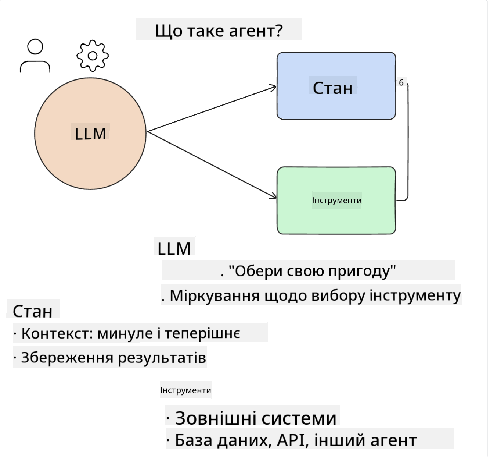
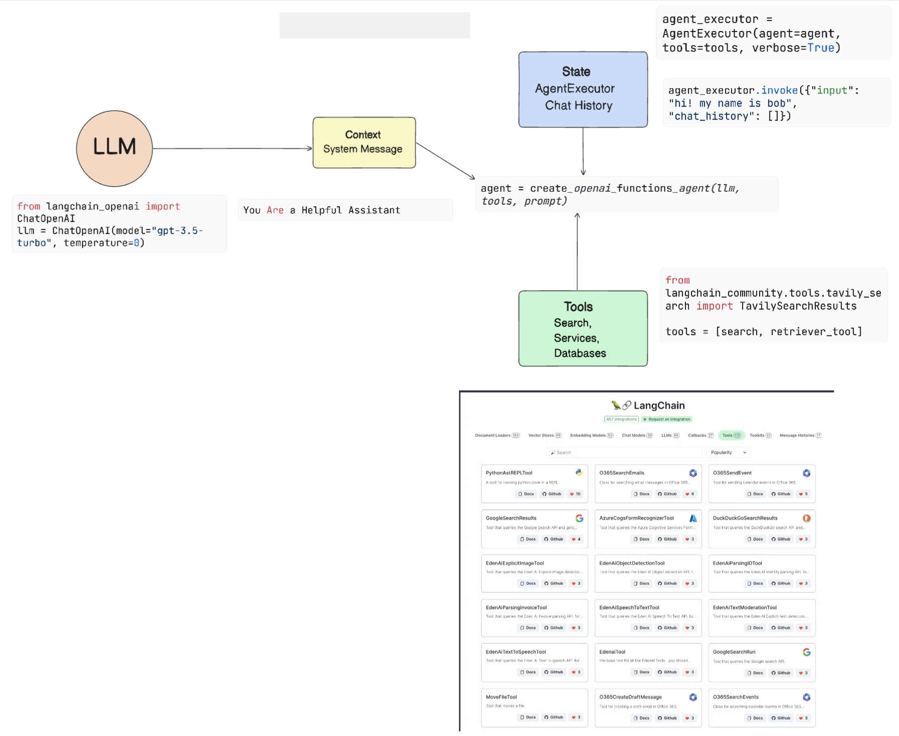
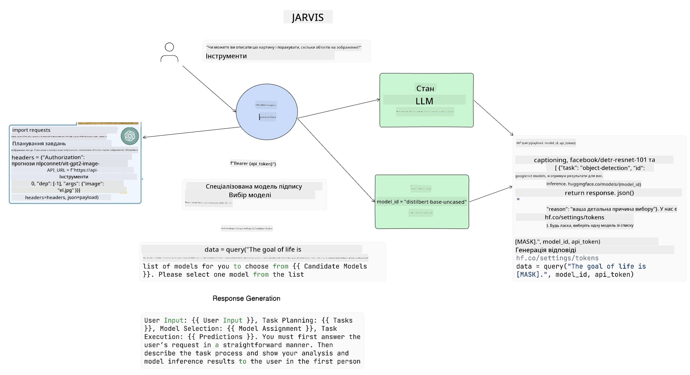

<!--
CO_OP_TRANSLATOR_METADATA:
{
  "original_hash": "8e8d1f6a63da606af7176a87ff8e92b6",
  "translation_date": "2025-10-18T02:20:09+00:00",
  "source_file": "17-ai-agents/README.md",
  "language_code": "uk"
}
-->
[](https://youtu.be/yAXVW-lUINc?si=bOtW9nL6jc3XJgOM)

## Вступ

AI-агенти представляють собою захоплюючий розвиток у сфері генеративного штучного інтелекту, дозволяючи великим мовним моделям (LLMs) еволюціонувати від асистентів до агентів, здатних виконувати дії. Фреймворки AI-агентів дозволяють розробникам створювати додатки, які надають LLM доступ до інструментів і управління станом. Ці фреймворки також покращують прозорість, дозволяючи користувачам і розробникам відстежувати дії, заплановані LLM, тим самим покращуючи управління досвідом.

Урок охоплює наступні теми:

- Розуміння, що таке AI-агент - Що саме таке AI-агент?
- Дослідження чотирьох різних фреймворків AI-агентів - Чим вони унікальні?
- Застосування цих AI-агентів до різних сценаріїв використання - Коли слід використовувати AI-агенти?

## Цілі навчання

Після проходження цього уроку ви зможете:

- Пояснити, що таке AI-агенти і як їх можна використовувати.
- Зрозуміти відмінності між деякими популярними фреймворками AI-агентів і чим вони відрізняються.
- Зрозуміти, як функціонують AI-агенти, щоб створювати додатки з їх використанням.

## Що таке AI-агенти?

AI-агенти є дуже захоплюючою сферою у світі генеративного штучного інтелекту. З цією захопливістю іноді приходить плутанина термінів і їх застосування. Щоб спростити і включити більшість інструментів, які відносяться до AI-агентів, ми будемо використовувати таке визначення:

AI-агенти дозволяють великим мовним моделям (LLMs) виконувати завдання, надаючи їм доступ до **стану** і **інструментів**.



Давайте визначимо ці терміни:

**Великі мовні моделі** - Це моделі, про які йдеться в цьому курсі, такі як GPT-3.5, GPT-4, Llama-2 тощо.

**Стан** - Це контекст, в якому працює LLM. LLM використовує контекст своїх попередніх дій і поточний контекст, щоб керувати прийняттям рішень для наступних дій. Фреймворки AI-агентів дозволяють розробникам легше підтримувати цей контекст.

**Інструменти** - Для виконання завдання, яке запросив користувач і яке LLM запланував, LLM потрібен доступ до інструментів. Деякі приклади інструментів можуть включати базу даних, API, зовнішній додаток або навіть інший LLM!

Ці визначення, сподіваємося, дадуть вам гарне розуміння для подальшого вивчення того, як вони реалізуються. Давайте розглянемо кілька різних фреймворків AI-агентів:

## LangChain Agents

[LangChain Agents](https://python.langchain.com/docs/how_to/#agents?WT.mc_id=academic-105485-koreyst) є реалізацією визначень, які ми надали вище.

Для управління **станом** використовується вбудована функція під назвою `AgentExecutor`. Вона приймає визначений `agent` і доступні йому `tools`.

`AgentExecutor` також зберігає історію чату, щоб забезпечити контекст чату.



LangChain пропонує [каталог інструментів](https://integrations.langchain.com/tools?WT.mc_id=academic-105485-koreyst), які можна імпортувати у ваш додаток, щоб LLM міг отримати до них доступ. Ці інструменти створені спільнотою та командою LangChain.

Ви можете визначити ці інструменти і передати їх до `AgentExecutor`.

Прозорість є ще одним важливим аспектом, коли йдеться про AI-агенти. Важливо, щоб розробники додатків розуміли, який інструмент використовує LLM і чому. Для цього команда LangChain розробила LangSmith.

## AutoGen

Наступний фреймворк AI-агентів, який ми обговоримо, це [AutoGen](https://microsoft.github.io/autogen/?WT.mc_id=academic-105485-koreyst). Основний акцент AutoGen робить на розмовах. Агенти є одночасно **розмовними** і **кастомізованими**.

**Розмовні -** LLM можуть починати і продовжувати розмову з іншими LLM для виконання завдання. Це здійснюється шляхом створення `AssistantAgents` і надання їм конкретного системного повідомлення.

```python

autogen.AssistantAgent( name="Coder", llm_config=llm_config, ) pm = autogen.AssistantAgent( name="Product_manager", system_message="Creative in software product ideas.", llm_config=llm_config, )

```

**Кастомізовані** - Агенти можуть бути визначені не тільки як LLM, але також як користувач або інструмент. Як розробник, ви можете визначити `UserProxyAgent`, який відповідає за взаємодію з користувачем для отримання зворотного зв'язку при виконанні завдання. Цей зворотний зв'язок може або продовжити виконання завдання, або зупинити його.

```python
user_proxy = UserProxyAgent(name="user_proxy")
```

### Стан і інструменти

Для зміни і управління станом помічник-агент генерує код Python для виконання завдання.

Ось приклад процесу:


#### LLM визначений системним повідомленням

```python
system_message="For weather related tasks, only use the functions you have been provided with. Reply TERMINATE when the task is done."
```

Це системне повідомлення направляє конкретний LLM до функцій, які є релевантними для його завдання. Пам'ятайте, що з AutoGen ви можете мати кілька визначених AssistantAgents з різними системними повідомленнями.

#### Чат ініціюється користувачем

```python
user_proxy.initiate_chat( chatbot, message="I am planning a trip to NYC next week, can you help me pick out what to wear? ", )

```

Це повідомлення від user_proxy (людини) є тим, що запускає процес агента для дослідження можливих функцій, які він повинен виконати.

#### Виконання функції

```bash
chatbot (to user_proxy):

***** Suggested tool Call: get_weather ***** Arguments: {"location":"New York City, NY","time_periond:"7","temperature_unit":"Celsius"} ******************************************************** --------------------------------------------------------------------------------

>>>>>>>> EXECUTING FUNCTION get_weather... user_proxy (to chatbot): ***** Response from calling function "get_weather" ***** 112.22727272727272 EUR ****************************************************************

```

Після обробки початкового чату агент запропонує інструмент для виклику. У цьому випадку це функція під назвою `get_weather`. Залежно від вашої конфігурації, ця функція може бути автоматично виконана і прочитана агентом або виконана на основі введення користувача.

Ви можете знайти список [зразків коду AutoGen](https://microsoft.github.io/autogen/docs/Examples/?WT.mc_id=academic-105485-koreyst), щоб детальніше ознайомитися з тим, як почати створювати.

## Taskweaver

Наступний фреймворк агентів, який ми розглянемо, це [Taskweaver](https://microsoft.github.io/TaskWeaver/?WT.mc_id=academic-105485-koreyst). Він відомий як агент "спочатку код", тому що замість роботи виключно зі `строками`, він може працювати з DataFrames у Python. Це стає надзвичайно корисним для завдань аналізу даних і генерації. Це можуть бути такі речі, як створення графіків і діаграм або генерація випадкових чисел.

### Стан і інструменти

Для управління станом розмови TaskWeaver використовує концепцію `Planner`. `Planner` - це LLM, який приймає запит від користувачів і планує завдання, які потрібно виконати для виконання цього запиту.

Для виконання завдань `Planner` має доступ до колекції інструментів, які називаються `Plugins`. Це можуть бути класи Python або загальний інтерпретатор коду. Ці плагіни зберігаються як embeddings, щоб LLM міг краще шукати відповідний плагін.


Ось приклад плагіна для обробки виявлення аномалій:

```python
class AnomalyDetectionPlugin(Plugin): def __call__(self, df: pd.DataFrame, time_col_name: str, value_col_name: str):
```

Код перевіряється перед виконанням. Ще однією функцією для управління контекстом у Taskweaver є `experience`. Experience дозволяє зберігати контекст розмови на довгострокову перспективу у файлі YAML. Це можна налаштувати так, щоб LLM покращувався з часом на певних завданнях, враховуючи, що він має доступ до попередніх розмов.

## JARVIS

Останній фреймворк агентів, який ми розглянемо, це [JARVIS](https://github.com/microsoft/JARVIS?tab=readme-ov-file?WT.mc_id=academic-105485-koreyst). Що робить JARVIS унікальним, так це те, що він використовує LLM для управління `станом` розмови, а `інструменти` - це інші моделі штучного інтелекту. Кожна з моделей штучного інтелекту є спеціалізованою моделлю, яка виконує певні завдання, такі як розпізнавання об'єктів, транскрипція або опис зображень.



LLM, будучи універсальною моделлю, отримує запит від користувача і визначає конкретне завдання та будь-які аргументи/дані, необхідні для виконання завдання.

```python
[{"task": "object-detection", "id": 0, "dep": [-1], "args": {"image": "e1.jpg" }}]
```

LLM потім форматує запит у вигляді, який спеціалізована модель штучного інтелекту може інтерпретувати, наприклад, JSON. Після того, як модель штучного інтелекту повертає свій прогноз на основі завдання, LLM отримує відповідь.

Якщо для виконання завдання потрібні кілька моделей, він також інтерпретує відповіді від цих моделей перед тим, як об'єднати їх для створення відповіді користувачеві.

Приклад нижче показує, як це працює, коли користувач запитує опис і кількість об'єктів на зображенні:

## Завдання

Щоб продовжити навчання про AI-агенти, ви можете створити з AutoGen:

- Додаток, який симулює бізнес-зустріч з різними відділами освітнього стартапу.
- Створіть системні повідомлення, які допоможуть LLM зрозуміти різні ролі і пріоритети, і дозволять користувачеві представити нову ідею продукту.
- Потім LLM має генерувати додаткові запитання від кожного відділу для уточнення і покращення ідеї продукту.

## Навчання не закінчується тут, продовжуйте свій шлях

Після завершення цього уроку ознайомтеся з нашою [колекцією навчання про генеративний штучний інтелект](https://aka.ms/genai-collection?WT.mc_id=academic-105485-koreyst), щоб продовжити вдосконалювати свої знання про генеративний штучний інтелект!

---

**Відмова від відповідальності**:  
Цей документ був перекладений за допомогою сервісу автоматичного перекладу [Co-op Translator](https://github.com/Azure/co-op-translator). Хоча ми прагнемо до точності, будь ласка, майте на увазі, що автоматичні переклади можуть містити помилки або неточності. Оригінальний документ на його рідній мові слід вважати авторитетним джерелом. Для критичної інформації рекомендується професійний людський переклад. Ми не несемо відповідальності за будь-які непорозуміння або неправильні тлумачення, що виникають внаслідок використання цього перекладу.