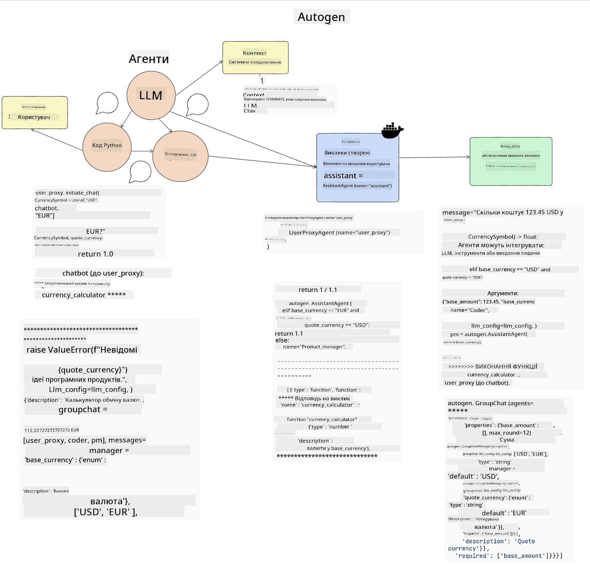

<!--
CO_OP_TRANSLATOR_METADATA:
{
  "original_hash": "11f03c81f190d9cbafd0f977dcbede6c",
  "translation_date": "2025-07-09T17:33:34+00:00",
  "source_file": "17-ai-agents/README.md",
  "language_code": "uk"
}
-->
[](https://aka.ms/gen-ai-lesson17-gh?WT.mc_id=academic-105485-koreyst)

## Вступ

AI Agents — це захоплюючий напрямок у сфері Генеративного ШІ, який дозволяє великим мовним моделям (LLM) еволюціонувати з помічників у агентів, здатних виконувати дії. Фреймворки AI Agent дають розробникам змогу створювати додатки, які надають LLM доступ до інструментів і керування станом. Ці фреймворки також покращують прозорість, дозволяючи користувачам і розробникам відстежувати дії, які планують LLM, що підвищує якість взаємодії.

Урок охопить такі теми:

- Розуміння, що таке AI Agent — Що саме означає AI Agent?
- Огляд чотирьох різних фреймворків AI Agent — Чим вони відрізняються?
- Застосування AI Agents у різних сценаріях — Коли варто використовувати AI Agents?

## Цілі навчання

Після проходження цього уроку ви зможете:

- Пояснити, що таке AI Agents і як їх можна використовувати.
- Розуміти відмінності між популярними фреймворками AI Agent і їх особливості.
- Зрозуміти, як працюють AI Agents, щоб створювати додатки з їх використанням.

## Що таке AI Agents?

AI Agents — це дуже захоплююча сфера у світі Генеративного ШІ. Разом із цим захопленням іноді виникає плутанина у термінах і їх застосуванні. Щоб усе було просто і охоплювало більшість інструментів, які називають AI Agents, ми використаємо таке визначення:

AI Agents дозволяють великим мовним моделям (LLM) виконувати завдання, надаючи їм доступ до **стану** та **інструментів**.


Давайте визначимо ці терміни:

**Великі мовні моделі** — це моделі, про які йдеться у цьому курсі, такі як GPT-3.5, GPT-4, Llama-2 тощо.

**Стан** — це контекст, у якому працює LLM. Модель використовує контекст своїх попередніх дій і поточний контекст, що допомагає їй приймати рішення для подальших дій. Фреймворки AI Agent полегшують розробникам підтримку цього контексту.

**Інструменти** — щоб виконати завдання, яке користувач запросив і яке LLM спланувала, модель потребує доступу до інструментів. Прикладами інструментів можуть бути база даних, API, зовнішній додаток або навіть інша LLM!

Ці визначення допоможуть вам краще зрозуміти, як усе реалізовано. Тепер розглянемо кілька різних фреймворків AI Agent:

## LangChain Agents

[LangChain Agents](https://python.langchain.com/docs/how_to/#agents?WT.mc_id=academic-105485-koreyst) — це реалізація наведених вище визначень.

Для керування **станом** він використовує вбудовану функцію `AgentExecutor`. Вона приймає визначений `agent` та доступні `tools`.

`AgentExecutor` також зберігає історію чату, щоб забезпечити контекст розмови.


LangChain пропонує [каталог інструментів](https://integrations.langchain.com/tools?WT.mc_id=academic-105485-koreyst), які можна імпортувати у ваш додаток, щоб LLM мала до них доступ. Ці інструменти створені спільнотою та командою LangChain.

Ви можете визначити ці інструменти і передати їх у `AgentExecutor`.

Прозорість — ще один важливий аспект при роботі з AI Agents. Розробникам додатків важливо розуміти, який інструмент використовує LLM і чому. Для цього команда LangChain розробила LangSmith.

## AutoGen

Наступний фреймворк AI Agent, який ми розглянемо, — [AutoGen](https://microsoft.github.io/autogen/?WT.mc_id=academic-105485-koreyst). Основна увага AutoGen — це розмови. Агенти є одночасно **розмовними** та **налаштовуваними**.

**Розмовні** — LLM можуть починати і продовжувати розмову з іншою LLM для виконання завдання. Це реалізується створенням `AssistantAgents` і наданням їм конкретного системного повідомлення.

```python

autogen.AssistantAgent( name="Coder", llm_config=llm_config, ) pm = autogen.AssistantAgent( name="Product_manager", system_message="Creative in software product ideas.", llm_config=llm_config, )

```

**Налаштовувані** — агенти можуть бути визначені не лише як LLM, а й як користувач або інструмент. Як розробник, ви можете створити `UserProxyAgent`, який відповідає за взаємодію з користувачем для отримання зворотного зв’язку під час виконання завдання. Цей зворотний зв’язок може або продовжити виконання завдання, або зупинити його.

```python
user_proxy = UserProxyAgent(name="user_proxy")
```

### Стан і інструменти

Для зміни та керування станом агент-асистент генерує Python-код для виконання завдання.

Ось приклад цього процесу:



#### LLM визначена системним повідомленням

```python
system_message="For weather related tasks, only use the functions you have been provided with. Reply TERMINATE when the task is done."
```

Це системне повідомлення вказує цій конкретній LLM, які функції є релевантними для її завдання. Пам’ятайте, що в AutoGen можна мати кілька визначених AssistantAgents з різними системними повідомленнями.

#### Розмова ініціюється користувачем

```python
user_proxy.initiate_chat( chatbot, message="I am planning a trip to NYC next week, can you help me pick out what to wear? ", )

```

Це повідомлення від user_proxy (людини) запускає процес, у якому агент досліджує можливі функції, які він має виконати.

#### Виконання функції

```bash
chatbot (to user_proxy):

***** Suggested tool Call: get_weather ***** Arguments: {"location":"New York City, NY","time_periond:"7","temperature_unit":"Celsius"} ******************************************************** --------------------------------------------------------------------------------

>>>>>>>> EXECUTING FUNCTION get_weather... user_proxy (to chatbot): ***** Response from calling function "get_weather" ***** 112.22727272727272 EUR ****************************************************************

```

Після обробки початкової розмови агент надсилає пропозицію викликати інструмент. У цьому випадку це функція `get_weather`. Залежно від налаштувань, ця функція може виконуватися автоматично і бути прочитаною агентом або виконуватися на основі введення користувача.

Ви можете знайти список [прикладів коду AutoGen](https://microsoft.github.io/autogen/docs/Examples/?WT.mc_id=academic-105485-koreyst), щоб детальніше ознайомитися з початком роботи.

## Taskweaver

Наступний фреймворк, який ми розглянемо, — [Taskweaver](https://microsoft.github.io/TaskWeaver/?WT.mc_id=academic-105485-koreyst). Його називають "code-first" агентом, бо він працює не лише зі `strings`, а й з DataFrames у Python. Це дуже корисно для завдань аналізу даних і генерації, наприклад, створення графіків, діаграм або генерації випадкових чисел.

### Стан і інструменти

Для керування станом розмови TaskWeaver використовує концепцію `Planner`. `Planner` — це LLM, яка приймає запит користувача і планує завдання, які потрібно виконати для його реалізації.

Для виконання завдань `Planner` має доступ до набору інструментів, які називаються `Plugins`. Це можуть бути класи Python або загальний інтерпретатор коду. Ці плагіни зберігаються у вигляді ембеддингів, щоб LLM могла краще знаходити потрібний плагін.


Ось приклад плагіна для виявлення аномалій:

```python
class AnomalyDetectionPlugin(Plugin): def __call__(self, df: pd.DataFrame, time_col_name: str, value_col_name: str):
```

Код перевіряється перед виконанням. Ще одна функція для керування контекстом у Taskweaver — це `experience`. Experience дозволяє зберігати контекст розмови у довгостроковій перспективі у YAML-файлі. Це можна налаштувати так, щоб LLM з часом покращувала свої результати у певних завданнях, враховуючи попередні розмови.

## JARVIS

Останній фреймворк, який ми розглянемо, — [JARVIS](https://github.com/microsoft/JARVIS?tab=readme-ov-file?WT.mc_id=academic-105485-koreyst). Особливість JARVIS у тому, що він використовує LLM для керування `станом` розмови, а `інструментами` є інші AI-моделі. Кожна з цих моделей спеціалізується на певних завданнях, таких як виявлення об’єктів, транскрипція або підписування зображень.


LLM, як модель загального призначення, отримує запит від користувача, визначає конкретне завдання та необхідні аргументи/дані для його виконання.

```python
[{"task": "object-detection", "id": 0, "dep": [-1], "args": {"image": "e1.jpg" }}]
```

Потім LLM форматує запит у вигляді, зрозумілому спеціалізованій AI-моделі, наприклад, у JSON. Після того, як AI-модель повертає свій результат, LLM отримує відповідь.

Якщо для виконання завдання потрібно кілька моделей, LLM також інтерпретує відповіді від цих моделей і об’єднує їх, щоб сформувати відповідь для користувача.

Приклад нижче показує, як це працює, коли користувач запитує опис і підрахунок об’єктів на зображенні:

## Завдання

Щоб продовжити вивчення AI Agents, ви можете створити з AutoGen:

- Додаток, який імітує бізнес-зустріч між різними відділами освітнього стартапу.
- Створити системні повідомлення, які допомагають LLM розуміти різні персонажі та пріоритети, і дозволяють користувачу презентувати ідею нового продукту.
- LLM має згенерувати подальші питання від кожного відділу, щоб уточнити і покращити презентацію та ідею продукту.

## Навчання не закінчується тут, продовжуйте свій шлях

Після завершення цього уроку ознайомтеся з нашою [колекцією навчальних матеріалів з Генеративного ШІ](https://aka.ms/genai-collection?WT.mc_id=academic-105485-koreyst), щоб продовжувати підвищувати свої знання у цій сфері!

**Відмова від відповідальності**:  
Цей документ було перекладено за допомогою сервісу автоматичного перекладу [Co-op Translator](https://github.com/Azure/co-op-translator). Хоча ми прагнемо до точності, будь ласка, майте на увазі, що автоматичні переклади можуть містити помилки або неточності. Оригінальний документ рідною мовою слід вважати авторитетним джерелом. Для критично важливої інформації рекомендується звертатися до професійного людського перекладу. Ми не несемо відповідальності за будь-які непорозуміння або неправильні тлумачення, що виникли внаслідок використання цього перекладу.