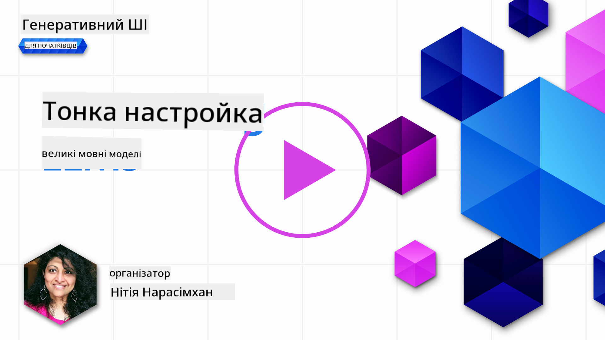
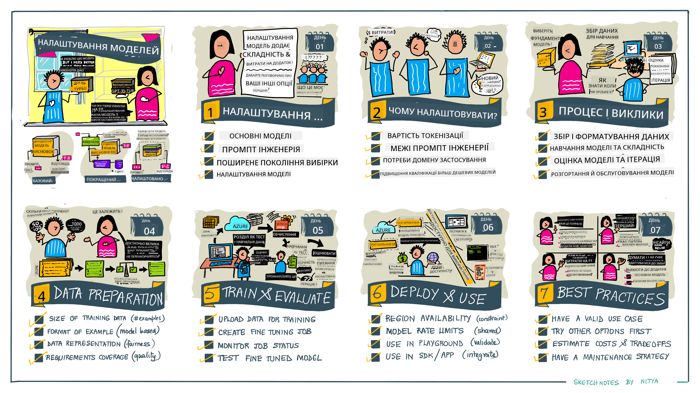

<!--
CO_OP_TRANSLATOR_METADATA:
{
  "original_hash": "68664f7e754a892ae1d8d5e2b7bd2081",
  "translation_date": "2025-07-09T17:52:17+00:00",
  "source_file": "18-fine-tuning/README.md",
  "language_code": "uk"
}
-->

# Тонке налаштування вашої LLM

Використання великих мовних моделей для створення генеративних AI-додатків пов’язане з новими викликами. Ключова проблема — забезпечення якості відповіді (точності та релевантності) у контенті, який модель генерує на основі запиту користувача. У попередніх уроках ми розглядали техніки, такі як prompt engineering та retrieval-augmented generation, які намагаються вирішити цю проблему шляхом _зміни вхідного запиту_ для існуючої моделі.

У сьогоднішньому уроці ми обговоримо третю техніку — **тонке налаштування**, яка намагається розв’язати цю задачу шляхом _перенавчання самої моделі_ з використанням додаткових даних. Поглянемо на деталі.

## Цілі навчання

Цей урок вводить поняття тонкого налаштування для попередньо навчених мовних моделей, розглядає переваги та виклики цього підходу, а також дає рекомендації, коли і як використовувати тонке налаштування для покращення продуктивності ваших генеративних AI-моделей.

До кінця уроку ви зможете відповісти на такі питання:

- Що таке тонке налаштування мовних моделей?
- Коли і чому тонке налаштування корисне?
- Як я можу тонко налаштувати попередньо навчену модель?
- Які обмеження має тонке налаштування?

Готові? Почнемо.

## Ілюстрований посібник

Хочете отримати загальне уявлення про те, що ми розглянемо, перш ніж заглиблюватись? Ознайомтеся з цим ілюстрованим посібником, який описує навчальний шлях цього уроку — від вивчення основних концепцій і мотивації для тонкого налаштування до розуміння процесу та найкращих практик виконання завдання тонкого налаштування. Це захоплююча тема для дослідження, тож не забудьте заглянути на сторінку [Resources](./RESOURCES.md?WT.mc_id=academic-105485-koreyst) для додаткових посилань, які підтримають ваше самостійне навчання!

## Що таке тонке налаштування мовних моделей?

За визначенням, великі мовні моделі _попередньо навчені_ на великих обсягах тексту з різних джерел, включно з інтернетом. Як ми дізналися в попередніх уроках, нам потрібні техніки, такі як _prompt engineering_ та _retrieval-augmented generation_, щоб покращити якість відповідей моделі на запити користувача ("промпти").

Популярна техніка prompt engineering полягає в тому, щоб надати моделі більше вказівок щодо очікуваної відповіді, або через _інструкції_ (явні вказівки), або _подаючи кілька прикладів_ (неявні вказівки). Це називається _few-shot learning_, але має два обмеження:

- Ліміти на кількість токенів моделі можуть обмежувати кількість прикладів, які ви можете надати, і знижувати ефективність.
- Вартість токенів може зробити додавання прикладів до кожного запиту дорогим і обмежити гнучкість.

Тонке налаштування — це поширена практика в системах машинного навчання, коли ми беремо попередньо навчену модель і перенавчаємо її на нових даних, щоб покращити продуктивність у конкретному завданні. У контексті мовних моделей ми можемо тонко налаштувати попередньо навчену модель _на основі відібраного набору прикладів для певного завдання або домену застосування_, щоб створити **кастомізовану модель**, яка може бути точнішою та релевантнішою для цього конкретного завдання чи домену. Додатковою перевагою тонкого налаштування є те, що воно може зменшити кількість прикладів, необхідних для few-shot learning — знижуючи використання токенів і пов’язані витрати.

## Коли і чому варто тонко налаштовувати моделі?

У _цьому_ контексті, коли ми говоримо про тонке налаштування, маємо на увазі **кероване** тонке налаштування, коли перенавчання відбувається шляхом **додавання нових даних**, які не входили до початкового навчального набору. Це відрізняється від некерованого тонкого налаштування, коли модель перенавчають на оригінальних даних, але з іншими гіперпараметрами.

Головне, що потрібно пам’ятати: тонке налаштування — це просунута техніка, яка вимагає певного рівня експертизи для досягнення бажаних результатів. Якщо зробити це неправильно, воно може не дати очікуваних покращень, а іноді навіть погіршити продуктивність моделі для вашого цільового домену.

Отже, перш ніж вивчати "як" тонко налаштовувати мовні моделі, потрібно зрозуміти "чому" варто обрати цей шлях і "коли" починати процес тонкого налаштування. Почніть з таких запитань:

- **Випадок використання**: Який у вас _випадок використання_ для тонкого налаштування? Який аспект поточної попередньо навчену моделі ви хочете покращити?
- **Альтернативи**: Чи пробували ви _інші техніки_ для досягнення бажаних результатів? Використайте їх, щоб створити базову лінію для порівняння.
  - Prompt engineering: Спробуйте техніки few-shot prompting з прикладами релевантних відповідей. Оцініть якість відповідей.
  - Retrieval Augmented Generation: Спробуйте доповнювати промпти результатами пошуку у ваших даних. Оцініть якість відповідей.
- **Витрати**: Чи визначили ви витрати на тонке налаштування?
  - Можливість налаштування — чи доступна попередньо навчена модель для тонкого налаштування?
  - Зусилля — на підготовку навчальних даних, оцінку та вдосконалення моделі.
  - Обчислювальні ресурси — для запуску завдань тонкого налаштування та розгортання моделі.
  - Дані — доступ до достатньої кількості якісних прикладів для впливу тонкого налаштування.
- **Переваги**: Чи підтвердили ви переваги тонкого налаштування?
  - Якість — чи перевищила тонко налаштована модель базовий рівень?
  - Вартість — чи зменшує вона використання токенів за рахунок спрощення промптів?
  - Розширюваність — чи можна використовувати базову модель для нових доменів?

Відповідаючи на ці питання, ви зможете вирішити, чи є тонке налаштування правильним підходом для вашого випадку. Ідеально, якщо переваги переважають витрати. Коли ви вирішите рухатися далі, настав час подумати про те, _як_ тонко налаштувати попередньо навчену модель.

Хочете більше інформації про процес прийняття рішень? Перегляньте [To fine-tune or not to fine-tune](https://www.youtube.com/watch?v=0Jo-z-MFxJs)

## Як ми можемо тонко налаштувати попередньо навчену модель?

Щоб тонко налаштувати попередньо навчену модель, вам потрібно мати:

- попередньо навчену модель для тонкого налаштування
- набір даних для тонкого налаштування
- середовище для запуску завдання тонкого налаштування
- середовище для розгортання тонко налаштованої моделі

## Тонке налаштування на практиці

Наступні ресурси містять покрокові навчальні посібники, які проведуть вас через реальний приклад із вибраною моделлю та відібраним набором даних. Щоб працювати з цими посібниками, вам потрібен обліковий запис у відповідного провайдера, а також доступ до відповідної моделі та наборів даних.

| Провайдер    | Навчальний посібник                                                                                                                                                           | Опис                                                                                                                                                                                                                                                                                                                                                                                                                              |
| ------------ | ------------------------------------------------------------------------------------------------------------------------------------------------------------------------------ | --------------------------------------------------------------------------------------------------------------------------------------------------------------------------------------------------------------------------------------------------------------------------------------------------------------------------------------------------------------------------------------------------------------------------------- |
| OpenAI       | [How to fine-tune chat models](https://github.com/openai/openai-cookbook/blob/main/examples/How_to_finetune_chat_models.ipynb?WT.mc_id=academic-105485-koreyst)                | Навчіться тонко налаштовувати `gpt-35-turbo` для конкретного домену ("помічник з рецептів") шляхом підготовки навчальних даних, запуску завдання тонкого налаштування та використання тонко налаштованої моделі для інференсу.                                                                                                                                                                                                  |
| Azure OpenAI | [GPT 3.5 Turbo fine-tuning tutorial](https://learn.microsoft.com/azure/ai-services/openai/tutorials/fine-tune?tabs=python-new%2Ccommand-line?WT.mc_id=academic-105485-koreyst) | Навчіться тонко налаштовувати модель `gpt-35-turbo-0613` **на Azure**, виконуючи кроки зі створення та завантаження навчальних даних, запуску завдання тонкого налаштування, розгортання та використання нової моделі.                                                                                                                                                                                                             |
| Hugging Face | [Fine-tuning LLMs with Hugging Face](https://www.philschmid.de/fine-tune-llms-in-2024-with-trl?WT.mc_id=academic-105485-koreyst)                                               | У цьому блозі показано, як тонко налаштувати _відкриту LLM_ (наприклад, `CodeLlama 7B`) за допомогою бібліотеки [transformers](https://huggingface.co/docs/transformers/index?WT.mc_id=academic-105485-koreyst) та [Transformer Reinforcement Learning (TRL)](https://huggingface.co/docs/trl/index?WT.mc_id=academic-105485-koreyst) з відкритими [набором даних](https://huggingface.co/docs/datasets/index?WT.mc_id=academic-105485-koreyst) на Hugging Face. |
|              |                                                                                                                                                                                |                                                                                                                                                                                                                                                                                                                                                                                                                                   |
| 🤗 AutoTrain | [Fine-tuning LLMs with AutoTrain](https://github.com/huggingface/autotrain-advanced/?WT.mc_id=academic-105485-koreyst)                                                         | AutoTrain (або AutoTrain Advanced) — це бібліотека Python від Hugging Face, яка дозволяє тонко налаштовувати моделі для різних завдань, включно з тонким налаштуванням LLM. AutoTrain — це рішення без коду, і тонке налаштування можна виконувати у власному хмарному середовищі, на Hugging Face Spaces або локально. Підтримує веб-інтерфейс, CLI та навчання через yaml-конфігурації.                                                                                   |
|              |                                                                                                                                                                                |                                                                                                                                                                                                                                                                                                                                                                                                                                   |

## Завдання

Виберіть один із наведених вище посібників і пройдіть його. _Ми можемо відтворити версію цих посібників у Jupyter Notebook у цьому репозиторії лише для довідки. Будь ласка, користуйтеся оригінальними джерелами, щоб отримати найновіші версії_.

## Відмінна робота! Продовжуйте навчання.

Після завершення цього уроку ознайомтеся з нашою колекцією [Generative AI Learning collection](https://aka.ms/genai-collection?WT.mc_id=academic-105485-koreyst), щоб продовжувати підвищувати свої знання у сфері генеративного AI!

Вітаємо!! Ви завершили останній урок із серії v2 цього курсу! Не зупиняйтеся на досягнутому — продовжуйте вчитися та створювати. \*\*Перегляньте сторінку [RESOURCES](RESOURCES.md?WT.mc_id=academic-105485-koreyst) для списку додаткових рекомендацій саме з цієї теми.

Наша серія уроків v1 також оновлена з новими завданнями та концепціями. Тож приділіть хвилину, щоб освіжити знання — і, будь ласка, [діліться своїми питаннями та відгуками](https://github.com/microsoft/generative-ai-for-beginners/issues?WT.mc_id=academic-105485-koreyst), щоб допомогти нам покращити ці уроки для спільноти.

**Відмова від відповідальності**:  
Цей документ було перекладено за допомогою сервісу автоматичного перекладу [Co-op Translator](https://github.com/Azure/co-op-translator). Хоча ми прагнемо до точності, будь ласка, майте на увазі, що автоматичні переклади можуть містити помилки або неточності. Оригінальний документ рідною мовою слід вважати авторитетним джерелом. Для критично важливої інформації рекомендується звертатися до професійного людського перекладу. Ми не несемо відповідальності за будь-які непорозуміння або неправильні тлумачення, що виникли внаслідок використання цього перекладу.