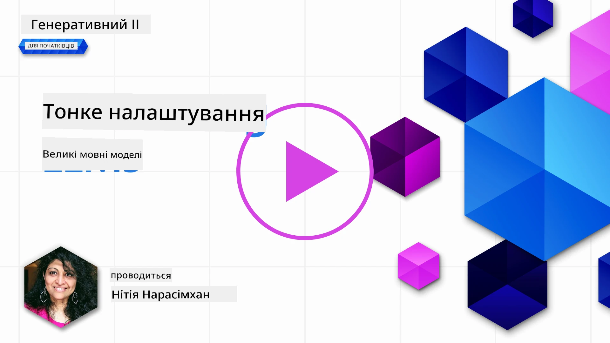
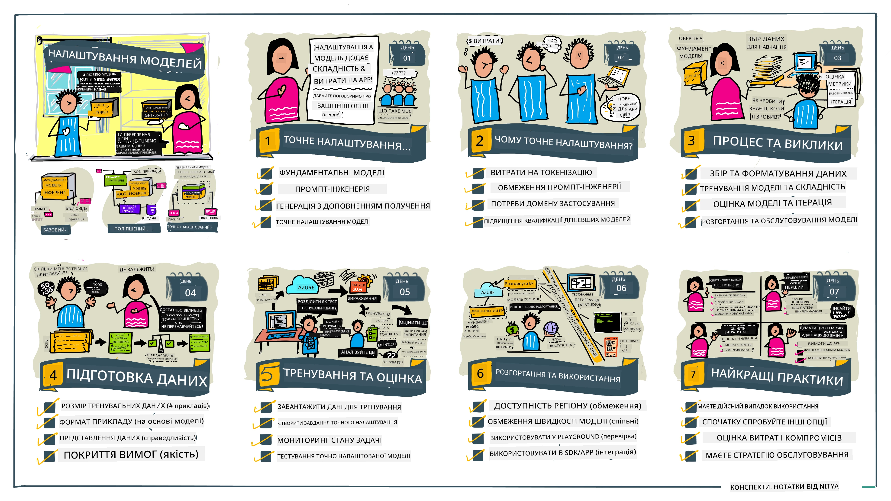

# Тонке налаштування вашої LLM

Використання великих мовних моделей для створення генеративних AI-додатків створює нові виклики. Ключова проблема — забезпечити якість відповіді (точність і релевантність) у вмісті, який модель генерує на основі запиту користувача. У попередніх уроках ми розглядали техніки, такі як інженерія підказок і генерація з підсиленням за допомогою пошуку, які намагаються вирішити проблему шляхом _зміни вхідної підказки_ до наявної моделі.

У сьогоднішньому уроці ми обговорюємо третю техніку — **тонке налаштування**, яка намагається розв’язати виклик шляхом _перенавчання самої моделі_ з додатковими даними. Поглянемо детальніше.

## Цілі навчання

Цей урок вводить поняття тонкого налаштування для попередньо навчених мовних моделей, досліджує переваги та виклики цього підходу та дає рекомендації, коли і як використовувати тонке налаштування для підвищення продуктивності ваших генеративних AI-моделей.

Після завершення уроку ви зможете відповісти на такі запитання:

- Що таке тонке налаштування мовних моделей?
- Коли і навіщо корисно застосовувати тонке налаштування?
- Як можна тонко налаштувати попередньо навчену модель?
- Які обмеження має тонке налаштування?

Готові? Почнемо.

## Ілюстрований посібник

Хочете отримати загальне уявлення про те, що ми розглядатимемо, перш ніж заглиблюватися? Ознайомтеся з цим ілюстрованим посібником, який описує навчальну подорож для цього уроку — від вивчення основних концепцій і мотивації для тонкого налаштування до розуміння процесу та найкращих практик виконання завдання тонкого налаштування. Це захоплююча тема для дослідження, тому не забудьте відвідати [Resources](./RESOURCES.md?WT.mc_id=academic-105485-koreyst) сторінку для додаткових посилань на підтримку вашого самостійного навчального процесу!

## Що таке тонке налаштування для мовних моделей?

За визначенням, великі мовні моделі _попередньо навчені_ на великих обсягах тексту, взятого з різноманітних джерел, включаючи інтернет. Як ми вже дізналися у попередніх уроках, нам потрібні техніки, такі як _інженерія підказок_ і _генерація з підсиленням за допомогою пошуку_, щоб покращити якість відповідей моделі на питання користувача ("підказки").

Популярний прийом інженерії підказок полягає в тому, що моделі надають більше вказівок щодо очікуваної відповіді, або за допомогою _інструкцій_ (явне керівництво), або _подаючи кілька прикладів_ (неявне керівництво). Це називають _навчанням з кількома прикладами_, але цей спосіб має два обмеження:

- Ліміти токенів моделі можуть обмежувати кількість прикладів, які ви можете подати, і тим самим знижувати ефективність.
- Вартість токенів моделі може зробити додавання прикладів у кожну підказку дорогим і обмежити гнучкість.

Тонке налаштування — це поширена практика в системах машинного навчання, коли беруть попередньо навчену модель і перенавчають її на нових даних, щоб покращити продуктивність для конкретного завдання. У контексті мовних моделей ми можемо тонко налаштувати попередньо навчену модель _за допомогою курованого набору прикладів для певного завдання або домену застосування_, щоб створити **кастомізовану модель**, яка може бути точнішою і релевантнішою для конкретного завдання або домену. Побічним вигодою тонкого налаштування є те, що це також може зменшити кількість прикладів, необхідних для навчання з кількома прикладами — скорочуючи використання токенів і пов’язані витрати.

## Коли і навіщо варто тонко налаштовувати моделі?

У цьому контексті, коли ми говоримо про тонке налаштування, маємо на увазі **кероване** тонке налаштування, коли перенавчання відбувається за рахунок **додавання нових даних**, які не входили до початкового навчального набору. Це відрізняється від некерованого тонкого налаштування, коли модель перенавчають на оригінальних даних, але з іншими гіперпараметрами.

Головне, що слід пам’ятати — тонке налаштування є складною технікою, яка потребує певного рівня експертизи для отримання бажаних результатів. Якщо виконати її неправильно, це може не дати очікуваного покращення, а навіть погіршити продуктивність моделі для вашого цільового домену.

Отже, перед тим як вивчати "як" тонко налаштовувати мовні моделі, потрібно зрозуміти "чому" варто вибрати цей шлях і "коли" починати процес тонкого налаштування. Почніть з питань:

- **Випадок використання**: Який у вас _випадок використання_ для тонкого налаштування? Який аспект поточної попередньо навчену моделі ви хочете покращити?
- **Альтернативи**: Чи пробували ви _інші методи_ для досягнення бажаних результатів? Використайте їх, щоб створити базову лінію для порівняння.
  - Інженерія підказок: Спробуйте техніки, як навчання з кількома прикладами з релевантними прикладами відповідей. Оцініть якість відповідей.
  - Генерація з підсиленням пошуком: Спробуйте доповнювати підказки результатами пошуку по ваших даних. Оцініть якість відповідей.
- **Витрати**: Чи визначили ви витрати для тонкого налаштування?
  - Можливість налаштування — чи доступна попередньо навчена модель для тонкої настройки?
  - Зусилля — для підготовки навчальних даних, оцінки та удосконалення моделі.
  - Обчислювальні ресурси — для запуску задачі тонкої настройки та розгортання налаштованої моделі.
  - Дані — доступ до достатньої кількості якісних прикладів для впливу тонкого налаштування.
- **Переваги**: Чи підтвердили ви переваги тонкого налаштування?
  - Якість — чи перевершила тонко налаштована модель базову?
  - Вартість — чи зменшує це використання токенів за рахунок спрощення підказок?
  - Розширюваність — чи можна перепрофілювати базову модель для нових доменів?

Відповідаючи на ці питання, ви зможете вирішити, чи підходить тонке налаштування для вашого випадку. Ідеально, якщо переваги перевищують витрати. Якщо ви вирішили продовжувати, настав час подумати, _як_ тонко налаштувати попередньо навчену модель.

Хочете отримати більше інформації про процес прийняття рішення? Перегляньте [To fine-tune or not to fine-tune](https://www.youtube.com/watch?v=0Jo-z-MFxJs)

## Як можна тонко налаштувати попередньо навчену модель?

Щоб тонко налаштувати попередньо навчену модель, вам потрібно мати:

- попередньо навчену модель для тонкої настройки
- набір даних для тонкої настройки
- тренувальне середовище для запуску задачі тонкої настройки
- середовище хостингу для розгортання налаштованої моделі

## Тонке налаштування на практиці

Наступні ресурси містять покрокові інструкції з реальним прикладом використання обраної моделі з курованим набором даних. Щоб пройти ці навчання, вам потрібно мати обліковий запис у конкретного провайдера, а також доступ до відповідної моделі та наборів даних.

| Провайдер     | Посібник                                                                                                                                                                       | Опис                                                                                                                                                                                                                                                                                                                                                                                                                        |
| ------------ | ------------------------------------------------------------------------------------------------------------------------------------------------------------------------------ | ---------------------------------------------------------------------------------------------------------------------------------------------------------------------------------------------------------------------------------------------------------------------------------------------------------------------------------------------------------------------------------------------------------------------------------- |
| OpenAI       | [Як тонко налаштовувати чат-моделі](https://github.com/openai/openai-cookbook/blob/main/examples/How_to_finetune_chat_models.ipynb?WT.mc_id=academic-105485-koreyst)                | Навчіться тонко налаштовувати `gpt-35-turbo` для конкретного домену ("помічник з рецептів") шляхом підготовки навчальних даних, запуску задачі тонкого налаштування та використання налаштованої моделі для інференсу.                                                                                                                                                                                                                                              |
| Azure OpenAI | [Посібник з тонкого налаштування GPT 3.5 Turbo](https://learn.microsoft.com/azure/ai-services/openai/tutorials/fine-tune?tabs=python-new%2Ccommand-line&WT.mc_id=academic-105485-koreyst) | Навчіться тонко налаштовувати модель `gpt-35-turbo-0613` **в Azure**, крок за кроком створюючи і завантажуючи навчальні дані, запускаючи задачу тонкого налаштування. Розгортайте і використовуйте нову модель.                                                                                                                                                                                                                                                                 |
| Hugging Face | [Тонке налаштування LLM за допомогою Hugging Face](https://www.philschmid.de/fine-tune-llms-in-2024-with-trl?WT.mc_id=academic-105485-koreyst)                                               | У цьому блозі описано процес тонкого налаштування _відкритої LLM_ (наприклад, `CodeLlama 7B`) із використанням бібліотек [transformers](https://huggingface.co/docs/transformers/index?WT.mc_id=academic-105485-koreyst) та [Transformer Reinforcement Learning (TRL)](https://huggingface.co/docs/trl/index?WT.mc_id=academic-105485-koreyst) з відкритими [набори даних](https://huggingface.co/docs/datasets/index?WT.mc_id=academic-105485-koreyst) на Hugging Face. |
|              |                                                                                                                                                                                |                                                                                                                                                                                                                                                                                                                                                                                                                                    |
| 🤗 AutoTrain | [Тонке налаштування LLM з AutoTrain](https://github.com/huggingface/autotrain-advanced/?WT.mc_id=academic-105485-koreyst)                                                         | AutoTrain (або AutoTrain Advanced) — це бібліотека Python від Hugging Face, яка дозволяє тонке налаштування для багатьох різних завдань, включаючи тонке налаштування LLM. AutoTrain — це рішення без коду, і тонке налаштування може виконуватись у вашому власному хмарному середовищі, на Hugging Face Spaces або локально. Підтримує веб-інтерфейс, CLI і навчання через YAML-конфігурації.                                                                               |
|              |                                                                                                                                                                                |                                                                                                                                                                                                                                                                                                                                                                                                                                    |
| 🦥 Unsloth | [Тонке налаштування LLM з Unsloth](https://github.com/unslothai/unsloth)                                                         | Unsloth — це open-source фреймворк, який підтримує тонке налаштування LLM та підкріплювальне навчання (RL). Unsloth спрощує локальне навчання, оцінювання й розгортання за допомогою готових [ноутбуків](https://github.com/unslothai/notebooks). Підтримує також текст-в-речення (TTS), BERT та мультимодальні моделі. Щоб почати, прочитайте їх покроковий [Керівництво з тонкого налаштування LLM](https://docs.unsloth.ai/get-started/fine-tuning-llms-guide).                                                                          |
|              |                                                                                                                                                                                |                                                                                                                                                                                                                                                                                                                                                                                                                                    |
## Завдання

Виберіть один із наведених вище посібників і пройдіть його. _Ми можемо відтворити версію цих навчань у Jupyter Notebooks у цьому репозиторії для довідки. Будь ласка, використовуйте оригінальні джерела напряму, щоб отримати найсвіжіші версії_.

## Відмінна робота! Продовжуйте навчання.

Після завершення цього уроку перегляньте нашу [колекцію Generative AI Learning](https://aka.ms/genai-collection?WT.mc_id=academic-105485-koreyst), щоб і надалі підвищувати рівень своїх знань із Generative AI!

Вітаємо!! Ви завершили фінальний урок із серії v2 цього курсу! Не зупиняйтесь на досягнутому — продовжуйте навчатися й створювати. \*\*Перегляньте сторінку [RESOURCES](RESOURCES.md?WT.mc_id=academic-105485-koreyst) для списку додаткових рекомендацій саме з цієї теми.

Наша серія уроків v1 також була оновлена з додатковими завданнями та поняттями. Тож знайдіть хвилину, щоб освіжити свої знання — і будь ласка, [діліться своїми запитаннями та відгуками](https://github.com/microsoft/generative-ai-for-beginners/issues?WT.mc_id=academic-105485-koreyst), щоб допомогти нам покращувати ці уроки для спільноти.

---

<!-- CO-OP TRANSLATOR DISCLAIMER START -->
**Відмова від відповідальності**:
Цей документ був перекладений за допомогою сервісу автоматичного перекладу [Co-op Translator](https://github.com/Azure/co-op-translator). Хоча ми прагнемо до точності, будь ласка, майте на увазі, що автоматичні переклади можуть містити помилки або неточності. Оригінальний документ мовою оригіналу слід вважати авторитетним джерелом. Для критично важливої інформації рекомендується звертатися до професійного перекладу, виконаного людиною. Ми не несемо відповідальності за будь-які непорозуміння або неправильні тлумачення, що виникли внаслідок використання цього перекладу.
<!-- CO-OP TRANSLATOR DISCLAIMER END -->