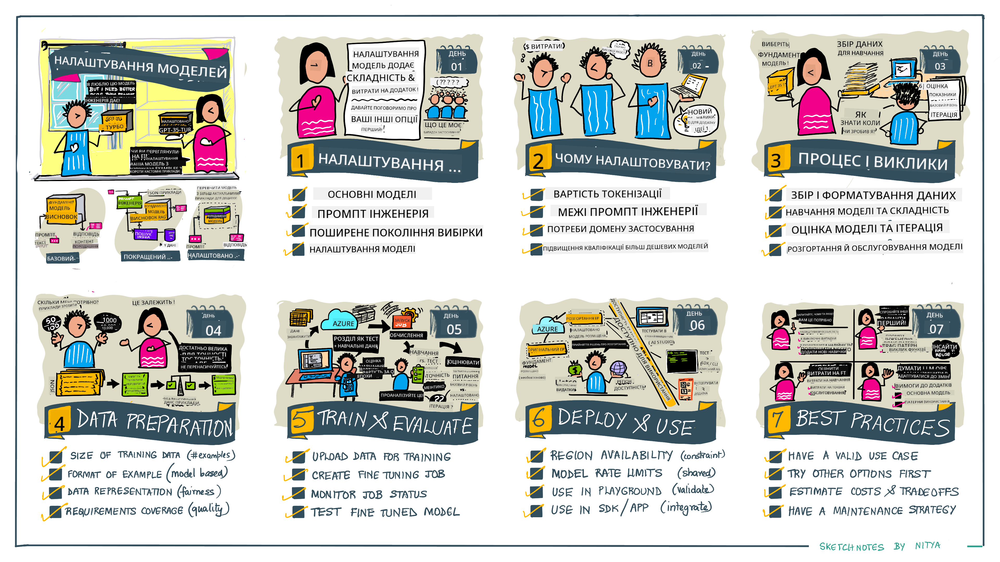

<!--
CO_OP_TRANSLATOR_METADATA:
{
  "original_hash": "68664f7e754a892ae1d8d5e2b7bd2081",
  "translation_date": "2025-06-26T00:55:26+00:00",
  "source_file": "18-fine-tuning/README.md",
  "language_code": "uk"
}
-->

# Налаштування вашої LLM

Використання великих мовних моделей для створення додатків генеративного штучного інтелекту супроводжується новими викликами. Основне питання полягає в забезпеченні якості відповіді (точність і релевантність) у контенті, що генерується моделлю на запит користувача. У попередніх уроках ми обговорювали такі техніки, як інженерія підказок і генерація з підсиленням вилученням, які намагаються вирішити проблему шляхом _модифікації вхідних даних підказки_ для існуючої моделі.

Сьогодні ми обговоримо третю техніку, **налаштування**, яка намагається вирішити цю проблему шляхом _перенавчання самої моделі_ з додатковими даними. Давайте заглибимося в деталі.

## Цілі навчання

Цей урок вводить концепцію налаштування для попередньо навчених мовних моделей, досліджує переваги та виклики цього підходу, а також надає рекомендації, коли і як використовувати налаштування для покращення продуктивності ваших генеративних моделей штучного інтелекту.

До кінця цього уроку ви повинні вміти відповісти на наступні питання:

- Що таке налаштування для мовних моделей?
- Коли і чому налаштування корисне?
- Як можна налаштувати попередньо навчену модель?
- Які обмеження налаштування?

Готові? Почнемо.

## Ілюстрований посібник

Хочете отримати загальну картину того, що ми розглянемо, перш ніж заглибитися? Перегляньте цей ілюстрований посібник, який описує навчальну подорож цього уроку - від вивчення основних концепцій і мотивації для налаштування до розуміння процесу і найкращих практик для виконання завдання налаштування. Це захоплююча тема для дослідження, тому не забудьте відвідати сторінку [Ресурси](./RESOURCES.md?WT.mc_id=academic-105485-koreyst) для додаткових посилань, які підтримають вашу самостійну навчальну подорож!

## Що таке налаштування для мовних моделей?

За визначенням, великі мовні моделі є _попередньо навченими_ на великих обсягах тексту, отриманих з різних джерел, включаючи інтернет. Як ми дізналися в попередніх уроках, нам потрібні такі техніки, як _інженерія підказок_ і _генерація з підсиленням вилученням_, щоб покращити якість відповідей моделі на запитання користувача ("підказки").

Популярна техніка інженерії підказок полягає в наданні моделі більшого керівництва щодо того, що очікується у відповіді, або шляхом надання _інструкцій_ (явне керівництво), або _наведенням кількох прикладів_ (неявне керівництво). Це називається _навчанням з кількома прикладами_, але воно має два обмеження:

- Обмеження токенів моделі можуть обмежити кількість прикладів, які ви можете надати, і обмежити ефективність.
- Вартість токенів моделі може зробити дорогим додавання прикладів до кожної підказки і обмежити гнучкість.

Налаштування - це загальноприйнята практика в системах машинного навчання, де ми беремо попередньо навчену модель і перенавчаємо її з новими даними для покращення її продуктивності на певному завданні. У контексті мовних моделей ми можемо налаштувати попередньо навчену модель _з підібраним набором прикладів для певного завдання або домену застосування_, щоб створити **індивідуальну модель**, яка може бути більш точною і релевантною для цього конкретного завдання або домену. Додатковою перевагою налаштування є те, що воно також може зменшити кількість прикладів, необхідних для навчання з кількома прикладами, зменшуючи використання токенів і пов'язані з цим витрати.

## Коли і чому ми повинні налаштовувати моделі?

У _цьому_ контексті, коли ми говоримо про налаштування, ми маємо на увазі **контрольоване** налаштування, де перенавчання здійснюється шляхом **додавання нових даних**, які не були частиною початкового набору даних для навчання. Це відрізняється від неконтрольованого підходу до налаштування, де модель перенавчається на початкових даних, але з іншими гіперпараметрами.

Головне, що потрібно пам'ятати, це те, що налаштування є передовою технікою, яка вимагає певного рівня експертизи для досягнення бажаних результатів. Якщо виконано неправильно, воно може не забезпечити очікуваних покращень, а може навіть погіршити продуктивність моделі для вашого цільового домену.

Отже, перш ніж ви дізнаєтеся "як" налаштовувати мовні моделі, вам потрібно знати "чому" ви повинні обрати цей шлях, і "коли" почати процес налаштування. Почніть, запитуючи себе ці питання:

- **Випадок використання**: Який ваш _випадок використання_ для налаштування? Який аспект поточної попередньо навченої моделі ви хочете покращити?
- **Альтернативи**: Чи пробували ви _інші техніки_ для досягнення бажаних результатів? Використовуйте їх для створення базового рівня для порівняння.
  - Інженерія підказок: Спробуйте техніки, такі як підказки з кількома прикладами, з прикладами релевантних відповідей на підказки. Оцініть якість відповідей.
  - Генерація з підсиленням вилученням: Спробуйте доповнити підказки результатами запитів, отриманих шляхом пошуку ваших даних. Оцініть якість відповідей.
- **Витрати**: Чи визначили ви витрати на налаштування?
  - Налаштованість - чи доступна попередньо навчена модель для налаштування?
  - Зусилля - для підготовки навчальних даних, оцінки та вдосконалення моделі.
  - Обчислення - для запуску завдань налаштування та розгортання налаштованої моделі.
  - Дані - доступ до достатньої кількості якісних прикладів для впливу налаштування.
- **Переваги**: Чи підтвердили ви переваги налаштування?
  - Якість - чи перевершила налаштована модель базовий рівень?
  - Вартість - чи зменшує вона використання токенів, спрощуючи підказки?
  - Розширюваність - чи можете ви перепрофілювати базову модель для нових доменів?

Відповівши на ці питання, ви повинні мати змогу вирішити, чи є налаштування правильним підходом для вашого випадку використання. Ідеально, підхід є дійсним, лише якщо переваги переважають витрати. Як тільки ви вирішите продовжити, настав час подумати про _як_ ви можете налаштувати попередньо навчену модель.

Хочете отримати більше уявлень про процес прийняття рішень? Подивіться [Налаштовувати чи не налаштовувати](https://www.youtube.com/watch?v=0Jo-z-MFxJs)

## Як ми можемо налаштувати попередньо навчену модель?

Щоб налаштувати попередньо навчену модель, вам потрібно мати:

- попередньо навчену модель для налаштування
- набір даних для використання при налаштуванні
- навчальне середовище для запуску завдання налаштування
- середовище хостингу для розгортання налаштованої моделі

## Налаштування в дії

Наступні ресурси надають покрокові підручники, які проведуть вас через реальний приклад, використовуючи вибрану модель з підібраним набором даних. Щоб пройти ці підручники, вам потрібен обліковий запис у конкретного провайдера, а також доступ до відповідної моделі та наборів даних.

| Провайдер    | Підручник                                                                                                                                                                     | Опис                                                                                                                                                                                                                                                                                                                                                                                                                               |
| ------------ | ----------------------------------------------------------------------------------------------------------------------------------------------------------------------------- | ----------------------------------------------------------------------------------------------------------------------------------------------------------------------------------------------------------------------------------------------------------------------------------------------------------------------------------------------------------------------------------------------------------------------------------- |
| OpenAI       | [Як налаштувати чат-моделі](https://github.com/openai/openai-cookbook/blob/main/examples/How_to_finetune_chat_models.ipynb?WT.mc_id=academic-105485-koreyst)                  | Дізнайтеся, як налаштувати `gpt-35-turbo` для певного домену ("асистент з рецептів"), підготувавши навчальні дані, запустивши завдання налаштування та використовуючи налаштовану модель для інференції.                                                                                                                                                                                                                      |
| Azure OpenAI | [Підручник з налаштування GPT 3.5 Turbo](https://learn.microsoft.com/azure/ai-services/openai/tutorials/fine-tune?tabs=python-new%2Ccommand-line?WT.mc_id=academic-105485-koreyst) | Дізнайтеся, як налаштувати `gpt-35-turbo-0613` модель **на Azure**, виконуючи кроки для створення та завантаження навчальних даних, запуску завдання налаштування. Розгорніть та використовуйте нову модель.                                                                                                                                                                                                                      |
| Hugging Face | [Налаштування LLM з Hugging Face](https://www.philschmid.de/fine-tune-llms-in-2024-with-trl?WT.mc_id=academic-105485-koreyst)                                                 | Цей блог-пост проводить вас через налаштування _відкритої LLM_ (наприклад, `CodeLlama 7B`) з використанням бібліотеки [transformers](https://huggingface.co/docs/transformers/index?WT.mc_id=academic-105485-koreyst) та [Transformer Reinforcement Learning (TRL)](https://huggingface.co/docs/trl/index?WT.mc_id=academic-105485-koreyst]) з відкритими [набори даних](https://huggingface.co/docs/datasets/index?WT.mc_id=academic-105485-koreyst) на Hugging Face. |
|              |                                                                                                                                                                               |                                                                                                                                                                                                                                                                                                                                                                                                                                     |
| 🤗 AutoTrain | [Налаштування LLM з AutoTrain](https://github.com/huggingface/autotrain-advanced/?WT.mc_id=academic-105485-koreyst)                                                          | AutoTrain (або AutoTrain Advanced) - це бібліотека Python, розроблена Hugging Face, яка дозволяє налаштування для багатьох різних завдань, включаючи налаштування LLM. AutoTrain - це рішення без коду, і налаштування можна виконати у вашій власній хмарі, на Hugging Face Spaces або локально. Воно підтримує як веб-інтерфейс, так і CLI, а також навчання за допомогою yaml конфігураційних файлів.                                                    |
|              |                                                                                                                                                                               |                                                                                                                                                                                                                                                                                                                                                                                                                                     |

## Завдання

Оберіть один з вищенаведених підручників і пройдіть його. _Ми можемо відтворити версію цих підручників у Jupyter Notebooks у цьому репозиторії лише для довідки. Будь ласка, використовуйте оригінальні джерела, щоб отримати найновіші версії_.

## Чудова робота! Продовжуйте навчання.

Після завершення цього уроку відвідайте нашу [колекцію навчання з генеративного штучного інтелекту](https://aka.ms/genai-collection?WT.mc_id=academic-105485-koreyst), щоб продовжити підвищувати свої знання з генеративного штучного інтелекту!

Вітаємо!! Ви завершили останній урок з серії v2 цього курсу! Не зупиняйтеся на навчанні та будівництві. \*\*Перегляньте сторінку [РЕСУРСИ](RESOURCES.md?WT.mc_id=academic-105485-koreyst) для списку додаткових пропозицій саме з цієї теми.

Наша серія уроків v1 також була оновлена з більшою кількістю завдань і концепцій. Тож знайдіть хвилинку, щоб освіжити свої знання - і будь ласка, [поділіться своїми запитаннями та відгуками](https://github.com/microsoft/generative-ai-for-beginners/issues?WT.mc_id=academic-105485-koreyst), щоб допомогти нам покращити ці уроки для спільноти.

**Відмова від відповідальності**:  
Цей документ був перекладений за допомогою сервісу автоматичного перекладу [Co-op Translator](https://github.com/Azure/co-op-translator). Хоча ми прагнемо до точності, будь ласка, зверніть увагу, що автоматичні переклади можуть містити помилки або неточності. Оригінальний документ на його рідній мові слід вважати авторитетним джерелом. Для критичної інформації рекомендується професійний людський переклад. Ми не несемо відповідальності за будь-які непорозуміння або неправильні тлумачення, що виникають внаслідок використання цього перекладу.