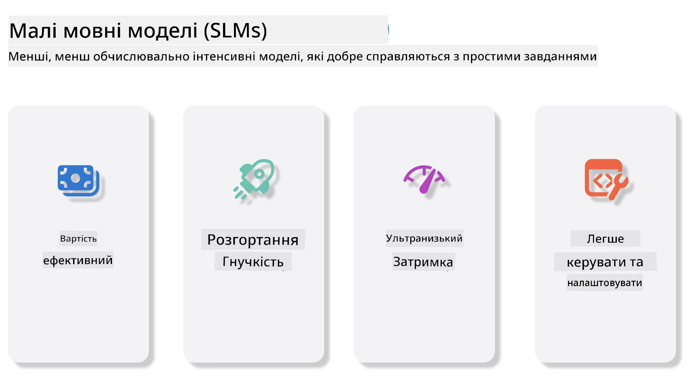
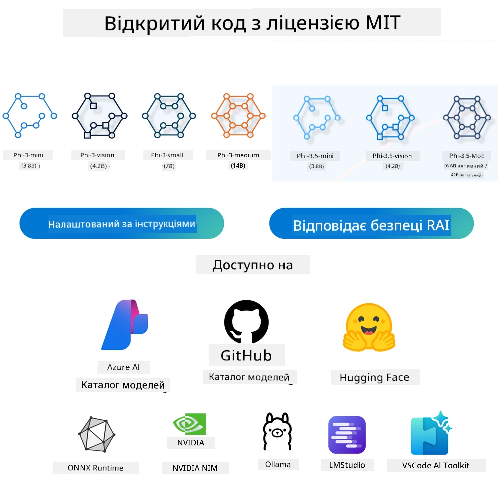
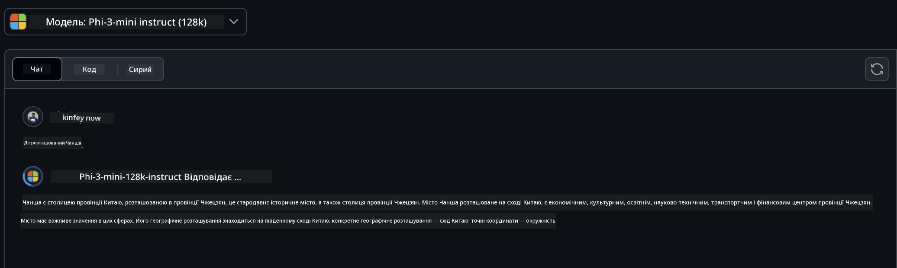
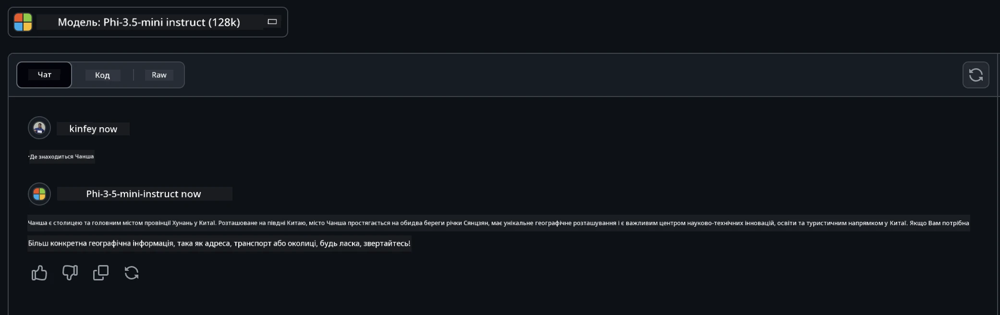

# Вступ до малих мовних моделей для генеративного ШІ для початківців
Генеративний ШІ — це захоплива галузь штучного інтелекту, яка зосереджена на створенні систем, здатних генерувати новий контент. Цей контент може варіюватися від тексту та зображень до музики та навіть цілих віртуальних середовищ. Одним із найцікавіших застосувань генеративного ШІ є сфера мовних моделей.

## Що таке малі мовні моделі?

Мала мовна модель (SLM) представляє спрощену версію великої мовної моделі (LLM), використовуючи багато архітектурних принципів і технік LLM, при цьому демонструючи значно менший обсяг обчислень. 

SLM є підмножиною мовних моделей, розроблених для генерування тексту, схожого на людський. На відміну від більших моделей, таких як GPT-4, SLM є компактнішими і ефективнішими, що робить їх ідеальними для застосувань, де обчислювальні ресурси обмежені. Незважаючи на менший розмір, вони все ще можуть виконувати різноманітні завдання. Зазвичай SLM створюють шляхом компресії або дистиляції LLM, прагнучи зберегти суттєву частину функціональності та лінгвістичних можливостей оригінальної моделі. Це зменшення розміру моделі знижує загальну складність, роблячи SLM більш ефективними як з точки зору використання пам’яті, так і обчислювальних вимог. Незважаючи на ці оптимізації, SLM можуть виконувати широкий спектр завдань обробки природної мови (NLP):

- Генерація тексту: створення послідовних і контекстно релевантних речень або абзаців.
- Доповнення тексту: передбачення та завершення речень на основі заданої підказки.
- Переклад: конвертація тексту з однієї мови на іншу.
- Резюмування: стискання довгих текстів у коротші, більш зрозумілі резюме.

Хоча з певними компромісами у продуктивності або глибині розуміння порівняно з більшими моделями.

## Як працюють малі мовні моделі?
SLM навчаються на величезних обсягах текстових даних. Під час навчання вони вивчають патерни і структури мови, що дозволяє генерувати текст, який є граматично правильним і контекстно доречним. Процес навчання включає:

- Збір даних: накопичення великих наборів тексту з різних джерел.
- Передобробка: очищення і організація даних для їх придатності до навчання.
- Навчання: використання алгоритмів машинного навчання для навчання моделі розуміти і генерувати текст.
- Тонка налаштування: корекція моделі для покращення її продуктивності на конкретних завданнях.

Розробка SLM відповідає зростаючій потребі у моделях, які можна розгортати у середовищах з обмеженими ресурсами, таких як мобільні пристрої або edge-комп’ютинг платформи, де повноцінні LLM можуть бути неприйнятними через великі вимоги до ресурсів. Орієнтуючись на ефективність, SLM поєднують продуктивність з доступністю, даючи змогу ширше застосовувати їх у різних галузях.



## Цілі навчання

У цьому уроці ми сподіваємося познайомити вас із знаннями про SLM та поєднати це з Microsoft Phi-3, щоб вивчити різні сценарії у текстовому контенті, зорі та MoE.

До кінця цього уроку ви зможете відповісти на такі питання:

- Що таке SLM?
- У чому різниця між SLM та LLM?
- Що таке родина Microsoft Phi-3/3.5?
- Як виконувати висновки з сімейства Microsoft Phi-3/3.5?

Готові? Почнемо.

## Відмінності між великими мовними моделями (LLM) та малими мовними моделями (SLM)

Обидві, LLM і SLM, базуються на фундаментальних принципах ймовірнісного машинного навчання, застосовують схожі підходи в архітектурі, методах навчання, процесах генерації даних і методах оцінки моделей. Проте існують кілька ключових факторів, які розрізняють ці два типи моделей.

## Застосування малих мовних моделей

SLM мають широкий спектр застосувань, серед яких:

- Чатботи: забезпечення підтримки клієнтів і взаємодія з користувачами у формі діалогу.
- Створення контенту: допомога письменникам у генерації ідей або навіть у підготовці цілих статей.
- Освіта: підтримка студентів у написанні завдань або вивченні нових мов.
- Доступність: створення інструментів для людей з обмеженими можливостями, таких як системи перетворення тексту в мовлення.

**Розмір**
  
Основна відмінність між LLM і SLM полягає у масштабі моделей. LLM, такі як ChatGPT (GPT-4), можуть містити приблизно 1,76 трильйона параметрів, тоді як відкриті SLM, наприклад Mistral 7B, розроблені з набагато меншим числом параметрів — приблизно 7 мільярдів. Ця різниця зумовлена головним чином варіаціями у архітектурі моделей і процесах навчання. Наприклад, ChatGPT застосовує механізм самоуваги в рамках енкодер-декодерної архітектури, тоді як Mistral 7B використовує увагу з ковзаючим вікном, що дозволяє більш ефективно навчатися в структурі тільки декодера. Ця архітектурна відмінність має важливі наслідки для складності і продуктивності моделей.

**Розуміння**

SLM зазвичай оптимізовані для роботи у визначених доменах, що робить їх високоспеціалізованими, але потенційно обмеженими у здатності надавати широке контекстне розуміння в різних сферах знань. Натомість LLM прагнуть симулювати інтелект, подібний до людського, на більш комплексному рівні. Навчені на великих і різноманітних наборах даних, LLM мають бути ефективними в різних доменах, пропонуючи ширшу універсальність та адаптивність. Отже, LLM краще підходять для більш широкого кола завдань, таких як обробка природньої мови та програмування.

**Обчислення**

Навчання і використання LLM — ресурсоємні процеси, що часто потребують значної обчислювальної інфраструктури, включаючи великі кластери GPU. Наприклад, навчання моделі на зразок ChatGPT з нуля може потребувати тисячі GPU протягом тривалого часу. Натомість SLM, з меншим числом параметрів, є більш доступними за обчислювальними ресурсами. Моделі на кшталт Mistral 7B можна навчати і запускати на локальних машинах із помірними можливостями GPU, хоча навчання все ще займає кілька годин на декількох GPU.

**Упередження**

Упередження — це відома проблема LLM, що зумовлена природою навчальних даних. Ці моделі часто базуються на сирих, відкритих даних з інтернету, які можуть недостатньо представляти або неправильно відображати деякі групи, містити помилкове маркування чи відображати лінгвістичні упередження, зумовлені діалектами, географічними варіаціями або граматичними правилами. Крім того, складність архітектури LLM може ненавмисно посилювати упередження, яке може залишатися непоміченим без ретельного тонкого налаштування. З іншого боку, SLM, що навчаються на більш обмежених, предметно-орієнтованих наборах даних, є менш сприйнятливими до таких упереджень, хоча і не повністю захищені від них.

**Висновок**

Менший розмір SLM дає їм значну перевагу у швидкості виконання висновків, дозволяючи ефективно генерувати результати на локальному обладнанні без потреби в масштабній паралельній обробці. На відміну від цього, LLM через їхній розмір і складність часто вимагають значних паралельних обчислювальних ресурсів для досягнення прийнятних часів відповіді. Наявність багатьох одночасних користувачів ще більше уповільнює відгук LLM, особливо при розгортанні у великому масштабі.

Підсумовуючи, хоча LLM і SLM базуються на спільних засадах машинного навчання, вони суттєво відрізняються за розміром моделі, вимогами до ресурсів, контекстним розумінням, схильністю до упереджень і швидкістю висновку. Ці відмінності відображають їх відповідну придатність до різних сценаріїв використання: LLM є більш універсальними, але ресурсоємними, тоді як SLM пропонують більшу ефективність у певних доменах із меншими обчислювальними вимогами.

***Примітка: у цьому уроці ми ознайомимося з SLM на прикладі Microsoft Phi-3 / 3.5.***

## Знайомство з сімейством Phi-3 / Phi-3.5

Сімейство Phi-3 / 3.5 орієнтоване головним чином на текстові, візуальні та агентські (MoE) застосунки:

### Phi-3 / 3.5 Instruct

Головним чином для генерації тексту, завершення діалогів і вилучення інформації з контенту тощо.

**Phi-3-mini**

Модель мови з 3.8 млрд параметрів доступна на Microsoft Azure AI Studio, Hugging Face та Ollama. Моделі Phi-3 значно перевершують за ключовими бенчмарками мовні моделі рівного або більшого розміру (див. нижче цифри бенчмарків, де вищі значення кращі). Phi-3-mini випереджає моделі у два рази більші за розміром, тоді як Phi-3-small і Phi-3-medium перевершують більші моделі, включно з GPT-3.5.

**Phi-3-small & medium**

Зі всього 7 млрд параметрів Phi-3-small перевершує GPT-3.5T у різних тестах з мови, логіки, кодування та математики.

Phi-3-medium із 14 млрд параметрів продовжує цю тенденцію та перевершує Gemini 1.0 Pro.

**Phi-3.5-mini**

Можна розглядати як оновлення Phi-3-mini. Параметри залишаються без змін, але поліпшено підтримку мульти-мовності (підтримка понад 20 мов: арабська, китайська, чеська, датська, голландська, англійська, фінська, французька, німецька, іврит, угорська, італійська, японська, корейська, норвезька, польська, португальська, російська, іспанська, шведська, тайська, турецька, українська) та додано більш потужну підтримку довгого контексту.

Phi-3.5-mini з 3.8 млрд параметрів перевершує мовні моделі одного розміру та на рівні з моделями у два рази більшими за розміром.

### Phi-3 / 3.5 Vision

Модель Instruct Phi-3/3.5 можна розглядати як здатність Phi розуміти, а Vision дає Phi очі для розуміння світу.

**Phi-3-Vision**

Phi-3-vision із лише 4.2 млрд параметрів продовжує цю тенденцію і перевершує більші моделі, такі як Claude-3 Haiku і Gemini 1.0 Pro V у загальних завданнях візуального розуміння, OCR та розумінні таблиць і діаграм.

**Phi-3.5-Vision**

Phi-3.5-Vision також є оновленням Phi-3-Vision, додаючи підтримку множинних зображень. Можна розглядати це як покращення зорового сприйняття: тепер можна не лише бачити зображення, а й відео.

Phi-3.5-vision перевершує більші моделі, такі як Claude-3.5 Sonnet і Gemini 1.5 Flash у завданнях OCR, розуміння таблиць і графіків, і на рівні з ними у загальному візуальному знанні та логічному висновку. Підтримує багатокадровий ввід, тобто може проводити аналіз на основі кількох зображень.

### Phi-3.5-MoE

***Mixture of Experts (MoE)*** дозволяє моделі ретрейнуватися із значно меншими обчислювальними затратами, що означає можливість значного масштабування розміру моделі або набору даних при тому ж бюджеті обчислень, що і у щільних моделей. Зокрема, MoE модель має досягати такої ж якості, як і її щільний аналог, значно швидше під час переднавчання.

Phi-3.5-MoE складається з 16х3.8 млрд експертних модулів. Phi-3.5-MoE з усього 6.6 млрд активних параметрів досягає подібного рівня логічного мислення, мовного розуміння та математичних здібностей, як набагато більші моделі.

Ми можемо використовувати моделі сімейства Phi-3/3.5 для різних сценаріїв. На відміну від LLM, ви можете розгортати Phi-3/3.5-mini або Phi-3/3.5-Vision на edge-пристроях.

## Як використовувати моделі сімейства Phi-3/3.5

Ми сподіваємося використовувати Phi-3/3.5 у різних сценаріях. Далі ми застосуємо Phi-3/3.5 відповідно до різних випадків.



### Виконання висновків через Cloud API

**GitHub Models**

GitHub Models — це найпряміший спосіб. Ви можете швидко отримати доступ до моделі Phi-3/3.5-Instruct через GitHub Models. У поєднанні з Azure AI Inference SDK / OpenAI SDK ви можете отримати доступ до API через код для виконання викликів Phi-3/3.5-Instruct. Також можна протестувати різні результати через Playground.

- Демонстрація: порівняння ефектів Phi-3-mini та Phi-3.5-mini для китайських сценаріїв






**Azure AI Studio**

Якщо ви хочете використовувати моделі для зору та MoE, можна звернутися до Azure AI Studio для виконання викликів. Якщо цікаво, ви можете ознайомитись із Phi-3 Cookbook та вивчити, як викликати Phi-3/3.5 Instruct, Vision, MoE через Azure AI Studio [Перейдіть за цим посиланням](https://github.com/microsoft/Phi-3CookBook/blob/main/md/02.QuickStart/AzureAIStudio_QuickStart.md?WT.mc_id=academic-105485-koreyst)


**NVIDIA NIM**

Окрім хмарних рішень Model Catalog, що надаються Azure та GitHub, ви також можете використовувати [NVIDIA NIM](https://developer.nvidia.com/nim?WT.mc_id=academic-105485-koreyst) для виконання відповідних викликів. Ви можете відвідати NVIDIA NIM, щоб виконати API-виклики сімейства Phi-3/3.5. NVIDIA NIM (NVIDIA Inference Microservices) — це набір прискорених мікросервісів для висновків, які допомагають розробникам ефективно розгортати моделі ШІ у різних середовищах, включаючи хмари, центри обробки даних і робочі станції.

Ось деякі ключові особливості NVIDIA NIM:
- **Простота розгортання:** NIM дозволяє розгортати AI-моделі однією командою, що робить інтеграцію у існуючі робочі процеси простою.
- **Оптимізована продуктивність:** Він використовує попередньо оптимізовані інференс-двигуни NVIDIA, такі як TensorRT та TensorRT-LLM, щоб забезпечити низьку затримку та високу пропускну здатність.
- **Масштабованість:** NIM підтримує автоскейлінг у Kubernetes, що дозволяє ефективно працювати з різними навантаженнями.
- **Безпека та контроль:** Організації можуть зберігати контроль над своїми даними та додатками, розміщуючи мікросервіси NIM на власній керованій інфраструктурі.
- **Стандартні API:** NIM надає промислові стандартизовані API, що робить його зручним для створення та інтеграції AI-додатків, таких як чатботи, AI-помічники та інше.

NIM є частиною NVIDIA AI Enterprise, що має на меті спростити розгортання та експлуатацію AI-моделей, забезпечуючи їх ефективну роботу на GPU NVIDIA.

- Демонстрація: Використання NVIDIA NIM для виклику Phi-3.5-Vision-API  [[Натисніть на це посилання](./python/Phi-3-Vision-Nividia-NIM.ipynb?WT.mc_id=academic-105485-koreyst)]


### Запуск Phi-3/3.5 локально
Інференс у контексті Phi-3 або будь-якої мовної моделі, як GPT-3, стосується процесу генерації відповідей або прогнозів на основі наданого вводу. Коли ви надаєте запит або питання Phi-3, він використовує свій навчений нейронний мережевий модуль, щоб прогнозувати найбільш ймовірну та релевантну відповідь, аналізуючи патерни та зв’язки у даних, на яких навчався.

**Hugging Face Transformer**  
Hugging Face Transformers — це потужна бібліотека, призначена для обробки природної мови (NLP) та інших завдань машинного навчання. Ось кілька ключових моментів про неї:

1. **Попередньо навчені моделі:** Вона надає тисячі попередньо навчених моделей для різних завдань, таких як класифікація тексту, розпізнавання іменованих сутностей, відповіді на запитання, резюмування, переклад і генерація тексту.

2. **Інтероперабельність фреймворків:** Бібліотека підтримує кілька фреймворків глибокого навчання, включно з PyTorch, TensorFlow та JAX. Це дозволяє навчати модель в одному фреймворку і використовувати її в іншому.

3. **Мультимодальні можливості:** Окрім NLP, Hugging Face Transformers підтримує завдання комп’ютерного зору (наприклад, класифікація зображень, детекція об’єктів) та обробки аудіо (наприклад, розпізнавання мовлення, класифікація аудіо).

4. **Зручність використання:** Бібліотека пропонує API та інструменти для легкого завантаження і донавчання моделей, що робить її доступною як для початківців, так і для експертів.

5. **Спільнота та ресурси:** Hugging Face має активну спільноту та обширну документацію, навчальні матеріали та гіди, які допомагають користувачам почати роботу та максимально ефективно використовувати бібліотеку.  
[офіційна документація](https://huggingface.co/docs/transformers/index?WT.mc_id=academic-105485-koreyst) або їхній [репозиторій на GitHub](https://github.com/huggingface/transformers?WT.mc_id=academic-105485-koreyst).

Це найбільш поширений метод, але він також потребує апаратного прискорення GPU. Зрештою, сценарії, такі як Vision та MoE, вимагають великої кількості розрахунків, що буде дуже повільно на CPU, якщо їх не квантувати.


- Демонстрація: Використання Transformer для виклику Phi-3.5-Instruct [Натисніть на це посилання](./python/phi35-instruct-demo.ipynb?WT.mc_id=academic-105485-koreyst)

- Демонстрація: Використання Transformer для виклику Phi-3.5-Vision [Натисніть на це посилання](./python/phi35-vision-demo.ipynb?WT.mc_id=academic-105485-koreyst)

- Демонстрація: Використання Transformer для виклику Phi-3.5-MoE [Натисніть на це посилання](./python/phi35_moe_demo.ipynb?WT.mc_id=academic-105485-koreyst)

**Ollama**  
[Ollama](https://ollama.com/?WT.mc_id=academic-105485-koreyst) — це платформа, створена для спрощення запуску великих мовних моделей (LLM) локально на вашому комп’ютері. Вона підтримує різні моделі, такі як Llama 3.1, Phi 3, Mistral, Gemma 2 та інші. Платформа спрощує процес, об'єднуючи ваги моделі, конфігурацію і дані в один пакет, що робить її більш доступною для користувачів, які хочуть настроїти або створити власні моделі. Ollama доступна для macOS, Linux та Windows. Це чудовий інструмент, якщо ви хочете експериментувати або розгортати LLM без залежності від хмарних сервісів. Ollama — це найпряміший шлях, вам просто потрібно виконати наступну команду.


```bash

ollama run phi3.5

```


**ONNX Runtime для GenAI**

[ONNX Runtime](https://github.com/microsoft/onnxruntime-genai?WT.mc_id=academic-105485-koreyst) — це кросплатформовий прискорювач для інференсу та навчання моделей машинного навчання. ONNX Runtime для Generative AI (GENAI) — це потужний інструмент, який допомагає ефективно запускати генеративні AI-моделі на різних платформах.

## Що таке ONNX Runtime?  
ONNX Runtime — це проєкт з відкритим кодом, що забезпечує високопродуктивний інференс моделей машинного навчання. Він підтримує моделі у форматі Open Neural Network Exchange (ONNX), який є стандартом для представлення машинних моделей навчання. Інференс ONNX Runtime дозволяє забезпечити більш швидкий досвід користувача і знизити витрати, підтримуючи моделі фреймворків глибокого навчання, таких як PyTorch і TensorFlow/Keras, а також класичні бібліотеки машинного навчання, як scikit-learn, LightGBM, XGBoost тощо. ONNX Runtime сумісний із різним апаратним забезпеченням, драйверами й операційними системами, забезпечуючи оптимальну продуктивність за допомогою апаратних прискорювачів там, де це можливо, разом з оптимізацією графів і трансформаціями.

## Що таке Generative AI?  
Generative AI — це AI-системи, які можуть створювати новий контент, наприклад текст, зображення або музику, на базі даних, на яких вони були навчені. Прикладами є мовні моделі, такі як GPT-3, та моделі генерації зображень, як Stable Diffusion. Бібліотека ONNX Runtime для GenAI забезпечує цикл генеративного AI для моделей ONNX, включно з інференсом за допомогою ONNX Runtime, обробкою логітів, пошуком і семплінгом, а також керуванням KV кешем.

## ONNX Runtime для GENAI  
ONNX Runtime для GENAI розширює можливості ONNX Runtime для підтримки генеративних AI-моделей. Ось декілька ключових особливостей:

- **Широка підтримка платформ:** Працює на різних платформах, включно з Windows, Linux, macOS, Android та iOS.
- **Підтримка моделей:** Підтримує багато популярних генеративних AI-моделей, таких як LLaMA, GPT-Neo, BLOOM та інші.
- **Оптимізація продуктивності:** Містить оптимізації для різного апаратного прискорення, наприклад NVIDIA GPU, AMD GPU тощо.
- **Зручність використання:** Надає API для легкої інтеграції у додатки, що дає змогу генерувати текст, зображення та інший контент з мінімальним кодом.
- Користувачі можуть викликати високорівневий метод generate(), або запускати кожну ітерацію моделі у циклі, генеруючи по одному токену за раз і за потребою оновлюючи параметри генерації в циклі.
- ONNX Runtime також підтримує greedy/beam пошук і TopP, TopK семплінг для генерації послідовностей токенів, а також вбудовану обробку логітів, наприклад штрафи за повтори. Ви також можете легко додати власне оцінювання.

## Початок роботи  
Щоб почати з ONNX Runtime для GENAI, виконайте наступні кроки:

### Встановіть ONNX Runtime:  
```Python
pip install onnxruntime
```
### Встановіть розширення Generative AI:  
```Python
pip install onnxruntime-genai
```
  
### Запустіть модель: Ось простий приклад на Python:  
```Python
import onnxruntime_genai as og

model = og.Model('path_to_your_model.onnx')

tokenizer = og.Tokenizer(model)

input_text = "Hello, how are you?"

input_tokens = tokenizer.encode(input_text)

output_tokens = model.generate(input_tokens)

output_text = tokenizer.decode(output_tokens)

print(output_text) 
```
### Демонстрація: Використання ONNX Runtime GenAI для виклику Phi-3.5-Vision


```python

import onnxruntime_genai as og

model_path = './Your Phi-3.5-vision-instruct ONNX Path'

img_path = './Your Image Path'

model = og.Model(model_path)

processor = model.create_multimodal_processor()

tokenizer_stream = processor.create_stream()

text = "Your Prompt"

prompt = "<|user|>\n"

prompt += "<|image_1|>\n"

prompt += f"{text}<|end|>\n"

prompt += "<|assistant|>\n"

image = og.Images.open(img_path)

inputs = processor(prompt, images=image)

params = og.GeneratorParams(model)

params.set_inputs(inputs)

params.set_search_options(max_length=3072)

generator = og.Generator(model, params)

while not generator.is_done():

    generator.compute_logits()
    
    generator.generate_next_token()

    new_token = generator.get_next_tokens()[0]
    
    output = tokenizer_stream.decode(new_token)
    
    print(tokenizer_stream.decode(new_token), end='', flush=True)

```


**Інші**  

Окрім ONNX Runtime та Ollama, можна також виконати референсний запуск кількісних моделей, базуючись на методах, наданих різними виробниками. Наприклад, Apple MLX framework з Apple Metal, Qualcomm QNN з NPU, Intel OpenVINO з CPU/GPU тощо. Більше інформації можна знайти у [Phi-3 Cookbook](https://github.com/microsoft/phi-3cookbook?WT.mc_id=academic-105485-koreyst)


## Більше

Ми вивчили основи сімейства Phi-3/3.5, але щоб дізнатися більше про SLM, потрібно отримати додаткові знання. Відповіді можна знайти у Phi-3 Cookbook. Якщо хочете навчатися далі, відвідайте [Phi-3 Cookbook](https://github.com/microsoft/phi-3cookbook?WT.mc_id=academic-105485-koreyst).

---

<!-- CO-OP TRANSLATOR DISCLAIMER START -->
**Відмова від відповідальності**:
Цей документ був перекладений за допомогою сервісу машинного перекладу штучного інтелекту [Co-op Translator](https://github.com/Azure/co-op-translator). Хоча ми прагнемо до точності, будь ласка, майте на увазі, що автоматичні переклади можуть містити помилки або неточності. Оригінальний документ рідною мовою слід вважати авторитетним джерелом. Для критично важливої інформації рекомендується звертатися до професійного перекладу людиною. Ми не несемо відповідальності за будь-які непорозуміння або неправильні тлумачення, що виникли в результаті використання цього перекладу.
<!-- CO-OP TRANSLATOR DISCLAIMER END -->