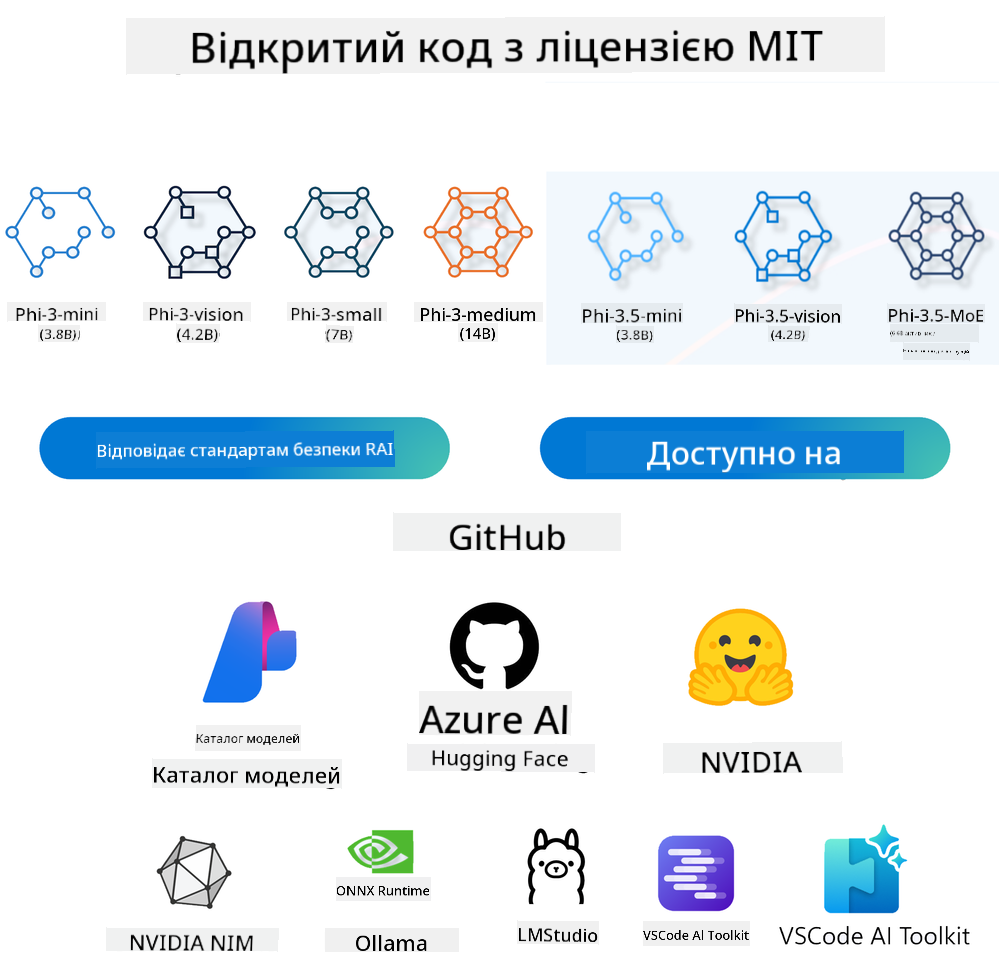

<!--
CO_OP_TRANSLATOR_METADATA:
{
  "original_hash": "124ad36cfe96f74038811b6e2bb93e9d",
  "translation_date": "2025-07-09T18:54:05+00:00",
  "source_file": "19-slm/README.md",
  "language_code": "uk"
}
-->
# Вступ до малих мовних моделей для генеративного ШІ для початківців  
Генеративний ШІ — це захоплююча галузь штучного інтелекту, яка зосереджена на створенні систем, здатних генерувати новий контент. Цей контент може варіюватися від тексту та зображень до музики і навіть цілих віртуальних середовищ. Одним із найцікавіших застосувань генеративного ШІ є мовні моделі.

## Що таке малі мовні моделі?  

Мала мовна модель (SLM) — це спрощена версія великої мовної моделі (LLM), яка використовує багато архітектурних принципів і технік LLM, але має значно менші обчислювальні вимоги.

SLM — це підмножина мовних моделей, призначених для генерації тексту, схожого на людський. На відміну від більших моделей, таких як GPT-4, SLM є компактнішими та ефективнішими, що робить їх ідеальними для застосувань із обмеженими обчислювальними ресурсами. Незважаючи на менший розмір, вони можуть виконувати різноманітні завдання. Зазвичай SLM створюють шляхом стиснення або дистиляції LLM, прагнучи зберегти значну частину функціональності та мовних можливостей оригінальної моделі. Зменшення розміру моделі знижує загальну складність, роблячи SLM більш ефективними як з точки зору використання пам’яті, так і обчислювальних ресурсів. Незважаючи на ці оптимізації, SLM можуть виконувати широкий спектр завдань обробки природної мови (NLP):

- Генерація тексту: створення зв’язних і контекстуально релевантних речень або абзаців.  
- Доповнення тексту: передбачення та завершення речень на основі заданого запиту.  
- Переклад: конвертація тексту з однієї мови на іншу.  
- Резюмування: скорочення довгих текстів до коротших, більш зрозумілих викладів.  

Хоча й з певними компромісами у продуктивності чи глибині розуміння порівняно з більшими моделями.

## Як працюють малі мовні моделі?  
SLM навчаються на величезних обсягах текстових даних. Під час навчання вони вивчають закономірності та структури мови, що дозволяє їм генерувати граматично правильний і контекстуально доречний текст. Процес навчання включає:

- Збір даних: накопичення великих наборів текстів із різних джерел.  
- Попередня обробка: очищення та організація даних для підготовки до навчання.  
- Навчання: використання алгоритмів машинного навчання для навчання моделі розуміти та генерувати текст.  
- Тонке налаштування: коригування моделі для покращення її продуктивності у конкретних завданнях.  

Розробка SLM відповідає зростаючій потребі в моделях, які можна розгортати в умовах обмежених ресурсів, наприклад, на мобільних пристроях або платформах edge computing, де повноцінні LLM можуть бути непрактичними через великі вимоги до ресурсів. Орієнтуючись на ефективність, SLM знаходять баланс між продуктивністю та доступністю, що дозволяє ширше застосовувати їх у різних сферах.


## Навчальні цілі  

У цьому уроці ми прагнемо ознайомити з поняттям SLM і поєднати це з Microsoft Phi-3, щоб вивчити різні сценарії роботи з текстовим контентом, зображеннями та MoE.

До кінця уроку ви зможете відповісти на такі питання:

- Що таке SLM  
- У чому різниця між SLM і LLM  
- Що таке Microsoft Phi-3/3.5 Family  
- Як робити інференс моделей Microsoft Phi-3/3.5 Family  

Готові? Почнемо.

## Відмінності між великими мовними моделями (LLM) та малими мовними моделями (SLM)  

І LLM, і SLM базуються на основах ймовірнісного машинного навчання, застосовуючи схожі підходи в архітектурі, методах навчання, процесах генерації даних і оцінці моделей. Проте існує кілька ключових факторів, які відрізняють ці два типи моделей.

## Застосування малих мовних моделей  

SLM мають широкий спектр застосувань, зокрема:

- Чатботи: надання підтримки клієнтам і взаємодія з користувачами у форматі діалогу.  
- Створення контенту: допомога авторам у генерації ідей або навіть написанні цілих статей.  
- Освіта: підтримка студентів у написанні робіт або вивченні нових мов.  
- Доступність: створення інструментів для людей з інвалідністю, наприклад, систем перетворення тексту в мову.  

**Розмір**  

Головна відмінність між LLM і SLM полягає в масштабі моделей. LLM, такі як ChatGPT (GPT-4), можуть містити приблизно 1,76 трильйона параметрів, тоді як відкриті SLM, наприклад Mistral 7B, мають значно менше — близько 7 мільярдів параметрів. Ця різниця зумовлена архітектурою та процесами навчання. Наприклад, ChatGPT використовує механізм самоуваги в рамках енкодер-декодерної архітектури, тоді як Mistral 7B застосовує ковзне вікно уваги, що дозволяє ефективніше навчатися в декодерній моделі. Ця архітектурна відмінність суттєво впливає на складність і продуктивність моделей.

**Розуміння**  

SLM зазвичай оптимізовані для роботи в конкретних доменах, що робить їх високоспеціалізованими, але потенційно обмеженими у здатності забезпечувати широкий контекстуальний огляд у різних сферах знань. Натомість LLM прагнуть імітувати людський інтелект на більш комплексному рівні. Навчені на великих і різноманітних наборах даних, LLM добре працюють у різних доменах, пропонуючи більшу універсальність і адаптивність. Тому LLM краще підходять для широкого спектра завдань, таких як обробка природної мови та програмування.

**Обчислювальні ресурси**  

Навчання та розгортання LLM вимагають значних ресурсів, часто потребуючи великих кластерів GPU. Наприклад, навчання ChatGPT з нуля може займати тисячі GPU протягом тривалого часу. Натомість SLM із меншим числом параметрів доступніші з точки зору обчислювальних ресурсів. Моделі на кшталт Mistral 7B можна навчати і запускати на локальних машинах із помірними GPU, хоча навчання все одно потребує кількох годин на кількох GPU.

**Упередження**  

Упередження — відома проблема LLM, що виникає через характер навчальних даних. Ці моделі часто використовують сирі відкриті дані з інтернету, які можуть недостатньо або неправильно представляти певні групи, містити помилкові позначки або відображати мовні упередження, пов’язані з діалектами, географічними варіаціями та граматичними правилами. Крім того, складність архітектури LLM може посилювати упередження, які можуть залишатися непоміченими без ретельного тонкого налаштування. Натомість SLM, навчені на більш обмежених, домен-специфічних наборах даних, менш схильні до таких упереджень, хоча й не повністю їх позбавлені.

**Інференс**  

Менший розмір SLM дає їм значну перевагу в швидкості інференсу, дозволяючи ефективно генерувати результати на локальному обладнанні без потреби у великій паралельній обробці. LLM через свій розмір і складність часто потребують значних паралельних обчислювальних ресурсів для досягнення прийнятного часу відповіді. Наявність багатьох одночасних користувачів додатково уповільнює час відгуку LLM, особливо при масштабному розгортанні.

Підсумовуючи, хоча LLM і SLM мають спільну основу в машинному навчанні, вони суттєво відрізняються за розміром моделі, вимогами до ресурсів, глибиною контекстуального розуміння, схильністю до упереджень і швидкістю інференсу. Ці відмінності визначають їхню придатність для різних випадків використання: LLM більш універсальні, але ресурсомісткі, тоді як SLM пропонують ефективність у вузьких доменах із меншими обчислювальними затратами.

***Note：У цій главі ми розглянемо SLM на прикладі Microsoft Phi-3 / 3.5.***

## Ознайомлення з сімейством Phi-3 / Phi-3.5  

Phi-3 / 3.5 Family орієнтовані на сценарії застосування в тексті, зображеннях та агентських системах (MoE):

### Phi-3 / 3.5 Instruct  

Головним чином для генерації тексту, завершення діалогів і вилучення інформації з контенту.

**Phi-3-mini**  

Модель з 3.8 млрд параметрів доступна в Microsoft Azure AI Studio, Hugging Face та Ollama. Моделі Phi-3 значно перевершують мовні моделі рівного або більшого розміру за ключовими бенчмарками (див. нижче, вищі значення кращі). Phi-3-mini перевершує моделі вдвічі більшого розміру, а Phi-3-small і Phi-3-medium — більші моделі, включно з GPT-3.5.

**Phi-3-small & medium**  

З усього 7 млрд параметрів Phi-3-small перевершує GPT-3.5T у різних мовних, логічних, програмних та математичних тестах.

Phi-3-medium з 14 млрд параметрів продовжує цю тенденцію і перевершує Gemini 1.0 Pro.

**Phi-3.5-mini**  

Можна розглядати як оновлення Phi-3-mini. Хоча кількість параметрів не змінилася, модель покращила підтримку багатомовності (підтримка понад 20 мов: арабська, китайська, чеська, данська, нідерландська, англійська, фінська, французька, німецька, іврит, угорська, італійська, японська, корейська, норвезька, польська, португальська, російська, іспанська, шведська, тайська, турецька, українська) та додала кращу підтримку довгих контекстів.

Phi-3.5-mini з 3.8 млрд параметрів перевершує мовні моделі того ж розміру і зрівнюється з моделями вдвічі більшого розміру.

### Phi-3 / 3.5 Vision  

Модель Instruct Phi-3/3.5 можна розглядати як здатність Phi розуміти, а Vision дає Phi «очі» для розуміння світу.

**Phi-3-Vision**  

Phi-3-Vision з усього 4.2 млрд параметрів продовжує цю тенденцію і перевершує більші моделі, такі як Claude-3 Haiku і Gemini 1.0 Pro V, у завданнях загального візуального мислення, OCR, а також розумінні таблиць і діаграм.

**Phi-3.5-Vision**  

Phi-3.5-Vision — це оновлення Phi-3-Vision, яке додає підтримку кількох зображень. Можна сказати, що це покращення зору: тепер модель може не лише бачити картинки, а й відео.

Phi-3.5-Vision перевершує більші моделі, такі як Claude-3.5 Sonnet і Gemini 1.5 Flash, у завданнях OCR, розумінні таблиць і графіків, а також зрівнюється з ними у загальних завданнях візуального мислення. Підтримує багатокадровий ввід, тобто може виконувати логічні операції над кількома зображеннями одночасно.

### Phi-3.5-MoE  

***Mixture of Experts (MoE)*** дозволяє моделі проходити попереднє навчання з набагато меншими обчислювальними затратами, що означає можливість значно масштабувати розмір моделі або набору даних при тому ж бюджеті обчислень, що й для щільної моделі. Зокрема, MoE-модель має досягати такої ж якості, як її щільний аналог, значно швидше під час попереднього навчання.

Phi-3.5-MoE складається з 16 експертних модулів по 3.8 млрд параметрів кожен. Phi-3.5-MoE з усього 6.6 млрд активних параметрів досягає рівня логічного мислення, розуміння мови та математики, порівнянного з набагато більшими моделями.

Модель сімейства Phi-3/3.5 можна використовувати в різних сценаріях. На відміну від LLM, Phi-3/3.5-mini або Phi-3/3.5-Vision можна розгортати на edge-пристроях.

## Як використовувати моделі сімейства Phi-3/3.5  

Ми прагнемо застосовувати Phi-3/3.5 у різних сценаріях. Далі ми розглянемо використання Phi-3/3.5 у різних випадках.



### Відмінності інференсу через API хмари  

**GitHub Models**  

GitHub Models — найпряміший спосіб. Ви можете швидко отримати доступ до моделі Phi-3/3.5-Instruct через GitHub Models. У поєднанні з Azure AI Inference SDK / OpenAI SDK можна звертатися до API через код для виклику Phi-3/3.5-Instruct. Також можна тестувати різні результати через Playground.

- Демонстрація: порівняння ефектів Phi-3-mini і Phi-3.5-mini у китайськомовних сценаріях


**Azure AI Studio**  

Якщо ж ви хочете використовувати моделі для зору та MoE, можна звертатися через Azure AI Studio. Якщо цікаво, можна ознайомитися з Phi-3 Cookbook, щоб дізнатися, як викликати Phi-3/3.5 Instruct, Vision, MoE через Azure AI Studio [Перейти за посиланням](https://github.com/microsoft/Phi-3CookBook/blob/main/md/02.QuickStart/AzureAIStudio_QuickStart.md?WT.mc_id=academic-105485-koreyst)

**NVIDIA NIM**  

Окрім хмарних рішень Model Catalog від Azure і GitHub, ви також можете використовувати [NVIDIA NIM](https://developer.nvidia.com/nim?WT.mc_id=academic-105485-koreyst) для виконання відповідних викликів. Ви можете відвідати NVIDIA NIM, щоб здійснювати API-виклики сімейства Phi-3/3.5. NVIDIA NIM (NVIDIA Inference Microservices) — це набір прискорених мікросервісів для інференсу, які допомагають розробникам ефективно розгортати AI-моделі в різних середовищах, включно з хмарами, дата-центрами та робочими станціями.

Основні особливості NVIDIA NIM:

- **Простота розгортання:** NIM дозволяє розгортати AI-моделі однією командою, що спрощує інтеграцію у наявні робочі процеси.  
- **Оптимізована продуктивність:** Використовує попередньо оптимізовані інференс-двигуни NVIDIA, такі як TensorRT і TensorRT-LLM, для забезпечення низької затримки та високої пропускної здатності.  
-
- **Безпека та контроль:** Організації можуть зберігати контроль над своїми даними та додатками, розміщуючи мікросервіси NIM на власній керованій інфраструктурі.
- **Стандартні API:** NIM надає галузеві стандартизовані API, що полегшує створення та інтеграцію AI-додатків, таких як чатботи, AI-помічники та інше.

NIM є частиною NVIDIA AI Enterprise, яка спрямована на спрощення розгортання та експлуатації AI-моделей, забезпечуючи їх ефективну роботу на GPU NVIDIA.

- Демонстрація: Використання Nvidia NIM для виклику Phi-3.5-Vision-API  [[Перейти за посиланням](python/Phi-3-Vision-Nividia-NIM.ipynb)]


### Інференс Phi-3/3.5 у локальному середовищі
Інференс у контексті Phi-3 або будь-якої мовної моделі, як-от GPT-3, означає процес генерації відповідей або прогнозів на основі отриманого вводу. Коли ви надаєте запит або питання Phi-3, модель використовує свою навчальну нейронну мережу, щоб визначити найбільш ймовірну та релевантну відповідь, аналізуючи закономірності та зв’язки у даних, на яких вона була навчена.

**Hugging Face Transformer**  
Hugging Face Transformers — це потужна бібліотека, призначена для обробки природної мови (NLP) та інших завдань машинного навчання. Ось кілька ключових моментів про неї:

1. **Попередньо навчені моделі:** Надає тисячі попередньо навчених моделей для різних завдань, таких як класифікація тексту, розпізнавання іменованих сутностей, відповіді на запитання, реферування, переклад і генерація тексту.

2. **Інтероперабельність фреймворків:** Підтримує кілька фреймворків глибокого навчання, включно з PyTorch, TensorFlow та JAX. Це дозволяє навчати модель у одному фреймворку та використовувати її в іншому.

3. **Мультимодальні можливості:** Окрім NLP, Hugging Face Transformers підтримує завдання комп’ютерного зору (наприклад, класифікація зображень, виявлення об’єктів) та обробки аудіо (наприклад, розпізнавання мови, класифікація аудіо).

4. **Зручність використання:** Бібліотека пропонує API та інструменти для легкого завантаження та донавчання моделей, що робить її доступною як для початківців, так і для експертів.

5. **Спільнота та ресурси:** Hugging Face має активну спільноту та велику кількість документації, навчальних матеріалів і посібників, які допомагають користувачам швидко почати роботу та максимально ефективно використовувати бібліотеку.  
[офіційна документація](https://huggingface.co/docs/transformers/index?WT.mc_id=academic-105485-koreyst) або їхній [репозиторій на GitHub](https://github.com/huggingface/transformers?WT.mc_id=academic-105485-koreyst).

Це найпоширеніший метод, але він також вимагає апаратного прискорення на GPU. Адже такі сценарії, як Vision та MoE, потребують великої кількості обчислень, які на CPU будуть дуже обмеженими, якщо не застосовувати квантизацію.


- Демонстрація: Використання Transformer для виклику Phi-3.5-Instuct [Перейти за посиланням](python/phi35-instruct-demo.ipynb)

- Демонстрація: Використання Transformer для виклику Phi-3.5-Vision [Перейти за посиланням](python/phi35-vision-demo.ipynb)

- Демонстрація: Використання Transformer для виклику Phi-3.5-MoE [Перейти за посиланням](python/phi35_moe_demo.ipynb)

**Ollama**  
[Ollama](https://ollama.com/?WT.mc_id=academic-105485-koreyst) — це платформа, створена для спрощення запуску великих мовних моделей (LLM) локально на вашому комп’ютері. Вона підтримує різні моделі, такі як Llama 3.1, Phi 3, Mistral, Gemma 2 та інші. Платформа спрощує процес, об’єднуючи ваги моделей, конфігурації та дані в один пакет, що робить її більш доступною для користувачів, які хочуть налаштовувати та створювати власні моделі. Ollama доступна для macOS, Linux та Windows. Це чудовий інструмент, якщо ви хочете експериментувати з LLM або розгортати їх без залежності від хмарних сервісів. Ollama — найпростіший спосіб, вам лише потрібно виконати наступну команду.


```bash

ollama run phi3.5

```


**ONNX Runtime для GenAI**

[ONNX Runtime](https://github.com/microsoft/onnxruntime-genai?WT.mc_id=academic-105485-koreyst) — це кросплатформовий прискорювач для інференсу та навчання моделей машинного навчання. ONNX Runtime для Generative AI (GENAI) — потужний інструмент, який допомагає ефективно запускати генеративні AI-моделі на різних платформах.

## Що таке ONNX Runtime?  
ONNX Runtime — це проект з відкритим кодом, який забезпечує високопродуктивний інференс моделей машинного навчання. Він підтримує моделі у форматі Open Neural Network Exchange (ONNX), який є стандартом для представлення моделей машинного навчання. Інференс ONNX Runtime може забезпечити швидший досвід користувача та знизити витрати, підтримуючи моделі з фреймворків глибокого навчання, таких як PyTorch і TensorFlow/Keras, а також класичні бібліотеки машинного навчання, як-от scikit-learn, LightGBM, XGBoost тощо. ONNX Runtime сумісний з різним апаратним забезпеченням, драйверами та операційними системами, забезпечуючи оптимальну продуктивність за рахунок використання апаратних прискорювачів, а також оптимізацій графів і трансформацій.

## Що таке Generative AI?  
Generative AI — це системи штучного інтелекту, які можуть створювати новий контент, такий як текст, зображення або музика, на основі даних, на яких вони були навчені. Прикладами є мовні моделі, як GPT-3, та моделі генерації зображень, як Stable Diffusion. Бібліотека ONNX Runtime для GenAI забезпечує цикл генеративного AI для ONNX-моделей, включно з інференсом за допомогою ONNX Runtime, обробкою логітів, пошуком і семплінгом, а також керуванням кешем KV.

## ONNX Runtime для GENAI  
ONNX Runtime для GENAI розширює можливості ONNX Runtime для підтримки генеративних AI-моделей. Ось деякі ключові особливості:

- **Широка підтримка платформ:** Працює на різних платформах, включно з Windows, Linux, macOS, Android та iOS.
- **Підтримка моделей:** Підтримує багато популярних генеративних AI-моделей, таких як LLaMA, GPT-Neo, BLOOM та інші.
- **Оптимізація продуктивності:** Включає оптимізації для різного апаратного прискорення, наприклад NVIDIA GPU, AMD GPU тощо.
- **Зручність використання:** Надає API для легкої інтеграції в додатки, дозволяючи генерувати текст, зображення та інший контент з мінімальним кодом.
- Користувачі можуть викликати високорівневий метод generate() або запускати кожну ітерацію моделі в циклі, генеруючи по одному токену за раз і за бажанням оновлюючи параметри генерації всередині циклу.
- ONNX Runtime також підтримує жадібний/променевий пошук і семплінг TopP, TopK для генерації послідовностей токенів, а також вбудовану обробку логітів, наприклад штрафи за повторення. Ви також можете легко додавати власні оцінки.

## Початок роботи  
Щоб почати працювати з ONNX Runtime для GENAI, виконайте наступні кроки:

### Встановіть ONNX Runtime:  
```Python
pip install onnxruntime
```  
### Встановіть розширення Generative AI:  
```Python
pip install onnxruntime-genai
```

### Запустіть модель: Ось простий приклад на Python:  
```Python
import onnxruntime_genai as og

model = og.Model('path_to_your_model.onnx')

tokenizer = og.Tokenizer(model)

input_text = "Hello, how are you?"

input_tokens = tokenizer.encode(input_text)

output_tokens = model.generate(input_tokens)

output_text = tokenizer.decode(output_tokens)

print(output_text) 
```  
### Демонстрація: Використання ONNX Runtime GenAI для виклику Phi-3.5-Vision


```python

import onnxruntime_genai as og

model_path = './Your Phi-3.5-vision-instruct ONNX Path'

img_path = './Your Image Path'

model = og.Model(model_path)

processor = model.create_multimodal_processor()

tokenizer_stream = processor.create_stream()

text = "Your Prompt"

prompt = "<|user|>\n"

prompt += "<|image_1|>\n"

prompt += f"{text}<|end|>\n"

prompt += "<|assistant|>\n"

image = og.Images.open(img_path)

inputs = processor(prompt, images=image)

params = og.GeneratorParams(model)

params.set_inputs(inputs)

params.set_search_options(max_length=3072)

generator = og.Generator(model, params)

while not generator.is_done():

    generator.compute_logits()
    
    generator.generate_next_token()

    new_token = generator.get_next_tokens()[0]
    
    code += tokenizer_stream.decode(new_token)
    
    print(tokenizer_stream.decode(new_token), end='', flush=True)

```


**Інше**

Окрім ONNX Runtime та Ollama, можна також використовувати методи, що базуються на референсних моделях різних виробників, для завершення підтримки кількісних моделей. Наприклад, Apple MLX framework з Apple Metal, Qualcomm QNN з NPU, Intel OpenVINO з CPU/GPU тощо. Більше інформації можна знайти у [Phi-3 Cookbook](https://github.com/microsoft/phi-3cookbook?WT.mc_id=academic-105485-koreyst).


## Більше

Ми ознайомилися з основами сімейства Phi-3/3.5, але щоб дізнатися більше про SLM, потрібні додаткові знання. Відповіді можна знайти у Phi-3 Cookbook. Якщо хочете дізнатися більше, будь ласка, відвідайте [Phi-3 Cookbook](https://github.com/microsoft/phi-3cookbook?WT.mc_id=academic-105485-koreyst).

**Відмова від відповідальності**:  
Цей документ було перекладено за допомогою сервісу автоматичного перекладу [Co-op Translator](https://github.com/Azure/co-op-translator). Хоча ми прагнемо до точності, будь ласка, майте на увазі, що автоматичні переклади можуть містити помилки або неточності. Оригінальний документ рідною мовою слід вважати авторитетним джерелом. Для критично важливої інформації рекомендується звертатися до професійного людського перекладу. Ми не несемо відповідальності за будь-які непорозуміння або неправильні тлумачення, що виникли внаслідок використання цього перекладу.