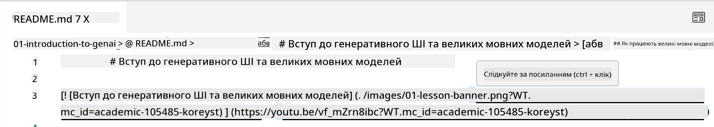
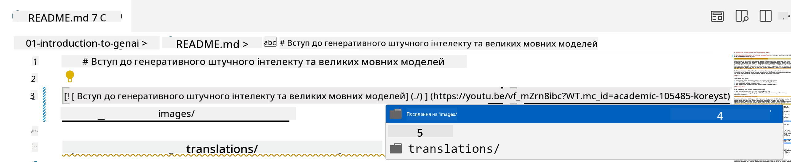
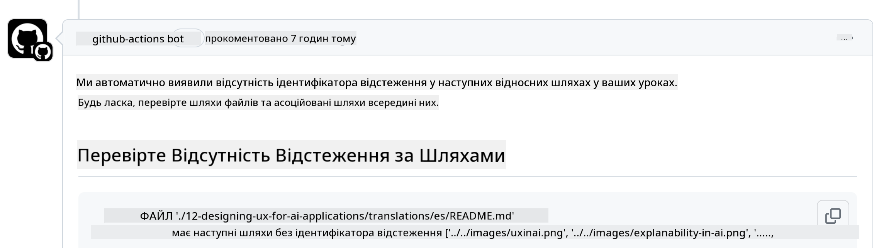
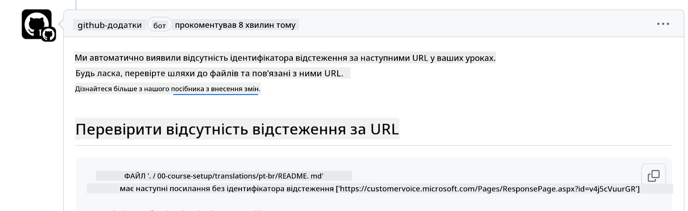
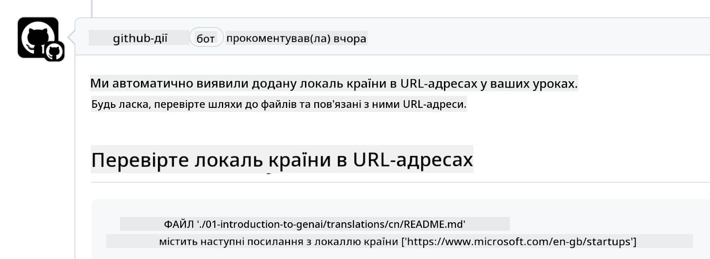

<!--
CO_OP_TRANSLATOR_METADATA:
{
  "original_hash": "57c41f2af71001a2cff9d8eb797cb843",
  "translation_date": "2025-06-25T07:24:25+00:00",
  "source_file": "CONTRIBUTING.md",
  "language_code": "uk"
}
-->
# Участь у проекті

Цей проект вітає внески та пропозиції. Більшість внесків вимагають від вас погодження з Ліцензійною угодою для учасників (CLA), яка підтверджує, що ви маєте право надавати нам права на використання вашого внеску. Для деталей відвідайте <https://cla.microsoft.com>.

> Важливо: при перекладі тексту в цьому репозиторії, будь ласка, переконайтеся, що ви не використовуєте машинний переклад. Ми перевіримо переклади через спільноту, тому будь ласка, долучайтеся до перекладів лише на ті мови, в яких ви добре розбираєтеся.

Коли ви надсилаєте запит на злиття, бот CLA автоматично визначить, чи потрібно вам надати CLA, і відповідним чином прикрасить PR (наприклад, мітка, коментар). Просто дотримуйтесь інструкцій, наданих ботом. Це потрібно зробити лише один раз для всіх репозиторіїв, що використовують наш CLA.

## Кодекс поведінки

Цей проект прийняв [Кодекс поведінки Microsoft Open Source](https://opensource.microsoft.com/codeofconduct/?WT.mc_id=academic-105485-koreyst). Для отримання додаткової інформації прочитайте [FAQ Кодексу поведінки](https://opensource.microsoft.com/codeofconduct/faq/?WT.mc_id=academic-105485-koreyst) або зв'яжіться з [opencode@microsoft.com](mailto:opencode@microsoft.com) з будь-якими додатковими питаннями чи коментарями.

## Питання чи проблема?

Будь ласка, не відкривайте проблеми GitHub для загальних питань підтримки, оскільки список GitHub слід використовувати для запитів на функції та звітів про помилки. Таким чином, ми можемо легше відстежувати фактичні проблеми або помилки з коду та тримати загальне обговорення окремо від фактичного коду.

## Помилки, проблеми, баги та внески

Коли ви вносите будь-які зміни до репозиторію "Генеративний AI для початківців", будь ласка, дотримуйтесь цих рекомендацій.

* Завжди створюйте відгалуження репозиторію у свій власний акаунт перед внесенням змін
* Не поєднуйте кілька змін в одному запиті на злиття. Наприклад, надсилайте виправлення багів і оновлення документації окремими PR
* Якщо ваш запит на злиття показує конфлікти злиття, переконайтеся, що ви оновили свій локальний main, щоб він відображав те, що знаходиться в основному репозиторії перед внесенням змін
* Якщо ви подаєте переклад, будь ласка, створіть один PR для всіх перекладених файлів, оскільки ми не приймаємо часткові переклади для вмісту
* Якщо ви подаєте виправлення помилок чи документації, ви можете об'єднати зміни в один PR, де це доречно

## Загальні рекомендації щодо написання

- Переконайтеся, що всі ваші URL-адреси обгорнуті у квадратні дужки, за якими йде кругла дужка без додаткових пробілів навколо них або всередині них ``.
- Переконайтеся, що будь-яке відносне посилання (тобто посилання на інші файли та папки в репозиторії) починається з `./`, що стосується файлу або папки, розташованих у поточному робочому каталозі, або `../`, що стосується файлу або папки, розташованих у батьківському робочому каталозі.
- Переконайтеся, що будь-яке відносне посилання (тобто посилання на інші файли та папки в репозиторії) має ідентифікатор відстеження (тобто `?` або `&`, потім `wt.mc_id=` або `WT.mc_id=`) в кінці його.
- Переконайтеся, що будь-яка URL-адреса з таких доменів _github.com, microsoft.com, visualstudio.com, aka.ms і azure.com_ має ідентифікатор відстеження (тобто `?` або `&`, потім `wt.mc_id=` або `WT.mc_id=`) в кінці її.
- Переконайтеся, що ваші посилання не містять локальних налаштувань для певної країни (тобто `/en-us/` або `/en/`).
- Переконайтеся, що всі зображення зберігаються в папці `./images`.
- Переконайтеся, що зображення мають описові назви, використовуючи англійські символи, цифри та дефіси в назві вашого зображення.

## Робочі процеси GitHub

Коли ви надсилаєте запит на злиття, буде запущено чотири різні робочі процеси для перевірки попередніх правил.
Просто дотримуйтесь інструкцій, наведених тут, щоб пройти перевірки робочих процесів.

- [Перевірка зламаних відносних шляхів](../..)
- [Перевірка шляхів з відстеженням](../..)
- [Перевірка URL-адрес з відстеженням](../..)
- [Перевірка URL-адрес без локалі](../..)

### Перевірка зламаних відносних шляхів

Цей робочий процес гарантує, що будь-який відносний шлях у ваших файлах працює.
Цей репозиторій розгорнуто на сторінках GitHub, тому вам потрібно бути дуже уважними, коли ви вводите посилання, які з'єднують все разом, щоб не направити нікого в неправильне місце.

Щоб переконатися, що ваші посилання працюють належним чином, просто використовуйте VS code, щоб перевірити це.

Наприклад, коли ви наведете курсор на будь-яке посилання у ваших файлах, вам буде запропоновано перейти за посиланням, натиснувши **ctrl + click**

Якщо ви натиснете на посилання і воно не працює локально, то, безумовно, це запустить робочий процес і не працюватиме на GitHub.

Щоб виправити цю проблему, спробуйте ввести посилання за допомогою VS code.

Коли ви вводите `./` або `../`, VS code запропонує вам вибрати з доступних варіантів відповідно до того, що ви ввели.

Перейдіть за шляхом, натиснувши на потрібний файл або папку, і ви будете впевнені, що ваш шлях не зламаний.

Після того, як ви додасте правильний відносний шлях, збережіть і відправте свої зміни, робочий процес буде запущено знову для перевірки ваших змін.
Якщо ви пройдете перевірку, то ви готові продовжувати.

### Перевірка шляхів з відстеженням

Цей робочий процес гарантує, що будь-який відносний шлях має в собі відстеження.
Цей репозиторій розгорнуто на сторінках GitHub, тому нам потрібно відстежувати переміщення між різними файлами та папками.

Щоб переконатися, що ваші відносні шляхи мають відстеження, просто перевірте наявність наступного тексту `?wt.mc_id=` в кінці шляху.
Якщо це додано до ваших відносних шляхів, то ви пройдете цю перевірку.

Якщо ні, ви можете отримати наступну помилку.

Щоб виправити цю проблему, спробуйте відкрити шлях до файлу, який підсвічено в робочому процесі, і додати ідентифікатор відстеження до кінця відносних шляхів.

Після того, як ви додасте ідентифікатор відстеження, збережіть і відправте свої зміни, робочий процес буде запущено знову для перевірки ваших змін.
Якщо ви пройдете перевірку, то ви готові продовжувати.

### Перевірка URL-адрес з відстеженням

Цей робочий процес гарантує, що будь-яка веб-URL-адреса має в собі відстеження.
Цей репозиторій доступний для всіх, тому вам потрібно переконатися, що ви відстежуєте доступ, щоб знати, звідки йде трафік.

Щоб переконатися, що ваші URL-адреси мають в собі відстеження, просто перевірте наявність наступного тексту `?wt.mc_id=` в кінці URL-адреси.
Якщо це додано до ваших URL-адрес, то ви пройдете цю перевірку.

Якщо ні, ви можете отримати наступну помилку.

Щоб виправити цю проблему, спробуйте відкрити шлях до файлу, який підсвічено в робочому процесі, і додати ідентифікатор відстеження до кінця URL-адрес.

Після того, як ви додасте ідентифікатор відстеження, збережіть і відправте свої зміни, робочий процес буде запущено знову для перевірки ваших змін.
Якщо ви пройдете перевірку, то ви готові продовжувати.

### Перевірка URL-адрес без локалі

Цей робочий процес гарантує, що будь-яка веб-URL-адреса не має в собі локальних налаштувань для певної країни.
Цей репозиторій доступний для всіх у всьому світі, тому вам потрібно переконатися, що ви не включаєте локальні налаштування своєї країни в URL-адреси.

Щоб переконатися, що ваші URL-адреси не мають локальних налаштувань країни, просто перевірте наявність наступного тексту `/en-us/` або `/en/` або будь-якої іншої локалі мови у будь-якому місці URL-адреси.
Якщо це відсутнє у ваших URL-адресах, то ви пройдете цю перевірку.

Якщо ні, ви можете отримати наступну помилку.

Щоб виправити цю проблему, спробуйте відкрити шлях до файлу, який підсвічено в робочому процесі, і видалити локаль країни з URL-адрес.

Після того, як ви видалите локаль країни, збережіть і відправте свої зміни, робочий процес буде запущено знову для перевірки ваших змін.
Якщо ви пройдете перевірку, то ви готові продовжувати.

Вітаємо! Ми зв'яжемося з вами якомога швидше з відгуками про ваш внесок.

**Відмова від відповідальності**:  
Цей документ було перекладено за допомогою сервісу автоматичного перекладу [Co-op Translator](https://github.com/Azure/co-op-translator). Хоча ми прагнемо точності, зверніть увагу, що автоматичні переклади можуть містити помилки або неточності. Оригінальний документ на його рідній мові слід вважати авторитетним джерелом. Для отримання критичної інформації рекомендується професійний переклад людиною. Ми не несемо відповідальності за будь-які непорозуміння або неправильні тлумачення, що виникають внаслідок використання цього перекладу.