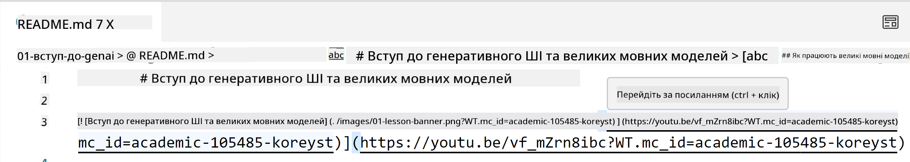
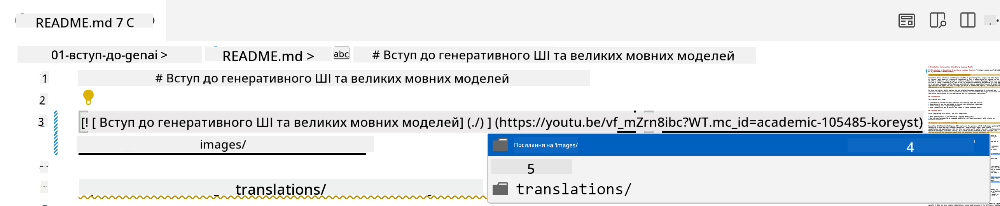
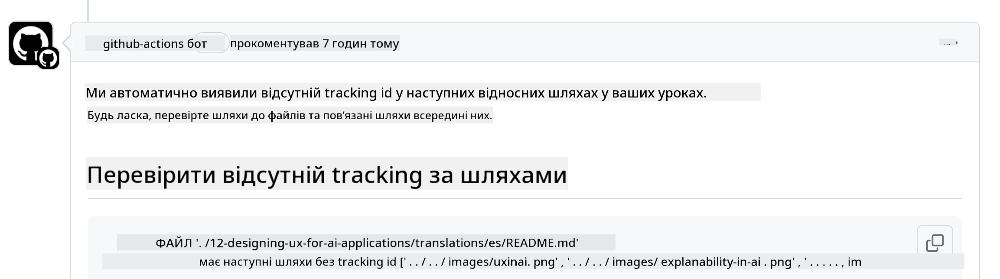
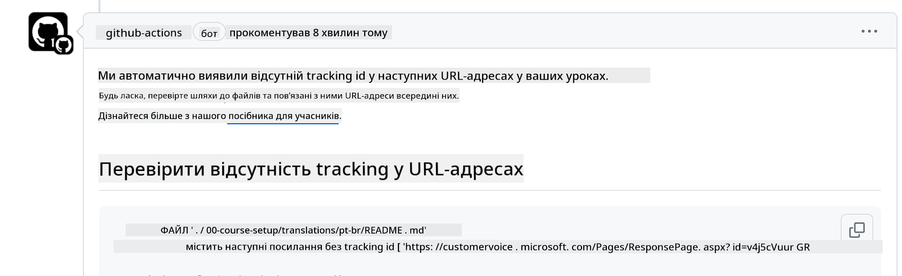
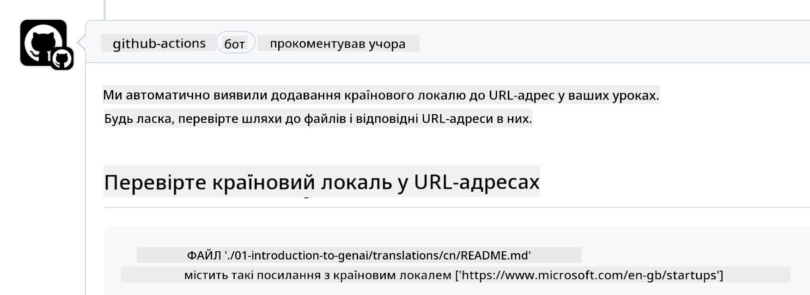

<!--
CO_OP_TRANSLATOR_METADATA:
{
  "original_hash": "57c41f2af71001a2cff9d8eb797cb843",
  "translation_date": "2025-07-09T06:14:38+00:00",
  "source_file": "CONTRIBUTING.md",
  "language_code": "uk"
}
-->
# Внесок у проєкт

Цей проєкт вітає внески та пропозиції. Більшість внесків вимагають, щоб ви погодилися з Угодою про ліцензію для контриб’юторів (CLA), яка підтверджує, що ви маєте право і фактично надаєте нам права на використання вашого внеску. Деталі можна знайти на <https://cla.microsoft.com>.

> Важливо: при перекладі тексту в цьому репозиторії, будь ласка, не використовуйте машинний переклад. Ми перевірятимемо переклади через спільноту, тому беріть участь у перекладах лише тих мов, якими ви володієте.

Коли ви надсилаєте pull request, CLA-бот автоматично визначить, чи потрібно вам надати CLA, і відповідно позначить PR (наприклад, міткою або коментарем). Просто дотримуйтесь інструкцій бота. Вам потрібно буде зробити це лише один раз для всіх репозиторіїв, які використовують нашу CLA.

## Кодекс поведінки

Цей проєкт прийняв [Microsoft Open Source Code of Conduct](https://opensource.microsoft.com/codeofconduct/?WT.mc_id=academic-105485-koreyst).
Для отримання додаткової інформації прочитайте [Поширені запитання щодо Кодексу поведінки](https://opensource.microsoft.com/codeofconduct/faq/?WT.mc_id=academic-105485-koreyst) або звертайтеся за адресою [opencode@microsoft.com](mailto:opencode@microsoft.com) з будь-якими додатковими питаннями чи коментарями.

## Питання чи проблема?

Будь ласка, не створюйте GitHub issues для загальних питань підтримки, оскільки список GitHub призначений для запитів на функції та звітів про помилки. Це допоможе нам легше відслідковувати реальні проблеми або баги в коді та тримати загальне обговорення окремо від коду.

## Опечатки, проблеми, баги та внески

Коли ви вносите будь-які зміни до репозиторію Generative AI for Beginners, дотримуйтесь цих рекомендацій.

* Завжди форкайте репозиторій у свій акаунт перед внесенням змін
* Не об’єднуйте кілька змін в один pull request. Наприклад, надсилайте виправлення багів і оновлення документації окремими PR
* Якщо ваш pull request має конфлікти злиття, переконайтеся, що ваш локальний main відображає стан основного репозиторію перед внесенням змін
* Якщо ви надсилаєте переклад, створіть один PR для всіх перекладених файлів, оскільки ми не приймаємо часткові переклади контенту
* Якщо ви надсилаєте виправлення опечаток або документації, можна об’єднати зміни в один PR, якщо це доречно

## Загальні рекомендації щодо написання

- Переконайтеся, що всі ваші URL-адреси обгорнуті в квадратні дужки, за якими слідують круглі дужки без зайвих пробілів ``.
- Переконайтеся, що будь-яке відносне посилання (тобто посилання на інші файли та папки в репозиторії) починається з `./` (файл або папка в поточній робочій директорії) або `../` (файл або папка в батьківській директорії).
- Переконайтеся, що будь-яке відносне посилання має в кінці ідентифікатор відстеження (наприклад, `?` або `&`, а потім `wt.mc_id=` або `WT.mc_id=`).
- Переконайтеся, що будь-який URL з доменів _github.com, microsoft.com, visualstudio.com, aka.ms, та azure.com_ має в кінці ідентифікатор відстеження (наприклад, `?` або `&`, а потім `wt.mc_id=` або `WT.mc_id=`).
- Переконайтеся, що у ваших посиланнях немає локалізації, специфічної для країни (наприклад, `/en-us/` або `/en/`).
- Переконайтеся, що всі зображення зберігаються в папці `./images`.
- Переконайтеся, що імена зображень описові, використовують англійські літери, цифри та дефіси.

## GitHub Workflows

Коли ви надсилаєте pull request, запускаються чотири різні робочі процеси для перевірки вищезазначених правил.
Просто дотримуйтесь інструкцій, наведених тут, щоб пройти перевірки.

- [Перевірка відносних шляхів на помилки](../..)
- [Перевірка наявності відстеження у шляхах](../..)
- [Перевірка наявності відстеження у URL](../..)
- [Перевірка відсутності локалізації у URL](../..)

### Перевірка відносних шляхів на помилки

Цей робочий процес перевіряє, чи працюють усі відносні шляхи у ваших файлах.
Цей репозиторій розгорнуто на GitHub pages, тому потрібно дуже уважно вводити посилання, щоб не направити користувача не туди.

Щоб переконатися, що ваші посилання працюють, просто використовуйте VS Code для перевірки.

Наприклад, коли ви наведете курсор на будь-яке посилання у файлах, вам запропонують перейти за ним, натиснувши **ctrl + клік**

Якщо ви натиснете на посилання і воно не працює локально, то, ймовірно, воно викличе помилку у робочому процесі і не працюватиме на GitHub.

Щоб виправити цю проблему, намагайтеся вводити посилання з допомогою VS Code.

Коли ви вводите `./` або `../`, VS Code запропонує вибрати з доступних варіантів відповідно до введеного.

Виберіть шлях, клацнувши потрібний файл або папку, і ви будете впевнені, що ваш шлях не пошкоджений.

Після того, як ви додасте правильний відносний шлях, збережіть і надішліть зміни — робочий процес знову перевірить ваші зміни.
Якщо перевірка пройдена, можна продовжувати.

### Перевірка наявності відстеження у шляхах

Цей робочий процес перевіряє, чи мають усі відносні шляхи відстеження.
Цей репозиторій розгорнуто на GitHub pages, тому нам потрібно відстежувати переміщення між файлами та папками.

Щоб переконатися, що у ваших відносних шляхах є відстеження, перевірте наявність тексту `?wt.mc_id=` в кінці шляху.
Якщо він доданий, ви пройдете цю перевірку.

Якщо ні, ви можете отримати таку помилку.

Щоб виправити цю проблему, відкрийте файл, на який вказав робочий процес, і додайте ідентифікатор відстеження в кінці відносних шляхів.

Після додавання ідентифікатора збережіть і надішліть зміни — робочий процес знову перевірить ваші зміни.
Якщо перевірка пройдена, можна продовжувати.

### Перевірка наявності відстеження у URL

Цей робочий процес перевіряє, чи мають усі веб-URL відстеження.
Цей репозиторій доступний усім, тому потрібно відстежувати доступ, щоб знати, звідки приходить трафік.

Щоб переконатися, що у ваших URL є відстеження, перевірте наявність тексту `?wt.mc_id=` в кінці URL.
Якщо він доданий, ви пройдете цю перевірку.

Якщо ні, ви можете отримати таку помилку.

Щоб виправити цю проблему, відкрийте файл, на який вказав робочий процес, і додайте ідентифікатор відстеження в кінці URL.

Після додавання ідентифікатора збережіть і надішліть зміни — робочий процес знову перевірить ваші зміни.
Якщо перевірка пройдена, можна продовжувати.

### Перевірка відсутності локалізації у URL

Цей робочий процес перевіряє, чи не містять веб-URL локалізацію, специфічну для країни.
Цей репозиторій доступний усім у світі, тому потрібно переконатися, що у URL не включено локалізацію вашої країни.

Щоб переконатися, що у ваших URL немає локалізації, перевірте наявність тексту `/en-us/` або `/en/` чи будь-якої іншої мовної локалізації у URL.
Якщо її немає, ви пройдете цю перевірку.

Якщо ні, ви можете отримати таку помилку.

Щоб виправити цю проблему, відкрийте файл, на який вказав робочий процес, і видаліть локалізацію країни з URL.

Після видалення локалізації збережіть і надішліть зміни — робочий процес знову перевірить ваші зміни.
Якщо перевірка пройдена, можна продовжувати.

Вітаємо! Ми зв’яжемося з вами якнайшвидше з відгуком щодо вашого внеску.

**Відмова від відповідальності**:  
Цей документ було перекладено за допомогою сервісу автоматичного перекладу [Co-op Translator](https://github.com/Azure/co-op-translator). Хоча ми прагнемо до точності, будь ласка, майте на увазі, що автоматичні переклади можуть містити помилки або неточності. Оригінальний документ рідною мовою слід вважати авторитетним джерелом. Для критично важливої інформації рекомендується звертатися до професійного людського перекладу. Ми не несемо відповідальності за будь-які непорозуміння або неправильні тлумачення, що виникли внаслідок використання цього перекладу.