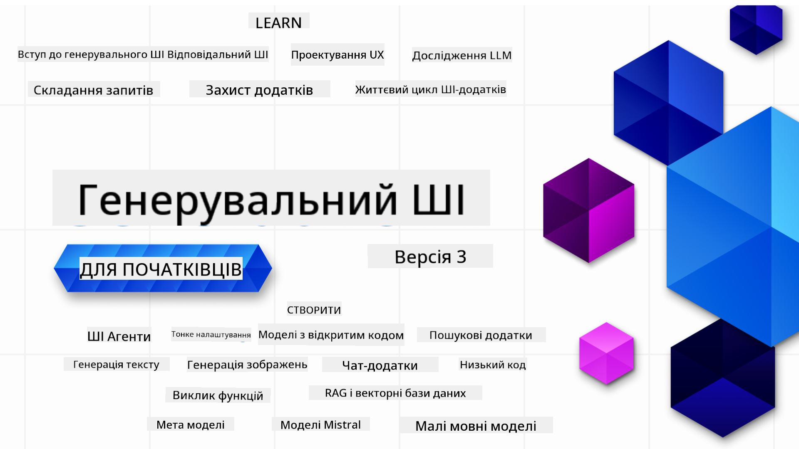

<!--
CO_OP_TRANSLATOR_METADATA:
{
  "original_hash": "5740c9b7fcb6919da1ea4df93475f331",
  "translation_date": "2025-07-09T06:49:18+00:00",
  "source_file": "README.md",
  "language_code": "uk"
}
-->

### 21 уроків, які навчать всьому необхідному для початку створення додатків на основі генеративного ШІ

### 🌐 Підтримка кількох мов

#### Підтримується через GitHub Action (автоматично та завжди актуально)

[French](../fr/README.md) | [Spanish](../es/README.md) | [German](../de/README.md) | [Russian](../ru/README.md) | [Arabic](../ar/README.md) | [Persian (Farsi)](../fa/README.md) | [Urdu](../ur/README.md) | [Chinese (Simplified)](../zh/README.md) | [Chinese (Traditional, Macau)](../mo/README.md) | [Chinese (Traditional, Hong Kong)](../hk/README.md) | [Chinese (Traditional, Taiwan)](../tw/README.md) | [Japanese](../ja/README.md) | [Korean](../ko/README.md) | [Hindi](../hi/README.md) | [Bengali](../bn/README.md) | [Marathi](../mr/README.md) | [Nepali](../ne/README.md) | [Punjabi (Gurmukhi)](../pa/README.md) | [Portuguese (Portugal)](../pt/README.md) | [Portuguese (Brazil)](../br/README.md) | [Italian](../it/README.md) | [Polish](../pl/README.md) | [Turkish](../tr/README.md) | [Greek](../el/README.md) | [Thai](../th/README.md) | [Swedish](../sv/README.md) | [Danish](../da/README.md) | [Norwegian](../no/README.md) | [Finnish](../fi/README.md) | [Dutch](../nl/README.md) | [Hebrew](../he/README.md) | [Vietnamese](../vi/README.md) | [Indonesian](../id/README.md) | [Malay](../ms/README.md) | [Tagalog (Filipino)](../tl/README.md) | [Swahili](../sw/README.md) | [Hungarian](../hu/README.md) | [Czech](../cs/README.md) | [Slovak](../sk/README.md) | [Romanian](../ro/README.md) | [Bulgarian](../bg/README.md) | [Serbian (Cyrillic)](../sr/README.md) | [Croatian](../hr/README.md) | [Slovenian](../sl/README.md) | [Ukrainian](./README.md) | [Burmese (Myanmar)](../my/README.md)

# Generative AI для початківців (версія 3) – Курс

Вивчайте основи створення додатків на основі генеративного ШІ за допомогою нашого комплексного курсу з 21 уроку від Microsoft Cloud Advocates.

## 🌱 Початок роботи

Цей курс складається з 21 уроку. Кожен урок охоплює окрему тему, тож починайте з будь-якого, який вам до вподоби!

Уроки поділяються на "Learn" — уроки, що пояснюють концепції генеративного ШІ, та "Build" — уроки, які пояснюють концепцію та містять приклади коду на **Python** і **TypeScript**, коли це можливо.

Для розробників .NET перегляньте [Generative AI for Beginners (.NET Edition)](https://github.com/microsoft/Generative-AI-for-beginners-dotnet?WT.mc_id=academic-105485-koreyst)!

Кожен урок також містить розділ "Keep Learning" з додатковими навчальними матеріалами.

## Що вам потрібно
### Для запуску коду цього курсу ви можете використовувати: 
 - [Azure OpenAI Service](https://aka.ms/genai-beginners/azure-open-ai?WT.mc_id=academic-105485-koreyst) - **Уроки:** "aoai-assignment"
 - [GitHub Marketplace Model Catalog](https://aka.ms/genai-beginners/gh-models?WT.mc_id=academic-105485-koreyst) - **Уроки:** "githubmodels"
 - [OpenAI API](https://aka.ms/genai-beginners/open-ai?WT.mc_id=academic-105485-koreyst) - **Уроки:** "oai-assignment" 
   
- Базові знання Python або TypeScript будуть корисними – \*Для абсолютних початківців рекомендуємо ці курси з [Python](https://aka.ms/genai-beginners/python?WT.mc_id=academic-105485-koreyst) та [TypeScript](https://aka.ms/genai-beginners/typescript?WT.mc_id=academic-105485-koreyst)
- Обліковий запис GitHub, щоб [форкнути цей репозиторій](https://aka.ms/genai-beginners/github?WT.mc_id=academic-105485-koreyst) до свого акаунту

Ми створили урок **[Course Setup](./00-course-setup/README.md?WT.mc_id=academic-105485-koreyst)**, щоб допомогти вам налаштувати середовище розробки.

Не забудьте [поставити зірочку (🌟) цьому репозиторію](https://docs.github.com/en/get-started/exploring-projects-on-github/saving-repositories-with-stars?WT.mc_id=academic-105485-koreyst), щоб легше було його знайти пізніше.

## 🧠 Готові до розгортання?

Якщо ви шукаєте більш складні приклади коду, перегляньте нашу [колекцію прикладів коду для генеративного ШІ](https://aka.ms/genai-beg-code?WT.mc_id=academic-105485-koreyst) на **Python** та **TypeScript**.

## 🗣️ Познайомтесь з іншими учнями, отримайте підтримку

Приєднуйтесь до нашого [офіційного Discord-сервера Azure AI Foundry](https://aka.ms/genai-discord?WT.mc_id=academic-105485-koreyst), щоб познайомитися та поспілкуватися з іншими учнями цього курсу та отримати підтримку.

Задавайте питання або діліться відгуками про продукт у нашому [Azure AI Foundry Developer Forum](https://aka.ms/azureaifoundry/forum) на GitHub.

## 🚀 Створюєте стартап?

Зареєструйтесь у [Microsoft for Startups Founders Hub](https://aka.ms/genai-foundershub?WT.mc_id=academic-105485-koreyst), щоб отримати **безкоштовні кредити OpenAI** та до **150 000 доларів на кредити Azure для доступу до моделей OpenAI через Azure OpenAI Services**.

## 🙏 Хочете допомогти?

Маєте пропозиції або знайшли помилки у тексті чи коді? [Створіть issue](https://github.com/microsoft/generative-ai-for-beginners/issues?WT.mc_id=academic-105485-koreyst) або [зробіть pull request](https://github.com/microsoft/generative-ai-for-beginners/pulls?WT.mc_id=academic-105485-koreyst)

## 📂 Кожен урок містить:

- Коротке відео-вступ до теми
- Письмовий урок у README
- Приклади коду на Python та TypeScript з підтримкою Azure OpenAI та OpenAI API
- Посилання на додаткові ресурси для подальшого навчання

## 🗃️ Уроки

| #   | **Посилання на урок**                                                                                                                        | **Опис**                                                                                      | **Відео**                                                                   | **Додаткове навчання**                                                         |
| --- | -------------------------------------------------------------------------------------------------------------------------------------------- | --------------------------------------------------------------------------------------------- | --------------------------------------------------------------------------- | ------------------------------------------------------------------------------ |
| 00  | [Course Setup](./00-course-setup/README.md?WT.mc_id=academic-105485-koreyst)                                                                 | **Learn:** Як налаштувати середовище розробки                                               | Відео скоро з’явиться                                                        | [Дізнатись більше](https://aka.ms/genai-collection?WT.mc_id=academic-105485-koreyst) |
| 01  | [Introduction to Generative AI and LLMs](./01-introduction-to-genai/README.md?WT.mc_id=academic-105485-koreyst)                              | **Learn:** Розуміння, що таке генеративний ШІ та як працюють великі мовні моделі (LLMs)       | [Відео](https://aka.ms/gen-ai-lesson-1-gh?WT.mc_id=academic-105485-koreyst) | [Дізнатись більше](https://aka.ms/genai-collection?WT.mc_id=academic-105485-koreyst) |
| 02  | [Exploring and comparing different LLMs](./02-exploring-and-comparing-different-llms/README.md?WT.mc_id=academic-105485-koreyst)             | **Learn:** Як обрати правильну модель для вашого випадку використання                         | [Відео](https://aka.ms/gen-ai-lesson2-gh?WT.mc_id=academic-105485-koreyst)  | [Дізнатись більше](https://aka.ms/genai-collection?WT.mc_id=academic-105485-koreyst) |
| 03  | [Using Generative AI Responsibly](./03-using-generative-ai-responsibly/README.md?WT.mc_id=academic-105485-koreyst)                           | **Learn:** Як відповідально створювати додатки на основі генеративного ШІ                    | [Відео](https://aka.ms/gen-ai-lesson3-gh?WT.mc_id=academic-105485-koreyst)  | [Дізнатись більше](https://aka.ms/genai-collection?WT.mc_id=academic-105485-koreyst) |
| 04  | [Understanding Prompt Engineering Fundamentals](./04-prompt-engineering-fundamentals/README.md?WT.mc_id=academic-105485-koreyst)             | **Learn:** Практичні найкращі практики prompt engineering                                    | [Відео](https://aka.ms/gen-ai-lesson4-gh?WT.mc_id=academic-105485-koreyst)  | [Дізнатись більше](https://aka.ms/genai-collection?WT.mc_id=academic-105485-koreyst) |
| 05  | [Creating Advanced Prompts](./05-advanced-prompts/README.md?WT.mc_id=academic-105485-koreyst)                                                | **Learn:** Як застосовувати техніки prompt engineering для покращення результатів ваших запитів | [Відео](https://aka.ms/gen-ai-lesson5-gh?WT.mc_id=academic-105485-koreyst)  | [Дізнатись більше](https://aka.ms/genai-collection?WT.mc_id=academic-105485-koreyst) |
| 06  | [Створення додатків для генерації тексту](./06-text-generation-apps/README.md?WT.mc_id=academic-105485-koreyst)                                | **Створіть:** додаток для генерації тексту з використанням Azure OpenAI / OpenAI API               | [Відео](https://aka.ms/gen-ai-lesson6-gh?WT.mc_id=academic-105485-koreyst)  | [Дізнатись більше](https://aka.ms/genai-collection?WT.mc_id=academic-105485-koreyst) |
| 07  | [Створення чат-додатків](./07-building-chat-applications/README.md?WT.mc_id=academic-105485-koreyst)                                           | **Створіть:** методи ефективного створення та інтеграції чат-додатків                              | [Відео](https://aka.ms/gen-ai-lessons7-gh?WT.mc_id=academic-105485-koreyst) | [Дізнатись більше](https://aka.ms/genai-collection?WT.mc_id=academic-105485-koreyst) |
| 08  | [Створення пошукових додатків з векторними базами даних](./08-building-search-applications/README.md?WT.mc_id=academic-105485-koreyst)          | **Створіть:** пошуковий додаток, який використовує Embeddings для пошуку даних                    | [Відео](https://aka.ms/gen-ai-lesson8-gh?WT.mc_id=academic-105485-koreyst)  | [Дізнатись більше](https://aka.ms/genai-collection?WT.mc_id=academic-105485-koreyst) |
| 09  | [Створення додатків для генерації зображень](./09-building-image-applications/README.md?WT.mc_id=academic-105485-koreyst)                      | **Створіть:** додаток для генерації зображень                                                    | [Відео](https://aka.ms/gen-ai-lesson9-gh?WT.mc_id=academic-105485-koreyst)  | [Дізнатись більше](https://aka.ms/genai-collection?WT.mc_id=academic-105485-koreyst) |
| 10  | [Створення AI-додатків з низьким кодом](./10-building-low-code-ai-applications/README.md?WT.mc_id=academic-105485-koreyst)                     | **Створіть:** генеративний AI-додаток з використанням Low Code інструментів                       | [Відео](https://aka.ms/gen-ai-lesson10-gh?WT.mc_id=academic-105485-koreyst) | [Дізнатись більше](https://aka.ms/genai-collection?WT.mc_id=academic-105485-koreyst) |
| 11  | [Інтеграція зовнішніх додатків з викликом функцій](./11-integrating-with-function-calling/README.md?WT.mc_id=academic-105485-koreyst)           | **Створіть:** що таке function calling і як його використовувати в додатках                      | [Відео](https://aka.ms/gen-ai-lesson11-gh?WT.mc_id=academic-105485-koreyst) | [Дізнатись більше](https://aka.ms/genai-collection?WT.mc_id=academic-105485-koreyst) |
| 12  | [Проєктування UX для AI-додатків](./12-designing-ux-for-ai-applications/README.md?WT.mc_id=academic-105485-koreyst)                             | **Вивчіть:** як застосовувати принципи UX-дизайну при розробці генеративних AI-додатків          | [Відео](https://aka.ms/gen-ai-lesson12-gh?WT.mc_id=academic-105485-koreyst) | [Дізнатись більше](https://aka.ms/genai-collection?WT.mc_id=academic-105485-koreyst) |
| 13  | [Захист ваших генеративних AI-додатків](./13-securing-ai-applications/README.md?WT.mc_id=academic-105485-koreyst)                               | **Вивчіть:** загрози та ризики для AI-систем і способи їх захисту                                | [Відео](https://aka.ms/gen-ai-lesson13-gh?WT.mc_id=academic-105485-koreyst) | [Дізнатись більше](https://aka.ms/genai-collection?WT.mc_id=academic-105485-koreyst) |
| 14  | [Життєвий цикл генеративних AI-додатків](./14-the-generative-ai-application-lifecycle/README.md?WT.mc_id=academic-105485-koreyst)               | **Вивчіть:** інструменти та метрики для управління життєвим циклом LLM та LLMOps                 | [Відео](https://aka.ms/gen-ai-lesson14-gh?WT.mc_id=academic-105485-koreyst) | [Дізнатись більше](https://aka.ms/genai-collection?WT.mc_id=academic-105485-koreyst) |
| 15  | [Retrieval Augmented Generation (RAG) та векторні бази даних](./15-rag-and-vector-databases/README.md?WT.mc_id=academic-105485-koreyst)          | **Створіть:** додаток з використанням RAG Framework для отримання embeddings з векторних баз    | [Відео](https://aka.ms/gen-ai-lesson15-gh?WT.mc_id=academic-105485-koreyst) | [Дізнатись більше](https://aka.ms/genai-collection?WT.mc_id=academic-105485-koreyst) |
| 16  | [Відкриті моделі та Hugging Face](./16-open-source-models/README.md?WT.mc_id=academic-105485-koreyst)                                            | **Створіть:** додаток з використанням відкритих моделей, доступних на Hugging Face               | [Відео](https://aka.ms/gen-ai-lesson16-gh?WT.mc_id=academic-105485-koreyst) | [Дізнатись більше](https://aka.ms/genai-collection?WT.mc_id=academic-105485-koreyst) |
| 17  | [AI-агенти](./17-ai-agents/README.md?WT.mc_id=academic-105485-koreyst)                                                                         | **Створіть:** додаток з використанням AI Agent Framework                                        | [Відео](https://aka.ms/gen-ai-lesson17-gh?WT.mc_id=academic-105485-koreyst) | [Дізнатись більше](https://aka.ms/genai-collection?WT.mc_id=academic-105485-koreyst) |
| 18  | [Тонке налаштування LLM](./18-fine-tuning/README.md?WT.mc_id=academic-105485-koreyst)                                                          | **Вивчіть:** що таке, навіщо і як виконувати тонке налаштування LLM                             | [Відео](https://aka.ms/gen-ai-lesson18-gh?WT.mc_id=academic-105485-koreyst) | [Дізнатись більше](https://aka.ms/genai-collection?WT.mc_id=academic-105485-koreyst) |
| 19  | [Робота з SLM](./19-slm/README.md?WT.mc_id=academic-105485-koreyst)                                                                            | **Вивчіть:** переваги роботи з Small Language Models                                           | Відео скоро буде | [Дізнатись більше](https://aka.ms/genai-collection?WT.mc_id=academic-105485-koreyst) |
| 20  | [Робота з моделями Mistral](./20-mistral/README.md?WT.mc_id=academic-105485-koreyst)                                                           | **Вивчіть:** особливості та відмінності моделей сімейства Mistral                              | Відео скоро буде | [Дізнатись більше](https://aka.ms/genai-collection?WT.mc_id=academic-105485-koreyst) |
| 21  | [Робота з моделями Meta](./21-meta/README.md?WT.mc_id=academic-105485-koreyst)                                                                 | **Вивчіть:** особливості та відмінності моделей сімейства Meta                                | Відео скоро буде | [Дізнатись більше](https://aka.ms/genai-collection?WT.mc_id=academic-105485-koreyst) |

### 🌟 Особлива подяка

Особлива подяка [**John Aziz**](https://www.linkedin.com/in/john0isaac/) за створення всіх GitHub Actions та робочих процесів

[**Bernhard Merkle**](https://www.linkedin.com/in/bernhard-merkle-738b73/) за ключовий внесок у кожен урок для покращення досвіду навчання та роботи з кодом.

## 🎒 Інші курси

Наша команда створює й інші курси! Ознайомтесь з ними:

- [**НОВИЙ** Model Context Protocol для початківців](https://github.com/microsoft/mcp-for-beginners?WT.mc_id=academic-105485-koreyst)
- [AI Agents для початківців](https://github.com/microsoft/ai-agents-for-beginners?WT.mc_id=academic-105485-koreyst)
- [Генеративний AI для початківців з .NET](https://github.com/microsoft/Generative-AI-for-beginners-dotnet?WT.mc_id=academic-105485-koreyst)
- [Генеративний AI для початківців з JavaScript](https://aka.ms/genai-js-course?WT.mc_id=academic-105485-koreyst)
- [ML для початківців](https://aka.ms/ml-beginners?WT.mc_id=academic-105485-koreyst)
- [Data Science для початківців](https://aka.ms/datascience-beginners?WT.mc_id=academic-105485-koreyst)
- [AI для початківців](https://aka.ms/ai-beginners?WT.mc_id=academic-105485-koreyst)
- [Кібербезпека для початківців](https://github.com/microsoft/Security-101??WT.mc_id=academic-96948-sayoung)
- [Веб-розробка для початківців](https://aka.ms/webdev-beginners?WT.mc_id=academic-105485-koreyst)
- [IoT для початківців](https://aka.ms/iot-beginners?WT.mc_id=academic-105485-koreyst)
- [XR-розробка для початківців](https://github.com/microsoft/xr-development-for-beginners?WT.mc_id=academic-105485-koreyst)
- [Опановування GitHub Copilot для AI-парного програмування](https://aka.ms/GitHubCopilotAI?WT.mc_id=academic-105485-koreyst)
- [Опановування GitHub Copilot для розробників C#/.NET](https://github.com/microsoft/mastering-github-copilot-for-dotnet-csharp-developers?WT.mc_id=academic-105485-koreyst)
- [Обери свою пригоду з Copilot](https://github.com/microsoft/CopilotAdventures?WT.mc_id=academic-105485-koreyst)

**Відмова від відповідальності**:  
Цей документ було перекладено за допомогою сервісу автоматичного перекладу [Co-op Translator](https://github.com/Azure/co-op-translator). Хоча ми прагнемо до точності, будь ласка, майте на увазі, що автоматичні переклади можуть містити помилки або неточності. Оригінальний документ рідною мовою слід вважати авторитетним джерелом. Для критично важливої інформації рекомендується звертатися до професійного людського перекладу. Ми не несемо відповідальності за будь-які непорозуміння або неправильні тлумачення, що виникли внаслідок використання цього перекладу.