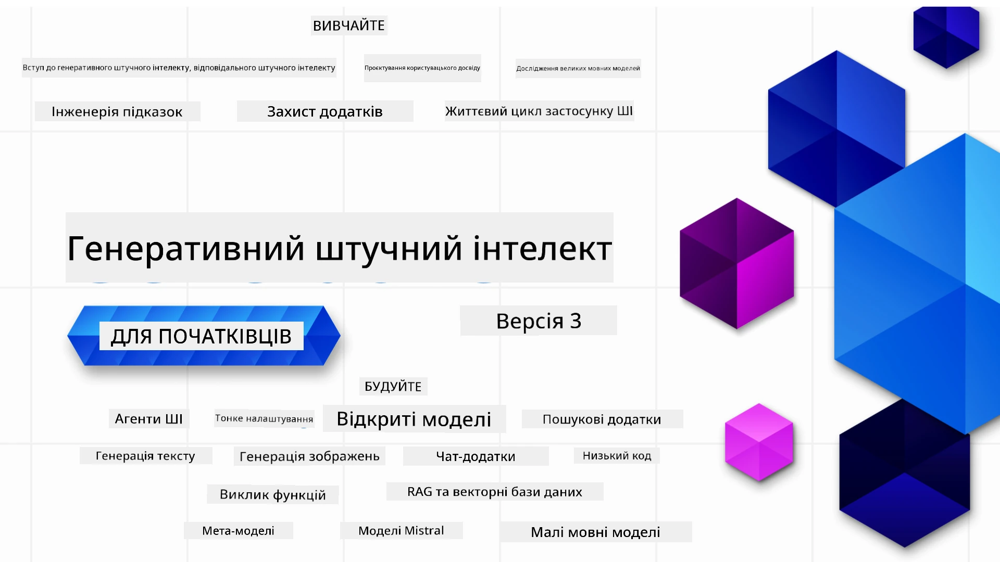

<!--
CO_OP_TRANSLATOR_METADATA:
{
  "original_hash": "054860715e642de31fa8e15c6d01f2b1",
  "translation_date": "2026-01-05T17:07:57+00:00",
  "source_file": "README.md",
  "language_code": "uk"
}
-->


### 21 урок, які навчають усьому, що потрібно знати, щоб почати створювати додатки на основі Генеративного ШІ

[](https://github.com/microsoft/Generative-AI-For-Beginners/blob/master/LICENSE?WT.mc_id=academic-105485-koreyst)
[](https://GitHub.com/microsoft/Generative-AI-For-Beginners/graphs/contributors/?WT.mc_id=academic-105485-koreyst)
[](https://GitHub.com/microsoft/Generative-AI-For-Beginners/issues/?WT.mc_id=academic-105485-koreyst)
[](https://GitHub.com/microsoft/Generative-AI-For-Beginners/pulls/?WT.mc_id=academic-105485-koreyst)
[](http://makeapullrequest.com?WT.mc_id=academic-105485-koreyst)

[](https://GitHub.com/microsoft/Generative-AI-For-Beginners/watchers/?WT.mc_id=academic-105485-koreyst)
[](https://GitHub.com/microsoft/Generative-AI-For-Beginners/network/?WT.mc_id=academic-105485-koreyst)
[](https://GitHub.com/microsoft/Generative-AI-For-Beginners/stargazers/?WT.mc_id=academic-105485-koreyst)

[](https://discord.gg/nTYy5BXMWG)

### 🌐 Підтримка кількох мов

#### Підтримується через GitHub Action (Автоматизовано та завжди актуально)

<!-- CO-OP TRANSLATOR LANGUAGES TABLE START -->
[Арабська](../ar/README.md) | [Бенгальська](../bn/README.md) | [Болгарська](../bg/README.md) | [Бірманська (М’янма)](../my/README.md) | [Китайська (спрощена)](../zh/README.md) | [Китайська (традиційна, Гонконг)](../hk/README.md) | [Китайська (традиційна, Макао)](../mo/README.md) | [Китайська (традиційна, Тайвань)](../tw/README.md) | [Хорватська](../hr/README.md) | [Чеська](../cs/README.md) | [Данська](../da/README.md) | [Голландська](../nl/README.md) | [Естонська](../et/README.md) | [Фінська](../fi/README.md) | [Французька](../fr/README.md) | [Німецька](../de/README.md) | [Грецька](../el/README.md) | [Іврит](../he/README.md) | [Хінді](../hi/README.md) | [Угорська](../hu/README.md) | [Індонезійська](../id/README.md) | [Італійська](../it/README.md) | [Японська](../ja/README.md) | [Каннада](../kn/README.md) | [Корейська](../ko/README.md) | [Литовська](../lt/README.md) | [Малайська](../ms/README.md) | [Малаялам](../ml/README.md) | [Маратхі](../mr/README.md) | [Непальська](../ne/README.md) | [Нігерійський Піджин](../pcm/README.md) | [Норвезька](../no/README.md) | [Перська (фарсі)](../fa/README.md) | [Польська](../pl/README.md) | [Португальська (Бразилія)](../br/README.md) | [Португальська (Португалія)](../pt/README.md) | [Пенджабі (Гурмухі)](../pa/README.md) | [Румунська](../ro/README.md) | [Російська](../ru/README.md) | [Сербська (кирилиця)](../sr/README.md) | [Словацька](../sk/README.md) | [Словенська](../sl/README.md) | [Іспанська](../es/README.md) | [Суахілі](../sw/README.md) | [Шведська](../sv/README.md) | [Тагальська (філіппінська)](../tl/README.md) | [Тамільська](../ta/README.md) | [Телугу](../te/README.md) | [Тайська](../th/README.md) | [Турецька](../tr/README.md) | [Українська](./README.md) | [Урду](../ur/README.md) | [В’єтнамська](../vi/README.md)

> **Віддаєте перевагу клонуванню локально?**

> Цей репозиторій містить понад 50 мовних перекладів, що значно збільшує розмір завантаження. Щоб клонувати без перекладів, використовуйте sparse checkout:
> ```bash
> git clone --filter=blob:none --sparse https://github.com/microsoft/generative-ai-for-beginners.git
> cd generative-ai-for-beginners
> git sparse-checkout set --no-cone '/*' '!translations' '!translated_images'
> ```
> Це дасть вам усе необхідне для проходження курсу з набагато швидшим завантаженням.
<!-- CO-OP TRANSLATOR LANGUAGES TABLE END -->

# Генеративний ШІ для Початківців (Версія 3) - Курс

Вивчіть основи створення додатків на основі Генеративного ШІ з нашим комплексним курсом із 21 уроку від Microsoft Cloud Advocates.

## 🌱 Початок роботи

Цей курс має 21 урок. Кожен урок охоплює свою тему, тож починайте з будь-якого, який вам до вподоби!

Уроки позначені як "Навчальні" — уроки, які пояснюють концепції Генеративного ШІ, або "Практичні" — уроки, що пояснюють концепцію та надають приклади коду на **Python** і **TypeScript**, коли це можливо.

Для розробників .NET дивіться [Генеративний ШІ для Початківців (.NET Edition)](https://github.com/microsoft/Generative-AI-for-beginners-dotnet?WT.mc_id=academic-105485-koreyst)!

Кожен урок також містить розділ "Продовжити навчання" з додатковими навчальними матеріалами.

## Що потрібно
### Щоб запускати код цього курсу, можна використовувати:
 - [Azure OpenAI Service](https://aka.ms/genai-beginners/azure-open-ai?WT.mc_id=academic-105485-koreyst) - **Уроки:** "aoai-assignment"
 - [GitHub Marketplace Model Catalog](https://aka.ms/genai-beginners/gh-models?WT.mc_id=academic-105485-koreyst) - **Уроки:** "githubmodels"
 - [OpenAI API](https://aka.ms/genai-beginners/open-ai?WT.mc_id=academic-105485-koreyst) - **Уроки:** "oai-assignment"
   
- Базові знання Python або TypeScript будуть корисними - \*Для повних початківців перегляньте ці [курси Python](https://aka.ms/genai-beginners/python?WT.mc_id=academic-105485-koreyst) та [TypeScript](https://aka.ms/genai-beginners/typescript?WT.mc_id=academic-105485-koreyst)
- Обліковий запис GitHub, щоб [створити форк цього репозиторію](https://aka.ms/genai-beginners/github?WT.mc_id=academic-105485-koreyst) на свій обліковий запис

Ми створили урок **[Налаштування курсу](./00-course-setup/README.md?WT.mc_id=academic-105485-koreyst)**, щоб допомогти вам із налаштуванням середовища розробки.

Не забудьте [поставити зірочку (🌟) цьому репозиторію](https://docs.github.com/en/get-started/exploring-projects-on-github/saving-repositories-with-stars?WT.mc_id=academic-105485-koreyst), щоб легше його знаходити пізніше.

## 🧠 Готові розгортати?

Якщо ви шукаєте більш просунуті приклади коду, перегляньте нашу [колекцію прикладів коду Генеративного ШІ](https://aka.ms/genai-beg-code?WT.mc_id=academic-105485-koreyst) на **Python** та **TypeScript**.

## 🗣️ Познайомтеся з іншими учнями, отримуйте підтримку

Приєднуйтеся до нашого [офіційного сервера Azure AI Foundry Discord](https://aka.ms/genai-discord?WT.mc_id=academic-105485-koreyst), щоб спілкуватися та налагоджувати контакти з іншими учнями, що проходять цей курс, та отримувати підтримку.

Задавайте питання або діліться відгуками про продукт у нашому [форумі розробників Azure AI Foundry](https://aka.ms/azureaifoundry/forum) на Github.

## 🚀 Будуєте стартап?

Відвідайте [Microsoft for Startups](https://www.microsoft.com/startups), щоб дізнатися, як розпочати розробку з кредитами Azure вже сьогодні.

## 🙏 Хочете допомогти?

Є пропозиції або знайшли помилки в орфографії чи коді? [Створіть issue](https://github.com/microsoft/generative-ai-for-beginners/issues?WT.mc_id=academic-105485-koreyst) або [надішліть pull request](https://github.com/microsoft/generative-ai-for-beginners/pulls?WT.mc_id=academic-105485-koreyst)

## 📂 Кожен урок містить:

- Коротке відео-вступ до теми
- Писаний урок у README
- Приклади коду на Python та TypeScript з підтримкою Azure OpenAI та OpenAI API
- Посилання на додаткові ресурси для подальшого навчання

## 🗃️ Уроки

| #   | **Посилання на урок**                                                                                                                              | **Опис**                                                                                 | **Відео**                                                                   | **Додаткове навчання**                                                             |
| --- | -------------------------------------------------------------------------------------------------------------------------------------------- | --------------------------------------------------------------------------------------- | --------------------------------------------------------------------------- | ------------------------------------------------------------------------------ |
| 00  | [Налаштування курсу](./00-course-setup/README.md?WT.mc_id=academic-105485-koreyst)                                                                 | **Навчання:** Як налаштувати середовище розробки                                      | Скоро відео                                                                 | [Дізнатись більше](https://aka.ms/genai-collection?WT.mc_id=academic-105485-koreyst) |
| 01  | [Вступ до Генеративного ШІ та ВЕЛ](./01-introduction-to-genai/README.md?WT.mc_id=academic-105485-koreyst)                              | **Навчання:** Розуміння, що таке Генеративний ШІ та як працюють великі мовні моделі      | [Відео](https://aka.ms/gen-ai-lesson-1-gh?WT.mc_id=academic-105485-koreyst) | [Дізнатись більше](https://aka.ms/genai-collection?WT.mc_id=academic-105485-koreyst) |
| 02  | [Дослідження та порівняння різних ВЕЛ](./02-exploring-and-comparing-different-llms/README.md?WT.mc_id=academic-105485-koreyst)             | **Навчання:** Як обрати правильну модель для вашого випадку використання                | [Відео](https://aka.ms/gen-ai-lesson2-gh?WT.mc_id=academic-105485-koreyst)  | [Дізнатись більше](https://aka.ms/genai-collection?WT.mc_id=academic-105485-koreyst) |
| 03  | [Відповідальне використання Генеративного ШІ](./03-using-generative-ai-responsibly/README.md?WT.mc_id=academic-105485-koreyst)                           | **Навчання:** Як відповідально створювати додатки на основі Генеративного ШІ           | [Відео](https://aka.ms/gen-ai-lesson3-gh?WT.mc_id=academic-105485-koreyst)  | [Дізнатись більше](https://aka.ms/genai-collection?WT.mc_id=academic-105485-koreyst) |
| 04  | [Основи інженерії підказок](./04-prompt-engineering-fundamentals/README.md?WT.mc_id=academic-105485-koreyst)             | **Навчання:** Практичні найкращі практики інженерії підказок                            | [Відео](https://aka.ms/gen-ai-lesson4-gh?WT.mc_id=academic-105485-koreyst)  | [Дізнатись більше](https://aka.ms/genai-collection?WT.mc_id=academic-105485-koreyst) |
| 05  | [Створення складних запитів](./05-advanced-prompts/README.md?WT.mc_id=academic-105485-koreyst)                                                | **Вивчіть:** Як застосовувати техніки prompt engineering для покращення результатів ваших запитів. | [Відео](https://aka.ms/gen-ai-lesson5-gh?WT.mc_id=academic-105485-koreyst)  | [Дізнатись більше](https://aka.ms/genai-collection?WT.mc_id=academic-105485-koreyst) |
| 06  | [Створення додатків для генерації тексту](./06-text-generation-apps/README.md?WT.mc_id=academic-105485-koreyst)                                | **Створіть:** Додаток для генерації тексту з використанням Azure OpenAI / OpenAI API                                | [Відео](https://aka.ms/gen-ai-lesson6-gh?WT.mc_id=academic-105485-koreyst)  | [Дізнатись більше](https://aka.ms/genai-collection?WT.mc_id=academic-105485-koreyst) |
| 07  | [Створення чат-додатків](./07-building-chat-applications/README.md?WT.mc_id=academic-105485-koreyst)                                     | **Створіть:** Техніки ефективного створення та інтеграції чат-додатків.               | [Відео](https://aka.ms/gen-ai-lessons7-gh?WT.mc_id=academic-105485-koreyst) | [Дізнатись більше](https://aka.ms/genai-collection?WT.mc_id=academic-105485-koreyst) |
| 08  | [Створення додатків пошуку та векторних баз даних](./08-building-search-applications/README.md?WT.mc_id=academic-105485-koreyst)                        | **Створіть:** Додаток пошуку, що використовує Embeddings для пошуку даних.                        | [Відео](https://aka.ms/gen-ai-lesson8-gh?WT.mc_id=academic-105485-koreyst)  | [Дізнатись більше](https://aka.ms/genai-collection?WT.mc_id=academic-105485-koreyst) |
| 09  | [Створення додатків для генерації зображень](./09-building-image-applications/README.md?WT.mc_id=academic-105485-koreyst)                        | **Створіть:** Додаток для генерації зображень                                                       | [Відео](https://aka.ms/gen-ai-lesson9-gh?WT.mc_id=academic-105485-koreyst)  | [Дізнатись більше](https://aka.ms/genai-collection?WT.mc_id=academic-105485-koreyst) |
| 10  | [Створення AI-додатків з низьким кодом](./10-building-low-code-ai-applications/README.md?WT.mc_id=academic-105485-koreyst)                       | **Створіть:** Додаток з генеративним AI, використовуючи інструменти Low Code                                     | [Відео](https://aka.ms/gen-ai-lesson10-gh?WT.mc_id=academic-105485-koreyst) | [Дізнатись більше](https://aka.ms/genai-collection?WT.mc_id=academic-105485-koreyst) |
| 11  | [Інтеграція зовнішніх додатків з викликом функцій](./11-integrating-with-function-calling/README.md?WT.mc_id=academic-105485-koreyst) | **Створіть:** Що таке виклик функцій і його випадки використання для додатків                          | [Відео](https://aka.ms/gen-ai-lesson11-gh?WT.mc_id=academic-105485-koreyst) | [Дізнатись більше](https://aka.ms/genai-collection?WT.mc_id=academic-105485-koreyst) |
| 12  | [Проєктування UX для AI-додатків](./12-designing-ux-for-ai-applications/README.md?WT.mc_id=academic-105485-koreyst)                         | **Вивчіть:** Як застосовувати принципи UX-дизайну при розробці генеративних AI-додатків         | [Відео](https://aka.ms/gen-ai-lesson12-gh?WT.mc_id=academic-105485-koreyst) | [Дізнатись більше](https://aka.ms/genai-collection?WT.mc_id=academic-105485-koreyst) |
| 13  | [Захист генеративних AI-додатків](./13-securing-ai-applications/README.md?WT.mc_id=academic-105485-koreyst)                         | **Вивчіть:** Загрози та ризики для AI-систем і методи їх захисту.             | [Відео](https://aka.ms/gen-ai-lesson13-gh?WT.mc_id=academic-105485-koreyst) | [Дізнатись більше](https://aka.ms/genai-collection?WT.mc_id=academic-105485-koreyst) |
| 14  | [Життєвий цикл генеративного AI-додатку](./14-the-generative-ai-application-lifecycle/README.md?WT.mc_id=academic-105485-koreyst)           | **Вивчіть:** Інструменти та показники для керування життєвим циклом LLM та LLMOps                         | [Відео](https://aka.ms/gen-ai-lesson14-gh?WT.mc_id=academic-105485-koreyst) | [Дізнатись більше](https://aka.ms/genai-collection?WT.mc_id=academic-105485-koreyst) |
| 15  | [Retrieval Augmented Generation (RAG) та векторні бази даних](./15-rag-and-vector-databases/README.md?WT.mc_id=academic-105485-koreyst)        | **Створіть:** Додаток з використанням RAG Framework для отримання embedding з векторних баз даних  | [Відео](https://aka.ms/gen-ai-lesson15-gh?WT.mc_id=academic-105485-koreyst) | [Дізнатись більше](https://aka.ms/genai-collection?WT.mc_id=academic-105485-koreyst) |
| 16  | [Моделі з відкритим кодом та Hugging Face](./16-open-source-models/README.md?WT.mc_id=academic-105485-koreyst)                                    | **Створіть:** Додаток з використанням моделей з відкритим кодом, доступних на Hugging Face                    | [Відео](https://aka.ms/gen-ai-lesson16-gh?WT.mc_id=academic-105485-koreyst) | [Дізнатись більше](https://aka.ms/genai-collection?WT.mc_id=academic-105485-koreyst) |
| 17  | [AI-агенти](./17-ai-agents/README.md?WT.mc_id=academic-105485-koreyst)                                                                       | **Створіть:** Додаток із використанням AI Agent Framework                                           | [Відео](https://aka.ms/gen-ai-lesson17-gh?WT.mc_id=academic-105485-koreyst) | [Дізнатись більше](https://aka.ms/genai-collection?WT.mc_id=academic-105485-koreyst) |
| 18  | [Тонке налаштування LLM](./18-fine-tuning/README.md?WT.mc_id=academic-105485-koreyst)                                                              | **Вивчіть:** Що, навіщо та як виконувати тонке налаштування LLM                                            | [Відео](https://aka.ms/gen-ai-lesson18-gh?WT.mc_id=academic-105485-koreyst) | [Дізнатись більше](https://aka.ms/genai-collection?WT.mc_id=academic-105485-koreyst) |
| 19  | [Розробка з SLM](./19-slm/README.md?WT.mc_id=academic-105485-koreyst)                                                              | **Вивчіть:** Переваги розробки з Потрібними Малими Мовними Моделями                                            | Відео скоро | [Дізнатись більше](https://aka.ms/genai-collection?WT.mc_id=academic-105485-koreyst) |
| 20  | [Розробка з моделями Mistral](./20-mistral/README.md?WT.mc_id=academic-105485-koreyst)                                                              | **Вивчіть:** Особливості та відмінності моделей сімейства Mistral                                           | Відео скоро | [Дізнатись більше](https://aka.ms/genai-collection?WT.mc_id=academic-105485-koreyst) |
| 21  | [Розробка з моделями Meta](./21-meta/README.md?WT.mc_id=academic-105485-koreyst)                                                              | **Вивчіть:** Особливості та відмінності моделей сімейства Meta                                           | Відео скоро | [Дізнатись більше](https://aka.ms/genai-collection?WT.mc_id=academic-105485-koreyst) |

### 🌟 Особлива подяка

Особлива подяка [**John Aziz**](https://www.linkedin.com/in/john0isaac/) за створення всіх GitHub Actions і робочих процесів

[**Bernhard Merkle**](https://www.linkedin.com/in/bernhard-merkle-738b73/) за ключові внески в кожен урок для покращення досвіду навчання і коду. 

## 🎒 Інші курси

Наша команда створює інші курси! Перегляньте:

<!-- CO-OP TRANSLATOR OTHER COURSES START -->
### LangChain
[](https://aka.ms/langchain4j-for-beginners)
[](https://aka.ms/langchainjs-for-beginners?WT.mc_id=m365-94501-dwahlin)

---

### Azure / Edge / MCP / Agents
[](https://github.com/microsoft/AZD-for-beginners?WT.mc_id=academic-105485-koreyst)
[](https://github.com/microsoft/edgeai-for-beginners?WT.mc_id=academic-105485-koreyst)
[](https://github.com/microsoft/mcp-for-beginners?WT.mc_id=academic-105485-koreyst)
[](https://github.com/microsoft/ai-agents-for-beginners?WT.mc_id=academic-105485-koreyst)

---
 
### Серія Генеративного AI
[](https://github.com/microsoft/generative-ai-for-beginners?WT.mc_id=academic-105485-koreyst)
[-9333EA?style=for-the-badge&labelColor=E5E7EB&color=9333EA)](https://github.com/microsoft/Generative-AI-for-beginners-dotnet?WT.mc_id=academic-105485-koreyst)
[-C084FC?style=for-the-badge&labelColor=E5E7EB&color=C084FC)](https://github.com/microsoft/generative-ai-for-beginners-java?WT.mc_id=academic-105485-koreyst)
[-E879F9?style=for-the-badge&labelColor=E5E7EB&color=E879F9)](https://github.com/microsoft/generative-ai-with-javascript?WT.mc_id=academic-105485-koreyst)

---
 
### Основне навчання
[](https://aka.ms/ml-beginners?WT.mc_id=academic-105485-koreyst)
[](https://aka.ms/datascience-beginners?WT.mc_id=academic-105485-koreyst)
[](https://aka.ms/ai-beginners?WT.mc_id=academic-105485-koreyst)
[](https://github.com/microsoft/Security-101?WT.mc_id=academic-96948-sayoung)
[](https://aka.ms/webdev-beginners?WT.mc_id=academic-105485-koreyst)
[](https://aka.ms/iot-beginners?WT.mc_id=academic-105485-koreyst)
[](https://github.com/microsoft/xr-development-for-beginners?WT.mc_id=academic-105485-koreyst)

---
 
### Серія Copilot
[](https://aka.ms/GitHubCopilotAI?WT.mc_id=academic-105485-koreyst)
[](https://github.com/microsoft/mastering-github-copilot-for-dotnet-csharp-developers?WT.mc_id=academic-105485-koreyst)
[](https://github.com/microsoft/CopilotAdventures?WT.mc_id=academic-105485-koreyst)
<!-- CO-OP TRANSLATOR OTHER COURSES END -->

## Отримання допомоги

Якщо ви застрягли або маєте питання щодо створення AI додатків. Приєднуйтесь до інших учнів та досвідчених розробників у обговореннях про MCP. Це підтримуюча спільнота, де питання вітаються, а знання вільно діляться.

[](https://discord.gg/nTYy5BXMWG)

Якщо у вас є відгуки про продукт або виникають помилки під час розробки, відвідайте:

[](https://aka.ms/foundry/forum)

---

<!-- CO-OP TRANSLATOR DISCLAIMER START -->
**Відмова від відповідальності**:  
Цей документ було перекладено за допомогою сервісу автоматичного перекладу [Co-op Translator](https://github.com/Azure/co-op-translator). Хоча ми докладаємо зусиль для забезпечення точності, просимо враховувати, що автоматичні переклади можуть містити помилки або неточності. Оригінальний документ рідною мовою слід вважати авторитетним джерелом. Для важливої інформації рекомендується звертатися до професійного перекладу, виконаного людиною. Ми не несемо відповідальності за будь-які непорозуміння чи неправильні тлумачення, які можуть виникнути внаслідок використання цього перекладу.
<!-- CO-OP TRANSLATOR DISCLAIMER END -->