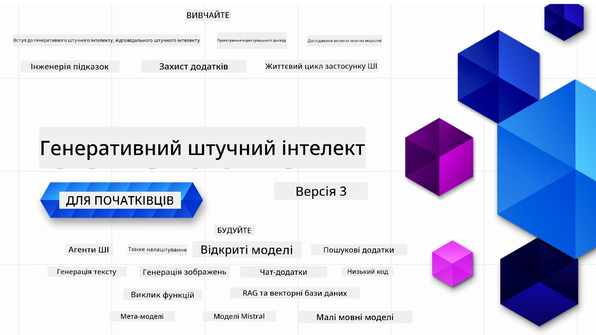

### 21 урок, що навчають усьому, що потрібно знати, щоб почати створювати додатки з Генеративним ШІ

[](https://github.com/microsoft/Generative-AI-For-Beginners/blob/master/LICENSE?WT.mc_id=academic-105485-koreyst)
[](https://GitHub.com/microsoft/Generative-AI-For-Beginners/graphs/contributors/?WT.mc_id=academic-105485-koreyst)
[](https://GitHub.com/microsoft/Generative-AI-For-Beginners/issues/?WT.mc_id=academic-105485-koreyst)
[](https://GitHub.com/microsoft/Generative-AI-For-Beginners/pulls/?WT.mc_id=academic-105485-koreyst)
[](http://makeapullrequest.com?WT.mc_id=academic-105485-koreyst)

[](https://GitHub.com/microsoft/Generative-AI-For-Beginners/watchers/?WT.mc_id=academic-105485-koreyst)
[](https://GitHub.com/microsoft/Generative-AI-For-Beginners/network/?WT.mc_id=academic-105485-koreyst)
[](https://GitHub.com/microsoft/Generative-AI-For-Beginners/stargazers/?WT.mc_id=academic-105485-koreyst)

[](https://discord.gg/nTYy5BXMWG)

### 🌐 Підтримка кількох мов

#### Підтримується через GitHub Action (Автоматично і завжди оновлюється)

<!-- CO-OP TRANSLATOR LANGUAGES TABLE START -->
[Арабська](../ar/README.md) | [Бенгальська](../bn/README.md) | [Болгарська](../bg/README.md) | [Бірманська (Мʼянма)](../my/README.md) | [Китайська (спрощена)](../zh-CN/README.md) | [Китайська (традиційна, Гонконг)](../zh-HK/README.md) | [Китайська (традиційна, Макао)](../zh-MO/README.md) | [Китайська (традиційна, Тайвань)](../zh-TW/README.md) | [Хорватська](../hr/README.md) | [Чеська](../cs/README.md) | [Данська](../da/README.md) | [Нідерландська](../nl/README.md) | [Естонська](../et/README.md) | [Фінська](../fi/README.md) | [Французька](../fr/README.md) | [Німецька](../de/README.md) | [Грецька](../el/README.md) | [Іврит](../he/README.md) | [Гінді](../hi/README.md) | [Угорська](../hu/README.md) | [Індонезійська](../id/README.md) | [Італійська](../it/README.md) | [Японська](../ja/README.md) | [Каннада](../kn/README.md) | [Кхмер](../km/README.md) | [Корейська](../ko/README.md) | [Литовська](../lt/README.md) | [Малайська](../ms/README.md) | [Малаялам](../ml/README.md) | [Маратхі](../mr/README.md) | [Непальська](../ne/README.md) | [Нігерійський Піджин](../pcm/README.md) | [Норвезька](../no/README.md) | [Перська (фарсі)](../fa/README.md) | [Польська](../pl/README.md) | [Португальська (Бразилія)](../pt-BR/README.md) | [Португальська (Португалія)](../pt-PT/README.md) | [Пенджабі (Гурмухі)](../pa/README.md) | [Румунська](../ro/README.md) | [Російська](../ru/README.md) | [Сербська (кирилиця)](../sr/README.md) | [Словацька](../sk/README.md) | [Словенська](../sl/README.md) | [Іспанська](../es/README.md) | [Свахілі](../sw/README.md) | [Шведська](../sv/README.md) | [Тагальська (філіппінська)](../tl/README.md) | [Тамільська](../ta/README.md) | [Телугу](../te/README.md) | [Тайська](../th/README.md) | [Турецька](../tr/README.md) | [Українська](./README.md) | [Урду](../ur/README.md) | [Вʼєтнамська](../vi/README.md)

> **Віддаєте перевагу клонувати локально?**
>
> Цей репозиторій включає понад 50 перекладів, що значно збільшує розмір завантаження. Щоб клонувати без перекладів, використовуйте sparse checkout:
>
> **Bash / macOS / Linux:**
> ```bash
> git clone --filter=blob:none --sparse https://github.com/microsoft/generative-ai-for-beginners.git
> cd generative-ai-for-beginners
> git sparse-checkout set --no-cone '/*' '!translations' '!translated_images'
> ```
>
> **CMD (Windows):**
> ```cmd
> git clone --filter=blob:none --sparse https://github.com/microsoft/generative-ai-for-beginners.git
> cd generative-ai-for-beginners
> git sparse-checkout set --no-cone "/*" "!translations" "!translated_images"
> ```
>
> Це дасть вам усе необхідне для проходження курсу з набагато швидшим завантаженням.
<!-- CO-OP TRANSLATOR LANGUAGES TABLE END -->

# Генеративний ШІ для початківців (Версія 3) - Курс

Вивчайте основи створення додатків з Генеративним ШІ з нашим всеосяжним курсом із 21 уроку від Microsoft Cloud Advocates.

## 🌱 Початок роботи

Цей курс містить 21 урок. Кожен урок охоплює окрему тему, тож починайте з будь-якого, який бажаєте!

Уроки позначені як "Learn" (Вивчайте) – уроки, що пояснюють концепцію Генеративного ШІ, або "Build" (Створюйте) – уроки, які пояснюють концепцію і надають приклади коду на **Python** та **TypeScript**, якщо це можливо.

Для розробників .NET подивіться [Generative AI for Beginners (.NET Edition)](https://github.com/microsoft/Generative-AI-for-beginners-dotnet?WT.mc_id=academic-105485-koreyst)!

Кожен урок також містить розділ "Keep Learning" з додатковими навчальними матеріалами.

## Що вам потрібно
### Щоб запускати код цього курсу, можна використовувати:
 - [Azure OpenAI Service](https://aka.ms/genai-beginners/azure-open-ai?WT.mc_id=academic-105485-koreyst) - **Уроки:** "aoai-assignment"
 - [GitHub Marketplace Model Catalog](https://aka.ms/genai-beginners/gh-models?WT.mc_id=academic-105485-koreyst) - **Уроки:** "githubmodels"
 - [OpenAI API](https://aka.ms/genai-beginners/open-ai?WT.mc_id=academic-105485-koreyst) - **Уроки:** "oai-assignment"
   
- Базові знання Python або TypeScript будуть корисні – \*Для абсолютних початківців перегляньте ці курси [Python](https://aka.ms/genai-beginners/python?WT.mc_id=academic-105485-koreyst) і [TypeScript](https://aka.ms/genai-beginners/typescript?WT.mc_id=academic-105485-koreyst)
- Обліковий запис GitHub, щоб [форкнути весь цей репозиторій](https://aka.ms/genai-beginners/github?WT.mc_id=academic-105485-koreyst) на свій GitHub

Ми створили урок **[Налаштування курсу](./00-course-setup/README.md?WT.mc_id=academic-105485-koreyst)**, щоб допомогти вам налаштувати середовище розробки.

Не забудьте [поставити зірочку (🌟) цьому репозиторію](https://docs.github.com/en/get-started/exploring-projects-on-github/saving-repositories-with-stars?WT.mc_id=academic-105485-koreyst), щоб легше було його знайти пізніше.

## 🧠 Готові до розгортання?

Якщо ви шукаєте більш просунуті приклади коду, ознайомтеся з нашою [колекцією прикладів коду Генеративного ШІ](https://aka.ms/genai-beg-code?WT.mc_id=academic-105485-koreyst) на **Python** та **TypeScript**.

## 🗣️ Познайомтеся з іншими учнями, отримайте підтримку

Приєднуйтесь до нашого [офіційного Discord-сервера Azure AI Foundry](https://aka.ms/genai-discord?WT.mc_id=academic-105485-koreyst), щоб познайомитися й спілкуватися з іншими учнями, що проходять цей курс, та отримати підтримку.

Питайте або діляться відгуками про продукт у нашому [Форумі розробників Azure AI Foundry](https://aka.ms/azureaifoundry/forum) на GitHub.

## 🚀 Будуєте стартап?

Відвідайте [Microsoft for Startups](https://www.microsoft.com/startups), щоб дізнатися, як почати створювати з кредитами Azure вже сьогодні.

## 🙏 Хотіли б допомогти?

Є пропозиції або знайшли помилки в орфографії чи коді? [Створіть проблему](https://github.com/microsoft/generative-ai-for-beginners/issues?WT.mc_id=academic-105485-koreyst) або [зробіть pull request](https://github.com/microsoft/generative-ai-for-beginners/pulls?WT.mc_id=academic-105485-koreyst)

## 📂 Кожен урок включає:

- Коротке відео введення в тему
- Писаний урок, розміщений у README
- Приклади коду на Python і TypeScript із підтримкою Azure OpenAI та OpenAI API
- Посилання на додаткові ресурси для подальшого навчання

## 🗃️ Уроки

| #   | **Посилання на урок**                                                                                                                        | **Опис**                                                                                       | **Відео**                                                                   | **Додаткове навчання**                                                         |
| --- | -------------------------------------------------------------------------------------------------------------------------------------------- | ---------------------------------------------------------------------------------------------- | --------------------------------------------------------------------------- | ------------------------------------------------------------------------------ |
| 00  | [Налаштування курсу](./00-course-setup/README.md?WT.mc_id=academic-105485-koreyst)                                                             | **Вивчайте:** Як налаштувати середовище розробки                                              | Відео скоро                                                                    | [Дізнатися більше](https://aka.ms/genai-collection?WT.mc_id=academic-105485-koreyst) |
| 01  | [Вступ до Генеративного ШІ та великих мовних моделей (LLMs)](./01-introduction-to-genai/README.md?WT.mc_id=academic-105485-koreyst)             | **Вивчайте:** Розуміння що таке Генеративний ШІ та як працюють великі мовні моделі (LLMs)      | [Відео](https://aka.ms/gen-ai-lesson-1-gh?WT.mc_id=academic-105485-koreyst) | [Дізнатися більше](https://aka.ms/genai-collection?WT.mc_id=academic-105485-koreyst) |
| 02  | [Дослідження та порівняння різних великих мовних моделей](./02-exploring-and-comparing-different-llms/README.md?WT.mc_id=academic-105485-koreyst) | **Вивчайте:** Як вибрати відповідну модель для вашого випадку використання                    | [Відео](https://aka.ms/gen-ai-lesson2-gh?WT.mc_id=academic-105485-koreyst)  | [Дізнатися більше](https://aka.ms/genai-collection?WT.mc_id=academic-105485-koreyst) |
| 03  | [Використання Генеративного ШІ відповідально](./03-using-generative-ai-responsibly/README.md?WT.mc_id=academic-105485-koreyst)                   | **Вивчайте:** Як відповідально створювати додатки з Генеративним ШІ                           | [Відео](https://aka.ms/gen-ai-lesson3-gh?WT.mc_id=academic-105485-koreyst)  | [Дізнатися більше](https://aka.ms/genai-collection?WT.mc_id=academic-105485-koreyst) |
| 04  | [Розуміння основ проектування підказок](./04-prompt-engineering-fundamentals/README.md?WT.mc_id=academic-105485-koreyst)             | **Вивчіть:** Практичні найкращі практики проектування підказок                                           | [Відео](https://aka.ms/gen-ai-lesson4-gh?WT.mc_id=academic-105485-koreyst)  | [Дізнатись більше](https://aka.ms/genai-collection?WT.mc_id=academic-105485-koreyst) |
| 05  | [Створення розвинених підказок](./05-advanced-prompts/README.md?WT.mc_id=academic-105485-koreyst)                                                | **Вивчіть:** Як застосовувати техніки проектування підказок для покращення результату                   | [Відео](https://aka.ms/gen-ai-lesson5-gh?WT.mc_id=academic-105485-koreyst)  | [Дізнатись більше](https://aka.ms/genai-collection?WT.mc_id=academic-105485-koreyst) |
| 06  | [Створення додатків для генерації тексту](./06-text-generation-apps/README.md?WT.mc_id=academic-105485-koreyst)                                | **Побудуйте:** Додаток для генерації тексту за допомогою Azure OpenAI / OpenAI API                      | [Відео](https://aka.ms/gen-ai-lesson6-gh?WT.mc_id=academic-105485-koreyst)  | [Дізнатись більше](https://aka.ms/genai-collection?WT.mc_id=academic-105485-koreyst) |
| 07  | [Створення чат-додатків](./07-building-chat-applications/README.md?WT.mc_id=academic-105485-koreyst)                                     | **Побудуйте:** Техніки для ефективного створення та інтеграції чат-додатків                             | [Відео](https://aka.ms/gen-ai-lessons7-gh?WT.mc_id=academic-105485-koreyst) | [Дізнатись більше](https://aka.ms/genai-collection?WT.mc_id=academic-105485-koreyst) |
| 08  | [Створення пошукових додатків із векторними базами даних](./08-building-search-applications/README.md?WT.mc_id=academic-105485-koreyst)                        | **Побудуйте:** Пошуковий додаток, який використовує Embeddings для пошуку даних                         | [Відео](https://aka.ms/gen-ai-lesson8-gh?WT.mc_id=academic-105485-koreyst)  | [Дізнатись більше](https://aka.ms/genai-collection?WT.mc_id=academic-105485-koreyst) |
| 09  | [Створення додатків для генерації зображень](./09-building-image-applications/README.md?WT.mc_id=academic-105485-koreyst)                        | **Побудуйте:** Додаток для генерації зображень                                                        | [Відео](https://aka.ms/gen-ai-lesson9-gh?WT.mc_id=academic-105485-koreyst)  | [Дізнатись більше](https://aka.ms/genai-collection?WT.mc_id=academic-105485-koreyst) |
| 10  | [Створення AI-додатків з низьким програмним кодом](./10-building-low-code-ai-applications/README.md?WT.mc_id=academic-105485-koreyst)                       | **Побудуйте:** Додаток Generative AI з використанням інструментів Low Code                              | [Відео](https://aka.ms/gen-ai-lesson10-gh?WT.mc_id=academic-105485-koreyst) | [Дізнатись більше](https://aka.ms/genai-collection?WT.mc_id=academic-105485-koreyst) |
| 11  | [Інтеграція зовнішніх додатків за допомогою виклику функцій](./11-integrating-with-function-calling/README.md?WT.mc_id=academic-105485-koreyst) | **Побудуйте:** Що таке виклик функцій і як застосовувати його в додатках                               | [Відео](https://aka.ms/gen-ai-lesson11-gh?WT.mc_id=academic-105485-koreyst) | [Дізнатись більше](https://aka.ms/genai-collection?WT.mc_id=academic-105485-koreyst) |
| 12  | [Проєктування UX для AI-додатків](./12-designing-ux-for-ai-applications/README.md?WT.mc_id=academic-105485-koreyst)                         | **Вивчіть:** Як застосовувати принципи UX дизайн при розробці Generative AI додатків                  | [Відео](https://aka.ms/gen-ai-lesson12-gh?WT.mc_id=academic-105485-koreyst) | [Дізнатись більше](https://aka.ms/genai-collection?WT.mc_id=academic-105485-koreyst) |
| 13  | [Захист ваших Generative AI-додатків](./13-securing-ai-applications/README.md?WT.mc_id=academic-105485-koreyst)                         | **Вивчіть:** Загрози та ризики для AI систем і методи їх захисту                                     | [Відео](https://aka.ms/gen-ai-lesson13-gh?WT.mc_id=academic-105485-koreyst) | [Дізнатись більше](https://aka.ms/genai-collection?WT.mc_id=academic-105485-koreyst) |
| 14  | [Життєвий цикл Generative AI-додатків](./14-the-generative-ai-application-lifecycle/README.md?WT.mc_id=academic-105485-koreyst)           | **Вивчіть:** Інструменти та метрики для керування життєвим циклом LLM та LLMOps                       | [Відео](https://aka.ms/gen-ai-lesson14-gh?WT.mc_id=academic-105485-koreyst) | [Дізнатись більше](https://aka.ms/genai-collection?WT.mc_id=academic-105485-koreyst) |
| 15  | [Retrieval Augmented Generation (RAG) та векторні бази даних](./15-rag-and-vector-databases/README.md?WT.mc_id=academic-105485-koreyst)        | **Побудуйте:** Додаток із використанням RAG Framework для отримання embedding з векторних баз даних  | [Відео](https://aka.ms/gen-ai-lesson15-gh?WT.mc_id=academic-105485-koreyst) | [Дізнатись більше](https://aka.ms/genai-collection?WT.mc_id=academic-105485-koreyst) |
| 16  | [Відкриті моделі та Hugging Face](./16-open-source-models/README.md?WT.mc_id=academic-105485-koreyst)                                    | **Побудуйте:** Додаток із використанням відкритих моделей, доступних на Hugging Face                 | [Відео](https://aka.ms/gen-ai-lesson16-gh?WT.mc_id=academic-105485-koreyst) | [Дізнатись більше](https://aka.ms/genai-collection?WT.mc_id=academic-105485-koreyst) |
| 17  | [AI агенти](./17-ai-agents/README.md?WT.mc_id=academic-105485-koreyst)                                                                       | **Побудуйте:** Додаток із використанням AI Agent Framework                                          | [Відео](https://aka.ms/gen-ai-lesson17-gh?WT.mc_id=academic-105485-koreyst) | [Дізнатись більше](https://aka.ms/genai-collection?WT.mc_id=academic-105485-koreyst) |
| 18  | [Тонке налаштування LLM](./18-fine-tuning/README.md?WT.mc_id=academic-105485-koreyst)                                                              | **Вивчіть:** Що таке, навіщо і як виконувати тонке налаштування LLM                                 | [Відео](https://aka.ms/gen-ai-lesson18-gh?WT.mc_id=academic-105485-koreyst) | [Дізнатись більше](https://aka.ms/genai-collection?WT.mc_id=academic-105485-koreyst) |
| 19  | [Створення з SLM](./19-slm/README.md?WT.mc_id=academic-105485-koreyst)                                                              | **Вивчіть:** Переваги створення з використанням Малих Мовних Моделей                                | Відео незабаром | [Дізнатись більше](https://aka.ms/genai-collection?WT.mc_id=academic-105485-koreyst) |
| 20  | [Створення з моделями Mistral](./20-mistral/README.md?WT.mc_id=academic-105485-koreyst)                                                              | **Вивчіть:** Особливості та відмінності моделей сімейства Mistral                                  | Відео незабаром | [Дізнатись більше](https://aka.ms/genai-collection?WT.mc_id=academic-105485-koreyst) |
| 21  | [Створення з моделями Meta](./21-meta/README.md?WT.mc_id=academic-105485-koreyst)                                                              | **Вивчіть:** Особливості та відмінності моделей сімейства Meta                                    | Відео незабаром | [Дізнатись більше](https://aka.ms/genai-collection?WT.mc_id=academic-105485-koreyst) |

### 🌟 Особлива подяка

Особлива подяка [**John Aziz**](https://www.linkedin.com/in/john0isaac/) за створення всіх дій і робочих процесів GitHub Actions

[**Bernhard Merkle**](https://www.linkedin.com/in/bernhard-merkle-738b73/) за ключовий внесок у кожен урок для покращення досвіду учнів і коду.

## 🎒 Інші курси

Наша команда створює й інші курси! Перегляньте:

<!-- CO-OP TRANSLATOR OTHER COURSES START -->
### LangChain
[](https://aka.ms/langchain4j-for-beginners)
[](https://aka.ms/langchainjs-for-beginners?WT.mc_id=m365-94501-dwahlin)
[](https://github.com/microsoft/langchain-for-beginners?WT.mc_id=m365-94501-dwahlin)
---

### Azure / Edge / MCP / Агенти
[](https://github.com/microsoft/AZD-for-beginners?WT.mc_id=academic-105485-koreyst)
[](https://github.com/microsoft/edgeai-for-beginners?WT.mc_id=academic-105485-koreyst)
[](https://github.com/microsoft/mcp-for-beginners?WT.mc_id=academic-105485-koreyst)
[](https://github.com/microsoft/ai-agents-for-beginners?WT.mc_id=academic-105485-koreyst)

---
 
### Серія Generative AI
[](https://github.com/microsoft/generative-ai-for-beginners?WT.mc_id=academic-105485-koreyst)
[-9333EA?style=for-the-badge&labelColor=E5E7EB&color=9333EA)](https://github.com/microsoft/Generative-AI-for-beginners-dotnet?WT.mc_id=academic-105485-koreyst)
[-C084FC?style=for-the-badge&labelColor=E5E7EB&color=C084FC)](https://github.com/microsoft/generative-ai-for-beginners-java?WT.mc_id=academic-105485-koreyst)
[-E879F9?style=for-the-badge&labelColor=E5E7EB&color=E879F9)](https://github.com/microsoft/generative-ai-with-javascript?WT.mc_id=academic-105485-koreyst)

---
 
### Основне навчання
[](https://aka.ms/ml-beginners?WT.mc_id=academic-105485-koreyst)
[](https://aka.ms/datascience-beginners?WT.mc_id=academic-105485-koreyst)
[](https://aka.ms/ai-beginners?WT.mc_id=academic-105485-koreyst)
[](https://github.com/microsoft/Security-101?WT.mc_id=academic-96948-sayoung)
[](https://aka.ms/webdev-beginners?WT.mc_id=academic-105485-koreyst)
[](https://aka.ms/iot-beginners?WT.mc_id=academic-105485-koreyst)
[](https://github.com/microsoft/xr-development-for-beginners?WT.mc_id=academic-105485-koreyst)

---
 
### Серія Copilot
[](https://aka.ms/GitHubCopilotAI?WT.mc_id=academic-105485-koreyst)
[](https://github.com/microsoft/mastering-github-copilot-for-dotnet-csharp-developers?WT.mc_id=academic-105485-koreyst)
[](https://github.com/microsoft/CopilotAdventures?WT.mc_id=academic-105485-koreyst)
<!-- CO-OP TRANSLATOR OTHER COURSES END -->

## Отримання допомоги

Якщо ви застрягли або у вас є запитання щодо створення AI-додатків. Приєднуйтесь до інших учнів і досвідчених розробників у обговореннях MCP. Це підтримуюча спільнота, де вітаються питання і вільно ділиться знаннями.

[](https://discord.gg/nTYy5BXMWG)

Якщо у вас є відгуки про продукт або ви зіткнулися з помилками під час розробки, відвідайте:

[](https://aka.ms/foundry/forum)

---

<!-- CO-OP TRANSLATOR DISCLAIMER START -->
**Відмова від відповідальності**:
Цей документ було перекладено за допомогою сервісу машинного перекладу [Co-op Translator](https://github.com/Azure/co-op-translator). Хоча ми прагнемо до точності, просимо враховувати, що автоматичні переклади можуть містити помилки або неточності. Оригінальний документ рідною мовою слід вважати авторитетним джерелом. Для критичної інформації рекомендується звертатися до професійного людського перекладу. Ми не несемо відповідальності за будь-які непорозуміння чи неправильні тлумачення, що виникли внаслідок використання цього перекладу.
<!-- CO-OP TRANSLATOR DISCLAIMER END -->