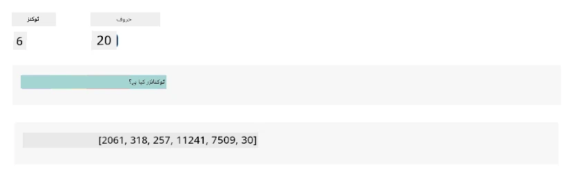
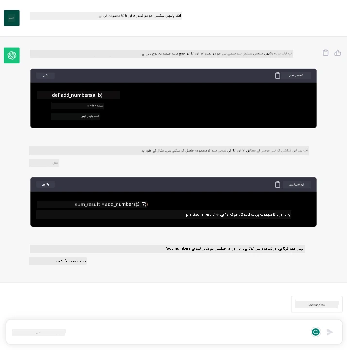

# جنریٹو AI اور بڑے زبان ماڈلز کا تعارف

_(اس سبق کا ویڈیو دیکھنے کے لیے اوپر تصویر پر کلک کریں)_

جنریٹو AI مصنوعی ذہانت ہے جو متن، تصاویر اور دیگر اقسام کے مواد تخلیق کرنے کی صلاحیت رکھتی ہے۔ اس ٹیکنالوجی کی خاص بات یہ ہے کہ یہ AI کو سب کے لیے قابل رسائی بناتی ہے، کوئی بھی صرف ایک سادہ ٹیکسٹ پرامپٹ، ایک جملہ قدرتی زبان میں لکھ کر اسے استعمال کر سکتا ہے۔ آپ کو کوئی زبان جیسے جاوا یا SQL سیکھنے کی ضرورت نہیں کہ کچھ مفید حاصل کیا جا سکے، بس اپنی زبان استعمال کریں، جو چاہیں بیان کریں اور ایک AI ماڈل کی طرف سے ایک تجویز سامنے آ جاتی ہے۔ اس کے استعمالات اور اثرات بہت وسیع ہیں، آپ سیکنڈوں میں رپورٹس لکھتے یا سمجھتے ہیں، ایپلیکیشنز لکھتے ہیں اور بہت کچھ کرتے ہیں۔

اس نصاب میں، ہم دیکھیں گے کہ ہماری اسٹارٹ اپ جنریٹو AI کو تعلیمی دنیا میں نئے مواقع کھولنے کے لیے کیسے استعمال کرتی ہے اور ہم اس کے سماجی اثرات اور ٹیکنالوجی کی حدود سے جڑی چیلنجز کو کس طرح حل کرتے ہیں۔

## تعارف

یہ سبق مندرجہ ذیل موضوعات پر مشتمل ہوگا:

- کاروباری منظر نامہ کا تعارف: ہماری اسٹارٹ اپ کا خیال اور مشن۔
- جنریٹو AI اور موجودہ ٹیکنالوجی کے منظرنامے تک ہماری رسائی۔
- بڑے زبان ماڈل کے اندرونی کام کی وضاحت۔
- بڑے زبان ماڈلز کی مرکزی خصوصیات اور عملی استعمالات۔

## تعلیمی اہداف

اس سبق کے مکمل ہونے کے بعد آپ سمجھ سکیں گے:

- جنریٹو AI کیا ہے اور بڑے زبان ماڈلز کیسے کام کرتے ہیں۔
- آپ تعلیمی مناظر میں مختلف استعمالات کے لیے بڑے زبان ماڈلز کا کیسے فائدہ اٹھا سکتے ہیں۔

## منظر نامہ: ہماری تعلیمی اسٹارٹ اپ

جنریٹو مصنوعی ذہانت (AI) AI ٹیکنالوجی کی چوٹی کی نمائندگی کرتی ہے، جو پہلے ناممکن سمجھے جانے والے کاموں کی حدوں کو بڑھا رہی ہے۔ جنریٹو AI ماڈلز کی کئی صلاحیتیں اور استعمالات ہیں، لیکن اس نصاب میں ہم ایک خیالی اسٹارٹ اپ کے ذریعے یہ دیکھیں گے کہ یہ تعلیم میں کیسے انقلاب لا رہا ہے۔ ہم اس اسٹارٹ اپ کو _ہماری اسٹارٹ اپ_ کہیں گے۔ ہماری اسٹارٹ اپ تعلیم کے میدان میں کام کر رہی ہے اور اس کا بلند حوصلہ مشن ہے

> _تعلیم میں عالمی سطح پر رسائی بہتر بنانا، تعلیم تک مساوی رسائی کو یقینی بنانا اور ہر سیکھنے والے کو اس کی ضروریات کے مطابق ذاتی نوعیت کی تعلیمی تجربات فراہم کرنا_۔

ہماری اسٹارٹ اپ ٹیم جانتی ہے کہ ہم اس ہدف کو جدید ترین اوزار یعنی بڑے زبان ماڈلز (LLMs) کے بغیر حاصل نہیں کر سکیں گے۔

توقع ہے کہ جنریٹو AI آج کے طریقہ تعلیم اور سیکھنے کو انقلاب سے گزرے گا، جہاں طلبہ کے پاس چوبیس گھنٹے ورچوئل اساتذہ ہوں گے جو وسیع معلومات اور مثالیں فراہم کریں، اور اساتذہ اپنے طلبہ کا اندازہ لگانے اور فیڈبیک دینے کے لیے جدید اوزار استعمال کر سکیں۔

شروع کرنے کے لیے، آئیں کچھ بنیادی تصورات اور اصطلاحات کی تعریف کرتے ہیں جو نصاب کے دوران بار بار استعمال ہوں گی۔

## جنریٹو AI تک ہمارا سفر کیسے ہوا؟

جنریٹو AI ماڈلز کے حالیہ تعارف کی وجہ سے جو بہت زیادہ _ہائپ_ پیدا ہوئی ہے، یہ ٹیکنالوجی کئی دہائیوں کی محنت کا نتیجہ ہے، جس کی پہلی تحقیقی کوششیں 60 کی دہائی سے شروع ہوئیں۔ آج ہم اس مقام پر پہنچے ہیں جہاں AI کے پاس انسانی ادراکی صلاحیتیں ہیں، جیسے بات چیت، جیسا کہ [OpenAI ChatGPT](https://openai.com/chatgpt) یا [Microsoft Copilot](https://copilot.microsoft.com/?WT.mc_id=academic-105485-koreyst) کے ذریعے دکھایا گیا، جو اپنی گفتگو کی ویب سرچ کے لیے GPT ماڈل استعمال کرتا ہے۔

پیچھے مڑ کر دیکھیں تو AI کے ابتدائی نمونے ٹائپ کیے گئے چیٹ بوٹس تھے، جو ماہرین کے علم پر مبنی تھے اور کمپیوٹر میں اس طرح محفوظ کیے گئے تھے۔ ان کے جوابات کی بنیاد ان کیورڈز ہوتے جو داخل شدہ متن میں ظاہر ہوتے تھے۔
لیکن جلد ہی یہ واضح ہو گیا کہ ایسے ٹائپ کیے گئے چیٹ بوٹس کا طریقہ کار اچھی طرح ترقی نہیں کر پایا۔

### AI کے لیے شماریاتی طریقہ: مشین لرننگ

90 کی دہائی میں ایک اہم موڑ آیا جب متن کے تجزیے کے لیے ایک شماریاتی طریقہ اپنایا گیا۔ اس نے نئے الگورتھمز کی ترقی کی راہ ہموار کی – جسے مشین لرننگ کہا جاتا ہے – جو بغیر واضح طور پر پروگرام کیے ہوئے ڈیٹا سے پیٹرنز کو سیکھ سکتے ہیں۔ اس طریقہ کار سے مشینیں انسانی زبان کی سمجھ بوجھ کا نقشہ بنا سکتی ہیں: ایک شماریاتی ماڈل متن اور لیبل کے جوڑوں پر تربیت پاتا ہے، اور اس طرح ماڈل نامعلوم متن کو پیغام کے ارادے کی نمائندگی کرنے والے پہلے سے طے شدہ لیبل کے ساتھ درجہ بندی کر سکتا ہے۔

### نیورل نیٹ ورکس اور جدید ورچوئل اسسٹنٹس

حالیہ برسوں میں ہارڈویئر کی تکنیکی ترقی، جو زیادہ ڈیٹا اور پیچیدہ حسابات سنبھال سکتی ہے، نے AI کے تحقیق کو بڑھاوا دیا، جس سے نیورل نیٹ ورکس یا گہری تعلیم کے جدید مشین لرننگ الگورتھمز تیار ہوئے۔

نیورل نیٹ ورکس (خاص طور پر ری کرنٹ نیورل نیٹ ورکس – RNNs) نے قدرتی زبان کی پروسیسنگ کو نمایاں طور پر بہتر بنایا، جس سے متن کے معنی کو بہتر طریقے سے پیش کیا گیا، جملے میں لفظ کے سیاق و سباق کو اہمیت دی گئی۔

یہ وہ ٹیکنالوجی ہے جس نے نئے صدی کی پہلی دہائی میں ورچوئل اسسٹنٹس کو جنم دیا، جو انسانی زبان کی تشریح میں ماہر ہیں، ضرورت کی نشاندہی کرتے ہیں اور اسے پورا کرنے کے لیے کارروائی کرتے ہیں – جیسے پہلے سے طے شدہ سکرپٹ سے جواب دینا یا تیسری پارٹی کی خدمت استعمال کرنا۔

### آج کا دور، جنریٹو AI

یوں کہا جا سکتا ہے کہ ہم آج جنریٹو AI تک پہنچے ہیں، جو گہری تعلیم کا ایک ذیلی حصہ ہے۔

AI کے میدان میں کئی دہائیوں کی تحقیق کے بعد، ایک نیا ماڈل فن تعمیر – جسے _ٹرنسفارمر_ کہا جاتا ہے – نے RNNs کی حدود کو عبور کیا، اور بہت لمبی متن کی ترتیب کو بطور ان پٹ لے سکتا ہے۔ ٹرنسفارمرز توجہ کے میکانزم پر مبنی ہوتے ہیں، جو ماڈل کو اپنے ان پٹس کو مختلف وزن دینے کی اجازت دیتا ہے، ‘زیادہ توجہ’ اس جگہ دینے میں جہاں سب سے زیادہ متعلقہ معلومات ہوتی ہیں، قطع نظر ترتیب کے۔

حالیہ جنریٹو AI ماڈلز – جنہیں بڑے زبان ماڈلز (LLMs) بھی کہا جاتا ہے، کیونکہ یہ متنی ان پٹس اور آؤٹ پٹس کے ساتھ کام کرتے ہیں – حقیقت میں اسی فن تعمیر پر مبنی ہیں۔ ان ماڈلز کی خاص بات یہ ہے کہ وہ بڑی مقدار میں غیر لیبل شدہ ڈیٹا جیسے کتابیں، مضامین اور ویب سائٹس سے تربیت پاتے ہیں، اور انہیں مختلف کاموں کے لیے ڈھالا جا سکتا ہے اور وہ گرامر کے لحاظ سے درست متن تخلیق کر سکتے ہیں جو تخلیقی لگتا ہے۔ اس کا مطلب یہ ہے کہ انہوں نے نہ صرف مشین کی صلاحیت کو ‘سمجھنے’ کے لیے بہتر بنایا، بلکہ انسانی زبان میں اصل جواب تخلیق کرنے کی صلاحیت بھی فراہم کی۔

## بڑے زبان ماڈلز کیسے کام کرتے ہیں؟

اگلے باب میں ہم جنریٹو AI ماڈلز کی مختلف اقسام دیکھیں گے، لیکن فی الحال ہم بڑے زبان ماڈلز کے کام کرنے کا طریقہ دیکھتے ہیں، خاص طور پر OpenAI GPT (جنریٹو پری ٹرینڈ ٹرنسفارمر) ماڈلز پر توجہ دیتے ہوئے۔

- **ٹوکینائزر، متن سے اعداد تک**: بڑے زبان ماڈلز ایک متن کو ان پٹ کے طور پر لیتے ہیں اور متن کو آؤٹ پٹ کے طور پر دیتے ہیں۔ تاہم، چونکہ یہ شماریاتی ماڈلز ہیں، یہ نمبروں کے ساتھ متن کی ترتیب سے بہتر کام کرتے ہیں۔ اسی لیے ماڈل کو بھیجے گئے ہر ان پٹ کو ایک ٹوکینائزر کے ذریعے پراسیس کیا جاتا ہے، ماڈل کے اصل حصے کے استعمال سے پہلے۔ ایک ٹوکین متن کا ایک حصہ ہوتا ہے – جو متغیر تعداد میں حروف پر مشتمل ہوتا ہے، اس لیے ٹوکینائزر کا اہم کام ان پٹس کو ٹوکینز کی ایک فہرست میں تقسیم کرنا ہوتا ہے۔ پھر ہر ٹوکین کو اس کے ٹوکین انڈیکس کے ساتھ میپ کیا جاتا ہے، جو اصل متن کے عددی انکوڈنگ ہوتا ہے۔

- **آؤٹ پٹ ٹوکین کی پیشن گوئی**: n ٹوکینز کو ان پٹ کے طور پر دینے پر (زیادہ سے زیادہ n ماڈل سے ماڈل مختلف ہو سکتا ہے)، ماڈل ایک ٹوکین کو آؤٹ پٹ کے طور پر پیش گوئی کر سکتا ہے۔ یہ ٹوکین پھر اگلی دہرانے میں ان پٹ میں شامل کر دیا جاتا ہے، ایک وسعت پذیر ونڈو پیٹرن میں، جو صارف کو ایک یا کئی جملے جواب کے طور پر ملنے کا بہتر تجربہ فراہم کرتا ہے۔ یہی وجہ ہے کہ اگر آپ نے کبھی ChatGPT کے ساتھ کھیلا ہے تو آپ نے محسوس کیا ہوگا کہ کبھی کبھار یہ جملے کے درمیان میں رُک جاتا ہے۔

- **چناؤ کا عمل، احتمالی تقسیم**: آؤٹ پٹ ٹوکین ماڈل کی پیش گوئی کی گئی ممکنہ ‘اگلے ٹوکینز’ کی احتمالی تقسیم کی بنیاد پر منتخب کیا جاتا ہے۔ تاہم، ہر بار سب سے زیادہ احتمال والا ٹوکین منتخب نہیں کیا جاتا۔ اس انتخاب میں ایک حد تک بے ترتیبیت شامل کی جاتی ہے تاکہ ماڈل غیر متعین (non-deterministic) انداز میں کام کرے – یعنی ایک ہی ان پٹ پر ہر بار بالکل یکساں جواب نہ ملے۔ اس بے ترتیبیت کی حد ‘درجہ حرارت’ نامی ماڈل پیرامیٹر کے ذریعے ایڈجسٹ کی جا سکتی ہے، جو تخلیقی سوچ کے عمل کی نقالی کرتی ہے۔

## ہماری اسٹارٹ اپ بڑے زبان ماڈلز سے کیسے فائدہ اٹھا سکتی ہے؟

اب جب کہ ہمارے پاس بڑے زبان ماڈل کے اندر کی ساخت کی بہتر سمجھ ہے، آئیے دیکھتے ہیں کچھ عملی مثالیں جو عام طور پر یہ ماڈلز بخوبی انجام دے سکتے ہیں، خاص طور پر ہمارے کاروباری منظر نامے پر نظر رکھتے ہوئے۔
ہم نے کہا تھا کہ بڑے زبان ماڈل کی مرکزی قابلیت _قدرتی زبان میں لکھے گئے متنی ان پٹ سے متن تخلیق کرنا_ ہے۔

لیکن کس قسم کا متنی ان پٹ اور آؤٹ پٹ؟
بڑے زبان ماڈل کے ان پٹ کو پرامپٹ کہا جاتا ہے، اور آؤٹ پٹ کو مکمل کاری (completion) کہا جاتا ہے، یہ اصطلاح ماڈل کے اس میکانزم کی طرف اشارہ کرتی ہے جو اگلا ٹوکین تخلیق کرتا ہے تاکہ موجودہ ان پٹ کو مکمل کرے۔ ہم پرامپٹ کیا ہوتا ہے اور اسے ڈیزائن کرنے کے طریقے پر گہرائی سے بات کریں گے تاکہ ماڈل سے بہترین نتائج حاصل ہوں۔ فی الحال، یہ کہہ سکتے ہیں کہ پرامپٹ میں شامل ہو سکتا ہے:

- ایک **ہدایت** جو ماڈل سے مطلوبہ آؤٹ پٹ کی قسم کی وضاحت کرتی ہے۔ یہ ہدایت بعض اوقات مثالیں یا اضافی ڈیٹا بھی شامل کر سکتی ہے۔

  1. کسی مضمون، کتاب، پروڈکٹ ریویوز وغیرہ کا خلاصہ اور غیر ساختہ ڈیٹا سے بصیرتیں نکالنا۔
    
    
  
  2. کسی مضمون، مضمون نویسی، اسائنمنٹ یا زیادہ کی تخلیقی خیالات اور ڈیزائن تیار کرنا۔
      
     

- ایک **سوال**، جو ایجنٹ سے بات چیت کی صورت میں پوچھا جائے۔
  
  

- ایک **متن کا ٹکڑا جو مکمل کیا جائے**، جو ضمنی طور پر تحریر کی مدد کی درخواست ہوتی ہے۔
  
  

- ایک **کوڈ کا ٹکڑا** جس کے ساتھ وضاحت اور دستاویزات بنانے کی درخواست، یا کوئی کمنٹ جو مخصوص ٹاسک کے لیے کوڈ بنانے کا کہتا ہو۔
  
  

اوپر دی گئی مثالیں کافی سادہ ہیں اور بڑے زبان ماڈلز کی صلاحیتوں کا مکمل مظاہرہ نہیں ہیں۔ یہ جنریٹو AI کے استعمال کی ممکنات، خاص طور پر لیکن محدود نہیں صرف تعلیمی سیاق و سباق میں دکھانے کے لیے ہیں۔

ساتھ ہی، جنریٹو AI ماڈل کا آؤٹ پٹ کامل نہیں ہوتا اور کبھی کبھار ماڈل کی تخلیقی صلاحیت اس کے خلاف جا سکتی ہے، جس کے نتیجے میں ایسا جواب نکلتا ہے جسے انسانی صارف حقیقت کی مبہم تصویر یا توہین آمیز سمجھ سکتا ہے۔ جنریٹو AI ذہین نہیں ہے – کم از کم اس تعریف میں نہیں جو ذہانت کو تفکری اور تخلیقی استدلال یا جذباتی ذہانت سمیت قبول کرتی ہے؛ یہ متعین نہیں ہے، اور قابل اعتماد نہیں کیونکہ غلط حوالہ جات، مواد اور بیانات صحیح معلومات کے ساتھ مل کر پیش کیے جا سکتے ہیں، اور پراثر اور پراعتماد انداز میں پیش کیے جاتے ہیں۔ آپ آئندہ اسباق میں ان تمام حدود سے نمٹنے کے طریقے دیکھیں گے اور سمجھیں گے کہ ہم انہیں کیسے کم کر سکتے ہیں۔

## اسائنمنٹ

آپ کا کام ہے کہ آپ [جنریٹو AI](https://en.wikipedia.org/wiki/Generative_artificial_intelligence?WT.mc_id=academic-105485-koreyst) کے بارے میں مزید پڑھیں اور اس علاقے کی نشاندہی کریں جہاں آپ آج جنریٹو AI شامل کرنا چاہیں گے جہاں موجود نہیں ہے۔ کیا اس کا اثر "پرانے طریقے" کے مقابلے میں مختلف ہوگا؟ کیا آپ کچھ ایسا کر سکیں گے جو پہلے نہیں کر سکتے تھے، یا آپ تیز تر ہوں گے؟ 300 الفاظ پر مشتمل ایک خلاصہ لکھیں کہ آپ کا خوابیدہ AI اسٹارٹ اپ کیسا ہوگا اور ہیڈرز شامل کریں جیسے "مسئلہ"، "میں AI کو کیسے استعمال کروں گا"، "اثر" اور اختیاری طور پر کاروباری منصوبہ۔

اگر آپ نے یہ کام مکمل کیا ہے تو آپ مائیکروسافٹ کے انکیوبیٹر [Microsoft for Startups Founders Hub](https://www.microsoft.com/startups?WT.mc_id=academic-105485-koreyst) کے لیے درخواست دینے کے لیے تیار ہو سکتے ہیں، جہاں ہم Azure، OpenAI، مشورہ اور بہت کچھ کے لیے کریڈٹس فراہم کرتے ہیں، ضرور دیکھیں!

## علم کی جانچ

بڑے زبان ماڈلز کے بارے میں کیا سچ ہے؟

1. آپ کو ہر بار بالکل ایک جیسا جواب ملتا ہے۔
1. یہ کام کامل طریقے سے کرتا ہے، عددی جمع کرنے، کام کرنے والا کوڈ بنانے وغیرہ میں ماہر ہے۔
1. جواب یکساں نہیں ہوتا، بھلے ہی آپ ایک ہی پرامپٹ استعمال کریں۔ یہ آپ کو کسی چیز کا پہلا مسودہ دینے میں بھی اچھا ہے، چاہے متن ہو یا کوڈ۔ لیکن آپ کو نتائج بہتر بنانے کی ضرورت ہوگی۔

جواب: 3، ایک LLM غیر متعین ہے، جواب مختلف ہوتا ہے، تاہم آپ اس کی مختلف حالت کو درجہ حرارت کی ترتیب سے کنٹرول کر سکتے ہیں۔ آپ کو یہ بھی توقع نہیں رکھنی چاہیے کہ یہ کام کامل کرے گا، یہ آپ کے لیے بھاری کام کرے گا جس کا مطلب ہے کہ آپ کو کسی چیز کا ایک اچھا ابتدائی مسودہ ملے گا جسے آپ کو بتدریج بہتر بنانا ہوگا۔

## بہت خوب! سفر جاری رکھیں

اس سبق کے مکمل ہونے پر، ہمارے [جنریٹو AI لرننگ مجموعہ](https://aka.ms/genai-collection?WT.mc_id=academic-105485-koreyst) کو دیکھیں تاکہ اپنی جنریٹو AI کی مہارتوں کو مزید بڑھایا جا سکے!

سبق 2 کی طرف جائیں جہاں ہم یہ دیکھیں گے کہ مختلف LLM اقسام کو [کس طرح دریافت اور موازنہ کیا جائے](../02-exploring-and-comparing-different-llms/README.md?WT.mc_id=academic-105485-koreyst)۔

---

<!-- CO-OP TRANSLATOR DISCLAIMER START -->
**ڈس کلیمر**:
یہ دستاویز AI ترجمہ سروس [Co-op Translator](https://github.com/Azure/co-op-translator) کے ذریعے ترجمہ کی گئی ہے۔ جبکہ ہم درستگی کے لیے کوشاں ہیں، براہ کرم اس بات سے آگاہ رہیں کہ خودکار ترجمے میں غلطیاں یا عدم درستیاں ہو سکتی ہیں۔ اصل دستاویز اپنے مادری زبان میں مستند ماخذ سمجھی جائے گی۔ حساس معلومات کے لیے پیشہ ور انسانی ترجمہ کی سفارش کی جاتی ہے۔ اس ترجمے کے استعمال سے پیدا ہونے والی کسی بھی غلط فہمی یا غلط تشریح کی ذمہ داری ہم قبول نہیں کرتے۔
<!-- CO-OP TRANSLATOR DISCLAIMER END -->