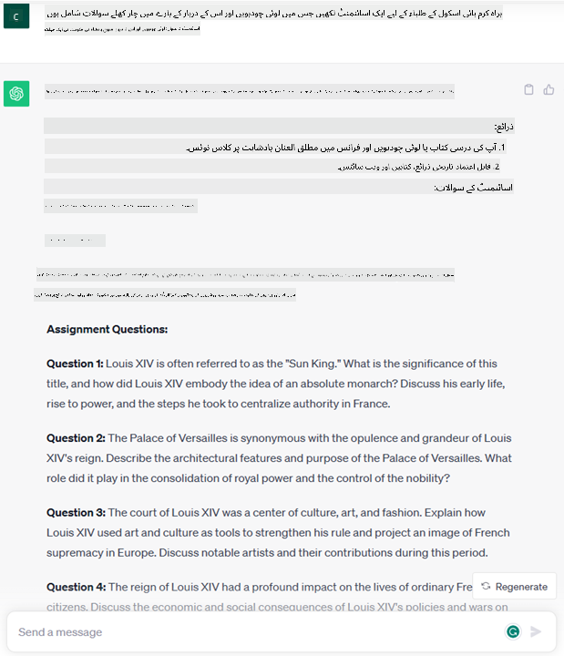
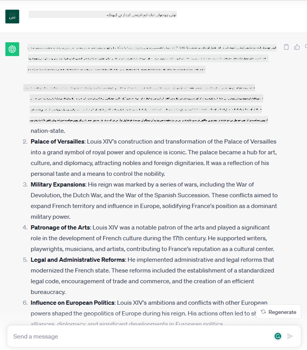

<!--
CO_OP_TRANSLATOR_METADATA:
{
  "original_hash": "bfb7901bdbece1ba3e9f35c400ca33e8",
  "translation_date": "2025-10-17T13:03:00+00:00",
  "source_file": "01-introduction-to-genai/README.md",
  "language_code": "ur"
}
-->
# جنریٹو اے آئی اور بڑے لینگویج ماڈلز کا تعارف

_(اوپر دی گئی تصویر پر کلک کریں تاکہ اس سبق کی ویڈیو دیکھ سکیں)_

جنریٹو اے آئی ایک ایسی مصنوعی ذہانت ہے جو متن، تصاویر اور دیگر اقسام کے مواد تخلیق کرنے کی صلاحیت رکھتی ہے۔ اس ٹیکنالوجی کی حیرت انگیز بات یہ ہے کہ یہ اے آئی کو عام لوگوں کے لیے قابل رسائی بناتی ہے۔ کوئی بھی اسے صرف ایک ٹیکسٹ پرامپٹ، یعنی قدرتی زبان میں لکھے گئے جملے کے ذریعے استعمال کر سکتا ہے۔ آپ کو جاوا یا SQL جیسی زبانیں سیکھنے کی ضرورت نہیں، بس اپنی زبان استعمال کریں، اپنی خواہش بیان کریں اور اے آئی ماڈل سے ایک تجویز حاصل کریں۔ اس کے اطلاق اور اثرات بہت وسیع ہیں، آپ رپورٹس لکھ سکتے ہیں یا سمجھ سکتے ہیں، درخواستیں بنا سکتے ہیں اور بہت کچھ، وہ بھی چند سیکنڈز میں۔

اس نصاب میں، ہم یہ دیکھیں گے کہ ہمارا اسٹارٹ اپ جنریٹو اے آئی کو کس طرح استعمال کرتا ہے تاکہ تعلیم کے میدان میں نئے مواقع پیدا کیے جا سکیں اور اس کے اطلاق کے سماجی اثرات اور ٹیکنالوجی کی حدود سے متعلق چیلنجز کا سامنا کیسے کیا جا سکتا ہے۔

## تعارف

یہ سبق درج ذیل موضوعات کا احاطہ کرے گا:

- کاروباری منظرنامے کا تعارف: ہمارے اسٹارٹ اپ کا آئیڈیا اور مشن۔
- جنریٹو اے آئی اور موجودہ ٹیکنالوجی کے منظرنامے تک پہنچنے کا سفر۔
- بڑے لینگویج ماڈل کی اندرونی ساخت۔
- بڑے لینگویج ماڈلز کی اہم صلاحیتیں اور عملی استعمال کے کیسز۔

## سیکھنے کے اہداف

اس سبق کو مکمل کرنے کے بعد، آپ سمجھ سکیں گے:

- جنریٹو اے آئی کیا ہے اور بڑے لینگویج ماڈلز کیسے کام کرتے ہیں۔
- آپ بڑے لینگویج ماڈلز کو مختلف استعمال کے لیے کیسے استعمال کر سکتے ہیں، خاص طور پر تعلیمی منظرناموں پر توجہ کے ساتھ۔

## منظرنامہ: ہمارا تعلیمی اسٹارٹ اپ

جنریٹو مصنوعی ذہانت (اے آئی) جدید ترین اے آئی ٹیکنالوجی کی چوٹی کی نمائندگی کرتی ہے، جو ان حدود کو دھکیلتی ہے جو کبھی ناممکن سمجھی جاتی تھیں۔ جنریٹو اے آئی ماڈلز میں کئی صلاحیتیں اور اطلاقات ہیں، لیکن اس نصاب کے لیے ہم دیکھیں گے کہ یہ تعلیم میں کس طرح انقلاب لا رہا ہے، ایک خیالی اسٹارٹ اپ کے ذریعے۔ ہم اس اسٹارٹ اپ کو _ہمارا اسٹارٹ اپ_ کہیں گے۔ ہمارا اسٹارٹ اپ تعلیم کے میدان میں کام کرتا ہے اور اس کا بلند حوصلہ مشن بیان ہے:

> _تعلیم میں رسائی کو عالمی سطح پر بہتر بنانا، مساوی تعلیم کی فراہمی کو یقینی بنانا اور ہر طالب علم کو ان کی ضروریات کے مطابق ذاتی نوعیت کے سیکھنے کے تجربات فراہم کرنا۔_

ہمارے اسٹارٹ اپ کی ٹیم جانتی ہے کہ ہم اس مقصد کو حاصل نہیں کر سکتے جب تک کہ ہم جدید دور کے سب سے طاقتور آلات میں سے ایک – بڑے لینگویج ماڈلز (LLMs) – کا فائدہ نہ اٹھائیں۔

جنریٹو اے آئی آج کے سیکھنے اور پڑھانے کے طریقے کو بدلنے کی توقع رکھتی ہے، جہاں طلباء کے پاس 24 گھنٹے دستیاب ورچوئل اساتذہ ہوں گے جو وسیع معلومات اور مثالیں فراہم کریں گے، اور اساتذہ اپنے طلباء کا جائزہ لینے اور فیڈبیک دینے کے لیے جدید آلات استعمال کر سکیں گے۔

شروع کرنے کے لیے، آئیے کچھ بنیادی تصورات اور اصطلاحات کی وضاحت کریں جو ہم نصاب کے دوران استعمال کریں گے۔

## جنریٹو اے آئی کیسے حاصل ہوئی؟

حال ہی میں جنریٹو اے آئی ماڈلز کے اعلان سے پیدا ہونے والے غیر معمولی _ہائپ_ کے باوجود، یہ ٹیکنالوجی کئی دہائیوں سے تیار ہو رہی ہے، جس کی پہلی تحقیقاتی کوششیں 60 کی دہائی میں شروع ہوئیں۔ ہم اب ایک ایسے مقام پر ہیں جہاں اے آئی انسانی علمی صلاحیتوں کی حامل ہے، جیسے کہ گفتگو، جیسا کہ [OpenAI ChatGPT](https://openai.com/chatgpt) یا [Bing Chat](https://www.microsoft.com/edge/features/bing-chat?WT.mc_id=academic-105485-koreyst) کے ذریعے دکھایا گیا ہے، جو ویب سرچ Bing گفتگو کے لیے بھی GPT ماڈل استعمال کرتا ہے۔

تھوڑا پیچھے جائیں تو، اے آئی کے ابتدائی پروٹوٹائپس ٹائپ شدہ چیٹ بوٹس پر مشتمل تھے، جو ماہرین کے ایک گروپ سے نکالی گئی معلومات پر مبنی تھے اور کمپیوٹر میں پیش کی گئی تھیں۔ علم کے ذخیرے میں موجود جوابات ان پٹ متن میں ظاہر ہونے والے کلیدی الفاظ کے ذریعے متحرک کیے گئے تھے۔
تاہم، جلد ہی یہ واضح ہو گیا کہ اس طرح کا طریقہ، ٹائپ شدہ چیٹ بوٹس کا استعمال کرتے ہوئے، اچھی طرح سے پیمانہ نہیں رکھتا۔

### اے آئی کے لیے شماریاتی نقطہ نظر: مشین لرننگ

90 کی دہائی میں ایک اہم موڑ آیا، جب متن کے تجزیے پر شماریاتی نقطہ نظر کا اطلاق کیا گیا۔ اس سے نئے الگورتھمز کی ترقی ہوئی – جنہیں مشین لرننگ کہا جاتا ہے – جو ڈیٹا سے پیٹرن سیکھنے کی صلاحیت رکھتے ہیں بغیر واضح طور پر پروگرام کیے گئے۔ اس نقطہ نظر نے مشینوں کو انسانی زبان کی تفہیم کی نقل کرنے کی اجازت دی: ایک شماریاتی ماڈل کو متن-لیبل جوڑوں پر تربیت دی گئی، جس سے ماڈل کو پہلے سے طے شدہ لیبل کے ساتھ نامعلوم ان پٹ متن کو درجہ بندی کرنے کی اجازت ملی جو پیغام کے ارادے کی نمائندگی کرتا ہے۔

### نیورل نیٹ ورکس اور جدید ورچوئل اسسٹنٹس

حالیہ برسوں میں، ہارڈویئر کی تکنیکی ترقی، جو زیادہ مقدار میں ڈیٹا اور زیادہ پیچیدہ حسابات کو سنبھالنے کی صلاحیت رکھتی ہے، نے اے آئی میں تحقیق کی حوصلہ افزائی کی، جس سے جدید مشین لرننگ الگورتھمز کی ترقی ہوئی جنہیں نیورل نیٹ ورکس یا ڈیپ لرننگ الگورتھمز کہا جاتا ہے۔

نیورل نیٹ ورکس (اور خاص طور پر ری کرنٹ نیورل نیٹ ورکس – RNNs) نے قدرتی زبان کی پروسیسنگ کو نمایاں طور پر بہتر بنایا، متن کے معنی کی نمائندگی کو زیادہ بامعنی طریقے سے قابل بنایا، جملے میں کسی لفظ کے سیاق و سباق کی قدر کی۔

یہ وہ ٹیکنالوجی ہے جس نے پہلی دہائی میں پیدا ہونے والے ورچوئل اسسٹنٹس کو طاقت دی، جو انسانی زبان کی تشریح کرنے، ضرورت کی شناخت کرنے، اور اسے پورا کرنے کے لیے ایک عمل انجام دینے میں بہت ماہر ہیں – جیسے کہ پہلے سے طے شدہ اسکرپٹ کے ساتھ جواب دینا یا کسی تیسرے فریق کی خدمت کا استعمال کرنا۔

### موجودہ دور، جنریٹو اے آئی

تو اس طرح ہم آج جنریٹو اے آئی تک پہنچے، جسے ڈیپ لرننگ کا ایک ذیلی حصہ سمجھا جا سکتا ہے۔

اے آئی کے میدان میں کئی دہائیوں کی تحقیق کے بعد، ایک نیا ماڈل آرکیٹیکچر – جسے _Transformer_ کہا جاتا ہے – نے RNNs کی حدود کو عبور کیا، جو متن کے زیادہ لمبے سلسلے کو ان پٹ کے طور پر حاصل کرنے کے قابل ہے۔ ٹرانسفارمرز توجہ کے میکانزم پر مبنی ہیں، جو ماڈل کو ان پٹ کو مختلف وزن دینے کے قابل بناتے ہیں، 'زیادہ توجہ' دیتے ہیں جہاں سب سے زیادہ متعلقہ معلومات مرکوز ہوتی ہیں، قطع نظر اس کے کہ وہ متن کے سلسلے میں کس ترتیب میں ہیں۔

حالیہ جنریٹو اے آئی ماڈلز – جنہیں بڑے لینگویج ماڈلز (LLMs) بھی کہا جاتا ہے، کیونکہ وہ متنی ان پٹ اور آؤٹ پٹ کے ساتھ کام کرتے ہیں – واقعی اس آرکیٹیکچر پر مبنی ہیں۔ ان ماڈلز کے بارے میں دلچسپ بات یہ ہے – جو کتابوں، مضامین اور ویب سائٹس جیسے متنوع ذرائع سے بڑی مقدار میں غیر لیبل شدہ ڈیٹا پر تربیت یافتہ ہیں – یہ ہے کہ انہیں مختلف قسم کے کاموں کے لیے ڈھال لیا جا سکتا ہے اور انسانی زبان میں تخلیقی صلاحیت کے ساتھ گرامر کے لحاظ سے درست متن تیار کر سکتے ہیں۔ تو، نہ صرف انہوں نے مشین کی 'سمجھنے' کی صلاحیت کو ناقابل یقین حد تک بڑھایا ہے، بلکہ انہوں نے انسانی زبان میں ایک اصل جواب پیدا کرنے کی صلاحیت کو بھی قابل بنایا ہے۔

## بڑے لینگویج ماڈلز کیسے کام کرتے ہیں؟

اگلے باب میں ہم جنریٹو اے آئی ماڈلز کی مختلف اقسام کا جائزہ لیں گے، لیکن فی الحال آئیے دیکھتے ہیں کہ بڑے لینگویج ماڈلز کیسے کام کرتے ہیں، خاص طور پر OpenAI GPT (Generative Pre-trained Transformer) ماڈلز پر توجہ کے ساتھ۔

- **ٹوکینائزر، متن کو نمبروں میں تبدیل کرنا**: بڑے لینگویج ماڈلز متن کو ان پٹ کے طور پر وصول کرتے ہیں اور متن کو آؤٹ پٹ کے طور پر تیار کرتے ہیں۔ تاہم، شماریاتی ماڈلز ہونے کی وجہ سے، وہ متن کے سلسلے کے مقابلے میں نمبروں کے ساتھ بہتر کام کرتے ہیں۔ یہی وجہ ہے کہ ماڈل کے بنیادی حصے کے استعمال سے پہلے ہر ان پٹ کو ٹوکینائزر کے ذریعے پروسیس کیا جاتا ہے۔ ایک ٹوکن متن کا ایک حصہ ہوتا ہے – جو متغیر تعداد کے حروف پر مشتمل ہوتا ہے، لہذا ٹوکینائزر کا بنیادی کام ان پٹ کو ٹوکنز کی صف میں تقسیم کرنا ہے۔ پھر، ہر ٹوکن کو ایک ٹوکن انڈیکس کے ساتھ میپ کیا جاتا ہے، جو اصل متن کے حصے کا عددی انکوڈنگ ہے۔

- **آؤٹپٹ ٹوکنز کی پیش گوئی کرنا**: دیے گئے n ٹوکنز کو انپٹ کے طور پر (زیادہ سے زیادہ n ماڈل سے ماڈل تک مختلف ہوتا ہے)، ماڈل ایک ٹوکن کو آؤٹپٹ کے طور پر پیش گوئی کرنے کے قابل ہوتا ہے۔ یہ ٹوکن پھر اگلی تکرار کے انپٹ میں شامل کیا جاتا ہے، ایک بڑھتے ہوئے ونڈو پیٹرن میں، ایک بہتر صارف تجربہ فراہم کرنے کے قابل بناتا ہے جس میں ایک (یا ایک سے زیادہ) جملہ جواب کے طور پر حاصل ہوتا ہے۔ یہ وضاحت کرتا ہے کہ کیوں، اگر آپ نے کبھی ChatGPT کے ساتھ تجربہ کیا ہو، تو آپ نے محسوس کیا ہوگا کہ کبھی کبھی ایسا لگتا ہے کہ یہ جملے کے درمیان رک جاتا ہے۔

- **انتخاب کا عمل، احتمال کی تقسیم**: آؤٹپٹ ٹوکن ماڈل کے ذریعے موجودہ متن کے سلسلے کے بعد ہونے کے امکان کے مطابق منتخب کیا جاتا ہے۔ یہ اس لیے ہے کہ ماڈل تمام ممکنہ 'اگلے ٹوکنز' پر احتمال کی تقسیم کی پیش گوئی کرتا ہے، جو اس کی تربیت کی بنیاد پر حساب کی جاتی ہے۔ تاہم، ہمیشہ ایسا نہیں ہوتا کہ سب سے زیادہ احتمال والے ٹوکن کو نتیجہ خیز تقسیم سے منتخب کیا جائے۔ اس انتخاب میں ایک حد تک بے ترتیبیت شامل کی جاتی ہے، اس طرح ماڈل غیر متعین انداز میں کام کرتا ہے - ہمیں ایک ہی انپٹ کے لیے بالکل ایک جیسا آؤٹپٹ نہیں ملتا۔ اس بے ترتیبیت کی حد کو تخلیقی سوچ کے عمل کی نقل کرنے کے لیے شامل کیا جاتا ہے اور اسے ماڈل پیرامیٹر جسے درجہ حرارت کہا جاتا ہے، کے ذریعے ایڈجسٹ کیا جا سکتا ہے۔

## ہمارا اسٹارٹ اپ بڑے لینگویج ماڈلز کو کیسے استعمال کر سکتا ہے؟

اب جب کہ ہم بڑے لینگویج ماڈل کی اندرونی ساخت کو بہتر طور پر سمجھ چکے ہیں، آئیے دیکھتے ہیں کہ وہ کون سے عام کام ہیں جنہیں وہ بہت اچھے طریقے سے انجام دے سکتے ہیں، ہمارے کاروباری منظرنامے پر نظر رکھتے ہوئے۔
ہم نے کہا کہ بڑے لینگویج ماڈل کی بنیادی صلاحیت _قدرتی زبان میں لکھے گئے متنی انپٹ سے شروع کرتے ہوئے، شروع سے متن تیار کرنا_ ہے۔

لیکن کس قسم کے متنی انپٹ اور آؤٹپٹ؟
بڑے لینگویج ماڈل کے انپٹ کو پرامپٹ کہا جاتا ہے، جبکہ آؤٹپٹ کو کمپلیشن کہا جاتا ہے، جو ماڈل کے میکانزم کا حوالہ دیتا ہے جو موجودہ انپٹ کو مکمل کرنے کے لیے اگلے ٹوکن کو تیار کرتا ہے۔ ہم یہ دیکھیں گے کہ پرامپٹ کیا ہے اور اسے اس طرح ڈیزائن کرنے کا طریقہ کہ ماڈل سے زیادہ سے زیادہ فائدہ حاصل کیا جا سکے۔ لیکن فی الحال، آئیے صرف یہ کہیں کہ پرامپٹ میں شامل ہو سکتا ہے:

- ایک **ہدایات** جو ماڈل سے متوقع آؤٹپٹ کی قسم کی وضاحت کرتی ہے۔ یہ ہدایات کبھی کبھار کچھ مثالیں یا کچھ اضافی ڈیٹا شامل کر سکتی ہیں۔

  1. کسی مضمون، کتاب، پروڈکٹ کے جائزے وغیرہ کا خلاصہ، ساتھ ہی غیر ساختہ ڈیٹا سے بصیرت نکالنا۔
    
    
  
  2. کسی مضمون، مضمون، اسائنمنٹ یا مزید کے تخلیقی خیالات اور ڈیزائن۔
      
     

- ایک **سوال**، جو کسی ایجنٹ کے ساتھ گفتگو کی شکل میں پوچھا گیا ہو۔
  
  

- ایک **متن کا حصہ مکمل کرنا**، جو بالواسطہ طور پر تحریری مدد کی درخواست ہے۔
  
  

- ایک **کوڈ کا حصہ**، ساتھ ہی اس کی وضاحت اور دستاویزات کی درخواست، یا ایک تبصرہ جو کسی مخصوص کام کو انجام دینے والے کوڈ کے ٹکڑے کو تیار کرنے کی درخواست کرتا ہے۔
  
  

اوپر دی گئی مثالیں کافی سادہ ہیں اور بڑے لینگویج ماڈلز کی صلاحیتوں کا مکمل مظاہرہ کرنے کے لیے نہیں ہیں۔ ان کا مقصد جنریٹو اے آئی کے استعمال کی صلاحیت کو ظاہر کرنا ہے، خاص طور پر لیکن تعلیمی سیاق و سباق تک محدود نہیں۔

اس کے علاوہ، جنریٹو اے آئی ماڈل کا آؤٹپٹ کامل نہیں ہوتا اور کبھی کبھار ماڈل کی تخلیقی صلاحیت اس کے خلاف کام کر سکتی ہے، جس کے نتیجے میں ایسا آؤٹپٹ ہوتا ہے جو الفاظ کا مجموعہ ہوتا ہے جسے انسانی صارف حقیقت کی غلط تشریح کے طور پر سمجھ سکتا ہے، یا یہ توہین آمیز ہو سکتا ہے۔ جنریٹو اے آئی ذہین نہیں ہے - کم از کم ذہانت کی زیادہ جامع تعریف میں، جس میں تنقیدی اور تخلیقی استدلال یا جذباتی ذہانت شامل ہے؛ یہ غیر متعین ہے، اور یہ قابل اعتماد نہیں ہے، کیونکہ غلط حوالہ جات، مواد، اور بیانات، درست معلومات کے ساتھ مل کر، اور ایک قائل اور پراعتماد انداز میں پیش کیے جا سکتے ہیں۔ اگلے اسباق میں، ہم ان تمام حدود سے نمٹیں گے اور دیکھیں گے کہ انہیں کم کرنے کے لیے ہم کیا کر سکتے ہیں۔

## اسائنمنٹ

آپ کا اسائنمنٹ یہ ہے کہ [جنریٹو اے آئی](https://en.wikipedia.org/wiki/Generative_artificial_intelligence?WT.mc_id=academic-105485-koreyst) کے بارے میں مزید پڑھیں اور ایک ایسا شعبہ تلاش کریں جہاں آپ آج جنریٹو اے آئی شامل کریں جو اس وقت موجود نہیں ہے۔ پرانے طریقے سے کرنے کے مقابلے میں اثر کیسے مختلف ہوگا، کیا آپ کچھ ایسا کر سکتے ہیں جو آپ پہلے نہیں کر سکتے تھے، یا کیا آپ تیز ہیں؟ اس پر 300 الفاظ کا خلاصہ لکھیں کہ آپ کا خواب اے آئی اسٹارٹ اپ کیسا ہوگا اور اس میں "مسئلہ"، "میں اے آئی کا استعمال کیسے کروں گا"، "اثر" اور اختیاری طور پر ایک کاروباری منصوبہ جیسے ہیڈرز شامل کریں۔

اگر آپ نے یہ کام کیا، تو آپ مائیکروسافٹ کے انکیوبیٹر، [Microsoft for Startups Founders Hub](https://www.microsoft.com/startups?WT.mc_id=academic-105485-koreyst) میں درخواست دینے کے لیے تیار ہو سکتے ہیں۔ ہم Azure، OpenAI، رہنمائی اور بہت کچھ کے لیے کریڈٹس پیش کرتے ہیں، اسے چیک کریں!

## علم کی جانچ

بڑے لینگویج ماڈلز کے بارے میں کیا درست ہے؟

1. آپ کو ہر بار بالکل ایک جیسا جواب ملتا ہے۔
1. یہ چیزیں بالکل درست کرتا ہے، نمبر شامل کرنے، کام کرنے والے کوڈ تیار کرنے وغیرہ میں بہترین ہے۔
1. جواب مختلف ہو سکتا ہے حالانکہ ایک
جائیے سبق نمبر 2 کی طرف جہاں ہم دیکھیں گے کہ [مختلف LLM اقسام کو کیسے دریافت کریں اور ان کا موازنہ کریں](../02-exploring-and-comparing-different-llms/README.md?WT.mc_id=academic-105485-koreyst)!

---

**ڈسکلیمر**:  
یہ دستاویز AI ترجمہ سروس [Co-op Translator](https://github.com/Azure/co-op-translator) کا استعمال کرتے ہوئے ترجمہ کی گئی ہے۔ ہم درستگی کے لیے کوشش کرتے ہیں، لیکن براہ کرم آگاہ رہیں کہ خودکار ترجمے میں غلطیاں یا غیر درستیاں ہو سکتی ہیں۔ اصل دستاویز کو اس کی اصل زبان میں مستند ذریعہ سمجھا جانا چاہیے۔ اہم معلومات کے لیے، پیشہ ور انسانی ترجمہ کی سفارش کی جاتی ہے۔ ہم اس ترجمے کے استعمال سے پیدا ہونے والی کسی بھی غلط فہمی یا غلط تشریح کے ذمہ دار نہیں ہیں۔