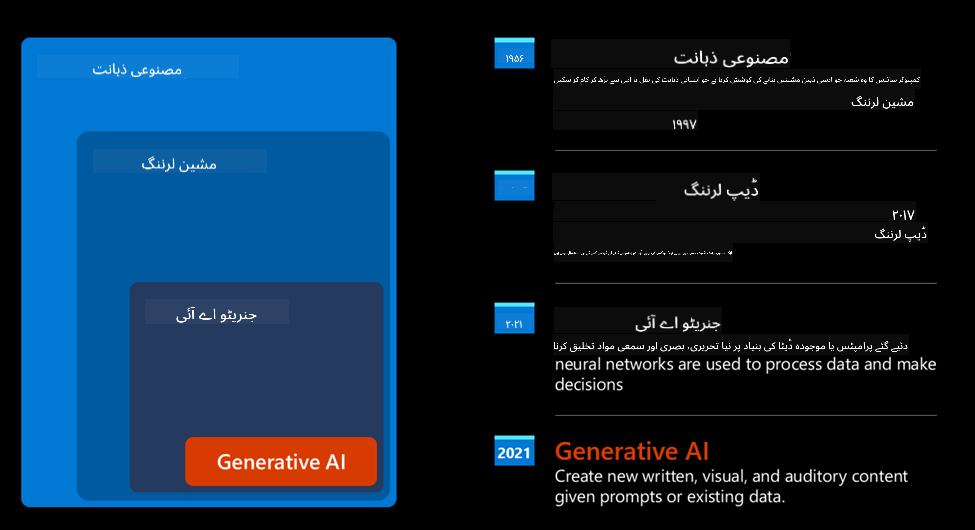
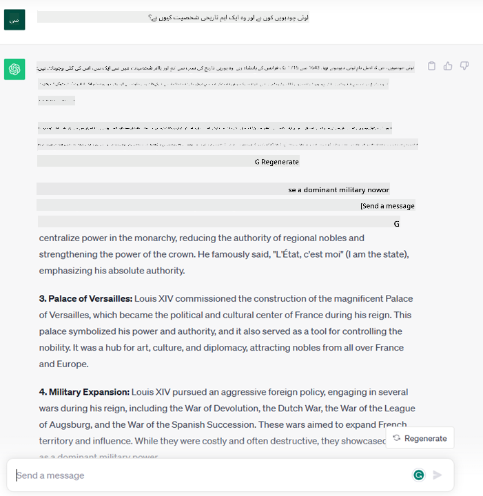

<!--
CO_OP_TRANSLATOR_METADATA:
{
  "original_hash": "f53ba0fa49164f9323043f1c6b11f2b1",
  "translation_date": "2025-07-09T07:43:26+00:00",
  "source_file": "01-introduction-to-genai/README.md",
  "language_code": "ur"
}
-->
# جنریٹو AI اور بڑے زبان کے ماڈلز کا تعارف

_(اس سبق کی ویڈیو دیکھنے کے لیے اوپر تصویر پر کلک کریں)_

جنریٹو AI ایک ایسی مصنوعی ذہانت ہے جو متن، تصاویر اور دیگر اقسام کے مواد تخلیق کرنے کی صلاحیت رکھتی ہے۔ اس ٹیکنالوجی کی خاص بات یہ ہے کہ یہ AI کو سب کے لیے قابل رسائی بناتی ہے، کوئی بھی اسے صرف ایک سادہ متن کے اشارے، یعنی قدرتی زبان میں لکھی گئی ایک جملے کے ذریعے استعمال کر سکتا ہے۔ آپ کو Java یا SQL جیسی زبانیں سیکھنے کی ضرورت نہیں کہ کوئی مفید کام کر سکیں، بس اپنی زبان میں اپنی خواہش بیان کریں اور AI ماڈل سے ایک تجویز حاصل کریں۔ اس کے استعمالات اور اثرات بہت وسیع ہیں، آپ رپورٹس لکھ سکتے ہیں، درخواستیں تیار کر سکتے ہیں اور بہت کچھ، وہ بھی چند سیکنڈز میں۔

اس نصاب میں، ہم دیکھیں گے کہ ہماری اسٹارٹ اپ کس طرح جنریٹو AI کا استعمال کر کے تعلیمی دنیا میں نئے مواقع پیدا کر رہی ہے اور ہم اس کے سماجی اثرات اور ٹیکنالوجی کی حدود سے جڑے چیلنجز کو کیسے حل کرتے ہیں۔

## تعارف

اس سبق میں شامل ہیں:

- کاروباری منظرنامے کا تعارف: ہماری اسٹارٹ اپ کا خیال اور مشن۔
- جنریٹو AI اور موجودہ ٹیکنالوجی کے منظرنامے تک ہمارا سفر۔
- بڑے زبان کے ماڈل کے اندرونی کام کرنے کا طریقہ۔
- بڑے زبان کے ماڈلز کی اہم صلاحیتیں اور عملی استعمالات۔

## سیکھنے کے مقاصد

اس سبق کے مکمل ہونے کے بعد، آپ سمجھ سکیں گے:

- جنریٹو AI کیا ہے اور بڑے زبان کے ماڈلز کیسے کام کرتے ہیں۔
- آپ مختلف استعمالات کے لیے بڑے زبان کے ماڈلز کو کیسے استعمال کر سکتے ہیں، خاص طور پر تعلیمی منظرناموں میں۔

## منظرنامہ: ہماری تعلیمی اسٹارٹ اپ

جنریٹو مصنوعی ذہانت (AI) AI ٹیکنالوجی کی چوٹی کی نمائندگی کرتی ہے، جو ان حدود کو توڑ رہی ہے جو کبھی ناممکن سمجھی جاتی تھیں۔ جنریٹو AI ماڈلز کی کئی صلاحیتیں اور استعمالات ہیں، لیکن اس نصاب میں ہم دیکھیں گے کہ یہ ایک فرضی اسٹارٹ اپ کے ذریعے تعلیم میں کس طرح انقلاب لا رہی ہے۔ ہم اس اسٹارٹ اپ کو _ہماری اسٹارٹ اپ_ کہیں گے۔ ہماری اسٹارٹ اپ تعلیمی میدان میں کام کرتی ہے اور اس کا بلند پرواز مشن ہے:

> _تعلیم میں عالمی سطح پر رسائی کو بہتر بنانا، تعلیم تک مساوی رسائی کو یقینی بنانا اور ہر طالب علم کو ان کی ضروریات کے مطابق ذاتی نوعیت کا تعلیمی تجربہ فراہم کرنا۔_

ہماری اسٹارٹ اپ کی ٹیم جانتی ہے کہ ہم اس مقصد کو جدید دور کے سب سے طاقتور اوزار – بڑے زبان کے ماڈلز (LLMs) – کے بغیر حاصل نہیں کر سکیں گے۔

جنریٹو AI آج کے تعلیمی طریقوں کو بدلنے کی توقع رکھتی ہے، جہاں طلبہ کے پاس 24 گھنٹے ورچوئل اساتذہ موجود ہوں جو وسیع معلومات اور مثالیں فراہم کریں، اور اساتذہ جدید اوزار استعمال کر کے طلبہ کی جانچ اور فیڈبیک دے سکیں۔

شروع کرنے کے لیے، آئیے کچھ بنیادی تصورات اور اصطلاحات کی وضاحت کریں جو ہم پورے نصاب میں استعمال کریں گے۔

## جنریٹو AI کیسے آیا؟

اگرچہ حال ہی میں جنریٹو AI ماڈلز کے اعلان سے بہت زیادہ _ہائپ_ پیدا ہوا ہے، یہ ٹیکنالوجی دہائیوں پر محیط ہے، جس کی پہلی تحقیقی کوششیں 60 کی دہائی سے شروع ہوئیں۔ آج ہم اس مقام پر ہیں جہاں AI میں انسانی ذہنی صلاحیتیں شامل ہیں، جیسے کہ بات چیت، جیسا کہ [OpenAI ChatGPT](https://openai.com/chatgpt) یا [Bing Chat](https://www.microsoft.com/edge/features/bing-chat?WT.mc_id=academic-105485-koreyst) میں دیکھا جا سکتا ہے، جو ویب سرچ Bing کی بات چیت کے لیے بھی GPT ماڈل استعمال کرتا ہے۔

تاریخی طور پر، AI کے ابتدائی پروٹوٹائپس ٹائپ رائٹن چیٹ بوٹس پر مشتمل تھے، جو ماہرین کے علم پر مبنی ایک ڈیٹا بیس پر انحصار کرتے تھے۔ ان کے جوابات ان کی ورودی عبارت میں موجود کلیدی الفاظ کی بنیاد پر دیے جاتے تھے۔ تاہم، جلد ہی یہ واضح ہو گیا کہ یہ طریقہ کار، یعنی ٹائپ رائٹن چیٹ بوٹس، بڑے پیمانے پر کام نہیں کرتا۔

### AI کے لیے شماریاتی طریقہ: مشین لرننگ

90 کی دہائی میں ایک اہم موڑ آیا، جب متن کے تجزیے کے لیے شماریاتی طریقہ اپنایا گیا۔ اس سے نئے الگورتھمز – جنہیں مشین لرننگ کہا جاتا ہے – تیار ہوئے جو بغیر واضح پروگرامنگ کے ڈیٹا سے پیٹرنز سیکھ سکتے ہیں۔ اس طریقہ سے مشینیں انسانی زبان کی سمجھ بوجھ کی نقل کر سکتی ہیں: ایک شماریاتی ماڈل متن اور اس کے لیبل کے جوڑوں پر تربیت پاتا ہے، جو اسے نامعلوم متن کو پہلے سے طے شدہ لیبل کے تحت درجہ بندی کرنے کے قابل بناتا ہے جو پیغام کی نیت کی نمائندگی کرتا ہے۔

### نیورل نیٹ ورکس اور جدید ورچوئل اسسٹنٹس

حالیہ برسوں میں، ہارڈویئر کی تکنیکی ترقی، جو زیادہ ڈیٹا اور پیچیدہ حسابات کو سنبھال سکتی ہے، نے AI میں تحقیق کو فروغ دیا، جس کے نتیجے میں نیورل نیٹ ورکس یا ڈیپ لرننگ الگورتھمز تیار ہوئے۔

نیورل نیٹ ورکس (خاص طور پر Recurrent Neural Networks – RNNs) نے قدرتی زبان کی پروسیسنگ کو بہت بہتر بنایا، جس سے متن کے معنی کو زیادہ مؤثر طریقے سے سمجھا جا سکا، اور جملے میں الفاظ کے سیاق و سباق کو اہمیت دی گئی۔

یہی ٹیکنالوجی ہے جس نے نئے صدی کے پہلے عشرے میں ورچوئل اسسٹنٹس کو طاقت دی، جو انسانی زبان کو سمجھنے، ضرورت کی شناخت کرنے اور اس کو پورا کرنے کے لیے ایکشن لینے میں ماہر تھے – جیسے پہلے سے طے شدہ اسکرپٹ کے ساتھ جواب دینا یا کسی تیسری پارٹی کی سروس استعمال کرنا۔

### آج کا جنریٹو AI

یہی وجہ ہے کہ ہم آج جنریٹو AI تک پہنچے ہیں، جسے ڈیپ لرننگ کا ایک ذیلی حصہ سمجھا جا سکتا ہے۔

AI کے میدان میں دہائیوں کی تحقیق کے بعد، ایک نیا ماڈل آرکیٹیکچر – جسے _Transformer_ کہا جاتا ہے – نے RNNs کی حدود کو عبور کیا، اور بہت لمبی متن کی ترتیب کو بطور ان پٹ لے سکتا ہے۔ Transformers توجہ کے میکانزم پر مبنی ہیں، جو ماڈل کو ان ان پٹس کو مختلف وزن دینے کی اجازت دیتا ہے جو اسے ملتے ہیں، یعنی وہ زیادہ توجہ اس جگہ دیتا ہے جہاں سب سے زیادہ متعلقہ معلومات ہوتی ہیں، چاہے وہ متن کی ترتیب میں کہیں بھی ہوں۔

زیادہ تر حالیہ جنریٹو AI ماڈلز – جنہیں بڑے زبان کے ماڈلز (LLMs) بھی کہا جاتا ہے، کیونکہ یہ متنی ان پٹ اور آؤٹ پٹ کے ساتھ کام کرتے ہیں – اسی آرکیٹیکچر پر مبنی ہیں۔ ان ماڈلز کی خاص بات یہ ہے کہ یہ بہت بڑی مقدار میں غیر لیبل شدہ ڈیٹا جیسے کتابیں، مضامین اور ویب سائٹس سے تربیت یافتہ ہوتے ہیں، اور انہیں مختلف کاموں کے لیے ڈھالا جا سکتا ہے، اور یہ گرامر کے لحاظ سے درست اور تخلیقی انداز میں متن تیار کر سکتے ہیں۔ اس طرح، انہوں نے مشین کی صلاحیت کو نہ صرف ان پٹ متن کو ‘سمجھنے’ میں بہت بڑھایا بلکہ انسانی زبان میں اصل جواب تخلیق کرنے کی صلاحیت بھی دی۔

## بڑے زبان کے ماڈلز کیسے کام کرتے ہیں؟

اگلے باب میں ہم مختلف قسم کے جنریٹو AI ماڈلز کا جائزہ لیں گے، لیکن فی الحال آئیے بڑے زبان کے ماڈلز، خاص طور پر OpenAI GPT (Generative Pre-trained Transformer) ماڈلز کے کام کرنے کے طریقہ پر نظر ڈالیں۔

- **Tokenizer، متن کو نمبروں میں تبدیل کرنا**: بڑے زبان کے ماڈلز متن کو ان پٹ کے طور پر لیتے ہیں اور متن کو آؤٹ پٹ کے طور پر دیتے ہیں۔ تاہم، چونکہ یہ شماریاتی ماڈلز ہیں، یہ نمبروں کے ساتھ متن کے مقابلے میں بہتر کام کرتے ہیں۔ اسی لیے ہر ان پٹ کو tokenizer کے ذریعے پروسیس کیا جاتا ہے، جو متن کے چھوٹے حصوں یعنی tokens میں تقسیم کرتا ہے۔ ہر token ایک متن کا ٹکڑا ہوتا ہے جس میں مختلف تعداد میں حروف ہو سکتے ہیں، اور tokenizer کا کام ان tokens کی ایک فہرست بنانا ہوتا ہے۔ پھر ہر token کو ایک عددی انڈیکس دیا جاتا ہے، جو اصل متن کے اس ٹکڑے کی عددی نمائندگی ہے۔

- **آؤٹ پٹ tokens کی پیش گوئی**: ماڈل کو n tokens ان پٹ کے طور پر دیے جاتے ہیں (زیادہ سے زیادہ n ماڈل کے لحاظ سے مختلف ہوتا ہے)، اور ماڈل ایک token آؤٹ پٹ کے طور پر پیش گوئی کرتا ہے۔ یہ token اگلی بار ان پٹ میں شامل کر دیا جاتا ہے، ایک بڑھتے ہوئے ونڈو پیٹرن میں، تاکہ صارف کو ایک یا زیادہ جملے جواب کے طور پر مل سکیں۔ یہی وجہ ہے کہ اگر آپ نے کبھی ChatGPT کے ساتھ تجربہ کیا ہو تو آپ نے محسوس کیا ہوگا کہ کبھی کبھار یہ جملے کے درمیان میں رک جاتا ہے۔

- **انتخاب کا عمل، احتمال کی تقسیم**: آؤٹ پٹ token ماڈل اس کی موجودہ متن کی ترتیب کے بعد آنے کے امکان کی بنیاد پر منتخب کرتا ہے۔ ماڈل تمام ممکنہ ‘اگلے tokens’ پر احتمال کی تقسیم پیش کرتا ہے، جو اس کی تربیت کی بنیاد پر حساب کی جاتی ہے۔ تاہم، ہمیشہ سب سے زیادہ احتمال والا token منتخب نہیں ہوتا۔ اس انتخاب میں کچھ حد تک تصادفی پن شامل کیا جاتا ہے تاکہ ماڈل غیر متعین (non-deterministic) انداز میں کام کرے – یعنی ایک ہی ان پٹ کے لیے ہمیشہ ایک جیسا جواب نہ ملے۔ یہ تصادفی پن تخلیقی سوچ کے عمل کی نقل کے لیے شامل کیا جاتا ہے اور اسے ماڈل کے ایک پیرامیٹر temperature کے ذریعے کنٹرول کیا جا سکتا ہے۔

## ہماری اسٹارٹ اپ بڑے زبان کے ماڈلز سے کیسے فائدہ اٹھا سکتی ہے؟

اب جب کہ ہم بڑے زبان کے ماڈل کے اندرونی کام کرنے کا بہتر فہم حاصل کر چکے ہیں، آئیے کچھ عملی مثالیں دیکھتے ہیں کہ یہ ماڈلز عام طور پر کون سے کام اچھے طریقے سے انجام دے سکتے ہیں، خاص طور پر ہمارے کاروباری منظرنامے کے تناظر میں۔

ہم نے کہا کہ بڑے زبان کے ماڈل کی بنیادی صلاحیت _قدرتی زبان میں لکھے گئے متنی ان پٹ سے مکمل طور پر نیا متن تخلیق کرنا ہے_۔

لیکن کس قسم کا متنی ان پٹ اور آؤٹ پٹ؟

بڑے زبان کے ماڈل کا ان پٹ ایک prompt کہلاتا ہے، جبکہ آؤٹ پٹ کو completion کہا جاتا ہے، جو ماڈل کے اس طریقہ کار کی نشاندہی کرتا ہے کہ وہ اگلا token تخلیق کر کے موجودہ ان پٹ کو مکمل کرتا ہے۔ ہم آگے چل کر prompt کیا ہوتا ہے اور اسے کیسے ڈیزائن کیا جائے تاکہ ماڈل سے بہترین نتائج حاصل ہوں، اس پر تفصیل سے بات کریں گے۔ فی الحال، بس اتنا جان لیں کہ prompt میں شامل ہو سکتا ہے:

- ایک **ہدایات** جو ماڈل سے متوقع آؤٹ پٹ کی قسم بتاتی ہے۔ یہ ہدایات بعض اوقات کچھ مثالیں یا اضافی ڈیٹا بھی شامل کر سکتی ہیں۔

  1. کسی مضمون، کتاب، پروڈکٹ ریویوز وغیرہ کا خلاصہ، اور غیر منظم ڈیٹا سے بصیرت نکالنا۔
    
    
  
  2. تخلیقی خیالات اور کسی مضمون، مضمون نویسی، اسائنمنٹ یا دیگر کی ڈیزائننگ۔
      
     

- ایک **سوال**، جو کسی ایجنٹ کے ساتھ گفتگو کی شکل میں پوچھا گیا ہو۔
  
  

- ایک **متن کا ٹکڑا جسے مکمل کرنا ہو**، جو بالواسطہ طور پر تحریری مدد کی درخواست ہوتی ہے۔
  
  

- ایک **کوڈ کا ٹکڑا** جس کے ساتھ اس کی وضاحت اور دستاویزات بنانے کی درخواست ہو، یا کوئی تبصرہ جو مخصوص کام کرنے والا کوڈ تیار کرنے کو کہتا ہو۔
  
  

مندرجہ بالا مثالیں کافی سادہ ہیں اور بڑے زبان کے ماڈلز کی صلاحیتوں کا مکمل مظاہرہ نہیں ہیں۔ یہ صرف جنریٹو AI کے استعمال کی صلاحیت دکھانے کے لیے ہیں، خاص طور پر تعلیمی سیاق و سباق میں۔

ساتھ ہی، جنریٹو AI کا آؤٹ پٹ ہمیشہ کامل نہیں ہوتا اور بعض اوقات ماڈل کی تخلیقی صلاحیت اس کے خلاف کام کر سکتی ہے، جس سے ایسا نتیجہ نکلتا ہے جسے انسان حقیقت کی مبہم تصویر یا توہین آمیز سمجھ سکتا ہے۔ جنریٹو AI ذہین نہیں ہے – کم از کم اس جامع تعریف میں جو تنقیدی اور تخلیقی استدلال یا جذباتی ذہانت شامل کرتی ہے؛ یہ غیر متعین ہے، اور قابل اعتماد نہیں، کیونکہ غلط حوالہ جات، مواد اور بیانات درست معلومات کے ساتھ مل کر پیش کیے جا سکتے ہیں، اور پر اعتماد انداز میں پیش کیے جا سکتے ہیں۔ اگلے اسباق میں ہم ان تمام حدود سے نمٹیں گے اور دیکھیں گے کہ انہیں کم کرنے کے لیے کیا کیا جا سکتا ہے۔

## اسائنمنٹ

آپ کا اسائنمنٹ ہے کہ آپ [generative AI](https://en.wikipedia.org/wiki/Generative_artificial_intelligence?WT.mc_id=academic-105485-koreyst) کے بارے میں مزید پڑھیں اور کوئی ایسا شعبہ تلاش کریں جہاں آج جنریٹو AI شامل نہیں ہے لیکن آپ اسے شامل کرنا چاہیں گے۔ اس کا اثر "پرانے طریقے" سے مختلف کیسے ہوگا؟ کیا آپ وہ کچھ کر سکیں گے جو پہلے نہیں کر سکتے تھے، یا کیا آپ زیادہ تیزی سے کر سکیں گے؟ 300 الفاظ پر مشتمل ایک خلاصہ لکھیں کہ آپ کا خوابوں کا AI اسٹارٹ اپ کیسا ہوگا اور اس میں "مسئلہ"، "میں AI کیسے استعمال کروں گا"، "اثر" جیسے عنوانات شامل کریں، اور اگر چاہیں تو کاروباری منصوبہ بھی۔

اگر آپ نے یہ کام کیا، تو آپ مائیکروسافٹ کے انکیوبیٹر، [Microsoft for Startups Founders Hub](https://www.microsoft.com/startups?WT.mc_id=academic-105485-koreyst) میں درخواست دینے کے لیے تیار ہو سکتے ہیں۔ ہم Azure، OpenAI، رہنمائی اور بہت کچھ کے لیے کریڈٹس فراہم کرتے ہیں، ضرور دیکھیں!

## علم کی جانچ

بڑے زبان کے ماڈلز کے بارے میں کیا درست ہے؟

1. آپ کو ہر بار بالکل ایک جیسا جواب ملتا ہے۔  
1. یہ کام مکمل طور پر درست کرتا ہے، جیسے نمبر جمع کرنا، کام کرنے والا کوڈ تیار کرنا وغیرہ۔  
1. جواب مختلف ہو سکتا ہے حالانکہ آپ نے ایک ہی prompt استعمال کیا ہو۔ یہ آپ کو کسی چیز کا پہلا مسودہ دینے میں بھی ماہر ہے، چاہے وہ متن ہو یا کوڈ۔ لیکن آپ کو نتائج کو بہتر بنانے کی ضرورت ہوتی ہے۔

جواب: 3، ایک LLM غیر متعین ہوتا ہے، جواب مختلف ہوتا ہے، تاہم آپ اس کی تبدیلی کو temperature سیٹنگ کے ذریعے کنٹرول کر سکتے ہیں۔ آپ کو یہ توقع نہیں رکھنی چاہیے کہ یہ کام مکمل طور پر درست کرے گا، یہ آپ کے لیے بھاری کام آسان بنانے کے لیے ہے، جس کا مطلب اکثر یہ ہوتا ہے کہ آپ کو کسی چیز کا اچھا پہلا مسودہ ملتا ہے جسے آپ کو آہستہ آہستہ بہتر بنانا ہوتا ہے۔

## شاباش! سفر جاری رکھیں

اس سبق کے مکمل ہونے کے بعد، ہماری [Generative AI Learning collection](https://aka.ms/genai-collection?WT.mc_id=academic-105485-koreyst) دیکھیں تاکہ آپ اپنی جنریٹو AI کی معلومات کو مزید بڑھا سکیں!
سبق 2 پر جائیں جہاں ہم دیکھیں گے کہ مختلف LLM اقسام کو کیسے [دریافت اور موازنہ کیا جائے](../02-exploring-and-comparing-different-llms/README.md?WT.mc_id=academic-105485-koreyst)!

**دستخطی نوٹ**:  
یہ دستاویز AI ترجمہ سروس [Co-op Translator](https://github.com/Azure/co-op-translator) کے ذریعے ترجمہ کی گئی ہے۔ اگرچہ ہم درستگی کے لیے کوشاں ہیں، براہ کرم آگاہ رہیں کہ خودکار ترجمے میں غلطیاں یا عدم درستیاں ہو سکتی ہیں۔ اصل دستاویز اپنی مادری زبان میں ہی معتبر ماخذ سمجھی جانی چاہیے۔ اہم معلومات کے لیے پیشہ ور انسانی ترجمہ کی سفارش کی جاتی ہے۔ اس ترجمے کے استعمال سے پیدا ہونے والی کسی بھی غلط فہمی یا غلط تشریح کی ذمہ داری ہم پر عائد نہیں ہوتی۔