<!--
CO_OP_TRANSLATOR_METADATA:
{
  "original_hash": "6b7629b8ee4d7d874a27213e903d86a7",
  "translation_date": "2025-10-17T13:12:56+00:00",
  "source_file": "02-exploring-and-comparing-different-llms/README.md",
  "language_code": "ur"
}
-->
# مختلف LLMs کا جائزہ اور موازنہ

[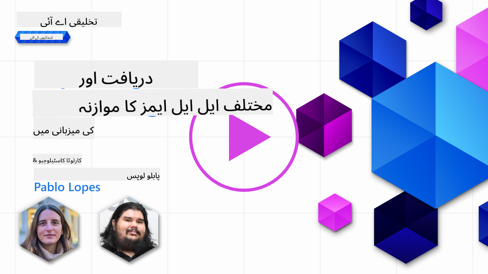](https://youtu.be/KIRUeDKscfI?si=8BHX1zvwzQBn-PlK)

> _اوپر دی گئی تصویر پر کلک کریں تاکہ اس سبق کی ویڈیو دیکھ سکیں_

پچھلے سبق میں ہم نے دیکھا کہ جنریٹو AI کس طرح ٹیکنالوجی کے منظرنامے کو تبدیل کر رہا ہے، بڑے زبان کے ماڈلز (LLMs) کیسے کام کرتے ہیں اور ایک کاروبار - جیسے ہمارا اسٹارٹ اپ - انہیں اپنے استعمال کے معاملات میں کیسے لاگو کر سکتا ہے اور ترقی کر سکتا ہے! اس باب میں، ہم مختلف قسم کے بڑے زبان کے ماڈلز (LLMs) کا موازنہ اور تضاد کریں گے تاکہ ان کے فوائد اور نقصانات کو سمجھ سکیں۔

ہمارے اسٹارٹ اپ کے سفر کا اگلا مرحلہ موجودہ LLMs کے منظرنامے کا جائزہ لینا اور یہ سمجھنا ہے کہ کون سا ہمارے استعمال کے معاملے کے لیے موزوں ہے۔

## تعارف

یہ سبق شامل کرے گا:

- موجودہ منظرنامے میں مختلف قسم کے LLMs۔
- Azure میں اپنے استعمال کے معاملے کے لیے مختلف ماڈلز کی جانچ، تکرار، اور موازنہ۔
- LLM کو کیسے تعینات کریں۔

## سیکھنے کے اہداف

اس سبق کو مکمل کرنے کے بعد، آپ قابل ہوں گے:

- اپنے استعمال کے معاملے کے لیے صحیح ماڈل کا انتخاب کریں۔
- یہ سمجھیں کہ اپنے ماڈل کی کارکردگی کو کیسے جانچیں، تکرار کریں، اور بہتر بنائیں۔
- یہ جانیں کہ کاروبار ماڈلز کو کیسے تعینات کرتے ہیں۔

## مختلف قسم کے LLMs کو سمجھیں

LLMs کو ان کی ساخت، تربیتی ڈیٹا، اور استعمال کے معاملے کی بنیاد پر مختلف زمروں میں تقسیم کیا جا سکتا ہے۔ ان اختلافات کو سمجھنا ہمارے اسٹارٹ اپ کو صحیح ماڈل منتخب کرنے میں مدد دے گا اور یہ سمجھنے میں کہ کارکردگی کو کیسے جانچیں، تکرار کریں، اور بہتر بنائیں۔

LLMs کی کئی مختلف اقسام ہیں، آپ کا ماڈل کا انتخاب اس پر منحصر ہے کہ آپ انہیں کس مقصد کے لیے استعمال کرنا چاہتے ہیں، آپ کا ڈیٹا، آپ کتنا خرچ کرنے کے لیے تیار ہیں اور مزید۔

اگر آپ ماڈلز کو متن، آڈیو، ویڈیو، تصویر کی تخلیق وغیرہ کے لیے استعمال کرنے کا ارادہ رکھتے ہیں، تو آپ مختلف قسم کے ماڈل کا انتخاب کر سکتے ہیں۔

- **آڈیو اور تقریر کی شناخت**۔ اس مقصد کے لیے، Whisper قسم کے ماڈلز ایک بہترین انتخاب ہیں کیونکہ وہ عام مقصد کے لیے ہیں اور تقریر کی شناخت کے لیے بنائے گئے ہیں۔ یہ متنوع آڈیو پر تربیت یافتہ ہے اور کثیر لسانی تقریر کی شناخت انجام دے سکتا ہے۔ [Whisper قسم کے ماڈلز کے بارے میں مزید جانیں](https://platform.openai.com/docs/models/whisper?WT.mc_id=academic-105485-koreyst)۔

- **تصویر کی تخلیق**۔ تصویر کی تخلیق کے لیے، DALL-E اور Midjourney دو بہت مشہور انتخاب ہیں۔ DALL-E Azure OpenAI کے ذریعے پیش کیا جاتا ہے۔ [DALL-E کے بارے میں مزید پڑھیں](https://platform.openai.com/docs/models/dall-e?WT.mc_id=academic-105485-koreyst) اور اس نصاب کے باب 9 میں بھی۔

- **متن کی تخلیق**۔ زیادہ تر ماڈلز متن کی تخلیق پر تربیت یافتہ ہیں اور آپ کے پاس GPT-3.5 سے GPT-4 تک کے انتخاب کی بڑی قسم ہے۔ وہ مختلف قیمتوں پر آتے ہیں، GPT-4 سب سے مہنگا ہے۔ [Azure OpenAI playground](https://oai.azure.com/portal/playground?WT.mc_id=academic-105485-koreyst) میں دیکھنا قابل قدر ہے تاکہ یہ اندازہ لگایا جا سکے کہ قابلیت اور قیمت کے لحاظ سے کون سے ماڈلز آپ کی ضروریات کے لیے بہترین ہیں۔

- **ملٹی موڈیلٹی**۔ اگر آپ ان پٹ اور آؤٹ پٹ میں متعدد قسم کے ڈیٹا کو ہینڈل کرنے کے خواہاں ہیں، تو آپ [gpt-4 turbo with vision یا gpt-4o](https://learn.microsoft.com/azure/ai-services/openai/concepts/models#gpt-4-and-gpt-4-turbo-models?WT.mc_id=academic-105485-koreyst) جیسے ماڈلز کو دیکھنا چاہیں گے - OpenAI ماڈلز کے تازہ ترین ریلیز - جو قدرتی زبان کی پروسیسنگ کو بصری سمجھنے کے ساتھ جوڑنے کی صلاحیت رکھتے ہیں، ملٹی موڈل انٹرفیس کے ذریعے تعاملات کو فعال کرتے ہیں۔

ماڈل کا انتخاب کرنے کا مطلب ہے کہ آپ کو کچھ بنیادی صلاحیتیں ملتی ہیں، جو شاید کافی نہ ہوں۔ اکثر آپ کے پاس کمپنی کے مخصوص ڈیٹا ہوتے ہیں جنہیں آپ کو کسی طرح LLM کو بتانا ہوتا ہے۔ اس کے لیے مختلف طریقے ہیں، مزید تفصیلات آنے والے حصوں میں۔

### فاؤنڈیشن ماڈلز بمقابلہ LLMs

فاؤنڈیشن ماڈل کی اصطلاح [اسٹینفورڈ کے محققین](https://arxiv.org/abs/2108.07258?WT.mc_id=academic-105485-koreyst) نے وضع کی تھی اور اسے ایک AI ماڈل کے طور پر بیان کیا گیا ہے جو کچھ معیار پر عمل کرتا ہے، جیسے:

- **یہ غیر نگرانی شدہ یا خود نگرانی شدہ سیکھنے کا استعمال کرتے ہوئے تربیت یافتہ ہیں**، یعنی وہ غیر لیبل شدہ ملٹی موڈل ڈیٹا پر تربیت یافتہ ہیں، اور انہیں اپنے تربیتی عمل کے لیے ڈیٹا کی انسانی تشریح یا لیبلنگ کی ضرورت نہیں ہوتی۔
- **یہ بہت بڑے ماڈلز ہیں**، بہت گہرے نیورل نیٹ ورکس پر مبنی ہیں جو اربوں پیرامیٹرز پر تربیت یافتہ ہیں۔
- **یہ عام طور پر دوسرے ماڈلز کے لیے 'بنیاد' کے طور پر کام کرنے کے لیے بنائے گئے ہیں**، یعنی انہیں دوسرے ماڈلز کے لیے نقطہ آغاز کے طور پر استعمال کیا جا سکتا ہے، جسے فائن ٹیوننگ کے ذریعے بنایا جا سکتا ہے۔

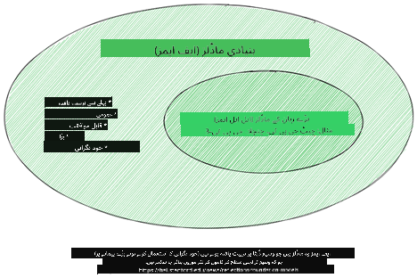

تصویری ماخذ: [فاؤنڈیشن ماڈلز اور بڑے زبان کے ماڈلز کے لیے ضروری گائیڈ | بابار ایم بھٹی | میڈیم](https://thebabar.medium.com/essential-guide-to-foundation-models-and-large-language-models-27dab58f7404)

اس فرق کو مزید واضح کرنے کے لیے، آئیے ChatGPT کو ایک مثال کے طور پر لیں۔ ChatGPT کا پہلا ورژن بنانے کے لیے، ایک ماڈل جسے GPT-3.5 کہا جاتا ہے، فاؤنڈیشن ماڈل کے طور پر کام کیا۔ اس کا مطلب یہ ہے کہ OpenAI نے کچھ چیٹ مخصوص ڈیٹا کا استعمال کیا تاکہ GPT-3.5 کا ایک ٹیونڈ ورژن بنایا جا سکے جو چیٹ بوٹس جیسے گفتگو کے منظرناموں میں اچھی کارکردگی کا مظاہرہ کرنے میں مہارت رکھتا تھا۔

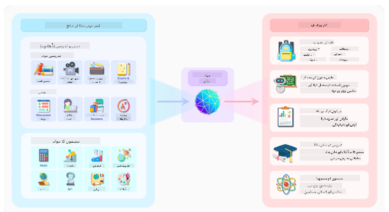

تصویری ماخذ: [2108.07258.pdf (arxiv.org)](https://arxiv.org/pdf/2108.07258.pdf?WT.mc_id=academic-105485-koreyst)

### اوپن سورس بمقابلہ ملکیتی ماڈلز

LLMs کو ایک اور طریقے سے بھی تقسیم کیا جا سکتا ہے کہ آیا وہ اوپن سورس ہیں یا ملکیتی۔

اوپن سورس ماڈلز وہ ماڈلز ہیں جو عوام کے لیے دستیاب کیے گئے ہیں اور کوئی بھی ان کا استعمال کر سکتا ہے۔ یہ اکثر اس کمپنی کے ذریعہ دستیاب کیے جاتے ہیں جس نے انہیں بنایا ہے، یا تحقیقی کمیونٹی کے ذریعہ۔ ان ماڈلز کو مختلف LLMs کے استعمال کے معاملات کے لیے معائنہ، ترمیم، اور حسب ضرورت بنایا جا سکتا ہے۔ تاہم، وہ ہمیشہ پروڈکشن کے استعمال کے لیے بہتر نہیں ہوتے، اور ملکیتی ماڈلز جتنے کارآمد نہیں ہو سکتے۔ اس کے علاوہ، اوپن سورس ماڈلز کے لیے فنڈنگ محدود ہو سکتی ہے، اور انہیں طویل مدتی برقرار نہیں رکھا جا سکتا یا تازہ ترین تحقیق کے ساتھ اپ ڈیٹ نہیں کیا جا سکتا۔ مشہور اوپن سورس ماڈلز کی مثالیں شامل ہیں [Alpaca](https://crfm.stanford.edu/2023/03/13/alpaca.html?WT.mc_id=academic-105485-koreyst)، [Bloom](https://huggingface.co/bigscience/bloom) اور [LLaMA](https://llama.meta.com)۔

ملکیتی ماڈلز وہ ماڈلز ہیں جو کسی کمپنی کے مالک ہیں اور عوام کے لیے دستیاب نہیں کیے گئے ہیں۔ یہ ماڈلز اکثر پروڈکشن کے استعمال کے لیے بہتر ہوتے ہیں۔ تاہم، انہیں مختلف استعمال کے معاملات کے لیے معائنہ، ترمیم، یا حسب ضرورت بنانے کی اجازت نہیں ہے۔ اس کے علاوہ، وہ ہمیشہ مفت دستیاب نہیں ہوتے، اور ان کا استعمال کرنے کے لیے سبسکرپشن یا ادائیگی کی ضرورت ہو سکتی ہے۔ نیز، صارفین کے پاس اس ڈیٹا پر کنٹرول نہیں ہوتا جو ماڈل کو تربیت دینے کے لیے استعمال کیا جاتا ہے، جس کا مطلب ہے کہ انہیں ڈیٹا کی رازداری اور AI کے ذمہ دارانہ استعمال کو یقینی بنانے کے لیے ماڈل کے مالک پر اعتماد کرنا چاہیے۔ مشہور ملکیتی ماڈلز کی مثالیں شامل ہیں [OpenAI ماڈلز](https://platform.openai.com/docs/models/overview?WT.mc_id=academic-105485-koreyst)، [Google Bard](https://sapling.ai/llm/bard?WT.mc_id=academic-105485-koreyst) یا [Claude 2](https://www.anthropic.com/index/claude-2?WT.mc_id=academic-105485-koreyst)۔

### ایمبیڈنگ بمقابلہ تصویر کی تخلیق بمقابلہ متن اور کوڈ کی تخلیق

LLMs کو ان کے پیدا کردہ آؤٹ پٹ کے لحاظ سے بھی تقسیم کیا جا سکتا ہے۔

ایمبیڈنگ وہ ماڈلز ہیں جو متن کو عددی شکل میں تبدیل کر سکتے ہیں، جسے ایمبیڈنگ کہا جاتا ہے، جو ان پٹ متن کی عددی نمائندگی ہے۔ ایمبیڈنگ مشینوں کے لیے الفاظ یا جملوں کے درمیان تعلقات کو سمجھنا آسان بناتے ہیں اور دوسرے ماڈلز کے ذریعہ ان پٹ کے طور پر استعمال کیے جا سکتے ہیں، جیسے کہ درجہ بندی کے ماڈلز، یا کلسٹرنگ ماڈلز جو عددی ڈیٹا پر بہتر کارکردگی رکھتے ہیں۔ ایمبیڈنگ ماڈلز اکثر ٹرانسفر لرننگ کے لیے استعمال کیے جاتے ہیں، جہاں ایک ماڈل ایک متبادل کام کے لیے بنایا جاتا ہے جس کے لیے ڈیٹا کی کثرت ہوتی ہے، اور پھر ماڈل کے وزن (ایمبیڈنگ) کو دوسرے نیچے والے کاموں کے لیے دوبارہ استعمال کیا جاتا ہے۔ اس زمرے کی ایک مثال ہے [OpenAI ایمبیڈنگ](https://platform.openai.com/docs/models/embeddings?WT.mc_id=academic-105485-koreyst)۔

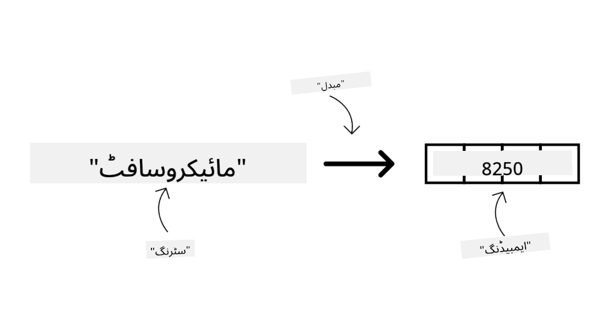

تصویر کی تخلیق کے ماڈلز وہ ماڈلز ہیں جو تصاویر تخلیق کرتے ہیں۔ یہ ماڈلز اکثر تصویر کی تدوین، تصویر کی ترکیب، اور تصویر کی ترجمہ کے لیے استعمال کیے جاتے ہیں۔ تصویر کی تخلیق کے ماڈلز اکثر تصاویر کے بڑے ڈیٹا سیٹس پر تربیت یافتہ ہوتے ہیں، جیسے [LAION-5B](https://laion.ai/blog/laion-5b/?WT.mc_id=academic-105485-koreyst)، اور نئی تصاویر تخلیق کرنے یا موجودہ تصاویر کو ان پینٹنگ، سپر ریزولوشن، اور کلرائزیشن تکنیکوں کے ساتھ ترمیم کرنے کے لیے استعمال کیے جا سکتے ہیں۔ مثالیں شامل ہیں [DALL-E-3](https://openai.com/dall-e-3?WT.mc_id=academic-105485-koreyst) اور [Stable Diffusion ماڈلز](https://github.com/Stability-AI/StableDiffusion?WT.mc_id=academic-105485-koreyst)۔

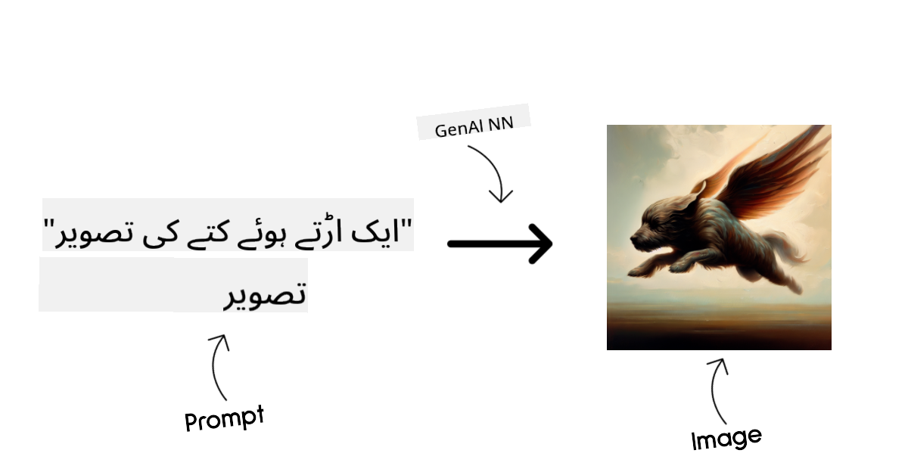

متن اور کوڈ کی تخلیق کے ماڈلز وہ ماڈلز ہیں جو متن یا کوڈ تخلیق کرتے ہیں۔ یہ ماڈلز اکثر متن کے خلاصے، ترجمہ، اور سوالات کے جوابات کے لیے استعمال کیے جاتے ہیں۔ متن کی تخلیق کے ماڈلز اکثر متن کے بڑے ڈیٹا سیٹس پر تربیت یافتہ ہوتے ہیں، جیسے [BookCorpus](https://www.cv-foundation.org/openaccess/content_iccv_2015/html/Zhu_Aligning_Books_and_ICCV_2015_paper.html?WT.mc_id=academic-105485-koreyst)، اور نئے متن تخلیق کرنے یا سوالات کے جوابات دینے کے لیے استعمال کیے جا سکتے ہیں۔ کوڈ کی تخلیق کے ماڈلز، جیسے [CodeParrot](https://huggingface.co/codeparrot?WT.mc_id=academic-105485-koreyst)، اکثر کوڈ کے بڑے ڈیٹا سیٹس پر تربیت یافتہ ہوتے ہیں، جیسے GitHub، اور نئے کوڈ تخلیق کرنے یا موجودہ کوڈ میں بگز کو ٹھیک کرنے کے لیے استعمال کیے جا سکتے ہیں۔

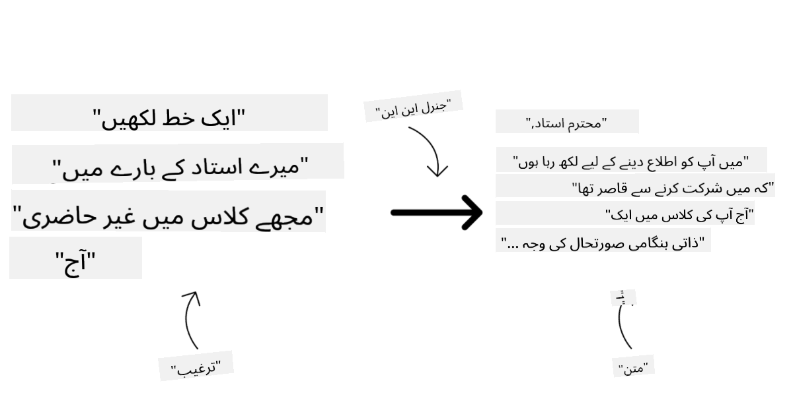

### انکوڈر-ڈیکوڈر بمقابلہ صرف ڈیکوڈر

LLMs کی مختلف اقسام کی ساخت کے بارے میں بات کرنے کے لیے، آئیے ایک مثال استعمال کریں۔

تصور کریں کہ آپ کے مینیجر نے آپ کو طلباء کے لیے ایک کوئز لکھنے کا کام دیا ہے۔ آپ کے دو ساتھی ہیں؛ ایک مواد تخلیق کرنے کا ذمہ دار ہے اور دوسرا ان کا جائزہ لینے کا۔

مواد تخلیق کرنے والا صرف ڈیکوڈر ماڈل کی طرح ہے، وہ موضوع کو دیکھ سکتا ہے اور جو آپ نے پہلے ہی لکھا ہے اسے دیکھ سکتا ہے اور پھر اس کی بنیاد پر ایک کورس لکھ سکتا ہے۔ وہ مشغول اور معلوماتی مواد لکھنے میں بہت اچھے ہیں، لیکن وہ موضوع اور سیکھنے کے مقاصد کو سمجھنے میں بہت اچھے نہیں ہیں۔ ڈیکوڈر ماڈلز کی کچھ مثالیں GPT فیملی ماڈلز ہیں، جیسے GPT-3۔

جائزہ لینے والا صرف انکوڈر ماڈل کی طرح ہے، وہ لکھے گئے کورس اور جوابات کو دیکھتا ہے، ان کے درمیان تعلق کو نوٹ کرتا ہے اور سیاق و سباق کو سمجھتا ہے، لیکن وہ مواد تخلیق کرنے میں اچھے نہیں ہیں۔ انکوڈر ماڈل کی ایک مثال BERT ہوگی۔

تصور کریں کہ ہمارے پاس کوئی ایسا بھی ہو سکتا ہے جو کوئز تخلیق اور جائزہ لے سکے، یہ ایک انکوڈر-ڈیکوڈر ماڈل ہے۔ کچھ مثالیں BART اور T5 ہوں گی۔

### سروس بمقابلہ ماڈل

اب، آئیے سروس اور ماڈل کے درمیان فرق کے بارے میں بات کرتے ہیں۔ سروس ایک پروڈکٹ ہے جو کلاؤڈ سروس فراہم کنندہ کے ذریعہ پیش کی جاتی ہے، اور اکثر ماڈلز، ڈیٹا، اور دیگر اجزاء کا مجموعہ ہوتی ہے۔ ماڈل سروس کا بنیادی جزو ہے، اور اکثر ایک فاؤنڈیشن ماڈل ہوتا ہے، جیسے LLM۔

سروسز اکثر پروڈکشن کے استعمال کے لیے بہتر ہوتی ہیں اور اکثر ماڈلز کے مقابلے میں استعمال میں آسان ہوتی ہیں، گرافیکل یوزر انٹرفیس کے ذریعے۔ تاہم، سروسز ہمیشہ مفت دستیاب نہیں ہوتیں، اور ان کا استعمال کرنے کے لیے سبسکرپشن یا ادائیگی کی ضرورت ہو سکتی ہے، سروس کے مالک کے آلات اور وسائل کو فائدہ اٹھانے، اخراجات کو بہتر بنانے اور آسانی سے اسکیل کرنے کے بدلے۔ ایک سروس کی مثال ہے [Azure OpenAI Service](https://learn.microsoft.com/azure/ai-services/openai/overview?WT.mc_id=academic-105485-koreyst)، جو ایک پے-ایز-یو-گو ریٹ پلان پیش کرتی ہے، یعنی صارفین کو تناسب سے چارج کیا جاتا ہے کہ وہ سروس کو کتنی بار استعمال کرتے ہیں۔ نیز، Azure OpenAI Service ماڈلز کی صلاحیتوں کے اوپر انٹرپرائز گریڈ سیکیورٹی اور ایک ذمہ دار AI فریم ورک پیش کرتی ہے۔

ماڈلز صرف نیورل نیٹ ورک ہیں، پیرامیٹرز، وزن، اور دیگر کے ساتھ۔ کمپنیوں کو مقامی طور پر چلانے کی اجازت دیتے ہیں، تاہم، انہیں آلات خریدنے، اسکیل کرنے کے لیے ایک ڈھانچہ بنانے اور لائسنس خریدنے یا اوپن سورس ماڈل استعمال کرنے کی ضرورت ہوگی۔ ایک ماڈل جیسے LLaMA استعمال کے لیے دستیاب ہے، جس کے لیے ماڈل چلانے کے لیے کمپیوٹیشنل پاور کی ضرورت ہوتی ہے۔

## Azure پر کارکردگی کو سمجھنے کے لیے مختلف ماڈلز کے ساتھ جانچ اور تکرار کیسے کریں

ایک بار جب ہماری ٹیم نے موجودہ LLMs کے منظرنامے کا جائزہ لیا اور اپنے منظرناموں کے لیے کچھ اچھے امیدواروں کی شناخت کی، تو اگلا مرحلہ ان کے ڈیٹا اور ان کے ورک لوڈ پر ان کی جانچ کرنا ہے۔ یہ ایک تکراری عمل ہے، جو تجربات اور پیمائش کے ذریعے کیا جاتا ہے۔
زیادہ تر ماڈلز جن کا ذکر ہم نے پچھلے پیراگراف میں کیا (OpenAI ماڈلز، اوپن سورس ماڈلز جیسے Llama2، اور Hugging Face transformers) [ماڈل کیٹلاگ](https://learn.microsoft.com/azure/ai-studio/how-to/model-catalog-overview?WT.mc_id=academic-105485-koreyst) میں [Azure AI Studio](https://ai.azure.com/?WT.mc_id=academic-105485-koreyst) پر دستیاب ہیں۔

[Azure AI Studio](https://learn.microsoft.com/azure/ai-studio/what-is-ai-studio?WT.mc_id=academic-105485-koreyst) ایک کلاؤڈ پلیٹ فارم ہے جو ڈویلپرز کو جنریٹو AI ایپلیکیشنز بنانے اور پورے ڈیولپمنٹ لائف سائیکل کو منظم کرنے کی سہولت دیتا ہے - تجربات سے لے کر تشخیص تک - Azure AI سروسز کو ایک ہی مرکز میں ایک آسان GUI کے ساتھ یکجا کر کے۔ Azure AI Studio میں ماڈل کیٹلاگ صارف کو یہ سہولت دیتا ہے:

- کیٹلاگ میں دلچسپی کے فاؤنڈیشن ماڈل کو تلاش کریں - چاہے وہ ملکیتی ہو یا اوپن سورس، کام، لائسنس، یا نام کے ذریعے فلٹر کریں۔ تلاش کو بہتر بنانے کے لیے، ماڈلز کو کلیکشنز میں منظم کیا گیا ہے، جیسے Azure OpenAI کلیکشن، Hugging Face کلیکشن، اور مزید۔

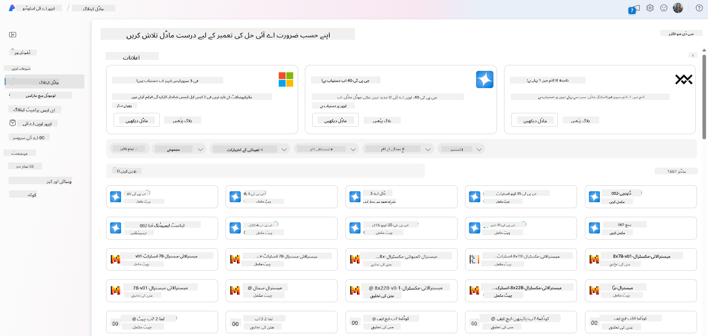

- ماڈل کارڈ کا جائزہ لیں، جس میں استعمال کا تفصیلی بیان، تربیتی ڈیٹا، کوڈ کے نمونے، اور اندرونی تشخیص لائبریری پر تشخیص کے نتائج شامل ہیں۔

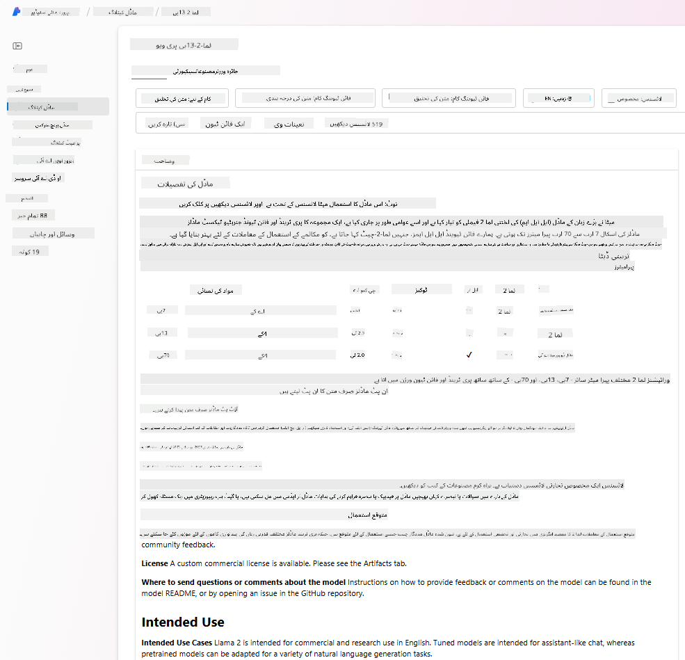

- صنعت میں دستیاب ماڈلز اور ڈیٹا سیٹس کے بینچ مارکس کا موازنہ کریں تاکہ یہ اندازہ لگایا جا سکے کہ کون سا کاروباری منظرنامے کے مطابق ہے، [ماڈل بینچ مارکس](https://learn.microsoft.com/azure/ai-studio/how-to/model-benchmarks?WT.mc_id=academic-105485-koreyst) پین کے ذریعے۔

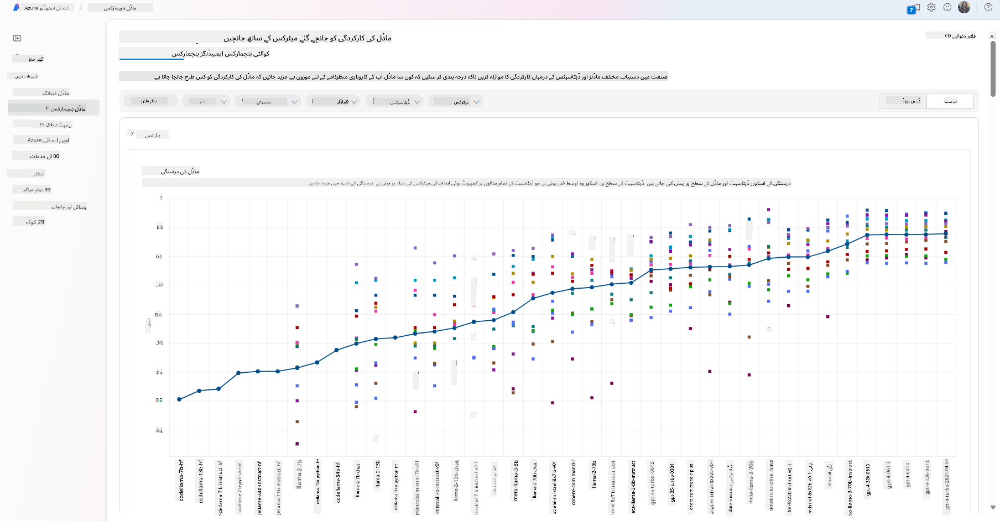

- ماڈل کی کارکردگی کو مخصوص ورک لوڈ میں بہتر بنانے کے لیے اپنی مرضی کے تربیتی ڈیٹا پر ماڈل کو فائن ٹیون کریں، Azure AI Studio کی تجرباتی اور ٹریکنگ صلاحیتوں کا فائدہ اٹھاتے ہوئے۔

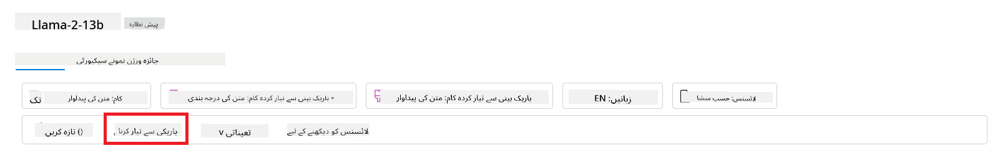

- اصل پری ٹرینڈ ماڈل یا فائن ٹیونڈ ورژن کو ریموٹ ریئل ٹائم انفرنس - مینیجڈ کمپیوٹ - یا سرور لیس API اینڈ پوائنٹ - [پے ایز یو گو](https://learn.microsoft.com/azure/ai-studio/how-to/model-catalog-overview#model-deployment-managed-compute-and-serverless-api-pay-as-you-go?WT.mc_id=academic-105485-koreyst) - پر تعینات کریں تاکہ ایپلیکیشنز اسے استعمال کر سکیں۔

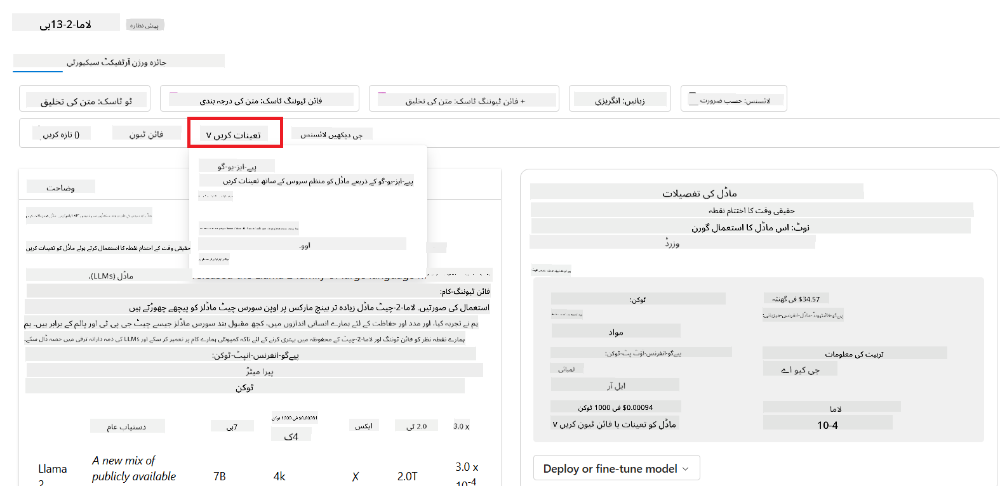

> [!NOTE]
> کیٹلاگ میں موجود تمام ماڈلز فی الحال فائن ٹیوننگ اور/یا پے ایز یو گو ڈیپلائمنٹ کے لیے دستیاب نہیں ہیں۔ ماڈل کی صلاحیتوں اور حدود کی تفصیلات کے لیے ماڈل کارڈ چیک کریں۔

## LLM نتائج کو بہتر بنانا

ہم نے اپنی اسٹارٹ اپ ٹیم کے ساتھ مختلف قسم کے LLMs اور ایک کلاؤڈ پلیٹ فارم (Azure Machine Learning) کا جائزہ لیا ہے جو ہمیں مختلف ماڈلز کا موازنہ کرنے، انہیں ٹیسٹ ڈیٹا پر جانچنے، کارکردگی کو بہتر بنانے اور انہیں انفرنس اینڈ پوائنٹس پر تعینات کرنے کی سہولت دیتا ہے۔

لیکن کب انہیں پری ٹرینڈ ماڈل کے بجائے ماڈل کو فائن ٹیون کرنے پر غور کرنا چاہیے؟ کیا مخصوص ورک لوڈز پر ماڈل کی کارکردگی کو بہتر بنانے کے لیے دیگر طریقے موجود ہیں؟

ایک کاروبار کئی طریقے استعمال کر سکتا ہے تاکہ LLM سے مطلوبہ نتائج حاصل کیے جا سکیں۔ آپ مختلف قسم کے ماڈلز کا انتخاب کر سکتے ہیں جن میں مختلف تربیتی درجات ہوں جب LLM کو پروڈکشن میں تعینات کیا جائے، مختلف پیچیدگی، لاگت، اور معیار کے ساتھ۔ یہاں کچھ مختلف طریقے ہیں:

- **پرامپٹ انجینئرنگ کے ساتھ کانٹیکسٹ**۔ خیال یہ ہے کہ جب آپ پرامپٹ کریں تو کافی کانٹیکسٹ فراہم کریں تاکہ آپ کو مطلوبہ جوابات مل سکیں۔

- **ریٹریول آگمنٹڈ جنریشن، RAG**۔ آپ کا ڈیٹا مثال کے طور پر کسی ڈیٹا بیس یا ویب اینڈ پوائنٹ میں موجود ہو سکتا ہے، تاکہ یہ ڈیٹا، یا اس کا ایک حصہ، پرامپٹ کے وقت شامل ہو، آپ متعلقہ ڈیٹا کو حاصل کر سکتے ہیں اور اسے صارف کے پرامپٹ کا حصہ بنا سکتے ہیں۔

- **فائن ٹیونڈ ماڈل**۔ یہاں، آپ نے ماڈل کو اپنے ڈیٹا پر مزید تربیت دی ہے جس سے ماڈل آپ کی ضروریات کے لیے زیادہ درست اور جوابدہ ہو گیا ہے لیکن یہ مہنگا ہو سکتا ہے۔

تصویری ماخذ: [Four Ways that Enterprises Deploy LLMs | Fiddler AI Blog](https://www.fiddler.ai/blog/four-ways-that-enterprises-deploy-llms?WT.mc_id=academic-105485-koreyst)

### پرامپٹ انجینئرنگ کے ساتھ کانٹیکسٹ

پری ٹرینڈ LLMs عمومی قدرتی زبان کے کاموں پر بہت اچھا کام کرتے ہیں، یہاں تک کہ انہیں ایک مختصر پرامپٹ کے ساتھ کال کر کے، جیسے کہ مکمل کرنے کے لیے ایک جملہ یا ایک سوال – جسے "زیرو شاٹ" لرننگ کہا جاتا ہے۔

تاہم، جتنا زیادہ صارف اپنی درخواست کو فریم کر سکتا ہے، ایک تفصیلی درخواست اور مثالوں کے ساتھ – کانٹیکسٹ – جواب اتنا ہی زیادہ درست اور صارف کی توقعات کے قریب ہوگا۔ اس صورت میں، ہم "ون شاٹ" لرننگ کی بات کرتے ہیں اگر پرامپٹ میں صرف ایک مثال شامل ہو اور "فیو شاٹ لرننگ" اگر اس میں متعدد مثالیں شامل ہوں۔
کانٹیکسٹ کے ساتھ پرامپٹ انجینئرنگ شروع کرنے کے لیے سب سے زیادہ لاگت مؤثر طریقہ ہے۔

### ریٹریول آگمنٹڈ جنریشن (RAG)

LLMs کی یہ حد ہوتی ہے کہ وہ صرف وہی ڈیٹا استعمال کر سکتے ہیں جو ان کی تربیت کے دوران استعمال کیا گیا ہے تاکہ جواب تیار کیا جا سکے۔ اس کا مطلب یہ ہے کہ وہ اپنی تربیت کے عمل کے بعد ہونے والے حقائق کے بارے میں کچھ نہیں جانتے، اور وہ غیر عوامی معلومات (جیسے کمپنی ڈیٹا) تک رسائی حاصل نہیں کر سکتے۔
اسے RAG کے ذریعے حل کیا جا سکتا ہے، ایک تکنیک جو پرامپٹ کو بیرونی ڈیٹا کے ساتھ دستاویزات کے ٹکڑوں کی شکل میں بڑھاتی ہے، پرامپٹ کی لمبائی کی حدود کو مدنظر رکھتے ہوئے۔ یہ وییکٹر ڈیٹا بیس ٹولز (جیسے [Azure Vector Search](https://learn.microsoft.com/azure/search/vector-search-overview?WT.mc_id=academic-105485-koreyst)) کے ذریعے تعاون یافتہ ہے جو پہلے سے طے شدہ ڈیٹا ذرائع سے مفید ٹکڑوں کو بازیافت کرتے ہیں اور انہیں پرامپٹ کانٹیکسٹ میں شامل کرتے ہیں۔

یہ تکنیک اس وقت بہت مددگار ثابت ہوتی ہے جب کسی کاروبار کے پاس کافی ڈیٹا، کافی وقت، یا LLM کو فائن ٹیون کرنے کے وسائل نہ ہوں، لیکن پھر بھی مخصوص ورک لوڈ پر کارکردگی کو بہتر بنانا اور غلطیوں کے خطرات کو کم کرنا چاہتا ہو، یعنی حقیقت کی غلط تشریح یا نقصان دہ مواد۔

### فائن ٹیونڈ ماڈل

فائن ٹیوننگ ایک ایسا عمل ہے جو ٹرانسفر لرننگ کا فائدہ اٹھاتا ہے تاکہ ماڈل کو ڈاؤن اسٹریم کام کے مطابق 'ڈھال' سکے یا کسی مخصوص مسئلے کو حل کر سکے۔ فیو شاٹ لرننگ اور RAG سے مختلف، اس کے نتیجے میں ایک نیا ماڈل تیار ہوتا ہے، جس میں اپ ڈیٹ شدہ ویٹس اور بائیسز ہوتے ہیں۔ اس کے لیے تربیتی مثالوں کا ایک سیٹ درکار ہوتا ہے جس میں ایک واحد ان پٹ (پرامپٹ) اور اس سے وابستہ آؤٹ پٹ (کمپلیشن) شامل ہوتا ہے۔
یہ ترجیحی طریقہ ہوگا اگر:

- **فائن ٹیونڈ ماڈلز کا استعمال**۔ ایک کاروبار کم صلاحیت والے ماڈلز (جیسے ایمبیڈنگ ماڈلز) کو اعلیٰ کارکردگی والے ماڈلز کے بجائے استعمال کرنا چاہے گا، جس کے نتیجے میں زیادہ لاگت مؤثر اور تیز حل ہوگا۔

- **لیٹنسی پر غور کرنا**۔ لیٹنسی کسی مخصوص استعمال کے لیے اہم ہے، اس لیے بہت لمبے پرامپٹس یا مثالوں کی تعداد کا استعمال ممکن نہیں ہے جو ماڈل سے سیکھا جانا چاہیے اور پرامپٹ کی لمبائی کی حد کے ساتھ فٹ نہیں ہوتا۔

- **اپ ڈیٹ رہنا**۔ ایک کاروبار کے پاس اعلیٰ معیار کا ڈیٹا اور گراؤنڈ ٹروتھ لیبلز موجود ہیں اور اس ڈیٹا کو وقت کے ساتھ اپ ڈیٹ رکھنے کے لیے درکار وسائل موجود ہیں۔

### تربیت یافتہ ماڈل

ایک LLM کو شروع سے تربیت دینا بلا شبہ سب سے مشکل اور سب سے پیچیدہ طریقہ ہے، جس کے لیے بڑے پیمانے پر ڈیٹا، ماہر وسائل، اور مناسب کمپیوٹیشنل پاور کی ضرورت ہوتی ہے۔ اس آپشن پر صرف اس صورت میں غور کیا جانا چاہیے جب کسی کاروبار کے پاس ڈومین مخصوص استعمال کا کیس اور ڈومین سینٹرک ڈیٹا کی بڑی مقدار ہو۔

## علم کی جانچ

LLM کمپلیشن نتائج کو بہتر بنانے کے لیے اچھا طریقہ کیا ہو سکتا ہے؟

1. پرامپٹ انجینئرنگ کے ساتھ کانٹیکسٹ  
1. RAG  
1. فائن ٹیونڈ ماڈل  

A:3، اگر آپ کے پاس وقت، وسائل اور اعلیٰ معیار کا ڈیٹا موجود ہے، تو اپ ڈیٹ رہنے کے لیے فائن ٹیوننگ بہتر آپشن ہے۔ تاہم، اگر آپ چیزوں کو بہتر بنانا چاہتے ہیں اور آپ کے پاس وقت کی کمی ہے تو پہلے RAG پر غور کرنا قابل قدر ہے۔

## 🚀 چیلنج

مزید پڑھیں کہ آپ اپنے کاروبار کے لیے [RAG کا استعمال](https://learn.microsoft.com/azure/search/retrieval-augmented-generation-overview?WT.mc_id=academic-105485-koreyst) کیسے کر سکتے ہیں۔

## زبردست کام، اپنی تعلیم جاری رکھیں

اس سبق کو مکمل کرنے کے بعد، ہماری [Generative AI Learning collection](https://aka.ms/genai-collection?WT.mc_id=academic-105485-koreyst) کو دیکھیں تاکہ اپنی جنریٹو AI کی معلومات کو مزید بہتر کریں!

سبق 3 پر جائیں جہاں ہم دیکھیں گے کہ [جنریٹو AI کو ذمہ داری سے کیسے بنایا جائے](../03-using-generative-ai-responsibly/README.md?WT.mc_id=academic-105485-koreyst)!

---

**اعلانِ لاتعلقی**:  
یہ دستاویز AI ترجمہ سروس [Co-op Translator](https://github.com/Azure/co-op-translator) کا استعمال کرتے ہوئے ترجمہ کی گئی ہے۔ ہم درستگی کے لیے کوشش کرتے ہیں، لیکن براہ کرم آگاہ رہیں کہ خودکار ترجمے میں غلطیاں یا غیر درستیاں ہو سکتی ہیں۔ اصل دستاویز کو اس کی اصل زبان میں مستند ذریعہ سمجھا جانا چاہیے۔ اہم معلومات کے لیے، پیشہ ور انسانی ترجمہ کی سفارش کی جاتی ہے۔ اس ترجمے کے استعمال سے پیدا ہونے والی کسی بھی غلط فہمی یا غلط تشریح کے لیے ہم ذمہ دار نہیں ہیں۔