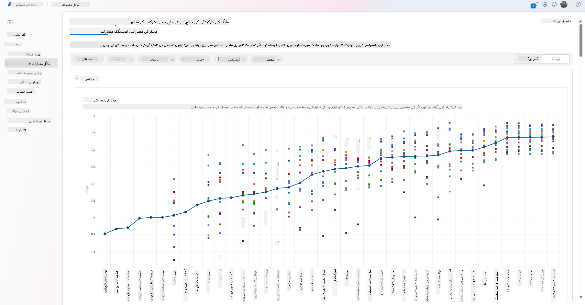
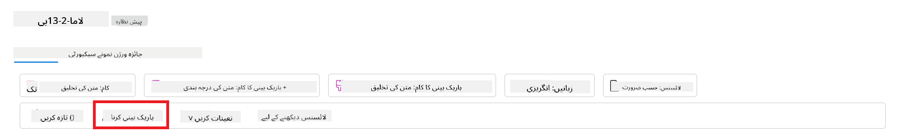
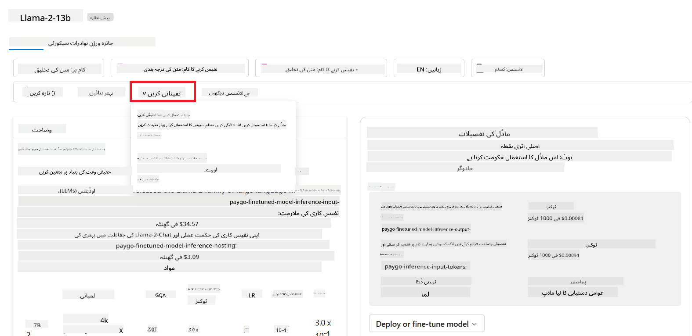
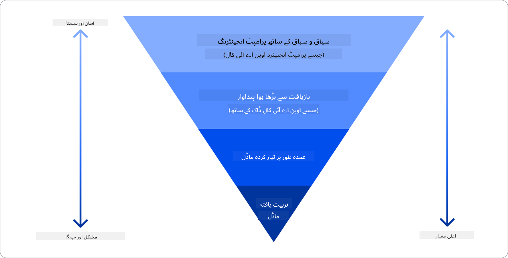

<!--
CO_OP_TRANSLATOR_METADATA:
{
  "original_hash": "e2f686f2eb794941761252ac5e8e090b",
  "translation_date": "2025-05-19T13:46:18+00:00",
  "source_file": "02-exploring-and-comparing-different-llms/README.md",
  "language_code": "ur"
}
-->
# مختلف LLMs کا مطالعہ اور موازنہ

> _اس سبق کی ویڈیو دیکھنے کے لیے اوپر تصویر پر کلک کریں_

پچھلے سبق میں ہم نے دیکھا کہ کس طرح جنریٹو AI ٹیکنالوجی کے منظرنامے کو تبدیل کر رہا ہے، کس طرح بڑے زبان کے ماڈل (LLMs) کام کرتے ہیں اور کس طرح ایک کاروبار - جیسے ہمارا اسٹارٹ اپ - انہیں اپنے استعمال کے معاملات میں لاگو کر سکتا ہے اور ترقی کر سکتا ہے! اس باب میں، ہم مختلف اقسام کے بڑے زبان کے ماڈل (LLMs) کا موازنہ اور مقابلہ کرنے کی کوشش کر رہے ہیں تاکہ ان کے فوائد اور نقصانات کو سمجھ سکیں۔

ہمارے اسٹارٹ اپ کے سفر کا اگلا قدم LLMs کے موجودہ منظرنامے کا مطالعہ کرنا اور سمجھنا ہے کہ کون سا ہمارے استعمال کے معاملے کے لیے موزوں ہے۔

## تعارف

یہ سبق شامل کرے گا:

- موجودہ منظرنامے میں مختلف اقسام کے LLMs۔
- Azure میں آپ کے استعمال کے معاملے کے لیے مختلف ماڈلز کی جانچ، تکرار اور موازنہ۔
- کس طرح LLM کو تعینات کرنا ہے۔

## سیکھنے کے مقاصد

اس سبق کو مکمل کرنے کے بعد، آپ قابل ہوں گے:

- اپنے استعمال کے معاملے کے لیے صحیح ماڈل کا انتخاب کریں۔
- جانچنے، تکرار کرنے، اور اپنے ماڈل کی کارکردگی کو بہتر بنانے کا طریقہ سمجھیں۔
- جانیں کہ کاروبار ماڈلز کو کس طرح تعینات کرتے ہیں۔

## مختلف اقسام کے LLMs کو سمجھنا

LLMs کو ان کی آرکیٹیکچر، تربیتی ڈیٹا، اور استعمال کے معاملے کی بنیاد پر متعدد درجہ بندی دی جا سکتی ہے۔ ان اختلافات کو سمجھنا ہمارے اسٹارٹ اپ کو صحیح ماڈل منتخب کرنے میں مدد دے گا، اور یہ سمجھنے میں کہ کارکردگی کو کیسے جانچنا، تکرار کرنا، اور بہتر بنانا ہے۔

بہت سے مختلف اقسام کے LLM ماڈلز ہیں، آپ کے ماڈل کا انتخاب اس بات پر منحصر ہے کہ آپ انہیں کس مقصد کے لیے استعمال کرنا چاہتے ہیں، آپ کا ڈیٹا، آپ کتنا خرچ کرنے کے لیے تیار ہیں اور مزید۔

اگر آپ ماڈلز کو متن، آڈیو، ویڈیو، تصویر کی تخلیق وغیرہ کے لیے استعمال کرنے کا ارادہ رکھتے ہیں، تو آپ مختلف قسم کے ماڈل کا انتخاب کر سکتے ہیں۔

- **آڈیو اور تقریر کی شناخت**۔ اس مقصد کے لیے، Whisper قسم کے ماڈلز ایک بہترین انتخاب ہیں کیونکہ وہ عام مقصد کے ہیں اور تقریر کی شناخت کے لیے بنائے گئے ہیں۔ یہ متنوع آڈیو پر تربیت یافتہ ہے اور کثیر لسانی تقریر کی شناخت کر سکتا ہے۔

- **تصویر کی تخلیق**۔ تصویر کی تخلیق کے لیے، DALL-E اور Midjourney دو بہت معروف انتخاب ہیں۔ DALL-E Azure OpenAI کے ذریعے پیش کیا جاتا ہے۔

- **متن کی تخلیق**۔ زیادہ تر ماڈلز متن کی تخلیق پر تربیت یافتہ ہیں اور آپ کے پاس GPT-3.5 سے GPT-4 تک کے انتخاب کی بڑی تعداد موجود ہے۔ وہ مختلف قیمتوں پر آتے ہیں، GPT-4 سب سے مہنگا ہے۔

- **ملٹی موڈیلٹی**۔ اگر آپ ان پٹ اور آؤٹ پٹ میں متعدد اقسام کے ڈیٹا کو ہینڈل کرنے کے خواہاں ہیں، تو آپ gpt-4 turbo with vision یا gpt-4o جیسے ماڈلز کو دیکھنا چاہیں گے - OpenAI ماڈلز کے تازہ ترین ریلیز - جو قدرتی زبان کی پروسیسنگ کو بصری تفہیم کے ساتھ ملا کر ملٹی موڈیل انٹرفیس کے ذریعے تعاملات کو ممکن بناتے ہیں۔

ماڈل کا انتخاب کرنے کا مطلب ہے کہ آپ کو کچھ بنیادی صلاحیتیں حاصل ہوتی ہیں، جو شاید کافی نہیں ہوں گی۔ اکثر آپ کے پاس کمپنی کا مخصوص ڈیٹا ہوتا ہے جس کے بارے میں آپ کو LLM کو کسی طرح بتانے کی ضرورت ہوتی ہے۔ اس کے لیے مختلف طریقے ہیں، مزید اس بارے میں اگلے حصوں میں۔

### فاؤنڈیشن ماڈلز بمقابلہ LLMs

فاؤنڈیشن ماڈل کی اصطلاح [اسٹینفورڈ کے محققین کے ذریعے](https://arxiv.org/abs/2108.07258?WT.mc_id=academic-105485-koreyst) ایجاد کی گئی اور اسے AI ماڈل کے طور پر بیان کیا گیا جو کچھ معیارات کی پیروی کرتا ہے، جیسے:

- **وہ غیر نگرانی یا خود نگرانی کی تعلیم کے ذریعے تربیت یافتہ ہیں**، یعنی وہ غیر لیبل شدہ ملٹی موڈیل ڈیٹا پر تربیت یافتہ ہیں، اور انہیں اپنے تربیتی عمل کے لیے انسانی تشریح یا ڈیٹا کی لیبلنگ کی ضرورت نہیں ہوتی۔
- **وہ بہت بڑے ماڈلز ہیں**، بہت گہری عصبی نیٹ ورکس پر مبنی ہیں جو اربوں پیرامیٹرز پر تربیت یافتہ ہیں۔
- **وہ عام طور پر دوسرے ماڈلز کے لیے 'بنیاد' کے طور پر کام کرنے کا ارادہ رکھتے ہیں**، یعنی انہیں دوسرے ماڈلز کے لیے نقطہ آغاز کے طور پر استعمال کیا جا سکتا ہے، جو کہ ٹھیک کرنے کے ذریعے کیا جا سکتا ہے۔

اس فرق کو مزید واضح کرنے کے لیے، آئیے ChatGPT کو ایک مثال کے طور پر لیں۔ ChatGPT کے پہلے ورژن کو بنانے کے لیے، GPT-3.5 نامی ایک ماڈل نے فاؤنڈیشن ماڈل کے طور پر کام کیا۔ اس کا مطلب یہ ہے کہ OpenAI نے کچھ چیٹ مخصوص ڈیٹا کا استعمال کیا تاکہ GPT-3.5 کا ایک مخصوص ورژن بنایا جا سکے جو چیٹ بوٹس جیسے بات چیت کے منظرناموں میں بہتر کارکردگی کا مظاہرہ کرتا تھا۔

### اوپن سورس بمقابلہ ملکیتی ماڈلز

LLMs کو درجہ بندی کرنے کا ایک اور طریقہ یہ ہے کہ آیا وہ اوپن سورس ہیں یا ملکیتی۔

اوپن سورس ماڈلز وہ ماڈلز ہیں جو عوام کے لیے دستیاب کیے جاتے ہیں اور کوئی بھی انہیں استعمال کر سکتا ہے۔ وہ اکثر اس کمپنی کے ذریعہ دستیاب کیے جاتے ہیں جس نے انہیں بنایا ہے، یا تحقیقی کمیونٹی کے ذریعہ۔ ان ماڈلز کو LLMs میں مختلف استعمال کے معاملات کے لیے معائنہ، ترمیم، اور حسب ضرورت بنانے کی اجازت ہے۔ تاہم، وہ ہمیشہ پیداوار کے استعمال کے لیے بہتر نہیں ہوتے، اور ملکیتی ماڈلز کے مقابلے میں کارکردگی کے لحاظ سے اتنے اچھے نہیں ہو سکتے۔ مزید برآں، اوپن سورس ماڈلز کے لیے فنڈنگ محدود ہو سکتی ہے، اور انہیں طویل مدتی برقرار نہیں رکھا جا سکتا یا انہیں جدید تحقیق کے ساتھ اپ ڈیٹ نہیں کیا جا سکتا۔

ملکیتی ماڈلز وہ ماڈلز ہیں جو کسی کمپنی کے مالک ہوتے ہیں اور عوام کے لیے دستیاب نہیں کیے جاتے۔ یہ ماڈلز اکثر پیداوار کے استعمال کے لیے بہتر ہوتے ہیں۔ تاہم، انہیں مختلف استعمال کے معاملات کے لیے معائنہ، ترمیم، یا حسب ضرورت بنانے کی اجازت نہیں ہوتی۔ مزید برآں، وہ ہمیشہ مفت دستیاب نہیں ہوتے، اور انہیں استعمال کرنے کے لیے سبسکرپشن یا ادائیگی کی ضرورت ہو سکتی ہے۔ اس کے علاوہ، صارفین کے پاس اس ڈیٹا پر کنٹرول نہیں ہوتا جو ماڈل کو تربیت دینے کے لیے استعمال ہوتا ہے، جس کا مطلب ہے کہ انہیں ڈیٹا کی رازداری اور AI کے ذمہ دارانہ استعمال کے عزم کو یقینی بنانے کے لیے ماڈل کے مالک پر بھروسہ کرنا چاہیے۔

### ایمبیڈنگ بمقابلہ تصویر کی تخلیق بمقابلہ متن اور کوڈ کی تخلیق

LLMs کو ان کے پیدا کردہ آؤٹ پٹ کے لحاظ سے بھی درجہ بندی کیا جا سکتا ہے۔

ایمبیڈنگ وہ ماڈلز ہیں جو متن کو عددی شکل میں تبدیل کر سکتے ہیں، جسے ایمبیڈنگ کہا جاتا ہے، جو ان پٹ متن کی عددی نمائندگی ہے۔ ایمبیڈنگ مشینوں کے لیے الفاظ یا جملوں کے درمیان تعلقات کو سمجھنا آسان بناتی ہے اور انہیں دوسرے ماڈلز کے ذریعہ ان پٹ کے طور پر استعمال کیا جا سکتا ہے، جیسے کہ درجہ بندی ماڈلز، یا کلسٹرنگ ماڈلز جو عددی ڈیٹا پر بہتر کارکردگی کا مظاہرہ کرتے ہیں۔ ایمبیڈنگ ماڈلز اکثر ٹرانسفر لرننگ کے لیے استعمال ہوتے ہیں، جہاں ایک ماڈل ایک متبادل کام کے لیے بنایا جاتا ہے جس کے لیے ڈیٹا کی بہتات ہوتی ہے، اور پھر ماڈل کے وزن (ایمبیڈنگ) دوسرے کاموں کے لیے دوبارہ استعمال کیے جاتے ہیں۔

تصویر کی تخلیق کے ماڈلز وہ ماڈلز ہیں جو تصاویر تخلیق کرتے ہیں۔ یہ ماڈلز اکثر تصویر کی ترمیم، تصویر کی ترکیب، اور تصویر کی ترجمہ کے لیے استعمال ہوتے ہیں۔ تصویر کی تخلیق کے ماڈلز اکثر تصاویر کے بڑے ڈیٹا سیٹس پر تربیت یافتہ ہوتے ہیں، جیسے کہ [LAION-5B](https://laion.ai/blog/laion-5b/?WT.mc_id=academic-105485-koreyst)، اور نئی تصاویر تخلیق کرنے یا موجودہ تصاویر کو ان پینٹنگ، سپر ریزولوشن، اور رنگین تکنیکوں کے ساتھ ترمیم کرنے کے لیے استعمال کیا جا سکتا ہے۔

متن اور کوڈ کی تخلیق کے ماڈلز وہ ماڈلز ہیں جو متن یا کوڈ تخلیق کرتے ہیں۔ یہ ماڈلز اکثر متن کی تلخیص، ترجمہ، اور سوال کے جواب دینے کے لیے استعمال ہوتے ہیں۔ متن کی تخلیق کے ماڈلز اکثر متن کے بڑے ڈیٹا سیٹس پر تربیت یافتہ ہوتے ہیں، جیسے کہ [BookCorpus](https://www.cv-foundation.org/openaccess/content_iccv_2015/html/Zhu_Aligning_Books_and_ICCV_2015_paper.html?WT.mc_id=academic-105485-koreyst)، اور نئے متن تخلیق کرنے یا سوالات کے جواب دینے کے لیے استعمال کیے جا سکتے ہیں۔

### انکوڈر-ڈیکوڈر بمقابلہ صرف ڈیکوڈر

LLMs کی مختلف اقسام کی آرکیٹیکچر کے بارے میں بات کرنے کے لیے، آئیے ایک مثال کا استعمال کریں۔

تصور کریں کہ آپ کے مینیجر نے آپ کو طلباء کے لیے ایک کوئز لکھنے کا کام دیا ہے۔ آپ کے پاس دو ساتھی ہیں؛ ایک مواد تخلیق کرنے کی نگرانی کرتا ہے اور دوسرا انہیں جائزہ لیتا ہے۔

مواد تخلیق کرنے والا صرف ڈیکوڈر ماڈل کی طرح ہے، وہ موضوع کو دیکھ سکتا ہے اور دیکھ سکتا ہے کہ آپ نے پہلے ہی کیا لکھا ہے اور پھر وہ اس کی بنیاد پر ایک کورس لکھ سکتا ہے۔ وہ مشغول اور معلوماتی مواد لکھنے میں بہت اچھے ہیں، لیکن وہ موضوع اور سیکھنے کے مقاصد کو سمجھنے میں اتنے اچھے نہیں ہیں۔

جائزہ لینے والا صرف انکوڈر ماڈل کی طرح ہے، وہ لکھے ہوئے کورس اور جوابات کو دیکھتا ہے، ان کے درمیان تعلق کو دیکھتا ہے اور سیاق و سباق کو سمجھتا ہے، لیکن وہ مواد تخلیق کرنے میں اچھے نہیں ہیں۔

تصور کریں کہ ہمارے پاس کوئی ایسا بھی ہو سکتا ہے جو کوئز تخلیق کر سکے اور اس کا جائزہ لے سکے، یہ انکوڈر-ڈیکوڈر ماڈل ہے۔

### سروس بمقابلہ ماڈل

اب، آئیے سروس اور ماڈل کے درمیان فرق کے بارے میں بات کریں۔ ایک سروس وہ پروڈکٹ ہے جو کلاؤڈ سروس فراہم کنندہ کے ذریعہ پیش کی جاتی ہے، اور اکثر ماڈلز، ڈیٹا، اور دیگر اجزاء کا مجموعہ ہوتی ہے۔ ایک ماڈل سروس کا بنیادی جزو ہوتا ہے، اور اکثر ایک فاؤنڈیشن ماڈل ہوتا ہے، جیسے کہ LLM۔

سروسز اکثر پیداوار کے استعمال کے لیے بہتر ہوتی ہیں اور ماڈلز کے مقابلے میں استعمال کرنے میں آسان ہوتی ہیں، گرافیکل یوزر انٹرفیس کے ذریعے۔ تاہم، سروسز ہمیشہ مفت دستیاب نہیں ہوتی، اور انہیں استعمال کرنے کے لیے سبسکرپشن یا ادائیگی کی ضرورت ہو سکتی ہے، سروس کے مالک کے آلات اور وسائل کو استعمال کرنے کے بدلے میں، اخراجات کو بہتر بنانے اور آسانی سے پیمانے پر لے جانے کے لیے۔

ماڈلز صرف عصبی نیٹ ورک ہوتے ہیں، پیرامیٹرز، وزن، اور دیگر کے ساتھ۔ کمپنیوں کو مقامی طور پر چلانے کی اجازت دیتے ہیں، تاہم، انہیں آلات خریدنے، پیمانے پر لے جانے کے لیے ڈھانچہ بنانے اور لائسنس خریدنے یا اوپن سورس ماڈل استعمال کرنے کی ضرورت ہوگی۔

## Azure پر کارکردگی کو سمجھنے کے لیے مختلف ماڈلز کے ساتھ جانچ اور تکرار کرنے کا طریقہ

ایک بار جب ہماری ٹیم نے موجودہ LLMs کے منظرنامے کا مطالعہ کیا اور اپنے منظرناموں کے لیے کچھ اچھے امیدواروں کی شناخت کی، تو اگلا مرحلہ ان کے ڈیٹا اور ان کے ورک لوڈ پر ان کی جانچ کرنا ہے۔ یہ ایک تکراری عمل ہے، تجربات اور پیمائش کے ذریعے کیا جاتا ہے۔
زیادہ تر ماڈلز جن کا ہم نے پچھلے پیراگراف میں ذکر کیا (OpenAI ماڈلز، اوپن سورس ماڈلز جیسے Llama2، اور Hugging Face ٹرانسفارمرز) [ماڈل کیٹلاگ](https://learn.microsoft.com/azure/ai-studio/how-to/model-catalog-overview?WT.mc_id=academic-105485-koreyst) میں دستیاب ہیں۔

[Azure AI Studio](https://learn.microsoft.com/azure/ai-studio/what-is-ai-studio?WT.mc_id=academic-105485-koreyst) ایک کلاؤڈ پلیٹ فارم ہے جو ڈویلپرز کے لیے جنریٹو AI ایپلیکیشنز بنانے اور پورے ترقیاتی لائف سائیکل کو سنبھالنے کے لیے ڈیزائن کیا گیا ہے - تجربہ سے لے کر تشخیص تک - Azure AI سروسز کو ایک ہی ہب میں ملا کر ایک آسان GUI کے ساتھ۔ Azure AI Studio میں ماڈل کیٹلاگ صارف کو قابل بناتا ہے:

- کیٹلاگ میں دلچسپی کے فاؤنڈیشن ماڈل کو تلاش کریں - چاہے وہ ملکیتی ہو یا اوپن سورس، کام، لائسنس، یا نام کے لحاظ سے فلٹر کریں۔ تلاش کو بہتر بنانے کے لیے، ماڈلز کو مجموعوں میں منظم کیا گیا ہے، جیسے Azure OpenAI مجموعہ، Hugging Face مجموعہ، اور مزید۔

- ماڈل کارڈ کا جائزہ لیں، جس میں استعمال کے ارادے اور تربیتی ڈیٹا کی تفصیلی وضاحت، کوڈ کے نمونے اور اندرونی تشخیص کی لائبریری پر تشخیص کے نتائج شامل ہیں۔
- صنعت میں دستیاب ماڈلز اور ڈیٹا سیٹس کے بینچ مارکس کا موازنہ کریں تاکہ یہ معلوم ہو سکے کہ کون سا کاروباری منظر نامے کو پورا کرتا ہے، [ماڈل بینچ مارکس](https://learn.microsoft.com/azure/ai-studio/how-to/model-benchmarks?WT.mc_id=academic-105485-koreyst) پین کے ذریعے۔

- ماڈل کی کارکردگی کو مخصوص ورک لوڈ میں بہتر بنانے کے لئے اپنی مرضی کے تربیتی ڈیٹا پر ماڈل کو بہتر بنائیں، Azure AI اسٹوڈیو کی تجرباتی اور ٹریکنگ کی صلاحیتوں کا فائدہ اٹھاتے ہوئے۔

- اصل پری ٹرینڈ ماڈل یا بہتر بنائی گئی ورژن کو دور دراز حقیقی وقت کی انفرینس - منظم کمپیوٹ - یا سرور لیس API اینڈ پوائنٹ - [پے-ایز-یو-گو](https://learn.microsoft.com/azure/ai-studio/how-to/model-catalog-overview#model-deployment-managed-compute-and-serverless-api-pay-as-you-go?WT.mc_id=academic-105485-koreyst) - پر تعینات کریں تاکہ ایپلیکیشنز اسے استعمال کر سکیں۔

> [!NOTE]
> کیٹلاگ میں موجود تمام ماڈلز فی الحال بہتر بنائی اور/یا پے-ایز-یو-گو تعیناتی کے لئے دستیاب نہیں ہیں۔ ماڈل کی صلاحیتوں اور حدود کی تفصیلات کے لئے ماڈل کارڈ چیک کریں۔

## LLM نتائج کو بہتر بنانا

ہم نے اپنے اسٹارٹ اپ ٹیم کے ساتھ مختلف قسم کے LLMs اور ایک کلاؤڈ پلیٹ فارم (Azure Machine Learning) کی تحقیق کی ہے جس سے ہمیں مختلف ماڈلز کا موازنہ کرنے، ان کا ٹیسٹ ڈیٹا پر جائزہ لینے، کارکردگی کو بہتر بنانے اور انفرینس اینڈ پوائنٹس پر تعینات کرنے کی اجازت ملتی ہے۔

لیکن کب انہیں ایک ماڈل کو بہتر بنائی کرنے پر غور کرنا چاہئے بجائے پری ٹرینڈ ماڈل کے استعمال کے؟ کیا مخصوص ورک لوڈز پر ماڈل کی کارکردگی کو بہتر بنانے کے لئے دیگر طریقے موجود ہیں؟

ایک کاروبار کئی طریقوں کا استعمال کر سکتا ہے تاکہ انہیں LLM سے مطلوبہ نتائج حاصل ہو سکیں۔ جب پروڈکشن میں LLM تعینات کرتے ہیں تو آپ مختلف تربیتی درجات کے ساتھ مختلف قسم کے ماڈلز منتخب کر سکتے ہیں، مختلف پیچیدگی، لاگت، اور معیار کی سطحوں کے ساتھ۔ یہاں کچھ مختلف طریقے ہیں:

- **کنٹیکسٹ کے ساتھ پرامپٹ انجینئرنگ**۔ خیال یہ ہے کہ جب آپ پرامپٹ دیتے ہیں تو آپ کو مطلوبہ جوابات حاصل کرنے کے لئے کافی کنٹیکسٹ فراہم کرنا ہے۔

- **ریٹریول اگمنٹڈ جنریشن، RAG**۔ آپ کا ڈیٹا مثال کے طور پر ایک ڈیٹا بیس یا ویب اینڈ پوائنٹ میں موجود ہو سکتا ہے، تاکہ اس ڈیٹا کو یا اس کا ایک سب سیٹ پرامپٹ کے وقت شامل کیا جا سکے، آپ متعلقہ ڈیٹا حاصل کر سکتے ہیں اور اسے صارف کے پرامپٹ کا حصہ بنا سکتے ہیں۔

- **بہتر بنائی ماڈل**۔ یہاں، آپ نے ماڈل کو اپنی خود کی ڈیٹا پر مزید تربیت دی جس سے ماڈل زیادہ درست اور آپ کی ضروریات کے مطابق جواب دینے والا بن گیا لیکن یہ مہنگا ہو سکتا ہے۔

تصویری ذریعہ: [Four Ways that Enterprises Deploy LLMs | Fiddler AI Blog](https://www.fiddler.ai/blog/four-ways-that-enterprises-deploy-llms?WT.mc_id=academic-105485-koreyst)

### کنٹیکسٹ کے ساتھ پرامپٹ انجینئرنگ

پری ٹرینڈ LLMs عمومی قدرتی زبان کے کاموں پر بہت اچھے طریقے سے کام کرتے ہیں، حتی کہ انہیں ایک مختصر پرامپٹ کے ساتھ کال کرنے پر، جیسے کہ مکمل کرنے کے لئے ایک جملہ یا ایک سوال – جسے “زیرو شاٹ” لرننگ کہا جاتا ہے۔

تاہم، جتنا زیادہ صارف اپنی درخواست کو تفصیلی درخواست اور مثالوں کے ساتھ فریم کر سکتا ہے – کنٹیکسٹ – جواب اتنا ہی درست اور صارف کی توقعات کے قریب ہوگا۔ اس صورت میں، ہم “ون شاٹ” لرننگ کی بات کرتے ہیں اگر پرامپٹ میں صرف ایک مثال شامل ہو اور “فیو شاٹ لرننگ” اگر اس میں متعدد مثالیں شامل ہوں۔
کنٹیکسٹ کے ساتھ پرامپٹ انجینئرنگ شروع کرنے کے لئے سب سے زیادہ اقتصادی طریقہ ہے۔

### ریٹریول اگمنٹڈ جنریشن (RAG)

LLMs کی یہ محدودیت ہوتی ہے کہ وہ صرف وہی ڈیٹا استعمال کر سکتے ہیں جو ان کی تربیت کے دوران استعمال ہوا ہے تاکہ جواب تیار کیا جا سکے۔ اس کا مطلب یہ ہے کہ وہ ان حقائق کے بارے میں کچھ نہیں جانتے جو ان کی تربیت کے عمل کے بعد ہوئے ہیں، اور وہ غیر عوامی معلومات تک رسائی نہیں کر سکتے (جیسے کمپنی کا ڈیٹا)۔
اسے RAG کے ذریعے حل کیا جا سکتا ہے، ایک تکنیک جو پرامپٹ کو خارجی ڈیٹا کے ساتھ دستاویزات کے ٹکڑوں کی شکل میں بڑھاتی ہے، پرامپٹ کی لمبائی کی حدود کو مد نظر رکھتے ہوئے۔ یہ ویٹر ڈیٹا بیس ٹولز (جیسے [Azure Vector Search](https://learn.microsoft.com/azure/search/vector-search-overview?WT.mc_id=academic-105485-koreyst)) کے ذریعے حمایت یافتہ ہے جو مختلف پیشگی مقررہ ڈیٹا ذرائع سے مفید ٹکڑوں کو حاصل کرتے ہیں اور انہیں پرامپٹ کنٹیکسٹ میں شامل کرتے ہیں۔

یہ تکنیک بہت مددگار ثابت ہوتی ہے جب ایک کاروبار کے پاس کافی ڈیٹا، وقت، یا وسائل نہیں ہوتے ہیں تاکہ LLM کو بہتر بنایا جا سکے، لیکن پھر بھی مخصوص ورک لوڈ پر کارکردگی کو بہتر بنانا اور جعل سازی کے خطرات کو کم کرنا چاہتا ہے، یعنی حقیقت کی دھندلاہٹ یا نقصان دہ مواد۔

### بہتر بنائی ماڈل

بہتر بنائی ایک عمل ہے جو ٹرانسفر لرننگ کا فائدہ اٹھاتا ہے تاکہ ماڈل کو ایک نیچے کے کام کے لئے 'ڈھال' کیا جا سکے یا ایک مخصوص مسئلہ کو حل کیا جا سکے۔ فیو شاٹ لرننگ اور RAG سے مختلف، یہ ایک نیا ماڈل تیار ہونے کا نتیجہ ہے، جس کے وزن اور بائسز کو اپ ڈیٹ کیا گیا ہے۔ اس میں تربیتی مثالوں کا ایک سیٹ درکار ہوتا ہے جس میں ایک واحد ان پٹ (پرامپٹ) اور اس کے متعلقہ آؤٹ پٹ (تکمیل) شامل ہوتا ہے۔
یہ ترجیحی طریقہ ہوگا اگر:

- **بہتر بنائی ماڈلز کا استعمال**۔ ایک کاروبار بہتر بنائی کم قابل ماڈلز (جیسے ایمبیڈنگ ماڈلز) کا استعمال کرنا چاہتا ہے بجائے اعلی کارکردگی والے ماڈلز کے، جس کے نتیجے میں ایک زیادہ اقتصادی اور تیز حل حاصل ہوتا ہے۔

- **تاخیر کو مد نظر رکھتے ہوئے**۔ تاخیر ایک مخصوص استعمال کیس کے لئے اہم ہے، لہذا بہت طویل پرامپٹس کا استعمال ممکن نہیں ہے یا مثالوں کی تعداد جو ماڈل کو سیکھنی چاہئے پرامپٹ کی لمبائی کی حد کے ساتھ موافق نہیں ہوتی ہے۔

- **اپ ٹو ڈیٹ رہنا**۔ ایک کاروبار کے پاس بہت زیادہ اعلی معیار کی ڈیٹا اور گراؤنڈ ٹروتھ لیبلز ہیں اور اس ڈیٹا کو وقت کے ساتھ اپ ٹو ڈیٹ رکھنے کے لئے درکار وسائل ہیں۔

### تربیت یافتہ ماڈل

ایک LLM کو صفر سے تربیت دینا بلا شبہ اپنانے کے لئے سب سے مشکل اور پیچیدہ طریقہ ہے، جس کے لئے بڑے پیمانے پر ڈیٹا، ماہر وسائل، اور مناسب کمپیوٹیشنل پاور درکار ہوتی ہے۔ اس اختیار پر صرف اس صورت میں غور کیا جانا چاہئے جب ایک کاروبار کے پاس ایک ڈومین-خصوصی استعمال کیس اور ڈومین-مرکزی ڈیٹا کی بڑی مقدار ہو۔

## علم کی جانچ

LLM تکمیل کے نتائج کو بہتر بنانے کے لئے ایک اچھا طریقہ کیا ہو سکتا ہے؟

1. کنٹیکسٹ کے ساتھ پرامپٹ انجینئرنگ
1. RAG
1. بہتر بنائی ماڈل

A:3، اگر آپ کے پاس وقت اور وسائل ہیں اور اعلی معیار کی ڈیٹا ہے، تو اپ ٹو ڈیٹ رہنے کے لئے بہتر بنائی کرنا بہتر آپشن ہے۔ تاہم، اگر آپ چیزوں کو بہتر بنانے کی تلاش میں ہیں اور آپ کے پاس وقت کی کمی ہے تو پہلے RAG پر غور کرنا قابل قدر ہے۔

## 🚀 چیلنج

اپنے کاروبار کے لئے [RAG کا استعمال](https://learn.microsoft.com/azure/search/retrieval-augmented-generation-overview?WT.mc_id=academic-105485-koreyst) کے بارے میں مزید پڑھیں۔

## عمدہ کام، اپنی تعلیم جاری رکھیں

اس سبق کو مکمل کرنے کے بعد، ہماری [Generative AI Learning collection](https://aka.ms/genai-collection?WT.mc_id=academic-105485-koreyst) کو چیک کریں تاکہ اپنی Generative AI کی معلومات کو مزید بڑھا سکیں!

سبق 3 کی طرف جائیں جہاں ہم دیکھیں گے کہ کس طرح [Generative AI کے ساتھ ذمہ داری سے تعمیر کیا جائے](../03-using-generative-ai-responsibly/README.md?WT.mc_id=academic-105485-koreyst)!

**دستبرداری**:
یہ دستاویز AI ترجمہ سروس [Co-op Translator](https://github.com/Azure/co-op-translator) کا استعمال کرتے ہوئے ترجمہ کی گئی ہے۔ ہم درستگی کے لیے کوشاں ہیں، لیکن براہ کرم آگاہ رہیں کہ خودکار ترجمے میں غلطیاں یا نقصانات ہو سکتے ہیں۔ اصل دستاویز کو اس کی مقامی زبان میں مستند ذریعہ سمجھا جانا چاہیے۔ اہم معلومات کے لیے، پیشہ ورانہ انسانی ترجمہ کی سفارش کی جاتی ہے۔ ہم اس ترجمے کے استعمال سے پیدا ہونے والی کسی بھی غلط فہمی یا غلط تشریح کے ذمہ دار نہیں ہیں۔