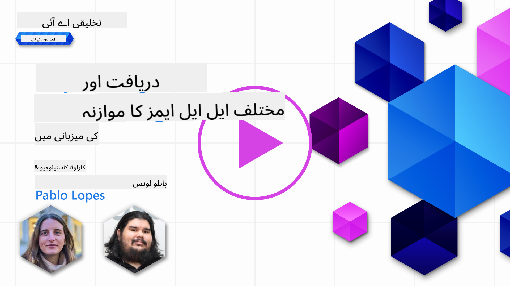
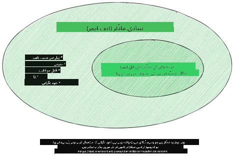
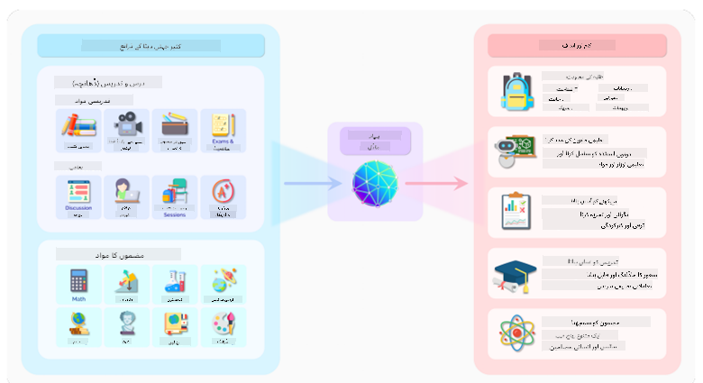
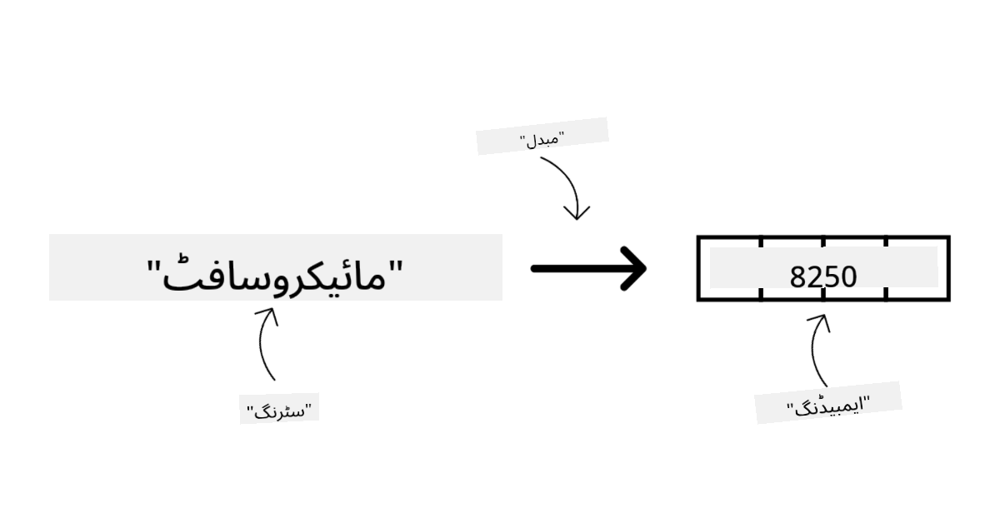
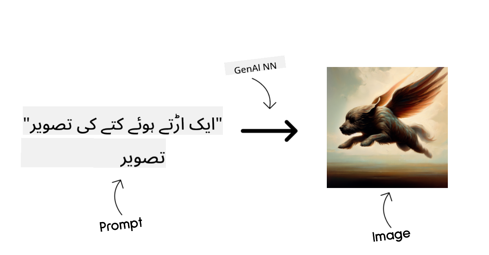
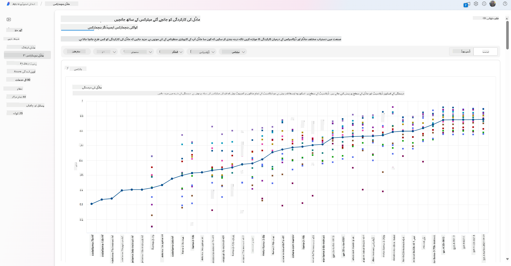
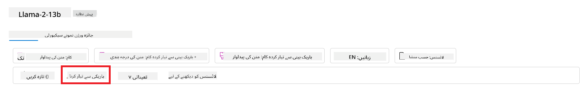
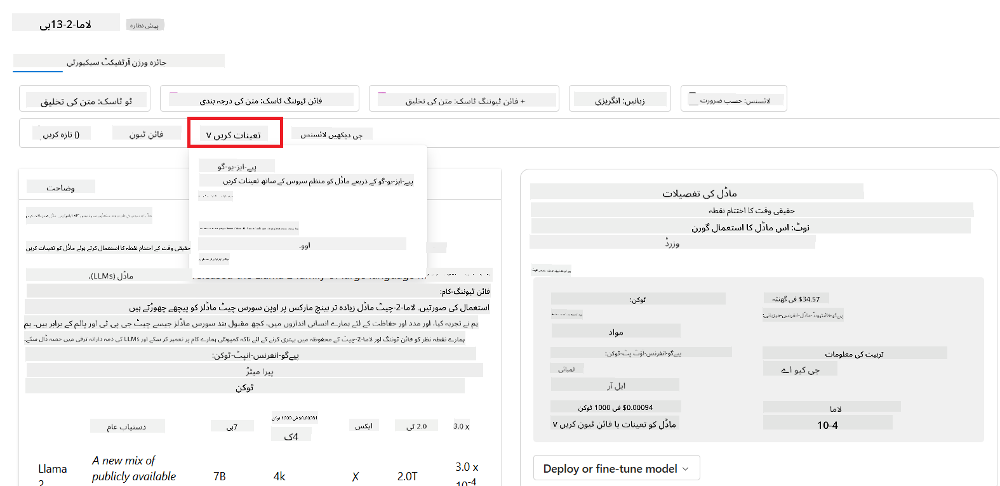
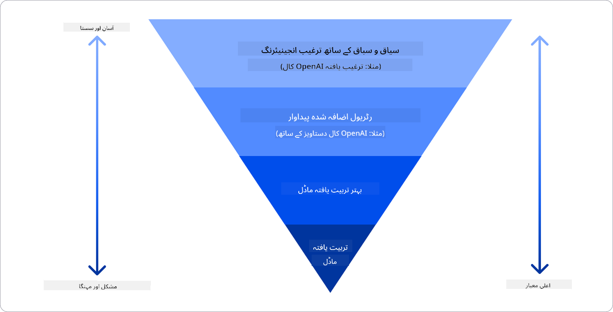

<!--
CO_OP_TRANSLATOR_METADATA:
{
  "original_hash": "e2f686f2eb794941761252ac5e8e090b",
  "translation_date": "2025-06-25T10:18:55+00:00",
  "source_file": "02-exploring-and-comparing-different-llms/README.md",
  "language_code": "ur"
}
-->
# مختلف LLMs کا جائزہ اور موازنہ

> _اس سبق کی ویڈیو دیکھنے کے لیے اوپر دی گئی تصویر پر کلک کریں_

پچھلے سبق کے ساتھ، ہم نے دیکھا کہ جنریٹو AI کس طرح ٹیکنالوجی کے منظر نامے کو تبدیل کر رہا ہے، بڑے زبان کے ماڈلز (LLMs) کیسے کام کرتے ہیں اور کس طرح ایک کاروبار - جیسے ہمارا اسٹارٹ اپ - انہیں اپنے استعمال کے معاملات میں لاگو کر سکتا ہے اور ترقی کر سکتا ہے! اس باب میں، ہم مختلف قسم کے بڑے زبان کے ماڈلز (LLMs) کا موازنہ کرنے اور ان کے فوائد اور نقصانات کو سمجھنے کی کوشش کر رہے ہیں۔

ہمارے اسٹارٹ اپ کے سفر کا اگلا مرحلہ LLMs کے موجودہ منظر نامے کی تلاش کرنا اور یہ سمجھنا ہے کہ کون سا ہمارے استعمال کے معاملے کے لیے موزوں ہے۔

## تعارف

یہ سبق شامل کرے گا:

- موجودہ منظر نامے میں مختلف قسم کے LLMs۔
- Azure میں آپ کے استعمال کے معاملے کے لیے مختلف ماڈلز کی جانچ، تکرار اور موازنہ۔
- LLM کو کیسے تعینات کریں۔

## سیکھنے کے اہداف

اس سبق کو مکمل کرنے کے بعد، آپ قابل ہو جائیں گے:

- اپنے استعمال کے معاملے کے لیے صحیح ماڈل کا انتخاب کریں۔
- یہ سمجھیں کہ اپنے ماڈل کی کارکردگی کو کیسے جانچنا، تکرار کرنا، اور بہتر بنانا ہے۔
- جانیں کہ کاروبار ماڈلز کو کیسے تعینات کرتے ہیں۔

## مختلف قسم کے LLMs کو سمجھیں

LLMs کو ان کی ساخت، تربیتی ڈیٹا، اور استعمال کے معاملے کی بنیاد پر کئی زمروں میں تقسیم کیا جا سکتا ہے۔ ان اختلافات کو سمجھنا ہمارے اسٹارٹ اپ کو منظرنامے کے لیے صحیح ماڈل منتخب کرنے میں مدد کرے گا، اور یہ سمجھنے میں مدد کرے گا کہ کارکردگی کو کیسے جانچنا، تکرار کرنا، اور بہتر بنانا ہے۔

بہت سے مختلف قسم کے LLM ماڈلز ہیں، آپ کے ماڈل کا انتخاب اس بات پر منحصر ہے کہ آپ ان کا استعمال کس مقصد کے لیے کرنا چاہتے ہیں، آپ کا ڈیٹا، آپ کتنا خرچ کرنے کے لیے تیار ہیں اور مزید۔

اگر آپ ماڈلز کو متن، آڈیو، ویڈیو، تصویر کی تخلیق وغیرہ کے لیے استعمال کرنے کا ارادہ رکھتے ہیں، تو آپ مختلف قسم کے ماڈل کا انتخاب کر سکتے ہیں۔

- **آڈیو اور تقریر کی شناخت**۔ اس مقصد کے لیے، وسپر قسم کے ماڈلز ایک بہترین انتخاب ہیں کیونکہ وہ عمومی مقصد کے لیے ہیں اور تقریر کی شناخت کے لیے بنائے گئے ہیں۔ یہ مختلف آڈیو پر تربیت یافتہ ہے اور کثیر لسانی تقریر کی شناخت کر سکتا ہے۔ [وسپر قسم کے ماڈلز کے بارے میں مزید جانیں یہاں](https://platform.openai.com/docs/models/whisper?WT.mc_id=academic-105485-koreyst).

- **تصویر کی تخلیق**۔ تصویر کی تخلیق کے لیے، DALL-E اور Midjourney دو بہت معروف انتخاب ہیں۔ DALL-E Azure OpenAI کے ذریعے پیش کیا جاتا ہے۔ [DALL-E کے بارے میں مزید پڑھیں یہاں](https://platform.openai.com/docs/models/dall-e?WT.mc_id=academic-105485-koreyst) اور اس نصاب کے باب 9 میں بھی۔

- **متن کی تخلیق**۔ زیادہ تر ماڈلز متن کی تخلیق پر تربیت یافتہ ہوتے ہیں اور آپ کے پاس GPT-3.5 سے لے کر GPT-4 تک کے انتخاب کی بڑی تعداد ہوتی ہے۔ وہ مختلف قیمتوں پر آتے ہیں، GPT-4 سب سے مہنگا ہے۔ یہ [Azure OpenAI playground](https://oai.azure.com/portal/playground?WT.mc_id=academic-105485-koreyst) کو دیکھنے کے قابل ہے تاکہ یہ معلوم کیا جا سکے کہ کون سے ماڈلز قابلیت اور قیمت کے لحاظ سے آپ کی ضروریات کے لیے بہترین ہیں۔

- **کثیر وضعیت**۔ اگر آپ ان پٹ اور آؤٹ پٹ میں متعدد قسم کے ڈیٹا کو سنبھالنے کے خواہاں ہیں، تو آپ ماڈلز جیسے [gpt-4 turbo with vision یا gpt-4o](https://learn.microsoft.com/azure/ai-services/openai/concepts/models#gpt-4-and-gpt-4-turbo-models?WT.mc_id=academic-105485-koreyst) - OpenAI ماڈلز کی تازہ ترین ریلیز - کو دیکھنا چاہ سکتے ہیں، جو قدرتی زبان کی پروسیسنگ کو بصری تفہیم کے ساتھ جوڑنے کی صلاحیت رکھتے ہیں، کثیر وضعی انٹرفیس کے ذریعے تعاملات کو ممکن بناتے ہیں۔

ماڈل کا انتخاب کرنے کا مطلب ہے کہ آپ کو کچھ بنیادی صلاحیتیں ملتی ہیں، جو تاہم کافی نہیں ہو سکتی ہیں۔ اکثر آپ کے پاس کمپنی کے مخصوص ڈیٹا ہوتے ہیں جنہیں آپ کو کسی طرح LLM کو بتانا ہوتا ہے۔ اس کے بارے میں کچھ مختلف انتخاب ہیں کہ اس کا کس طرح سے سامنا کرنا ہے، مزید اس بارے میں آنے والے حصوں میں۔

### بنیادی ماڈلز بمقابلہ LLMs

بنیادی ماڈل کی اصطلاح [اسٹینفورڈ کے محققین نے وضع کی](https://arxiv.org/abs/2108.07258?WT.mc_id=academic-105485-koreyst) اور اسے ایک AI ماڈل کے طور پر بیان کیا جو کچھ معیار کی پیروی کرتا ہے، جیسے:

- **یہ غیر نگرانی شدہ سیکھنے یا خود نگرانی شدہ سیکھنے کا استعمال کرتے ہوئے تربیت یافتہ ہیں**، یعنی وہ بغیر لیبل والے کثیر وضعی ڈیٹا پر تربیت یافتہ ہیں، اور ان کے تربیتی عمل کے لیے انسانی تشریح یا ڈیٹا کی لیبلنگ کی ضرورت نہیں ہوتی۔
- **یہ بہت بڑے ماڈلز ہیں**، جو بہت گہرے نیورل نیٹ ورکس پر مبنی ہیں جو اربوں پیرامیٹرز پر تربیت یافتہ ہیں۔
- **یہ عام طور پر دوسرے ماڈلز کے لیے 'بنیاد' کے طور پر کام کرنے کے ارادے سے ہیں**، یعنی انہیں دوسرے ماڈلز کے لیے نقطہ آغاز کے طور پر استعمال کیا جا سکتا ہے، جو کہ ٹھیک ٹھیک کرنے کے ذریعے کیا جا سکتا ہے۔

تصویری ماخذ: [بنیادی ماڈلز اور بڑے زبان کے ماڈلز کے لیے ضروری گائیڈ | بابار ایم بھٹی | Medium](https://thebabar.medium.com/essential-guide-to-foundation-models-and-large-language-models-27dab58f7404)

اس فرق کو مزید واضح کرنے کے لیے، آئیے ChatGPT کو ایک مثال کے طور پر لیں۔ ChatGPT کے پہلے ورژن کو بنانے کے لیے، ایک ماڈل جسے GPT-3.5 کہا جاتا ہے، نے بنیادی ماڈل کے طور پر کام کیا۔ اس کا مطلب یہ ہے کہ OpenAI نے کچھ چیٹ مخصوص ڈیٹا کا استعمال کیا تاکہ GPT-3.5 کا ایک مخصوص ورژن بنایا جا سکے جو چیٹ بوٹس جیسے مکالماتی منظرناموں میں اچھی کارکردگی دکھانے میں مہارت رکھتا تھا۔

تصویری ماخذ: [2108.07258.pdf (arxiv.org)](https://arxiv.org/pdf/2108.07258.pdf?WT.mc_id=academic-105485-koreyst)

### اوپن سورس بمقابلہ ملکیتی ماڈلز

LLMs کو یہ بھی درجہ بندی کیا جا سکتا ہے کہ آیا وہ اوپن سورس ہیں یا ملکیتی۔

اوپن سورس ماڈلز وہ ماڈلز ہیں جو عوام کے لیے دستیاب کیے جاتے ہیں اور انہیں کوئی بھی استعمال کر سکتا ہے۔ انہیں اکثر وہ کمپنی دستیاب کرتی ہے جس نے انہیں بنایا، یا تحقیقی برادری کے ذریعے۔ ان ماڈلز کو مختلف استعمال کے معاملات میں LLMs کے لیے معائنہ، ترمیم، اور حسب ضرورت بنایا جا سکتا ہے۔ تاہم، وہ ہمیشہ پیداوار کے استعمال کے لیے بہتر نہیں ہوتے، اور ملکیتی ماڈلز کی طرح کارکردگی نہیں ہو سکتی۔ اس کے علاوہ، اوپن سورس ماڈلز کے لیے فنڈنگ محدود ہو سکتی ہے، اور انہیں طویل مدتی میں برقرار نہیں رکھا جا سکتا یا انہیں تازہ ترین تحقیق کے ساتھ اپ ڈیٹ نہیں کیا جا سکتا۔ مشہور اوپن سورس ماڈلز کی مثالیں شامل ہیں [Alpaca](https://crfm.stanford.edu/2023/03/13/alpaca.html?WT.mc_id=academic-105485-koreyst), [Bloom](https://huggingface.co/bigscience/bloom) اور [LLaMA](https://llama.meta.com).

ملکیتی ماڈلز وہ ماڈلز ہیں جو کسی کمپنی کے مالک ہوتے ہیں اور عوام کے لیے دستیاب نہیں کیے جاتے ہیں۔ یہ ماڈلز اکثر پیداوار کے استعمال کے لیے بہتر ہوتے ہیں۔ تاہم، انہیں مختلف استعمال کے معاملات کے لیے معائنہ، ترمیم، یا حسب ضرورت بنانے کی اجازت نہیں ہے۔ اس کے علاوہ، وہ ہمیشہ مفت دستیاب نہیں ہوتے، اور انہیں استعمال کرنے کے لیے سبسکرپشن یا ادائیگی کی ضرورت ہو سکتی ہے۔ نیز، صارفین کے پاس اس ڈیٹا پر کنٹرول نہیں ہوتا ہے جسے ماڈل کی تربیت کے لیے استعمال کیا جاتا ہے، جس کا مطلب ہے کہ انہیں ڈیٹا کی رازداری اور AI کے ذمہ دارانہ استعمال کے لیے ماڈل مالک پر اعتماد کرنا چاہیے۔ مشہور ملکیتی ماڈلز کی مثالیں شامل ہیں [OpenAI models](https://platform.openai.com/docs/models/overview?WT.mc_id=academic-105485-koreyst), [Google Bard](https://sapling.ai/llm/bard?WT.mc_id=academic-105485-koreyst) یا [Claude 2](https://www.anthropic.com/index/claude-2?WT.mc_id=academic-105485-koreyst).

### ایمبیڈنگ بمقابلہ تصویر کی تخلیق بمقابلہ متن اور کوڈ کی تخلیق

LLMs کو ان کے پیدا کردہ آؤٹ پٹ کے ذریعے بھی درجہ بندی کیا جا سکتا ہے۔

ایمبیڈنگ ماڈلز کا ایک مجموعہ ہیں جو متن کو عددی شکل میں تبدیل کر سکتے ہیں، جسے ایمبیڈنگ کہا جاتا ہے، جو ان پٹ متن کی عددی نمائندگی ہے۔ ایمبیڈنگ مشینوں کے لیے الفاظ یا جملوں کے درمیان تعلقات کو سمجھنا آسان بناتے ہیں اور انہیں دوسرے ماڈلز کے ذریعے ان پٹ کے طور پر استعمال کیا جا سکتا ہے، جیسے کہ درجہ بندی کے ماڈلز، یا کلسٹرنگ ماڈلز جو عددی ڈیٹا پر بہتر کارکردگی رکھتے ہیں۔ ایمبیڈنگ ماڈلز کو اکثر منتقلی سیکھنے کے لیے استعمال کیا جاتا ہے، جہاں ایک ماڈل ایک متبادل کام کے لیے بنایا جاتا ہے جس کے لیے ڈیٹا کی کثرت ہوتی ہے، اور پھر ماڈل کے وزن (ایمبیڈنگ) کو دوسرے نیچے کی طرف کاموں کے لیے دوبارہ استعمال کیا جاتا ہے۔ اس زمرے کی ایک مثال ہے [OpenAI embeddings](https://platform.openai.com/docs/models/embeddings?WT.mc_id=academic-105485-koreyst).

تصویر کی تخلیق کے ماڈلز وہ ماڈلز ہیں جو تصاویر تخلیق کرتے ہیں۔ یہ ماڈلز اکثر تصویر کی تدوین، تصویر کی ترکیب، اور تصویر کی ترجمہ کاری کے لیے استعمال ہوتے ہیں۔ تصویر کی تخلیق کے ماڈلز کو اکثر تصاویر کے بڑے ڈیٹا سیٹس پر تربیت دی جاتی ہے، جیسے [LAION-5B](https://laion.ai/blog/laion-5b/?WT.mc_id=academic-105485-koreyst), اور انہیں نئی تصاویر تخلیق کرنے یا موجودہ تصاویر کو انپینٹنگ، سپر ریزولوشن، اور رنگ سازی کی تکنیکوں کے ساتھ تدوین کرنے کے لیے استعمال کیا جا سکتا ہے۔ مثالیں شامل ہیں [DALL-E-3](https://openai.com/dall-e-3?WT.mc_id=academic-105485-koreyst) اور [Stable Diffusion models](https://github.com/Stability-AI/StableDiffusion?WT.mc_id=academic-105485-koreyst).

متن اور کوڈ کی تخلیق کے ماڈلز وہ ماڈلز ہیں جو متن یا کوڈ تخلیق کرتے ہیں۔ یہ ماڈلز اکثر متن کی خلاصہ کاری، ترجمہ، اور سوالات کے جوابات دینے کے لیے استعمال ہوتے ہیں۔ متن کی تخلیق کے ماڈلز کو اکثر متن کے بڑے ڈیٹا سیٹس پر تربیت دی جاتی ہے، جیسے [BookCorpus](https://www.cv-foundation.org/openaccess/content_iccv_2015/html/Zhu_Aligning_Books_and_ICCV_2015_paper.html?WT.mc_id=academic-105485-koreyst), اور انہیں نیا متن تخلیق کرنے یا سوالات کے جوابات دینے کے لیے استعمال کیا جا سکتا ہے۔ کوڈ کی تخلیق کے ماڈلز، جیسے [CodeParrot](https://huggingface.co/codeparrot?WT.mc_id=academic-105485-koreyst), کو اکثر کوڈ کے بڑے ڈیٹا سیٹس پر تربیت دی جاتی ہے، جیسے GitHub، اور انہیں نیا کوڈ تخلیق کرنے یا موجودہ کوڈ میں خرابیوں کو درست کرنے کے لیے استعمال کیا جا سکتا ہے۔

### انکوڈر-ڈیکوڈر بمقابلہ صرف ڈیکوڈر

LLMs کی مختلف قسم کی ساخت کے بارے میں بات کرنے کے لیے، آئیے ایک مثال استعمال کریں۔

تصور کریں کہ آپ کے مینیجر نے آپ کو طلباء کے لیے ایک کوئز لکھنے کا کام دیا۔ آپ کے پاس دو ساتھی ہیں؛ ایک مواد تیار کرنے کی نگرانی کرتا ہے اور دوسرا ان کا جائزہ لیتا ہے۔

مواد تیار کرنے والا صرف ڈیکوڈر ماڈل کی طرح ہے، وہ موضوع کو دیکھ سکتا ہے اور دیکھ سکتا ہے کہ آپ نے پہلے ہی کیا لکھا ہے اور پھر وہ اس کی بنیاد پر ایک کورس لکھ سکتا ہے۔ وہ دلچسپ اور معلوماتی مواد لکھنے میں بہت اچھے ہیں، لیکن وہ موضوع اور سیکھنے کے مقاصد کو سمجھنے میں بہت اچھے نہیں ہیں۔ ڈیکوڈر ماڈلز کی کچھ مثالیں GPT خاندان کے ماڈلز ہیں، جیسے GPT-3۔

جائزہ لینے والا صرف انکوڈر ماڈل کی طرح ہے، وہ لکھے گئے کورس اور جوابات کو دیکھتا ہے، ان کے درمیان تعلق کو دیکھتا ہے اور سیاق و سباق کو سمجھتا ہے، لیکن وہ مواد تیار کرنے میں اچھے نہیں ہیں۔ انکوڈر ماڈل کی ایک مثال BERT ہوگی۔

تصور کریں کہ ہمارے پاس کوئی ایسا شخص بھی ہو سکتا ہے جو کوئز تیار کر سکے اور اس کا جائزہ لے سکے، یہ ایک انکوڈر-ڈیکوڈر ماڈل ہے۔ کچھ مثالیں BART اور T5 ہوں گی۔

### سروس بمقابلہ ماڈل

اب، آئیے سروس اور ماڈل کے درمیان فرق کے بارے میں بات کرتے ہیں۔ سروس ایک پروڈکٹ ہے جو کلاؤڈ سروس فراہم کنندہ کے ذریعہ پیش کی جاتی ہے، اور اکثر ماڈلز، ڈیٹا، اور دیگر اجزاء کا مجموعہ ہوتا ہے۔ ماڈل سروس کا بنیادی جزو ہوتا ہے، اور اکثر ایک بنیادی ماڈل ہوتا ہے، جیسے کہ ایک LLM۔

خدمات کو اکثر پیداوار کے استعمال کے لیے بہتر بنایا جاتا ہے اور ماڈلز کے مقابلے میں استعمال میں آسان ہوتی ہیں، گرافیکل یوزر انٹرفیس کے ذریعے۔ تاہم، خدمات ہمیشہ مفت دستیاب نہیں ہوتی ہیں، اور انہیں استعمال کرنے کے لیے سبسکرپشن یا ادائیگی کی ضرورت ہو سکتی ہے، سروس مالک کے آلات اور وسائل کو استعمال کرنے کے بدلے میں، اخراجات کو بہتر بنانے اور آسانی سے اسکیل کرنے کے لیے۔ سروس کی ایک مثال ہے [Azure OpenAI Service](https://learn.microsoft.com/azure/ai-services/openai/overview?WT.mc_id=academic-105485-koreyst), جو ایک استعمال کے حساب سے ادائیگی کی شرح منصوبہ پیش کرتا ہے، یعنی صارفین کو اس تناسب میں چارج کیا جاتا ہے کہ وہ سروس کا کتنا استعمال کرتے ہیں۔ نیز، Azure OpenAI سروس ماڈلز کی صلاحیتوں کے اوپر انٹرپرائز گریڈ سیکیورٹی اور ایک ذمہ دار AI فریم ورک پیش کرتی ہے۔

ماڈلز صرف نیورل نیٹ ورک ہوتے ہیں، پیرامیٹرز، وزن، اور دیگر کے ساتھ۔ کمپنیوں کو مقامی طور پر چلانے کی اجازت دیتے ہیں، تاہم، آلات خریدنے کی ضرورت ہوگی، اسکیل کرنے کے لیے ایک ڈھانچہ بنانا ہوگا اور ایک لائسنس خریدنا ہوگا یا ایک اوپن سورس ماڈل استعمال کرنا ہوگا۔ ایک ماڈل جیسے LLaMA استعمال کے لیے دستیاب ہے، ماڈل چلانے کے لیے کمپیوٹیشنل طاقت کی ضرورت ہے۔

## Azure پر کارکردگی کو سمجھنے کے لیے مختلف ماڈلز کے ساتھ کیسے جانچیں اور تکرار کریں

ایک بار جب ہماری ٹیم نے موجودہ LLMs کے منظر نامے کو تلاش کیا اور اپنے منظرناموں کے لیے کچھ اچھے امیدواروں کی شناخت کی، تو اگلا مرحلہ انہیں اپنے ڈیٹا اور اپنے ورک لوڈ پر جانچنا ہے۔ یہ ایک تکراری عمل ہے، تجربات اور پیمائشوں کے ذریعے کیا جاتا ہے۔
زیادہ تر ماڈلز جن کا ہم نے پچھلے پیراگراف میں ذکر کیا (OpenAI ماڈلز، اوپن سورس ماڈلز جیسے Llama2، اور Hugging Face transformers) [ماڈل کیٹلاگ](https://learn.microsoft.com/azure/ai-studio/how-to/model-catalog-overview?WT.mc_id=academic-105485-koreyst) میں [Azure AI Studio](https://ai.azure.com/?WT.mc_id=academic-105485-koreyst) میں دستیاب ہیں۔

[Azure AI
- صنعت میں دستیاب ماڈلز اور ڈیٹا سیٹس کے درمیان موازنہ کریں تاکہ یہ جان سکیں کہ کون سا کاروباری منظر نامے کو پورا کرتا ہے، [Model Benchmarks](https://learn.microsoft.com/azure/ai-studio/how-to/model-benchmarks?WT.mc_id=academic-105485-koreyst) پین کے ذریعے۔

- مخصوص کام میں ماڈل کی کارکردگی کو بہتر بنانے کے لیے، Azure AI Studio کی تجرباتی اور ٹریکنگ صلاحیتوں کا استعمال کرتے ہوئے ماڈل کو اپنی مرضی کے تربیتی ڈیٹا پر بہتر بنائیں۔

- اصل پہلے سے تربیت یافتہ ماڈل یا بہتر شدہ ورژن کو ریموٹ ریئل ٹائم انفراسٹرکچر پر تعینات کریں - منظم کمپیوٹ - یا سرور لیس API اینڈ پوائنٹ - [pay-as-you-go](https://learn.microsoft.com/azure/ai-studio/how-to/model-catalog-overview#model-deployment-managed-compute-and-serverless-api-pay-as-you-go?WT.mc_id=academic-105485-koreyst) - تاکہ ایپلیکیشنز اسے استعمال کر سکیں۔

> [!NOTE]
> کیٹلاگ میں موجود تمام ماڈلز فی الحال بہتر بنانے اور/یا pay-as-you-go تعیناتی کے لیے دستیاب نہیں ہیں۔ ماڈل کی صلاحیتوں اور حدود کی تفصیلات کے لیے ماڈل کارڈ چیک کریں۔

## LLM نتائج کو بہتر بنانا

ہم نے اپنی اسٹارٹ اپ ٹیم کے ساتھ مختلف قسم کے LLMs اور ایک کلاؤڈ پلیٹ فارم (Azure Machine Learning) کا جائزہ لیا ہے، جو ہمیں مختلف ماڈلز کا موازنہ کرنے، انہیں ٹیسٹ ڈیٹا پر جانچنے، کارکردگی کو بہتر بنانے اور انہیں انفراسٹرکچر اینڈ پوائنٹس پر تعینات کرنے کی اجازت دیتا ہے۔

لیکن کب انہیں پہلے سے تربیت یافتہ ماڈل کے بجائے ماڈل کو بہتر بنانے پر غور کرنا چاہیے؟ کیا مخصوص کاموں پر ماڈل کی کارکردگی کو بہتر بنانے کے دیگر طریقے موجود ہیں؟

کاروبار کے لیے LLM سے مطلوبہ نتائج حاصل کرنے کے کئی طریقے ہیں۔ آپ پیداوار میں LLM تعینات کرتے وقت مختلف تربیت کی ڈگریوں کے ساتھ مختلف قسم کے ماڈلز کا انتخاب کر سکتے ہیں، مختلف پیچیدگی، قیمت، اور معیار کے ساتھ۔ یہاں کچھ مختلف طریقے ہیں:

- **کنٹیکسٹ کے ساتھ پرامپٹ انجینئرنگ**۔ خیال یہ ہے کہ جب آپ پرامپٹ دیتے ہیں تو کافی کنٹیکسٹ فراہم کریں تاکہ آپ کو مطلوبہ جوابات مل سکیں۔

- **Retrieval Augmented Generation, RAG**۔ آپ کا ڈیٹا مثال کے طور پر ڈیٹا بیس یا ویب اینڈ پوائنٹ میں موجود ہو سکتا ہے، تاکہ یہ یقینی بنایا جا سکے کہ یہ ڈیٹا یا اس کا کچھ حصہ پرامپٹ کے وقت شامل ہو، آپ متعلقہ ڈیٹا حاصل کر سکتے ہیں اور اسے صارف کے پرامپٹ کا حصہ بنا سکتے ہیں۔

- **بہتر شدہ ماڈل**۔ یہاں، آپ نے اپنے ڈیٹا پر مزید ماڈل کی تربیت کی جس کی وجہ سے ماڈل آپ کی ضروریات کے مطابق زیادہ درست اور جوابدہ ہو گیا لیکن ممکنہ طور پر مہنگا ہو سکتا ہے۔

Img source: [Four Ways that Enterprises Deploy LLMs | Fiddler AI Blog](https://www.fiddler.ai/blog/four-ways-that-enterprises-deploy-llms?WT.mc_id=academic-105485-koreyst)

### کنٹیکسٹ کے ساتھ پرامپٹ انجینئرنگ

پہلے سے تربیت یافتہ LLMs عمومی قدرتی زبان کے کاموں پر بہت اچھا کام کرتے ہیں، حتی کہ انہیں ایک مختصر پرامپٹ کے ساتھ کال کرنے پر، جیسے کہ مکمل کرنے کے لیے ایک جملہ یا سوال – جسے "zero-shot" لرننگ کہا جاتا ہے۔

تاہم، جتنا زیادہ صارف اپنی استفسار کو فریم کر سکتا ہے، ایک تفصیلی درخواست اور مثالوں کے ساتھ – کنٹیکسٹ – جواب اتنا ہی درست اور صارف کی توقعات کے قریب ہوگا۔ اس صورت میں، ہم "one-shot" لرننگ کی بات کرتے ہیں اگر پرامپٹ میں صرف ایک مثال شامل ہو اور "few shot learning" اگر اس میں متعدد مثالیں شامل ہوں۔
کنٹیکسٹ کے ساتھ پرامپٹ انجینئرنگ شروع کرنے کے لیے سب سے زیادہ لاگت مؤثر طریقہ ہے۔

### Retrieval Augmented Generation (RAG)

LLMs کی محدودیت ہے کہ وہ صرف اس ڈیٹا کا استعمال کر سکتے ہیں جو ان کی تربیت کے دوران استعمال کیا گیا تھا جواب پیدا کرنے کے لیے۔ اس کا مطلب ہے کہ وہ تربیت کے عمل کے بعد ہونے والے حقائق کے بارے میں کچھ نہیں جانتے، اور وہ غیر عوامی معلومات تک رسائی حاصل نہیں کر سکتے (جیسے کمپنی کا ڈیٹا)۔
اس پر قابو پایا جا سکتا ہے RAG کے ذریعے، ایک تکنیک جو پرامپٹ کو بیرونی ڈیٹا کے ساتھ دستاویزات کے چنکس کی شکل میں بڑھاتی ہے، پرامپٹ کی لمبائی کی حدود کو مدنظر رکھتے ہوئے۔ یہ ویکٹر ڈیٹا بیس ٹولز (جیسے [Azure Vector Search](https://learn.microsoft.com/azure/search/vector-search-overview?WT.mc_id=academic-105485-koreyst)) کے ذریعے سپورٹ کیا جاتا ہے جو مختلف پہلے سے طے شدہ ڈیٹا سورسز سے مفید چنکس کو بازیافت کرتے ہیں اور انہیں پرامپٹ کنٹیکسٹ میں شامل کرتے ہیں۔

یہ تکنیک اس وقت بہت مددگار ثابت ہوتی ہے جب کسی کاروبار کے پاس کافی ڈیٹا نہیں ہوتا، کافی وقت نہیں ہوتا، یا LLM کو بہتر بنانے کے لیے وسائل نہیں ہوتے، لیکن پھر بھی مخصوص کام پر کارکردگی کو بہتر بنانا چاہتے ہیں اور جعل سازی کے خطرات کو کم کرنا چاہتے ہیں، یعنی حقیقت کی تحریف یا نقصان دہ مواد۔

### بہتر شدہ ماڈل

بہتر بنانا ایک ایسا عمل ہے جو ٹرانسفر لرننگ کو استعمال کرتا ہے تاکہ ماڈل کو ڈاون اسٹریم کام کے مطابق 'ڈھال' لیا جا سکے یا مخصوص مسئلہ کو حل کیا جا سکے۔ few-shot لرننگ اور RAG سے مختلف، یہ ایک نئے ماڈل کے پیدا ہونے کا نتیجہ ہے، جس میں اپ ڈیٹ شدہ وزن اور تعصبات ہیں۔ اس کے لیے تربیت کی مثالوں کا ایک سیٹ درکار ہوتا ہے جس میں ایک واحد ان پٹ (پرامپٹ) اور اس سے وابستہ آؤٹ پٹ (تکمیل) شامل ہوتا ہے۔
یہ ترجیحی طریقہ ہوگا اگر:

- **بہتر شدہ ماڈلز کا استعمال**۔ ایک کاروبار بہتر شدہ کم قابل ماڈلز (جیسے ایمبیڈنگ ماڈلز) استعمال کرنا چاہے گا بجائے اعلی کارکردگی والے ماڈلز کے، جس کے نتیجے میں ایک زیادہ لاگت مؤثر اور تیز حل ہوگا۔

- **لیٹنسی کو مدنظر رکھنا**۔ لیٹنسی مخصوص استعمال کے کیس کے لیے اہم ہے، لہذا بہت لمبے پرامپٹس کا استعمال ممکن نہیں ہے یا مثالوں کی تعداد جو ماڈل سے سیکھنی چاہیے وہ پرامپٹ کی لمبائی کی حد میں نہیں آتی۔

- **اپ ٹو ڈیٹ رہنا**۔ ایک کاروبار کے پاس بہت زیادہ اعلی معیار کا ڈیٹا اور زمینی سچائی کے لیبلز ہیں اور اس ڈیٹا کو وقت کے ساتھ اپ ٹو ڈیٹ رکھنے کے لیے مطلوبہ وسائل ہیں۔

### تربیت یافتہ ماڈل

شروع سے ایک LLM کی تربیت کرنا بلا شبہ سب سے مشکل اور اپنانے کے لیے سب سے پیچیدہ طریقہ ہے، جس کے لیے بڑے پیمانے پر ڈیٹا، ماہر وسائل، اور مناسب کمپیوٹیشنل پاور کی ضرورت ہوتی ہے۔ اس آپشن پر صرف اس منظر نامے میں غور کیا جانا چاہیے جہاں کاروبار کے پاس ڈومین مخصوص استعمال کا کیس اور ڈومین سینٹرک ڈیٹا کی بڑی مقدار موجود ہو۔

## علم کی جانچ

LLM تکمیل کے نتائج کو بہتر بنانے کے لیے اچھا طریقہ کیا ہو سکتا ہے؟

1. کنٹیکسٹ کے ساتھ پرامپٹ انجینئرنگ
1. RAG
1. بہتر شدہ ماڈل

A:3، اگر آپ کے پاس وقت اور وسائل ہیں اور اعلی معیار کا ڈیٹا ہے، تو بہتر بنانا اپ ٹو ڈیٹ رہنے کا بہتر آپشن ہے۔ تاہم، اگر آپ چیزوں کو بہتر بنانے کے لیے دیکھ رہے ہیں اور آپ کے پاس وقت نہیں ہے تو پہلے RAG پر غور کرنا قابل قدر ہے۔

## 🚀 چیلنج

اس بارے میں مزید پڑھیں کہ آپ اپنے کاروبار کے لیے [RAG کا استعمال](https://learn.microsoft.com/azure/search/retrieval-augmented-generation-overview?WT.mc_id=academic-105485-koreyst) کیسے کر سکتے ہیں۔

## بہترین کام، اپنی تعلیم جاری رکھیں

اس سبق کو مکمل کرنے کے بعد، ہمارے [Generative AI Learning collection](https://aka.ms/genai-collection?WT.mc_id=academic-105485-koreyst) کو چیک کریں تاکہ اپنی Generative AI کی معلومات کو مزید بہتر بنائیں!

سبق 3 کی طرف بڑھیں جہاں ہم دیکھیں گے کہ کس طرح [Generative AI کو ذمہ داری سے استعمال کریں](../03-using-generative-ai-responsibly/README.md?WT.mc_id=academic-105485-koreyst)!

**دستبرداری**:  
یہ دستاویز AI ترجمہ سروس [Co-op Translator](https://github.com/Azure/co-op-translator) کا استعمال کرتے ہوئے ترجمہ کی گئی ہے۔ ہم درستگی کے لئے کوشاں ہیں، لیکن براہ کرم آگاہ رہیں کہ خودکار ترجمے میں غلطیاں یا غلط فہمیاں ہو سکتی ہیں۔ اصل دستاویز کو اس کی اصل زبان میں مستند ذریعہ سمجھا جانا چاہیے۔ اہم معلومات کے لئے پیشہ ور انسانی ترجمہ کی سفارش کی جاتی ہے۔ ہم اس ترجمے کے استعمال سے پیدا ہونے والی کسی بھی غلط فہمی یا غلط تشریح کے ذمہ دار نہیں ہیں۔