# مختلف LLMs کی کھوج اور موازنہ

[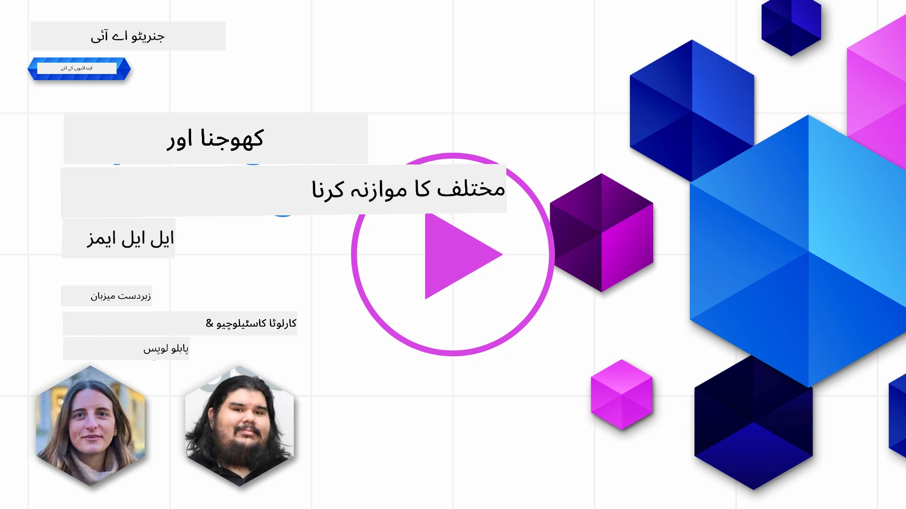](https://youtu.be/KIRUeDKscfI?si=8BHX1zvwzQBn-PlK)

> _اس سبق کی ویڈیو دیکھنے کے لیے اوپر دی گئی تصویر پر کلک کریں_

پچھلے سبق کے ساتھ، ہم نے دیکھا کہ کس طرح Generative AI ٹیکنالوجی کے منظرنامے کو تبدیل کر رہا ہے، کیسے بڑے زبان ماڈلز (LLMs) کام کرتے ہیں اور ایک کاروبار - جیسے ہمارا اسٹارٹ اپ - انہیں اپنے استعمال کے کیسز پر کیسے لاگو کر سکتا ہے اور ترقی کر سکتا ہے! اس باب میں، ہم مختلف قسم کے بڑے زبان ماڈلز (LLMs) کا موازنہ اور تقابل کریں گے تاکہ ان کے فوائد اور نقصانات کو سمجھ سکیں۔

ہمارے اسٹارٹ اپ کے سفر کا اگلا قدم موجودہ LLMs کے منظرنامے کا جائزہ لینا اور یہ سمجھنا ہے کہ کون سے ہمارے استعمال کے کیس کے لیے موزوں ہیں۔

## تعارف

یہ سبق درج ذیل موضوعات کا احاطہ کرے گا:

- موجودہ منظرنامے میں مختلف قسم کے LLMs۔
- Azure میں اپنے استعمال کے کیس کے لیے مختلف ماڈلز کی جانچ، تکرار، اور موازنہ۔
- ایک LLM کو تعینات کرنے کا طریقہ۔

## تعلیمی مقاصد

اس سبق کو مکمل کرنے کے بعد، آپ کر سکیں گے:

- اپنے استعمال کے کیس کے لیے درست ماڈل منتخب کرنا۔
- جانچ، تکرار، اور اپنے ماڈل کی کارکردگی کو بہتر بنانا سمجھنا۔
- جاننا کہ کاروبار کس طرح ماڈلز کو تعینات کرتے ہیں۔

## LLMs کی مختلف اقسام کو سمجھنا

LLMs کو ان کے فن تعمیر، تربیتی ڈیٹا، اور استعمال کے کیس کی بنیاد پر مختلف زمروں میں رکھا جا سکتا ہے۔ ان اختلافات کو سمجھنا ہمارے اسٹارٹ اپ کو منظرنامے کے لیے صحیح ماڈل منتخب کرنے، اور جانچ، تکرار، اور کارکردگی کو بہتر بنانے کے طریقے سمجھنے میں مدد دے گا۔

LLM ماڈلز کی کئی مختلف اقسام ہیں، آپ کے ماڈل کا انتخاب اس بات پر منحصر ہے کہ آپ انہیں کس لیے استعمال کرنا چاہتے ہیں، آپ کا ڈیٹا کیا ہے، آپ کتنا خرچ کرنے کو تیار ہیں، اور دیگر عوامل۔

اس بات پر منحصر ہے کہ آپ ماڈلز کو متن، آڈیو، ویڈیو، تصویر سازی وغیرہ کے لیے استعمال کرنے کا ارادہ رکھتے ہیں، آپ مختلف قسم کے ماڈل کا انتخاب کر سکتے ہیں۔

- **آڈیو اور تقریر کی شناخت**۔ Whisper طرز کے ماڈلز اب بھی عمومی استعمال کے لیے موزوں ہیں، لیکن موجودہ پیداواری انتخاب میں نئے سپیچ ٹو ٹیکسٹ ماڈلز جیسے `gpt-4o-transcribe`, `gpt-4o-mini-transcribe`، اور ڈیاریائزیشن ویرینٹس شامل ہیں۔ آپ کے منظرنامے کے لیے زبان کی کوریج، ڈیاریائزیشن، حقیقی وقت کی حمایت، لیٹینسی، اور لاگت کا جائزہ لیں۔ مزید جاننے کے لیے [OpenAI سپیچ ٹو ٹیکسٹ دستاویزات](https://platform.openai.com/docs/guides/speech-to-text?WT.mc_id=academic-105485-koreyst) دیکھیں۔

- **تصویر سازی**۔ DALL-E اور Midjourney معروف تصویر سازی کے آپشنز ہیں، لیکن موجودہ OpenAI تصویر APIs زیادہ تر GPT Image ماڈلز جیسے `gpt-image-2` پر مرکوز ہیں، جبکہ Stable Diffusion, Imagen, Flux، اور دیگر ماڈل خاندان بھی عام انتخاب ہیں۔ پرامپٹ کی پابندی، ایڈیٹنگ کی حمایت، اسلوب کنٹرول، حفاظتی ضروریات، اور لائسنسنگ کا موازنہ کریں۔ مزید جاننے کے لیے [OpenAI تصویر سازی گائیڈ](https://platform.openai.com/docs/guides/images?WT.mc_id=academic-105485-koreyst) اور اس نصاب کے باب 9 کو دیکھیں۔

- **متن کی تخلیق**۔ متن کے ماڈلز اب فرنٹیئر ماڈلز، استدلال ماڈلز، چھوٹے کم لیٹینسی والے ماڈلز، اور اوپن ویٹ ماڈلز پر مشتمل ہوتے ہیں۔ موجودہ مثالوں میں OpenAI GPT-5.x ماڈلز، Anthropic Claude 4.x ماڈلز، Google Gemini 3.x ماڈلز، Meta Llama 4 ماڈلز، اور Mistral ماڈلز شامل ہیں۔ صرف ریلیز کی تاریخ یا قیمت کی بنیاد پر انتخاب نہ کریں؛ کام کی معیار، لیٹینسی، کانٹیکسٹ ونڈو، ٹول استعمال، حفاظتی رویہ، علاقائی دستیابی، اور کل لاگت کا موازنہ کریں۔ [Microsoft Foundry ماڈل کیٹلاگ](https://ai.azure.com/catalog?WT.mc_id=academic-105485-koreyst) Azure پر دستیاب ماڈلز کا اچھا موازنہ فراہم کرتا ہے۔

- **کثیر الوضعیت**۔ بہت سے موجودہ ماڈلز صرف متن سے زیادہ پروسیس کر سکتے ہیں۔ کچھ تصویر، آڈیو، یا ویڈیو ان پٹ قبول کرتے ہیں؛ کچھ ٹولز کو کال کر سکتے ہیں؛ اور خاص ماڈلز تصویریں، آڈیو، یا ویڈیو تیار کر سکتے ہیں۔ مثال کے طور پر، موجودہ OpenAI ماڈلز متن اور تصویر ان پٹ کی حمایت کرتے ہیں، Gemini ماڈلز ویرینٹ کے مطابق متن، کوڈ، تصویر، آڈیو، اور ویڈیو ان پٹس کی حمایت کر سکتے ہیں، اور Llama 4 Scout اور Maverick اوپن ویٹ فطری طور پر کثیر الوضعی ماڈلز ہیں۔ ہمیشہ کسی ورک فلو بنانے سے پہلے ہر ماڈل کارڈ پر سپورٹڈ ان پٹ اور آؤٹ پٹ وضعوں کو چیک کریں۔

ماڈل منتخب کرنے کا مطلب ہے کہ آپ کو کچھ بنیادی صلاحیتیں ملتی ہیں، جو شاید کافی نہ ہوں۔ اکثر آپ کے پاس کمپنی مخصوص ڈیٹا ہوتا ہے جسے آپ کو کسی طرح LLM کو بتانا ہوتا ہے۔ اس پر چند مختلف طریقے ہیں، جن کا تفصیل آنے والے سیکشنز میں دی جائے گی۔

### فاؤنڈیشن ماڈلز بمقابلہ LLMs

اصطلاح فاؤنڈیشن ماڈل کو [سٹینفورڈ کے محققین نے وضع کیا](https://arxiv.org/abs/2108.07258?WT.mc_id=academic-105485-koreyst) اور اسے ایک ایسے AI ماڈل کی حیثیت دی جو کچھ معیارات پر پورا اترتا ہو، مثلاً:

- **یہ غیر نگرانی یا خود نگرانی سیکھنے کے ذریعے تربیت یافتہ ہوتے ہیں**, یعنی یہ بغیر لیبل کے کثیر الوضعی ڈیٹا پر تربیت پاتے ہیں، اور اپنی تربیتی عمل کے لیے انسانی تشریح یا لیبلنگ کی ضرورت نہیں ہوتی۔
- **یہ بہت بڑے ماڈلز ہوتے ہیں**, بہت گہرے نیورل نیٹ ورکس پر مبنی، جو اربوں پیرامیٹرز پر تربیت یافتہ ہوتے ہیں۔
- **یہ عام طور پر دوسرے ماڈلز کے ‘بنیاد’ کے طور پر کام کرتے ہیں**, یعنی انہیں دوسرے ماڈلز کی بنیاد کے طور پر استعمال کیا جا سکتا ہے، جسے مزید فائن ٹیوننگ کے ذریعے بہتر بنایا جا سکتا ہے۔

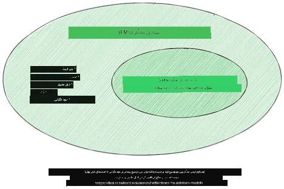

تصویر کا ماخذ: [Essential Guide to Foundation Models and Large Language Models | by Babar M Bhatti | Medium
](https://thebabar.medium.com/essential-guide-to-foundation-models-and-large-language-models-27dab58f7404)

اس تمیز کو مزید واضح کرنے کے لیے، تاریخی مثال کے طور پر ChatGPT لیں۔ ChatGPT کے ابتدائی ورژنز نے GPT-3.5 کو فاؤنڈیشن ماڈل کے طور پر استعمال کیا۔ پھر OpenAI نے چیٹ مخصوص ڈیٹا اور الائنمنٹ تکنیکوں کا استعمال کرتے ہوئے ایک بہتر ٹیونڈ ورژن بنایا جو بات چیت کے منظرناموں، جیسے چیٹ بوٹس، میں بہتر کارکردگی دکھاتا تھا۔ جدید AI خدمات اکثر کئی ماڈل ویرینٹس کے درمیان روانگی کرتی ہیں، اس لیے سروس کا نام اور بنیادی ماڈل کا نام ہمیشہ ایک جیسا نہیں ہوتا۔

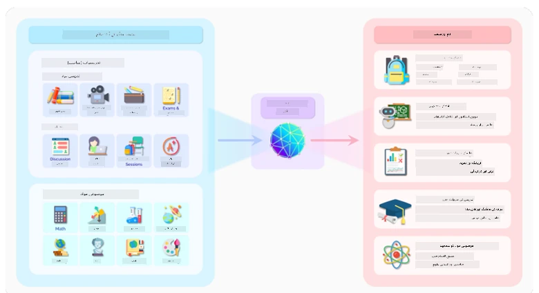

تصویر کا ماخذ: [2108.07258.pdf (arxiv.org)](https://arxiv.org/pdf/2108.07258.pdf?WT.mc_id=academic-105485-koreyst)

### اوپن ویٹ/اوپن سورس بمقابلہ ملکیتی ماڈلز

LLMs کو ایک اور طریقے سے زمرہ بندی کیا جا سکتا ہے کہ آیا وہ اوپن ویٹ، اوپن سورس، یا ملکیتی ہیں۔

اوپن سورس اور اوپن ویٹ ماڈلز ماڈل کے آرٹیفیکٹس کو معائنہ، ڈاؤن لوڈ، یا حسب ضرورت بنانے کے لیے دستیاب کرتے ہیں، لیکن ان کے لائسنس مختلف ہوتے ہیں۔ کچھ مکمل طور پر اوپن سورس ہوتے ہیں، جبکہ دوسرے اوپن ویٹ ماڈلز ہوتے ہیں جن پر استعمال کی پابندیاں ہوتی ہیں۔ یہ مفید ہوتے ہیں جب کاروبار کو تعیناتی، ڈیٹا کی جگہ، لاگت، یا حسب ضرورت پر زیادہ کنٹرول کی ضرورت ہو۔ تاہم، ٹیموں کو پھر بھی لائسنس کی شرائط، سرونگ لاگت، دیکھ بھال، سیکیورٹی اپڈیٹس، اور تشخیص کی معیار کا جائزہ لینا ہوتا ہے تاکہ انہیں پروڈکشن میں استعمال کیا جا سکے۔ مثالوں میں [Meta Llama 4](https://ai.meta.com/blog/llama-4-multimodal-intelligence/?WT.mc_id=academic-105485-koreyst)، کچھ [Mistral ماڈلز](https://docs.mistral.ai/models/overview?WT.mc_id=academic-105485-koreyst)، اور بہت سے ماڈلز جو [Hugging Face](https://huggingface.co/models?WT.mc_id=academic-105485-koreyst) پر میزبان ہیں شامل ہیں۔

ملکیتی ماڈلز کسی فراہم کنندہ کے ملکیت اور میزبانی میں ہوتے ہیں۔ یہ ماڈلز عموماً منظم شدہ پیداواری استعمال کے لیے بہتر بنائے جاتے ہیں اور مضبوط سپورٹ، حفاظتی نظام، ٹول انضمام، اور پیمانے کی پیشکش کر سکتے ہیں۔ تاہم، صارفین عموماً ماڈل کے وزنوں کا معائنہ یا ترمیم نہیں کر سکتے، اور انہیں فراہم کنندہ کی پرائیویسی، تحفظ، تعمیل، اور قابل قبول استعمال کی شرائط کا جائزہ لینا ہوتا ہے۔ مثالوں میں [OpenAI ماڈلز](https://platform.openai.com/docs/models?WT.mc_id=academic-105485-koreyst)، [Google Gemini](https://deepmind.google/models/gemini/pro/?WT.mc_id=academic-105485-koreyst)، اور [Anthropic Claude](https://platform.claude.com/docs/en/about-claude/models/overview?WT.mc_id=academic-105485-koreyst) شامل ہیں۔

### ایمبیڈنگ بمقابلہ تصویر سازی بمقابلہ متن اور کوڈ کی تخلیق

LLMs کو اس لحاظ سے بھی درجہ بندی کیا جا سکتا ہے کہ وہ کون سا آؤٹ پٹ پیدا کرتے ہیں۔

ایمبیڈنگز ماڈلز کا ایک سیٹ ہیں جو متن کو ایک عددی شکل میں تبدیل کر سکتے ہیں، جسے ایمبیڈنگ کہا جاتا ہے، جو ان پٹ متن کی عددی نمائندگی ہوتی ہے۔ ایمبیڈنگز مشینوں کے لیے لفظوں یا جملوں کے تعلقات کو سمجھنا آسان بناتی ہیں اور انہیں دوسرے ماڈلز جیسے کلاسیکیفکیشن ماڈلز یا کلسٹرنگ ماڈلز کی جانب سے ان پٹ کے طور پر استعمال کیا جا سکتا ہے جو عددی ڈیٹا پر بہتر کارکردگی رکھتے ہیں۔ ایمبیڈنگ ماڈلز اکثر ٹرانسفر لرننگ کے لیے استعمال ہوتے ہیں، جہاں ایک ماڈل ایک سروریٹ کام کے لیے بنایا جاتا ہے جس کے لیے ڈیٹا کی بہتات ہوتی ہے، اور پھر ماڈل کے وزن (ایمبیڈنگز) دوسرے نیچے والے کاموں کے لیے دوبارہ استعمال کیے جاتے ہیں۔ اس زمرے کی ایک مثال [OpenAI embeddings](https://platform.openai.com/docs/models/embeddings?WT.mc_id=academic-105485-koreyst) ہیں۔

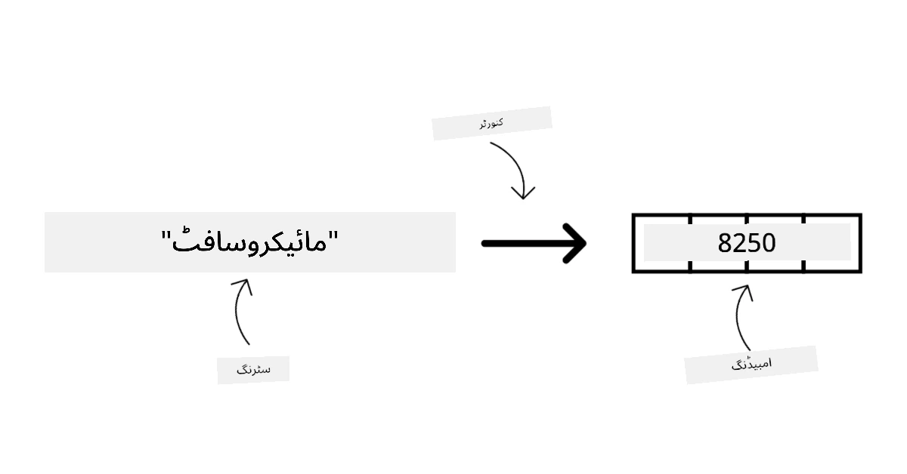

تصویر سازی کے ماڈلز وہ ماڈلز ہیں جو تصاویر تیار کرتے ہیں۔ یہ ماڈلز عموماً تصویر کی تدوین، تصویر سازی، اور تصویر ترجمہ کے لیے استعمال ہوتے ہیں۔ تصویر سازی کے ماڈلز کو عام طور پر بڑی تصویری ڈیٹاسیٹس جیسے [LAION-5B](https://laion.ai/blog/laion-5b/?WT.mc_id=academic-105485-koreyst) پر تربیت دیا جاتا ہے اور انہیں نئی تصاویر تیار کرنے یا موجودہ تصاویر کو ان پینٹنگ، سپر-ریزولوشن، اور رنگ کاری کی تکنیکوں کے ساتھ ترمیم کرنے کے لیے استعمال کیا جا سکتا ہے۔ مثالوں میں [GPT Image ماڈلز](https://platform.openai.com/docs/guides/images?WT.mc_id=academic-105485-koreyst)، [Stable Diffusion ماڈلز](https://github.com/Stability-AI/StableDiffusion?WT.mc_id=academic-105485-koreyst)، اور Imagen ماڈلز شامل ہیں۔

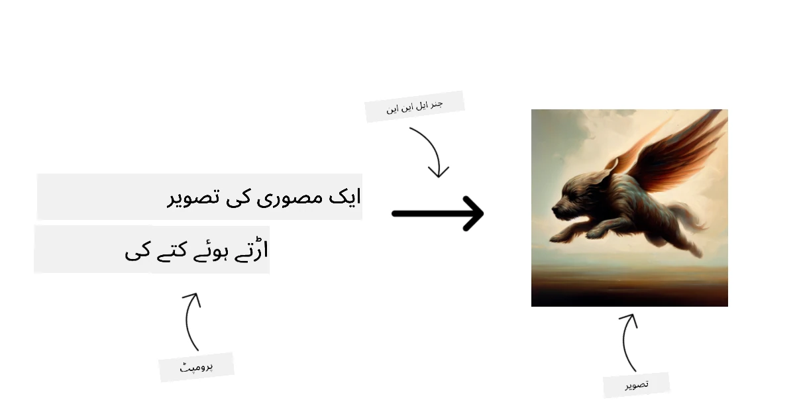

متن اور کوڈ تخلیق کے ماڈلز وہ ماڈلز ہیں جو متن یا کوڈ تیار کرتے ہیں۔ یہ ماڈلز عموماً متن کا خلاصہ، ترجمہ، اور سوال جواب کے لیے استعمال ہوتے ہیں۔ متن تخلیق کے ماڈلز کو بڑی متن کی ڈیٹاسیٹس جیسے [BookCorpus](https://www.cv-foundation.org/openaccess/content_iccv_2015/html/Zhu_Aligning_Books_and_ICCV_2015_paper.html?WT.mc_id=academic-105485-koreyst) پر تربیت دیا جاتا ہے اور انہیں نئے متن تیار کرنے یا سوالات کے جواب دینے کے لیے استعمال کیا جا سکتا ہے۔ کوڈ تخلیق کے ماڈلز، جیسے [CodeParrot](https://huggingface.co/codeparrot?WT.mc_id=academic-105485-koreyst)، کو بڑی کوڈ کی ڈیٹاسیٹس جیسے GitHub پر تربیت دیا گیا ہے اور انہیں نئے کوڈ تیار کرنے یا موجودہ کوڈ میں بگز درست کرنے کے لیے استعمال کیا جا سکتا ہے۔

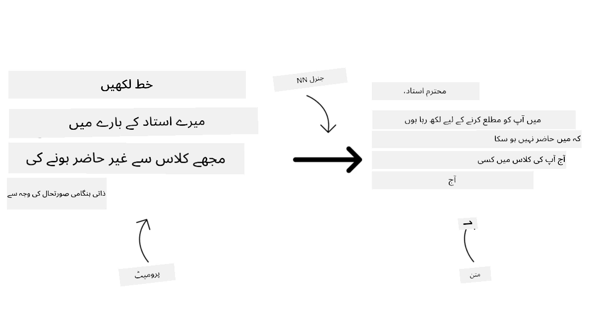

### انکوڈر-ڈیکوڈر بمقابلہ صرف ڈیکوڈر

LLMs کے مختلف فن تعمیر کی بات کرنے کے لیے، آئیے ایک مثال استعمال کرتے ہیں۔

فرض کریں کہ آپ کے مینیجر نے آپ کو طلبہ کے لیے ایک کوئز لکھنے کا کام دیا ہے۔ آپ کے دو ساتھی ہیں؛ ایک مواد بنانے کا ذمہ دار ہے اور دوسرا ان کا جائزہ لینے کا۔

مواد بنانے والا ایک صرف ڈیکوڈر ماڈل کی طرح ہے: وہ موضوع دیکھ سکتا ہے، آپ نے جو کچھ پہلے لکھا ہے اسے دیکھ سکتا ہے، اور پھر اس سیاق و سباق کی بنیاد پر مواد تیار کر سکتا ہے۔ وہ دلچسپ اور معلوماتی مواد لکھنے میں بہت اچھا ہے، لیکن وہ ہمیشہ معلومات کو درجہ بندی، بازیافت، یا انکوڈ کرنے کے کام کے لیے بہترین انتخاب نہیں ہوتا۔ صرف ڈیکوڈر ماڈل خاندانوں کی مثالیں GPT اور Llama ماڈلز ہیں۔

جائزہ لینے والا ایک صرف انکوڈر ماڈل کی طرح ہے، وہ لکھے گئے کورس اور جوابات کو دیکھتا ہے، ان کے تعلق کو نوٹس کرتا ہے اور سیاق و سباق کو سمجھتا ہے، لیکن مواد تیار کرنے میں ماہر نہیں ہے۔ انکوڈر صرف ماڈل کی ایک مثال BERT ہے۔

فرض کریں کہ ہمارے پاس ایک ایسا شخص بھی ہو سکتا ہے جو کوئز تیار کرے اور اس کا جائزہ بھی لے، یہ انکوڈر-ڈیکوڈر ماڈل ہے۔ چند مثالیں BART اور T5 ہیں۔

### سروس بمقابلہ ماڈل

اب، آئیے سروس اور ماڈل کے درمیان فرق پر بات کرتے ہیں۔ سروس ایک مصنوعہ ہے جو کلاؤڈ سروس فراہم کنندہ کی جانب سے پیش کیا جاتا ہے، اور یہ اکثر ماڈلز، ڈیٹا، اور دیگر اجزاء کا مجموعہ ہوتا ہے۔ ماڈل سروس کا بنیادی حصہ ہوتا ہے، اور یہ اکثر فاؤنڈیشن ماڈل ہوتا ہے، جیسے کہ LLM۔

سروسز عموماً پیداواری استعمال کے لیے بہتر کی گئی ہوتی ہیں اور ماڈلز کے مقابلے میں آسانی سے استعمال کی جا سکتی ہیں، اکثر ایک گرافیکل یوزر انٹرفیس کے ذریعے۔ تاہم، سروسز ہمیشہ مفت دستیاب نہیں ہوتیں، اور استعمال کے بدلے سبسکرپشن یا ادائیگی کی ضرورت ہو سکتی ہے، تاکہ سروس مالک کے آلات اور وسائل کا فائدہ اٹھایا جا سکے، اخراجات کو بہتر بنایا جا سکے اور آسان پیمانے پر قابو پایا جا سکے۔ سروس کی ایک مثال [Azure OpenAI Service](https://learn.microsoft.com/azure/ai-foundry/openai/overview?WT.mc_id=academic-105485-koreyst) ہے، جو پے-ایز-یو-گو ریٹ پلان پیش کرتی ہے، یعنی صارفین خدمات کی جتنی مقدار استعمال کرتے ہیں اتنا ہی معاوضہ دیتے ہیں۔ Azure OpenAI Service ماڈلز کی صلاحیتوں کے علاوہ انٹرپرائز گریڈ سیکیورٹی اور ذمہ دار AI فریم ورک بھی فراہم کرتی ہے۔

ماڈلز نیورل نیٹ ورک کے آرٹیفیکٹس ہوتے ہیں: پیرامیٹرز، وزن، فن تعمیر، ٹوکنائزر، اور معاون کنفیگریشن۔ ماڈل کو مقامی یا نجی ماحول میں چلانے کے لیے مناسب ہارڈویئر، سرونگ انفراسٹرکچر، نگرانی، اور یا تو ایک مطابقت پذیر اوپن سورس/اوپن ویٹ لائسنس یا ایک تجارتی لائسنس کی ضرورت ہوتی ہے۔ اوپن ویٹ ماڈلز جیسے Llama 4 یا Mistral ماڈلز خود میزبان ہو سکتے ہیں، لیکن پھر بھی انہیں کمپیوٹیشنل طاقت اور آپریٹنگ مہارت درکار ہوتی ہے۔

## Azure پر کارکردگی کو سمجھنے کے لیے مختلف ماڈلز کے ساتھ جانچ اور تکرار کیسے کریں

جب ہماری ٹیم موجودہ LLMs کے منظرنامے کا جائزہ لے چکی ہو اور ان کے منظرناموں کے لیے کچھ اچھے امیدواروں کی نشاندہی کر چکی ہو، تو اگلا قدم یہ ہے کہ انہیں ان کے ڈیٹا اور ورک لوڈ پر ٹیسٹ کیا جائے۔ یہ ایک تکراری عمل ہے، جو تجربات اور اقدامات کے ذریعے کیا جاتا ہے۔
زیادہ تر ماڈلز جن کا ہم نے پچھلے پیراگرافز میں ذکر کیا ہے (OpenAI ماڈلز، اوپن ویٹ ماڈلز جیسے Llama 4 اور Mistral، اور Hugging Face ماڈلز) [Microsoft Foundry Models](https://learn.microsoft.com/azure/foundry/concepts/foundry-models-overview?WT.mc_id=academic-105485-koreyst) میں دستیاب ہیں۔

[Microsoft Foundry](https://learn.microsoft.com/azure/foundry/what-is-foundry?WT.mc_id=academic-105485-koreyst)، جو سابقہ Azure AI Studio/Azure AI Foundry تھا، ایک متحدہ Azure پلیٹ فارم ہے جو AI ایپس اور ایجنٹس بنانے کے لیے ہے۔ یہ ڈویلپرز کو تجربات اور تشخیص سے لے کر تعیناتی، نگرانی، اور حکمرانی تک کے زندگی کے سائیکل کو منظم کرنے میں مدد دیتا ہے۔ Microsoft Foundry میں ماڈل کیٹلاگ صارف کو یہ مواقع فراہم کرتا ہے:

- کیٹلاگ میں دلچسپی رکھنے والا بنیادی ماڈل تلاش کریں، جس میں Azure کے بیچے جانے والے ماڈلز کے ساتھ ساتھ پارٹنرز اور کمیونٹی فراہم کنندگان کے ماڈلز بھی شامل ہیں۔ صارفین کام، فراہم کنندہ، لائسنس، تعیناتی کے اختیارات، یا نام کے ذریعے فلٹر کر سکتے ہیں۔

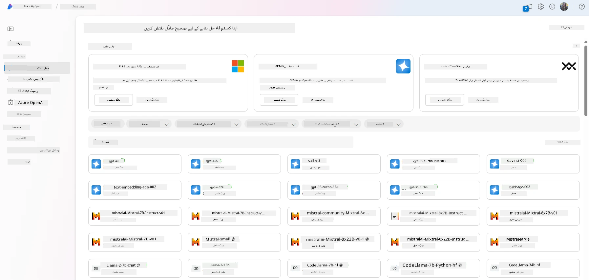

- ماڈل کارڈ کا جائزہ لیں، جس میں مطلوبہ استعمال اور تربیتی ڈیٹا کی تفصیلی وضاحت، کوڈ نمونے، اور اندرونی تشخیص لائبریری پر نتائج شامل ہیں۔

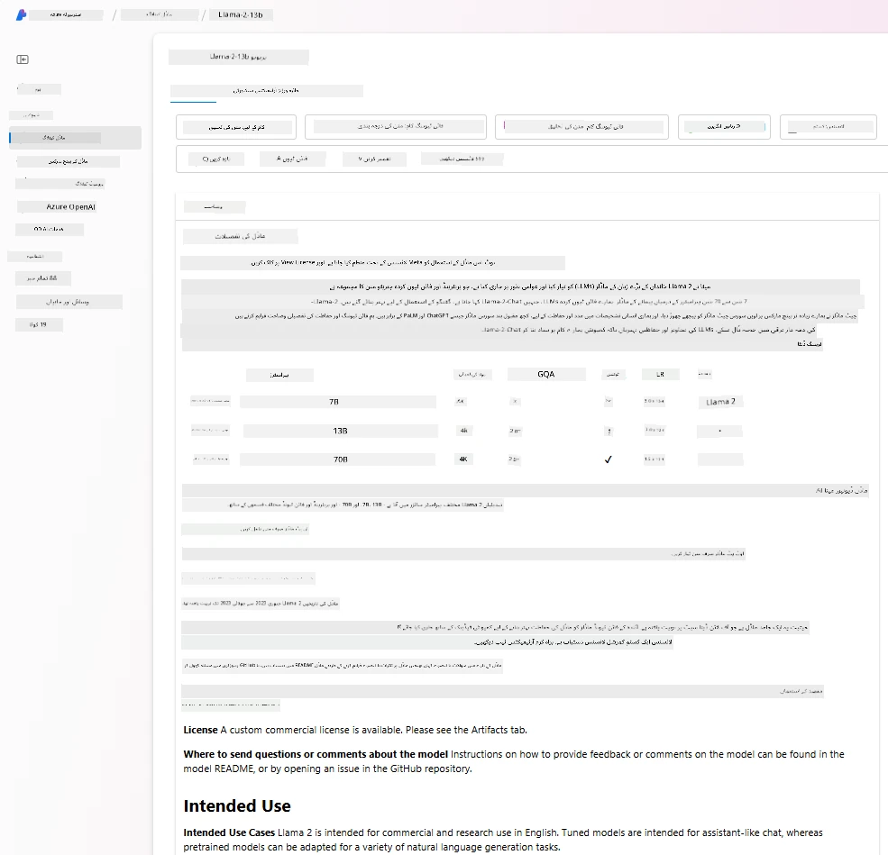

- صنعت میں دستیاب ماڈلز اور ڈیٹا سیٹس کے درمیان بینچ مارکس کا موازنہ کریں تاکہ تعین کیا جا سکے کہ کون سا کاروباری منظرنامے کو پورا کرتا ہے، [Model Benchmarks](https://learn.microsoft.com/azure/ai-foundry/concepts/model-benchmarks?WT.mc_id=academic-105485-koreyst) پین کے ذریعے۔

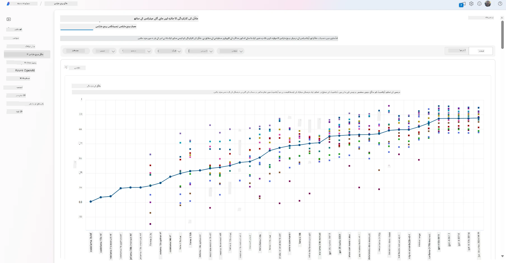

- ماڈلز جنہیں سپورٹ کیا جاتا ہے، انہیں اپنی مرضی کے تربیتی ڈیٹا پر فائن ٹون کریں تاکہ مخصوص ورک لوڈ میں ماڈل کی کارکردگی بہتر ہو، Microsoft Foundry کی تجربات اور ٹریکنگ صلاحیتوں سے فائدہ اٹھاتے ہوئے۔

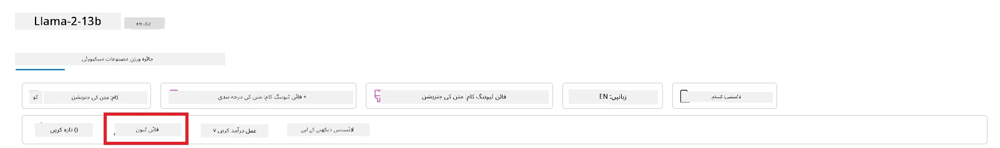

- اصل پیشگی تربیت شدہ ماڈل یا فائن ٹون کیے گئے ورژن کو ایک ریموٹ ریئل ٹائم انفیرینس اینڈپوائنٹ پر تعینات کریں، مینیجڈ کمپیوٹ یا سرورلیس تعیناتی کے اختیارات استعمال کرتے ہوئے، تاکہ ایپلیکیشنز اسے استعمال کر سکیں۔

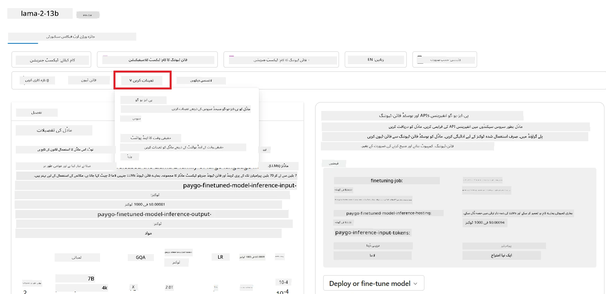

> [!NOTE]
> کیٹلاگ میں موجود تمام ماڈلز فی الحال فائن ٹوننگ اور/یا ادائیگی کے مطابق تعیناتی کے لیے دستیاب نہیں ہیں۔ ماڈل کی صلاحیتوں اور حدود کی تفصیلات کے لیے ماڈل کارڈ چیک کریں۔

## LLM کے نتائج میں بہتری

ہم نے اپنی اسٹارٹ اپ ٹیم کے ساتھ مختلف قسم کے LLMs اور ایک کلاؤڈ پلیٹ فارم (Microsoft Foundry) کا جائزہ لیا ہے جو مختلف ماڈلز کا موازنہ کرنے، انہیں ٹیسٹ ڈیٹا پر جانچنے، کارکردگی بہتر بنانے، اور انہیں انفیرینس اینڈپوائنٹس پر تعینات کرنے کی سہولت دیتا ہے۔

لیکن وہ کب فائن ٹوننگ کرنے پر غور کریں گے بجائے اس کے کہ پہلے سے تربیت یافتہ ماڈل استعمال کریں؟ کیا مخصوص ورک لوڈز پر ماڈل کی کارکردگی بہتر بنانے کے دیگر طریقے بھی ہیں؟

ایک کاروبار کئی طریقے استعمال کر سکتا ہے تاکہ وہ LLM سے مطلوبہ نتائج حاصل کر سکے۔ آپ پروڈکشن میں LLM تعینات کرتے وقت مختلف قسم کے ماڈلز منتخب کر سکتے ہیں جن کی تربیت کی مختلف درجے ہوں، مختلف پیچیدگی، لاگت، اور معیار کے ساتھ۔ یہاں چند مختلف طریقے ہیں:

- **کانٹیکسٹ کے ساتھ پرامپٹ انجینئرنگ**۔ مقصد یہ ہے کہ جب آپ پرامپٹ دیں تو اتنا کانٹیکسٹ فراہم کریں کہ آپ کو مطلوبہ جوابات حاصل ہوں۔

- **ریٹریول آگمینٹڈ جنریشن، RAG**۔ آپ کا ڈیٹا ممکنہ طور پر ڈیٹا بیس یا ویب اینڈپوائنٹ میں موجود ہو سکتا ہے، تاکہ اس ڈیٹا یا اس کے کسی ذیلی حصے کو پرامپٹ کے وقت شامل کیا جا سکے، آپ متعلقہ ڈیٹا حاصل کر کے صارف کے پرامپٹ کا حصہ بنا سکتے ہیں۔

- **فائن ٹونڈ ماڈل**۔ یہاں، آپ نے ماڈل کو اپنے ڈیٹا پر مزید تربیت دی جس کی وجہ سے ماڈل آپ کی ضروریات کے لیے زیادہ دقیق اور جوابدہ بن گیا لیکن یہ مہنگا ہو سکتا ہے۔

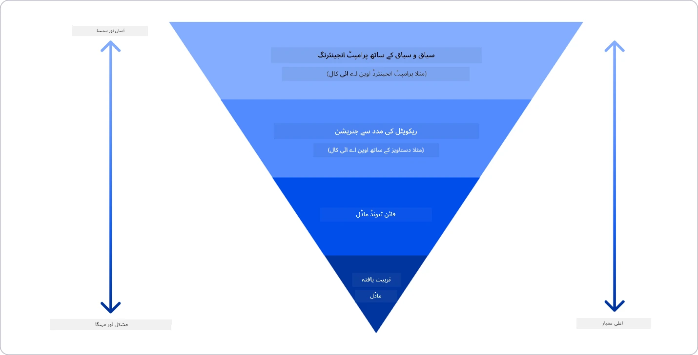

Img source: [Four Ways that Enterprises Deploy LLMs | Fiddler AI Blog](https://www.fiddler.ai/blog/four-ways-that-enterprises-deploy-llms?WT.mc_id=academic-105485-koreyst)

### کانٹیکسٹ کے ساتھ پرامپٹ انجینئرنگ

پیشگی تربیت یافتہ LLMs عمومی قدرتی زبان کے کاموں پر بہت اچھا کام کرتے ہیں، چاہے انہیں مختصر پرامپٹ کے ساتھ بلایا جائے، جیسے مکمل کرنے کے لیے ایک جملہ یا سوال – جسے "زیرو شاٹ" لرننگ کہتے ہیں۔

تاہم، جتنا زیادہ صارف اپنے سوال کو تفصیل کے ساتھ فریم کرے، یعنی کانٹیکسٹ فراہم کرے، اتنا ہی جواب صارف کی توقعات کے قریب اور زیادہ دقیق ہوگا۔ اس صورت میں اگر پرامپٹ میں صرف ایک مثال شامل ہو تو اسے "ون شاٹ" لرننگ کہتے ہیں اور اگر کئی مثالیں شامل ہوں تو "فیو شاٹ" لرننگ کہتے ہیں۔
کانٹیکسٹ کے ساتھ پرامپٹ انجینئرنگ شروع کرنے کے لیے سب سے زیادہ لاگت مؤثر طریقہ ہے۔

### ریٹریول آگمینٹڈ جنریشن (RAG)

LLMs کی یہ حد بندی ہے کہ وہ صرف وہی ڈیٹا استعمال کر سکتے ہیں جو ان کی تربیت کے دوران استعمال ہوا ہو تاکہ جواب تیار کریں۔ اس کا مطلب ہے کہ وہ تربیت کے بعد ہونے والے حقائق سے آگاہ نہیں ہوتے اور غیر عوامی معلومات (جیسے کمپنی کا ڈیٹا) تک ان کی رسائی نہیں ہوتی۔
یہ مسئلہ RAG کے ذریعے حل کیا جا سکتا ہے، جو پرامپٹ میں بیرونی ڈیٹا کے ٹکڑے شامل کرتا ہے، پرامپٹ کی حد کو مدنظر رکھتے ہوئے۔ یہ وییکٹر ڈیٹا بیس ٹولز (جیسے [Azure Vector Search](https://learn.microsoft.com/azure/search/vector-search-overview?WT.mc_id=academic-105485-koreyst)) کی مدد سے ممکن ہے جو مختلف پیشگی تعین شدہ ڈیٹا ذرائع سے مفید ٹکڑے حاصل کر کے انہیں پرامپٹ کانٹیکسٹ میں شامل کرتے ہیں۔

یہ تکنیک اس وقت بہت مددگار ہوتی ہے جب کاروبار کے پاس کافی ڈیٹا، وقت، یا وسائل نہ ہوں کہ وہ LLM کو فائن ٹون کرے، مگر پھر بھی کسی مخصوص ورک لوڈ پر کارکردگی بہتر کرنا چاہتا ہو اور ہیلوسینیٹڈ، پرانا یا غیر معاون جوابات سے بچاؤ کرنا چاہتا ہو۔

### فائن ٹونڈ ماڈل

فائن ٹوننگ ایک ایسا عمل ہے جو ٹرانسفر لرننگ سے فائدہ اٹھا کر ماڈل کو کسی نیچے آنے والے کام یا مخصوص مسئلے کے لیے ‘ایڈاپٹ’ کرتا ہے۔ فیو شاٹ لرننگ اور RAG سے مختلف یہ ہے کہ اس سے ایک نیا ماڈل تیار ہوتا ہے جس کے وزن اور میلان تازہ کیے جاتے ہیں۔ اس کے لیے ایک تربیتی مثالوں کا سیٹ ہونا چاہیے جس میں ایک ان پٹ (پرامپٹ) اور اس کا متعلقہ آؤٹ پٹ (کمیپلیشن) ہو۔
اگر:

- **چھوٹے مخصوص کام کے ماڈلز استعمال کرنا**۔ کاروبار چاہے گا کہ وہ ایک چھوٹے ماڈل کو کسی مخصوص کام کے لیے فائن ٹون کرے بجائے یہ کہ بار بار بڑے فرنٹیئر ماڈل کو پرامپٹ کرے، جو کہ زیادہ لاگت مؤثر اور تیز حل ہوگا۔

- **لیٹنسی کا خیال رکھنا**۔ لیٹنسی کسی مخصوص استعمال کے لیے اہم ہے، اس لیے طویل پرامپٹ یا ماڈل سے سیکھنے کے لیے زیادہ مثالیں شامل کرنا ممکن نہیں یا پرامپٹ کی حد میں نہیں آتی۔

- **مستحکم رویے کو ایڈاپٹ کرنا**۔ کاروبار کے پاس بہت سارے اعلیٰ معیار کی مثالیں ہیں اور وہ چاہتا ہے کہ ماڈل مستقل طور پر کسی کام کے نمونے، آؤٹ پٹ فارمیٹ، لہجے، یا مخصوص ڈومین طرز کی پیروی کرے۔ اگر بنیادی مسئلہ تازہ حقائق یا پرائیویٹ معلومات کا بار بار بدلنا ہے، تو صرف فائن ٹوننگ پر انحصار کرنے کے بجائے RAG کا استعمال کریں۔

### تربیت یافتہ ماڈل

LLM کو شروع سے تربیت دینا بلاشبہ سب سے مشکل اور پیچیدہ طریقہ ہے، جس کے لیے وسیع مقدار میں ڈیٹا، ماہر وسائل، اور مناسب کمپیوٹیشنل طاقت کی ضرورت ہوتی ہے۔ یہ انتخاب صرف اس صورت میں کرنا چاہیے جب کاروبار کے پاس مخصوص ڈومین کا استعمال اور بڑی مقدار میں ڈومین سے متعلق ڈیٹا ہو۔

## علم کی جانچ

LLM کی تکمیل کے نتائج کو بہتر بنانے کے لیے کون سا طریقہ اچھا ہو سکتا ہے؟

1. کانٹیکسٹ کے ساتھ پرامپٹ انجینئرنگ
1. RAG
1. فائن ٹونڈ ماڈل

جواب: تینوں مدد کر سکتے ہیں۔ فوری بہتری کے لیے کانٹیکسٹ کے ساتھ پرامپٹ انجینئرنگ سے شروع کریں، اور جب ماڈل کو تازہ حقائق یا نجی کاروباری معلومات کی ضرورت ہو تو RAG استعمال کریں۔ جب آپ کے پاس کافی اعلیٰ معیار کی مثالیں ہوں اور ماڈل کو مسلسل کسی کام، فارمیٹ، لہجے، یا ڈومین نمونے کی پیروی کرنی ہو تو فائن ٹوننگ منتخب کریں۔

## 🚀 چیلنج

اپنے کاروبار کے لیے [RAG کا استعمال](https://learn.microsoft.com/azure/search/retrieval-augmented-generation-overview?WT.mc_id=academic-105485-koreyst) کیسے کر سکتے ہیں، اس پر مزید پڑھیں۔

## زبردست کام، اپنی تعلیم جاری رکھیں

اس سبق مکمل کرنے کے بعد، ہماری [Generative AI Learning collection](https://aka.ms/genai-collection?WT.mc_id=academic-105485-koreyst) کو دیکھیں تاکہ اپنی Generative AI معلومات کو مزید بڑھائیں!

سبق 3 پر جائیں جہاں ہم دیکھیں گے کہ [Generative AI کو ذمہ داری سے کیسے تعمیر کیا جائے](../03-using-generative-ai-responsibly/README.md?WT.mc_id=academic-105485-koreyst)!

---

<!-- CO-OP TRANSLATOR DISCLAIMER START -->
**ڈس کلیمر**:
یہ دستاویز AI ترجمہ سروس [Co-op Translator](https://github.com/Azure/co-op-translator) کے ذریعے ترجمہ کی گئی ہے۔ جبکہ ہم درستگی کے لیے کوشاں ہیں، براہ کرم اس بات سے آگاہ رہیں کہ خودکار ترجمے میں غلطیاں یا عدم درستیاں ہو سکتی ہیں۔ اصل دستاویز اپنے مادری زبان میں مستند ماخذ سمجھی جائے گی۔ حساس معلومات کے لیے پیشہ ور انسانی ترجمہ کی سفارش کی جاتی ہے۔ اس ترجمے کے استعمال سے پیدا ہونے والی کسی بھی غلط فہمی یا غلط تشریح کی ذمہ داری ہم قبول نہیں کرتے۔
<!-- CO-OP TRANSLATOR DISCLAIMER END -->