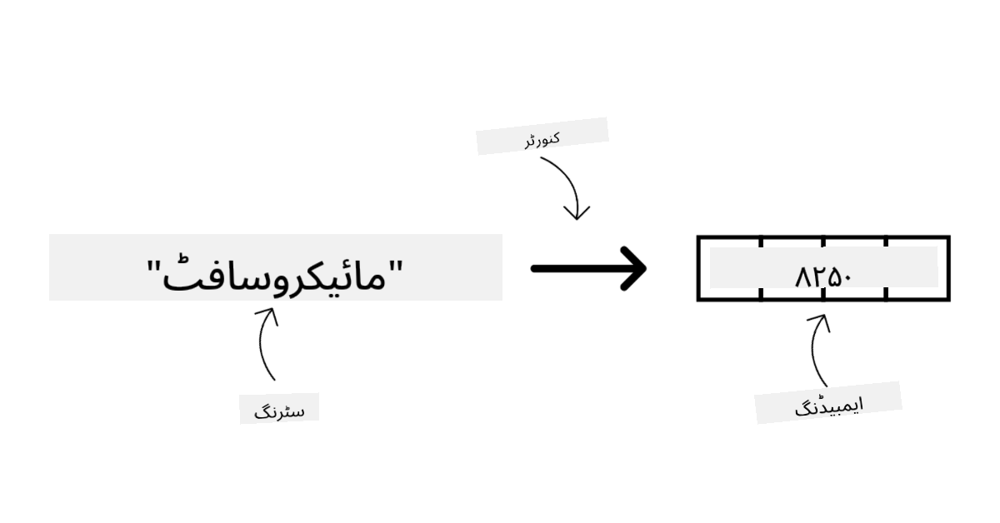
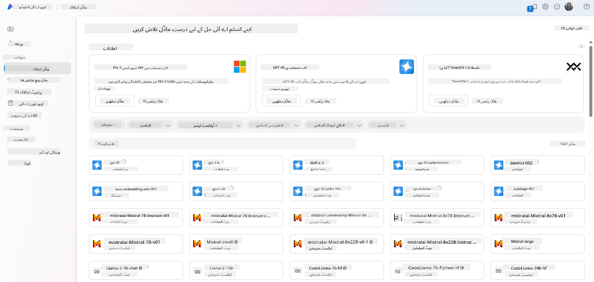
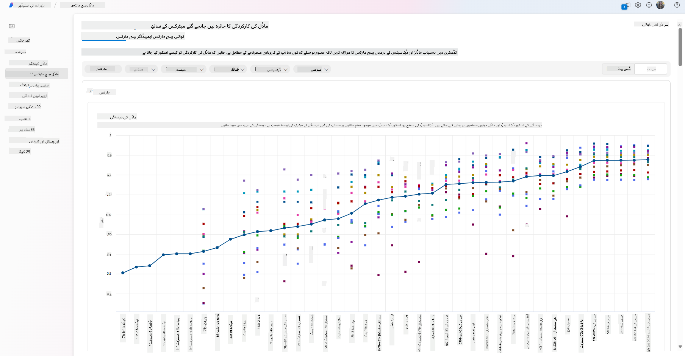
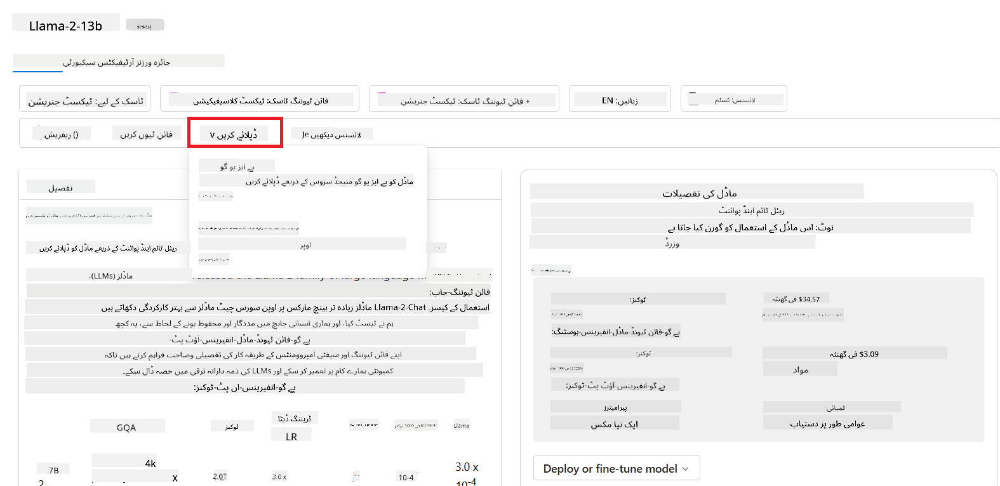

<!--
CO_OP_TRANSLATOR_METADATA:
{
  "original_hash": "e2f686f2eb794941761252ac5e8e090b",
  "translation_date": "2025-07-09T08:11:52+00:00",
  "source_file": "02-exploring-and-comparing-different-llms/README.md",
  "language_code": "ur"
}
-->
# مختلف LLMs کی تلاش اور موازنہ

> _اس سبق کی ویڈیو دیکھنے کے لیے اوپر تصویر پر کلک کریں_

پچھلے سبق میں، ہم نے دیکھا کہ Generative AI کس طرح ٹیکنالوجی کے منظرنامے کو بدل رہا ہے، Large Language Models (LLMs) کیسے کام کرتے ہیں اور ایک کاروبار - جیسے ہمارا اسٹارٹ اپ - انہیں اپنے استعمال کے کیسز میں کیسے لاگو کر کے ترقی کر سکتا ہے! اس باب میں، ہم مختلف قسم کے بڑے زبان کے ماڈلز (LLMs) کا موازنہ اور تقابل کریں گے تاکہ ان کے فوائد اور نقصانات کو سمجھ سکیں۔

ہمارے اسٹارٹ اپ کے سفر کا اگلا قدم LLMs کے موجودہ منظرنامے کو تلاش کرنا اور یہ سمجھنا ہے کہ کون سے ماڈلز ہمارے استعمال کے کیس کے لیے موزوں ہیں۔

## تعارف

یہ سبق درج ذیل موضوعات پر مشتمل ہوگا:

- موجودہ منظرنامے میں مختلف قسم کے LLMs۔
- Azure میں اپنے استعمال کے کیس کے لیے مختلف ماڈلز کی جانچ، تکرار، اور موازنہ۔
- LLM کو کیسے تعینات کیا جائے۔

## سیکھنے کے مقاصد

اس سبق کو مکمل کرنے کے بعد، آپ قابل ہوں گے کہ:

- اپنے استعمال کے کیس کے لیے درست ماڈل منتخب کریں۔
- سمجھیں کہ ماڈل کی کارکردگی کو کیسے جانچا، بہتر بنایا اور تکرار کیا جائے۔
- جانیں کہ کاروبار ماڈلز کو کیسے تعینات کرتے ہیں۔

## مختلف قسم کے LLMs کو سمجھنا

LLMs کو ان کی ساخت، تربیتی ڈیٹا، اور استعمال کے کیس کی بنیاد پر مختلف طریقوں سے درجہ بندی کیا جا سکتا ہے۔ ان اختلافات کو سمجھنا ہمارے اسٹارٹ اپ کو صحیح ماڈل منتخب کرنے، جانچنے، تکرار کرنے اور کارکردگی بہتر بنانے میں مدد دے گا۔

LLM ماڈلز کی کئی اقسام ہیں، اور آپ کا ماڈل کا انتخاب اس بات پر منحصر ہے کہ آپ انہیں کس مقصد کے لیے استعمال کرنا چاہتے ہیں، آپ کا ڈیٹا کیسا ہے، آپ کتنی ادائیگی کے لیے تیار ہیں، اور دیگر عوامل۔

اگر آپ ماڈلز کو متن، آڈیو، ویڈیو، تصویر کی تخلیق وغیرہ کے لیے استعمال کرنا چاہتے ہیں، تو آپ مختلف قسم کے ماڈلز کا انتخاب کر سکتے ہیں۔

- **آڈیو اور تقریر کی شناخت**۔ اس مقصد کے لیے Whisper قسم کے ماڈلز بہترین انتخاب ہیں کیونکہ یہ عام مقصد کے لیے ہیں اور تقریر کی شناخت پر مرکوز ہیں۔ یہ متنوع آڈیو پر تربیت یافتہ ہیں اور کثیر لسانی تقریر کی شناخت کر سکتے ہیں۔ [Whisper قسم کے ماڈلز کے بارے میں مزید جانیں](https://platform.openai.com/docs/models/whisper?WT.mc_id=academic-105485-koreyst)۔

- **تصویر کی تخلیق**۔ تصویر بنانے کے لیے DALL-E اور Midjourney دو معروف انتخاب ہیں۔ DALL-E Azure OpenAI کی طرف سے فراہم کیا جاتا ہے۔ [DALL-E کے بارے میں مزید پڑھیں](https://platform.openai.com/docs/models/dall-e?WT.mc_id=academic-105485-koreyst) اور اس نصاب کے باب 9 میں بھی۔

- **متن کی تخلیق**۔ زیادہ تر ماڈلز متن کی تخلیق کے لیے تربیت یافتہ ہیں اور آپ کے پاس GPT-3.5 سے لے کر GPT-4 تک وسیع انتخاب موجود ہے۔ ان کی قیمتیں مختلف ہوتی ہیں، GPT-4 سب سے مہنگا ہے۔ [Azure OpenAI playground](https://oai.azure.com/portal/playground?WT.mc_id=academic-105485-koreyst) میں جا کر آپ اپنی ضروریات کے مطابق صلاحیت اور قیمت کے لحاظ سے بہترین ماڈل کا انتخاب کر سکتے ہیں۔

- **کثیر النوعیت**۔ اگر آپ ان پٹ اور آؤٹ پٹ میں مختلف قسم کے ڈیٹا کو سنبھالنا چاہتے ہیں، تو آپ کو [gpt-4 turbo with vision یا gpt-4o](https://learn.microsoft.com/azure/ai-services/openai/concepts/models#gpt-4-and-gpt-4-turbo-models?WT.mc_id=academic-105485-koreyst) جیسے ماڈلز دیکھنے چاہئیں — جو OpenAI کے تازہ ترین ماڈلز ہیں — جو قدرتی زبان کی پروسیسنگ کو بصری سمجھ کے ساتھ جوڑنے کی صلاحیت رکھتے ہیں، اور کثیر النوع انٹرفیس کے ذریعے تعاملات ممکن بناتے ہیں۔

ماڈل کا انتخاب کرنے کا مطلب ہے کہ آپ کو کچھ بنیادی صلاحیتیں ملتی ہیں، جو اکثر کافی نہیں ہوتیں۔ اکثر کمپنی کے مخصوص ڈیٹا کو آپ کو کسی نہ کسی طرح LLM کو بتانا ہوتا ہے۔ اس کے لیے مختلف طریقے موجود ہیں، جن پر اگلے حصوں میں بات کی جائے گی۔

### Foundation Models بمقابلہ LLMs

اصطلاح Foundation Model کو [Stanford کے محققین نے متعارف کروایا](https://arxiv.org/abs/2108.07258?WT.mc_id=academic-105485-koreyst) اور اسے ایسے AI ماڈل کے طور پر بیان کیا گیا جو درج ذیل خصوصیات رکھتا ہے:

- **یہ بغیر نگرانی یا خود نگرانی کی تربیت سے تیار کیے جاتے ہیں**، یعنی یہ بغیر لیبل والے کثیر النوع ڈیٹا پر تربیت یافتہ ہوتے ہیں اور ان کی تربیت کے لیے انسانی تشریح یا لیبلنگ کی ضرورت نہیں ہوتی۔
- **یہ بہت بڑے ماڈلز ہوتے ہیں**، جو اربوں پیرامیٹرز پر مبنی گہرے نیورل نیٹ ورکس پر تربیت یافتہ ہوتے ہیں۔
- **یہ عام طور پر دوسرے ماڈلز کے لیے ‘بنیاد’ کے طور پر کام کرتے ہیں**، یعنی انہیں دوسرے ماڈلز کی بنیاد کے طور پر استعمال کیا جا سکتا ہے، جنہیں بعد میں fine-tuning کے ذریعے بہتر بنایا جا سکتا ہے۔

تصویر کا ماخذ: [Essential Guide to Foundation Models and Large Language Models | by Babar M Bhatti | Medium](https://thebabar.medium.com/essential-guide-to-foundation-models-and-large-language-models-27dab58f7404)

اس فرق کو مزید واضح کرنے کے لیے، ChatGPT کی مثال لیتے ہیں۔ ChatGPT کا پہلا ورژن بنانے کے لیے، GPT-3.5 ماڈل کو foundation model کے طور پر استعمال کیا گیا۔ اس کا مطلب ہے کہ OpenAI نے کچھ چیٹ مخصوص ڈیٹا استعمال کر کے GPT-3.5 کا ایک خاص ورژن تیار کیا جو بات چیت کے منظرناموں میں بہتر کارکردگی دکھاتا ہے، جیسے چیٹ بوٹس۔

تصویر کا ماخذ: [2108.07258.pdf (arxiv.org)](https://arxiv.org/pdf/2108.07258.pdf?WT.mc_id=academic-105485-koreyst)

### Open Source بمقابلہ Proprietary Models

LLMs کی ایک اور درجہ بندی یہ ہے کہ وہ اوپن سورس ہیں یا پروپرائٹری۔

اوپن سورس ماڈلز وہ ماڈلز ہوتے ہیں جو عوام کے لیے دستیاب ہوتے ہیں اور کوئی بھی انہیں استعمال کر سکتا ہے۔ یہ اکثر ان کمپنیوں یا تحقیقاتی کمیونٹی کی طرف سے فراہم کیے جاتے ہیں جنہوں نے انہیں بنایا ہوتا ہے۔ ان ماڈلز کو جانچا، تبدیل کیا اور مختلف استعمال کے کیسز کے لیے حسب ضرورت بنایا جا سکتا ہے۔ تاہم، یہ ہمیشہ پروڈکشن کے لیے بہتر نہیں ہوتے اور پروپرائٹری ماڈلز جتنے موثر نہیں ہوتے۔ اوپن سورس ماڈلز کے لیے فنڈنگ محدود ہو سکتی ہے، اور یہ طویل مدت تک برقرار نہیں رکھے جاتے یا جدید تحقیق کے مطابق اپ ڈیٹ نہیں ہوتے۔ مشہور اوپن سورس ماڈلز کی مثالیں ہیں [Alpaca](https://crfm.stanford.edu/2023/03/13/alpaca.html?WT.mc_id=academic-105485-koreyst)، [Bloom](https://huggingface.co/bigscience/bloom) اور [LLaMA](https://llama.meta.com)۔

پروپرائٹری ماڈلز وہ ماڈلز ہوتے ہیں جو کسی کمپنی کے ملکیت ہوتے ہیں اور عوام کے لیے دستیاب نہیں ہوتے۔ یہ ماڈلز عام طور پر پروڈکشن کے لیے بہتر بنائے جاتے ہیں۔ تاہم، انہیں جانچنا، تبدیل کرنا یا مختلف استعمال کے لیے حسب ضرورت بنانا ممکن نہیں ہوتا۔ یہ ہمیشہ مفت نہیں ہوتے اور استعمال کے لیے سبسکرپشن یا ادائیگی کی ضرورت ہو سکتی ہے۔ صارفین کو اس ڈیٹا پر کنٹرول نہیں ہوتا جس پر ماڈل تربیت یافتہ ہوتا ہے، اس لیے انہیں ماڈل کے مالک پر ڈیٹا کی پرائیویسی اور AI کے ذمہ دارانہ استعمال کی ذمہ داری چھوڑنی پڑتی ہے۔ مشہور پروپرائٹری ماڈلز کی مثالیں ہیں [OpenAI models](https://platform.openai.com/docs/models/overview?WT.mc_id=academic-105485-koreyst)، [Google Bard](https://sapling.ai/llm/bard?WT.mc_id=academic-105485-koreyst) اور [Claude 2](https://www.anthropic.com/index/claude-2?WT.mc_id=academic-105485-koreyst)۔

### Embedding بمقابلہ Image generation بمقابلہ Text and Code generation

LLMs کو ان کے پیدا کردہ آؤٹ پٹ کی بنیاد پر بھی درجہ بند کیا جا سکتا ہے۔

Embedding ماڈلز ایسے ماڈلز ہوتے ہیں جو متن کو ایک عددی شکل میں تبدیل کرتے ہیں، جسے embedding کہتے ہیں، جو ان پٹ متن کی عددی نمائندگی ہوتی ہے۔ Embeddings مشینوں کے لیے الفاظ یا جملوں کے درمیان تعلقات کو سمجھنا آسان بناتے ہیں اور انہیں دوسرے ماڈلز جیسے classification یا clustering ماڈلز کے ان پٹ کے طور پر استعمال کیا جا سکتا ہے جو عددی ڈیٹا پر بہتر کارکردگی دکھاتے ہیں۔ Embedding ماڈلز اکثر transfer learning کے لیے استعمال ہوتے ہیں، جہاں ایک ماڈل کو ایک ایسے کام کے لیے بنایا جاتا ہے جس کے لیے ڈیٹا کی بہتات ہوتی ہے، اور پھر ماڈل کے وزن (embeddings) کو دوسرے نیچے کے کاموں کے لیے دوبارہ استعمال کیا جاتا ہے۔ اس زمرے کی مثال [OpenAI embeddings](https://platform.openai.com/docs/models/embeddings?WT.mc_id=academic-105485-koreyst) ہے۔

تصویر کی تخلیق کے ماڈلز وہ ماڈلز ہیں جو تصاویر بناتے ہیں۔ یہ ماڈلز اکثر تصویر کی تدوین، تصویر کی ترکیب، اور تصویر کی ترجمہ کاری کے لیے استعمال ہوتے ہیں۔ تصویر کی تخلیق کے ماڈلز کو بڑے تصویری ڈیٹا سیٹس جیسے [LAION-5B](https://laion.ai/blog/laion-5b/?WT.mc_id=academic-105485-koreyst) پر تربیت دی جاتی ہے، اور یہ نئی تصاویر بنانے یا موجودہ تصاویر میں inpainting، super-resolution، اور colorization تکنیکوں کے ذریعے ترمیم کرنے کے لیے استعمال ہوتے ہیں۔ مثالوں میں [DALL-E-3](https://openai.com/dall-e-3?WT.mc_id=academic-105485-koreyst) اور [Stable Diffusion models](https://github.com/Stability-AI/StableDiffusion?WT.mc_id=academic-105485-koreyst) شامل ہیں۔

متن اور کوڈ کی تخلیق کے ماڈلز وہ ماڈلز ہیں جو متن یا کوڈ بناتے ہیں۔ یہ ماڈلز اکثر متن کا خلاصہ، ترجمہ، اور سوالات کے جواب دینے کے لیے استعمال ہوتے ہیں۔ متن کی تخلیق کے ماڈلز کو بڑے متن کے ڈیٹا سیٹس جیسے [BookCorpus](https://www.cv-foundation.org/openaccess/content_iccv_2015/html/Zhu_Aligning_Books_and_ICCV_2015_paper.html?WT.mc_id=academic-105485-koreyst) پر تربیت دی جاتی ہے، اور یہ نیا متن بنانے یا سوالات کے جواب دینے کے لیے استعمال ہوتے ہیں۔ کوڈ کی تخلیق کے ماڈلز، جیسے [CodeParrot](https://huggingface.co/codeparrot?WT.mc_id=academic-105485-koreyst)، کو بڑے کوڈ کے ڈیٹا سیٹس جیسے GitHub پر تربیت دی جاتی ہے، اور یہ نیا کوڈ بنانے یا موجودہ کوڈ میں بگز ٹھیک کرنے کے لیے استعمال ہوتے ہیں۔

### Encoder-Decoder بمقابلہ Decoder-only

LLMs کی مختلف ساختوں کے بارے میں بات کرنے کے لیے، ایک مثال لیتے ہیں۔

فرض کریں آپ کے مینیجر نے آپ کو طلباء کے لیے ایک کوئز لکھنے کا کام دیا ہے۔ آپ کے دو ساتھی ہیں؛ ایک مواد تیار کرتا ہے اور دوسرا اس کا جائزہ لیتا ہے۔

مواد تیار کرنے والا ایک Decoder-only ماڈل کی طرح ہے، جو موضوع دیکھ کر جو آپ نے پہلے لکھا ہے اسے دیکھتا ہے اور پھر اس کی بنیاد پر مواد لکھتا ہے۔ یہ دلچسپ اور معلوماتی مواد لکھنے میں ماہر ہوتا ہے، لیکن موضوع اور سیکھنے کے مقاصد کو سمجھنے میں اتنا اچھا نہیں ہوتا۔ Decoder ماڈلز کی مثال GPT فیملی کے ماڈلز ہیں، جیسے GPT-3۔

جائزہ لینے والا ایک Encoder-only ماڈل کی طرح ہے، جو لکھے گئے مواد اور جوابات کو دیکھتا ہے، ان کے تعلقات کو نوٹ کرتا ہے اور سیاق و سباق کو سمجھتا ہے، لیکن مواد تخلیق کرنے میں ماہر نہیں ہوتا۔ Encoder-only ماڈل کی مثال BERT ہے۔

اب فرض کریں کہ ہمارے پاس کوئی ایسا بھی ہو جو کوئز کو تیار بھی کرے اور جائزہ بھی لے، یہ Encoder-Decoder ماڈل ہوگا۔ اس کی مثالیں BART اور T5 ہیں۔

### سروس بمقابلہ ماڈل

اب، سروس اور ماڈل کے فرق پر بات کرتے ہیں۔ سروس ایک پروڈکٹ ہے جو کلاؤڈ سروس فراہم کنندہ کی طرف سے پیش کی جاتی ہے، اور یہ اکثر ماڈلز، ڈیٹا، اور دیگر اجزاء کا مجموعہ ہوتی ہے۔ ماڈل سروس کا بنیادی جزو ہوتا ہے، اور یہ عام طور پر foundation model ہوتا ہے، جیسے LLM۔

سروسز عام طور پر پروڈکشن کے لیے بہتر بنائی جاتی ہیں اور ماڈلز کے مقابلے میں استعمال میں آسان ہوتی ہیں، اکثر گرافیکل یوزر انٹرفیس کے ذریعے۔ تاہم، سروسز ہمیشہ مفت نہیں ہوتیں، اور استعمال کے لیے سبسکرپشن یا ادائیگی کی ضرورت ہو سکتی ہے، جس کے بدلے صارفین سروس کے مالک کے آلات اور وسائل استعمال کرتے ہیں، اخراجات کو بہتر بناتے ہیں اور آسانی سے اسکیل کر سکتے ہیں۔ ایک مثال [Azure OpenAI Service](https://learn.microsoft.com/azure/ai-services/openai/overview?WT.mc_id=academic-105485-koreyst) ہے، جو pay-as-you-go ریٹ پلان پیش کرتا ہے، یعنی صارفین کو صرف اتنا ہی چارج کیا جاتا ہے جتنا وہ سروس استعمال کرتے ہیں۔ اس کے علاوہ، Azure OpenAI Service ماڈلز کی صلاحیتوں کے اوپر انٹرپرائز گریڈ سیکیورٹی اور ذمہ دار AI فریم ورک فراہم کرتا ہے۔

ماڈلز صرف نیورل نیٹ ورک ہوتے ہیں، جن میں پیرامیٹرز، وزن، اور دیگر چیزیں شامل ہوتی ہیں۔ کمپنیوں کو یہ لوکل چلانے کی اجازت دیتے ہیں، لیکن اس کے لیے انہیں آلات خریدنے، اسکیل کرنے کے لیے ڈھانچہ بنانے، اور لائسنس خریدنے یا اوپن سورس ماڈل استعمال کرنے کی ضرورت ہوتی ہے۔ LLaMA جیسے ماڈل دستیاب ہیں، جنہیں چلانے کے لیے کمپیوٹیشنل پاور درکار ہوتی ہے۔

## Azure پر مختلف ماڈلز کے ساتھ کارکردگی کو جانچنے اور تکرار کرنے کا طریقہ

جب ہماری ٹیم نے موجودہ LLMs کے منظرنامے کو تلاش کر لیا اور اپنے منظرناموں کے لیے کچھ اچھے امیدوار منتخب کر لیے، تو اگلا قدم انہیں اپنے ڈیٹا اور ورک لوڈ پر جانچنا ہے۔ یہ ایک تکراری عمل ہے، جو تجربات اور پیمائشوں کے ذریعے کیا جاتا ہے۔
زیادہ تر ماڈلز جن کا ہم نے پچھلے پیراگرافز میں ذکر کیا ہے (OpenAI ماڈلز، اوپن سورس ماڈلز جیسے Llama2، اور Hugging Face ٹرانسفارمرز) [Model Catalog](https://learn.microsoft.com/azure/ai-studio/how-to/model-catalog-overview?WT.mc_id=academic-105485-koreyst) میں [Azure AI Studio](https://ai.azure.com/?WT.mc_id=academic-105485-koreyst) میں دستیاب ہیں۔

[Azure AI Studio](https://learn.microsoft.com/azure/ai-studio/what-is-ai-studio?WT.mc_id=academic-105485-koreyst) ایک کلاؤڈ پلیٹ فارم ہے جو ڈویلپرز کے لیے ڈیزائن کیا گیا ہے تاکہ وہ جنریٹو AI ایپلیکیشنز بنا سکیں اور پورے ڈیولپمنٹ لائف سائیکل کو منظم کر سکیں - تجربات سے لے کر جائزہ تک - تمام Azure AI سروسز کو ایک ہی ہب میں آسان GUI کے ساتھ یکجا کر کے۔ Azure AI Studio میں Model Catalog صارف کو یہ سہولیات فراہم کرتا ہے:

- کیٹلاگ میں دلچسپی کا Foundation Model تلاش کریں - چاہے وہ پروپرائٹری ہو یا اوپن سورس، ٹاسک، لائسنس، یا نام کے حساب سے فلٹر کر کے۔ تلاش کو بہتر بنانے کے لیے ماڈلز کو کلیکشنز میں منظم کیا گیا ہے، جیسے Azure OpenAI کلیکشن، Hugging Face کلیکشن، اور دیگر۔

- ماڈل کارڈ کا جائزہ لیں، جس میں متوقع استعمال اور تربیتی ڈیٹا کی تفصیلی وضاحت، کوڈ کے نمونے، اور اندرونی جائزہ لائبریری پر تشخیصی نتائج شامل ہیں۔

- صنعت میں دستیاب ماڈلز اور ڈیٹا سیٹس کے درمیان بینچ مارکس کا موازنہ کریں تاکہ یہ جانچا جا سکے کہ کون سا ماڈل کاروباری منظرنامے کے لیے موزوں ہے، [Model Benchmarks](https://learn.microsoft.com/azure/ai-studio/how-to/model-benchmarks?WT.mc_id=academic-105485-koreyst) پین کے ذریعے۔

- مخصوص ورک لوڈ میں ماڈل کی کارکردگی بہتر بنانے کے لیے اپنی مرضی کے مطابق تربیتی ڈیٹا پر ماڈل کو Fine-tune کریں، Azure AI Studio کی تجرباتی اور ٹریکنگ صلاحیتوں کا فائدہ اٹھاتے ہوئے۔

- اصل پری ٹرینڈ ماڈل یا Fine-tuned ورژن کو ریموٹ ریئل ٹائم انفیرنس - managed compute - یا serverless API endpoint - [pay-as-you-go](https://learn.microsoft.com/azure/ai-studio/how-to/model-catalog-overview#model-deployment-managed-compute-and-serverless-api-pay-as-you-go?WT.mc_id=academic-105485-koreyst) - پر تعینات کریں تاکہ ایپلیکیشنز اسے استعمال کر سکیں۔

> [!NOTE]
> کیٹلاگ میں موجود تمام ماڈلز فی الحال Fine-tuning اور/یا pay-as-you-go تعیناتی کے لیے دستیاب نہیں ہیں۔ ماڈل کی صلاحیتوں اور حدود کے بارے میں تفصیلات کے لیے ماڈل کارڈ چیک کریں۔

## LLM کے نتائج کو بہتر بنانا

ہم نے اپنی اسٹارٹ اپ ٹیم کے ساتھ مختلف قسم کے LLMs اور ایک کلاؤڈ پلیٹ فارم (Azure Machine Learning) کا جائزہ لیا ہے جو ہمیں مختلف ماڈلز کا موازنہ کرنے، ٹیسٹ ڈیٹا پر ان کا جائزہ لینے، کارکردگی بہتر بنانے، اور انہیں انفیرنس اینڈ پوائنٹس پر تعینات کرنے کی سہولت دیتا ہے۔

لیکن کب انہیں پری ٹرینڈ ماڈل کے بجائے ماڈل کو Fine-tune کرنے پر غور کرنا چاہیے؟ کیا ماڈل کی کارکردگی کو مخصوص ورک لوڈز پر بہتر بنانے کے لیے دیگر طریقے بھی موجود ہیں؟

کاروبار کے پاس LLM سے مطلوبہ نتائج حاصل کرنے کے لیے کئی طریقے ہوتے ہیں۔ آپ پروڈکشن میں LLM تعینات کرتے وقت مختلف قسم کے ماڈلز منتخب کر سکتے ہیں جن کی تربیت کی مختلف سطحیں ہوں، مختلف پیچیدگی، لاگت، اور معیار کے ساتھ۔ یہاں کچھ مختلف طریقے دیے گئے ہیں:

- **سیاق و سباق کے ساتھ پرامپٹ انجینئرنگ**۔ مقصد یہ ہے کہ پرامپٹ دیتے وقت اتنا سیاق و سباق فراہم کیا جائے کہ مطلوبہ جوابات مل سکیں۔

- **Retrieval Augmented Generation، RAG**۔ آپ کا ڈیٹا مثلاً کسی ڈیٹا بیس یا ویب اینڈ پوائنٹ میں موجود ہو سکتا ہے، تاکہ اس ڈیٹا یا اس کے کسی حصے کو پرامپٹ کے وقت شامل کیا جا سکے، آپ متعلقہ ڈیٹا حاصل کر کے اسے صارف کے پرامپٹ کا حصہ بنا سکتے ہیں۔

- **Fine-tuned ماڈل**۔ یہاں، آپ نے ماڈل کو اپنی ڈیٹا پر مزید تربیت دی ہے جس سے ماڈل آپ کی ضروریات کے لیے زیادہ درست اور جوابدہ ہو گیا ہے، لیکن یہ مہنگا ہو سکتا ہے۔

تصویر کا ماخذ: [Four Ways that Enterprises Deploy LLMs | Fiddler AI Blog](https://www.fiddler.ai/blog/four-ways-that-enterprises-deploy-llms?WT.mc_id=academic-105485-koreyst)

### سیاق و سباق کے ساتھ پرامپٹ انجینئرنگ

پری ٹرینڈ LLMs عمومی قدرتی زبان کے کاموں پر بہت اچھا کام کرتے ہیں، چاہے انہیں مختصر پرامپٹ کے ذریعے بلایا جائے، جیسے مکمل کرنے کے لیے ایک جملہ یا سوال – جسے "zero-shot" لرننگ کہا جاتا ہے۔

تاہم، جتنا زیادہ صارف اپنی درخواست کو تفصیل سے اور مثالوں کے ساتھ فریم کرے گا – یعنی سیاق و سباق – اتنا ہی جواب زیادہ درست اور صارف کی توقعات کے قریب ہوگا۔ اگر پرامپٹ میں صرف ایک مثال شامل ہو تو اسے "one-shot" لرننگ کہتے ہیں اور اگر متعدد مثالیں ہوں تو "few-shot" لرننگ۔ سیاق و سباق کے ساتھ پرامپٹ انجینئرنگ شروع کرنے کے لیے سب سے زیادہ لاگت مؤثر طریقہ ہے۔

### Retrieval Augmented Generation (RAG)

LLMs کی یہ حد بندی ہے کہ وہ صرف وہی ڈیٹا استعمال کر سکتے ہیں جو ان کی تربیت کے دوران استعمال ہوا ہو تاکہ جواب تیار کریں۔ اس کا مطلب ہے کہ وہ تربیت کے بعد پیش آنے والے حقائق سے واقف نہیں ہوتے، اور غیر عوامی معلومات (جیسے کمپنی کا ڈیٹا) تک رسائی نہیں رکھتے۔

اسے RAG کے ذریعے حل کیا جا سکتا ہے، ایک تکنیک جو پرامپٹ کو بیرونی ڈیٹا کے ٹکڑوں کی صورت میں بڑھاتی ہے، پرامپٹ کی لمبائی کی حد کو مدنظر رکھتے ہوئے۔ یہ ویکٹر ڈیٹا بیس ٹولز (جیسے [Azure Vector Search](https://learn.microsoft.com/azure/search/vector-search-overview?WT.mc_id=academic-105485-koreyst)) کی مدد سے ممکن ہوتا ہے جو مختلف پہلے سے متعین ڈیٹا ذرائع سے مفید ٹکڑے بازیافت کرتے ہیں اور انہیں پرامپٹ کے سیاق و سباق میں شامل کرتے ہیں۔

یہ تکنیک اس وقت بہت مددگار ثابت ہوتی ہے جب کاروبار کے پاس کافی ڈیٹا، وقت، یا وسائل نہ ہوں تاکہ وہ LLM کو Fine-tune کر سکے، لیکن پھر بھی مخصوص ورک لوڈ پر کارکردگی بہتر بنانا چاہتا ہو اور جعلی معلومات یا نقصان دہ مواد کے خطرات کو کم کرنا چاہتا ہو۔

### Fine-tuned ماڈل

Fine-tuning ایک ایسا عمل ہے جو ٹرانسفر لرننگ کا فائدہ اٹھاتے ہوئے ماڈل کو کسی مخصوص کام کے لیے یا مسئلہ حل کرنے کے لیے ‘ڈھال’ دیتا ہے۔ few-shot لرننگ اور RAG سے مختلف، اس کا نتیجہ ایک نیا ماڈل ہوتا ہے جس کے وزن اور بائس اپ ڈیٹ ہو چکے ہوتے ہیں۔ اس کے لیے تربیتی مثالوں کا ایک سیٹ درکار ہوتا ہے جس میں ایک ان پٹ (پرامپٹ) اور اس کا متعلقہ آؤٹ پٹ (مکمل شدہ جواب) شامل ہوتا ہے۔

یہ طریقہ تب ترجیح دیا جاتا ہے اگر:

- **Fine-tuned ماڈلز کا استعمال**۔ کاروبار کم صلاحیت والے Fine-tuned ماڈلز (جیسے embedding ماڈلز) استعمال کرنا چاہتا ہو بجائے اعلیٰ کارکردگی والے ماڈلز کے، تاکہ لاگت کم اور حل تیز ہو۔

- **لیٹنسی کو مدنظر رکھنا**۔ کسی مخصوص استعمال کے لیے لیٹنسی اہم ہو، اس لیے بہت لمبے پرامپٹ یا زیادہ مثالیں استعمال کرنا ممکن نہ ہو جو ماڈل کو سیکھنی ہوں اور پرامپٹ کی لمبائی کی حد میں فٹ نہ ہوں۔

- **اپ ٹو ڈیٹ رہنا**۔ کاروبار کے پاس اعلیٰ معیار کا ڈیٹا اور گراؤنڈ ٹروتھ لیبلز ہوں اور وہ وقت کے ساتھ اس ڈیٹا کو اپ ڈیٹ رکھنے کے لیے وسائل رکھتا ہو۔

### تربیت یافتہ ماڈل

LLM کو شروع سے تربیت دینا بلا شبہ سب سے مشکل اور پیچیدہ طریقہ ہے، جس کے لیے بہت زیادہ ڈیٹا، ماہر وسائل، اور مناسب کمپیوٹیشنل طاقت درکار ہوتی ہے۔ یہ آپشن صرف اس صورت میں غور کیا جانا چاہیے جب کاروبار کے پاس مخصوص ڈومین کا استعمال ہو اور ڈومین سے متعلق بہت زیادہ ڈیٹا موجود ہو۔

## علم کی جانچ

LLM کی مکمل شدہ نتائج کو بہتر بنانے کے لیے کون سا طریقہ اچھا ہو سکتا ہے؟

1. سیاق و سباق کے ساتھ پرامپٹ انجینئرنگ  
1. RAG  
1. Fine-tuned ماڈل  

جواب: 3، اگر آپ کے پاس وقت، وسائل، اور اعلیٰ معیار کا ڈیٹا موجود ہے تو Fine-tuning بہتر آپشن ہے تاکہ اپ ٹو ڈیٹ رہا جا سکے۔ تاہم، اگر آپ بہتری چاہتے ہیں اور وقت کم ہے تو پہلے RAG پر غور کرنا فائدہ مند ہے۔

## 🚀 چیلنج

اپنے کاروبار کے لیے [RAG](https://learn.microsoft.com/azure/search/retrieval-augmented-generation-overview?WT.mc_id=academic-105485-koreyst) کو کیسے استعمال کیا جا سکتا ہے، اس پر مزید پڑھیں۔

## شاندار کام، اپنی تعلیم جاری رکھیں

اس سبق کو مکمل کرنے کے بعد، ہماری [Generative AI Learning collection](https://aka.ms/genai-collection?WT.mc_id=academic-105485-koreyst) دیکھیں تاکہ اپنی Generative AI کی معلومات کو مزید بڑھا سکیں!

سبق 3 پر جائیں جہاں ہم دیکھیں گے کہ [Generative AI کو ذمہ داری سے کیسے بنایا جائے](../03-using-generative-ai-responsibly/README.md?WT.mc_id=academic-105485-koreyst)!

**دستخطی نوٹ**:  
یہ دستاویز AI ترجمہ سروس [Co-op Translator](https://github.com/Azure/co-op-translator) کے ذریعے ترجمہ کی گئی ہے۔ اگرچہ ہم درستگی کے لیے کوشاں ہیں، براہ کرم آگاہ رہیں کہ خودکار ترجمے میں غلطیاں یا عدم درستیاں ہو سکتی ہیں۔ اصل دستاویز اپنی مادری زبان میں ہی معتبر ماخذ سمجھی جانی چاہیے۔ اہم معلومات کے لیے پیشہ ور انسانی ترجمہ کی سفارش کی جاتی ہے۔ اس ترجمے کے استعمال سے پیدا ہونے والی کسی بھی غلط فہمی یا غلط تشریح کی ذمہ داری ہم پر عائد نہیں ہوتی۔