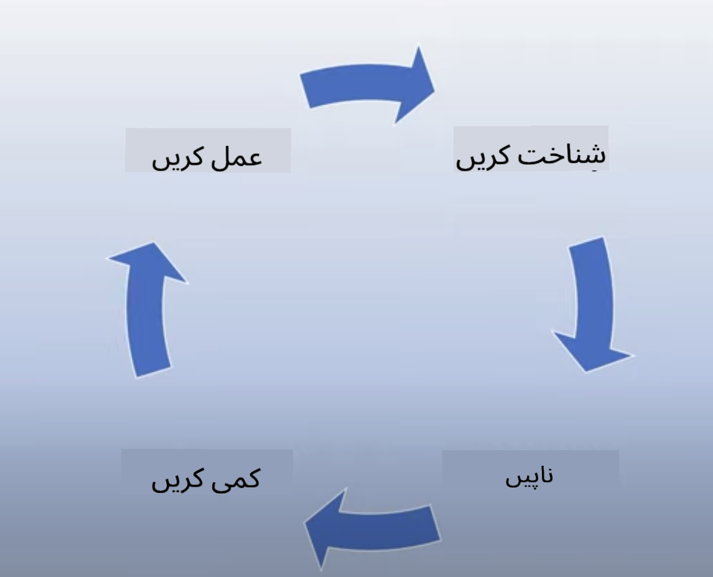
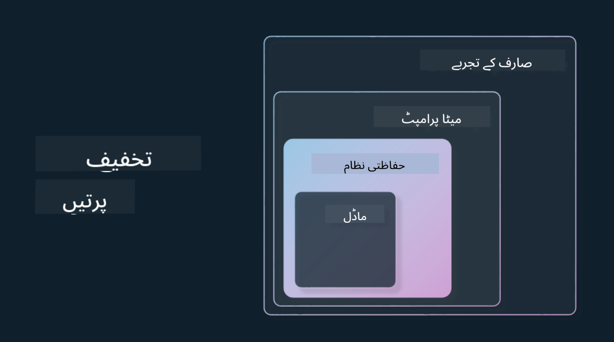

<!--
CO_OP_TRANSLATOR_METADATA:
{
  "original_hash": "4d57fad773cbeb69c5dd62e65c34200d",
  "translation_date": "2025-10-17T13:06:17+00:00",
  "source_file": "03-using-generative-ai-responsibly/README.md",
  "language_code": "ur"
}
-->
# جنریٹو اے آئی کو ذمہ داری سے استعمال کرنا

> _اوپر دی گئی تصویر پر کلک کریں تاکہ اس سبق کی ویڈیو دیکھ سکیں_

اے آئی، خاص طور پر جنریٹو اے آئی، کے بارے میں دلچسپی لینا آسان ہے، لیکن آپ کو یہ سوچنا ہوگا کہ آپ اسے ذمہ داری سے کیسے استعمال کریں گے۔ آپ کو یہ سوچنا ہوگا کہ کیسے اس کے نتائج کو منصفانہ، غیر نقصان دہ اور مزید بہتر بنایا جائے۔ یہ باب آپ کو اس سیاق و سباق، غور کرنے والی باتوں، اور اے آئی کے استعمال کو بہتر بنانے کے لیے فعال اقدامات کرنے کے طریقے فراہم کرنے کا مقصد رکھتا ہے۔

## تعارف

یہ سبق شامل کرے گا:

- جنریٹو اے آئی ایپلیکیشنز بناتے وقت ذمہ دار اے آئی کو ترجیح دینے کی اہمیت۔
- ذمہ دار اے آئی کے بنیادی اصول اور ان کا جنریٹو اے آئی سے تعلق۔
- ان ذمہ دار اے آئی اصولوں کو حکمت عملی اور ٹولز کے ذریعے عملی جامہ پہنانا۔

## سیکھنے کے اہداف

اس سبق کو مکمل کرنے کے بعد آپ جان جائیں گے:

- جنریٹو اے آئی ایپلیکیشنز بناتے وقت ذمہ دار اے آئی کی اہمیت۔
- جنریٹو اے آئی ایپلیکیشنز بناتے وقت ذمہ دار اے آئی کے بنیادی اصولوں کو کب سوچنا اور لاگو کرنا ہے۔
- ذمہ دار اے آئی کے تصور کو عملی جامہ پہنانے کے لیے کون سے ٹولز اور حکمت عملیاں دستیاب ہیں۔

## ذمہ دار اے آئی کے اصول

جنریٹو اے آئی کی دلچسپی پہلے سے کہیں زیادہ ہے۔ اس دلچسپی نے اس میدان میں بہت سے نئے ڈویلپرز، توجہ، اور فنڈنگ کو لایا ہے۔ یہ ان لوگوں کے لیے بہت مثبت ہے جو جنریٹو اے آئی کا استعمال کرتے ہوئے مصنوعات اور کمپنیاں بنانا چاہتے ہیں، لیکن یہ بھی ضروری ہے کہ ہم ذمہ داری سے آگے بڑھیں۔

اس کورس کے دوران، ہم اپنی اسٹارٹ اپ اور اے آئی ایجوکیشن پروڈکٹ بنانے پر توجہ مرکوز کر رہے ہیں۔ ہم ذمہ دار اے آئی کے اصولوں کا استعمال کریں گے: منصفانہ، شمولیت، قابل اعتماد/محفوظ، سیکیورٹی اور پرائیویسی، شفافیت اور جوابدہی۔ ان اصولوں کے ساتھ، ہم یہ دریافت کریں گے کہ وہ ہماری مصنوعات میں جنریٹو اے آئی کے استعمال سے کیسے تعلق رکھتے ہیں۔

## آپ کو ذمہ دار اے آئی کو ترجیح کیوں دینی چاہیے

جب کوئی پروڈکٹ بناتے ہیں، تو انسانی مرکزیت کا طریقہ اپنانا، یعنی اپنے صارفین کے بہترین مفاد کو مدنظر رکھنا، بہترین نتائج دیتا ہے۔

جنریٹو اے آئی کی انفرادیت اس کی طاقت ہے کہ یہ صارفین کے لیے مددگار جوابات، معلومات، رہنمائی، اور مواد تخلیق کر سکتا ہے۔ یہ بہت سے دستی مراحل کے بغیر کیا جا سکتا ہے جو بہت متاثر کن نتائج دے سکتا ہے۔ مناسب منصوبہ بندی اور حکمت عملی کے بغیر، یہ بدقسمتی سے آپ کے صارفین، آپ کی پروڈکٹ، اور مجموعی طور پر معاشرے کے لیے کچھ نقصان دہ نتائج کا باعث بن سکتا ہے۔

آئیے ان ممکنہ نقصان دہ نتائج میں سے کچھ (لیکن سب نہیں) پر نظر ڈالیں:

### خیالی مواد

خیالی مواد ایک اصطلاح ہے جو اس وقت استعمال ہوتی ہے جب ایک LLM ایسا مواد پیدا کرتا ہے جو یا تو مکمل طور پر بے معنی ہو یا کچھ ایسا ہو جو ہم دیگر معلومات کے ذرائع کی بنیاد پر حقیقتاً غلط جانتے ہیں۔

آئیے مثال کے طور پر لیتے ہیں کہ ہم اپنی اسٹارٹ اپ کے لیے ایک فیچر بناتے ہیں جو طلباء کو ماڈل سے تاریخی سوالات پوچھنے کی اجازت دیتا ہے۔ ایک طالب علم سوال پوچھتا ہے `ٹائٹینک کا واحد زندہ بچ جانے والا کون تھا؟`

ماڈل ایک جواب پیدا کرتا ہے جیسا کہ نیچے دیا گیا ہے:

> _(ماخذ: [فلائنگ بائسنز](https://flyingbisons.com?WT.mc_id=academic-105485-koreyst))_

یہ ایک بہت پراعتماد اور مکمل جواب ہے۔ بدقسمتی سے، یہ غلط ہے۔ تھوڑی سی تحقیق کے ساتھ بھی، کوئی یہ دریافت کرے گا کہ ٹائٹینک کے حادثے میں ایک سے زیادہ زندہ بچ جانے والے تھے۔ ایک طالب علم جو اس موضوع پر تحقیق شروع کر رہا ہے، اس جواب کو اتنا قائل سمجھ سکتا ہے کہ اسے سوال نہ کرے اور حقیقت کے طور پر قبول کرے۔ اس کے نتائج اے آئی سسٹم کو ناقابل اعتماد بنا سکتے ہیں اور ہماری اسٹارٹ اپ کی ساکھ کو منفی طور پر متاثر کر سکتے ہیں۔

کسی بھی دیے گئے LLM کے ہر تکرار کے ساتھ، ہم نے خیالی مواد کو کم کرنے کے ارد گرد کارکردگی میں بہتری دیکھی ہے۔ اس بہتری کے باوجود، ہمیں ایپلیکیشن بنانے والے اور صارفین کے طور پر ان حدود سے آگاہ رہنا ہوگا۔

### نقصان دہ مواد

ہم نے پہلے حصے میں کور کیا جب ایک LLM غلط یا بے معنی جوابات پیدا کرتا ہے۔ ایک اور خطرہ جس سے ہمیں آگاہ ہونا چاہیے وہ ہے جب ایک ماڈل نقصان دہ مواد کے ساتھ جواب دیتا ہے۔

نقصان دہ مواد کی تعریف کی جا سکتی ہے:

- خود کو نقصان پہنچانے یا کچھ گروہوں کو نقصان پہنچانے کی ہدایات دینا یا ان کی حوصلہ افزائی کرنا۔
- نفرت انگیز یا توہین آمیز مواد۔
- کسی بھی قسم کے حملے یا پرتشدد اعمال کی منصوبہ بندی کی رہنمائی۔
- غیر قانونی مواد تلاش کرنے یا غیر قانونی اعمال کرنے کی ہدایات دینا۔
- جنسی طور پر واضح مواد دکھانا۔

ہماری اسٹارٹ اپ کے لیے، ہم یہ یقینی بنانا چاہتے ہیں کہ ہمارے پاس صحیح ٹولز اور حکمت عملیاں موجود ہیں تاکہ اس قسم کے مواد کو طلباء کے سامنے آنے سے روکا جا سکے۔

### منصفانہ ہونے کی کمی

منصفانہ ہونے کی تعریف "یقینی بنانا کہ ایک اے آئی سسٹم تعصب اور امتیاز سے پاک ہے اور وہ سب کے ساتھ منصفانہ اور مساوی سلوک کرتا ہے" کے طور پر کی گئی ہے۔ جنریٹو اے آئی کی دنیا میں، ہم یہ یقینی بنانا چاہتے ہیں کہ ماڈل کے نتائج کے ذریعے پسماندہ گروہوں کے اخراجی نظریات کو تقویت نہ دی جائے۔

اس قسم کے نتائج نہ صرف ہمارے صارفین کے لیے مثبت پروڈکٹ تجربات بنانے کے لیے نقصان دہ ہیں بلکہ وہ مزید معاشرتی نقصان کا باعث بھی بنتے ہیں۔ ایپلیکیشن بنانے والے کے طور پر، ہمیں ہمیشہ جنریٹو اے آئی کے ساتھ حل بناتے وقت ایک وسیع اور متنوع صارف بنیاد کو ذہن میں رکھنا چاہیے۔

## جنریٹو اے آئی کو ذمہ داری سے کیسے استعمال کریں

اب جب کہ ہم نے ذمہ دار جنریٹو اے آئی کی اہمیت کی نشاندہی کی ہے، آئیے 4 اقدامات پر نظر ڈالیں جو ہم اپنی اے آئی حل کو ذمہ داری سے بنانے کے لیے اٹھا سکتے ہیں:

### ممکنہ نقصانات کی پیمائش کریں

سافٹ ویئر ٹیسٹنگ میں، ہم ایپلیکیشن پر صارف کے متوقع اعمال کی جانچ کرتے ہیں۔ اسی طرح، صارفین کے متنوع پرامپٹس کی جانچ کرنا جو سب سے زیادہ استعمال ہونے والے ہیں، ممکنہ نقصان کی پیمائش کرنے کا ایک اچھا طریقہ ہے۔

چونکہ ہماری اسٹارٹ اپ ایک تعلیمی پروڈکٹ بنا رہی ہے، تو تعلیمی پرامپٹس کی ایک فہرست تیار کرنا اچھا ہوگا۔ یہ کسی خاص مضمون، تاریخی حقائق، اور طالب علم کی زندگی کے بارے میں پرامپٹس کو کور کرنے کے لیے ہو سکتا ہے۔

### ممکنہ نقصانات کو کم کریں

اب وقت ہے کہ ہم ایسے طریقے تلاش کریں جہاں ہم ماڈل اور اس کے جوابات کے ذریعے ممکنہ نقصان کو روک سکیں یا محدود کر سکیں۔ ہم اسے 4 مختلف سطحوں میں دیکھ سکتے ہیں:

- **ماڈل**۔ صحیح استعمال کے لیے صحیح ماڈل کا انتخاب۔ بڑے اور زیادہ پیچیدہ ماڈلز جیسے GPT-4 چھوٹے اور زیادہ مخصوص استعمال کے معاملات میں نقصان دہ مواد کے خطرے کا باعث بن سکتے ہیں۔ اپنے تربیتی ڈیٹا کا استعمال کرتے ہوئے فائن ٹیوننگ بھی نقصان دہ مواد کے خطرے کو کم کرتی ہے۔

- **حفاظتی نظام**۔ حفاظتی نظام ماڈل کی خدمت کرنے والے پلیٹ فارم پر ٹولز اور کنفیگریشنز کا ایک سیٹ ہے جو نقصان کو کم کرنے میں مدد کرتا ہے۔ اس کی ایک مثال Azure OpenAI سروس پر مواد فلٹرنگ سسٹم ہے۔ سسٹمز کو جیل بریک حملوں اور ناپسندیدہ سرگرمی جیسے بوٹس کی درخواستوں کا پتہ لگانا بھی چاہیے۔

- **میٹا پرامپٹ**۔ میٹا پرامپٹس اور گراؤنڈنگ وہ طریقے ہیں جن کے ذریعے ہم ماڈل کو کچھ رویوں اور معلومات کی بنیاد پر ہدایت یا محدود کر سکتے ہیں۔ یہ ماڈل کی کچھ حدود کو بیان کرنے کے لیے سسٹم ان پٹس کا استعمال ہو سکتا ہے۔ اس کے علاوہ، ایسے نتائج فراہم کرنا جو سسٹم کے دائرہ کار یا ڈومین کے لیے زیادہ متعلقہ ہوں۔

یہ تکنیکوں جیسے Retrieval Augmented Generation (RAG) کا استعمال بھی ہو سکتا ہے تاکہ ماڈل صرف منتخب کردہ قابل اعتماد ذرائع سے معلومات حاصل کرے۔ اس کورس میں ایک سبق ہے [سرچ ایپلیکیشنز بنانا](../08-building-search-applications/README.md?WT.mc_id=academic-105485-koreyst)

- **صارف کا تجربہ**۔ آخری سطح وہ ہے جہاں صارف کسی نہ کسی طرح ہماری ایپلیکیشن کے انٹرفیس کے ذریعے ماڈل کے ساتھ براہ راست تعامل کرتا ہے۔ اس طرح ہم UI/UX کو ڈیزائن کر سکتے ہیں تاکہ صارف کو ماڈل کو بھیجے جانے والے ان پٹس کی اقسام کے ساتھ ساتھ صارف کو دکھائے جانے والے متن یا تصاویر کو محدود کیا جا سکے۔ اے آئی ایپلیکیشن کو تعینات کرتے وقت، ہمیں یہ بھی شفاف ہونا چاہیے کہ ہماری جنریٹو اے آئی ایپلیکیشن کیا کر سکتی ہے اور کیا نہیں۔

ہمارے پاس ایک مکمل سبق ہے [اے آئی ایپلیکیشنز کے لیے UX ڈیزائن کرنا](../12-designing-ux-for-ai-applications/README.md?WT.mc_id=academic-105485-koreyst)

- **ماڈل کا جائزہ لیں**۔ LLMs کے ساتھ کام کرنا چیلنجنگ ہو سکتا ہے کیونکہ ہمیں ہمیشہ اس ڈیٹا پر کنٹرول نہیں ہوتا جس پر ماڈل کو تربیت دی گئی تھی۔ اس کے باوجود، ہمیں ہمیشہ ماڈل کی کارکردگی اور نتائج کا جائزہ لینا چاہیے۔ ماڈل کی درستگی، مماثلت، گراؤنڈڈنس، اور نتائج کی مطابقت کو ماپنا اب بھی اہم ہے۔ یہ اسٹیک ہولڈرز اور صارفین کو شفافیت اور اعتماد فراہم کرنے میں مدد کرتا ہے۔

### ذمہ دار جنریٹو اے آئی حل کو چلائیں

اپنی اے آئی ایپلیکیشنز کے ارد گرد ایک آپریشنل پریکٹس بنانا آخری مرحلہ ہے۔ اس میں قانونی اور سیکیورٹی جیسے ہماری اسٹارٹ اپ کے دیگر حصوں کے ساتھ شراکت داری شامل ہے تاکہ یہ یقینی بنایا جا سکے کہ ہم تمام ریگولیٹری پالیسیوں کے مطابق ہیں۔ لانچ کرنے سے پہلے، ہم ڈیلیوری، حادثات کو سنبھالنے، اور رول بیک کے ارد گرد منصوبے بنانا چاہتے ہیں تاکہ ہمارے صارفین کو بڑھنے سے کسی بھی نقصان کو روک سکیں۔

## ٹولز

جبکہ ذمہ دار اے آئی حل تیار کرنے کا کام بہت زیادہ لگ سکتا ہے، یہ کام کرنے کے قابل ہے۔ جنریٹو اے آئی کے علاقے کے بڑھنے کے ساتھ، مزید ٹولز ڈویلپرز کو اپنی ورک فلو میں ذمہ داری کو مؤثر طریقے سے شامل کرنے میں مدد کرنے کے لیے تیار ہوں گے۔ مثال کے طور پر، [Azure AI Content Safety](https://learn.microsoft.com/azure/ai-services/content-safety/overview?WT.mc_id=academic-105485-koreyst) ایک API درخواست کے ذریعے نقصان دہ مواد اور تصاویر کا پتہ لگانے میں مدد کر سکتا ہے۔

## علم کی جانچ

ذمہ دار اے آئی کے استعمال کو یقینی بنانے کے لیے آپ کو کن چیزوں کا خیال رکھنا چاہیے؟

1. کہ جواب درست ہو۔
1. نقصان دہ استعمال، کہ اے آئی کو مجرمانہ مقاصد کے لیے استعمال نہ کیا جائے۔
1. یہ یقینی بنانا کہ اے آئی تعصب اور امتیاز سے پاک ہو۔

A: 2 اور 3 درست ہیں۔ ذمہ دار اے آئی آپ کو نقصان دہ اثرات اور تعصبات کو کم کرنے اور مزید غور کرنے میں مدد کرتا ہے۔

## 🚀 چیلنج

[Azure AI Content Safety](https://learn.microsoft.com/azure/ai-services/content-safety/overview?WT.mc_id=academic-105485-koreyst) کے بارے میں پڑھیں اور دیکھیں کہ آپ اپنے استعمال کے لیے کیا اپناتے ہیں۔

## زبردست کام، اپنی تعلیم جاری رکھیں

اس سبق کو مکمل کرنے کے بعد، ہمارے [جنریٹو اے آئی لرننگ کلیکشن](https://aka.ms/genai-collection?WT.mc_id=academic-105485-koreyst) کو دیکھیں تاکہ اپنی جنریٹو اے آئی کی معلومات کو مزید بہتر کریں!

سبق 4 پر جائیں جہاں ہم [پرامپٹ انجینئرنگ کے بنیادی اصول](../04-prompt-engineering-fundamentals/README.md?WT.mc_id=academic-105485-koreyst) پر نظر ڈالیں گے!

---

**اعلانِ لاتعلقی**:  
یہ دستاویز AI ترجمہ سروس [Co-op Translator](https://github.com/Azure/co-op-translator) کا استعمال کرتے ہوئے ترجمہ کی گئی ہے۔ ہم درستگی کے لیے کوشش کرتے ہیں، لیکن براہ کرم آگاہ رہیں کہ خودکار ترجمے میں غلطیاں یا غیر درستیاں ہو سکتی ہیں۔ اصل دستاویز کو اس کی اصل زبان میں مستند ذریعہ سمجھا جانا چاہیے۔ اہم معلومات کے لیے، پیشہ ور انسانی ترجمہ کی سفارش کی جاتی ہے۔ اس ترجمے کے استعمال سے پیدا ہونے والی کسی بھی غلط فہمی یا غلط تشریح کے لیے ہم ذمہ دار نہیں ہیں۔