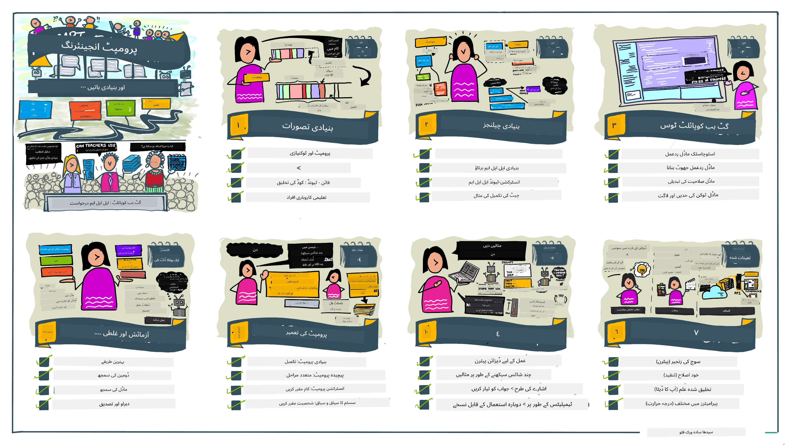
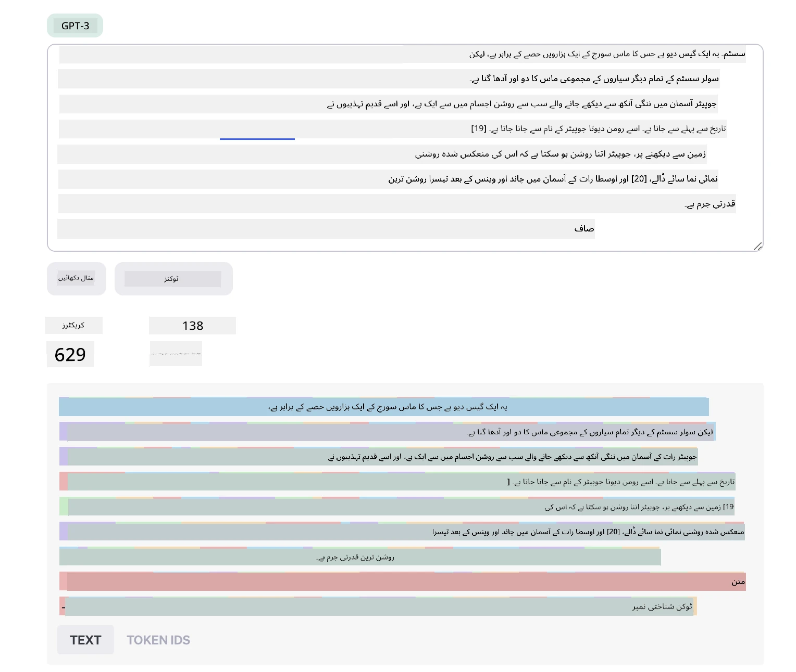
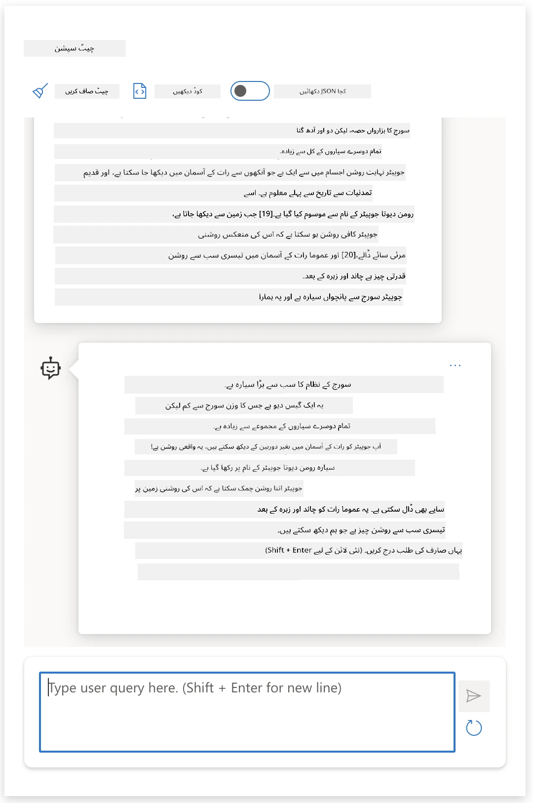
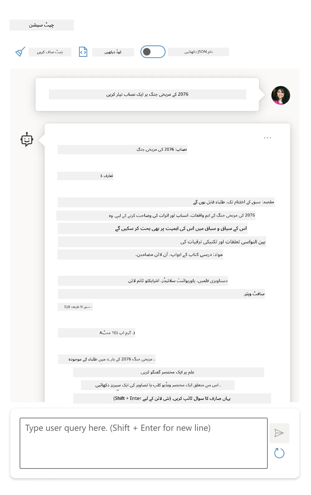
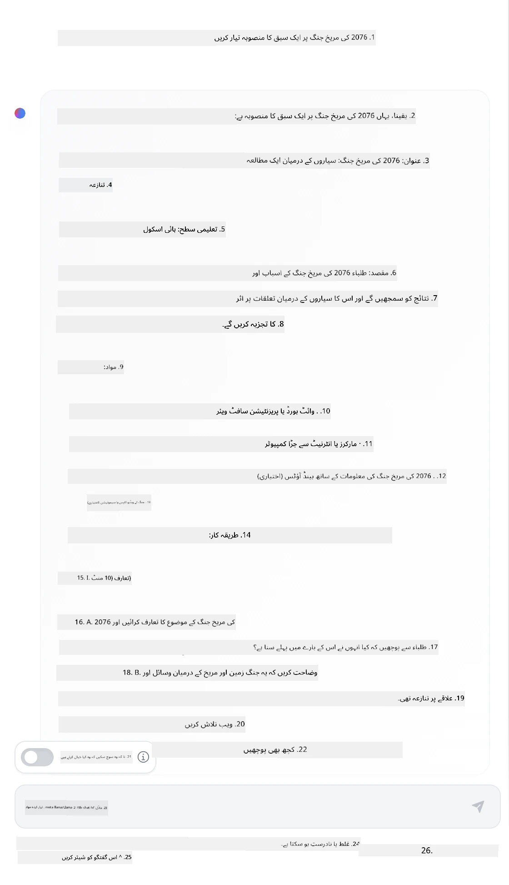

# بنیادیات پرامپٹ انجینئرنگ

[](https://youtu.be/GElCu2kUlRs?si=qrXsBvXnCW12epb8)

## تعارف
یہ ماڈیول جنریٹیو AI ماڈلز میں مؤثر پرامپٹس بنانے کے لیے ضروری تصورات اور تکنیکوں کا احاطہ کرتا ہے۔ LLM کو اپنا پرامپٹ لکھنے کا طریقہ بھی اہمیت رکھتا ہے۔ ایک باریک بینی سے تیار کیا گیا پرامپٹ بہتر نوعیت کا ردعمل حاصل کر سکتا ہے۔ مگر بالکل "پرامپٹ" اور "پرامپٹ انجینئرنگ" جیسے اصطلاحات کا کیا مطلب ہے؟ اور میں LLM کو بھیجے جانے والے پرامپٹ _ان پٹ_ میں کیسے بہتری لا سکتا ہوں؟ یہ وہ سوالات ہیں جن کے ہم اس باب اور اگلے میں جواب دینے کی کوشش کریں گے۔

_جنریٹیو AI_ صارف کی درخواستوں کے جواب میں نئی مواد (مثلاً متن، تصاویر، صوت، کوڈ وغیرہ) تخلیق کرنے کی صلاحیت رکھتا ہے۔ یہ OpenAI کے GPT ("Generative Pre-trained Transformer") سیریز جیسے _بڑے زبان ماڈلز_ کے ذریعے حاصل کرتا ہے جو قدرتی زبان اور کوڈ کے استعمال کے لیے تربیت یافتہ ہیں۔

صارفین اب ان ماڈلز سے چیٹ جیسی مانوس طرز پر بات چیت کر سکتے ہیں، بغیر کسی تکنیکی مہارت یا تربیت کے۔ ماڈلز _پرامپٹ پر مبنی_ ہوتے ہیں - صارفین ایک متنی ان پٹ (پرامپٹ) بھیجتے ہیں اور AI کا جواب (تکمیل) واپس حاصل کرتے ہیں۔ پھر وہ "AI کے ساتھ چیٹ" تسلسل میں کر سکتے ہیں، ملٹی ٹرن بات چیت میں، اپنے پرامپٹ کو بہتر کرتے ہوئے جب تک جواب ان کی توقعات سے میل نہ کھائے۔

"پرامپٹس" اب جنریٹیو AI ایپس کے لیے بنیادی _پروگرامنگ انٹرفیس_ بن جاتے ہیں، جو ماڈلز کو بتاتے ہیں کہ کیا کرنا ہے اور واپس آنے والے جوابات کے معیار پر اثر انداز ہوتے ہیں۔ "پرامپٹ انجینئرنگ" ایک تیزی سے بڑھتا ہوا مطالعہ کا میدان ہے جو مستحکم اور معیاری جوابات فراہم کرنے کے لیے پرامپٹس کے _ڈیزائن اور آپٹیمائزیشن_ پر توجہ دیتا ہے۔

## سیکھنے کے مقاصد

اس سبق میں، ہم جانیں گے کہ پرامپٹ انجینئرنگ کیا ہے، یہ کیوں اہم ہے، اور کسی مخصوص ماڈل اور ایپلیکیشن مقصد کے لیے زیادہ مؤثر پرامپٹس کیسے تیار کیے جا سکتے ہیں۔ ہم بنیادی تصورات اور پرامپٹ انجینئرنگ کی بہترین عملی طریقوں کو سمجھیں گے - اور ایک انٹرایکٹو جیوپیٹر نوٹ بکس کے "سینڈباکس" ماحول کے بارے میں بھی جانیں گے جہاں ہم ان تصورات کو حقیقی مثالوں پر لاگو ہوتے دیکھ سکتے ہیں۔

سبق کے اختتام تک ہم یہ کر سکیں گے:

1. وضاحت کریں کہ پرامپٹ انجینئرنگ کیا ہے اور یہ کیوں اہم ہے۔
2. پرامپٹ کے اجزاء اور ان کے استعمال کو بیان کریں۔
3. پرامپٹ انجینئرنگ کی بہترین مشقیں اور تکنیکیں سیکھیں۔
4. سیکھی گئی تکنیکوں کو حقیقی مثالوں میں لاگو کریں، OpenAI اینڈپوائنٹ استعمال کرتے ہوئے۔

## اہم اصطلاحات

پرامپٹ انجینئرنگ: AI ماڈلز کو مطلوبہ آؤٹ پُٹس پیدا کرنے کے لیے ان پٹس کو ڈیزائن اور بہتر بنانے کا عمل۔
ٹوکینائزیشن: متن کو چھوٹے حصوں میں تبدیل کرنے کا عمل، جنہیں ٹوکنز کہتے ہیں، جنہیں ماڈل سمجھ اور پروسیس کر سکتا ہے۔
انسٹرکشن-ٹیونڈ LLMs: بڑے زبان ماڈلز (LLMs) جنہیں مخصوص ہدایات کے ساتھ بہتر ردعمل کی درستگی اور مطابقت کے لیے فائن ٹیون کیا گیا ہو۔

## سیکھنے کا سینڈباکس

پرامپٹ انجینئرنگ فی الوقت زیادہ فن ہے بجائے سائنس کے۔ اس کی سمجھ بوجھ کو بہتر بنانے کا بہترین طریقہ یہ ہے کہ _زیادہ مشق کریں_ اور ایک آزمائشی و غلطی والا طریقہ اپنائیں جو ایپلیکیشن کے شعبے کی مہارت کو سفارش کردہ تکنیکوں اور ماڈل مخصوص آپٹیمائزیشنز کے ساتھ جوڑتا ہے۔

اس سبق کے ساتھ جیوپیٹر نوٹ بک ایک _سینڈباکس_ ماحول فراہم کرتا ہے جہاں آپ سیکھے گئے اسباق کو آزما سکتے ہیں - جیسے ہی آپ آگے بڑھیں یا آخر میں کوڈ چیلنج کے حصے کے طور پر۔ مشقیں چلانے کے لیے آپ کو چاہیے:

1. **ایک Azure OpenAI API کلید** - کسی تعین شدہ LLM کے لیے سروس اینڈپوائنٹ۔
2. **ایک پائتھن رن ٹائم** - جس میں نوٹ بک چل سکے۔
3. **مقامی ماحول کے متغیرات** - _ابھی [SETUP](./../00-course-setup/02-setup-local.md?WT.mc_id=academic-105485-koreyst) کے مراحل مکمل کریں تاکہ تیار ہو جائیں_۔

نوٹ بک کے ساتھ _ابتدائی_ مشقیں آتی ہیں - لیکن آپ کو ترغیب دی جاتی ہے کہ اپنے اپنے _مارک ڈاؤن_ (تفصیل) اور _کوڈ_ (پرامپٹ درخواستیں) سیکشنز شامل کریں تاکہ مزید مثالیں یا خیالات آزما سکیں - اور پرامپٹ ڈیزائن کے لیے اپنی سمجھ بڑھا سکیں۔

## تصویری رہنما

کیا آپ یہ جاننا چاہتے ہیں کہ یہ سبق کب اور کیا کور کرے گا؟ اس تصویری رہنما کو دیکھیں، جو آپ کو اہم موضوعات اور ہر ایک کے بارے میں سوچنے کے لیے کلیدی نکات کا ایک جائزہ دیتا ہے۔ سبق کا روڈ میپ آپ کو بنیادی تصورات اور چیلنجز کو سمجھنے سے لے کر پرامپٹ انجینئرنگ کی متعلقہ تکنیکوں اور بہترین طریقوں کے ذریعے ان کا حل تلاش کرنے تک لے جاتا ہے۔ نوٹ کریں کہ اس رہنما میں "اعلیٰ تکنیکیں" کا سیکشن اس نصاب کے _اگلے_ باب کا حوالہ دیتا ہے۔



## ہماری اسٹارٹ اپ

اب، آئیں بات کریں کہ _یہ موضوع_ ہماری اسٹارٹ اپ مشن سے کیسے متعلق ہے، یعنی [تعلیم میں AI جدت لانا](https://educationblog.microsoft.com/2023/06/collaborating-to-bring-ai-innovation-to-education?WT.mc_id=academic-105485-koreyst)۔ ہم AI سے چلنے والی _ذاتی نوعیت کی تعلیم_ کی ایپلیکیشنز بنانا چاہتے ہیں - تو آئیے سوچیں کہ ہمارے ایپلیکیشن کے مختلف صارفین "پرامپٹس" کیسے "ڈیزائن" کر سکتے ہیں:

- **ایڈمنسٹریٹرز** AI سے پوچھ سکتے ہیں کہ _نصاب کے ڈیٹا کا تجزیہ کرے تاکہ کور ہونے والے علاقوں میں خلا کو پہچانا جا سکے_۔ AI نتائج کا خلاصہ کر سکتا ہے یا انہیں کوڈ کے ساتھ بصری شکل دے سکتا ہے۔
- **اساتذہ** AI سے پوچھ سکتے ہیں کہ _ہدف بنائے گئے ناظرین اور موضوع کے لیے ایک درس منصوبہ تیار کرے_۔ AI مخصوص فارمیٹ میں ذاتی نوعیت کا منصوبہ بنا سکتا ہے۔
- **طلباء** AI سے پوچھ سکتے ہیں کہ _مشکل مضمون میں ان کی رہنمائی کرے_۔ AI اب ایسے اسباق، اشارے اور مثالیں فراہم کر سکتا ہے جو ان کے سطح کے مطابق ہوں۔

یہ صرف ایک چھوٹا حصہ ہے۔ [Prompts For Education](https://github.com/microsoft/prompts-for-edu/tree/main?WT.mc_id=academic-105485-koreyst) دیکھیں — ایک اوپن سورس پرامپٹس لائبریری جو تعلیم کے ماہرین نے تیار کی ہے — تاکہ امکانات کا ایک وسیع تر اندازہ لگایا جا سکے! _کچھ پرامپٹس سینڈباکس یا OpenAI پلے گراؤنڈ میں چلائیں اور دیکھیں کیا ہوتا ہے!_

<!--
LESSON TEMPLATE:
This unit should cover core concept #1.
Reinforce the concept with examples and references.

CONCEPT #1:
Prompt Engineering.
Define it and explain why it is needed.
-->

## پرامپٹ انجینئرنگ کیا ہے؟

ہم نے اس سبق کا آغاز کیا **پرامپٹ انجینئرنگ** کی تعریف کرتے ہوئے کہ یہ متن کے ان پٹس (پرامپٹس) کو اس طرح _ڈیزائن اور بہتر بنانے_ کا عمل ہے جو کسی مخصوص ایپلیکیشن مقصد اور ماڈل کے لیے معیاری اور مسلسل جوابات (تکمیل) فراہم کرے۔ ہم اسے دو قدمی عمل کے طور پر سوچ سکتے ہیں:

- کسی مخصوص ماڈل اور مقصد کے لیے ابتدائی پرامپٹ _ڈیزائن کرنا_
- ردعمل کے معیار کو بہتر بنانے کے لیے پرامپٹ کو مرحلہ وار _بہتر بنانا_

یہ لازمی طور پر ایک آزمائشی و غلطی والا عمل ہے جو بہترین نتائج کے لیے صارف کی سمجھ اور کوشش کا متقاضی ہے۔ تو یہ کیوں اہم ہے؟ اس سوال کا جواب دینے کے لیے ہمیں پہلے تین تصورات کو سمجھنا ہوگا:

- _ٹوکینائزیشن_ = ماڈل پرامپٹ کو کیسے "دیکھتا" ہے
- _بیس LLMs_ = بنیاد ماڈل پرامپٹ کو کیسے "پروسیس" کرتا ہے
- _انسٹرکشن-ٹیونڈ LLMs_ = ماڈل اب کیسے "مشن" دیکھ سکتا ہے

### ٹوکینائزیشن

ایک LLM پرامپٹس کو _ٹوکنز کے تسلسل_ کے طور پر دیکھتا ہے جہاں مختلف ماڈلز (یا ماڈل کے مختلف ورژنز) ایک ہی پرامپٹ کو مختلف طریقوں سے ٹوکنائز کر سکتے ہیں۔ چونکہ LLMs کو ٹوکنز پر تربیت دی جاتی ہے (خام متن پر نہیں)، اس لیے پرامپٹس کیسے ٹوکنائز ہوتے ہیں اس کا براہ راست اثر پیدا کردہ جواب کے معیار پر ہوتا ہے۔

ٹوکینائزیشن کو سمجھنے کے لیے، [OpenAI Tokenizer](https://platform.openai.com/tokenizer?WT.mc_id=academic-105485-koreyst) جیسے اوزار آزما کر دیکھیں جو نیچے دکھایا گیا ہے۔ اپنے پرامپٹ کو کاپی کریں — اور دیکھیں کہ یہ کیسے ٹوکنز میں تبدیل ہوتا ہے، خاص طور پر اس بات پر غور کریں کہ وائٹ اسپیس کردار اور رموز کیسے سنبھالے جاتے ہیں۔ نوٹ کریں یہ مثال ایک پرانے LLM (GPT-3) کی ہے — تو جدید ماڈل کے ساتھ آزمانے پر مختلف نتیجہ آ سکتا ہے۔



### تصور: بنیاد ماڈلز

ایک بار جب پرامپٹ ٹوکنائز ہو جاتا ہے، تو ["بیس LLM"](https://blog.gopenai.com/an-introduction-to-base-and-instruction-tuned-large-language-models-8de102c785a6?WT.mc_id=academic-105485-koreyst) (یا فاؤنڈیشن ماڈل) کا بنیادی کام اس تسلسل میں اگلے ٹوکن کی پیش گوئی کرنا ہوتا ہے۔ چونکہ LLMs کو وسیع متن کے ڈیٹا سیٹس پر تربیت دی گئی ہے، انہیں ٹوکنز کے مابین شماریاتی تعلقات کا اچھا اندازہ ہوتا ہے اور وہ اعتماد کے ساتھ پیش گوئی کر سکتے ہیں۔ یہ نوٹ کرنا ضروری ہے کہ وہ پرامپٹ یا ٹوکن کے الفاظ کے _معنی_ کو نہیں سمجھتے؛ وہ صرف ایک نمونہ دیکھتے ہیں جسے اپنی اگلی پیش گوئی سے "مکمل" کر سکتے ہیں۔ وہ اس تسلسل کی پیش گوئی جاری رکھ سکتے ہیں جب تک صارف مداخلت نہ کرے یا کوئی پیشگی شرط پوری نہ ہو۔

کیا آپ دیکھنا چاہتے ہیں کہ پرامپٹ پر مبنی تکمیل کیسے کام کرتی ہے؟ اوپر والا پرامپٹ Azure OpenAI Studio کے [_Chat Playground_](https://oai.azure.com/playground?WT.mc_id=academic-105485-koreyst) میں ڈیفالٹ سیٹنگز کے ساتھ داخل کریں۔ سسٹم اس طرح ترتیب دیا گیا ہے کہ پرامپٹس کو معلومات کی درخواست کے طور پر سمجھے — لہٰذا آپ کو ایک ایسا جواب دیکھنا چاہیے جو اس سیاق و سباق کو پورا کرے۔

لیکن اگر صارف کوئی خاص چیز دیکھنا چاہتا ہو جو کسی معیار یا مشن کے مقصد پر پورا اترے؟ یہاں _انسٹرکشن-ٹیونڈ_ LLMs منظر میں آتے ہیں۔


### تصور: انسٹرکشن-ٹیونڈ LLMs

ایک [انسٹرکشن-ٹیونڈ LLM](https://blog.gopenai.com/an-introduction-to-base-and-instruction-tuned-large-language-models-8de102c785a6?WT.mc_id=academic-105485-koreyst) بنیاد ماڈل سے شروع ہوتا ہے اور اسے مثالوں یا ان پٹ/آؤٹ پٹ جوڑوں (مثلاً ملٹی ٹرن "مسیجز") کے ساتھ بہتر انداز میں تربیت دیتا ہے جن میں واضح ہدایات ہو سکتی ہیں — اور AI کا جواب کوشش کرتا ہے کہ ان ہدایات کی پیروی کرے۔

یہ ری انفورسمنٹ لرننگ ود ہیومن فیڈبیک (RLHF) جیسی تکنیکیں استعمال کرتا ہے جو ماڈل کو _ہدایات کی پیروی_ کرنا اور _فیڈبیک سے سیکھنا_ سکھاتی ہیں تاکہ یہ ایسے جوابات پیدا کرے جو عملی استعمالات کے لیے زیادہ موزوں اور صارف کے مقاصد کے متعلقہ ہوں۔

آئیے اسے آزمائیں — اوپر والے پرامپٹ پر واپس جائیں، مگر اب _سسٹم میسج_ کو بدل کر درج ذیل ہدایت بطور سیاق و سباق فراہم کریں:

> _آپ کو دی گئی مواد کو دوسرے درجے کے طالب علم کے لیے خلاصہ کریں۔ نتیجہ ایک پیراگراف میں 3-5 بلٹ پوائنٹس کے ساتھ محدود رکھیں۔_

دیکھیں کہ نتیجہ اب مطلوبہ مقصد اور فارمیٹ کی عکاسی کرتا ہے؟ ایک استاد اب اس جواب کو براہ راست اپنی اسباق کی سلائیڈز میں استعمال کر سکتا ہے۔



## ہمیں پرامپٹ انجینئرنگ کی ضرورت کیوں ہے؟

اب جب کہ ہم جان چکے کہ LLMs پرامپٹس کو کیسے پروسیس کرتے ہیں، آئیے بات کریں کہ _ہمیں_ پرامپٹ انجینئرنگ کیوں درکار ہے۔ جواب اس حقیقت میں مضمر ہے کہ موجودہ LLMs ایسی متعدد چیلنجز پیش کرتے ہیں جو _قابل اعتماد اور مستقل تکمیلیں_ حاصل کرنا مشکل بناتے ہیں، اگر پرامپٹ کی تعمیر اور آپٹیمائزیشن پر محنت نہ کی جائے۔ مثال کے طور پر:

1. **ماڈل جوابات میں تصادفی پن ہوتا ہے۔** _ایک ہی پرامپٹ_ مختلف ماڈلز یا ماڈل ورژنز کے ساتھ ممکنہ طور پر مختلف جوابات پیدا کرے گا۔ اور یہی ماڈل مختلف اوقات میں بھی مختلف نتائج دے سکتا ہے۔ _پرامپٹ انجینئرنگ کی تکنیکیں ان تغیرات کو کم کرنے میں مدد دیتی ہیں تاکہ بہتر حفاظت فراہم کی جاسکے_۔

1. **ماڈلز جوابات گھڑ سکتے ہیں۔** ماڈلز کو _بہت بڑے مگر محدود_ ڈیٹا سیٹس پر تربیت دی گئی ہے، جس کا مطلب ہے کہ وہ اس تربیتی دائرہ کار کے باہر کے تصورات سے ناواقف ہوتے ہیں۔ نتیجتاً، وہ ایسے جوابات پیدا کر سکتے ہیں جو غلط، فرضی یا معلوم حقائق سے براہ راست متصادم ہوں۔ _پرامپٹ انجینئرنگ تکنیکیں صارفین کو ایسی تخلیقات کی شناخت اور ان کو کم کرنے میں مدد دیتی ہیں، مثلاً AI سے حوالہ جات یا استدلال طلب کر کے_۔

1. **ماڈلز کی صلاحیتیں مختلف ہوں گی۔** نئے ماڈلز یا ماڈل جنریشنز کے پاس زیادہ صلاحیتیں ہوں گی مگر وہ منفرد خامیاں اور لاگت و پیچیدگی کے لحاظ سے مختلف تقاضے لے کر آتے ہیں۔ _پرامپٹ انجینئرنگ ہمیں ایسی بہترین مشقیں اور ورک فلو تیار کرنے میں مدد دیتی ہے جو ان فرقوں کو چھپا کر، ماڈل مخصوص تقاضوں کے مطابق اسکال ایبل اور ہم آہنگ طریقوں سے قابو پائیں_۔

آئیے OpenAI یا Azure OpenAI پلے گراؤنڈ میں اسے عملی طور پر دیکھیں:

- مختلف LLM ڈپلائمنٹس (مثلاً OpenAI، Azure OpenAI، Hugging Face) کے ساتھ ایک ہی پرامپٹ استعمال کریں — کیا آپ نے تغیرات دیکھے؟
- ایک ہی LLM ڈپلائمنٹ (مثلاً Azure OpenAI پلے گراؤنڈ) کے ساتھ بار بار ایک ہی پرامپٹ استعمال کریں — یہ تغیرات کیسے مختلف تھے؟

### تخلیقات کی مثال

اس کورس میں، ہم اصطلاح **"تخلیق"** کا استعمال اس ظہور کے حوالے سے کرتے ہیں جہاں LLMs اپنی تربیت یا دیگر محدودیتوں کی وجہ سے بعض اوقات غیر حقیقی معلومات تخلیق کرتے ہیں۔ آپ نے شاید اسے عام مضامین یا تحقیقی مقالوں میں _"ہیلوسینیشنز"_ کے طور پر سنا ہو۔ تاہم، ہم سختی سے سفارش کرتے ہیں کہ _"تخلیق"_ کی اصطلاح استعمال کی جائے تاکہ ہم مشینی نتیجے کو انسانی خصوصیت سے منسوب کرنے سے گریز کریں۔ یہ [ذمہ دار AI رہنما خطوط](https://www.microsoft.com/ai/responsible-ai?WT.mc_id=academic-105485-koreyst) کے لحاظ سے بھی بہتر ہے، کیونکہ یہ ایسے الفاظ کو ہٹاتا ہے جو بعض مواقع پر توہین آمیز یا غیر شمولیتی سمجھے جا سکتے ہیں۔

تخلیقات کے کام کرنے کا اندازہ لگانا چاہتے ہیں؟ ایسی مثال سوچیں جو AI کو ایسی موضوع پر مواد پیدا کرنے کی ہدایت دے جو وجود نہیں رکھتا (تاکہ یہ تربیتی ڈیٹا میں نہ ہو)۔ مثلاً — میں نے یہ پرامپٹ آزمایا:

> **پرامپٹ:** مریخی جنگ 2076 پر درس منصوبہ تیار کریں۔
ایک ویب سرچ نے مجھے دکھایا کہ مریخی جنگوں پر فرضی کہانیاں (مثلاً، ٹیلی ویژن سیریز یا کتابیں) موجود تھیں - لیکن 2076 میں کوئی نہیں۔ عام فہم بھی یہ کہتا ہے کہ 2076 _مستقبل_ میں ہے اور اس لیے، اسے کسی حقیقی واقعے سے منسلک نہیں کیا جا سکتا۔

تو کیا ہوتا ہے جب ہم اس پرامپٹ کو مختلف LLM فراہم کنندگان کے ساتھ چلائیں؟

> **جواب 1**: OpenAI Playground (GPT-35)


> **جواب 2**: Azure OpenAI Playground (GPT-35)



> **جواب 3**: : Hugging Face Chat Playground (LLama-2)



جیسا کہ متوقع تھا، ہر ماڈل (یا ماڈل ورژن) اسٹیچیسٹک رویے اور ماڈل کی صلاحیت میں مختلف ہونے کی وجہ سے تھوڑا مختلف ردعمل پیدا کرتا ہے۔ مثلاً، ایک ماڈل آٹھویں جماعت کے طلباء کو مخاطب کرتا ہے جب کہ دوسرا ہائی اسکول کے طالب علم کو فرض کرتا ہے۔ لیکن تینوں ماڈلز نے ایسے جوابات دیے جو غیر باخبر صارف کو قائل کر سکتے ہیں کہ یہ واقعہ حقیقی تھا۔

پرامپٹ انجینئرنگ تکنیک جیسا کہ _میٹا پرامپٹنگ_ اور _ٹیمپریچر کنفیگریشن_ ماڈل کی ساخت سازی کو کچھ حد تک کم کر سکتی ہیں۔ نئی پرامپٹ انجینئرنگ _آرکیٹیکچرز_ بھی نئے آلات اور تکنیک کو پرامپٹ کے بہاؤ میں بغیر کسی رکاوٹ کے شامل کرتی ہیں، تاکہ ان اثرات کو کم یا روکا جا سکے۔

## کیس اسٹڈی: GitHub Copilot

آئیے اس سیکشن کو ختم کرتے ہیں اور دیکھتے ہیں کہ پرامپٹ انجینئرنگ حقیقی دنیا کے حل میں کیسے استعمال ہوتی ہے، ایک کیس اسٹڈی: [GitHub Copilot](https://github.com/features/copilot?WT.mc_id=academic-105485-koreyst) کے ذریعے۔

GitHub Copilot آپ کا "AI جوڑی پروگرامر" ہے - یہ ٹیکسٹ پرامپٹس کو کوڈ مکمل کرنے میں تبدیل کرتا ہے اور آپ کے ڈیویلپمنٹ ماحول (مثلاً، Visual Studio Code) میں مربوط ہے تاکہ ایک ہموار صارف تجربہ فراہم کرے۔ نیچے دی گئی بلاگز کی سیریز میں دستاویزی ہے کہ ابتدائی ورژن OpenAI Codex ماڈل پر مبنی تھا - جہاں انجینئرز نے جلدی ماڈل کو بہتر بنانے اور بہتر پرامپٹ انجینئرنگ تکنیک تیار کرنے کی ضرورت محسوس کی، تاکہ کوڈ کی کوالٹی بہتر ہو۔ جولائی میں، انہوں نے [ایک بہتر AI ماڈل متعارف کرایا جو Codex سے آگے جاتا ہے](https://github.blog/2023-07-28-smarter-more-efficient-coding-github-copilot-goes-beyond-codex-with-improved-ai-model/?WT.mc_id=academic-105485-koreyst) تاکہ تجویزات کو اور بھی تیز بنایا جا سکے۔

ان مضامین کو ترتیب سے پڑھیں، تاکہ ان کے سیکھنے کے سفر کو سمجھ سکیں۔

- **مئی 2023** | [GitHub Copilot آپ کے کوڈ کو سمجھنے میں بہتر ہو رہا ہے](https://github.blog/2023-05-17-how-github-copilot-is-getting-better-at-understanding-your-code/?WT.mc_id=academic-105485-koreyst)
- **مئی 2023** | [GitHub کے اندر: GitHub Copilot کے پیچھے LLMs کے ساتھ کام](https://github.blog/2023-05-17-inside-github-working-with-the-llms-behind-github-copilot/?WT.mc_id=academic-105485-koreyst)
- **جون 2023** | [GitHub Copilot کے لیے بہتر پرامپٹ کیسے لکھیں](https://github.blog/2023-06-20-how-to-write-better-prompts-for-github-copilot/?WT.mc_id=academic-105485-koreyst)
- **جولائی 2023** | [.. GitHub Copilot ایک بہتر AI ماڈل کے ساتھ Codex سے آگے جاتا ہے](https://github.blog/2023-07-28-smarter-more-efficient-coding-github-copilot-goes-beyond-codex-with-improved-ai-model/?WT.mc_id=academic-105485-koreyst)
- **جولائی 2023** | [پرامپٹ انجینئرنگ اور LLMs کے لیے ڈویلپر کی گائیڈ](https://github.blog/2023-07-17-prompt-engineering-guide-generative-ai-llms/?WT.mc_id=academic-105485-koreyst)
- **ستمبر 2023** | [انٹرپرائز LLM ایپ کیسے بنائیں: GitHub Copilot سے سبق](https://github.blog/2023-09-06-how-to-build-an-enterprise-llm-application-lessons-from-github-copilot/?WT.mc_id=academic-105485-koreyst)

آپ مزید بلاگز جیسے کہ [یہاں](https://github.blog/2023-09-27-how-i-used-github-copilot-chat-to-build-a-reactjs-gallery-prototype/?WT.mc_id=academic-105485-koreyst) [انجینئرنگ بلاگ](https://github.blog/category/engineering/?WT.mc_id=academic-105485-koreyst) میں بھی دیکھ سکتے ہیں جو دکھاتا ہے کہ یہ ماڈلز اور تکنیک حقیقی دنیا کی ایپلیکیشنز کے لیے کیسے _لاگو_ کی جاتی ہیں۔

---

<!--
LESSON TEMPLATE:
This unit should cover core concept #2.
Reinforce the concept with examples and references.

CONCEPT #2:
Prompt Design.
Illustrated with examples.
-->

## پرامپٹ کی تعمیر

ہم نے دیکھا کہ پرامپٹ انجینئرنگ کیوں اہم ہے - اب آئیے سمجھتے ہیں کہ پرامپٹس کیسے _تعمیر_ کیے جاتے ہیں تاکہ ہم مختلف تکنیکوں کا جائزہ لے سکیں اور زیادہ مؤثر پرامپٹ ڈیزائن کر سکیں۔

### بنیادی پرامپٹ

آئیے بنیادی پرامپٹ سے شروع کرتے ہیں: ایک ٹیکسٹ ان پٹ جو ماڈل کو بغیر کسی اور سیاق و سباق کے بھیجی جاتی ہے۔ یہاں ایک مثال ہے - جب ہم امریکی قومی ترانے کے پہلے چند الفاظ OpenAI [Completion API](https://platform.openai.com/docs/api-reference/completions?WT.mc_id=academic-105485-koreyst) کو بھیجتے ہیں تو یہ فوری طور پر اگلی چند سطریں مکمل کر دیتا ہے، جو بنیادی پیش گوئی رویے کی وضاحت کرتا ہے۔

| پرامپٹ (ان پٹ)     | تکمیل (آؤٹ پٹ)                                                                                                                        |
| :----------------- | :----------------------------------------------------------------------------------------------------------------------------------------- |
| Oh say can you see | لگتا ہے کہ آپ "The Star-Spangled Banner" کے بول شروع کر رہے ہیں، جو امریکہ کا قومی ترانہ ہے۔ مکمل بول یہ ہیں ... |

### پیچیدہ پرامپٹ

اب ہم اس بنیادی پرامپٹ میں سیاق و سباق اور ہدایات شامل کرتے ہیں۔ [Chat Completion API](https://learn.microsoft.com/azure/ai-services/openai/how-to/chatgpt?WT.mc_id=academic-105485-koreyst) ہمیں ایک پیچیدہ پرامپٹ بنانے دیتا ہے جو ایک مجموعہ ہوتا ہے _پیغامات_ کا، جن میں شامل ہیں:

- ان پٹ / آؤٹ پٹ جوڑے جو _صارف_ کی ان پٹ اور _اسسٹنٹ_ کے جواب کو ظاہر کرتے ہیں۔
- سسٹم میسج جو اسسٹنٹ کے رویے یا شخصیت کے سیاق و سباق کو سیٹ کرتا ہے۔

اب درخواست درج ذیل صورت میں ہے، جہاں _ٹوکینائزیشن_ مؤثر طریقے سے سیاق و سباق اور بات چیت سے متعلق معلومات کو گرفت میں لیتی ہے۔ اب، سسٹم سیاق و سباق میں تبدیلی کا اثر تکمیل کے معیار پر اتنا ہی ہو سکتا ہے جتنا کہ صارف کی جانب سے فراہم کردہ ان پٹ کا۔

```python
response = openai.chat.completions.create(
    model="gpt-3.5-turbo",
    messages=[
        {"role": "system", "content": "You are a helpful assistant."},
        {"role": "user", "content": "Who won the world series in 2020?"},
        {"role": "assistant", "content": "The Los Angeles Dodgers won the World Series in 2020."},
        {"role": "user", "content": "Where was it played?"}
    ]
)
```

### ہدایتی پرامپٹ

مندرجہ بالا مثالوں میں، صارف کا پرامپٹ ایک سادہ ٹیکسٹ سوال تھا جسے معلومات کی درخواست کے طور پر سمجھا جا سکتا ہے۔ _ہدایتی_ پرامپٹس کے ساتھ، ہم اس ٹیکسٹ کو استعمال کر کے کسی کام کی تفصیل دے سکتے ہیں، AI کو بہتر رہنمائی فراہم کرتے ہوئے۔ یہاں ایک مثال ہے:

| پرامپٹ (ان پٹ)                                                                                                                                                                                                                         | تکمیل (آؤٹ پٹ)                                                                                                        | ہدایت کی قسم     |
| :------------------------------------------------------------------------------------------------------------------------------------------------------------------------------------------------------------------------------------- | :------------------------------------------------------------------------------------------------------------------------- | :------------------ |
| Write a description of the Civil War                                                                                                                                                                                                   | _ایک سادہ پیراگراف لوٹا_                                                                                              | سادہ               |
| Write a description of the Civil War. Provide key dates and events and describe their significance                                                                                                                                     | _ایک پیراگراف کے بعد اہم واقعات کی تاریخوں کی فہرست لوٹائی_                                             | پیچیدہ             |
| Write a description of the Civil War in 1 paragraph. Provide 3 bullet points with key dates and their significance. Provide 3 more bullet points with key historical figures and their contributions. Return the output as a JSON file | _مزید تفصیلی متن باکس JSON کی شکل میں لوٹاتا ہے جسے آپ فائل میں کاپی پیسٹ کر کے ویلیڈیٹ کر سکتے ہیں_ | پیچیدہ۔ فارمیٹ کیا ہوا۔ |

## بنیادی مواد

مندرجہ بالا مثالوں میں، پرامپٹ ابھی بھی کافی کھلا ہوا تھا، جس سے LLM فیصلہ کرتا ہے کہ اس کا پہلے سے تربیت یافتہ ڈیٹا سیٹ کا کون سا حصہ متعلقہ ہے۔ _بنیادی مواد_ ڈیزائن پیٹرن کے ساتھ، ان پٹ ٹیکسٹ دو حصوں میں تقسیم کیا جاتا ہے:

- ایک ہدایت (عمل)
- متعلقہ مواد (جو عمل کو متاثر کرتا ہے)

یہاں ایک مثال ہے جہاں ہدایت ہے "اس کا خلاصہ 2 جملوں میں کریں"۔

| پرامپٹ (ان پٹ)                                                                                                                                                                                                                                                                                                                                                                                                                                                                                                                                                                                                                                                                                      | تکمیل (آؤٹ پٹ)                                                                                                                                                                                                                                                                             |
| :-------------------------------------------------------------------------------------------------------------------------------------------------------------------------------------------------------------------------------------------------------------------------------------------------------------------------------------------------------------------------------------------------------------------------------------------------------------------------------------------------------------------------------------------------------------------------------------------------------------------------------------------------------------------------------------------------- | :---------------------------------------------------------------------------------------------------------------------------------------------------------------------------------------------------------------------------------------------------------------------------------------------- |
| Jupiter is the fifth planet from the Sun and the largest in the Solar System. It is a gas giant with a mass one-thousandth that of the Sun, but two-and-a-half times that of all the other planets in the Solar System combined. Jupiter is one of the brightest objects visible to the naked eye in the night sky, and has been known to ancient civilizations since before recorded history. It is named after the Roman god Jupiter.[19] When viewed from Earth, Jupiter can be bright enough for its reflected light to cast visible shadows,[20] and is on average the third-brightest natural object in the night sky after the Moon and Venus. <br/> **Summarize this in 2 short sentences** | Jupiter، سورج سے پانچواں سیارہ، نظام شمسی کا سب سے بڑا سیارہ ہے اور رات کے آسمان پر سب سے چمکدار اجسام میں سے ایک ہے۔ یہ رومی دیوتا Jupiter کے نام پر رکھا گیا ہے اور یہ ایک گیس بڑا سیارہ ہے جس کا وزن نظام شمسی کے تمام دوسرے سیاروں کے مجموعے کے دو اور آدھ گنا ہے۔ |

بنیادی مواد سیکشن کو مختلف طریقوں سے استعمال کیا جا سکتا ہے تاکہ زیادہ مؤثر ہدایات دی جا سکیں:

- **مثالیں** - ماڈل کو واضح ہدایت کے بجائے یہ بتائیں کہ کیا کرنا ہے اور ماڈل پیٹرن کا اندازہ لگائے۔
- **اشارے** - ہدایت کے بعد ایک "اشارہ" دیں جو تکمیل کو مائل کرے، ماڈل کو زیادہ متعلقہ جوابات کی طرف رہنمائی کرے۔
- **سانچے** - یہ قابلِ تکرار 'نسخے' ہوتے ہیں جن میں متغیرات (variables) کے ساتھ پرامپٹس شامل ہوتے ہیں جو مخصوص استعمال کے لیے ڈیٹا سے حسب ضرورت بنائے جا سکتے ہیں۔

آئیے ان کو عمل میں دیکھتے ہیں۔

### مثالوں کا استعمال

یہ ایک طریقہ ہے جہاں آپ بنیادی مواد کو ماڈل کو مطلوبہ آؤٹ پٹ کی چند مثالیں فراہم کرنے کے لیے استعمال کرتے ہیں، اور ماڈل کو مطلوبہ آؤٹ پٹ کے پیٹرن کا اندازہ لگانے دیتے ہیں۔ فراہم کردہ مثالوں کی تعداد کے مطابق، ہمارے پاس زیرو شاٹ، ون شاٹ، فیو شاٹ پرامپٹنگ ہو سکتی ہے۔

پرامپٹ اب تین اجزاء پر مشتمل ہوتا ہے:

- کام کی وضاحت
- مطلوبہ آؤٹ پٹ کی چند مثالیں
- ایک نئی مثال کا آغاز (جو ضمنی طور پر کام کی وضاحت بن جاتا ہے)

| سیکھنے کی قسم  | پرامپٹ (ان پٹ)                                                                                                                                        | تکمیل (آؤٹ پٹ)         |
| :------------ | :---------------------------------------------------------------------------------------------------------------------------------------------------- | :-------------------------- |
| زیرو شاٹ     | "The Sun is Shining". Translate to Spanish                                                                                                            | "El Sol está brillando".    |
| ون شاٹ       | "The Sun is Shining" => ""El Sol está brillando". <br> "It's a Cold and Windy Day" =>                                                                 | "Es un día frío y ventoso". |
| فیو شاٹ      | The player ran the bases => Baseball <br/> The player hit an ace => Tennis <br/> The player hit a six => Cricket <br/> The player made a slam-dunk => | Basketball                  |
|               |                                                                                                                                                       |                             |

دیکھیں کہ زیرو شاٹ پرامپٹنگ میں ہمیں واضح ہدایت ("Translate to Spanish") دینی پڑتی ہے، لیکن ون شاٹ کی مثال میں یہ اندازہ ہو جاتا ہے۔ فیو شاٹ کی مثال دکھاتی ہے کہ مزید مثالیں دے کر ماڈلز بہتر اندازہ لگا سکتے ہیں بغیر کوئی اضافی ہدایت دیے۔

### پرامپٹ اشارے

بنیادی مواد کو استعمال کرنے کی ایک اور تکنیک _اشارے_ فراہم کرنا ہے بجائے مثالوں کے۔ اس صورت میں، ہم ماڈل کو مطلوبہ جواب کے فارمیٹ کی ایک جھلک دے کر اسے صحیح سمت میں دھکا دیتے ہیں۔ ماڈل پھر "اشارہ لے کر" اسی انداز میں آگے بڑھتا ہے۔

| اشاروں کی تعداد | پرامپٹ (ان پٹ)                                                                                                                                                                                                                                                                                                                                                                                                                                               | تکمیل (آؤٹ پٹ)                                                                                                                                                                                                                                                                                       |
| :------------- | :----------------------------------------------------------------------------------------------------------------------------------------------------------------------------------------------------------------------------------------------------------------------------------------------------------------------------------------------------------------------------------------------------------------------------------------------------------- | :-------------------------------------------------------------------------------------------------------------------------------------------------------------------------------------------------------------------------------------------------------------------------------------------------------- |
| 0              | Jupiter is the fifth planet from the Sun and the largest in the Solar System. It is a gas giant with a mass one-thousandth that of the Sun, but two-and-a-half times that of all the other planets in the Solar System combined. Jupiter is one of the brightest objects visible to the naked eye in the night sky, and has been known to ancient civilizations since before recorded history. <br/>**Summarize This**                                       | Jupiter نظام شمسی کا سب سے بڑا سیارہ ہے اور سورج سے پانچواں سیارہ ہے۔ یہ ایک گیس بڑا سیارہ ہے جس کا وزن سورج کے وزن کا 1/1000 حصہ ہے، لیکن یہ تمام دوسرے سیاروں کے مجموعی وزن سے زیادہ بھاری ہے۔ قدیم تہذیبوں کو طویل عرصے سے Jupiter کا علم ہے اور یہ رات کے آسمان میں آسانی سے دکھائی دیتا ہے۔ |
| 1              | مشتری پانچواں سیارہ ہے جو سورج سے دور ہے اور نظام شمسی میں سب سے بڑا ہے۔ یہ ایک گیس دیو ہے جس کا وزن سورج کے وزن کا ایک ہزارواں حصہ ہے، لیکن نظام شمسی کے تمام دیگر سیاروں کے مجموعی وزن کا ڈھائی گنا ہے۔ مشتری رات کے آسمان میں آنکھ سے دیکھنے والے سب سے روشن اجرام میں سے ایک ہے، اور قدیم تہذیبوں کو معلوم ہے جب سے تاریخ درج نہیں ہوئی۔ <br/>**اس کا خلاصہ کریں** <br/> جو ہم نے سیکھا وہ یہ ہے کہ مشتری | پانچواں سیارہ ہے جو سورج سے دور ہے اور نظام شمسی میں سب سے بڑا ہے۔ یہ ایک گیس دیو ہے جس کا وزن سورج کے وزن کا ایک ہزارواں حصہ ہے، لیکن تمام دیگر سیاروں کے مجموعی وزن کا ڈھائی گنا ہے۔ یہ آسانی سے آنکھ سے دیکھا جا سکتا ہے اور قدیم زمانے سے جانا جاتا ہے۔                        |
| 2              | مشتری پانچواں سیارہ ہے جو سورج سے دور ہے اور نظام شمسی میں سب سے بڑا ہے۔ یہ ایک گیس دیو ہے جس کا وزن سورج کے وزن کا ایک ہزارواں حصہ ہے، لیکن نظام شمسی کے تمام دیگر سیاروں کے مجموعی وزن کا ڈھائی گنا ہے۔ مشتری رات کے آسمان میں آنکھ سے دیکھنے والے سب سے روشن اجرام میں سے ایک ہے، اور قدیم تہذیبوں کو معلوم ہے جب سے تاریخ درج نہیں ہوئی۔ <br/>**اس کا خلاصہ کریں** <br/> ہم نے جو تین سب سے اہم حقائق سیکھے:         | 1. مشتری پانچواں سیارہ ہے جو سورج سے دور ہے اور نظام شمسی میں سب سے بڑا ہے۔ <br/> 2. یہ ایک گیس دیو ہے جس کا وزن سورج کے وزن کا ایک ہزارواں حصہ ہے...<br/> 3. مشتری قدیم دور سے آنکھ سے دیکھا جا سکتا ہے...                                                                       |
|                |                                                                                                                                                                                                                                                                                                                                                                                                                                                              |                                                                                                                                                                                                                                                                                                           |

### پرامپٹ ٹیمپلیٹس

ایک پرامپٹ ٹیمپلیٹ ایک _پیشگی طے شدہ فارمولا_ ہوتا ہے جو ضرورت کے مطابق ذخیرہ کیا جا سکتا ہے اور بار بار استعمال کیا جا سکتا ہے، تاکہ پیمانے پر زیادہ مستقل صارف تجربات فراہم کیے جا سکیں۔ اس کی سادہ شکل میں، یہ صرف پرامپٹ کی چند مثالوں کا مجموعہ ہے جیسا کہ [یہ ایک مثال اوپن اے آئی سے](https://platform.openai.com/examples?WT.mc_id=academic-105485-koreyst) جو ساتھ ہی interactive پرامپٹ اجزاء (یوزر اور سسٹم پیغامات) اور API سے چلنے والی درخواست کا فارمیٹ فراہم کرتا ہے - تاکہ دوبارہ استعمال کی سہولت ہو۔

اس کی زیادہ پیچیدہ شکل جیسے کہ [یہ مثال لینگ چین سے](https://python.langchain.com/docs/concepts/prompt_templates/?WT.mc_id=academic-105485-koreyst) _پلیس ہولڈرز_ پر مشتمل ہوتی ہے جنہیں مختلف ذرائع (یوزر ان پٹ، سسٹم کا سیاق و سباق، بیرونی ڈیٹا سورسز وغیرہ) سے ڈیٹا کے ذریعے Dynamiс طور پر تبدیل کیا جا سکتا ہے۔ اس سے ہم ایک لائبریری بنا سکتے ہیں جس میں قابل استعمال پرامپٹس ہوتے ہیں جو **پروگرام کی سطح پر** ایک جیسے صارف تجربات فراہم کر سکتے ہیں۔

آخر میں، ٹیمپلیٹس کی اصل قدر vertical application domains کے لئے _پرامپٹ لائبریریاں_ بنانے اور اشاعت کرنے میں ہے - جہاں ٹیمپلیٹ اب اپلیکیشن کے مخصوص سیاق و سباق یا مثالوں کی عکاسی کے لیے _مخصوص_ ہو تاکہ ٹارگٹ یوزر کے لیے جوابات زیادہ متعلقہ اور درست ہوں۔ [Prompts For Edu](https://github.com/microsoft/prompts-for-edu?WT.mc_id=academic-105485-koreyst) ریپوزیٹری اس طریقہ کار کی ایک بہترین مثال ہے، جو تعلیمی میدان کے لیے پرامپٹ کی ایک لائبریری کو مرتب کرتی ہے، جس میں اہم مقاصد جیسے کہ سبق کی منصوبہ بندی، نصاب کی ترتیب، اور طلباء کی تدریس پر زور دیا گیا ہے۔

## معاون مواد

اگر ہم پرامپٹ کی تشکیل کو ایک ہدایت (ٹاسک) اور ایک ہدف (بنیادی مواد) کے طور پر دیکھیں، تو _ثانوی مواد_ وہ اضافی سیاق و سباق ہے جو ہم **آؤٹ پٹ پر کسی نہ کسی طرح اثر انداز کرنے کے لیے** فراہم کرتے ہیں۔ یہ ماڈل کو ٹیلر کرنے کے لیے ٹیوننگ پیرا میٹرز، فارمیٹنگ کی ہدایات، موضوعاتی ٹیکسونومیز وغیرہ ہو سکتے ہیں تاکہ مطلوبہ صارف مقاصد یا توقعات کے مطابق جوابات دیے جا سکیں۔

مثال کے طور پر: اگر ہمارے پاس نصاب کی ایکٹیابیس ہے جس میں وسیع میٹا ڈیٹا (نام، وضاحت، سطح، میٹا ٹیگز، انسٹرکٹر وغیرہ) موجود ہو:

- ہم ہدایت دے سکتے ہیں "فال 2023 کے کورس کیٹلاگ کا خلاصہ کریں"
- ہم بنیادی مواد کے طور پر چند مطلوبہ نتائج کی مثالیں دے سکتے ہیں
- ثانوی مواد کے طور پر دلچسپی کے 5 "ٹیگز" کی شناخت کر سکتے ہیں۔

اب ماڈل چند مثالوں میں دکھائے گئے فارمیٹ میں خلاصہ فراہم کر سکتا ہے - لیکن اگر نتائج میں متعدد ٹیگز ہوں، تو وہ ثانوی مواد میں دیے گئے 5 ٹیگز کو ترجیح دے گا۔

---

<!--
سبق کا سانچہ:
یہ یونٹ بنیادی تصور #1 کو کور کرے گا۔
اس تصور کو مثالوں اور حوالے کے ساتھ مضبوط کریں۔

تصور #3:
پرامپٹ انجینئرنگ تکنیکس۔
پرامپٹ انجینئرنگ کی چند بنیادی تکنیکس کیا ہیں؟
کچھ مشقوں کے ساتھ اس کی وضاحت کریں۔
-->

## پرامپٹ کے بہترین طریقے

اب جب کہ ہمیں معلوم ہو گیا ہے کہ پرامپٹس کیسے _تشکیل دیے_ جا سکتے ہیں، ہم سوچ سکتے ہیں کہ انہیں بہتر طور پر کیسے _ڈیزائن_ کیا جائے تاکہ بہترین طریقے اپنائے جا سکیں۔ ہم اسے دو حصوں میں سوچ سکتے ہیں - صحیح _ذہنیت_ اور درست _تکنیکس_ کا اطلاق۔

### پرامپٹ انجینئرنگ ذہنیت

پرامپٹ انجینئرنگ ایک آزمائش و غلطی کا عمل ہے، لہٰذا تین بنیادی رہنما عوامل ذہن میں رکھیں:

1. **ڈومین کی سمجھ اہم ہے۔** جواب کی درستگی اور مطابقت اس _ڈومین_ پر منحصر ہے جس میں درخواست یا صارف کام کر رہا ہے۔ اپنی بصیرت اور ڈومین کی مہارت استعمال کریں تاکہ **تکنیکس کو مزید تخصیص دیں**۔ مثال کے طور پر، اپنے سسٹم پرامپٹس میں _ڈومین-مخصوص شخصیات_ بنائیں، یا صارف کے پرامپٹس میں _ڈومین-مخصوص ٹیمپلیٹس_ کا استعمال کریں۔ ثانوی مواد میں ڈومین سے متعلق سیاق و سباق دیں، یا _ڈومین-مخصوص اشارے اور مثالیں_ ماڈل کو واقف طرز استعمال کی طرف رہنمائی کے لیے دیں۔

2. **ماڈل کی سمجھ اہم ہے۔** ہم جانتے ہیں کہ ماڈلز قدرتی طور پر اسٹوکاسٹک ہوتے ہیں۔ لیکن ماڈل کے نفاذ میں تربیتی ڈیٹا سیٹ (پری ٹرینڈ نالج)، مہارتیں (API یا SDK کے ذریعے) اور مواد کی قسم (کوڈ بمقابلہ تصویریں یا متن) کے لحاظ سے بھی فرق آ سکتا ہے۔ اپنے استعمال کیے جانے والے ماڈل کی طاقتوں اور حدود کو سمجھیں، اور اس علم کو استعمال کریں تاکہ _کاموں کی ترجیح_ دیں یا ایسی _حسب ضرورت ٹیمپلیٹس_ بنائیں جو ماڈل کی مہارتوں کے مطابق ہوں۔

3. **تکرار اور توثیق اہم ہے۔** ماڈلز تیزی سے ارتقا پذیر ہیں، اور پرامپٹ انجینئرنگ کی تکنیکس بھی۔ بطور ڈومین ماہر، آپ کے پاس آپ کی مخصوص ایپلیکیشن کے لیے مختلف سیاق و معیارات ہو سکتے ہیں جو وسیع کمیونٹی پر لاگو نہ ہوں۔ پرامپٹ انجینئرنگ کے اوزار اور تکنیکس کا استعمال کریں تاکہ پرامپٹ کی تشکیع کو "جرات مندانہ آغاز" دیں، پھر اپنے ذاتی بصیرت اور ماہر علم کو استعمال کرتے ہوئے نتائج کی تکرار اور توثیق کریں۔ اپنے مشاہدات کو ریکارڈ کریں اور ایک **علمی بنیاد** (جیسے پرامپٹ لائبریریز) تیار کریں جو دوسروں کے لیے نئی بنیاد کے طور پر کام کرے، تاکہ مستقبل میں تیز تر حلقہ واردات ممکن ہو۔

## بہترین طریقے

اب دیکھتے ہیں عمومی بہترین طریقہ کار جو [اوپن اے آئی](https://help.openai.com/en/articles/6654000-best-practices-for-prompt-engineering-with-openai-api?WT.mc_id=academic-105485-koreyst) اور [Azure OpenAI](https://learn.microsoft.com/azure/ai-services/openai/concepts/prompt-engineering#best-practices?WT.mc_id=academic-105485-koreyst) کے ماہرین تجویز کرتے ہیں۔

| کیا                               | کیوں                                                                                                                                                                                                                                               |
| :-------------------------------- | :------------------------------------------------------------------------------------------------------------------------------------------------------------------------------------------------------------------------------------------------ |
| جدید ترین ماڈلز کا جائزہ لیں۔     | نئے ماڈلز کی نسلیں بہتر خصوصیات اور معیار رکھتی ہیں - لیکن ممکن ہے وہ زیادہ مہنگے بھی ہوں۔ ان کا جائزہ لیں اور پھر منتقلی کے فیصلے کریں۔                                                                                                             |
| ہدایات اور سیاق کو الگ رکھیں۔       | دیکھیں کہیں آپ کے ماڈل/مہیا کنندہ نے _حد بندی والے نشان_ مقرر کیے ہوں تاکہ ہدایات، بنیادی اور ثانوی مواد کو واضح طور پر الگ کیا جا سکے۔ یہ ماڈلز کو ٹوکنز کی زیادہ درست وزن داری میں مدد دے سکتا ہے۔                                                |
| خاص اور واضح رہیں۔                | مطلوبہ سیاق و سباق، نتیجہ، لمبائی، فارمیٹ، انداز وغیرہ کی مزید تفصیل دیں۔ اس سے جوابات کی کوالٹی اور مستقل مزاجی دونوں بہتر ہوگی۔ ریسیپیز کو دوبارہ قابل استعمال ٹیمپلیٹس میں قید کریں۔                                                          |
| وضاحت کریں، مثالیں دیں۔            | ماڈلز "دکھانے اور بیان کرنے" کے طریقہ کار پر بہتر جواب دے سکتے ہیں۔ `زیرو شاٹ` طریقہ اپنائیں جہاں آپ ہدایت دیں (لیکن مثالیں نہ دیں) پھر `فیو شاٹ` کے طور پر چند مطلوبہ نتائج کی مثالیں دیں۔ استعارے استعمال کریں۔ |
| جوابات کی شروعات کے لیے اشارے دیں | جواب کے لیے نچوڑ لفظ یا فقرے دیں تاکہ وہ مطلوبہ نتیجہ کی طرف مائل ہو کر آغاز کر سکے۔                                                                                                                               |
| دہرائیں                        | کبھی کبھار آپ کو ماڈل کو بار بار تعبیہ دینی پڑ سکتی ہے۔ ہدایت دیں پیش اور بعد میں، ہدایت اور اشارہ دیں، وغیرہ۔ تکرار کر کے دیکھیں کیا بہتر کام کرتا ہے۔                                                                                                      |
| ترتیب کا دھیان رکھیں۔             | ماڈل کو معلومات پیش کرنے کی ترتیب جواب پر اثر ڈال سکتی ہے، یہاں تک کہ سیکھنے کی مثالوں میں بھی، حالیہ bias کی وجہ سے۔ مختلف اختیارات آزما کر دیکھیں کیا بہتر ہے۔                                                                                       |
| ماڈل کو "نکالنے" کی جگہ دیں۔     | ماڈل کو ایسا _فلسطک_ جواب دینے کا موقع دیں اگر وہ کسی وجہ سے کام مکمل نہ کر سکے۔ اس سے جعلی یا غلط جوابات جنریٹ ہونے کے امکانات کم ہوں گے۔                                                                                                           |
|                                   |                                                                                                                                                                                                                                                   |

جیسے کسی بھی بہترین طریقے میں، یاد رکھیں کہ _آپ کے تجربات ماڈل، ٹاسک اور ڈومین کے مطابق مختلف ہو سکتے ہیں_۔ انہیں ایک آغاز کے طور پر استعمال کریں اور اپنی ضروریات کے مطابق بار بار اپ ڈیٹ کریں۔ جب نئے ماڈلز اور اوزار دستیاب ہوں تو اپنے پرامپٹ انجینئرنگ کے عمل کو مسلسل دوبارہ جانچتے رہیں، خاص طور پر عمل کی وسیع پیمانے پر قابلیت اور جوابات کے معیار پر توجہ دیتے ہوئے۔

<!--
سبق کا سانچہ:
اگر ممکن ہو تو اس یونٹ میں کوڈ چیلنج بھی شامل کریں۔

چیلنج:
ایک جیوپٹر نوٹ بک کا لنک دیں جس میں صرف کوڈ کے تبصرے ہدایات کے طور پر ہوں (کوڈ کے حصے خالی ہوں)۔

حل:
وہی نوٹ بک کا ایک ورژن جس میں پرامپٹس بھرے گئے ہوں اور چلا کر دکھایا گیا ہو کہ ایک مثال کیا ہو سکتی ہے۔
-->

## اسائنمنٹ

مبارک ہو! آپ سبق کے اختتام تک پہنچ گئے ہیں! اب وقت ہے کہ ان تصورات اور تکنیکس کو اصل مثالوں کے ذریعے آزمایا جائے!

ہم اپنی اسائنمنٹ میں ایک جیوپٹر نوٹ بک استعمال کریں گے جس میں آپ مشقیں انٹرایکٹو طریقے سے مکمل کر سکتے ہیں۔ آپ اپنے خیالوں اور تکنیکس کو خود دریافت کرنے کے لیے نوٹ بک میں اپنے مارک ڈاؤن اور کوڈ سیلز بھی شامل کر سکتے ہیں۔

### شروع کرنے کے لیے، ریپو کو فورک کریں، پھر

- (تجویز کردہ) GitHub Codespaces شروع کریں
- (متبادل) ریپو کو اپنے مقامی آلے پر کلون کریں اور Docker Desktop کے ساتھ استعمال کریں
- (متبادل) اپنی پسندیدہ نوٹ بک رن ٹائم میں نوٹ بک کھولیں

### اگلا، اپنے ماحول کے متغیر سیٹ کریں

- ریپو کے روٹ سے `.env.copy` فائل کو `.env` میں کاپی کریں اور `AZURE_OPENAI_API_KEY`, `AZURE_OPENAI_ENDPOINT` اور `AZURE_OPENAI_DEPLOYMENT` کی قدریں بھریں۔ واپس آئیں اور [Learning Sandbox سیکشن](../../../04-prompt-engineering-fundamentals) جانیں کہ کیسے۔

### پھر، جیوپٹر نوٹ بک کھولیں

- رن ٹائم کرنل منتخب کریں۔ اگر آپ 1 یا 2 کے آپشن استعمال کر رہے ہیں تو بآسانی ڈیفالٹ Python 3.10.x کرنل منتخب کریں جو ڈویلپمنٹ کنٹینر فراہم کرتا ہے۔

آپ مشقیں چلانے کے لیے تیار ہیں۔ یاد رکھیں یہاں کوئی _صحیح یا غلط_ جواب نہیں - بس تجربہ کریں، غلطیاں کریں اور کسی دیے گئے ماڈل اور ایپلیکیشن ڈومین کے لیے کام کرنے والے راستے کی سمجھ پیدا کریں۔

_اسی وجہ سے اس سبق میں کوئی کوڈ سلوشن سیکشن شامل نہیں ہے۔ اس کے بجائے، نوٹ بک میں مارک ڈاؤن سیلز ہوں گے جن کے عنوانات "میرا حل:" ہوں گے جو ایک مثال کی آؤٹ پٹ بطور حوالہ دکھائیں گے۔_

<!--
سبق کا سانچہ:
اس سیکشن کو ایک خلاصے اور خود رہنمائی کے لیے وسائل کے ساتھ لپیٹیں۔
-->

## علم کی جانچ

مندرجہ ذیل میں سے کون سا ایک اچھا پرامپٹ ہے جو کچھ معقول بہترین طریقے اپناتا ہے؟

1. مجھے ایک تصویر دکھائیں جس میں سرخ گاڑی ہو
2. مجھے ایک تصویر دکھائیں جس میں سرخ گاڑی ہو جو Volvo کی XC90 ماڈل ہو اور ایک چٹان کے کنارے سورج غروب ہوتے ہوئے کھڑی ہو
3. مجھے ایک تصویر دکھائیں جس میں سرخ گاڑی ہو جو Volvo کی XC90 ماڈل ہو

جواب: 2، یہ بہترین پرامپٹ ہے کیونکہ یہ بتاتا ہے "کیا" چاہیے اور تفصیل دیتا ہے (صرف کوئی بھی گاڑی نہیں بلکہ مخصوص ماڈل)، اور اس میں مجموعی سیٹنگ کی وضاحت بھی ہے۔ 3 دوسرے نمبر پر ہے کیونکہ اس میں بھی بہت سی تفصیل ہے۔

## 🚀 چیلنج

دیکھیے کہ کیا آپ "اشارہ" تکنیک کو اس پرامپٹ کے ساتھ استعمال کر سکتے ہیں: جملہ مکمل کریں "مجھے ایک تصویر دکھائیں جس میں سرخ گاڑی ہو جو Volvo کی اور ". یہ کیا جواب دیتا ہے، اور آپ اسے کیسے بہتر بنائیں گے؟

## زبردست کام! اپنی تعلیم جاری رکھیں

کیا آپ مختلف پرامپٹ انجینئرنگ تصورات کے بارے میں مزید جاننا چاہتے ہیں؟ جائیں [جاری تعلیم کے صفحے](https://aka.ms/genai-collection?WT.mc_id=academic-105485-koreyst) پر جہاں آپ اس موضوع پر مزید بہترین وسائل حاصل کر سکتے ہیں۔

سبق 5 پر جائیں جہاں ہم [جدید پرامپٹنگ تکنیکس](../05-advanced-prompts/README.md?WT.mc_id=academic-105485-koreyst) دیکھیں گے!

---

<!-- CO-OP TRANSLATOR DISCLAIMER START -->
**دستخطی دستبرداری**:  
یہ دستاویز AI ترجمہ سروس [Co-op Translator](https://github.com/Azure/co-op-translator) استعمال کرتے ہوئے ترجمہ کی گئی ہے۔ اگرچہ ہم درستگی کی کوشش کرتے ہیں، براہ کرم آگاہ رہیں کہ خودکار تراجم میں غلطیاں یا بے دقتیاں ہوسکتی ہیں۔ اصل دستاویز اپنی مادری زبان میں ہی مستند ماخذ سمجھی جانی چاہیے۔ اہم معلومات کے لیے پیشہ ور انسانی ترجمہ کی سفارش کی جاتی ہے۔ اس ترجمے کے استعمال سے پیدا ہونے والے کسی بھی غلط فہمی یا غلط تشریحات کے لیے ہم ذمہ دار نہیں ہیں۔
<!-- CO-OP TRANSLATOR DISCLAIMER END -->