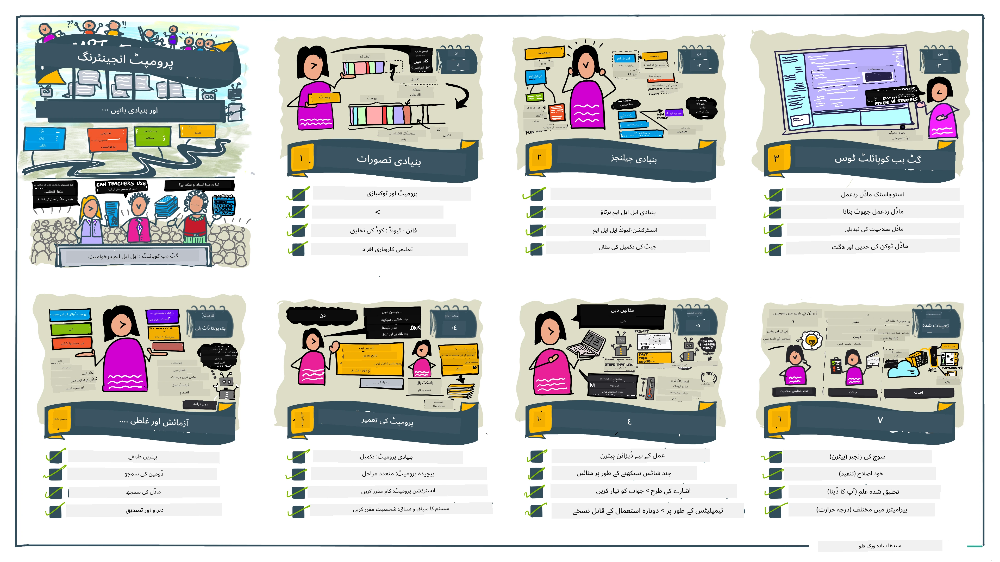
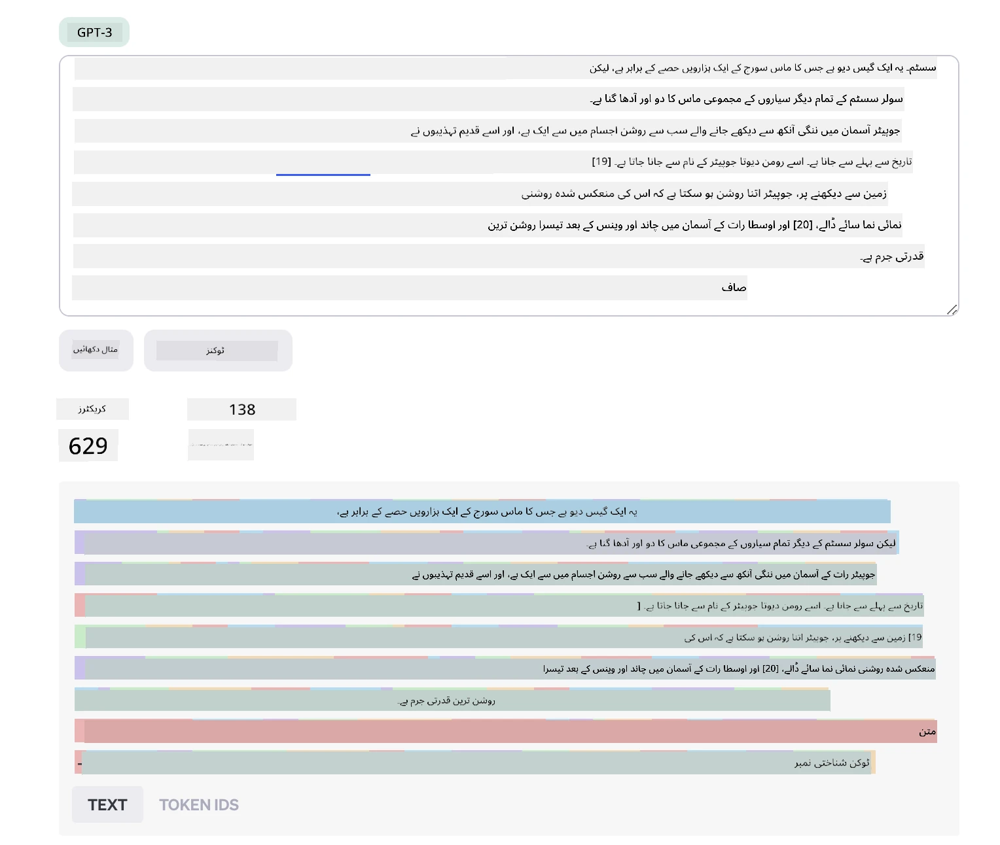
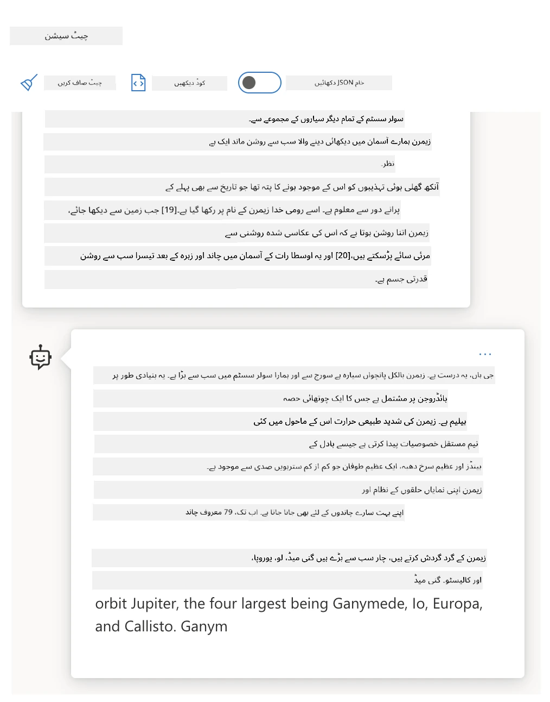
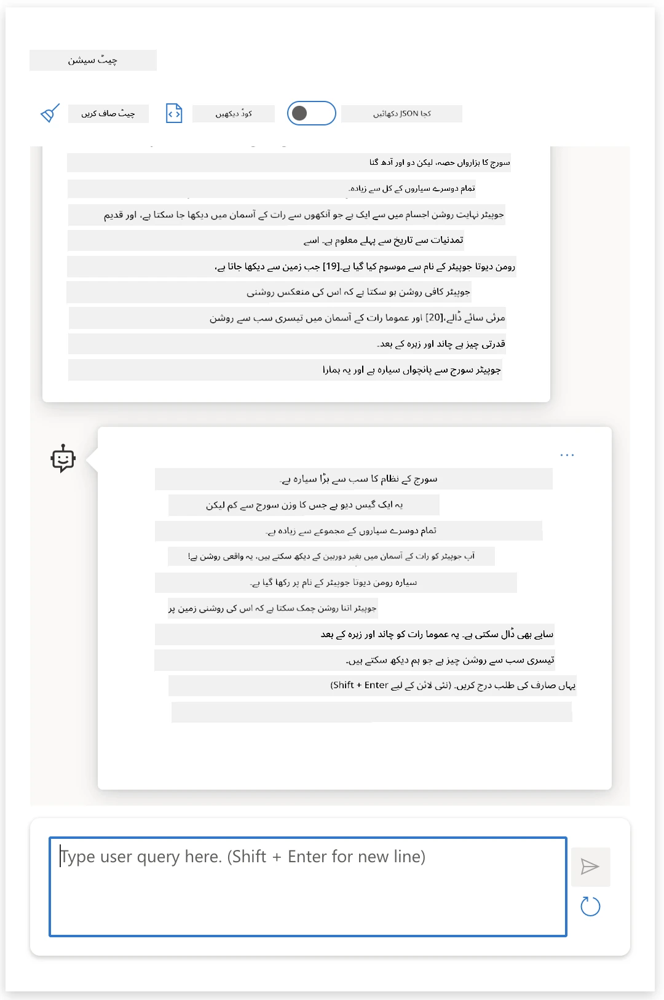
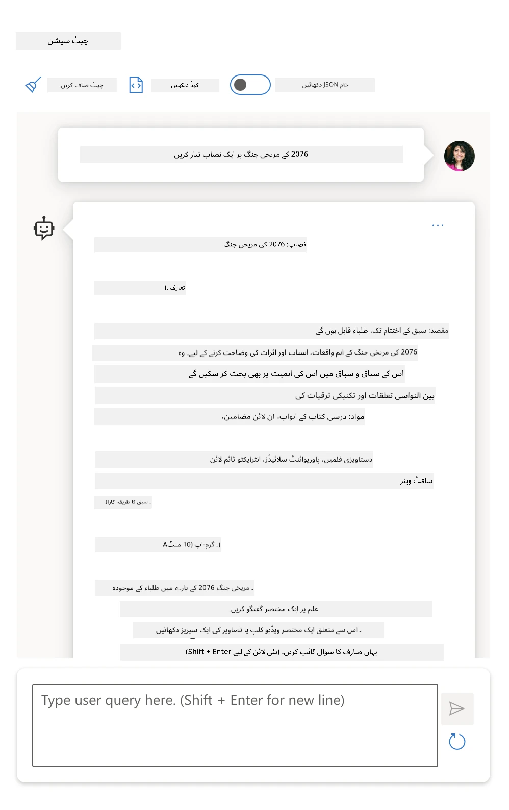
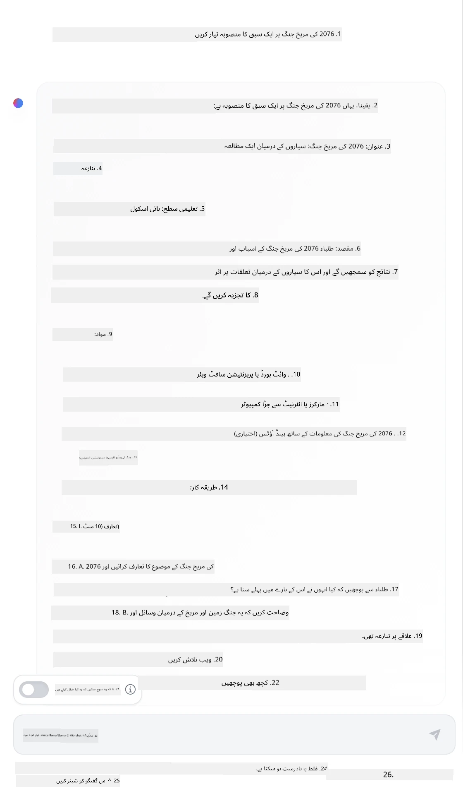

# پرامپٹ انجینئرنگ کی بنیادی باتیں

[](https://youtu.be/GElCu2kUlRs?si=qrXsBvXnCW12epb8)

## تعارف
یہ ماڈیول تخلیقی AI ماڈلز میں مؤثر پرامپٹس بنانے کے لیے ضروری تصورات اور تکنیکوں کا احاطہ کرتا ہے۔ جس طرح آپ LLM کو پرامپٹ لکھتے ہیں وہ بھی اہم ہے۔ ایک احتیاط سے تیار کردہ پرامپٹ بہتر معیار کا ردعمل حاصل کر سکتا ہے۔ لیکن بالکل یہ کیا معنی رکھتا ہے جیسے _پرامپٹ_ اور _پرامپٹ انجینئرنگ_؟ اور میں LLM کو بھیجی گئی پرامپٹ _ان پٹ_ کو کیسے بہتر بنا سکتا ہوں؟ یہ وہ سوالات ہیں جن کے ہم اس باب اور اگلے باب میں جواب دینے کی کوشش کریں گے۔

_تخلیقی AI_ نئے مواد (جیسے متن، تصاویر، آڈیو، کوڈ وغیرہ) بنا سکتا ہے صارف کی درخواستوں کے جواب میں۔ یہ _بڑے زبان کے ماڈلز_ جیسے OpenAI کا GPT ("Generative Pre-trained Transformer") سیریز استعمال کرتا ہے جو قدرتی زبان اور کوڈ کے استعمال کے لیے تربیت یافتہ ہوتے ہیں۔

صارفین اب ان ماڈلز کے ساتھ چیٹ جیسے جان پہچان والے طریقوں سے بات چیت کر سکتے ہیں، بغیر کسی تکنیکی مہارت یا تربیت کے۔ ماڈلز _پرامپٹ پر مبنی_ ہوتے ہیں - صارف ٹیکسٹ ان پٹ (پرامپٹ) بھیجتا ہے اور AI کا جواب (مکملہ) حاصل کرتا ہے۔ پھر وہ "AI کے ساتھ بات چیت" کرتے ہیں، بار بار گفتگو کرتے ہوئے، تاکہ پرامپٹ کو بہتر بنائیں جب تک جواب ان کی توقعات سے میل نہ کھائے۔

"پرامپٹس" اب تخلیقی AI ایپس کے لیے بنیادی _پروگرامنگ انٹرفیس_ بن جاتے ہیں، جو ماڈلز کو بتاتے ہیں کہ کیا کرنا ہے اور موصولہ جوابات کے معیار کو متاثر کرتے ہیں۔ "پرامپٹ انجینئرنگ" ایک تیزی سے بڑھتا ہوا مطالعہ کا شعبہ ہے جو پرامپٹس کے _ڈیزائن اور اصلاح_ پر توجہ دیتا ہے تاکہ مستقل اور معیاری جوابات بڑے پیمانے پر فراہم کیے جا سکیں۔

## سیکھنے کے مقاصد

اس سبق میں، ہم جانیں گے کہ پرامپٹ انجینئرنگ کیا ہے، یہ کیوں اہم ہے، اور ہم ایک مخصوص ماڈل اور ایپلیکیشن کے مقصد کے لیے مزید مؤثر پرامپٹس کیسے تخلیق کر سکتے ہیں۔ ہم پرامپٹ انجینئرنگ کے بنیادی تصورات اور بہترین طریقوں کو سمجھیں گے - اور ایک انٹرایکٹو Jupyter Notebooks "سینڈباکس" ماحول کے بارے میں جانیں گے جہاں ہم ان تصورات کو حقیقی مثالوں پر لاگو ہوتے دیکھ سکتے ہیں۔

اس سبق کے اختتام تک ہم قابل ہوں گے:

1. وضاحت کریں کہ پرامپٹ انجینئرنگ کیا ہے اور یہ کیوں اہم ہے۔
2. پرامپٹ کے اجزاء کو بیان کریں اور ان کے استعمال کو سمجھیں۔
3. پرامپٹ انجینئرنگ کے بہترین طریقے اور تکنیک سیکھیں۔
4. سیکھی گئی تکنیکوں کو حقیقی مثالوں پر لاگو کریں، OpenAI اینڈ پوائنٹ کا استعمال کرتے ہوئے۔

## اہم اصطلاحات

پرامپٹ انجینئرنگ: AI ماڈلز کو مطلوبہ نتائج پیدا کرنے کی طرف رہنمائی کرنے کے لیے ان پٹ کو ڈیزائن اور بہتر بنانے کا عمل۔
ٹوکنائزیشن: ٹیکسٹ کو چھوٹے حصوں یعنی ٹوکنز میں تبدیل کرنے کا عمل، جسے ماڈل سمجھ کر پروسیس کر سکتا ہے۔
انسٹرکشن-ٹیونڈ LLMs: وہ بڑے زبان کے ماڈلز جو مخصوص ہدایات کی مدد سے بہتر جواب دہی اور مطابقت کے لیے فائن ٹون کیے گئے ہوں۔

## لرننگ سینڈباکس

پرامپٹ انجینئرنگ فی الحال زیادہ فن ہے بجائے سائنس کے۔ اس میں ہماری سمجھ بہتر بنانے کا بہترین طریقہ یہ ہے کہ _زیادہ مشق کریں_ اور آزمائش اور غلطی کا طریقہ اپنائیں جو درخواست کے شعبے کی مہارت، تجویز کردہ تکنیکوں اور ماڈل کی مخصوص بہتریوں کو ملاتا ہے۔

اس سبق کے ساتھ فراہم کردہ Jupyter Notebook ایک _سینڈباکس_ ماحول مہیا کرتا ہے جہاں آپ سیکھے گئے چیزوں کو آزما سکتے ہیں - جیسے جیسے جاتے ہیں یا آخر میں کوڈ چیلنج کے حصے کے طور پر۔ مشقیں کرنے کے لیے آپ کو درکار ہے:

1. **Azure OpenAI API کی چابی** - تعینات LLM کے لیے سروس اینڈ پوائنٹ۔
2. **Python Runtime** - جس میں نوٹ بک چلائی جا سکے۔
3. **مقامی ایچوائرمنٹس ویریئبلز** - _ابھی [SETUP](./../00-course-setup/02-setup-local.md?WT.mc_id=academic-105485-koreyst) کے مراحل مکمل کریں تاکہ تیار ہو جائیں_۔

نوٹ بک میں _ابتدائی_ مشقیں دی گئی ہیں - لیکن آپ کو حوصلہ افزائی کی جاتی ہے کہ اپنی _مارک ڈاؤن_ (تفصیل) اور _کوڈ_ (پرامپٹ درخواستیں) کے حصے شامل کریں تاکہ مزید مثالیں یا خیالات آزما سکیں - اور پرامپٹ ڈیزائن کے لیے اپنی سمجھ بیدار کریں۔

## مصورانہ رہنما

کیا آپ اس سبق کا مجموعی جائزہ لینا چاہتے ہیں اس میں گہرائی میں جانے سے پہلے؟ اس مصوراتی رہنما کو دیکھیں، جو آپ کو اس کے اہم موضوعات اور ہر ایک کے لیے کلیدی نکات کا احساس دلاتا ہے۔ سبق کا روڈ میپ آپ کو بنیادی تصورات اور چیلنجوں کی سمجھ سے لے کر متعلقہ پرامپٹ انجینئرنگ تکنیکوں اور بہترین طریقوں کے ذریعے حل تلاش کرنے تک لے جاتا ہے۔ نوٹ کریں کہ اس رہنما میں "اعلی تکنیکیں" سیکشن اس نصاب کے _اگلے_ باب کے مواد سے متعلق ہے۔



## ہمارا اسٹارٹ اپ

اب، بات کرتے ہیں کہ _یہ موضوع_ ہمارے اسٹارٹ اپ مشن سے کیسے منسلک ہے جو [تعلیم میں AI کی جدت لانا](https://educationblog.microsoft.com/2023/06/collaborating-to-bring-ai-innovation-to-education?WT.mc_id=academic-105485-koreyst) چاہتا ہے۔ ہم _ذاتی نوعیت کی تعلیم_ کی AI سے چلنے والی ایپس بنانا چاہتے ہیں - تو آئیں سوچیں کہ ہمارے ایپ کے مختلف صارفین پرامپٹس کیسے "ڈیزائن" کر سکتے ہیں:

- **ایڈمنسٹریٹرز** AI سے درخواست کر سکتے ہیں کہ _نصاب کے ڈیٹا کا تجزیہ کریں تاکہ کوریج میں خلا کی نشاندہی ہو سکے۔_ AI نتائج کو خلاصہ کر سکتا ہے یا کوڈ کے ساتھ بصری بنا سکتا ہے۔
- **اساتذہ** AI سے _نشانی شدہ ناظرین اور موضوع کے لیے درس منصوبہ تیار کرنے_ کے لیے کہہ سکتے ہیں۔ AI مخصوص فارمیٹ میں ذاتی نوعیت کا منصوبہ بنا سکتا ہے۔
- **طلباء** AI سے _مشکل مضمون میں تدریس کرنے_ کے لیے کہہ سکتے ہیں۔ AI اب طلباء کو ان کے سطح کے مطابق اسباق، اشارے اور مثالوں کے ذریعے رہنمائی کر سکتا ہے۔

یہ صرف ابتدائی بات ہے۔ دیکھیں [Prompts For Education](https://github.com/microsoft/prompts-for-edu/tree/main?WT.mc_id=academic-105485-koreyst) - ایک اوپن سورس پرامپٹ لائبریری جو تعلیم کے ماہرین نے تیار کی ہے - تاکہ امکانات کا وسیع تر اندازہ لگایا جا سکے! _ان پرامپٹس کو سینڈباکس میں چلانے یا OpenAI Playground میں آزمانے کی کوشش کریں اور دیکھیں کیا ہوتا ہے!_

<!--
LESSON TEMPLATE:
یہ یونٹ بنیادی تصور #1 کا احاطہ کرے۔
تصور کو مثالوں اور حوالہ جات کے ساتھ مضبوط کریں۔

تصور #1:
پرامپٹ انجینئرنگ۔
اس کی وضاحت کریں اور بتائیں کہ یہ کیوں ضروری ہے۔
-->

## پرامپٹ انجینئرنگ کیا ہے؟

ہم نے اس سبق کا آغاز **پرامپٹ انجینئرنگ** کی تعریف سے کیا ہے جو کہ یہ عمل ہے کہ ایک مخصوص ایپلیکیشن کے مقصد اور ماڈل کے لیے مستقل اور معیاری جوابات (مکملہ) فراہم کرنے کے لیے متن کے ان پٹ (پرامپٹس) کو _ڈیزائن اور بہتر_ کیا جائے۔ ہم اسے دو قدمی عمل سمجھ سکتے ہیں:

- کسی مخصوص ماڈل اور مقصد کے لیے ابتدائی پرامپٹ _ڈیزائن کرنا_
- جوابی معیار کو بہتر بنانے کے لیے پرامپٹ کو بار بار _بہتر بنانا_

یہ لازمی طور پر آزمائش اور غلطی کا عمل ہے جس میں صارف کی سمجھ اور کوشش کی ضرورت ہوتی ہے تاکہ بہترین نتائج حاصل کیے جا سکیں۔ تو یہ کیوں اہم ہے؟ اس سوال کا جواب دینے کے لیے ہمیں پہلے تین تصورات کو سمجھنا ہوگا:

- _ٹوکنائزیشن_ = ماڈل پرامپٹ کو کیسے "دیکھتا" ہے
- _بیس LLMs_ = فاؤنڈیشن ماڈل پرامپٹ کو کیسے "پروسیس" کرتا ہے
- _انسٹرکشن-ٹیونڈ LLMs_ = ماڈل اب "کاموں" کو کیسے دیکھ سکتا ہے

### ٹوکنائزیشن

ایک LLM پرامپٹ کو _ٹوکنز کے تسلسل_ کے طور پر دیکھتا ہے جہاں مختلف ماڈلز (یا ایک ماڈل کے مختلف ورژنز) ایک ہی پرامپٹ کو مختلف طریقوں سے ٹوکنائز کر سکتے ہیں۔ چونکہ LLMs کو ٹوکنز پر تربیت دی جاتی ہے (نا کہ خام متن پر)، اس لیے پرامپٹس کا ٹوکنائز ہونا پیدا شدہ جواب کے معیار پر سیدھا اثر ڈالता ہے۔

ٹوکنائزیشن کو سمجھنے کے لیے، نیچے دیے گئے [OpenAI Tokenizer](https://platform.openai.com/tokenizer?WT.mc_id=academic-105485-koreyst) جیسے ٹولز آزمائیں۔ اپنا پرامپٹ کاپی کریں - اور دیکھیں کہ وہ ٹوکنز میں کیسے تبدیل ہوتا ہے، اور دھیان دیں کہ سفید جگہ کے کریکٹرز اور رموز کیسے ہینڈل ہوتے ہیں۔ نوٹ کریں کہ یہ مثال ایک پرانے LLM (GPT-3) کو دکھاتی ہے - اس لیے نئے ماڈل کے ساتھ آزمائش مختلف نتیجہ دے سکتی ہے۔



### تصور: فاؤنڈیشن ماڈلز

ایک بار جب پرامپٹ ٹوکنائز ہو جائے، تو ["بیس LLM"](https://blog.gopenai.com/an-introduction-to-base-and-instruction-tuned-large-language-models-8de102c785a6?WT.mc_id=academic-105485-koreyst) (یا فاؤنڈیشن ماڈل) کا بنیادی کام اس تسلسل میں اگلے ٹوکن کی پیشگوئی کرنا ہوتا ہے۔ چونکہ LLMs کو بڑی متن کی ڈیٹاسیٹوں پر تربیت دی گئی ہے، انہیں ٹوکنز کے درمیان شماریاتی تعلقات کا اچھا اندازہ ہوتا ہے اور وہ اپنی پیشگوئی کچھ حد تک اعتماد کے ساتھ کر سکتے ہیں۔ نوٹ کریں کہ وہ پرامپٹ یا ٹوکن میں الفاظ کا _معنی_ نہیں سمجھتے؛ وہ صرف ایک نمونہ دیکھتے ہیں جسے وہ اپنی اگلی پیشگوئی سے "مکمل" کر سکتے ہیں۔ وہ تسلسل کی پیشگوئی جاری رکھ سکتے ہیں جب تک کہ صارف مداخلت یا کچھ پہلے سے طے شدہ شرط سے اسے روکے۔

کیا آپ دیکھنا چاہتے ہیں کہ پرامپٹ پر مبنی مکملہ کیسے کام کرتا ہے؟ اوپر والا پرامپٹ [Microsoft Foundry playground](https://ai.azure.com?WT.mc_id=academic-105485-koreyst) میں طے شدہ ترتیبات کے ساتھ درج کریں۔ سسٹم پرامپٹس کو معلومات کی درخواستوں کے طور پر دیکھتا ہے - لہٰذا آپ کو ایک ایسا مکملہ نظر آئے گا جو اس سیاق و سباق کو پورا کرتا ہے۔

لیکن اگر صارف کسی مخصوص چیز کو دیکھنا چاہتا ہے جو کسی معیار یا کام کے مقصد سے میل کھاتی ہو؟ یہاں _انسٹرکشن-ٹیونڈ_ LLMs کی صورتحال آتی ہے۔



### تصور: انسٹرکشن-ٹیونڈ LLMs

ایک [انسٹرکشن-ٹیونڈ LLM](https://blog.gopenai.com/an-introduction-to-base-and-instruction-tuned-large-language-models-8de102c785a6?WT.mc_id=academic-105485-koreyst) فاؤنڈیشن ماڈل سے شروع ہوتا ہے اور اسے مثالوں یا ان پٹ/آؤٹ پٹ جوڑوں (مثلاً، کثیر موڑ "پیغامات") کے ساتھ فائن ٹون کرتا ہے جن میں واضح ہدایات ہو سکتی ہیں - اور AI کا جواب اس ہدایت کی پیروی کرنے کی کوشش کرتا ہے۔

یہ Reinforcement Learning with Human Feedback (RLHF) جیسی تکنیکوں کا استعمال کرتا ہے جو ماڈل کو ہدایات پر عمل کرنے اور فیڈبیک سے سیکھنے کی تربیت دے سکتا ہے تاکہ وہ جوابات پیدا کرے جو عملی استعمال کے لیے زیادہ موزوں اور صارف کے مقاصد سے متعلق ہوں۔

آئیے اسے آزمائیں - اوپر والے پرامپٹ کو دوبارہ دیکھیں، لیکن اب _سسٹم میسج_ کو درج ذیل ہدایت کے طور پر تبدیل کریں:

> _آپ کو فراہم کردہ مواد کو دوسرے درجے کے طالب علم کے لیے خلاصہ کریں۔ نتیجہ ایک پیراگراف میں 3-5 بلٹ پوائنٹس کے ساتھ رکھیں۔_

دیکھیں کہ نتیجہ اب مطلوبہ مقصد اور فارمیٹ کی عکاسی کرتا ہے؟ ایک معلم اب اسے کلاس کے لیے اپنی سلائیڈز میں براہ راست استعمال کر سکتا ہے۔



## ہمیں پرامپٹ انجینئرنگ کی ضرورت کیوں ہے؟

اب جب ہمیں معلوم ہو گیا ہے کہ LLMs پرامپٹس کو کیسے پروسیس کرتے ہیں، تو بات کرتے ہیں کہ _ہمیں_ پرامپٹ انجینئرنگ کی ضرورت کیوں ہے۔ جواب اس حقیقت میں مضمر ہے کہ موجودہ LLMs کئی چیلنجز پیش کرتے ہیں جو _قابلِ اعتماد اور مستقل مکملے_ حاصل کرنا مشکل بناتے ہیں جب تک کہ ہم پرامپٹ کی تعمیر اور بہتر سازی پر محنت نہ کریں۔ مثال کے طور پر:

1. **ماڈل جوابات متغیر ہوتے ہیں۔** _ایک ہی پرامپٹ_ ممکن ہے مختلف ماڈلز یا ماڈل کے مختلف ورژنز میں مختلف جوابات دے۔ اور ممکن ہے کہ وہ _ایک ہی ماڈل_ میں وقت کے ساتھ مختلف نتائج دیں۔ _پرامپٹ انجینئرنگ تکنیک ہماری مدد کرتی ہیں ان تغیرات کو کم کرنے میں بہتری گارڈریل دے کر_۔

1. **ماڈلز جعلی جوابات بنا سکتے ہیں۔** ماڈلز کی تربیت _بڑے مگر محدود_ ڈیٹاسیٹ پر ہوتی ہے، جس کا مطلب ہے کہ ان کے پاس تربیت کے دائرہ کار سے باہر کے تصورات کی معلومات نہیں ہوتی۔ نتیجتاً وہ ایسی مکملے پیدا کر سکتے ہیں جو غلط، فرضی یا معلوم حقائق سے بالکل مختلف ہوں۔ _پرامپٹ انجینئرنگ تکنیک صارفین کی مدد کرتی ہیں کہ وہ ایسی جعلسازیوں کی نشاندہی کریں اور ان کو کم کریں، مثلاً AI سے حوالہ جات یا استدلال مانگ کر_۔

1. **ماڈلز کی صلاحیتیں مختلف ہوں گی۔** نئے ماڈلز یا نسلیں زیادہ صلاحیتوں کے حامل ہوں گے مگر ان کے منفرد جھمز اور لاگت و پیچیدگی کے اختلافات بھی ہوں گے۔ _پرامپٹ انجینئرنگ ہماری مدد کرتی ہے بہترین طریقہ کار اور ورک فلو تیار کرنے میں جو اختلافات کو چھپا سکیں اور ماڈل کی مخصوص ضروریات کے مطابق پیمانے پر اور بغیر کسی رکاوٹ کے ڈھل جائیں_۔

آئیے اسے OpenAI یا Azure OpenAI Playground میں عملی طور پر دیکھیں:

- مختلف LLM تعیناتیوں (جیسے OpenAI، Azure OpenAI، Hugging Face) کے ساتھ ایک ہی پرامپٹ استعمال کریں - کیا آپ نے اختلافات دیکھے؟
- ایک ہی LLM تعیناتی (مثلاً Azure OpenAI playground) کے ساتھ بار بار ایک ہی پرامپٹ استعمال کریں - ان اختلافات میں کیا فرق تھا؟

### جعل سازی کی مثال

اس کورس میں، ہم اصطلاح **"جعلیہ"** استعمال کرتے ہیں تاکہ اس واقعے کا حوالہ دیں جب LLMs کبھی کبھار غلط معلومات پیدا کرتے ہیں جس کی وجہ ان کی تربیت کی حدود یا دیگر پابندیاں ہوتی ہیں۔ آپ نے اسے مشہور مضامین یا تحقیقی مقالوں میں _"ہیلوسینیشن"_ کے طور پر بھی سنا ہوگا۔ تاہم، ہم سختی سے سفارش کرتے ہیں کہ _"جعلیہ"_ استعمال کریں تاکہ ہم مشین سے چلنے والے نتیجے کو انسانی صفات سے منسوب کرنے کی غلطی نہ کریں۔ یہ [ذمہ دار AI رہنما خطوط](https://www.microsoft.com/ai/responsible-ai?WT.mc_id=academic-105485-koreyst) کو بھی اصطلاحات کے لحاظ سے مضبوط کرتا ہے، ان اصطلاحات کو ختم کر کے جو بعض سیاق و سباق میں توہین آمیز یا غیر شمولیتی ہو سکتی ہیں۔

جعلیہ کے کام کرنے کے اندازہ کے لیے، ایک ایسا پرامپٹ سوچیں جو AI کو غیر موجود موضوع کے لیے مواد تیار کرنے کی ہدایت دیتا ہے (یقینی بنانے کے لیے کہ یہ تربیتی ڈیٹاسیٹ میں نہ ہو)۔ مثلاً - میں نے یہ پرامپٹ آزمایا:

> **پرامپٹ:** 2076 کے مارس وار پر ایک درس منصوبہ تیار کریں۔

ویب تلاش نے بتایا کہ مارس جنگوں پر خیالی کہانیاں (جیسے ٹی وی سیریز یا کتابیں) موجود ہیں مگر 2076 میں نہیں۔ عام فہم بھی بتاتی ہے کہ 2076 _مستقبل میں ہے_ اور لہٰذا اسے حقیقی واقعے سے جوڑنا ممکن نہیں۔


تو جب ہم یہ پرامپٹ مختلف LLM فراہم کرنے والوں کے ساتھ چلائیں تو کیا ہوتا ہے؟

> **جواب 1**: OpenAI Playground (GPT-35)


> **جواب 2**: Azure OpenAI Playground (GPT-35)



> **جواب 3**: : Hugging Face Chat Playground (LLama-2)



جیسا کہ توقع کی جاتی ہے، ہر ماڈل (یا ماڈل ورژن) تھوڑا مختلف جوابات پیدا کرتا ہے، اس کی وجہ سٹوکاسٹک رویہ اور ماڈل کی صلاحیت میں فرق ہے۔ مثال کے طور پر، ایک ماڈل 8ویں جماعت کے سامعین کو ہدف بناتا ہے جبکہ دوسرا ہائی اسکول کے طالبعلم کو فرض کرتا ہے۔ لیکن تینوں ماڈلز نے ایسے جوابات دیے جو ایک بے خبر صارف کو یقین دلاسکتے ہیں کہ واقعہ واقعی تھا۔

پرامپٹ انجینئرنگ کی تکنیک جیسے _میٹا پرامپٹنگ_ اور _ٹیمپریچر کنفیگریشن_ کسی حد تک ماڈل کی ترکیب سازی کو کم کر سکتی ہیں۔ نئے پرامپٹ انجینئرنگ _آرکیٹیکچرز_ بھی نئے ٹولز اور تکنیکوں کو بغیر کسی رکاوٹ کے پرامپٹ فلو میں شامل کرتے ہیں، تاکہ ان اثرات کو کم یا روک سکیں۔

## کیس اسٹڈی: گٹ ہب کوپائلٹ

آئیں اس حصے کو یوں ختم کرتے ہیں کہ ہم دیکھیں کہ پرامپٹ انجینئرنگ کو حقیقی دنیا کے حل میں کیسے استعمال کیا جاتا ہے، ایک کیس اسٹڈی کی صورت میں: [GitHub Copilot](https://github.com/features/copilot?WT.mc_id=academic-105485-koreyst)۔

GitHub Copilot آپ کا "AI جوڑا پروگرامر" ہے - یہ متن کے پرامپٹس کو کوڈ مکمل کرنے میں تبدیل کرتا ہے اور آپ کے ترقیاتی ماحول (مثلاً Visual Studio Code) میں مربوط ہوتا ہے تاکہ صارف کا تجربہ آسان ہو۔ نیچے دی گئی بلاگز کی سیریز میں دستاویزی طور پر بتایا گیا ہے کہ ابتدائی ورژن OpenAI Codex ماڈل پر مبنی تھا - جہاں انجینئرز نے جلد ہی ماڈل کو بہتر بنانے اور بہتر پرامپٹ انجینئرنگ تکنیکیں تیار کرنے کی ضرورت کو سمجھ لیا، تاکہ کوڈ کی کوالٹی بہتر ہو سکے۔ جولائی میں، انہوں نے [ایک بہتر AI ماڈل متعارف کرایا جو Codex سے آگے جاتا ہے](https://github.blog/2023-07-28-smarter-more-efficient-coding-github-copilot-goes-beyond-codex-with-improved-ai-model/?WT.mc_id=academic-105485-koreyst) جو تیز تجاویز فراہم کرتا ہے۔

پوسٹس کو ترتیب سے پڑھیں تاکہ ان کے سیکھنے کے سفر کو سمجھ سکیں۔

- **مئی 2023** | [GitHub Copilot آپ کے کوڈ کو بہتر سمجھنے لگا ہے](https://github.blog/2023-05-17-how-github-copilot-is-getting-better-at-understanding-your-code/?WT.mc_id=academic-105485-koreyst)
- **مئی 2023** | [GitHub کے اندر: GitHub Copilot کے پیچھے LLMs کے ساتھ کام کرنا](https://github.blog/2023-05-17-inside-github-working-with-the-llms-behind-github-copilot/?WT.mc_id=academic-105485-koreyst)
- **جون 2023** | [GitHub Copilot کے لیے بہتر پرامپٹس کیسے لکھیں](https://github.blog/2023-06-20-how-to-write-better-prompts-for-github-copilot/?WT.mc_id=academic-105485-koreyst)
- **جولائی 2023** | [.. GitHub Copilot بہتر AI ماڈل کے ساتھ Codex سے آگے جاتا ہے](https://github.blog/2023-07-28-smarter-more-efficient-coding-github-copilot-goes-beyond-codex-with-improved-ai-model/?WT.mc_id=academic-105485-koreyst)
- **جولائی 2023** | [ایک ڈویلپر کا پرامپٹ انجینئرنگ اور LLMs کے لیے گائیڈ](https://github.blog/2023-07-17-prompt-engineering-guide-generative-ai-llms/?WT.mc_id=academic-105485-koreyst)
- **ستمبر 2023** | [انٹرپرائز LLM ایپ کیسے بنائیں: GitHub Copilot سے سبق](https://github.blog/2023-09-06-how-to-build-an-enterprise-llm-application-lessons-from-github-copilot/?WT.mc_id=academic-105485-koreyst)

آپ ان کے [انجینئرنگ بلاگ](https://github.blog/category/engineering/?WT.mc_id=academic-105485-koreyst) میں بھی مزید پوسٹس تلاش کر سکتے ہیں جیسے [یہ](https://github.blog/2023-09-27-how-i-used-github-copilot-chat-to-build-a-reactjs-gallery-prototype/?WT.mc_id=academic-105485-koreyst) جو دکھاتی ہے کہ یہ ماڈلز اور تکنیکیں حقیقی دنیا کی ایپلیکیشنز کو چلانے کے لیے کیسے _لاگو_ کی جاتی ہیں۔

---

<!--
سبق کا سانچہ:
یہ یونٹ بنیادی تصور #2 کو کور کرے گا۔
تصور کو مثالوں اور حوالوں کے ساتھ مضبوط کریں۔

تصور #2:
پرامپٹ ڈیزائن۔
مثالوں کے ساتھ وضاحت شدہ۔
-->

## پرامپٹ کی تشکیل

ہم نے دیکھا کہ پرامپٹ انجینئرنگ کیوں ضروری ہے - اب آئیے سمجھتے ہیں کہ پرامپٹس کیسے _تشکیل_ پاتے ہیں تاکہ ہم مختلف تکنیکوں کا جائزہ لے سکیں جو زیادہ موثر پرامپٹ ڈیزائن کے لیے استعمال ہوتی ہیں۔

### بنیادی پرامپٹ

آئیے بنیادی پرامپٹ سے شروع کرتے ہیں: ایک متن کا ان پٹ جو ماڈل کو بھیجا جاتا ہے بغیر کسی اور سیاق و سباق کے۔ یہاں ایک مثال ہے - جب ہم US کے قومی ترانے کے پہلے چند الفاظ OpenAI [Completion API](https://platform.openai.com/docs/api-reference/completions?WT.mc_id=academic-105485-koreyst) کو بھیجتے ہیں تو یہ فوری طور پر اگلی چند لائنیں _مکمل_ کرتا ہے، جو بنیادی پیش گوئی کے رویے کی مثال ہے۔

| پرامپٹ (ان پٹ)      | مکمل (آؤٹ پٹ)                                                                                                                        |
| :----------------- | :----------------------------------------------------------------------------------------------------------------------------------------- |
| اوہ کہو کیا تم دیکھ سکتے ہو | یہ لگتا ہے کہ آپ "The Star-Spangled Banner" کے بول شروع کر رہے ہیں، جو ریاستہائے متحدہ کا قومی ترانہ ہے۔ مکمل بول یہ ہیں ... |

### پیچیدہ پرامپٹ

اب آئیے اس بنیادی پرامپٹ میں سیاق و سباق اور ہدایات شامل کریں۔ [Chat Completion API](https://learn.microsoft.com/azure/ai-services/openai/how-to/chatgpt?WT.mc_id=academic-105485-koreyst) ہمیں ایک پیچیدہ پرامپٹ کو _پیغامات_ کے مجموعہ کے طور پر تشکیل دینے دیتا ہے جس میں:

- ان پٹ/آؤٹ پٹ جوڑے جو _صارف_ کے ان پٹ اور _اسسٹنٹ_ کے جواب کی عکاسی کرتے ہیں۔
- سسٹم میسج جو معاون کے رویے یا شخصیت کے لیے سیاق و سباق طے کرتا ہے۔

درخواست اب درج ذیل شکل میں ہے، جہاں _ٹوکنائزیشن_ مؤثر طریقے سے سیاق و سباق اور گفتگو سے متعلق معلومات پکڑتی ہے۔ اب، سسٹم کے سیاق و سباق کو تبدیل کرنا، فراہم کردہ صارف کے ان پٹس کی طرح، مکمل کرنے کے معیار پر اثرانداز ہو سکتا ہے۔

```python
response = client.responses.create(
    model="gpt-4o-mini",
    input=[
        {"role": "system", "content": "You are a helpful assistant."},
        {"role": "user", "content": "Who won the world series in 2020?"},
        {"role": "assistant", "content": "The Los Angeles Dodgers won the World Series in 2020."},
        {"role": "user", "content": "Where was it played?"}
    ]
)
```

### ہدایت پرامپٹ

اوپر دی گئی مثالوں میں، صارف کا پرامپٹ ایک سادہ متن کی تلاش تھی جسے معلومات کی درخواست کے طور پر سمجھا جا سکتا تھا۔ _ہدایت_ پرامپٹس کے ساتھ، ہم اس متن کو مزید تفصیل سے کسی کام کی وضاحت کے لیے استعمال کر سکتے ہیں، AI کو بہتر رہنمائی فراہم کرتے ہوئے۔ یہاں ایک مثال ہے:

| پرامپٹ (ان پٹ)                                                                                                                                                                                                                         | مکمل (آؤٹ پٹ)                                                                                                        | ہدایت کی قسم         |
| :------------------------------------------------------------------------------------------------------------------------------------------------------------------------------------------------------------------------------------- | :------------------------------------------------------------------------------------------------------------------------- | :------------------ |
| خانہ جنگی کی وضاحت لکھیں                                                                                                                                                                                                   | _ایک سادہ پیراگراف واپس کیا_                                                                                              | سادہ                |
| خانہ جنگی کی وضاحت لکھیں۔ اہم تاریخیں اور واقعات درج کریں اور ان کی اہمیت بیان کریں                                                                                                                                     | _ایک پیراگراف واپس کیا اور اس کے بعد اہم واقعات کی تاریخوں کی فہرست دی گئی_                                             | پیچیدہ              |
| خانہ جنگی کی وضاحت 1 پیراگراف میں لکھیں۔ 3 بلٹ پوائنٹس میں اہم تاریخیں اور ان کی اہمیت فراہم کریں۔ 3 بلٹ پوائنٹس مزید تاریخی شخصیات اور ان کے کرداروں کے بارے میں فراہم کریں۔ نتیجہ JSON فائل کی صورت میں واپس کریں | _تفصیلی معلومات واپس کرتا ہے جسے آپ JSON کی شکل میں کاپی کرکے فائل میں پیسٹ کر کے جہاں چاہیں تصدیق کر سکتے ہیں_ | پیچیدہ۔ فارمیٹ شدہ۔   |

## بنیادی مواد

اوپر دی گئی مثالوں میں، پرامپٹ اب بھی کافی کھلا ہوا تھا، LLM کو یہ فیصلہ کرنے کی اجازت دیتا تھا کہ اس کے پری ٹرینڈ ڈیٹا سیٹ کا کون سا حصہ متعلقہ ہے۔ _بنیادی مواد_ ڈیزائن پیٹرن کے ساتھ، ان پٹ متن کو دو حصوں میں تقسیم کیا جاتا ہے:

- ایک ہدایت (عمل)
- متعلقہ مواد (جو عمل کو متاثر کرتا ہے)

یہاں ایک مثال ہے جہاں ہدایت ہے "اسے 2 جملوں میں خلاصہ کریں"۔

| پرامپٹ (ان پٹ)                                                                                                                                                                                                                                                                                                                                                                                                                                                                                                                                                                                                                                                                                      | مکمل (آؤٹ پٹ)                                                                                                                                                                                                                                                                             |
| :-------------------------------------------------------------------------------------------------------------------------------------------------------------------------------------------------------------------------------------------------------------------------------------------------------------------------------------------------------------------------------------------------------------------------------------------------------------------------------------------------------------------------------------------------------------------------------------------------------------------------------------------------------------------------------------------------- | :---------------------------------------------------------------------------------------------------------------------------------------------------------------------------------------------------------------------------------------------------------------------------------------------- |
| مشتری سورج سے پانچواں سیارہ ہے اور نظام شمسی میں سب سے بڑا ہے۔ یہ ایک گیس کا دیو ہے جس کی ماس سورج کی ماس کا ایک ہزارواں حصہ ہے، لیکن نظام شمسی کے تمام دیگر سیاروں کی کل وزن کے دو اور آدھا گنا ہے۔ مشتری ننگی آنکھ سے نظر آنے والے آسمان کے سب سے روشن اجسام میں سے ہے، اور قدیم تہذیبوں کے لیے تاریخی ریکارڈ سے پہلے سے جانا جاتا ہے۔ اسے رومن خدا مشتری کا نام دیا گیا ہے.[19] جب زمین سے دیکھا جائے، تو مشتری اتنا روشن ہوسکتا ہے کہ اس کی عکاسی روشنی دیکھنے میں سائے ڈال سکتی ہے،[20] اور یہ چاند اور زہرہ کے بعد اوسطاً آسمان میں تیسرا روشن ترین قدرتی جسم ہے۔ <br/> **اسے 2 مختصر جملوں میں خلاصہ کریں** | مشتری، جو سورج سے پانچواں سیارہ ہے، نظام شمسی میں سب سے بڑا ہے اور رات کے آسمان میں سب سے روشن اجسام میں سے ایک کے طور پر جانا جاتا ہے۔ رومن خدا مشتری کے نام پر رکھا گیا، یہ ایک گیس کا دیو ہے جس کی ماس نظام شمسی کے تمام دوسرے سیاروں کی کل وزن کے دو اور آدھے گنا ہے۔ |

بنیادی مواد کے حصے کو مختلف طریقوں سے موثر ہدایات دینے کے لیے استعمال کیا جا سکتا ہے:

- **مثالیں** - ماڈل کو ایک واضح ہدایت دینے کی بجائے، اسے کیے جانے والے کام کی مثالیں دیں تاکہ وہ پیٹرن خود سمجھ سکے۔
- **اشارے** - ہدایت کے بعد ایک "اشارہ" دیں جو مکمل کرنے کی سمت کا تعین کرے، ماڈل کو زیادہ متعلقہ جوابات کی طرف رہنمائی کرتے ہوئے۔
- **سانچے** - یہ دہرائے جانے والے 'نسخے' ہیں جن میں جگہ دار (ویری ایبلز) ہوتے ہیں جنہیں مخصوص استعمال کے لیے ڈیٹا کے ساتھ حسب ضرورت بنایا جا سکتا ہے۔

آئیں انہیں عمل میں دریافت کریں۔

### مثالوں کا استعمال

یہ ایک طریقہ ہے جہاں آپ بنیادی مواد کو "ماڈل کو کچھ مثالیں کھلانے" کے لیے استعمال کرتے ہیں کہ دی گئی ہدایت کے لیے مطلوبہ آؤٹ پٹ کیا ہونا چاہیے، اور یہ پیٹرن اخذ کرنے دیتا ہے۔ فراہم کی گئی مثالوں کی تعداد کی بنیاد پر ہم زیرو شاٹ پرامپٹنگ، ون شاٹ پرامپٹنگ، فیو شاٹ پرامپٹنگ وغیرہ کر سکتے ہیں۔

اب پرامپٹ تین اجزاء پر مشتمل ہے:

- کام کی وضاحت
- مطلوبہ آؤٹ پٹ کی چند مثالیں
- نئی مثال کی شروعات (جو ایک ضمنی کام کی وضاحت بن جاتی ہے)

| سیکھنے کی قسم | پرامپٹ (ان پٹ)                                                                                                                                        | مکمل (آؤٹ پٹ)          |
| :------------ | :---------------------------------------------------------------------------------------------------------------------------------------------------- | :-------------------------- |
| زیرو شاٹ    | "سورج چمک رہا ہے"۔ اسے ہسپانوی میں ترجمہ کریں                                                                                                            | "El Sol está brillando".    |
| ون شاٹ       | "سورج چمک رہا ہے" => ""El Sol está brillando". <br> "یہ سرد اور ہوا دار دن ہے" =>                                                                 | "Es un día frío y ventoso". |
| فیو شاٹ      | کھلاڑی نے بیسز دوڑا => بیس بال <br/> کھلاڑی نے ایس مارا => ٹینس <br/> کھلاڑی نے چھ مارا => کرکٹ <br/> کھلاڑی نے سلیم ڈنک کیا => | باسکٹ بال                  |
|              |                                                                                                                                                       |                             |

دیکھیں کہ زیرو شاٹ پرامپٹنگ میں ہمیں واضح ہدایت دینی پڑی ("ہسپانوی میں ترجمہ کریں")، لیکن ون شاٹ پرامپٹنگ کی مثال میں یہ خیال کیا جاتا ہے۔ فیو شاٹ مثال ظاہر کرتی ہے کہ زیادہ مثالیں دینے سے ماڈلز کو بغیر اضافی ہدایت کے زیادہ درست اندازے لگانے میں مدد ملتی ہے۔

### پرامپٹ اشارے

بنیادی مواد کا استعمال کرنے کی ایک اور تکنیک _اشارے_ فراہم کرنا ہے بجائے مثالوں کے۔ اس صورت میں، ہم ماڈل کو مطلوبہ جواب کے فارمٹ کی عکاسی کرنے والے ایک ٹکڑے سے _شروع_ کر کے اسے درست سمت میں ہلکی مدد دیتے ہیں۔ ماڈل پھر "اشارہ لیتا ہے" اور اسی انداز میں جاری رکھتا ہے۔

| اشاروں کی تعداد | پرامپٹ (ان پٹ)                                                                                                                                                                                                                                                                                                                                                                                                                                               | مکمل (آؤٹ پٹ)                                                                                                                                                                                                                                                                                       |
| :------------- | :----------------------------------------------------------------------------------------------------------------------------------------------------------------------------------------------------------------------------------------------------------------------------------------------------------------------------------------------------------------------------------------------------------------------------------------------------------- | :-------------------------------------------------------------------------------------------------------------------------------------------------------------------------------------------------------------------------------------------------------------------------------------------------------- |
| 0              | مشتری سورج سے پانچواں سیارہ ہے اور نظام شمسی میں سب سے بڑا ہے۔ یہ ایک گیس کا دیو ہے جس کی ماس سورج کی ماس کا ایک ہزارواں حصہ ہے، لیکن نظام شمسی کے تمام دیگر سیاروں کی کل وزن کے دو اور آدھا گنا ہے۔ مشتری ننگی آنکھ سے نظر آنے والے آسمان کے سب سے روشن اجسام میں سے ہے، اور قدیم تہذیبوں کے لیے تاریخی ریکارڈ سے پہلے سے جانا جاتا ہے۔ <br/>**اسے خلاصہ کریں**                                       | مشتری نظام شمسی کا سب سے بڑا سیارہ ہے اور سورج سے پانچواں نمبر ہے۔ یہ ایک گیس کا دیو ہے جس کی ماس سورج کے ماس کا 1/1000 حصہ ہے، لیکن یہ تمام دوسرے سیاروں کے مجموعے سے بھاری ہے۔ قدیم تہذیبوں نے مشتری کو بہت پہلے سے جانا ہے، اور یہ رات کے آسمان میں آسانی سے دکھائی دیتا ہے۔ |
| 1              | مشتری سورج سے پانچواں سیارہ ہے اور نظام شمسی میں سب سے بڑا ہے۔ یہ ایک گیس کا دیو ہے جس کی ماس سورج کی ماس کا ایک ہزارواں حصہ ہے، لیکن نظام شمسی کے تمام دیگر سیاروں کی کل وزن کے دو اور آدھا گنا ہے۔ مشتری ننگی آنکھ سے نظر آنے والے آسمان کے سب سے روشن اجسام میں سے ہے، اور قدیم تہذیبوں کے لیے تاریخی ریکارڈ سے پہلے سے جانا جاتا ہے۔ <br/>**اسے خلاصہ کریں** <br/> جو ہم نے سیکھا وہ یہ ہے کہ مشتری | سورج سے پانچواں سیارہ ہے اور نظام شمسی کا سب سے بڑا سیارہ ہے۔ یہ ایک گیس کا دیو ہے جس کی ماس سورج کی ماس کا ایک ہزارواں حصہ ہے، لیکن نظام شمسی کے تمام دیگر سیاروں کے مجموعے کے دو اور آدھا گنا ہے۔ یہ ننگی نظر سے آسانی سے دکھائی دیتا ہے اور قدیم زمانے سے جانا جاتا ہے۔                        |

| 2              | مشتری پانچواں سیارہ ہے جو سورج سے پانچواں اور نظام شمسی کا سب سے بڑا سیارہ ہے۔ یہ ایک گیس دیو ہے جس کا حجم سورج کے حجم کا ایک ہزارواں حصہ ہے، لیکن نظام شمسی کے باقی تمام سیاروں کے مجموعے کے دو اڑھائی گنا ہے۔ مشتری رات کے آسمان میں بغیر دوربین کے نظر آنے والی سب سے روشن چیزوں میں سے ایک ہے، اور قدیم تہذیبوں سے رییکارڈ شدہ تاریخ سے پہلے سے جانا جاتا ہے۔ <br/>**مختصر کریں** <br/> ہم نے جو 3 اہم حقائق سیکھے:         | 1. مشتری پانچواں سیارہ ہے جو سورج سے پانچواں اور نظام شمسی کا سب سے بڑا سیارہ ہے۔ <br/> 2. یہ ایک گیس دیو ہے جس کا حجم سورج کے حجم کا ایک ہزارواں حصہ ہے...<br/> 3. مشتری قدیم زمانے سے بغیر دوربین کے نظر آتا رہا ہے ...                                                                       |
|                |                                                                                                                                                                                                                                                                                                                                                                                                                                                              |                                                                                                                                                                                                                                                                                                           |

### پرامپٹ ٹیمپلیٹس

پرامپٹ ٹیمپلیٹ ایک _پیشگی طے شدہ نسخہ برائے پرامپٹ_ ہے جو ضرورت کے مطابق محفوظ اور دوبارہ استعمال کیا جا سکتا ہے، تاکہ بڑے پیمانے پر صارف تجربات کو مسلسل بنایا جا سکے۔ اپنے آسان ترین شکل میں، یہ صرف پرامپٹ کی مثالوں کا مجموعہ ہے، جیسا کہ [OpenAI کی یہ مثال](https://cookbook.openai.com/examples/gpt4-1_prompting_guide?WT.mc_id=academic-105485-koreyst) جو متعامل پرامپٹ اجزاء (صارف اور نظام پیغامات) اور API کے ذریعہ درخواست کا فارمٹ فراہم کرتی ہے - تاکہ دوبارہ استعمال کی حمایت ہو۔

اس کی زیادہ پیچیدہ شکل میں، جیسا کہ [LangChain کی یہ مثال](https://python.langchain.com/docs/concepts/prompt_templates/?WT.mc_id=academic-105485-koreyst) یہ _پلیس ہولڈرز_ رکھتی ہے جنہیں مختلف ذرائع (صارف کی معلومات، نظام کا سیاق و سباق، خارجی ڈیٹا ذرائع وغیرہ) سے ڈیٹا سے تبدیل کیا جا سکتا ہے تاکہ پرامپٹ کو متحرک طور پر تیار کیا جا سکے۔ اس سے ہمیں ایک لائبریری بنانے کا موقع ملتا ہے جو دوبارہ قابل استعمال پرامپٹس پر مبنی ہے جو بڑے پیمانے پر **پروگرامیشن کے ذریعے** مسلسل صارف تجربات کو چلانے کے لیے استعمال کی جا سکتی ہیں۔

آخرکار، ٹیمپلیٹس کی اصلی قدر _پرامپٹ لائبریریز_ تخلیق کرنے اور شائع کرنے کی صلاحیت میں ہے جو مخصوص عمودی ایپلیکیشن کے دائرہ کار کے لیے ہوتے ہیں - جہاں پرامپٹ ٹیمپلیٹ اب _اپلکیشن کے مخصوص سیاق و سباق یا مثالوں کے مطابق بہتر بنایا جاتا ہے_ تاکہ جوابات ہدف شدہ صارف سامعین کے لیے زیادہ متعلقہ اور درست ہوں۔ [Prompts For Edu](https://github.com/microsoft/prompts-for-edu?WT.mc_id=academic-105485-koreyst) ریپوزیٹری اس نقطہ نظر کی ایک بہترین مثال ہے، جو تعلیمی میدان کے لیے پرامپٹس کی ایک لائبریری مرتب کرتی ہے جس میں اہم مقاصد جیسے سبق کی منصوبہ بندی، نصاب کی ترتیب، طالب علم کی تدریس پر زور دیا گیا ہے۔

## معاون مواد

اگر ہم پرامپٹ کی تخلیق کو ایک ہدایت (کام) اور ایک ہدف (مرکزی مواد) کے طور پر سوچیں، تو _ثانوی مواد_ اضافی سیاق و سباق کی مانند ہوتا ہے جو ہم فراہم کرتے ہیں تاکہ **نتیجہ پر کسی طرح اثر انداز ہوں**۔ یہ ٹوننگ پیرامیٹرز، فارمیٹنگ کی ہدایات، موضوع کی اقسام وغیرہ ہو سکتے ہیں جو ماڈل کو اس کی جواب کو صارف کی مقاصد یا توقعات کے مطابق _ڈھالنے_ میں مدد کرتے ہیں۔

مثال کے طور پر: ایک نصابی کتاب کے کیٹلاگ میں موجود تمام دستیاب کورسز کے بارے میں وسیع میٹا ڈیٹا (نام، وضاحت، سطح، میٹا ڈیٹا ٹیگز، انسٹرکٹر وغیرہ):

- ہم ہدایت دے سکتے ہیں "فال 2023 کے لیے نصابی کتاب کا خلاصہ کریں"
- ہم مرکزی مواد کے طور پر چند مثالیں فراہم کر سکتے ہیں تاکہ مطلوبہ نتیجہ دکھائیں
- ہم ثانوی مواد کے طور پر دلچسپی کے 5 اوپر "ٹیگز" کی نشاندہی کر سکتے ہیں۔

اب، ماڈل چند مثالوں کی طرز پر خلاصہ دے سکتا ہے - لیکن اگر نتیجہ میں کئی ٹیگز ہوں، تو یہ ثانوی مواد میں شناخت شدہ 5 ٹیگز کو ترجیح دے سکتا ہے۔

---

<!--
درس کا سانچہ:
اس یونٹ میں بنیادی تصور #1 شامل ہونا چاہیے۔
تصور کو مثالوں اور حوالوں کے ساتھ مضبوط کریں۔

تصور #3:
پرامپٹ انجینئرنگ کی تکنیکیں۔
پرامپٹ انجینئرنگ کی کچھ بنیادی تکنیکیں کیا ہیں؟
اسے کچھ مشقوں سے واضح کریں۔
-->

## پرامپٹنگ کے بہترین طریقے

اب جب ہمیں معلوم ہو گیا ہے کہ پرامپٹس کو کیسے _تخلیق_ کیا جاتا ہے، تو ہم سوچنا شروع کر سکتے ہیں کہ انہیں کس طرح _ڈیزائن_ کیا جائے تاکہ بہترین طریقوں کی عکاسی ہو۔ ہم اس کو دو حصوں میں سوچ سکتے ہیں - صحیح _ذہنیت_ رکھنا اور درست _تکنیکوں_ کا اطلاق کرنا۔

### پرامپٹ انجینئرنگ ذہنیت

پرامپٹ انجینئرنگ ایک آزمائش اور غلطی کا عمل ہے لہٰذا تین وسیع رہنما اصولوں کو یاد رکھیں:

1. **ڈومین کی سمجھ ضروری ہے۔** جواب کی درستگی اور مطابقت اس _ڈومین_ پر منحصر ہے جس میں وہ ایپلیکیشن یا صارف کام کرتا ہے۔ اپنی فہم اور ڈومین کی مہارت استعمال کریں تاکہ **تکنیکوں کو مزید مخصوص بنائیں**۔ مثلاً، اپنے نظام کے پرامپٹس میں _ڈومین-مخصوص شخصیات_ کی تعریف کریں، یا صارف پرامپٹس میں _ڈومین-مخصوص ٹیمپلیٹس_ استعمال کریں۔ ثانوی مواد فراہم کریں جو ڈومین-مخصوص سیاق و سباق کی عکاسی کرتا ہو، یا ماڈل کو واقف استعمال کے نمونوں کی طرف رہنمائی کے لیے _ڈومین-مخصوص اشارے اور مثالیں_ استعمال کریں۔

2. **ماڈل کی سمجھ ضروری ہے۔** ہم جانتے ہیں کہ ماڈلز قدرتی طور پر تصادفی ہوتے ہیں۔ لیکن ماڈل کی تنصیبات بھی تربیتی ڈیٹا سیٹ، فراہم کردہ صلاحیتیں (جیسے API یا SDK کے ذریعے) اور جس مواد کے لیے بہتر بنائے گئے ہیں (جیسے کوڈ بمقابلہ تصاویر بمقابلہ متن) کی بنیاد پر مختلف ہو سکتی ہیں۔ اپنے استعمال کردہ ماڈل کی طاقتوں اور محدودات کو سمجھیں، اور اس علم کو استعمال کر کے _کاموں کی ترجیح_ دیں یا _اپنی مرضی کے مطابق ٹیمپلیٹس_ بنائیں جو ماڈل کی صلاحیتوں کے لیے بہتر ہوں۔

3. **تکرار اور تصدیق اہم ہے۔** ماڈلز تیزی سے ترقی کر رہے ہیں، اور پرامپٹ انجینئرنگ کی تکنیکیں بھی۔ ایک ڈومین ماہر کے طور پر، آپ کے پاس کچھ اور سیاق یا معیارات ہوسکتے ہیں جو آپ کی مخصوص ایپلیکیشن کے لیے ہوں اور عمومی کمیونٹی پر لاگو نہ ہوں۔ پرامپٹ انجینئرنگ کے آلات اور تکنیکوں کو استعمال کریں تاکہ پرامپٹ کی تخلیق کو "جمپ اسٹارٹ" کریں، پھر اپنی سمجھ اور ڈومین مہارت کے مطابق تکرار کریں اور نتائج کی تصدیق کریں۔ اپنی نتائج کو ریکارڈ کریں اور ایک **علمی بنیاد** بنائیں (مثلاً پرامپٹ لائبریریز) جو دوسروں کے لیے نئے معیار کی حیثیت رکھتی ہو، تاکہ مستقبل میں تیزی سے بہتری کی جا سکے۔

## بہترین طریقے

اب ہم مشترکہ بہترین طریقوں کو دیکھتے ہیں جو [OpenAI](https://help.openai.com/en/articles/6654000-best-practices-for-prompt-engineering-with-openai-api?WT.mc_id=academic-105485-koreyst) اور [Azure OpenAI](https://learn.microsoft.com/azure/ai-services/openai/concepts/prompt-engineering#best-practices?WT.mc_id=academic-105485-koreyst) کے ماہرین کی طرف سے تجویز کیے گئے ہیں۔

| کیا                              | کیوں                                                                                                                                                                                                                                               |
| :-------------------------------- | :------------------------------------------------------------------------------------------------------------------------------------------------------------------------------------------------------------------------------------------------ |
| جدید ماڈلز کا جائزہ لیں۔       | نئے ماڈل کے آنے سے خصوصیات اور معیار بہتر ہو سکتے ہیں - لیکن اس سے زیادہ لاگت بھی آ سکتی ہے۔ ان کے اثرات کا جائزہ لیں، پھر منتقلی کے فیصلے کریں۔                                                                                |
| ہدایات اور سیاق و سباق کو الگ کریں   | چیک کریں کہ آیا آپ کا ماڈل/سپلائر _ڈیلیمیٹرز_ کی تعریف کرتا ہے تاکہ ہدایات، مرکزی اور ثانوی مواد کو واضح طور پر الگ کیا جا سکے۔ یہ ماڈلز کو ٹوکنز کے وزن زیادہ درست طریقے سے دینے میں مدد دے سکتا ہے۔                                                         |
| واضح اور مخصوص رہیں             | مطلوبہ سیاق، نتیجہ، لمبائی، فارمیٹ، انداز وغیرہ کے بارے میں مزید تفصیلات دیں۔ اس سے جوابات کی معیار اور مستقل مزاجی بہتر ہوگی۔ نسخے قابل استعمال ٹیمپلیٹس میں محفوظ کریں۔                                                          |
| وضاحتی ہوں، مثالیں دیں      | ماڈلز "دکھائیں اور بتائیں" کے طریقہ کار پر بہتر ردعمل دے سکتے ہیں۔ شروع کریں `زیرو شاٹ` سے جہاں آپ صرف ہدایت دیں (لیکن کوئی مثال نہیں)، پھر `فیو شاٹ` کو بہتر بنانے کے طور پر آزمائیں، جہاں چند مثالیں مطلوبہ نتیجے کی فراہم کی جائیں۔ تشبیہات کا استعمال کریں۔ |
| جواب کو شروع کرنے کے لیے اشارے دیں | اسے کچھ الفاظ یا جملے فراہم کریں جنہیں وہ جواب کی شروعات کے طور پر استعمال کر سکتا ہے۔                                                                                                               |
| دہرائیں                       | کبھی کبھی ماڈل کو بار بار ہدایات دینی پڑ سکتی ہیں۔ ہدایات کو مرکزی مواد سے پہلے اور بعد میں دیں، ہدایت اور اشارہ دونوں استعمال کریں، وغیرہ۔ تکرار کریں اور چیک کریں کہ کیا بہتر کام کرتا ہے۔                                                         |
| ترتیب اہم ہے                     | معلومات جس ترتیب میں ماڈل کو دی جاتی ہے، اس کا نتائج پر اثر پڑ سکتا ہے، حتیٰ کہ سیکھنے والی مثالوں میں بھی، کیونکہ تازہ ترین معلومات کو ترجیح دی جاتی ہے۔ مختلف ترتیب آزما کر دیکھیں کیا بہتر کام کرتا ہے۔                                                               |
| ماڈل کو ایک "خارج نکلنے" کی جگہ دیں           | ماڈل کو ایک _فالبیک_ مکمل جواب دیں جو وہ دے سکے اگر کسی وجہ سے کام پورا نہ کر سکے۔ اس سے ماڈلز کے جھوٹے یا بنائے گئے جوابات دینے کے امکانات کم ہو جاتے ہیں۔                                                         |
|                                   |                                                                                                                                                                                                                                                   |

ہر بہترین طریقہ کے ساتھ یاد رکھیں کہ _آپ کے تجربے میں فرق ہو سکتا ہے_ ماڈل، کام اور ڈومین کی بنیاد پر۔ انہیں ایک نقطہ آغاز کے طور پر استعمال کریں، اور تکرار کرتے ہوئے وہ طریقے تلاش کریں جو آپ کے لیے سب سے بہتر ہوں۔ نئے ماڈلز اور آلات کے آنے کے ساتھ اپنی پرامپٹ انجینئرنگ کے عمل کو مسلسل دوبارہ جانچیں، خاص طور پر عمل کی توسیع پذیری اور جواب کی معیار پر توجہ مرکوز کریں۔

<!--
درس کا سانچہ:
اگر قابل اطلاق ہو تو یہ یونٹ کوڈ چیلنج فراہم کرے۔

چیلنج:
جیوپیٹر نوٹ بک کا لنک صرف کوڈ کے تبصروں کے ساتھ (کوڈ سیکشنز خالی ہیں) ہدایات میں۔

حل:
اس نوٹ بک کی کاپی کا لنک جس میں پرامپٹ بھرے گئے ہوں اور چلائے گئے ہوں، جو دکھائے کہ ایک مثال کیا ہو سکتی ہے۔
-->

## اسائنمنٹ

مبارک ہو! آپ سبق کے اختتام تک پہنچ گئے! اب وقت ہے کہ کچھ تصورات اور تکنیکوں کو اصلی مثالوں کے ساتھ آزمایا جائے!

ہمارے اسائنمنٹ کے لیے، ہم ایک جیوپیٹر نوٹ بک استعمال کریں گے جس میں مشقیں شامل ہیں جنہیں آپ متعامل طور پر مکمل کر سکتے ہیں۔ آپ نوٹ بک میں مزید مارک ڈاؤن اور کوڈ کے سیلز بھی شامل کر کے اپنی خیالات اور تکنیکیں خود بھی دریافت کر سکتے ہیں۔

### شروع کرنے کے لیے، ریپو کو فورک کریں، پھر

- (تجویز کردہ) گٹ ہب کوڈ اسپیسز لانچ کریں
- (متبادل طور پر) ریپو کو اپنی مقامی ڈیوائس پر کلون کریں اور اسے ڈاکر ڈیسک ٹاپ کے ساتھ استعمال کریں
- (متبادل طور پر) نوٹ بک کو اپنے پسندیدہ نوٹ بک رن ٹائم ماحول میں کھولیں۔

### اگلا، اپنے ماحول کے متغیرات ترتیب دیں

- ریپو کے روٹ میں موجود `.env.copy` فائل کو `.env` میں کاپی کریں اور `AZURE_OPENAI_API_KEY`, `AZURE_OPENAI_ENDPOINT` اور `AZURE_OPENAI_DEPLOYMENT` کی ویلیوز بھر دیں۔ سیکھنے کے لیے [Learning Sandbox سیکشن](#لرننگ-سینڈباکس) پر واپس جائیں کہ کیسے۔

### اس کے بعد، جیوپیٹر نوٹ بک کھولیں

- رن ٹائم کرنل منتخب کریں۔ اگر آپ آپشن 1 یا 2 استعمال کر رہے ہیں تو سیدھے ڈویلپمنٹ کنٹینر کے ذریعے فراہم کردہ ڈیفالٹ پائتھن 3.10.x کرنل منتخب کریں۔

آپ مشقیں چلانے کے لیے تیار ہیں۔ نوٹ کریں کہ یہاں کوئی _صحیح یا غلط_ جوابات نہیں ہیں - صرف آزمائشی طریقے آزمانا اور سمجھ بوجھ پیدا کرنا کہ کسی مخصوص ماڈل اور ایپلیکیشن کے لیے کیا بہتر کام کرتا ہے۔

_اسی وجہ سے اس سبق میں کوڈ سولوشن کے سیکشنز نہیں ہیں۔ اس کے بجائے، نوٹ بک میں "My Solution:" عنوان والے مارک ڈاؤن سیلز ہوں گے جو ایک مثال کے نتیجے کو حوالہ کے طور پر دکھاتے ہیں۔_

 <!--
درس کا سانچہ:
سیکشن کو خلاصہ اور خود سکھانے والے مواد کے وسائل کے ساتھ لپیٹیں۔
-->

## علمی جانچ

مندرجہ ذیل میں کون سا اچھا پرامپٹ ہے جو کچھ معقول بہترین طریقوں کی پیروی کرتا ہے؟

1. مجھے سرخ کار کی تصویر دکھائیں
2. مجھے ایک سامت کے کنارے کھڑی ہوئی، سورج غروب ہونے کے وقت، ولوو میک اور XC90 ماڈل کی سرخ کار کی تصویر دکھائیں
3. مجھے ولوو میک اور XC90 ماڈل کی سرخ کار کی تصویر دکھائیں

جواب: 2، یہ بہترین پرامپٹ ہے کیونکہ یہ "کیا" کی تفصیلات دیتا ہے اور مخصوص ہے (نہ کہ بس کوئی کار بلکہ ایک مخصوص میک اور ماڈل) اور یہ مجموعی ماحول کی بھی وضاحت کرتا ہے۔ 3 دوسرا بہترین ہے کیونکہ اس میں بھی بہت سی وضاحت ہے۔

## 🚀 چیلنج

دیکھیں کہ آپ "اشارہ" تکنیک سے فائدہ اٹھا سکتے ہیں: جملہ مکمل کریں "مجھے ولوو میک اور " سرخ کار کی تصویر دکھائیں۔" یہ کیا جواب دیتا ہے، اور آپ اسے کس طرح بہتر بنائیں گے؟

## بہترین کام! اپنی تعلیم جاری رکھیں

کیا آپ مختلف پرامپٹ انجینئرنگ کے تصورات کے بارے میں مزید جاننا چاہتے ہیں؟ [مزید سیکھنے کے صفحے](https://aka.ms/genai-collection?WT.mc_id=academic-105485-koreyst) پر جائیں تاکہ اس موضوع پر دیگر بہترین وسائل تلاش کریں۔

سبق 5 پر جائیں جہاں ہم [جدید پرامپٹنگ تکنیکیں](../05-advanced-prompts/README.md?WT.mc_id=academic-105485-koreyst) دیکھیں گے!

---

<!-- CO-OP TRANSLATOR DISCLAIMER START -->
**ڈس کلیمر**:
یہ دستاویز AI ترجمہ سروس [Co-op Translator](https://github.com/Azure/co-op-translator) کے ذریعے ترجمہ کی گئی ہے۔ جبکہ ہم درستگی کے لیے کوشاں ہیں، براہ کرم اس بات سے آگاہ رہیں کہ خودکار ترجمے میں غلطیاں یا عدم درستیاں ہو سکتی ہیں۔ اصل دستاویز اپنے مادری زبان میں مستند ماخذ سمجھی جائے گی۔ حساس معلومات کے لیے پیشہ ور انسانی ترجمہ کی سفارش کی جاتی ہے۔ اس ترجمے کے استعمال سے پیدا ہونے والی کسی بھی غلط فہمی یا غلط تشریح کی ذمہ داری ہم قبول نہیں کرتے۔
<!-- CO-OP TRANSLATOR DISCLAIMER END -->