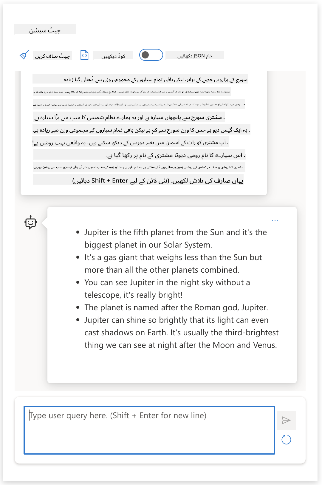

<!--
CO_OP_TRANSLATOR_METADATA:
{
  "original_hash": "0135e6c271f3ece8699050d4debbce88",
  "translation_date": "2025-10-17T13:06:47+00:00",
  "source_file": "04-prompt-engineering-fundamentals/README.md",
  "language_code": "ur"
}
-->
# بنیادی اصولوں کی وضاحت

[](https://youtu.be/GElCu2kUlRs?si=qrXsBvXnCW12epb8)

## تعارف
یہ ماڈیول تخلیقی AI ماڈلز میں مؤثر پرامپٹس بنانے کے لیے ضروری تصورات اور تکنیکوں کا احاطہ کرتا ہے۔ جس طرح آپ LLM کو اپنا پرامپٹ لکھتے ہیں، وہ بھی اہمیت رکھتا ہے۔ ایک احتیاط سے تیار کردہ پرامپٹ بہتر معیار کے جواب حاصل کر سکتا ہے۔ لیکن _پرامپٹ_ اور _پرامپٹ انجینئرنگ_ جیسے اصطلاحات کا مطلب کیا ہے؟ اور میں LLM کو بھیجے جانے والے پرامپٹ _ان پٹ_ کو کیسے بہتر بنا سکتا ہوں؟ یہ وہ سوالات ہیں جن کے جوابات ہم اس باب اور اگلے باب میں تلاش کریں گے۔

_تخلیقی AI_ صارف کی درخواستوں کے جواب میں نیا مواد (جیسے متن، تصاویر، آڈیو، کوڈ وغیرہ) تخلیق کرنے کی صلاحیت رکھتا ہے۔ یہ _بڑے زبان کے ماڈلز_ جیسے OpenAI کے GPT ("Generative Pre-trained Transformer") سیریز کا استعمال کرتے ہوئے حاصل کرتا ہے جو قدرتی زبان اور کوڈ کے استعمال کے لیے تربیت یافتہ ہیں۔

صارفین اب ان ماڈلز کے ساتھ چیٹ جیسے مانوس طریقوں کا استعمال کرتے ہوئے بات چیت کر سکتے ہیں، بغیر کسی تکنیکی مہارت یا تربیت کی ضرورت کے۔ ماڈلز _پرامپٹ پر مبنی_ ہیں - صارفین ایک متن ان پٹ (پرامپٹ) بھیجتے ہیں اور AI جواب (تکمیل) واپس حاصل کرتے ہیں۔ وہ پھر "AI کے ساتھ چیٹ" کر سکتے ہیں، کثیر موڑ کی گفتگو میں، اپنے پرامپٹ کو اس وقت تک بہتر بنا سکتے ہیں جب تک کہ جواب ان کی توقعات سے میل نہ کھائے۔

"پرامپٹس" اب تخلیقی AI ایپس کے لیے بنیادی _پروگرامنگ انٹرفیس_ بن گئے ہیں، ماڈلز کو بتاتے ہیں کہ کیا کرنا ہے اور واپس کیے گئے جوابات کے معیار کو متاثر کرتے ہیں۔ "پرامپٹ انجینئرنگ" مطالعہ کا ایک تیزی سے بڑھتا ہوا میدان ہے جو _پرامپٹس کے ڈیزائن اور اصلاح_ پر توجہ مرکوز کرتا ہے تاکہ پیمانے پر مستقل اور معیاری جوابات فراہم کیے جا سکیں۔

## سیکھنے کے اہداف

اس سبق میں، ہم سیکھیں گے کہ پرامپٹ انجینئرنگ کیا ہے، یہ کیوں اہم ہے، اور ہم کسی دیے گئے ماڈل اور ایپلیکیشن کے مقصد کے لیے زیادہ مؤثر پرامپٹس کیسے بنا سکتے ہیں۔ ہم پرامپٹ انجینئرنگ کے بنیادی تصورات اور بہترین طریقوں کو سمجھیں گے - اور ایک انٹرایکٹو Jupyter Notebooks "sandbox" ماحول کے بارے میں جانیں گے جہاں ہم ان تصورات کو حقیقی مثالوں پر لاگو ہوتے دیکھ سکتے ہیں۔

اس سبق کے اختتام تک ہم قابل ہوں گے:

1. وضاحت کریں کہ پرامپٹ انجینئرنگ کیا ہے اور یہ کیوں اہم ہے۔
2. پرامپٹ کے اجزاء کی وضاحت کریں اور وہ کیسے استعمال ہوتے ہیں۔
3. پرامپٹ انجینئرنگ کے بہترین طریقے اور تکنیک سیکھیں۔
4. سیکھے گئے تکنیکوں کو حقیقی مثالوں پر لاگو کریں، OpenAI endpoint کا استعمال کرتے ہوئے۔

## کلیدی اصطلاحات

پرامپٹ انجینئرنگ: AI ماڈلز کو مطلوبہ نتائج پیدا کرنے کی طرف رہنمائی کرنے کے لیے ان پٹ کو ڈیزائن اور بہتر بنانے کا عمل۔
ٹوکینائزیشن: متن کو چھوٹے یونٹس میں تبدیل کرنے کا عمل، جنہیں ٹوکن کہا جاتا ہے، جنہیں ماڈل سمجھ اور پروسیس کر سکتا ہے۔
انسٹرکشن-ٹیونڈ LLMs: بڑے زبان کے ماڈلز (LLMs) جو مخصوص ہدایات کے ساتھ بہتر کیے گئے ہیں تاکہ ان کے جواب کی درستگی اور مطابقت کو بہتر بنایا جا سکے۔

## سیکھنے کا سینڈ باکس

پرامپٹ انجینئرنگ فی الحال سائنس سے زیادہ آرٹ ہے۔ اس کے لیے ہماری بصیرت کو بہتر بنانے کا بہترین طریقہ یہ ہے کہ _زیادہ مشق کریں_ اور آزمائش اور غلطی کے طریقہ کار کو اپنائیں جو ایپلیکیشن ڈومین کی مہارت کو تجویز کردہ تکنیکوں اور ماڈل کے مخصوص اصلاحات کے ساتھ جوڑتا ہے۔

اس سبق کے ساتھ آنے والا Jupyter Notebook ایک _sandbox_ ماحول فراہم کرتا ہے جہاں آپ جو کچھ سیکھتے ہیں اسے آزما سکتے ہیں - جیسے آپ جاتے ہیں یا آخر میں کوڈ چیلنج کے حصے کے طور پر۔ مشقوں کو انجام دینے کے لیے، آپ کو ضرورت ہوگی:

1. **Azure OpenAI API key** - ایک تعینات LLM کے لیے سروس endpoint۔
2. **Python Runtime** - جس میں Notebook کو چلایا جا سکتا ہے۔
3. **مقامی ماحول کے متغیرات** - _اب [SETUP](./../00-course-setup/02-setup-local.md?WT.mc_id=academic-105485-koreyst) کے مراحل مکمل کریں تاکہ تیار ہو سکیں_۔

Notebook _starter_ مشقوں کے ساتھ آتا ہے - لیکن آپ کو اپنی _Markdown_ (تفصیل) اور _Code_ (پرامپٹ درخواستیں) سیکشنز شامل کرنے کی ترغیب دی جاتی ہے تاکہ مزید مثالیں یا خیالات آزما سکیں - اور پرامپٹ ڈیزائن کے لیے اپنی بصیرت بنائیں۔

## تصویری گائیڈ

کیا آپ اس سبق کے احاطہ کردہ بڑے موضوعات کو سمجھنا چاہتے ہیں اس سے پہلے کہ آپ گہرائی میں جائیں؟ اس تصویری گائیڈ کو دیکھیں، جو آپ کو ان اہم موضوعات کا احساس دیتا ہے جن کا احاطہ کیا گیا ہے اور ہر ایک میں سوچنے کے لیے اہم نکات۔ سبق کا روڈ میپ آپ کو بنیادی تصورات اور چیلنجز کو سمجھنے سے لے کر متعلقہ پرامپٹ انجینئرنگ تکنیکوں اور بہترین طریقوں کے ساتھ ان سے نمٹنے تک لے جاتا ہے۔ نوٹ کریں کہ اس گائیڈ میں "ایڈوانسڈ تکنیکیں" سیکشن اس نصاب کے _اگلے_ باب میں شامل مواد کا حوالہ دیتا ہے۔


## ہمارا اسٹارٹ اپ

اب، آئیے بات کرتے ہیں کہ _یہ موضوع_ ہمارے اسٹارٹ اپ مشن سے کیسے متعلق ہے [تعلیم میں AI جدت لانے کے لیے](https://educationblog.microsoft.com/2023/06/collaborating-to-bring-ai-innovation-to-education?WT.mc_id=academic-105485-koreyst)۔ ہم _ذاتی تعلیم_ کے AI سے چلنے والے ایپلیکیشنز بنانا چاہتے ہیں - تو آئیے سوچتے ہیں کہ ہمارے ایپلیکیشن کے مختلف صارفین پرامپٹس کو کیسے "ڈیزائن" کر سکتے ہیں:

- **ایڈمنسٹریٹرز** AI سے _نصاب کے ڈیٹا کا تجزیہ کرنے کے لیے کہہ سکتے ہیں تاکہ کوریج میں خلا کی نشاندہی کی جا سکے۔_ AI نتائج کا خلاصہ کر سکتا ہے یا انہیں کوڈ کے ساتھ بصری بنا سکتا ہے۔
- **تعلیم دینے والے** AI سے _ایک ہدف کے سامعین اور موضوع کے لیے سبق کا منصوبہ تیار کرنے کے لیے کہہ سکتے ہیں۔_ AI مخصوص فارمیٹ میں ذاتی منصوبہ بنا سکتا ہے۔
- **طلباء** AI سے _مشکل مضمون میں ان کی رہنمائی کرنے کے لیے کہہ سکتے ہیں۔_ AI اب طلباء کو ان کے سطح کے مطابق سبق، اشارے اور مثالوں کے ساتھ رہنمائی کر سکتا ہے۔

یہ تو صرف شروعات ہے۔ [تعلیم کے لیے پرامپٹس](https://github.com/microsoft/prompts-for-edu/tree/main?WT.mc_id=academic-105485-koreyst) کو دیکھیں - ایک اوپن سورس پرامپٹس لائبریری جو تعلیم کے ماہرین نے تیار کی ہے - امکانات کا وسیع تر احساس حاصل کرنے کے لیے! _ان پرامپٹس کو سینڈ باکس میں یا OpenAI Playground میں چلانے کی کوشش کریں اور دیکھیں کیا ہوتا ہے!_

<!--
LESSON TEMPLATE:
This unit should cover core concept #1.
Reinforce the concept with examples and references.

CONCEPT #1:
Prompt Engineering.
Define it and explain why it is needed.
-->

## پرامپٹ انجینئرنگ کیا ہے؟

ہم نے اس سبق کا آغاز **پرامپٹ انجینئرنگ** کو _متن ان پٹ (پرامپٹس) کو ڈیزائن اور بہتر بنانے کے عمل_ کے طور پر بیان کرتے ہوئے کیا تاکہ دیے گئے ایپلیکیشن کے مقصد اور ماڈل کے لیے مستقل اور معیاری جوابات (تکمیل) فراہم کیے جا سکیں۔ ہم اسے ایک 2-مرحلہ عمل کے طور پر سوچ سکتے ہیں:

- دیے گئے ماڈل اور مقصد کے لیے ابتدائی پرامپٹ کو _ڈیزائن کرنا_
- جواب کے معیار کو بہتر بنانے کے لیے پرامپٹ کو _بار بار بہتر بنانا_

یہ لازمی طور پر ایک آزمائش اور غلطی کا عمل ہے جس کے لیے صارف کی بصیرت اور بہترین نتائج حاصل کرنے کی کوشش کی ضرورت ہوتی ہے۔ تو یہ کیوں اہم ہے؟ اس سوال کا جواب دینے کے لیے، ہمیں پہلے تین تصورات کو سمجھنے کی ضرورت ہے:

- _ٹوکینائزیشن_ = ماڈل پرامپٹ کو کیسے "دیکھتا" ہے
- _بیس LLMs_ = بنیاد ماڈل پرامپٹ کو کیسے "پروسیس" کرتا ہے
- _انسٹرکشن-ٹیونڈ LLMs_ = ماڈل اب "کاموں" کو کیسے دیکھ سکتا ہے

### ٹوکینائزیشن

ایک LLM پرامپٹس کو _ٹوکنز کی ترتیب_ کے طور پر دیکھتا ہے جہاں مختلف ماڈلز (یا ماڈل کے ورژنز) ایک ہی پرامپٹ کو مختلف طریقوں سے ٹوکینائز کر سکتے ہیں۔ چونکہ LLMs ٹوکنز پر تربیت یافتہ ہیں (اور خام متن پر نہیں)، پرامپٹس کے ٹوکینائز ہونے کا طریقہ پیدا شدہ جواب کے معیار پر براہ راست اثر ڈالتا ہے۔

ٹوکینائزیشن کے کام کرنے کا اندازہ حاصل کرنے کے لیے، [OpenAI Tokenizer](https://platform.openai.com/tokenizer?WT.mc_id=academic-105485-koreyst) جیسے ٹولز آزمائیں۔ اپنے پرامپٹ کو کاپی کریں - اور دیکھیں کہ وہ ٹوکنز میں کیسے تبدیل ہوتا ہے، اس بات پر توجہ دیتے ہوئے کہ سفید جگہ کے کردار اور اوقاف کے نشانات کو کیسے ہینڈل کیا جاتا ہے۔ نوٹ کریں کہ یہ مثال ایک پرانے LLM (GPT-3) کو دکھاتی ہے - لہذا اسے ایک نئے ماڈل کے ساتھ آزمانے سے مختلف نتیجہ پیدا ہو سکتا ہے۔


### تصور: بنیاد ماڈلز

ایک بار جب پرامپٹ ٹوکینائز ہو جاتا ہے، ["بیس LLM"](https://blog.gopenai.com/an-introduction-to-base-and-instruction-tuned-large-language-models-8de102c785a6?WT.mc_id=academic-105485-koreyst) (یا بنیاد ماڈل) کا بنیادی کام اس ترتیب میں ٹوکن کی پیش گوئی کرنا ہے۔ چونکہ LLMs بڑے متن کے ڈیٹا سیٹس پر تربیت یافتہ ہیں، انہیں ٹوکنز کے درمیان شماریاتی تعلقات کا اچھا احساس ہوتا ہے اور وہ اس پیش گوئی کو کچھ اعتماد کے ساتھ کر سکتے ہیں۔ نوٹ کریں کہ وہ پرامپٹ یا ٹوکن میں الفاظ کے _معنی_ کو نہیں سمجھتے؛ وہ صرف ایک نمونہ دیکھتے ہیں جسے وہ اپنی اگلی پیش گوئی کے ساتھ "مکمل" کر سکتے ہیں۔ وہ صارف کی مداخلت یا کسی پہلے سے قائم شرط کے ذریعے ختم ہونے تک ترتیب کی پیش گوئی جاری رکھ سکتے ہیں۔

کیا آپ دیکھنا چاہتے ہیں کہ پرامپٹ پر مبنی تکمیل کیسے کام کرتی ہے؟ اوپر دیے گئے پرامپٹ کو Azure OpenAI Studio [_Chat Playground_](https://oai.azure.com/playground?WT.mc_id=academic-105485-koreyst) میں ڈیفالٹ سیٹنگز کے ساتھ درج کریں۔ سسٹم پرامپٹس کو معلومات کی درخواستوں کے طور پر برتنے کے لیے ترتیب دیا گیا ہے - لہذا آپ کو ایک تکمیل دیکھنی چاہیے جو اس سیاق و سباق کو پورا کرتی ہے۔

لیکن اگر صارف کچھ مخصوص دیکھنا چاہتا تھا جو کچھ معیار یا کام کے مقصد کو پورا کرتا ہو؟ یہ وہ جگہ ہے جہاں _انسٹرکشن-ٹیونڈ_ LLMs تصویر میں آتے ہیں۔


### تصور: انسٹرکشن-ٹیونڈ LLMs

ایک [انسٹرکشن-ٹیونڈ LLM](https://blog.gopenai.com/an-introduction-to-base-and-instruction-tuned-large-language-models-8de102c785a6?WT.mc_id=academic-105485-koreyst) بنیاد ماڈل سے شروع ہوتا ہے اور اسے مثالوں یا ان پٹ/آؤٹ پٹ جوڑوں (جیسے، کثیر موڑ "پیغامات") کے ساتھ بہتر بناتا ہے جو واضح ہدایات پر مشتمل ہو سکتے ہیں - اور AI کی کوشش سے جواب اس ہدایت کی پیروی کرتا ہے۔

یہ تکنیکوں جیسے Reinforcement Learning with Human Feedback (RLHF) کا استعمال کرتا ہے جو ماڈل کو _ہدایات پر عمل کرنے_ اور _فیڈبیک سے سیکھنے_ کی تربیت دے سکتا ہے تاکہ یہ جوابات پیدا کرے جو عملی ایپلیکیشنز کے لیے زیادہ موزوں اور صارف کے مقاصد کے لیے زیادہ متعلقہ ہوں۔

آئیے اسے آزماتے ہیں - اوپر دیے گئے پرامپٹ پر دوبارہ جائیں، لیکن اب _سسٹم میسج_ کو درج ذیل ہدایت کے طور پر سیاق و سباق فراہم کرنے کے لیے تبدیل کریں:

> _آپ کو فراہم کردہ مواد کو دوسرے درجے کے طالب علم کے لیے خلاصہ کریں۔ نتیجہ کو ایک پیراگراف میں 3-5 بلٹ پوائنٹس کے ساتھ رکھیں۔_

دیکھیں کہ نتیجہ اب مطلوبہ مقصد اور فارمیٹ کو ظاہر کرنے کے لیے کیسے ٹیون کیا گیا ہے؟ ایک معلم اب اس جواب کو براہ راست اس کلاس کے لیے اپنی سلائیڈز میں استعمال کر سکتا ہے۔



## ہمیں پرامپٹ انجینئرنگ کی ضرورت کیوں ہے؟

اب جب کہ ہم جانتے ہیں کہ LLMs پرامپٹس کو کیسے پروسیس کرتے ہیں، آئیے بات کرتے ہیں کہ ہمیں _پرامپٹ انجینئرنگ_ کی ضرورت کیوں ہے۔ جواب اس حقیقت میں ہے کہ موجودہ LLMs کئی چیلنجز پیش کرتے ہیں جو _قابل اعتماد اور مستقل تکمیل_ کو حاصل کرنے کو زیادہ مشکل بناتے ہیں بغیر پرامپٹ کی تعمیر اور اصلاح میں کوشش ڈالے۔ مثال کے طور پر:

1. **ماڈل کے جوابات اتفاقی ہیں۔** _ایک ہی پرامپٹ_ ممکنہ طور پر مختلف ماڈلز یا ماڈل ورژنز کے ساتھ مختلف جوابات پیدا کرے گا۔ اور یہ _ایک ہی ماڈل_ کے ساتھ مختلف اوقات میں بھی مختلف نتائج پیدا کر سکتا ہے۔ _پرامپٹ انجینئرنگ تکنیکیں ہمیں ان تغیرات کو کم کرنے میں مدد کر سکتی ہیں بہتر گارڈریل فراہم کر کے۔_

1. **ماڈلز جوابات بنا سکتے ہیں۔** ماڈلز _بڑے لیکن محدود_ ڈیٹا سیٹس کے ساتھ پہلے سے تربیت یافتہ ہیں، مطلب یہ ہے کہ ان کے پاس تربیت کے دائرہ کار سے باہر کے تصورات کے بارے میں علم کی کمی ہے۔ نتیجے کے طور پر، وہ تکمیل پیدا کر سکتے ہیں جو غلط، خیالی، یا معلوم حقائق کے ساتھ براہ راست متضاد ہوں۔ _پرامپٹ انجینئرنگ تکنیکیں صارفین کو ایسی تخلیقات کی شناخت اور تخفیف میں مدد کرتی ہیں، جیسے AI سے حوالہ جات یا استدلال طلب کرنا۔_

1. **ماڈلز کی صلاحیتیں مختلف ہوں گی۔** نئے ماڈلز یا ماڈل جنریشنز میں زیادہ صلاحیتیں ہوں گی لیکن لاگت اور پیچیدگی میں منفرد خصوصیات اور سمجھوتے بھی لائیں گے۔ _پرامپٹ انجینئرنگ ہمیں بہترین طریقے اور ورک فلو تیار کرنے میں مدد کر سکتی ہے جو اختلافات کو ختم کرتے ہیں اور ماڈل کے مخصوص تقاضوں کے مطابق پیمانے پر، ہموار طریقوں سے ڈھال لیتے ہیں۔_

آئیے اسے OpenAI یا Azure OpenAI Playground میں عمل میں دیکھتے ہیں:

- مختلف LLM تعیناتیوں (جیسے، OpenAI، Azure OpenAI، Hugging Face) کے ساتھ ایک ہی پرامپٹ استعمال کریں - کیا آپ نے تغیرات دیکھے؟
- _ایک ہی_ LLM تعیناتی (جیسے، Azure OpenAI Playground) کے ساتھ بار بار ایک ہی پرامپٹ استعمال کریں - یہ تغیرات کیسے مختلف تھے؟

### تخلیقات کی مثال

اس کورس میں، ہم اصطلاح **"تخلیق"** کا استعمال کرتے ہیں تاکہ اس مظہر کا حوالہ دیا جا سکے جہاں LLMs کبھی کبھار حقیقتاً غلط معلومات پیدا کرتے ہیں تربیت میں ان کی حدود یا دیگر پابندیوں کی وجہ سے۔ آپ نے اسے مقبول مضامین یا تحقیقی مقالوں میں _"ہیلوسینیشنز"_ کے طور پر بھی سنا ہو گا۔ تاہم، ہم _"تخلیق"_ کو اصطلاح کے طور پر استعمال کرنے کی سختی سے سفارش کرتے ہیں تاکہ ہم انسانی جیسی خصوصیت کو مشین سے چلنے والے نتیجے سے منسوب کر کے رویے کو غلط طور پر انسانیت نہ دیں۔ یہ [ذمہ دار AI رہنما اصولوں
ایک ویب تلاش نے مجھے دکھایا کہ مریخی جنگوں پر خیالی کہانیاں (جیسے ٹیلیویژن سیریز یا کتابیں) موجود ہیں - لیکن 2076 میں کوئی نہیں۔ عام فہم بھی ہمیں بتاتی ہے کہ 2076 _مستقبل_ میں ہے اور اس لیے اسے کسی حقیقی واقعے سے منسلک نہیں کیا جا سکتا۔

تو کیا ہوتا ہے جب ہم یہ پرامپٹ مختلف LLM فراہم کنندگان کے ساتھ چلاتے ہیں؟

> **جواب 1**: OpenAI Playground (GPT-35)


> **جواب 2**: Azure OpenAI Playground (GPT-35)


> **جواب 3**: Hugging Face Chat Playground (LLama-2)


جیسا کہ توقع کی گئی تھی، ہر ماڈل (یا ماڈل ورژن) مختلف جوابات پیدا کرتا ہے، جو اسٹاکاسٹک رویے اور ماڈل کی صلاحیتوں میں فرق کی وجہ سے ہوتا ہے۔ مثال کے طور پر، ایک ماڈل آٹھویں جماعت کے طلباء کو ہدف بناتا ہے جبکہ دوسرا ہائی اسکول کے طلباء کو مدنظر رکھتا ہے۔ لیکن تینوں ماڈلز نے ایسے جوابات دیے جو ایک غیر مطلع صارف کو قائل کر سکتے ہیں کہ یہ واقعہ حقیقی ہے۔

پرامپٹ انجینئرنگ کی تکنیکیں جیسے _میٹا پرامپٹنگ_ اور _ٹیمپریچر کنفیگریشن_ ماڈل کی غلط بیانی کو کسی حد تک کم کر سکتی ہیں۔ نئی پرامپٹ انجینئرنگ _آرکیٹیکچرز_ بھی پرامپٹ فلو میں نئے ٹولز اور تکنیکوں کو بغیر کسی رکاوٹ کے شامل کرتے ہیں تاکہ ان اثرات کو کم یا ختم کیا جا سکے۔

## کیس اسٹڈی: GitHub Copilot

آئیے اس سیکشن کو ختم کرتے ہیں اور دیکھتے ہیں کہ پرامپٹ انجینئرنگ حقیقی دنیا کے حل میں کیسے استعمال ہوتی ہے، ایک کیس اسٹڈی کے ذریعے: [GitHub Copilot](https://github.com/features/copilot?WT.mc_id=academic-105485-koreyst)۔

GitHub Copilot آپ کا "AI جوڑی پروگرامر" ہے - یہ ٹیکسٹ پرامپٹس کو کوڈ کمپلیشنز میں تبدیل کرتا ہے اور آپ کے ترقیاتی ماحول (جیسے Visual Studio Code) میں بغیر کسی رکاوٹ کے صارف کے تجربے کے لیے ضم ہوتا ہے۔ جیسا کہ نیچے دی گئی بلاگز کی سیریز میں دستاویزی ہے، ابتدائی ورژن OpenAI Codex ماڈل پر مبنی تھا - انجینئرز نے جلد ہی ماڈل کو بہتر بنانے اور کوڈ کے معیار کو بہتر بنانے کے لیے بہتر پرامپٹ انجینئرنگ تکنیکوں کو تیار کرنے کی ضرورت کو محسوس کیا۔ جولائی میں، انہوں نے [ایک بہتر AI ماڈل کا آغاز کیا جو Codex سے آگے جاتا ہے](https://github.blog/2023-07-28-smarter-more-efficient-coding-github-copilot-goes-beyond-codex-with-improved-ai-model/?WT.mc_id=academic-105485-koreyst) اور تیز تجاویز فراہم کرتا ہے۔

ان کی سیکھنے کی سفر کو فالو کرنے کے لیے پوسٹس کو ترتیب وار پڑھیں۔

- **مئی 2023** | [GitHub Copilot آپ کے کوڈ کو بہتر سمجھنے میں بہتر ہو رہا ہے](https://github.blog/2023-05-17-how-github-copilot-is-getting-better-at-understanding-your-code/?WT.mc_id=academic-105485-koreyst)
- **مئی 2023** | [GitHub کے اندر: GitHub Copilot کے پیچھے LLMs کے ساتھ کام کرنا](https://github.blog/2023-05-17-inside-github-working-with-the-llms-behind-github-copilot/?WT.mc_id=academic-105485-koreyst).
- **جون 2023** | [GitHub Copilot کے لیے بہتر پرامپٹس کیسے لکھیں](https://github.blog/2023-06-20-how-to-write-better-prompts-for-github-copilot/?WT.mc_id=academic-105485-koreyst).
- **جولائی 2023** | [.. GitHub Copilot بہتر AI ماڈل کے ساتھ Codex سے آگے جاتا ہے](https://github.blog/2023-07-28-smarter-more-efficient-coding-github-copilot-goes-beyond-codex-with-improved-ai-model/?WT.mc_id=academic-105485-koreyst)
- **جولائی 2023** | [پرامپٹ انجینئرنگ اور LLMs کے لیے ایک ڈویلپر کی گائیڈ](https://github.blog/2023-07-17-prompt-engineering-guide-generative-ai-llms/?WT.mc_id=academic-105485-koreyst)
- **ستمبر 2023** | [ایک انٹرپرائز LLM ایپ کیسے بنائیں: GitHub Copilot سے سبق](https://github.blog/2023-09-06-how-to-build-an-enterprise-llm-application-lessons-from-github-copilot/?WT.mc_id=academic-105485-koreyst)

آپ ان کے [انجینئرنگ بلاگ](https://github.blog/category/engineering/?WT.mc_id=academic-105485-koreyst) کو مزید پوسٹس کے لیے بھی براؤز کر سکتے ہیں جیسے [یہ ایک](https://github.blog/2023-09-27-how-i-used-github-copilot-chat-to-build-a-reactjs-gallery-prototype/?WT.mc_id=academic-105485-koreyst) جو دکھاتا ہے کہ یہ ماڈلز اور تکنیکیں حقیقی دنیا کی ایپلیکیشنز کو چلانے کے لیے کیسے _لاگو_ کی جاتی ہیں۔

---

## پرامپٹ کی تعمیر

ہم نے دیکھا کہ پرامپٹ انجینئرنگ کیوں اہم ہے - اب آئیے سمجھتے ہیں کہ پرامپٹس کیسے _تعمیر_ کیے جاتے ہیں تاکہ ہم زیادہ مؤثر پرامپٹ ڈیزائن کے لیے مختلف تکنیکوں کا جائزہ لے سکیں۔

### بنیادی پرامپٹ

آئیے بنیادی پرامپٹ سے شروع کرتے ہیں: ایک ٹیکسٹ ان پٹ جو ماڈل کو بغیر کسی دوسرے سیاق و سباق کے بھیجا جاتا ہے۔ یہاں ایک مثال ہے - جب ہم امریکی قومی ترانے کے پہلے چند الفاظ OpenAI [Completion API](https://platform.openai.com/docs/api-reference/completions?WT.mc_id=academic-105485-koreyst) کو بھیجتے ہیں، تو یہ فوری طور پر جواب کو اگلی چند لائنوں کے ساتھ _مکمل_ کرتا ہے، جو بنیادی پیش گوئی کے رویے کو ظاہر کرتا ہے۔

| پرامپٹ (ان پٹ)     | کمپلیشن (آؤٹ پٹ)                                                                                                                        |
| :----------------- | :----------------------------------------------------------------------------------------------------------------------------------------- |
| Oh say can you see | ایسا لگتا ہے کہ آپ "The Star-Spangled Banner"، جو کہ ریاستہائے متحدہ کا قومی ترانہ ہے، کے بول شروع کر رہے ہیں۔ مکمل بول ہیں ... |

### پیچیدہ پرامپٹ

اب آئیے اس بنیادی پرامپٹ میں سیاق و سباق اور ہدایات شامل کریں۔ [Chat Completion API](https://learn.microsoft.com/azure/ai-services/openai/how-to/chatgpt?WT.mc_id=academic-105485-koreyst) ہمیں ایک پیچیدہ پرامپٹ کو _پیغامات_ کے مجموعے کے طور پر تعمیر کرنے کی اجازت دیتا ہے، جس میں:

- ان پٹ/آؤٹ پٹ جوڑے جو _صارف_ ان پٹ اور _اسسٹنٹ_ کے جواب کی عکاسی کرتے ہیں۔
- سسٹم پیغام جو اسسٹنٹ کے رویے یا شخصیت کے لیے سیاق و سباق ترتیب دیتا ہے۔

درخواست اب نیچے دی گئی شکل میں ہے، جہاں _ٹوکینائزیشن_ مؤثر طریقے سے سیاق و سباق اور گفتگو سے متعلق معلومات کو حاصل کرتی ہے۔ اب، سسٹم سیاق و سباق کو تبدیل کرنا کمپلیشنز کے معیار پر اتنا ہی اثر انداز ہو سکتا ہے جتنا کہ فراہم کردہ صارف ان پٹ۔

```python
response = openai.chat.completions.create(
    model="gpt-3.5-turbo",
    messages=[
        {"role": "system", "content": "You are a helpful assistant."},
        {"role": "user", "content": "Who won the world series in 2020?"},
        {"role": "assistant", "content": "The Los Angeles Dodgers won the World Series in 2020."},
        {"role": "user", "content": "Where was it played?"}
    ]
)
```

### ہدایتی پرامپٹ

اوپر دی گئی مثالوں میں، صارف کا پرامپٹ ایک سادہ ٹیکسٹ سوال تھا جسے معلومات کی درخواست کے طور پر سمجھا جا سکتا ہے۔ _ہدایتی_ پرامپٹس کے ساتھ، ہم اس متن کو زیادہ تفصیل سے کام کی وضاحت کرنے کے لیے استعمال کر سکتے ہیں، AI کو بہتر رہنمائی فراہم کرتے ہوئے۔ یہاں ایک مثال ہے:

| پرامپٹ (ان پٹ)                                                                                                                                                                                                                         | کمپلیشن (آؤٹ پٹ)                                                                                                        | ہدایتی قسم    |
| :------------------------------------------------------------------------------------------------------------------------------------------------------------------------------------------------------------------------------------- | :------------------------------------------------------------------------------------------------------------------------- | :------------------ |
| سول وار کی وضاحت لکھیں                                                                                                                                                                                                   | _ایک سادہ پیراگراف واپس کیا گیا_                                                                                              | سادہ              |
| سول وار کی وضاحت لکھیں۔ اہم تاریخوں اور واقعات فراہم کریں اور ان کی اہمیت بیان کریں                                                                                                                                     | _ایک پیراگراف واپس کیا گیا جس کے بعد اہم واقعات کی تاریخوں کی فہرست دی گئی_                                             | پیچیدہ             |
| سول وار کی وضاحت ایک پیراگراف میں لکھیں۔ اہم تاریخوں اور ان کی اہمیت کے ساتھ 3 بلٹ پوائنٹس فراہم کریں۔ مزید 3 بلٹ پوائنٹس اہم تاریخی شخصیات اور ان کی شراکت کے ساتھ فراہم کریں۔ آؤٹ پٹ کو JSON فائل کے طور پر واپس کریں | _زیادہ تفصیلی معلومات ایک ٹیکسٹ باکس میں واپس کی گئیں، JSON کے طور پر فارمیٹ کی گئی جسے آپ ضرورت کے مطابق فائل میں کاپی پیسٹ کر سکتے ہیں_ | پیچیدہ۔ فارمیٹ شدہ۔ |

## بنیادی مواد

اوپر دی گئی مثالوں میں، پرامپٹ ابھی بھی کافی کھلا تھا، جس سے LLM کو فیصلہ کرنے کی اجازت دی گئی کہ اس کے پری ٹرینڈ ڈیٹاسیٹ کا کون سا حصہ متعلقہ ہے۔ _بنیادی مواد_ ڈیزائن پیٹرن کے ساتھ، ان پٹ ٹیکسٹ کو دو حصوں میں تقسیم کیا جاتا ہے:

- ایک ہدایت (عمل)
- متعلقہ مواد (جو عمل کو متاثر کرتا ہے)

یہاں ایک مثال ہے جہاں ہدایت "اسے 2 جملوں میں خلاصہ کریں" ہے۔

| پرامپٹ (ان پٹ)                                                                                                                                                                                                                                                                                                                                                                                                                                                                                                                                                                                                                                                                                      | کمپلیشن (آؤٹ پٹ)                                                                                                                                                                                                                                                                             |
| :-------------------------------------------------------------------------------------------------------------------------------------------------------------------------------------------------------------------------------------------------------------------------------------------------------------------------------------------------------------------------------------------------------------------------------------------------------------------------------------------------------------------------------------------------------------------------------------------------------------------------------------------------------------------------------------------------- | :---------------------------------------------------------------------------------------------------------------------------------------------------------------------------------------------------------------------------------------------------------------------------------------------- |
| مشتری سورج سے پانچواں سیارہ اور نظام شمسی کا سب سے بڑا سیارہ ہے۔ یہ ایک گیس دیو ہے جس کا ماس سورج کے ایک ہزارویں حصے کے برابر ہے، لیکن نظام شمسی کے تمام دوسرے سیاروں کے مجموعے سے دو گنا زیادہ ہے۔ مشتری رات کے آسمان میں ننگی آنکھ سے نظر آنے والی سب سے روشن اشیاء میں سے ایک ہے، اور قدیم تہذیبوں کو ریکارڈ شدہ تاریخ سے پہلے سے معلوم ہے۔ اس کا نام رومن دیوتا مشتری کے نام پر رکھا گیا ہے۔[19] زمین سے دیکھنے پر، مشتری اتنا روشن ہو سکتا ہے کہ اس کی منعکس روشنی نظر آنے والے سائے ڈال سکتی ہے،[20] اور اوسطاً چاند اور زہرہ کے بعد رات کے آسمان میں تیسری سب سے روشن قدرتی شے ہے۔ <br/> **اسے 2 مختصر جملوں میں خلاصہ کریں** | مشتری، سورج سے پانچواں سیارہ، نظام شمسی کا سب سے بڑا سیارہ ہے اور رات کے آسمان میں سب سے روشن اشیاء میں سے ایک کے طور پر جانا جاتا ہے۔ رومن دیوتا مشتری کے نام پر رکھا گیا، یہ ایک گیس دیو ہے جس کا ماس نظام شمسی کے تمام دوسرے سیاروں کے مجموعے سے دو گنا زیادہ ہے۔ |

بنیادی مواد کے حصے کو زیادہ مؤثر ہدایات دینے کے لیے مختلف طریقوں سے استعمال کیا جا سکتا ہے:

- **مثالیں** - ماڈل کو واضح ہدایت دینے کے بجائے، اسے کچھ مثالیں دیں کہ کیا کرنا ہے اور اسے پیٹرن کا اندازہ لگانے دیں۔
- **اشارے** - ہدایت کے بعد ایک "اشارہ" دیں جو کمپلیشن کو پرائم کرے، ماڈل کو زیادہ متعلقہ جوابات کی طرف رہنمائی کرے۔
- **ٹیمپلیٹس** - یہ پرامپٹس کے قابل تکرار 'ریسپی' ہیں جن میں پلیس ہولڈرز (متغیرات) ہوتے ہیں جنہیں مخصوص استعمال کے معاملات کے لیے ڈیٹا کے ساتھ حسب ضرورت بنایا جا سکتا ہے۔

آئیے ان کو عملی طور پر دیکھتے ہیں۔

### مثالوں کا استعمال

یہ ایک ایسا طریقہ ہے جہاں آپ بنیادی مواد کو "ماڈل کو کھلانے" کے لیے استعمال کرتے ہیں، مطلوبہ آؤٹ پٹ کی کچھ مثالیں دیتے ہیں اور اسے مطلوبہ آؤٹ پٹ کے پیٹرن کا اندازہ لگانے دیتے ہیں۔ فراہم کردہ مثالوں کی تعداد کی بنیاد پر، ہمارے پاس زیرو شاٹ پرامپٹنگ، ون شاٹ پرامپٹنگ، فیو شاٹ پرامپٹنگ وغیرہ ہو سکتی ہے۔

پرامپٹ اب تین اجزاء پر مشتمل ہے:

- کام کی وضاحت
- مطلوبہ آؤٹ پٹ کی چند مثالیں
- ایک نئی مثال کا آغاز (جو ایک مضمر کام کی وضاحت بن جاتا ہے)

| سیکھنے کی قسم | پرامپٹ (ان پٹ)                                                                                                                                        | کمپلیشن (آؤٹ پٹ)         |
| :------------ | :---------------------------------------------------------------------------------------------------------------------------------------------------- | :-------------------------- |
| زیرو شاٹ     | "The Sun is Shining". اسپینش میں ترجمہ کریں                                                                                                            | "El Sol está brillando".    |
| ون شاٹ      | "The Sun is Shining" => ""El Sol está brillando". <br> "It's a Cold and Windy Day" =>                                                                 | "Es un día frío y ventoso". |
| فیو شاٹ      | The player ran the bases => Baseball <br/> The player hit an ace => Tennis <br/> The player hit a six => Cricket <br/> The player made a slam-dunk => | Basketball                  |
|               |                                                                                                                                                       |                             |

نوٹ کریں کہ ہمیں زیرو شاٹ پرامپٹنگ میں واضح ہدایت ("اسپینش میں ترجمہ کریں") فراہم کرنی پڑی، لیکن یہ ون شاٹ پرامپٹنگ کی مثال میں اخذ کی گئی ہے۔ فیو شاٹ کی مثال دکھاتی ہے کہ مزید مثالیں شامل کرنے سے ماڈلز کو زیادہ درست اندازے لگانے میں مدد ملتی ہے، بغیر کسی اضافی ہدایات کے۔

### پرامپٹ اشارے

بنیادی مواد کو استعمال کرنے کا ایک اور طریقہ _اشارے_ فراہم کرنا ہے بجائے اس کے کہ مثالیں دی جائیں۔ اس صورت میں، ہم ماڈل کو مطلوبہ جواب کے فارمیٹ کی عکاسی کرنے والے ایک ٹکڑے کے ساتھ _شروع کر کے_ صحیح سمت میں دھکیل رہے ہیں۔ ماڈل پھر "اشارہ لیتا ہے" اور اسی انداز میں جاری رکھتا ہے۔

| اشاروں کی تعداد | پرامپٹ (ان پٹ)                                                                                                                                                                                                                                                                                                                                                                                                                                               | کمپلیشن (آؤٹ پٹ)                                                                                                                                                                                                                                                                                       |
| :------------- | :----------------------------------------------------------------------------------------------------------------------------------------------------------------------------------------------------------------------------------------------------------------------------------------------------------------------------------------------------------------------------------------------------------------------------------------------------------- | :-------------------------------------------------------------------------------------------------------------------------------------------------------------------------------------------------------------------------------------------------------------------------------------------------------- |
| 0              | مشتری سورج سے پانچواں سیارہ اور نظام شمسی کا سب سے بڑا سیارہ ہے۔ یہ ایک گیس دیو ہے جس کا ماس سورج کے ایک ہزارویں حصے کے برابر ہے، لیکن نظام شمسی کے تمام دوسرے سیاروں کے مجموعے سے دو گنا زیادہ ہے۔ مشتری رات کے آسمان میں ننگی آنکھ سے نظر آنے والی سب سے روشن اشیاء میں سے ایک ہے، اور قدیم تہذیبوں کو ریکارڈ شدہ تاریخ سے پہلے سے معلوم ہے۔ <br/>**اسے خلاصہ کریں**                                       | مشتری نظام شمسی کا سب سے بڑا سیارہ ہے اور سورج سے پانچواں سیارہ ہے۔ یہ ایک گیس دیو ہے جس کا ماس سورج کے ایک ہزارویں حصے کے برابر ہے، لیکن یہ تمام دوسرے سیاروں کے مجموعے سے زیادہ بھاری ہے۔ قدیم تہذیبوں نے مشتری کو طویل عرصے سے جانا ہے، اور یہ رات کے آسمان میں آسانی سے نظر آتا ہے۔ |
| 1              | مشتری سورج سے پانچواں سیارہ ہے اور شمسی نظام میں سب سے بڑا ہے۔ یہ ایک گیس دیو ہے جس کا وزن سورج کے وزن کا ایک ہزارواں حصہ ہے، لیکن شمسی نظام کے تمام دوسرے سیاروں کے مجموعی وزن سے ڈھائی گنا زیادہ ہے۔ مشتری رات کے آسمان میں ننگی آنکھ سے نظر آنے والی سب سے روشن اشیاء میں سے ایک ہے، اور قدیم تہذیبوں کو اس کے بارے میں معلوم تھا جب تاریخ کو ریکارڈ نہیں کیا گیا تھا۔ <br/>**خلاصہ کریں** <br/> ہم نے یہ سیکھا کہ مشتری | سورج سے پانچواں سیارہ ہے اور شمسی نظام میں سب سے بڑا ہے۔ یہ ایک گیس دیو ہے جس کا وزن سورج کے وزن کا ایک ہزارواں حصہ ہے، لیکن تمام دوسرے سیاروں کے مجموعی وزن سے ڈھائی گنا زیادہ ہے۔ یہ ننگی آنکھ سے آسانی سے نظر آتا ہے اور قدیم زمانے سے جانا جاتا ہے۔                        |
| 2              | مشتری سورج سے پانچواں سیارہ ہے اور شمسی نظام میں سب سے بڑا ہے۔ یہ ایک گیس دیو ہے جس کا وزن سورج کے وزن کا ایک ہزارواں حصہ ہے، لیکن شمسی نظام کے تمام دوسرے سیاروں کے مجموعی وزن سے ڈھائی گنا زیادہ ہے۔ مشتری رات کے آسمان میں ننگی آنکھ سے نظر آنے والی سب سے روشن اشیاء میں سے ایک ہے، اور قدیم تہذیبوں کو اس کے بارے میں معلوم تھا جب تاریخ کو ریکارڈ نہیں کیا گیا تھا۔ <br/>**خلاصہ کریں** <br/> سیکھے گئے 3 اہم حقائق:         | 1. مشتری سورج سے پانچواں سیارہ ہے اور شمسی نظام میں سب سے بڑا ہے۔ <br/> 2. یہ ایک گیس دیو ہے جس کا وزن سورج کے وزن کا ایک ہزارواں حصہ ہے...<br/> 3. مشتری قدیم زمانے سے ننگی آنکھ سے نظر آتا رہا ہے ...                                                                       |
|                |                                                                                                                                                                                                                                                                                                                                                                                                                                                              |                                                                                                                                                                                                                                                                                                           |

### پرامپٹ ٹیمپلیٹس

پرامپٹ ٹیمپلیٹ ایک _پہلے سے طے شدہ نسخہ_ ہے جو پرامپٹ کے لیے محفوظ کیا جا سکتا ہے اور ضرورت کے مطابق دوبارہ استعمال کیا جا سکتا ہے، تاکہ بڑے پیمانے پر زیادہ مستقل صارف تجربات کو چلایا جا سکے۔ اس کی سب سے سادہ شکل میں، یہ صرف پرامپٹ مثالوں کا مجموعہ ہے جیسے [یہ OpenAI کی مثال](https://platform.openai.com/examples?WT.mc_id=academic-105485-koreyst) جو انٹرایکٹو پرامپٹ اجزاء (صارف اور سسٹم پیغامات) اور API سے چلنے والے درخواست فارمیٹ دونوں فراہم کرتی ہے - تاکہ دوبارہ استعمال کی حمایت کی جا سکے۔

اس کی زیادہ پیچیدہ شکل میں جیسے [LangChain کی یہ مثال](https://python.langchain.com/docs/concepts/prompt_templates/?WT.mc_id=academic-105485-koreyst) یہ _پلیس ہولڈرز_ پر مشتمل ہے جنہیں مختلف ذرائع (صارف ان پٹ، سسٹم سیاق و سباق، بیرونی ڈیٹا ذرائع وغیرہ) سے ڈیٹا کے ساتھ تبدیل کیا جا سکتا ہے تاکہ پرامپٹ کو متحرک طور پر تیار کیا جا سکے۔ یہ ہمیں دوبارہ استعمال کے قابل پرامپٹس کی لائبریری بنانے کی اجازت دیتا ہے جو **پروگراماتی طور پر** بڑے پیمانے پر مستقل صارف تجربات کو چلانے کے لیے استعمال کی جا سکتی ہے۔

آخر میں، ٹیمپلیٹس کی اصل قدر _پرامپٹ لائبریریاں_ بنانے اور شائع کرنے کی صلاحیت میں ہے مخصوص ایپلیکیشن ڈومینز کے لیے - جہاں پرامپٹ ٹیمپلیٹ اب _ایپلیکیشن کے مخصوص سیاق و سباق یا مثالوں_ کو بہتر بناتا ہے جو جوابات کو ہدف شدہ صارفین کے لیے زیادہ متعلقہ اور درست بناتا ہے۔ [Prompts For Edu](https://github.com/microsoft/prompts-for-edu?WT.mc_id=academic-105485-koreyst) ریپوزٹری اس نقطہ نظر کی ایک بہترین مثال ہے، جو تعلیم کے شعبے کے لیے پرامپٹس کی لائبریری کو اہم مقاصد جیسے سبق کی منصوبہ بندی، نصاب ڈیزائن، طلبہ کی رہنمائی وغیرہ پر زور دیتے ہوئے تیار کرتی ہے۔

## معاون مواد

اگر ہم پرامپٹ کی تعمیر کو ایک ہدایت (کام) اور ایک ہدف (بنیادی مواد) کے طور پر سوچیں، تو _ثانوی مواد_ اضافی سیاق و سباق کی طرح ہے جو ہم فراہم کرتے ہیں تاکہ **کسی طرح سے آؤٹ پٹ کو متاثر کریں**۔ یہ ٹیوننگ پیرامیٹرز، فارمیٹنگ ہدایات، موضوع کی درجہ بندی وغیرہ ہو سکتا ہے جو ماڈل کو مطلوبہ صارف کے مقاصد یا توقعات کے مطابق جواب کو _درست کرنے_ میں مدد دے سکتا ہے۔

مثال کے طور پر: ایک کورس کیٹلاگ دیا گیا جس میں تمام دستیاب کورسز کے نصاب میں وسیع میٹا ڈیٹا (نام، تفصیل، سطح، میٹا ڈیٹا ٹیگز، انسٹرکٹر وغیرہ) شامل ہے:

- ہم ایک ہدایت کی وضاحت کر سکتے ہیں "Fall 2023 کے لیے کورس کیٹلاگ کا خلاصہ کریں"
- ہم بنیادی مواد کو مطلوبہ آؤٹ پٹ کی چند مثالیں فراہم کرنے کے لیے استعمال کر سکتے ہیں
- ہم ثانوی مواد کو دلچسپی کے 5 "ٹیگز" کی شناخت کے لیے استعمال کر سکتے ہیں۔

اب، ماڈل چند مثالوں کے ذریعے دکھائے گئے فارمیٹ میں خلاصہ فراہم کر سکتا ہے - لیکن اگر کسی نتیجے میں متعدد ٹیگز ہوں، تو یہ ثانوی مواد میں شناخت کیے گئے 5 ٹیگز کو ترجیح دے سکتا ہے۔

---

<!--
سبق ٹیمپلیٹ:
یہ یونٹ بنیادی تصور #1 کا احاطہ کرنا چاہیے۔
مثالوں اور حوالوں کے ساتھ تصور کو تقویت دیں۔

تصور #3:
پرامپٹ انجینئرنگ تکنیک۔
پرامپٹ انجینئرنگ کی کچھ بنیادی تکنیکیں کیا ہیں؟
اسے کچھ مشقوں کے ساتھ واضح کریں۔
-->

## پرامپٹنگ بہترین طریقے

اب جب کہ ہم جانتے ہیں کہ پرامپٹس کو _تعمیر_ کیسے کیا جا سکتا ہے، ہم یہ سوچنا شروع کر سکتے ہیں کہ انہیں _ڈیزائن_ کیسے کیا جائے تاکہ بہترین طریقوں کی عکاسی ہو۔ ہم اسے دو حصوں میں سوچ سکتے ہیں - صحیح _ذہنیت_ رکھنا اور صحیح _تکنیکیں_ لاگو کرنا۔

### پرامپٹ انجینئرنگ ذہنیت

پرامپٹ انجینئرنگ ایک آزمائشی اور غلطی کا عمل ہے، لہذا تین وسیع رہنما عوامل کو ذہن میں رکھیں:

1. **ڈومین کی سمجھ اہم ہے۔** جواب کی درستگی اور مطابقت اس _ڈومین_ کا ایک فنکشن ہے جس میں وہ ایپلیکیشن یا صارف کام کرتا ہے۔ اپنی بصیرت اور ڈومین کی مہارت کو استعمال کریں تاکہ تکنیکوں کو مزید **حسب ضرورت بنائیں**۔ مثال کے طور پر، اپنے سسٹم پرامپٹس میں _ڈومین مخصوص شخصیات_ کی وضاحت کریں، یا اپنے صارف پرامپٹس میں _ڈومین مخصوص ٹیمپلیٹس_ استعمال کریں۔ ثانوی مواد فراہم کریں جو ڈومین مخصوص سیاق و سباق کی عکاسی کرتا ہو، یا ماڈل کو واقف استعمال کے نمونوں کی طرف رہنمائی کرنے کے لیے _ڈومین مخصوص اشارے اور مثالیں_ استعمال کریں۔

2. **ماڈل کی سمجھ اہم ہے۔** ہم جانتے ہیں کہ ماڈلز فطرتاً اتفاقی ہیں۔ لیکن ماڈل کے نفاذ اس ڈیٹا سیٹ کے لحاظ سے بھی مختلف ہو سکتے ہیں جو وہ استعمال کرتے ہیں (پہلے سے تربیت یافتہ علم)، وہ صلاحیتیں جو وہ فراہم کرتے ہیں (مثلاً، API یا SDK کے ذریعے) اور وہ مواد کی قسم جس کے لیے وہ بہتر بنائے گئے ہیں (مثلاً، کوڈ بمقابلہ تصاویر بمقابلہ متن)۔ آپ جو ماڈل استعمال کر رہے ہیں اس کی طاقتوں اور حدود کو سمجھیں، اور اس علم کو _ترجیحات دینے والے کاموں_ یا _حسب ضرورت ٹیمپلیٹس_ بنانے کے لیے استعمال کریں جو ماڈل کی صلاحیتوں کے لیے بہتر بنائے گئے ہیں۔

3. **تکرار اور توثیق اہم ہے۔** ماڈلز تیزی سے ترقی کر رہے ہیں، اور پرامپٹ انجینئرنگ کی تکنیکیں بھی۔ ایک ڈومین ماہر کے طور پر، آپ کے پاس دیگر سیاق و سباق یا معیار ہو سکتا ہے جو آپ کی مخصوص ایپلیکیشن پر لاگو ہوتا ہے، جو وسیع تر کمیونٹی پر لاگو نہیں ہو سکتا۔ پرامپٹ انجینئرنگ ٹولز اور تکنیکوں کا استعمال کریں تاکہ پرامپٹ کی تعمیر کو "جمپ اسٹارٹ" کریں، پھر اپنے بصیرت اور ڈومین کی مہارت کا استعمال کرتے ہوئے نتائج کو دہرائیں اور توثیق کریں۔ اپنی بصیرت کو ریکارڈ کریں اور ایک **علمی بنیاد** (مثلاً، پرامپٹ لائبریریاں) بنائیں جو دوسروں کے لیے ایک نیا معیار کے طور پر استعمال کی جا سکتی ہے، مستقبل میں تیز تر تکرار کے لیے۔

## بہترین طریقے

اب آئیے عام بہترین طریقوں پر نظر ڈالیں جو [OpenAI](https://help.openai.com/en/articles/6654000-best-practices-for-prompt-engineering-with-openai-api?WT.mc_id=academic-105485-koreyst) اور [Azure OpenAI](https://learn.microsoft.com/azure/ai-services/openai/concepts/prompt-engineering#best-practices?WT.mc_id=academic-105485-koreyst) کے ماہرین کی طرف سے تجویز کیے گئے ہیں۔

| کیا                              | کیوں                                                                                                                                                                                                                                               |
| :-------------------------------- | :------------------------------------------------------------------------------------------------------------------------------------------------------------------------------------------------------------------------------------------------ |
| تازہ ترین ماڈلز کا جائزہ لیں۔       | نئے ماڈل کی نسلیں ممکنہ طور پر بہتر خصوصیات اور معیار رکھتی ہیں - لیکن زیادہ اخراجات بھی ہو سکتے ہیں۔ ان کے اثرات کا جائزہ لیں، پھر منتقلی کے فیصلے کریں۔                                                                                |
| ہدایات اور سیاق و سباق کو الگ کریں   | چیک کریں کہ آیا آپ کا ماڈل/فراہم کنندہ _حدود_ کی وضاحت کرتا ہے تاکہ ہدایات، بنیادی اور ثانوی مواد کو زیادہ واضح طور پر الگ کیا جا سکے۔ یہ ماڈلز کو ٹوکنز کو زیادہ درست طریقے سے وزن دینے میں مدد دے سکتا ہے۔                                                         |
| مخصوص اور واضح رہیں             | مطلوبہ سیاق و سباق، نتیجہ، لمبائی، فارمیٹ، انداز وغیرہ کے بارے میں مزید تفصیلات دیں۔ یہ جوابات کے معیار اور مستقل مزاجی کو بہتر بنائے گا۔ نسخے کو دوبارہ استعمال کے قابل ٹیمپلیٹس میں محفوظ کریں۔                                                          |
| وضاحتی بنیں، مثالیں استعمال کریں      | ماڈلز "دکھائیں اور بتائیں" کے انداز میں بہتر جواب دے سکتے ہیں۔ `زیرو شاٹ` طریقہ سے شروع کریں جہاں آپ اسے ایک ہدایت دیتے ہیں (لیکن کوئی مثال نہیں) پھر `فیو شاٹ` کے طور پر بہتر کریں، مطلوبہ آؤٹ پٹ کی چند مثالیں فراہم کریں۔ تشبیہات استعمال کریں۔ |
| تکمیل کو شروع کرنے کے لیے اشارے استعمال کریں | مطلوبہ نتیجہ کی طرف اشارہ کریں، اسے کچھ ابتدائی الفاظ یا جملے دے کر جنہیں وہ جواب کے لیے نقطہ آغاز کے طور پر استعمال کر سکتا ہے۔                                                                                                               |
| دہرانا ضروری ہے                       | کبھی کبھی آپ کو ماڈل سے اپنی بات دہرانے کی ضرورت ہو سکتی ہے۔ بنیادی مواد سے پہلے اور بعد میں ہدایات دیں، ایک ہدایت اور ایک اشارہ استعمال کریں، وغیرہ۔ دہرائیں اور توثیق کریں کہ کیا کام کرتا ہے۔                                                         |
| ترتیب اہم ہے                     | جس ترتیب میں آپ ماڈل کو معلومات پیش کرتے ہیں وہ آؤٹ پٹ کو متاثر کر سکتی ہے، یہاں تک کہ سیکھنے کی مثالوں میں، حالیہ تعصب کی وجہ سے۔ مختلف اختیارات آزمائیں کہ کیا بہترین کام کرتا ہے۔                                                               |
| ماڈل کو "راستہ" دیں           | ماڈل کو ایک _بیک اپ_ تکمیل کا جواب دیں جو وہ کسی بھی وجہ سے کام مکمل نہ کر سکے تو فراہم کر سکتا ہے۔ یہ ماڈلز کے غلط یا من گھڑت جوابات پیدا کرنے کے امکانات کو کم کر سکتا ہے۔                                                         |
|                                   |                                                                                                                                                                                                                                                   |

کسی بھی بہترین طریقے کی طرح، یاد رکھیں کہ _آپ کے نتائج مختلف ہو سکتے ہیں_ ماڈل، کام اور ڈومین کی بنیاد پر۔ انہیں ایک نقطہ آغاز کے طور پر استعمال کریں، اور یہ جاننے کے لیے دہرائیں کہ آپ کے لیے کیا بہترین کام کرتا ہے۔ جیسے جیسے نئے ماڈلز اور ٹولز دستیاب ہوتے ہیں، اپنے پرامپٹ انجینئرنگ کے عمل کا مسلسل جائزہ لیں، عمل کی توسیع پذیری اور جواب کے معیار پر توجہ مرکوز کرتے ہوئے۔

<!--
سبق ٹیمپلیٹ:
اگر قابل اطلاق ہو تو یہ یونٹ کوڈ چیلنج فراہم کرنا چاہیے

چیلنج:
ایک Jupyter Notebook کا لنک دیں جس میں صرف کوڈ کے تبصرے ہدایات میں ہوں (کوڈ سیکشنز خالی ہوں)۔

حل:
اس Notebook کی ایک کاپی کا لنک دیں جس میں پرامپٹس بھرے ہوئے ہوں اور چلائے گئے ہوں، یہ دکھاتے ہوئے کہ ایک مثال کیا ہو سکتی ہے۔
-->

## اسائنمنٹ

مبارک ہو! آپ سبق کے آخر تک پہنچ گئے! اب وقت ہے کہ ان تصورات اور تکنیکوں کو حقیقی مثالوں کے ساتھ آزمایا جائے!

ہمارے اسائنمنٹ کے لیے، ہم ایک Jupyter Notebook استعمال کریں گے جس میں آپ انٹرایکٹو طور پر مشقیں مکمل کر سکتے ہیں۔ آپ اپنے خیالات اور تکنیکوں کو خود دریافت کرنے کے لیے Notebook کو اپنے Markdown اور Code سیلز کے ساتھ بھی بڑھا سکتے ہیں۔

### شروع کرنے کے لیے، ریپو کو فورک کریں، پھر

- (تجویز کردہ) GitHub Codespaces لانچ کریں
- (متبادل) ریپو کو اپنے مقامی ڈیوائس پر کلون کریں اور اسے Docker Desktop کے ساتھ استعمال کریں
- (متبادل) Notebook کو اپنے پسندیدہ Notebook رن ٹائم ماحول کے ساتھ کھولیں۔

### اگلا، اپنے ماحول کے متغیرات کو ترتیب دیں

- ریپو روٹ میں `.env.copy` فائل کو `.env` میں کاپی کریں اور `AZURE_OPENAI_API_KEY`, `AZURE_OPENAI_ENDPOINT` اور `AZURE_OPENAI_DEPLOYMENT` کی قدریں بھریں۔ [Learning Sandbox سیکشن](../../../04-prompt-engineering-fundamentals/04-prompt-engineering-fundamentals) پر واپس آئیں تاکہ سیکھ سکیں۔

### اگلا، Jupyter Notebook کھولیں

- رن ٹائم کرنل منتخب کریں۔ اگر آپ اختیارات 1 یا 2 استعمال کر رہے ہیں، تو بس ڈیولپمنٹ کنٹینر کے ذریعے فراہم کردہ ڈیفالٹ Python 3.10.x کرنل منتخب کریں۔

آپ مشقیں چلانے کے لیے تیار ہیں۔ نوٹ کریں کہ یہاں کوئی _صحیح اور غلط_ جوابات نہیں ہیں - بس آزمائشی اور غلطی کے ذریعے اختیارات کو دریافت کرنا اور یہ سمجھنا کہ کسی دیے گئے ماڈل اور ایپلیکیشن ڈومین کے لیے کیا کام کرتا ہے۔

_اسی وجہ سے اس سبق میں کوئی کوڈ حل کے حصے نہیں ہیں۔ اس کے بجائے، Notebook میں Markdown سیلز ہوں گے جن کا عنوان "My Solution:" ہوگا جو حوالہ کے لیے ایک مثال آؤٹپٹ دکھاتا ہے۔_

 <!--
سبق ٹیمپلیٹ:
خلاصہ اور خود رہنمائی سیکھنے کے وسائل کے ساتھ سیکشن کو لپیٹیں۔
-->

## علم کی جانچ

مندرجہ ذیل میں سے کون سا پرامپٹ کچھ معقول بہترین طریقوں کے مطابق ہے؟

1. مجھے ایک سرخ کار کی تصویر دکھائیں
2. مجھے ایک سرخ کار کی تصویر دکھائیں جس کا میک Volvo اور ماڈل XC90 ہو، جو ایک چٹان کے کنارے پارک کی گئی ہو اور سورج غروب ہو رہا ہو
3. مجھے ایک سرخ کار کی تصویر دکھائیں جس کا میک Volvo اور ماڈل XC90 ہو

A: 2، یہ بہترین پرامپٹ ہے کیونکہ یہ "کیا" پر تفصیلات فراہم کرتا ہے اور مخصوص چیزوں میں جاتا ہے (صرف کوئی کار نہیں بلکہ ایک مخصوص میک اور ماڈل) اور یہ مجموعی ترتیب کو بھی بیان کرتا ہے۔ 3 اگلا بہترین ہے کیونکہ اس میں بھی بہت سی وضاحت شامل ہے۔

## 🚀 چیلنج

دیکھیں کہ آپ "اشارہ" تکنیک کو پرامپٹ کے ساتھ کیسے استعمال کر سکتے ہیں: جملہ مکمل کریں "مجھے ایک سرخ کار کی تصویر دکھائیں جس کا میک Volvo اور "۔ یہ کیا جواب دیتا ہے، اور آپ اسے کیسے بہتر بنائیں گے؟

## زبردست کام! اپنی تعلیم جاری رکھیں

کیا آپ مختلف پرامپٹ انجینئرنگ تصورات کے بارے میں مزید سیکھنا چاہتے ہیں؟ [جاری سیکھنے کے صفحے](https://aka.ms/genai-collection?WT.mc_id=academic-105485-koreyst) پر جائیں تاکہ اس موضوع پر دیگر بہترین وسائل تلاش کریں۔

سبق 5 پر جائیں جہاں ہم [اعلی درجے کی پرامپٹنگ تکنیکوں](../05-advanced-prompts/README.md?WT.mc_id=academic-105485-koreyst) کو دیکھیں گے!

---

**ڈسکلیمر**:  
یہ دستاویز AI ترجمہ سروس [Co-op Translator](https://github.com/Azure/co-op-translator) کا استعمال کرتے ہوئے ترجمہ کی گئی ہے۔ ہم درستگی کے لیے کوشش کرتے ہیں، لیکن براہ کرم آگاہ رہیں کہ خودکار ترجمے میں غلطیاں یا غیر درستیاں ہو سکتی ہیں۔ اصل دستاویز کو اس کی اصل زبان میں مستند ذریعہ سمجھا جانا چاہیے۔ اہم معلومات کے لیے، پیشہ ور انسانی ترجمہ کی سفارش کی جاتی ہے۔ ہم اس ترجمے کے استعمال سے پیدا ہونے والی کسی بھی غلط فہمی یا غلط تشریح کے ذمہ دار نہیں ہیں۔