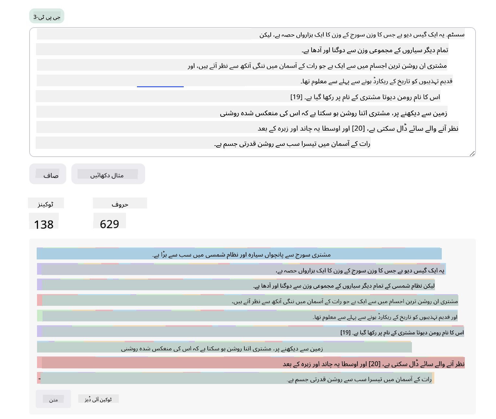
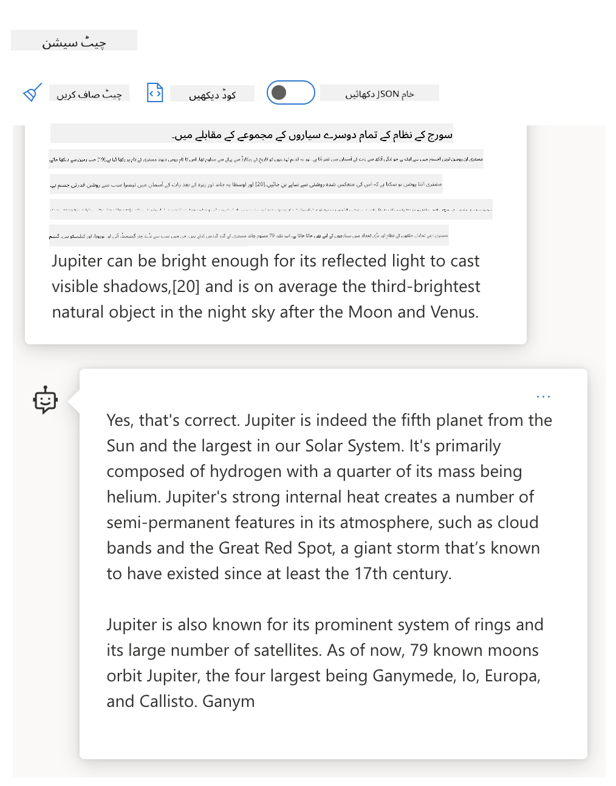
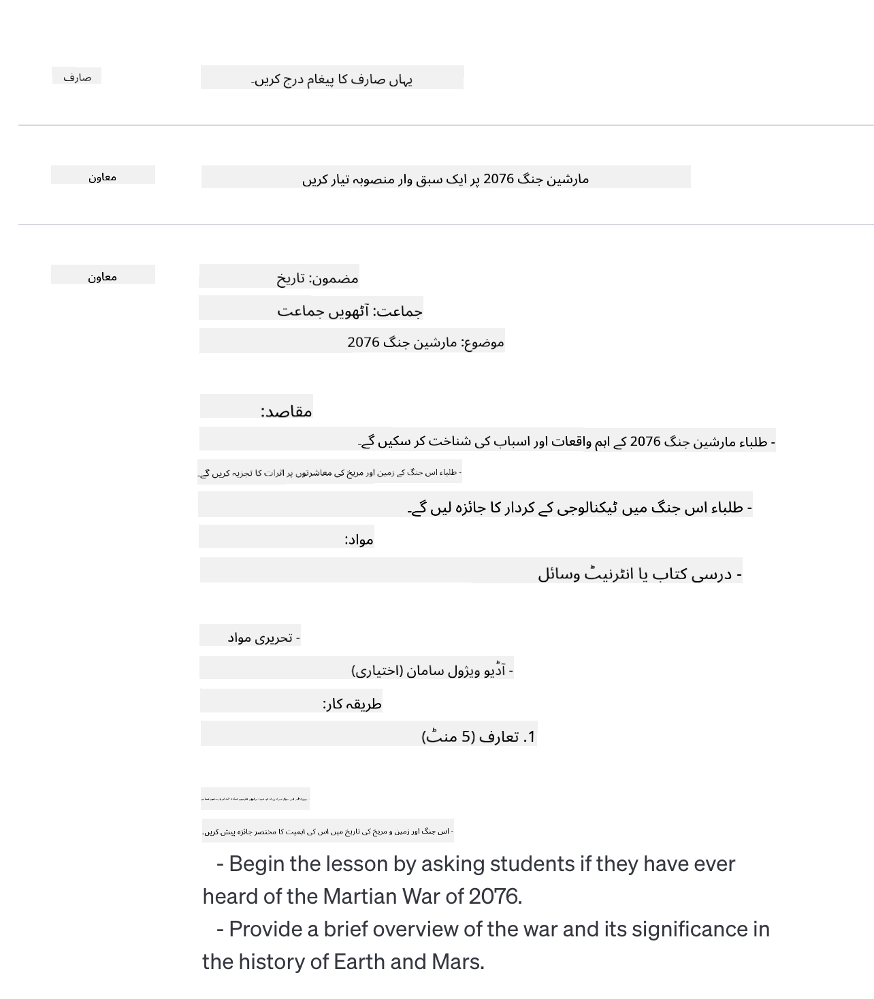
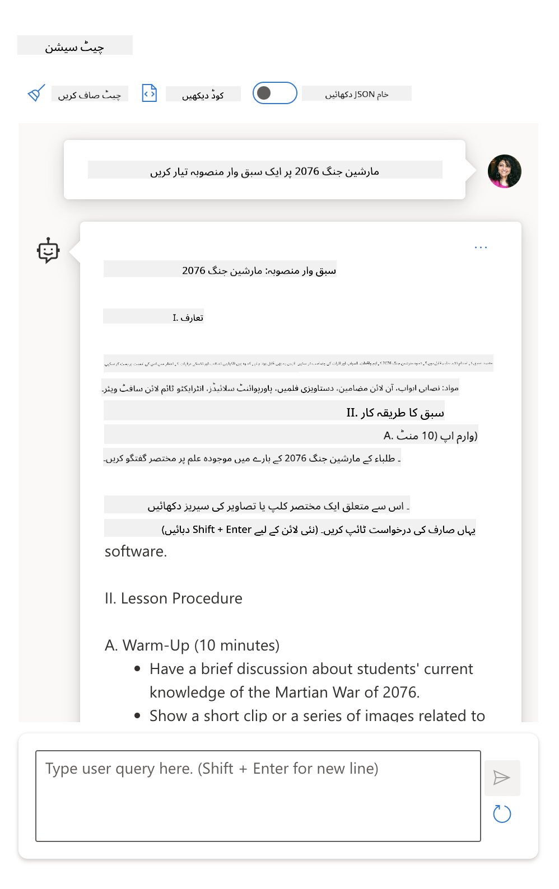
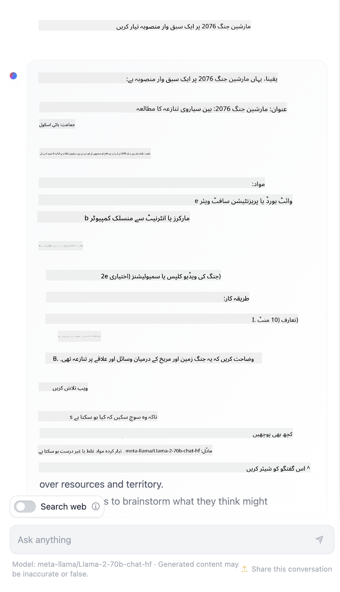

<!--
CO_OP_TRANSLATOR_METADATA:
{
  "original_hash": "dcbaaae026cb50fee071e690685b5843",
  "translation_date": "2025-08-26T14:24:57+00:00",
  "source_file": "04-prompt-engineering-fundamentals/README.md",
  "language_code": "ur"
}
-->
# پرامپٹ انجینئرنگ کی بنیادی باتیں

[](https://aka.ms/gen-ai-lesson4-gh?WT.mc_id=academic-105485-koreyst)

## تعارف
اس ماڈیول میں جنریٹیو اے آئی ماڈلز کے لیے مؤثر پرامپٹس بنانے کے اہم تصورات اور تکنیکیں شامل ہیں۔ جس طرح آپ LLM کو پرامپٹ لکھتے ہیں، وہ بھی اہمیت رکھتا ہے۔ ایک احتیاط سے تیار کردہ پرامپٹ بہتر معیار کا جواب حاصل کر سکتا ہے۔ لیکن اصل میں _پرامپٹ_ اور _پرامپٹ انجینئرنگ_ جیسے الفاظ کا کیا مطلب ہے؟ اور میں LLM کو بھیجے جانے والے پرامپٹ _ان پٹ_ کو کیسے بہتر بنا سکتا ہوں؟ یہ وہ سوالات ہیں جن کے جوابات ہم اس باب اور اگلے باب میں تلاش کریں گے۔

_جنریٹیو اے آئی_ نئی مواد (مثلاً، متن، تصاویر، آڈیو، کوڈ وغیرہ) بنانے کی صلاحیت رکھتی ہے، جو صارف کی درخواستوں کے جواب میں تیار ہوتا ہے۔ یہ _بڑے لینگویج ماڈلز_ جیسے OpenAI کے GPT ("Generative Pre-trained Transformer") سیریز کے ذریعے حاصل کیا جاتا ہے، جو قدرتی زبان اور کوڈ کے استعمال کے لیے تربیت یافتہ ہیں۔

اب صارفین ان ماڈلز کے ساتھ چیٹ جیسے مانوس انداز میں بات چیت کر سکتے ہیں، بغیر کسی تکنیکی مہارت یا تربیت کے۔ یہ ماڈلز _پرامپٹ پر مبنی_ ہیں - صارفین ایک ٹیکسٹ ان پٹ (پرامپٹ) بھیجتے ہیں اور اے آئی سے جواب (کمپلیشن) حاصل کرتے ہیں۔ پھر وہ "اے آئی سے بات چیت" کر سکتے ہیں، کئی بار سوال و جواب کے ذریعے، اپنے پرامپٹ کو بہتر بناتے ہیں جب تک کہ جواب ان کی توقعات کے مطابق نہ ہو جائے۔

اب "پرامپٹس" جنریٹیو اے آئی ایپس کے لیے بنیادی _پروگرامنگ انٹرفیس_ بن چکے ہیں، جو ماڈلز کو بتاتے ہیں کہ کیا کرنا ہے اور واپس آنے والے جوابات کے معیار پر اثر انداز ہوتے ہیں۔ "پرامپٹ انجینئرنگ" ایک تیزی سے ابھرتا ہوا شعبہ ہے جو پرامپٹس کے _ڈیزائن اور آپٹیمائزیشن_ پر مرکوز ہے تاکہ بڑے پیمانے پر مستقل اور معیاری جوابات حاصل کیے جا سکیں۔

## سیکھنے کے مقاصد

اس سبق میں ہم سیکھیں گے کہ پرامپٹ انجینئرنگ کیا ہے، یہ کیوں اہم ہے، اور ہم کسی مخصوص ماڈل اور ایپلیکیشن کے مقصد کے لیے زیادہ مؤثر پرامپٹس کیسے تیار کر سکتے ہیں۔ ہم پرامپٹ انجینئرنگ کے بنیادی تصورات اور بہترین طریقوں کو سمجھیں گے - اور ایک انٹرایکٹو Jupyter Notebooks "سینڈ باکس" ماحول کے بارے میں جانیں گے جہاں ہم ان تصورات کو حقیقی مثالوں پر لاگو ہوتا دیکھ سکتے ہیں۔

اس سبق کے اختتام تک ہم یہ کرنے کے قابل ہوں گے:

1. وضاحت کریں کہ پرامپٹ انجینئرنگ کیا ہے اور یہ کیوں اہم ہے۔
2. پرامپٹ کے اجزاء بیان کریں اور ان کا استعمال کیسے ہوتا ہے۔
3. پرامپٹ انجینئرنگ کے بہترین طریقے اور تکنیکیں سیکھیں۔
4. سیکھی گئی تکنیکوں کو حقیقی مثالوں پر لاگو کریں، OpenAI اینڈ پوائنٹ استعمال کرتے ہوئے۔

## اہم اصطلاحات

پرامپٹ انجینئرنگ: اے آئی ماڈلز کو مطلوبہ نتائج کی طرف رہنمائی کرنے کے لیے ان پٹس کو ڈیزائن اور بہتر بنانے کا عمل۔
ٹوکنائزیشن: ٹیکسٹ کو چھوٹے یونٹس (ٹوکنز) میں تبدیل کرنے کا عمل، جنہیں ماڈل سمجھ اور پراسیس کر سکتا ہے۔
انسٹرکشن-ٹیونڈ LLMs: بڑے لینگویج ماڈلز (LLMs) جنہیں مخصوص ہدایات کے ساتھ بہتر بنایا گیا ہے تاکہ ان کے جوابات کی درستگی اور مطابقت میں اضافہ ہو۔

## سیکھنے کا سینڈ باکس

پرامپٹ انجینئرنگ اس وقت سائنس سے زیادہ ایک فن ہے۔ اس میں مہارت حاصل کرنے کا بہترین طریقہ یہ ہے کہ _زیادہ مشق_ کی جائے اور آزمائش و خطا کا طریقہ اپنایا جائے، جس میں ایپلیکیشن ڈومین کی مہارت کو تجویز کردہ تکنیکوں اور ماڈل کی مخصوص آپٹیمائزیشن کے ساتھ ملایا جائے۔

اس سبق کے ساتھ آنے والا Jupyter Notebook ایک _سینڈ باکس_ ماحول فراہم کرتا ہے جہاں آپ جو کچھ سیکھتے ہیں اسے آزما سکتے ہیں - چاہے سبق کے دوران یا آخر میں کوڈ چیلنج کے طور پر۔ مشقیں چلانے کے لیے آپ کو یہ چیزیں درکار ہوں گی:

1. **Azure OpenAI API کلید** - تعینات شدہ LLM کے لیے سروس اینڈ پوائنٹ۔
2. **Python رن ٹائم** - جس میں نوٹ بک چلائی جا سکے۔
3. **لوکل اینوائرمنٹ ویری ایبلز** - _ابھی [SETUP](./../00-course-setup/02-setup-local.md?WT.mc_id=academic-105485-koreyst) کے مراحل مکمل کریں تاکہ تیاری ہو سکے_۔

نوٹ بک میں _ابتدائی_ مشقیں شامل ہیں - لیکن آپ کو ترغیب دی جاتی ہے کہ آپ اپنی _مارک ڈاؤن_ (تفصیل) اور _کوڈ_ (پرامپٹ ریکویسٹ) سیکشنز شامل کریں تاکہ مزید مثالیں یا آئیڈیاز آزما سکیں - اور پرامپٹ ڈیزائن کے لیے اپنی سمجھ کو بہتر بنا سکیں۔

## تصویری رہنمائی

کیا آپ سبق میں غوطہ لگانے سے پہلے اس میں شامل اہم نکات کا جائزہ لینا چاہتے ہیں؟ اس تصویری رہنمائی کو دیکھیں، جو آپ کو اہم موضوعات اور ہر ایک میں غور کرنے کے لیے اہم نکات کا خلاصہ فراہم کرتی ہے۔ سبق کا روڈ میپ آپ کو بنیادی تصورات اور چیلنجز کو سمجھنے سے لے کر متعلقہ پرامپٹ انجینئرنگ تکنیکوں اور بہترین طریقوں کے ذریعے ان کا حل تلاش کرنے تک لے جاتا ہے۔ نوٹ کریں کہ اس رہنمائی میں "ایڈوانسڈ ٹیکنیکس" والا سیکشن اس نصاب کے _اگلے_ باب میں شامل مواد کی طرف اشارہ کرتا ہے۔


## ہماری اسٹارٹ اپ

اب، آئیے بات کرتے ہیں کہ _یہ موضوع_ ہماری اسٹارٹ اپ کے مشن سے کیسے جڑا ہے، جس کا مقصد [تعلیم میں اے آئی جدت لانا](https://educationblog.microsoft.com/2023/06/collaborating-to-bring-ai-innovation-to-education?WT.mc_id=academic-105485-koreyst) ہے۔ ہم _ذاتی نوعیت کی تعلیم_ کے لیے اے آئی پر مبنی ایپلیکیشنز بنانا چاہتے ہیں - تو آئیے سوچتے ہیں کہ ہماری ایپلیکیشن کے مختلف صارفین پرامپٹس کو کیسے "ڈیزائن" کر سکتے ہیں:

- **ایڈمنسٹریٹرز** اے آئی سے _نصاب کے ڈیٹا کا تجزیہ کر کے کمزوریوں کی نشاندہی_ کرنے کو کہہ سکتے ہیں۔ اے آئی نتائج کا خلاصہ یا کوڈ کے ذریعے ان کی وضاحت کر سکتی ہے۔
- **اساتذہ** اے آئی سے _کسی خاص سامعین اور موضوع کے لیے سبق کا منصوبہ تیار کرنے_ کو کہہ سکتے ہیں۔ اے آئی مخصوص فارمیٹ میں ذاتی نوعیت کا منصوبہ بنا سکتی ہے۔
- **طلبہ** اے آئی سے _کسی مشکل مضمون میں رہنمائی_ مانگ سکتے ہیں۔ اب اے آئی طلبہ کو ان کی سطح کے مطابق اسباق، اشارے اور مثالوں کے ساتھ رہنمائی فراہم کر سکتی ہے۔

یہ تو صرف شروعات ہے۔ [تعلیم کے لیے پرامپٹس](https://github.com/microsoft/prompts-for-edu/tree/main?WT.mc_id=academic-105485-koreyst) دیکھیں - ایک اوپن سورس پرامپٹس لائبریری جو تعلیم کے ماہرین نے ترتیب دی ہے - تاکہ امکانات کا وسیع تر اندازہ ہو سکے! _ان میں سے کچھ پرامپٹس سینڈ باکس میں یا OpenAI Playground میں آزما کر دیکھیں کہ کیا ہوتا ہے!_

<!--
سبق کا سانچہ:
اس یونٹ میں بنیادی تصور #1 شامل ہونا چاہیے۔
مثالوں اور حوالوں کے ساتھ تصور کو مضبوط کریں۔

تصور #1:
پرامپٹ انجینئرنگ۔
اسے بیان کریں اور وضاحت کریں کہ اس کی ضرورت کیوں ہے۔
-->

## پرامپٹ انجینئرنگ کیا ہے؟

ہم نے اس سبق کی شروعات **پرامپٹ انجینئرنگ** کی تعریف سے کی، یعنی _ٹیکسٹ ان پٹس (پرامپٹس) کو ڈیزائن اور بہتر بنانے_ کا عمل، تاکہ کسی مخصوص ایپلیکیشن کے مقصد اور ماڈل کے لیے مستقل اور معیاری جوابات (کمپلیشنز) حاصل کیے جا سکیں۔ ہم اسے دو مراحل کے عمل کے طور پر دیکھ سکتے ہیں:

- مخصوص ماڈل اور مقصد کے لیے ابتدائی پرامپٹ _ڈیزائن کرنا_
- جواب کے معیار کو بہتر بنانے کے لیے پرامپٹ کو _بار بار بہتر بنانا_

یہ لازمی طور پر آزمائش و خطا کا عمل ہے، جس میں بہترین نتائج کے لیے صارف کی سمجھ اور محنت درکار ہوتی ہے۔ تو یہ کیوں اہم ہے؟ اس سوال کا جواب دینے کے لیے ہمیں پہلے تین تصورات کو سمجھنا ہوگا:

- _ٹوکنائزیشن_ = ماڈل پرامپٹ کو کیسے "دیکھتا" ہے
- _بیس LLMs_ = بنیادی ماڈل پرامپٹ کو کیسے "پراسیس" کرتا ہے
- _انسٹرکشن-ٹیونڈ LLMs_ = ماڈل اب "ٹاسک" کیسے دیکھ سکتا ہے

### ٹوکنائزیشن

ایک LLM پرامپٹس کو _ٹوکنز کے سلسلے_ کے طور پر دیکھتا ہے، جہاں مختلف ماڈلز (یا ایک ہی ماڈل کے مختلف ورژنز) ایک ہی پرامپٹ کو مختلف انداز میں ٹوکنائز کر سکتے ہیں۔ چونکہ LLMs کو ٹوکنز (اور نہ کہ خام ٹیکسٹ) پر تربیت دی جاتی ہے، اس لیے پرامپٹس کا ٹوکنائز ہونا براہ راست پیدا ہونے والے جواب کے معیار پر اثر انداز ہوتا ہے۔

ٹوکنائزیشن کے کام کرنے کا اندازہ لگانے کے لیے [OpenAI Tokenizer](https://platform.openai.com/tokenizer?WT.mc_id=academic-105485-koreyst) جیسے ٹولز آزمائیں۔ اپنا پرامپٹ کاپی کریں - اور دیکھیں کہ وہ کیسے ٹوکنز میں تبدیل ہوتا ہے، خاص طور پر اس بات پر توجہ دیں کہ خالی جگہیں اور رموز کیسے ہینڈل ہوتے ہیں۔ نوٹ کریں کہ یہ مثال ایک پرانا LLM (GPT-3) دکھاتی ہے - اس لیے نئے ماڈل کے ساتھ آزمانے پر مختلف نتیجہ آ سکتا ہے۔



### تصور: فاؤنڈیشن ماڈلز

ایک بار پرامپٹ ٹوکنائز ہو جائے تو ["بیس LLM"](https://blog.gopenai.com/an-introduction-to-base-and-instruction-tuned-large-language-models-8de102c785a6?WT.mc_id=academic-105485-koreyst) (یا فاؤنڈیشن ماڈل) کا بنیادی کام اس سلسلے میں اگلے ٹوکن کی پیش گوئی کرنا ہوتا ہے۔ چونکہ LLMs کو بڑے پیمانے پر ٹیکسٹ ڈیٹا سیٹس پر تربیت دی جاتی ہے، اس لیے انہیں ٹوکنز کے درمیان شماریاتی تعلقات کا اچھا اندازہ ہوتا ہے اور وہ اس پیش گوئی کو اعتماد کے ساتھ کر سکتے ہیں۔ نوٹ کریں کہ وہ پرامپٹ یا ٹوکن میں الفاظ کے _معنی_ کو نہیں سمجھتے؛ وہ صرف ایک پیٹرن دیکھتے ہیں جسے وہ اپنی اگلی پیش گوئی سے "مکمل" کر سکتے ہیں۔ وہ اس سلسلے کی پیش گوئی اس وقت تک جاری رکھ سکتے ہیں جب تک صارف مداخلت نہ کرے یا کوئی پہلے سے طے شدہ شرط پوری نہ ہو جائے۔

کیا آپ دیکھنا چاہتے ہیں کہ پرامپٹ پر مبنی کمپلیشن کیسے کام کرتی ہے؟ اوپر دیا گیا پرامپٹ Azure OpenAI Studio کے [_Chat Playground_](https://oai.azure.com/playground?WT.mc_id=academic-105485-koreyst) میں ڈیفالٹ سیٹنگز کے ساتھ درج کریں۔ سسٹم پرامپٹس کو معلومات کی درخواست کے طور پر لیتا ہے - اس لیے آپ کو اس سیاق و سباق کے مطابق کمپلیشن نظر آئے گی۔

لیکن اگر صارف کچھ مخصوص دیکھنا چاہے جو کسی معیار یا ٹاسک کے مقصد پر پورا اترتا ہو؟ یہاں _انسٹرکشن-ٹیونڈ_ LLMs سامنے آتے ہیں۔



### تصور: انسٹرکشن-ٹیونڈ LLMs

ایک [انسٹرکشن-ٹیونڈ LLM](https://blog.gopenai.com/an-introduction-to-base-and-instruction-tuned-large-language-models-8de102c785a6?WT.mc_id=academic-105485-koreyst) فاؤنڈیشن ماڈل سے شروع ہوتا ہے اور اسے مثالوں یا ان پٹ/آؤٹ پٹ جوڑوں (مثلاً، کئی بار کے "پیغامات") کے ساتھ بہتر بنایا جاتا ہے، جن میں واضح ہدایات شامل ہو سکتی ہیں - اور اے آئی کا جواب اس ہدایت پر عمل کرنے کی کوشش کرتا ہے۔

اس میں Reinforcement Learning with Human Feedback (RLHF) جیسی تکنیکیں استعمال ہوتی ہیں، جو ماڈل کو _ہدایات پر عمل_ اور _فیڈ بیک سے سیکھنے_ کی تربیت دیتی ہیں، تاکہ وہ ایسے جوابات دے سکے جو عملی ایپلیکیشنز کے لیے زیادہ موزوں اور صارف کے مقاصد سے زیادہ متعلقہ ہوں۔

آئیے اسے آزما کر دیکھتے ہیں - اوپر والا پرامپٹ دوبارہ استعمال کریں، لیکن اب _سسٹم میسج_ کو تبدیل کر کے مندرجہ ذیل ہدایت سیاق و سباق کے طور پر دیں:

> _آپ کو جو مواد فراہم کیا جائے، اس کا خلاصہ دوسری جماعت کے طالب علم کے لیے کریں۔ نتیجہ ایک پیراگراف میں 3-5 بلٹ پوائنٹس کے ساتھ رکھیں۔_

دیکھیں کہ اب نتیجہ مطلوبہ مقصد اور فارمیٹ کے مطابق کیسے ڈھل گیا ہے؟ ایک استاد اب اس جواب کو براہ راست اپنی کلاس کی سلائیڈز میں استعمال کر سکتا ہے۔


## ہمیں پرامپٹ انجینئرنگ کی ضرورت کیوں ہے؟

اب جب کہ ہم جان چکے ہیں کہ پرامپٹس LLMs کے ذریعے کیسے پراسیس ہوتے ہیں، آئیے بات کرتے ہیں کہ _ہمیں پرامپٹ انجینئرنگ کی ضرورت کیوں ہے_۔ اس کا جواب اس حقیقت میں ہے کہ موجودہ LLMs کئی چیلنجز پیش کرتے ہیں، جن کی وجہ سے _قابل اعتماد اور مستقل کمپلیشنز_ حاصل کرنا مشکل ہو جاتا ہے، جب تک کہ پرامپٹ کی تیاری اور آپٹیمائزیشن میں محنت نہ کی جائے۔ مثلاً:

1. **ماڈل کے جوابات غیر متوقع ہو سکتے ہیں۔** _ایک ہی پرامپٹ_ مختلف ماڈلز یا ماڈل ورژنز کے ساتھ مختلف جوابات دے سکتا ہے۔ اور یہ _ایک ہی ماڈل_ کے ساتھ مختلف اوقات میں بھی مختلف نتائج دے سکتا ہے۔ _پرامپٹ انجینئرنگ تکنیکیں ان تغیرات کو کم کرنے میں مدد کر سکتی ہیں، بہتر رہنمائی فراہم کر کے_۔

1. **ماڈلز جوابات گھڑ سکتے ہیں۔** ماڈلز کو _بڑے لیکن محدود_ ڈیٹا سیٹس پر تربیت دی جاتی ہے، اس کا مطلب ہے کہ انہیں تربیت کے دائرے سے باہر کے تصورات کا علم نہیں ہوتا۔ اس کے نتیجے میں وہ ایسے کمپلیشنز دے سکتے ہیں جو غلط، فرضی یا معروف حقائق کے منافی ہوں۔ _پرامپٹ انجینئرنگ تکنیکیں صارفین کو ایسی گھڑنت کی نشاندہی اور تدارک میں مدد دیتی ہیں، مثلاً، اے آئی سے حوالہ جات یا استدلال مانگ کر_۔

1. **ماڈلز کی صلاحیتیں مختلف ہوں گی۔** نئے ماڈلز یا ماڈل جنریشنز میں زیادہ صلاحیتیں ہوں گی، لیکن ساتھ ہی لاگت اور پیچیدگی میں منفرد پہلو اور سمجھوتے بھی آئیں گے۔ _پرامپٹ انجینئرنگ ہمیں بہترین طریقے اور ورک فلو تیار کرنے میں مدد دیتی ہے، جو فرق کو چھپا کر ماڈل کی مخصوص ضروریات کے مطابق بڑے پیمانے پر اور آسانی سے ڈھل سکیں_۔

آئیے اسے OpenAI یا Azure OpenAI Playground میں عملی طور پر دیکھتے ہیں:

- ایک ہی پرامپٹ مختلف LLM ڈپلائمنٹس (مثلاً، OpenAI، Azure OpenAI، Hugging Face) کے ساتھ استعمال کریں - کیا آپ نے فرق دیکھا؟
- ایک ہی پرامپٹ _ایک ہی_ LLM ڈپلائمنٹ (مثلاً، Azure OpenAI playground) کے ساتھ بار بار استعمال کریں - ان فرقوں میں کیا فرق تھا؟

### گھڑنت کی مثال

اس کورس میں ہم **"گھڑنت"** کی اصطلاح استعمال کرتے ہیں، جس سے مراد وہ صورتحال ہے جب LLMs کبھی کبھار اپنی تربیت یا دیگر حدود کی وجہ سے حقیقت کے برعکس معلومات تیار کرتے ہیں۔ آپ نے اسے مقبول مضامین یا تحقیقی مقالوں میں _"ہیلوسینیشن"_ کے طور پر بھی سنا ہو گا۔ تاہم، ہم پرزور سفارش کرتے ہیں کہ _"گ
# مریخی جنگ 2076 پر سبق کا منصوبہ

## تعارف

اس سبق میں، طلباء مریخی جنگ 2076 کے اہم واقعات، اسباب اور نتائج کا مطالعہ کریں گے۔ اس کے علاوہ، وہ اس جنگ کے انسانی معاشرے اور سائنس پر پڑنے والے اثرات کو بھی سمجھیں گے۔

## مقاصد

- مریخی جنگ 2076 کے پس منظر اور وجوہات کو بیان کرنا
- جنگ کے اہم مراحل اور واقعات کو سمجھنا
- اس جنگ کے بعد آنے والی تبدیلیوں اور اثرات کا تجزیہ کرنا
- طلباء میں تنقیدی سوچ اور تجزیاتی صلاحیتوں کو فروغ دینا

## سرگرمیاں

### 1. ابتدائی گفتگو

اساتذہ طلباء سے پوچھیں گے کہ وہ مریخی جنگ 2076 کے بارے میں کیا جانتے ہیں۔ اس کے بعد، مختصر تعارف پیش کریں گے۔

### 2. تاریخی جائزہ

طلباء کو مریخی جنگ کے آغاز، اہم کرداروں اور اہم واقعات کے بارے میں معلومات فراہم کریں۔ اس میں درج ذیل نکات شامل ہوں گے:

- زمین اور مریخ کے درمیان تعلقات
- جنگ کے اسباب
- اہم لڑائیاں اور معاہدے

### 3. گروپ ورک

طلباء کو گروپوں میں تقسیم کریں اور انہیں مریخی جنگ کے مختلف پہلوؤں پر تحقیق کرنے کا کام دیں، جیسے:

- ٹیکنالوجی کا کردار
- سیاسی اثرات
- سماجی تبدیلیاں

### 4. پریزنٹیشن

ہر گروپ اپنی تحقیق کلاس کے سامنے پیش کرے گا۔ اس کے بعد سوال و جواب کا سیشن ہوگا۔

### 5. تجزیہ اور مباحثہ

طلباء سے پوچھیں کہ اگر وہ اس وقت زندہ ہوتے تو ان کا ردعمل کیا ہوتا؟ اس جنگ نے انسانیت کو کیسے بدل دیا؟

## جائزہ

- مختصر سوالات اور جوابات
- گروپ پریزنٹیشن کی بنیاد پر تشخیص
- تحریری مضمون: "مریخی جنگ 2076 کے اثرات"

## وسائل

- مریخی جنگ 2076 پر دستاویزی فلمیں
- تحقیقاتی مضامین اور کتابیں
- انٹرنیٹ ذرائع

## اختتام

سبق کے آخر میں، طلباء مریخی جنگ 2076 کے اسباب، واقعات اور اثرات کو بہتر طور پر سمجھ سکیں گے اور اس موضوع پر اپنی رائے بھی دے سکیں گے۔
ایک ویب تلاش سے معلوم ہوا کہ مریخ کی جنگوں پر خیالی کہانیاں (جیسے ٹی وی سیریز یا کتابیں) موجود ہیں – لیکن 2076 میں کوئی نہیں۔ عام فہم بھی یہی بتاتی ہے کہ 2076 _مستقبل_ میں ہے، اس لیے اسے کسی حقیقی واقعے سے جوڑنا ممکن نہیں۔

تو پھر کیا ہوتا ہے جب ہم یہ پرامپٹ مختلف LLM فراہم کنندگان کے ساتھ آزماتے ہیں؟

> **جواب 1**: اوپن اے آئی پلے گراؤنڈ (GPT-35)



> **جواب 2**: ایژر اوپن اے آئی پلے گراؤنڈ (GPT-35)



> **جواب 3**: : ہگنگ فیس چیٹ پلے گراؤنڈ (LLama-2)



جیسا کہ توقع تھی، ہر ماڈل (یا ماڈل ورژن) تھوڑا مختلف جواب دیتا ہے، جس کی وجہ اس کا اتفاقی رویہ اور ماڈل کی صلاحیتوں میں فرق ہے۔ مثلاً، ایک ماڈل آٹھویں جماعت کے طلبہ کو ہدف بناتا ہے جبکہ دوسرا ہائی اسکول کے طالب علم کو فرض کرتا ہے۔ لیکن تینوں ماڈلز نے ایسے جوابات دیے جو کسی لاعلم صارف کو یہ یقین دلا سکتے تھے کہ یہ واقعہ حقیقت میں ہوا تھا۔

پرامپٹ انجینئرنگ کی تکنیکیں جیسے _میٹا پرامپٹنگ_ اور _ٹمپریچر کنفیگریشن_ کسی حد تک ماڈل کی من گھڑت باتوں کو کم کر سکتی ہیں۔ نئی پرامپٹ انجینئرنگ _آرکیٹیکچرز_ میں بھی نئے ٹولز اور تکنیکیں پرامپٹ فلو میں بغیر کسی رکاوٹ کے شامل کی جاتی ہیں، تاکہ ان اثرات کو کم یا ختم کیا جا سکے۔

## کیس اسٹڈی: گٹ ہب کوپائلٹ

آئیے اس حصے کو سمیٹتے ہیں اور دیکھتے ہیں کہ پرامپٹ انجینئرنگ حقیقی دنیا کے حل میں کیسے استعمال ہوتی ہے، ایک کیس اسٹڈی کے ذریعے: [گٹ ہب کوپائلٹ](https://github.com/features/copilot?WT.mc_id=academic-105485-koreyst)۔

گٹ ہب کوپائلٹ آپ کا "اے آئی جوڑی پروگرامر" ہے – یہ ٹیکسٹ پرامپٹس کوڈ کمپلیشنز میں بدل دیتا ہے اور آپ کے ڈیولپمنٹ ماحول (جیسے ویژول اسٹوڈیو کوڈ) میں ضم ہو جاتا ہے تاکہ صارف کو بغیر رکاوٹ کے تجربہ ملے۔ نیچے دی گئی بلاگز کی سیریز میں بتایا گیا ہے کہ ابتدائی ورژن اوپن اے آئی کوڈیکس ماڈل پر مبنی تھا – لیکن انجینئرز نے جلد ہی ماڈل کو فائن ٹیون کرنے اور بہتر پرامپٹ انجینئرنگ تکنیکیں تیار کرنے کی ضرورت محسوس کی، تاکہ کوڈ کے معیار کو بہتر بنایا جا سکے۔ جولائی میں، انہوں نے [ایک بہتر اے آئی ماڈل متعارف کرایا جو کوڈیکس سے آگے ہے](https://github.blog/2023-07-28-smarter-more-efficient-coding-github-copilot-goes-beyond-codex-with-improved-ai-model/?WT.mc_id=academic-105485-koreyst) اور مزید تیز تجاویز فراہم کرتا ہے۔

ان کی سیکھنے کی کہانی کو سمجھنے کے لیے پوسٹس کو ترتیب وار پڑھیں۔

- **مئی 2023** | [گٹ ہب کوپائلٹ آپ کے کوڈ کو بہتر سمجھنے لگا ہے](https://github.blog/2023-05-17-how-github-copilot-is-getting-better-at-understanding-your-code/?WT.mc_id=academic-105485-koreyst)
- **مئی 2023** | [گٹ ہب کے اندر: گٹ ہب کوپائلٹ کے پیچھے LLMs کے ساتھ کام کرنا](https://github.blog/2023-05-17-inside-github-working-with-the-llms-behind-github-copilot/?WT.mc_id=academic-105485-koreyst)
- **جون 2023** | [گٹ ہب کوپائلٹ کے لیے بہتر پرامپٹس کیسے لکھیں](https://github.blog/2023-06-20-how-to-write-better-prompts-for-github-copilot/?WT.mc_id=academic-105485-koreyst)
- **جولائی 2023** | [.. گٹ ہب کوپائلٹ بہتر اے آئی ماڈل کے ساتھ کوڈیکس سے آگے](https://github.blog/2023-07-28-smarter-more-efficient-coding-github-copilot-goes-beyond-codex-with-improved-ai-model/?WT.mc_id=academic-105485-koreyst)
- **جولائی 2023** | [ڈیولپرز کے لیے پرامپٹ انجینئرنگ اور LLMs کی رہنمائی](https://github.blog/2023-07-17-prompt-engineering-guide-generative-ai-llms/?WT.mc_id=academic-105485-koreyst)
- **ستمبر 2023** | [انٹرپرائز LLM ایپ کیسے بنائیں: گٹ ہب کوپائلٹ سے سیکھے گئے اسباق](https://github.blog/2023-09-06-how-to-build-an-enterprise-llm-application-lessons-from-github-copilot/?WT.mc_id=academic-105485-koreyst)

آپ ان کا [انجینئرنگ بلاگ](https://github.blog/category/engineering/?WT.mc_id=academic-105485-koreyst) بھی دیکھ سکتے ہیں، مزید پوسٹس کے لیے جیسے [یہ والی](https://github.blog/2023-09-27-how-i-used-github-copilot-chat-to-build-a-reactjs-gallery-prototype/?WT.mc_id=academic-105485-koreyst) جس میں دکھایا گیا ہے کہ یہ ماڈلز اور تکنیکیں حقیقی دنیا کی ایپلیکیشنز میں کیسے _استعمال_ ہوتی ہیں۔

---

## پرامپٹ کی تشکیل

ہم نے دیکھا کہ پرامپٹ انجینئرنگ کیوں اہم ہے – اب آئیے سمجھتے ہیں کہ پرامپٹس کیسے _بنائے_ جاتے ہیں تاکہ ہم زیادہ مؤثر پرامپٹ ڈیزائن کے لیے مختلف تکنیکوں کا جائزہ لے سکیں۔

### بنیادی پرامپٹ

آئیے سب سے بنیادی پرامپٹ سے شروع کرتے ہیں: ایک ٹیکسٹ ان پٹ جو ماڈل کو بغیر کسی اضافی سیاق و سباق کے بھیجا جاتا ہے۔ مثال کے طور پر – جب ہم امریکی قومی ترانے کے ابتدائی الفاظ اوپن اے آئی [کمپلیشن API](https://platform.openai.com/docs/api-reference/completions?WT.mc_id=academic-105485-koreyst) کو بھیجتے ہیں تو یہ فوراً اگلی سطریں _مکمل_ کر دیتا ہے، جو بنیادی پیشن گوئی کے رویے کو ظاہر کرتا ہے۔

| پرامپٹ (ان پٹ)     | کمپلیشن (آؤٹ پٹ)                                                                                                                        |
| :----------------- | :----------------------------------------------------------------------------------------------------------------------------------------- |
| Oh say can you see | ایسا لگتا ہے آپ "The Star-Spangled Banner" کے بول شروع کر رہے ہیں، جو ریاستہائے متحدہ کا قومی ترانہ ہے۔ مکمل بول یہ ہیں ... |

### پیچیدہ پرامپٹ

اب اس بنیادی پرامپٹ میں سیاق و سباق اور ہدایات شامل کرتے ہیں۔ [چیٹ کمپلیشن API](https://learn.microsoft.com/azure/ai-services/openai/how-to/chatgpt?WT.mc_id=academic-105485-koreyst) ہمیں ایک پیچیدہ پرامپٹ بنانے کی سہولت دیتا ہے، جو _پیغامات_ کے مجموعے پر مشتمل ہوتا ہے:

- ان پٹ/آؤٹ پٹ جو _یوزر_ ان پٹ اور _اسسٹنٹ_ کے جواب کی عکاسی کرتے ہیں۔
- سسٹم میسج جو اسسٹنٹ کے رویے یا شخصیت کے لیے سیاق و سباق طے کرتا ہے۔

اب درخواست اس شکل میں ہے، جہاں _ٹوکینائزیشن_ مؤثر طریقے سے سیاق و سباق اور گفتگو سے متعلقہ معلومات کو محفوظ کرتی ہے۔ اب، سسٹم سیاق و سباق کو تبدیل کرنا کمپلیشن کے معیار پر اتنا ہی اثرانداز ہو سکتا ہے جتنا یوزر ان پٹس۔

```python
response = openai.chat.completions.create(
    model="gpt-3.5-turbo",
    messages=[
        {"role": "system", "content": "You are a helpful assistant."},
        {"role": "user", "content": "Who won the world series in 2020?"},
        {"role": "assistant", "content": "The Los Angeles Dodgers won the World Series in 2020."},
        {"role": "user", "content": "Where was it played?"}
    ]
)
```

### ہدایت پرامپٹ

اوپر دی گئی مثالوں میں، یوزر پرامپٹ ایک سادہ ٹیکسٹ سوال تھا جسے معلومات کی درخواست کے طور پر سمجھا جا سکتا ہے۔ _انسٹرکشن_ پرامپٹس کے ساتھ، ہم اس ٹیکسٹ کو زیادہ تفصیل سے ٹاسک بیان کرنے کے لیے استعمال کر سکتے ہیں، جس سے اے آئی کو بہتر رہنمائی ملتی ہے۔ مثال ملاحظہ کریں:

| پرامپٹ (ان پٹ)                                                                                                                                                                                                                         | کمپلیشن (آؤٹ پٹ)                                                                                                        | ہدایت کی قسم    |
| :------------------------------------------------------------------------------------------------------------------------------------------------------------------------------------------------------------------------------------- | :------------------------------------------------------------------------------------------------------------------------- | :------------------ |
| Write a description of the Civil War                                                                                                                                                                                                   | _ایک سادہ پیراگراف واپس کیا گیا_                                                                                              | سادہ              |
| Write a description of the Civil War. Provide key dates and events and describe their significance                                                                                                                                     | _ایک پیراگراف کے بعد اہم واقعات کی تاریخوں کی فہرست اور وضاحت واپس کی گئی_                                             | پیچیدہ             |
| Write a description of the Civil War in 1 paragraph. Provide 3 bullet points with key dates and their significance. Provide 3 more bullet points with key historical figures and their contributions. Return the output as a JSON file | _زیادہ تفصیل کے ساتھ ایک ٹیکسٹ باکس میں جواب دیا گیا، جو JSON فارمیٹ میں ہے اور آپ اسے فائل میں کاپی پیسٹ کر کے ضرورت کے مطابق ویلیڈیٹ کر سکتے ہیں_ | پیچیدہ، فارمیٹڈ. |

## بنیادی مواد

اوپر دی گئی مثالوں میں، پرامپٹ اب بھی کافی کھلا تھا، جس سے LLM کو یہ فیصلہ کرنے کی آزادی تھی کہ اس کے پری ٹرینڈ ڈیٹاسیٹ کا کون سا حصہ متعلقہ ہے۔ _بنیادی مواد_ ڈیزائن پیٹرن کے ساتھ، ان پٹ ٹیکسٹ کو دو حصوں میں تقسیم کیا جاتا ہے:

- ایک ہدایت (عمل)
- متعلقہ مواد (جو عمل پر اثرانداز ہوتا ہے)

یہاں ایک مثال ہے جہاں ہدایت ہے "اسے دو جملوں میں خلاصہ کریں"۔

| پرامپٹ (ان پٹ)                                                                                                                                                                                                                                                                                                                                                                                                                                                                                                                                                                                                                                                                                      | کمپلیشن (آؤٹ پٹ)                                                                                                                                                                                                                                                                             |
| :-------------------------------------------------------------------------------------------------------------------------------------------------------------------------------------------------------------------------------------------------------------------------------------------------------------------------------------------------------------------------------------------------------------------------------------------------------------------------------------------------------------------------------------------------------------------------------------------------------------------------------------------------------------------------------------------------- | :---------------------------------------------------------------------------------------------------------------------------------------------------------------------------------------------------------------------------------------------------------------------------------------------- |
| Jupiter is the fifth planet from the Sun and the largest in the Solar System. It is a gas giant with a mass one-thousandth that of the Sun, but two-and-a-half times that of all the other planets in the Solar System combined. Jupiter is one of the brightest objects visible to the naked eye in the night sky, and has been known to ancient civilizations since before recorded history. It is named after the Roman god Jupiter.[19] When viewed from Earth, Jupiter can be bright enough for its reflected light to cast visible shadows,[20] and is on average the third-brightest natural object in the night sky after the Moon and Venus. <br/> **Summarize this in 2 short sentences** | مشتری، سورج سے پانچواں سیارہ ہے اور نظام شمسی کا سب سے بڑا سیارہ ہے، جو رات کے آسمان میں سب سے زیادہ چمکدار اجسام میں شمار ہوتا ہے۔ رومی دیوتا مشتری کے نام پر رکھا گیا یہ گیس جائنٹ ہے، جس کا وزن باقی تمام سیاروں کے مجموعی وزن سے ڈھائی گنا زیادہ ہے۔ |

بنیادی مواد کے حصے کو مختلف طریقوں سے زیادہ مؤثر ہدایات کے لیے استعمال کیا جا سکتا ہے:

- **مثالیں** – ماڈل کو واضح ہدایت دینے کے بجائے، اسے مطلوبہ آؤٹ پٹ کی مثالیں دیں اور اسے پیٹرن اخذ کرنے دیں۔
- **اشارے** – ہدایت کے بعد ایک "اشارہ" دیں جو کمپلیشن کو پرائم کرے، اور ماڈل کو زیادہ متعلقہ جوابات کی طرف رہنمائی کرے۔
- **ٹیمپلیٹس** – یہ ریپیٹیبل 'ریسیپیز' ہیں جن میں پلیس ہولڈرز (ویری ایبلز) ہوتے ہیں، جنہیں مخصوص ڈیٹا کے ساتھ اپنی مرضی کے مطابق استعمال کیا جا سکتا ہے۔

آئیے ان کو عملی طور پر دیکھتے ہیں۔

### مثالوں کا استعمال

یہ وہ طریقہ ہے جس میں آپ بنیادی مواد کو استعمال کرتے ہوئے ماڈل کو مطلوبہ آؤٹ پٹ کی کچھ مثالیں فراہم کرتے ہیں، اور اسے مطلوبہ پیٹرن اخذ کرنے دیتے ہیں۔ فراہم کردہ مثالوں کی تعداد کے لحاظ سے، ہم زیرو شاٹ پرامپٹنگ، ون شاٹ پرامپٹنگ، فیو شاٹ پرامپٹنگ وغیرہ کر سکتے ہیں۔

اب پرامپٹ تین اجزاء پر مشتمل ہے:

- ٹاسک کی وضاحت
- مطلوبہ آؤٹ پٹ کی چند مثالیں
- ایک نئی مثال کی شروعات (جو ایک غیر اعلانیہ ٹاسک ڈسکرپشن بن جاتی ہے)

| سیکھنے کی قسم | پرامپٹ (ان پٹ)                                                                                                                                        | کمپلیشن (آؤٹ پٹ)         |
| :------------ | :---------------------------------------------------------------------------------------------------------------------------------------------------- | :-------------------------- |
| زیرو شاٹ     | "The Sun is Shining". Translate to Spanish                                                                                                            | "El Sol está brillando".    |
| ون شاٹ      | "The Sun is Shining" => ""El Sol está brillando". <br> "It's a Cold and Windy Day" =>                                                                 | "Es un día frío y ventoso". |
| فیو شاٹ      | The player ran the bases => Baseball <br/> The player hit an ace => Tennis <br/> The player hit a six => Cricket <br/> The player made a slam-dunk => | Basketball                  |
|               |                                                                                                                                                       |                             |

نوٹ کریں کہ زیرو شاٹ پرامپٹنگ میں ہمیں واضح ہدایت ("Translate to Spanish") دینی پڑی، لیکن ون شاٹ پرامپٹنگ میں یہ ہدایت ماڈل نے خود اخذ کر لی۔ فیو شاٹ مثال میں دیکھا جا سکتا ہے کہ مزید مثالیں شامل کرنے سے ماڈل بغیر اضافی ہدایات کے زیادہ درست اندازہ لگا سکتا ہے۔

### پرامپٹ اشارے

بنیادی مواد استعمال کرنے کی ایک اور تکنیک یہ ہے کہ _اشارے_ فراہم کیے جائیں، مثالوں کے بجائے۔ اس صورت میں، ہم ماڈل کو درست سمت میں ہلکا سا دھکا دیتے ہیں، یعنی _ابتداء_ میں ہی ایسا ٹکڑا دیتے ہیں جو مطلوبہ جواب کے فارمیٹ کی عکاسی کرتا ہے۔ پھر ماڈل اس اشارے کو لے کر اسی انداز میں جواب جاری رکھتا ہے۔

| اشاروں کی تعداد | پرامپٹ (ان پٹ)                                                                                                                                                                                                                                                                                                                                                                                                                                               | کمپلیشن (آؤٹ پٹ)                                                                                                                                                                                                                                                                                       |
| :------------- | :----------------------------------------------------------------------------------------------------------------------------------------------------------------------------------------------------------------------------------------------------------------------------------------------------------------------------------------------------------------------------------------------------------------------------------------------------------- | :-------------------------------------------------------------------------------------------------------------------------------------------------------------------------------------------------------------------------------------------------------------------------------------------------------- |
| 0              | مشتری سورج سے پانچواں سیارہ ہے اور نظام شمسی کا سب سے بڑا سیارہ ہے۔ یہ ایک گیس جائنٹ ہے جس کا وزن سورج کے ہزارویں حصے کے برابر ہے، لیکن باقی تمام سیاروں کے مجموعی وزن سے ڈھائی گنا زیادہ ہے۔ مشتری ان اجسام میں سے ہے جو ننگی آنکھ سے رات کے آسمان میں سب سے زیادہ چمکتے ہیں، اور قدیم تہذیبوں کو تاریخ سے پہلے سے معلوم تھا۔

**اس کا خلاصہ کریں**                                       | مشتری ہمارے نظام شمسی کا سب سے بڑا سیارہ ہے اور سورج سے پانچواں ہے۔ یہ ایک گیس دیو ہے جس کا وزن سورج کے وزن کا ایک ہزارواں حصہ ہے، لیکن یہ باقی تمام سیاروں کے مجموعی وزن سے زیادہ بھاری ہے۔ قدیم تہذیبیں صدیوں سے مشتری کو جانتی ہیں، اور یہ رات کے آسمان میں آسانی سے نظر آتا ہے۔ |
| 1              | مشتری سورج سے پانچواں اور نظام شمسی کا سب سے بڑا سیارہ ہے۔ یہ ایک گیس دیو ہے جس کا وزن سورج کے وزن کا ایک ہزارواں حصہ ہے، لیکن باقی تمام سیاروں کے مجموعی وزن سے ڈھائی گنا زیادہ ہے۔ مشتری رات کے آسمان میں ننگی آنکھ سے نظر آنے والی سب سے روشن اشیاء میں سے ایک ہے، اور یہ قدیم تہذیبوں کو تاریخ سے پہلے سے معلوم ہے۔ <br/>**اس کا خلاصہ کریں** <br/> ہم نے یہ سیکھا کہ مشتری | سورج سے پانچواں اور نظام شمسی کا سب سے بڑا سیارہ ہے۔ یہ ایک گیس دیو ہے جس کا وزن سورج کے وزن کا ایک ہزارواں حصہ ہے، لیکن باقی تمام سیاروں کے مجموعی وزن سے ڈھائی گنا زیادہ ہے۔ یہ ننگی آنکھ سے آسانی سے نظر آتا ہے اور قدیم زمانے سے جانا جاتا ہے۔                        |
| 2              | مشتری سورج سے پانچواں اور نظام شمسی کا سب سے بڑا سیارہ ہے۔ یہ ایک گیس دیو ہے جس کا وزن سورج کے وزن کا ایک ہزارواں حصہ ہے، لیکن باقی تمام سیاروں کے مجموعی وزن سے ڈھائی گنا زیادہ ہے۔ مشتری رات کے آسمان میں ننگی آنکھ سے نظر آنے والی سب سے روشن اشیاء میں سے ایک ہے، اور یہ قدیم تہذیبوں کو تاریخ سے پہلے سے معلوم ہے۔ <br/>**اس کا خلاصہ کریں** <br/> سرفہرست 3 حقائق جو ہم نے سیکھے:         | 1. مشتری سورج سے پانچواں اور نظام شمسی کا سب سے بڑا سیارہ ہے۔ <br/> 2. یہ ایک گیس دیو ہے جس کا وزن سورج کے وزن کا ایک ہزارواں حصہ ہے...<br/> 3. مشتری قدیم زمانے سے ننگی آنکھ سے نظر آتا رہا ہے ...                                                                       |
|                |                                                                                                                                                                                                                                                                                                                                                                                                                                                              |                                                                                                                                                                                                                                                                                                           |

### پرامپٹ ٹیمپلیٹس

پرامپٹ ٹیمپلیٹ ایک _پہلے سے تیار شدہ پرامپٹ کی ترکیب_ ہے جسے محفوظ کیا جا سکتا ہے اور ضرورت کے مطابق دوبارہ استعمال کیا جا سکتا ہے، تاکہ بڑے پیمانے پر زیادہ مستقل صارف تجربات حاصل کیے جا سکیں۔ اس کی سب سے سادہ شکل میں، یہ صرف پرامپٹ کی مثالوں کا مجموعہ ہے جیسے [OpenAI کی یہ مثال](https://platform.openai.com/examples?WT.mc_id=academic-105485-koreyst) جو انٹرایکٹو پرامپٹ اجزاء (یوزر اور سسٹم پیغامات) اور API سے چلنے والے ریکویسٹ فارمیٹ دونوں فراہم کرتی ہے - تاکہ دوبارہ استعمال میں آسانی ہو۔

اس کی زیادہ پیچیدہ شکل میں، جیسے [LangChain کی یہ مثال](https://python.langchain.com/docs/concepts/prompt_templates/?WT.mc_id=academic-105485-koreyst)، اس میں _پلیس ہولڈرز_ ہوتے ہیں جنہیں مختلف ذرائع (یوزر ان پٹ، سسٹم کانٹیکسٹ، بیرونی ڈیٹا سورسز وغیرہ) سے ڈیٹا کے ساتھ تبدیل کیا جا سکتا ہے تاکہ پرامپٹ کو متحرک طور پر تیار کیا جا سکے۔ اس سے ہم دوبارہ استعمال کے قابل پرامپٹس کی لائبریری بنا سکتے ہیں جو بڑے پیمانے پر پروگرام کے ذریعے مستقل صارف تجربات فراہم کرنے کے لیے استعمال ہو سکتی ہے۔

آخر میں، ٹیمپلیٹس کی اصل اہمیت اس میں ہے کہ ہم _پرامپٹ لائبریریز_ بنا اور شائع کر سکتے ہیں جو کسی خاص شعبے کے لیے تیار کی گئی ہوں - جہاں پرامپٹ ٹیمپلیٹ اب _ایپلیکیشن کے مخصوص کانٹیکسٹ_ یا مثالوں کی عکاسی کرتا ہے، جس سے جوابات ہدف شدہ صارفین کے لیے زیادہ متعلقہ اور درست ہو جاتے ہیں۔ [Prompts For Edu](https://github.com/microsoft/prompts-for-edu?WT.mc_id=academic-105485-koreyst) اس طریقے کی ایک بہترین مثال ہے، جو تعلیم کے شعبے کے لیے پرامپٹس کی لائبریری مرتب کرتا ہے اور اہم مقاصد جیسے سبق کی منصوبہ بندی، نصاب ڈیزائن، طلبہ کی رہنمائی وغیرہ پر زور دیتا ہے۔

## معاون مواد

اگر ہم پرامپٹ کی تیاری کو ایک ہدایت (ٹاسک) اور ایک ہدف (بنیادی مواد) کے طور پر سوچیں، تو _ثانوی مواد_ ایسا اضافی کانٹیکسٹ ہے جو ہم **کسی نہ کسی طرح آؤٹ پٹ پر اثر انداز ہونے کے لیے** فراہم کرتے ہیں۔ یہ ٹیوننگ پیرا میٹرز، فارمیٹنگ ہدایات، موضوع کی درجہ بندی وغیرہ ہو سکتے ہیں جو ماڈل کو اس کے جواب کو مطلوبہ صارف کے مقاصد یا توقعات کے مطابق _ڈھالنے_ میں مدد دیتے ہیں۔

مثال کے طور پر: اگر ہمارے پاس کورس کیٹلاگ ہے جس میں تمام دستیاب کورسز کے بارے میں تفصیلی میٹا ڈیٹا (نام، تفصیل، سطح، میٹا ڈیٹا ٹیگز، انسٹرکٹر وغیرہ) موجود ہے:

- ہم ہدایت دے سکتے ہیں کہ "Fall 2023 کے لیے کورس کیٹلاگ کا خلاصہ کریں"
- ہم بنیادی مواد میں مطلوبہ آؤٹ پٹ کی چند مثالیں فراہم کر سکتے ہیں
- ہم ثانوی مواد میں دلچسپی کے سرفہرست 5 "ٹیگز" کی نشاندہی کر سکتے ہیں

اب، ماڈل چند مثالوں میں دکھائے گئے فارمیٹ میں خلاصہ فراہم کر سکتا ہے - لیکن اگر کسی نتیجے میں متعدد ٹیگز ہوں، تو وہ ثانوی مواد میں دیے گئے 5 ٹیگز کو ترجیح دے سکتا ہے۔

---

<!--
سبق ٹیمپلیٹ:
اس یونٹ میں بنیادی تصور #1 شامل ہونا چاہیے۔
مثالوں اور حوالوں کے ساتھ تصور کو مضبوط کریں۔

تصور #3:
پرامپٹ انجینئرنگ کی تکنیکیں۔
پرامپٹ انجینئرنگ کی کچھ بنیادی تکنیکیں کیا ہیں؟
انہیں مشقوں کے ساتھ واضح کریں۔
-->

## پرامپٹنگ کے بہترین طریقے

اب جب کہ ہم جانتے ہیں کہ پرامپٹس کو کیسے _تیار_ کیا جا سکتا ہے، ہم یہ سوچ سکتے ہیں کہ انہیں کیسے _ڈیزائن_ کیا جائے تاکہ بہترین طریقوں کی عکاسی ہو۔ ہم اسے دو حصوں میں سوچ سکتے ہیں - صحیح _سوچ_ اپنانا اور درست _تکنیکیں_ استعمال کرنا۔

### پرامپٹ انجینئرنگ کی سوچ

پرامپٹ انجینئرنگ ایک آزمائش و خطا کا عمل ہے، اس لیے تین وسیع رہنما اصول ذہن میں رکھیں:

1. **ڈومین کی سمجھ ضروری ہے۔** جواب کی درستگی اور مطابقت اس _ڈومین_ پر منحصر ہے جس میں ایپلیکیشن یا صارف کام کرتا ہے۔ اپنی بصیرت اور ڈومین کی مہارت کو استعمال کرتے ہوئے **تکنیکوں کو مزید اپنی مرضی کے مطابق بنائیں**۔ مثال کے طور پر، اپنے سسٹم پرامپٹس میں _ڈومین کے مخصوص کردار_ متعین کریں، یا اپنے یوزر پرامپٹس میں _ڈومین کے مخصوص ٹیمپلیٹس_ استعمال کریں۔ ثانوی مواد فراہم کریں جو ڈومین کے مخصوص کانٹیکسٹ کی عکاسی کرتا ہو، یا ماڈل کو مانوس استعمال کے انداز کی طرف رہنمائی کے لیے _ڈومین کے مخصوص اشارے اور مثالیں_ استعمال کریں۔

2. **ماڈل کی سمجھ ضروری ہے۔** ہم جانتے ہیں کہ ماڈلز فطری طور پر اتفاقی ہوتے ہیں۔ لیکن ماڈل کی امپلیمنٹیشنز اس لحاظ سے بھی مختلف ہو سکتی ہیں کہ وہ کس تربیتی ڈیٹاسیٹ (پری ٹرینڈ نالج) کو استعمال کرتے ہیں، کون سی صلاحیتیں فراہم کرتے ہیں (مثلاً API یا SDK کے ذریعے) اور کس قسم کے مواد کے لیے بہتر بنائے گئے ہیں (مثلاً کوڈ، تصاویر یا متن)۔ آپ جو ماڈل استعمال کر رہے ہیں اس کی طاقت اور حدود کو سمجھیں، اور اس علم کو استعمال کرتے ہوئے _ٹاسکس کو ترجیح دیں_ یا _حسب ضرورت ٹیمپلیٹس_ بنائیں جو ماڈل کی صلاحیتوں کے مطابق ہوں۔

3. **دہرائی اور تصدیق ضروری ہے۔** ماڈلز تیزی سے ترقی کر رہے ہیں، اور پرامپٹ انجینئرنگ کی تکنیکیں بھی۔ ایک ڈومین ماہر کے طور پر، آپ کے پاس اپنی مخصوص ایپلیکیشن کے لیے اضافی کانٹیکسٹ یا معیار ہو سکتا ہے، جو وسیع تر کمیونٹی پر لاگو نہ ہو۔ پرامپٹ انجینئرنگ کے اوزار اور تکنیکیں استعمال کریں تاکہ پرامپٹ کی تیاری کا آغاز ہو، پھر اپنے وجدان اور ڈومین کی مہارت سے نتائج کو دہرائیں اور تصدیق کریں۔ اپنی بصیرت کو ریکارڈ کریں اور ایک **علمی ذخیرہ** (مثلاً پرامپٹ لائبریریز) بنائیں جسے دوسرے لوگ مستقبل میں تیز تر دہرائی کے لیے نئے معیار کے طور پر استعمال کر سکیں۔

## بہترین طریقے

اب آئیے ان عام بہترین طریقوں پر نظر ڈالتے ہیں جن کی سفارش [OpenAI](https://help.openai.com/en/articles/6654000-best-practices-for-prompt-engineering-with-openai-api?WT.mc_id=academic-105485-koreyst) اور [Azure OpenAI](https://learn.microsoft.com/azure/ai-services/openai/concepts/prompt-engineering#best-practices?WT.mc_id=academic-105485-koreyst) کے ماہرین کرتے ہیں۔

| کیا                              | کیوں                                                                                                                                                                                                                                               |
| :-------------------------------- | :------------------------------------------------------------------------------------------------------------------------------------------------------------------------------------------------------------------------------------------------ |
| جدید ترین ماڈلز کا جائزہ لیں۔       | نئے ماڈلز میں عموماً بہتر خصوصیات اور معیار ہوتا ہے - لیکن ان کی لاگت بھی زیادہ ہو سکتی ہے۔ ان کے اثرات کا جائزہ لیں، پھر منتقلی کا فیصلہ کریں۔                                                                                |
| ہدایات اور کانٹیکسٹ کو الگ کریں   | دیکھیں کہ آیا آپ کا ماڈل/پرووائیڈر _ڈلیمیٹرز_ فراہم کرتا ہے تاکہ ہدایات، بنیادی اور ثانوی مواد کو زیادہ واضح طور پر الگ کیا جا سکے۔ اس سے ماڈلز کو ٹوکنز کو زیادہ درست وزن دینے میں مدد مل سکتی ہے۔                                                         |
| واضح اور مخصوص رہیں             | مطلوبہ کانٹیکسٹ، نتیجہ، لمبائی، فارمیٹ، انداز وغیرہ کے بارے میں زیادہ تفصیل دیں۔ اس سے جوابات کا معیار اور تسلسل دونوں بہتر ہوں گے۔ ترکیبیں دوبارہ استعمال کے قابل ٹیمپلیٹس میں محفوظ کریں۔                                                          |
| وضاحت سے بیان کریں، مثالیں دیں      | ماڈلز عموماً "دکھاؤ اور بتاؤ" کے انداز پر بہتر جواب دیتے ہیں۔ `زیرو شاٹ` طریقے سے شروع کریں جہاں آپ صرف ہدایت دیں (لیکن کوئی مثال نہ دیں)، پھر `فیوشاٹ` کے طور پر بہتری لائیں، یعنی مطلوبہ آؤٹ پٹ کی چند مثالیں فراہم کریں۔ تشبیہات استعمال کریں۔ |
| اشارے دے کر تکمیل شروع کریں | مطلوبہ نتیجے کی طرف رہنمائی کے لیے کچھ ابتدائی الفاظ یا جملے دیں جنہیں ماڈل جواب کے آغاز کے طور پر استعمال کر سکے۔                                                                                                               |
| دہرائیں                       | بعض اوقات ماڈل کو ایک ہی بات بار بار بتانا ضروری ہوتا ہے۔ اپنی بنیادی مواد سے پہلے اور بعد میں ہدایات دیں، ہدایت اور اشارہ دونوں استعمال کریں وغیرہ۔ دہرائیں اور تصدیق کریں کہ کیا بہتر کام کرتا ہے۔                                                         |
| ترتیب اہم ہے                     | جس ترتیب میں آپ معلومات ماڈل کو فراہم کرتے ہیں وہ آؤٹ پٹ پر اثر انداز ہو سکتی ہے، حتیٰ کہ سیکھنے کی مثالوں میں بھی، کیونکہ حالیہ معلومات کا اثر زیادہ ہوتا ہے۔ مختلف آپشنز آزمائیں کہ کیا بہتر کام کرتا ہے۔                                                               |
| ماڈل کو "راستہ" دیں           | ماڈل کو ایک _متبادل_ جواب دیں جو وہ فراہم کر سکے اگر کسی وجہ سے اصل ٹاسک مکمل نہ کر سکے۔ اس سے ماڈل کے غلط یا من گھڑت جوابات دینے کے امکانات کم ہو سکتے ہیں۔                                                         |
|                                   |                                                                                                                                                                                                                                                   |

ہر بہترین طریقے کی طرح، یاد رکھیں کہ _آپ کا تجربہ مختلف ہو سکتا ہے_، یہ ماڈل، ٹاسک اور ڈومین پر منحصر ہے۔ انہیں نقطہ آغاز کے طور پر استعمال کریں، اور آزمائش و خطا سے معلوم کریں کہ آپ کے لیے کیا بہتر ہے۔ جیسے جیسے نئے ماڈلز اور اوزار دستیاب ہوں، اپنے پرامپٹ انجینئرنگ کے عمل کا دوبارہ جائزہ لیتے رہیں، خاص طور پر عمل کی وسعت اور جواب کے معیار پر توجہ دیں۔

<!--
سبق ٹیمپلیٹ:
اگر ممکن ہو تو اس یونٹ میں کوڈ چیلنج شامل کریں

چیلنج:
ایک Jupyter نوٹ بک کا لنک جس میں صرف کوڈ کے تبصرے ہدایات میں ہوں (کوڈ سیکشنز خالی ہوں)۔

حل:
اسی نوٹ بک کی ایک نقل کا لنک جس میں پرامپٹس بھرے اور چلائے گئے ہوں، تاکہ ایک مثال نظر آئے۔
-->

## اسائنمنٹ

مبارک ہو! آپ سبق کے آخر تک پہنچ گئے! اب وقت ہے کہ ان تصورات اور تکنیکوں کو حقیقی مثالوں کے ساتھ آزمایا جائے!

اس اسائنمنٹ کے لیے، ہم ایک Jupyter نوٹ بک استعمال کریں گے جس میں آپ انٹرایکٹو مشقیں مکمل کر سکتے ہیں۔ آپ اپنی مرضی سے نوٹ بک میں مزید مارک ڈاؤن اور کوڈ سیلز بھی شامل کر سکتے ہیں تاکہ خود سے خیالات اور تکنیکیں دریافت کریں۔

### شروع کرنے کے لیے، ریپو کو فورک کریں، پھر

- (تجویز کردہ) GitHub Codespaces لانچ کریں
- (متبادل) ریپو کو اپنے مقامی ڈیوائس پر کلون کریں اور Docker Desktop کے ساتھ استعمال کریں
- (متبادل) نوٹ بک کو اپنی پسندیدہ نوٹ بک رن ٹائم ماحول میں کھولیں۔

### اگلا، اپنے ماحول کے متغیرات ترتیب دیں

- ریپو روٹ میں `.env.copy` فائل کو `.env` میں کاپی کریں اور `AZURE_OPENAI_API_KEY`, `AZURE_OPENAI_ENDPOINT` اور `AZURE_OPENAI_DEPLOYMENT` کی ویلیوز درج کریں۔ مزید جاننے کے لیے [Learning Sandbox سیکشن](../../../04-prompt-engineering-fundamentals/04-prompt-engineering-fundamentals) پر واپس آئیں۔

### پھر، Jupyter نوٹ بک کھولیں

- رن ٹائم کرنل منتخب کریں۔ اگر آپ آپشن 1 یا 2 استعمال کر رہے ہیں تو بس ڈیفولٹ Python 3.10.x کرنل منتخب کریں جو ڈیولپمنٹ کنٹینر میں فراہم کیا گیا ہے۔

اب آپ مشقیں چلانے کے لیے تیار ہیں۔ یاد رکھیں یہاں _صحیح یا غلط_ جوابات نہیں ہیں - بس مختلف آپشنز آزمائیں اور اس ماڈل اور ایپلیکیشن ڈومین کے لیے کیا بہتر ہے اس کا وجدان بنائیں۔

_اسی وجہ سے اس سبق میں کوڈ حل کے حصے نہیں ہیں۔ اس کے بجائے، نوٹ بک میں مارک ڈاؤن سیلز ہوں گی جن کا عنوان "میرا حل:" ہوگا، جو ایک مثال آؤٹ پٹ دکھائے گی۔_

 <!--
سبق ٹیمپلیٹ:
اس حصے کو خلاصے اور خود سیکھنے کے وسائل کے ساتھ مکمل کریں۔
-->

## علم کی جانچ

مندرجہ ذیل میں سے کون سا پرامپٹ کچھ معقول بہترین طریقوں پر عمل کرتا ہے؟

1. مجھے سرخ کار کی تصویر دکھائیں
2. مجھے سرخ کار کی تصویر دکھائیں جس کی کمپنی Volvo اور ماڈل XC90 ہو، جو ایک چٹان کے کنارے سورج غروب ہونے کے وقت کھڑی ہو
3. مجھے سرخ کار کی تصویر دکھائیں جس کی کمپنی Volvo اور ماڈل XC90 ہو

جواب: 2، یہ سب سے بہترین پرامپٹ ہے کیونکہ اس میں "کیا" کی وضاحت ہے اور یہ تفصیلات میں جاتا ہے (صرف کوئی بھی کار نہیں بلکہ مخصوص کمپنی اور ماڈل) اور یہ مجموعی منظر بھی بیان کرتا ہے۔ 3 اگلا بہترین ہے کیونکہ اس میں بھی کافی وضاحت ہے۔

## 🚀 چیلنج

دیکھیں کہ آپ "اشارہ" تکنیک کو اس پرامپٹ کے ساتھ کیسے استعمال کر سکتے ہیں: جملہ مکمل کریں "مجھ کو سرخ کار کی تصویر دکھائیں جس کی کمپنی Volvo اور "۔ ماڈل کیا جواب دیتا ہے، اور آپ اسے کیسے بہتر بنائیں گے؟

## شاندار کام! اپنی تعلیم جاری رکھیں

کیا آپ پرامپٹ انجینئرنگ کے مختلف تصورات کے بارے میں مزید جاننا چاہتے ہیں؟ [مزید سیکھنے کے صفحے](https://aka.ms/genai-collection?WT.mc_id=academic-105485-koreyst) پر جائیں اور اس موضوع پر مزید بہترین وسائل تلاش کریں۔

سبق 5 کی طرف بڑھیں جہاں ہم [اعلی درجے کی پرامپٹنگ تکنیکیں](../05-advanced-prompts/README.md?WT.mc_id=academic-105485-koreyst) دیکھیں گے!

---

**اعلانِ دستبرداری**:  
یہ دستاویز AI ترجمہ سروس [Co-op Translator](https://github.com/Azure/co-op-translator) کے ذریعے ترجمہ کی گئی ہے۔ اگرچہ ہم درستگی کی بھرپور کوشش کرتے ہیں، براہ کرم آگاہ رہیں کہ خودکار ترجمے میں غلطیاں یا عدم درستگی ہو سکتی ہے۔ اصل دستاویز اپنی زبان میں مستند ماخذ سمجھی جائے۔ اہم معلومات کے لیے پیشہ ور انسانی ترجمہ تجویز کیا جاتا ہے۔ اس ترجمے کے استعمال سے پیدا ہونے والی کسی بھی غلط فہمی یا غلط تشریح کی ذمہ داری ہم قبول نہیں کرتے۔