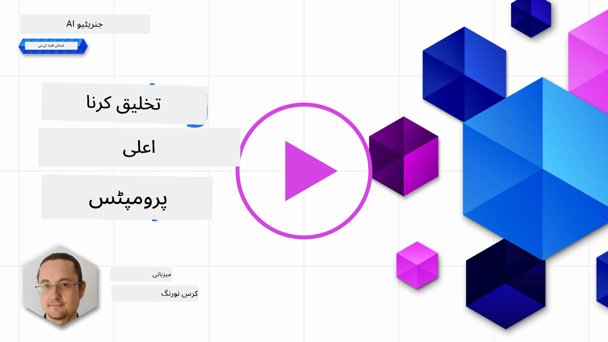

# ایڈوانس پرامپٹس بنانا

[](https://youtu.be/BAjzkaCdRok?si=NmUIyRf7-cDgbjtt)

آئیے پچھلے باب سے کچھ سیکھنے کو دہرائیں:

> پرامپٹ _انجینئرنگ_ وہ عمل ہے جس کے ذریعے ہم **ماڈل کو زیادہ متعلقہ جوابات کی جانب رہنمائی کرتے ہیں** مفید ہدایات یا سیاق و سباق فراہم کر کے۔

پرامپٹس لکھنے کے دو مراحل بھی ہیں: پرامپٹ کی تشکیل، متعلقہ سیاق و سباق فراہم کر کے، اور _بہتری_، کہ پرامپٹ کو بتدریج کیسے بہتر بنایا جائے۔

اس مرحلے پر، ہمارے پاس پرامپٹ لکھنے کی کچھ بنیادی سمجھ ہے، لیکن ہمیں گہرائی میں جانا ہے۔ اس باب میں، آپ مختلف پرامپٹس آزمانے سے اس بات کو سمجھنے تک جائیں گے کہ ایک پرامپٹ دوسرے پرامپٹ سے کیوں بہتر ہے۔ آپ سیکھیں گے کہ پرامپٹس کو کیسے بنایا جائے چند بنیادی تکنیکوں کی پیروی کرتے ہوئے جو کسی بھی LLM پر لاگو کی جا سکتی ہیں۔

## تعارف

اس باب میں، ہم درج ذیل موضوعات کا احاطہ کریں گے:

- مختلف تکنیکیں اپناتے ہوئے پرامپٹ انجینئرنگ کا اپنا علم بڑھائیں۔
- اپنے پرامپٹس کو ترتیب دیں تاکہ آؤٹ پٹ میں تبدیلی آئے۔

## سیکھنے کے مقاصد

یہ سبق مکمل کرنے کے بعد، آپ کر سکیں گے:

- پرامپٹ انجینئرنگ کی تکنیکیں اپنانا جو آپ کے پرامپٹس کے نتائج کو بہتر بنائیں۔
- ایسی پرامپٹنگ انجام دینا جو یا تو مختلف ہوتی ہے یا متعین ہوتی ہے۔

## پرامپٹ انجینئرنگ

پرامپٹ انجینئرنگ وہ عمل ہے جس میں پرامپٹس تخلیق کیے جاتے ہیں تاکہ مطلوبہ نتیجہ حاصل کیا جا سکے۔ پرامپٹ انجینئرنگ صرف ایک ٹیکسٹ پرامپٹ لکھنے سے زیادہ ہے۔ یہ انجینئرنگ کی کوئی ڈسپلن نہیں، بلکہ تکنیکوں کا ایک مجموعہ ہے جنہیں آپ مطلوبہ نتیجہ حاصل کرنے کے لیے لاگو کر سکتے ہیں۔

### پرامپٹ کی مثال

آئیے ایک بنیادی پرامپٹ لیتے ہیں:

> جغرافیہ پر 10 سوالات تیار کریں۔

اس پرامپٹ میں، آپ حقیقت میں مختلف پرامپٹ تکنیکیں استعمال کر رہے ہیں۔

آئیے اسے ٹوٹتے ہیں۔

- **سیاق و سباق**، آپ بتاتے ہیں کہ یہ "جغرافیہ" کے بارے میں ہونا چاہیے۔
- **آؤٹ پٹ کی حد بندی**، آپ چاہتے ہیں کہ 10 سوالات سے زیادہ نہ ہوں۔

### سادہ پرامپٹنگ کی محدودیتیں

آپ مطلوبہ نتیجہ حاصل کر سکتے ہیں یا نہیں۔ سوالات تو بنیں گے، لیکن جغرافیہ ایک وسیع موضوع ہے اور آپ کو شاید وہ نہ ملے جو آپ چاہتے ہیں درج ذیل وجوہات کی بنا پر:

- **بڑا موضوع**، آپ نہیں جانتے کہ یہ ممالک، دارالحکومت، دریا وغیرہ پر ہوگا۔
- **فارمیٹ**، اگر آپ چاہتے تھے کہ سوالات کسی خاص انداز میں ہوں؟

جیسے آپ دیکھ سکتے ہیں، پرامپٹ بنانے میں بہت کچھ غور کرنے کی ضرورت ہے۔

اب تک، ہم نے ایک سادہ پرامپٹ کی مثال دیکھی ہے، لیکن جنریٹو AI بہت کچھ کر سکتا ہے لوگوں کی مختلف شعبوں اور صنعتوں میں مدد کے لیے۔ آئیے چند بنیادی تکنیکوں کا جائزہ لیتے ہیں۔

### پرامپٹنگ کی تکنیکیں

سب سے پہلے، ہمیں سمجھنا ہوگا کہ پرامپٹنگ ایک _ابھرتا ہوا_ خاصہ ہے جو LLM کا حصہ نہیں بلکہ ماڈل استعمال کرتے ہوئے ہمارا انکشاف ہوتا ہے۔

کچھ بنیادی تکنیکیں ہیں جنہیں ہم LLM کو پرامپٹ کرنے کے لیے استعمال کر سکتے ہیں۔ آئیے ان کو دیکھتے ہیں۔

- **زیرو شاٹ پرامپٹنگ**، یہ سب سے بنیادی قسم ہے۔ یہ صرف ایک پرامپٹ ہوتا ہے جو LLM سے اس کی ٹریننگ ڈیٹا کی بنیاد پر جواب مانگتا ہے۔
- **فیوشاٹ پرامپٹنگ**، اس قسم میں LLM کو ایک یا زیادہ مثالیں فراہم کی جاتی ہیں جن کی بنیاد پر یہ جواب تیار کرتا ہے۔
- **چین آف تھوٹ**، اس تکنیک میں LLM کو بتایا جاتا ہے کہ مسئلہ کو مرحلہ وار کس طرح تقسیم کرے۔
- **تخلیق شدہ علم**، پرامپٹ کے جواب کو بہتر بنانے کے لیے آپ اپنی پرامپٹ کے ساتھ اضافی حقائق یا معلومات فراہم کر سکتے ہیں۔
- **لیسٹ ٹو موسٹ**، چین آف تھوٹ کی طرح، یہ تکنیک مسئلہ کو متعدد مراحل میں تقسیم کرنے اور پھر انہیں ترتیب وار حل کرنے پر مبنی ہے۔
- **سیلف ریفائن**، یہ تکنیک LLM کے جواب پر تنقید کرنے اور پھر اسے بہتر بنانے کا کہتی ہے۔
- **میاؤٹک پرامپٹنگ**۔ اس میں آپ چاہتے ہیں کہ LLM کا جواب درست ہو اور آپ اسے جواب کے مختلف حصے سمجھانے کو کہتے ہیں۔ یہ ایک قسم کی سیلف ریفائن ہے۔

### زیرو شاٹ پرامپٹنگ

یہ پرامپٹنگ بہت آسان ہے، یہ ایک واحد پرامپٹ پر مشتمل ہوتی ہے۔ غالباً آپ یہی استعمال کر رہے ہیں جب آپ LLMs کے بارے میں سیکھنا شروع کرتے ہیں۔ مثال:

- پرامپٹ: "الجبرا کیا ہے؟"
- جواب: "الجبرا ریاضیات کی وہ شاخ ہے جو ریاضیاتی علامات اور ان علامات کو manipulate کرنے کے قواعد کا مطالعہ کرتی ہے۔"

### فیوشاٹ پرامپٹنگ

یہ پرامپٹنگ ماڈل کی مدد کے لیے کچھ مثالیں فراہم کرتی ہے۔ یہ ایک پرامپٹ ہوتی ہے جس کے ساتھ ٹاسک سے مخصوص اضافی ڈیٹا ہوتا ہے۔ مثال:

- پرامپٹ: "شیکسپیئر کے انداز میں ایک نظم لکھیں۔ یہاں شیکسپیئر کے چند سونٹس کی مثالیں ہیں:
  سونٹ 18: 'کیا میں تمہیں گرمی کے دن سے ملا سکتا ہوں؟ تم زیادہ خوبصورت اور معتدل ہو...'
  سونٹ 116: 'میں سچائی کی شادی میں رکاوٹیں نہیں ڈالتا۔ محبت وہ نہیں جو بدل جائے جب تبدیلی آئے...'
  سونٹ 132: 'تمہاری آنکھیں مجھے پسند ہیں، اور وہ، میری ہمدردی کرتے ہوئے، تمہارے دل کے عتاب سے مجھے تکلیف دیتے ہیں...'
  اب، چاند کی خوبصورتی پر ایک سونٹ لکھیں۔"
- جواب: "آسمان پر، چاند نرم چمکتا ہے، سنہری روشنی میں جو اپنی نرمی بکھیرتی ہے،..."

مثالیں LLM کو مطلوبہ آؤٹ پٹ کا سیاق، فارمیٹ یا انداز فراہم کرتی ہیں۔ یہ ماڈل کو مخصوص کام کو سمجھنے اور زیادہ درست اور متعلقہ جواب دینے میں مدد دیتی ہیں۔

### چین آف تھوٹ

چین آف تھوٹ ایک بہت دلچسپ تکنیک ہے کیونکہ یہ LLM کو کئی مراحل سے گزارنے کی حکمت عملی ہے۔ مقصد ہے کہ LLM کو اس طرح ہدایت دی جائے کہ وہ کچھ کرنے کا طریقہ سمجھے۔ ذیل کی مثال ملاحظہ کریں، چین آف تھوٹ کے بغیر اور ساتھ:

    - پرامپٹ: "علیس کے پاس 5 سیب ہیں، وہ 3 سیب پھینکتی ہے، 2 باب کو دیتی ہے اور باب ایک واپس دیتا ہے، علیس کے پاس کتنے سیب بچے؟"
    - جواب: 5

LLM نے جواب 5 دیا جو غلط ہے۔ درست جواب 1 سیب ہے، حساب یہ ہے (5 - 3 - 2 + 1 = 1)۔

تو ہم LLM کو صحیح طریقے سے کیسے سکھائیں؟

چین آف تھوٹ آزمائیں۔ چین آف تھوٹ کا اطلاق اس طرح ہوتا ہے:

1. LLM کو ایک ملتی جلتی مثال دیں۔
1. حساب دکھائیں اور یہ کہ اسے کیسے صحیح طرح سے کرنا ہے۔
1. اصل پرامپٹ دیں۔

یہ اس طرح ہوتا ہے:

- پرامپٹ: "لِزا کے پاس 7 سیب ہیں، وہ 1 سیب پھینکتی ہے، 4 سیب بارٹ کو دیتی ہے اور بارٹ ایک واپس دیتا ہے:
  7 - 1 = 6
  6 - 4 = 2
  2 + 1 = 3  
  علیس کے پاس 5 سیب ہیں، وہ 3 پھینکتی ہے، 2 باب کو دیتی ہے اور باب ایک واپس دیتا ہے، علیس کے پاس کتنے سیب ہیں؟"
  جواب: 1

دھیان دیں کہ ہم بہت طویل پرامپٹ لکھتے ہیں جس میں ایک اضافی مثال، حساب اور پھر اصل پرامپٹ شامل ہوتا ہے اور ہم صحیح جواب 1 پر پہنچتے ہیں۔

جیسا کہ آپ دیکھ سکتے ہیں، چین آف تھوٹ ایک بہت طاقتور تکنیک ہے۔

### تخلیق شدہ علم

اکثر جب آپ پرامپٹ بنانا چاہتے ہیں، تو آپ چاہتے ہیں کہ یہ آپ کی کمپنی کے ڈیٹا پر مبنی ہو۔ آپ چاہتے ہیں کہ پرامپٹ کا ایک حصہ کمپنی سے ہو اور دوسرا حصہ وہ حقیقی پرامپٹ ہو جس میں آپ دلچسپی رکھتے ہیں۔

مثال کے طور پر، اگر آپ انشورنس کاروبار میں ہیں تو آپ کا پرامپٹ اس طرح ہو سکتا ہے:

```text
{{company}}: {{company_name}}
{{products}}:
{{products_list}}
Please suggest an insurance given the following budget and requirements:
Budget: {{budget}}
Requirements: {{requirements}}
```

اوپر، آپ دیکھ سکتے ہیں کہ پرامپٹ ایک ٹیمپلیٹ سے بنایا گیا ہے۔ ٹیمپلیٹ میں متعدد متغیرات ہوتے ہیں، جو `{{variable}}` کے ذریعے ظاہر کیے گئے ہیں، جنہیں کمپنی کے API سے اصل قدروں سے تبدیل کیا جائے گا۔

یہاں ایک مثال ہے کہ پرامپٹ کیسا نظر آئے جب متغیرات آپ کی کمپنی کے مواد سے تبدیل ہو جائیں:

```text
Insurance company: ACME Insurance
Insurance products (cost per month):
- Car, cheap, 500 USD
- Car, expensive, 1100 USD
- Home, cheap, 600 USD
- Home, expensive, 1200 USD
- Life, cheap, 100 USD

Please suggest an insurance given the following budget and requirements:
Budget: $1000
Requirements: Car, Home, and Life insurance
```

اس پرامپٹ کو LLM میں چلانے سے درج ذیل جواب آ سکتا ہے:

```output
Given the budget and requirements, we suggest the following insurance package from ACME Insurance:
- Car, cheap, 500 USD
- Home, cheap, 600 USD
- Life, cheap, 100 USD
Total cost: $1,200 USD
```

جیسا کہ آپ دیکھ سکتے ہیں، یہ صارف کو لائف انشورنس کا مشورہ بھی دیتا ہے جو کہ صحیح نہیں ہونا چاہیے۔ یہ نتیجہ اس بات کی نشاندہی کرتا ہے کہ ہمیں پرامپٹ کو بہتر بنانے کی ضرورت ہے تاکہ یہ واضح ہو کہ کیا اجازت ہے۔ کچھ _آزما کر دیکھنے_ کے بعد، ہم مندرجہ ذیل پرامپٹ تک پہنچے:

```text
Insurance company: ACME Insurance
Insurance products (cost per month):
- type: Car, cheap, cost: 500 USD
- type: Car, expensive, cost: 1100 USD
- type: Home, cheap, cost: 600 USD
- type: Home, expensive, cost: 1200 USD
- type: Life, cheap, cost: 100 USD

Please suggest an insurance given the following budget and requirements:
Budget: $1000 restrict choice to types: Car, Home
```

دیکھیں کہ _type_ اور _cost_ کا اضافہ اور کلمہ _restrict_ استعمال کرنے سے LLM کو واضح سمجھ آتی ہے کہ ہم کیا چاہتے ہیں۔

اب ہمیں درج ذیل جواب ملتا ہے:

```output
Given the budget and requirements, we suggest the Car, Cheap insurance product which costs 500 USD per month.
```

اس مثال کا مقصد یہ دکھانا تھا کہ اگرچہ ہم بنیادی تکنیک جیسے _تخلیقی علم_ استعمال کر رہے ہیں، لیکن زیادہ تر صورتوں میں ہمیں مطلوبہ نتیجہ حاصل کرنے کے لیے پرامپٹ کو بہتر بنانے کی ضرورت ہوتی ہے۔

### لِسٹ ٹو موسٹ

لیسٹ ٹو موسٹ پرامپٹنگ کا مقصد ایک بڑے مسئلے کو ذیلی مسائل میں توڑنا ہے۔ اس طرح، آپ LLM کو یہ رہنمائی دیتے ہیں کہ وہ بڑے مسئلے کو کیسے "فتح" کرے۔ ایک اچھا مثال ڈیٹا سائنس کے لیے ہو سکتی ہے جہاں آپ LLM سے کہتے ہیں کہ مسئلہ کو پانچ مراحل میں تقسیم کرے:

> پرامپٹ: ڈیٹا سائنس 5 مراحل میں کیسے کریں؟

آپ کا AI معاون جواب دے گا:

1. ڈیٹا جمع کریں
1. ڈیٹا صاف کریں
1. ڈیٹا کا تجزیہ کریں
1. ڈیٹا کا گراف بنائیں
1. ڈیٹا پیش کریں

### سیلف ریفائن، نتائج پر تنقید کریں

جنریٹو AIs اور LLMs کے ساتھ، آپ آؤٹ پٹ پر اعتماد نہیں کر سکتے۔ آپ کو اس کی تصدیق کرنی ہوتی ہے۔ آخرکار، LLM صرف یہ بتا رہا ہوتا ہے کہ اگلا سب سے ممکنہ جملہ کیا ہوگا، صحیح کیا ہے نہیں۔ لہذا، اچھی بات ہے کہ LLM سے خود تنقید کرنے کو کہیں، جسے ہم سیلف ریفائن تکنیک کہتے ہیں۔

یہ اس طرح کام کرتا ہے:

1. ابتدائی پرامپٹ جو LLM سے مسئلہ حل کرنے کو کہتا ہے
1. LLM جواب دیتا ہے
1. آپ جواب پر تنقید کرتے ہیں اور AI سے بہتر بنانے کو کہتے ہیں
1. LLM دوبارہ جواب دیتا ہے، اب تنقید کو مدنظر رکھتے ہوئے اور حل تجویز کرتا ہے

آپ اس عمل کو جتنا چاہیں دہرایا جا سکتا ہے۔

یہاں اس تکنیک کی ایک مثال ہے:

> پرامپٹ: "Python Web API بنائیں جس میں روٹس products اور customers ہوں"

AI جواب:

```python
import flask
app = Flask(__name__)

@app.route('/products')
def products():
    return 'Products'

@app.route('/customers')
def customers():
    return 'Customers'
```

> پرامپٹ: اوپر دیے گئے کوڈ کی 3 بہتریاں تجویز کریں

AI جواب:

```text
Sure, here are three suggestions to improve the code:

Import the correct module: The first line should import Flask instead of flask. The correct import statement should be from flask import Flask.

Add a main function: Add a if __name__ == '__main__': block to the end of the file to run the application when the file is executed.

Use f-strings: Use f-strings to format the return statements in the route functions. For example, return 'Products' can be changed to return f'This is the {request.path} page'.
```

```python
from flask import Flask, request

app = Flask(__name__)

@app.route('/products')
def products():
    return f'This is the {request.path} page'

@app.route('/customers')
def customers():
    return f'This is the {request.path} page'

if __name__ == '__main__':
    app.run()
```

جیسے آپ دیکھ سکتے ہیں، اوپر دیے گئے AI جواب میں پہلی تجویز کردہ کوڈ میں بہتری آ گئی ہے، کیونکہ اس نے پہلے جواب پر تنقید کی ہے۔

### میاؤٹک پرامپٹنگ

میاؤٹک پرامپٹنگ ایک تکنیک ہے جو سیلف ریفائن سے ملتی جلتی ہے لیکن اس میں LLM سے بنیادی بات یہ پوچھنا ہوتا ہے کہ وہ خود کو وضاحت کرے۔ اس کا مقصد LLM کی آؤٹ پٹ میں تضادات کو کم کرنا ہے تاکہ یہ یقینی بنایا جا سکے کہ جواب درست پہنچے۔ کام کا طریقہ یہ ہے:

1. LLM سے سوال کا جواب مانگیں
1. جواب کے ہر حصے کے لیے، LLM سے اسے مزید تفصیل سے وضاحت کرنے کو کہیں۔
1. اگر کوئی تضاد ہو، تو ان حصوں کو خارج کر دیں جو متضاد ہوں۔

دہرائیں 2 اور 3 جب تک آپ تمام حصوں سے گزر نہ جائیں اور جواب سے مطمئن نہ ہوں۔

یہاں ایک مثال پرامپٹ ہے:

> پرامپٹ: وبائی مرض میں کمی کے لیے بحران کا منصوبہ 5 مراحل میں کیسے بنایا جا سکتا ہے؟
> LLM جواب:

```text
1. Identify the risks
1. Identify the stakeholders
1. Identify the resources
1. Identify the actions
1. Identify the communication channels
```

یہ پانچ مراحل شناخت کرتا ہے، لیکن کیا ہم اس کی درستگی معلوم کر سکتے ہیں؟ آئیے LLM سے ہر مرحلہ کو مزید وضاحت کرنے کو کہیں:

> پرامپٹ: پہلے مرحلے کو مزید تفصیل سے سمجھائیں، وبائی مرض میں خطرات کیا ہیں؟

```text
The risks are the following:

- Loss of life
- Loss of business
- Loss of reputation
- Loss of customers
- Loss of employees
```

اس مرحلے پر، ہم چاہتے ہیں کہ LLM درست ہو، لہٰذا ہم اسے پہلے خطرے کی مزید تفصیل سے وضاحت کرنے کو کہتے ہیں اور امید کرتے ہیں کہ یہ اوپر والے جواب سے مطابقت رکھتا ہو:

> پرامپٹ: وبائی مرض میں سب سے بڑا خطرہ کیا ہے اور کیوں؟

```text
The biggest risk is loss of life because it's the most important thing to protect.
```

> وبائی مرض میں دو سب سے بڑے خطرات کیا ہیں؟

```text
The two biggest risks are loss of life and loss of business.
```

اس مرحلے پر، LLM مطابقت رکھتا ہے اور "زندگی" اور "کاروبار" کو دو بڑے خطرات کے طور پر بیان کرتا ہے۔ اب ہم اگلے مرحلے پر جا سکتے ہیں اور کافی حد تک مطمئن ہو سکتے ہیں۔ لیکن ہمیں LLM پر اندھا اعتبار نہیں کرنا چاہیے، آؤٹ پٹ کی تصدیق ہمیشہ کرنی چاہیے۔

## اپنے آؤٹ پٹ میں تنوع پیدا کریں

LLMs بذات خود غیر متعین ہوتے ہیں، یعنی جب بھی آپ وہی پرامپٹ چلائیں گے تو مختلف نتائج ملیں گے۔ مثال کے طور پر، یہ پرامپٹ آزمائیں:

> "Python Web API کے لیے کوڈ تیار کریں"

```python
# ضروری ماڈیول درآمد کریں
import flask
from flask import request, jsonify

# ایک فلاسک ایپ بنائیں
app = flask.Flask(__name__)

# API کے لئے ایک راستہ بنائیں
@app.route('/api', methods=['GET'])
def api():
    # درخواست سے ڈیٹا حاصل کریں
    data = request.args

    # ڈیٹا کو پروسس کریں
    result = process_data(data)

    # نتیجہ JSON کی صورت میں واپس کریں
    return jsonify(result)

# ڈیٹا کو پروسس کرنے کے لئے فنکشن
def process_data(data):
    # ڈیٹا کے ساتھ کچھ کریں
    result = data + 1

    # نتیجہ واپس کریں
    return result

# ایپ کو چلائیں
if __name__ == '__main__':
    app.run()

```

دوسری بار اسی پرامپٹ کو چلانے سے تھوڑا مختلف جواب آتا ہے:

```python
#ضروری پیکج امپورٹ کریں
import flask
from flask import request, jsonify

#فلاسک ایپلیکیشن بنائیں
app = flask.Flask(__name__)
app.config["DEBUG"] = True

#کتابوں کی فہرست بنائیں
books = [
    {'id': 0,
     'title': 'A Fire Upon the Deep',
     'author': 'Vernor Vinge',
     'first_sentence': 'The coldsleep itself was dreamless.',
     'year_published': '1992'},
    {'id': 1,
     'title': 'The Ones Who Walk Away From Omelas',
     'author': 'Ursula K. Le Guin',
     'first_sentence': 'With a clamor of bells that set the swallows soaring, the Festival of Summer came to the city Omelas, bright-towered by the sea.',
     'published': '1973'},
    {'id': 2,
     'title': 'Dhalgren',
     'author': 'Samuel R. Delany',
     'first_sentence': 'to wound the autumnal city.',
     'published': '1975'}
]

#API کے لئے ایک اینڈپوائنٹ بنائیں
@app.route('/', methods=['GET'])
def home():
    return '''<h1>Books API</h1>
<p>A prototype API for retrieving books.</p>'''

#تمام کتابیں واپس کرنے کے لئے ایک اینڈپوائنٹ بنائیں
@app.route('/api/v1/resources/books/all', methods=['GET'])
def api_all():
    return jsonify(books)

#ایک واحد کتاب واپس کرنے کے لئے اینڈپوائنٹ بنائیں
@app.route('/api/v1/resources/books', methods=['GET'])
def api_id():
    #چیک کریں کہ آیا URL کے حصے کے طور پر کوئی ID فراہم کی گئی ہے
    #اگر ID فراہم کی گئی ہو تو اسے ایک متغیر میں تفویض کریں
    #اگر کوئی ID فراہم نہیں کی گئی تو ایک غلطی ظاہر کریں
    if 'id' in request.args:
        id = int(request.args['id'])
    else:
        return "Error: No id field provided. Please specify an id."

    #ہمارے نتائج کے لیے ایک خالی فہرست بنائیں
    results = []

    #ڈیٹا کے ذریعے لوپ کریں اور نتائج کو میچ کریں جو درخواست کردہ ID سے میل کھاتے ہیں
    #ID منفرد ہوتی ہے، لیکن دیگر فیلڈز کئی نتائج واپس کر سکتی ہیں
    for book in books:
        if book['id'] == id:
            results.append(book)

    #ہماری فہرست کو تبدیل کرنے کے لیے Flask کے jsonify فنکشن کا استعمال کریں
    #Python ڈکشنریوں کو JSON فارمیٹ میں تبدیل کریں
    return jsonify(results)

app.run()
```

> تو کیا متنوع آؤٹ پٹ مسئلہ ہے؟

یہ آپ کی کوشش پر منحصر ہے۔ اگر آپ مخصوص جواب چاہتے ہیں تو یہ مسئلہ ہے۔ اگر آپ مختلف آؤٹ پٹ جیسے "جغرافیہ پر کوئی بھی 3 سوال بنائیں" سے خوش ہیں، تو یہ مسئلہ نہیں۔

### آؤٹ پٹ کی تبدیلی کے لیے temperature کا استعمال

ٹھیک ہے، ہم نے فیصلہ کیا ہے کہ آؤٹ پٹ کو زیادہ پیش گوئی کے قابل اور متعین بنانا چاہتے ہیں۔ ہم یہ کیسے کریں؟

temperature ایک قدر ہے 0 سے 1 کے درمیان، جہاں 0 سب سے زیادہ متعین اور 1 سب سے زیادہ متنوع ہے۔ ڈیفالٹ قدر 0.7 ہے۔ آئیے دیکھیں کیا ہوتا ہے جب ہم temperature 0.1 پر سیٹ کر کے ایک ہی پرامپٹ کو دو بار چلائیں:

> "Python Web API کے لیے کوڈ تیار کریں"

```python
#ضروری لائبریریاں درآمد کریں
import flask
from flask import request, jsonify

#Flask کلاس کی ایک مثال بنائیں
app = flask.Flask(__name__)

#API کے لیے ایک اینڈ پوائنٹ بنائیں
@app.route('/api/v1/endpoint', methods=['GET'])
def api_endpoint():
    #درخواست کا ڈیٹا حاصل کریں
    data = request.get_json()

    #ڈیٹا کو پروسیس کریں
    result = process_data(data)

    #نتیجہ واپس کریں
    return jsonify(result)

#ڈیٹا کو پروسیس کرنے کے لیے فنکشن
def process_data(data):
    #ڈیٹا کو پروسیس کریں
    result = {'result': 'success'}

    #نتیجہ واپس کریں
    return result

#Flask ایپ کو چلائیں
if __name__ == '__main__':
    app.run()

```

دوبارہ چلانے پر نتیجہ کچھ یوں آیا:

```python
#ضروری لائبریریاں درآمد کریں
import flask
from flask import request, jsonify

#ایک فلاسک ایپ بنائیں
app = flask.Flask(__name__)

#API کے لیے ایک روٹ بنائیں
@app.route('/api', methods=['GET'])
def api_call():
    #درخواست سے ڈیٹا حاصل کریں
    data = request.get_json()

    #ڈیٹا پر کارروائی کریں
    result = process_data(data)

    #نتیجہ واپس کریں
    return jsonify(result)

#process_data فنکشن کی تعریف کریں
def process_data(data):
    #ڈیٹا کے ساتھ کچھ کریں
    result = data + 1

    #نتیجہ واپس کریں
    return result

#ایپ چلائیں
if __name__ == '__main__':
    app.run()

```

ان دونوں نتائج میں صرف بہت معمولی فرق ہے۔ اب الٹ کرتے ہیں، اس بار temperature کو 0.9 پر سیٹ کرتے ہیں:

```python
# ضروری لائبریریاں درآمد کریں
import flask
from flask import request, jsonify

# ایک فلاسک ایپ بنائیں
app = flask.Flask(__name__)

# API کے لیے روٹ بنائیں
@app.route('/api', methods=['GET'])
def api_call():
    # درخواست سے ڈیٹا حاصل کریں
    data = request.args

    # ڈیٹا پروسیس کریں
    result = process_data(data)

    # نتیجہ واپس کریں
    return jsonify(result)

# ڈیٹا پروسیس کرنے کا فنکشن
def process_data(data):
    # ڈیٹا کے ساتھ کچھ کریں
    result = data + 1

    # نتیجہ واپس کریں
    return result

# ایپ چلائیں
if __name__ == '__main__':
    app.run()

```

اور دوسری کوشش 0.9 temperature کے ساتھ:

```python
import flask
from flask import request, jsonify

# فلاسک ایپ بنائیں
app = flask.Flask(__name__)
app.config['DEBUG'] = True

# کچھ ٹیسٹ ڈیٹا بنائیں
books = [
    {'id': 0, 'title': 'A Fire Upon The Deep', 'author': 'Vernor Vinge', 'first_sentence': 'The coldsleep itself was dreamless.', 'year_published': '1992'},
    {'id': 1, 'title': 'The Ones Who Walk Away From Omelas', 'author': 'Ursula K. Le Guin', 'first_sentence': 'With a clamor of bells that set the swallows soaring, the Festival of Summer came to the city Omelas, bright-towered by the sea.', 'published': '1973'},
    {'id': 2, 'title': 'Dhalgren', 'author': 'Samuel R. Delany', 'first_sentence': 'to wound the autumnal city.', 'published': '1975'}
]

# ایک اینڈپوائنٹ بنائیں
@app.route('/', methods=['GET'])
def home():
    return '''<h1>Welcome to our book API!</h1>'''

@app.route('/api/v1/resources/books

```

جیسا کہ آپ دیکھ سکتے ہیں، نتائج بہت زیادہ مختلف ہیں۔
> نوٹ کریں کہ آپ مزید پیرامیٹرز تبدیل کر سکتے ہیں تاکہ آؤٹ پٹ میں فرق لایا جا سکے، جیسے کہ top-k، top-p، repetition penalty، length penalty اور diversity penalty لیکن یہ ہمارے نصاب کے دائرہ کار سے باہر ہیں۔

## اچھے طریقے

کئی طریقے ہیں جنہیں آپ اپنی مطلوبہ چیز حاصل کرنے کے لیے استعمال کر سکتے ہیں۔ جتنا زیادہ آپ پرامپٹنگ کریں گے، آپ اپنی اپنی طرز دریافت کریں گے۔

ہم نے جو تکنیکیں سکھائیں ہیں، اس کے علاوہ LLM کو پرامپٹ کرتے وقت کچھ اچھے طریقے بھی زیرِ غور لانے چاہئیں۔

یہاں کچھ اچھے طریقے دیئے گئے ہیں جو زیرِ غور لانا چاہئیں:

- **سیاق و سباق واضح کریں۔** سیاق و سباق اہم ہے، جتنا زیادہ آپ بیان کریں گے جیسے کہ ڈومین، موضوع وغیرہ اتنا بہتر۔
- آؤٹ پٹ محدود کریں۔ اگر آپ کسی خاص تعداد میں اشیاء یا کسی خاص لمبائی کے نتائج چاہتے ہیں تو اسے واضح کریں۔
- **کیا اور کیسے دونوں واضح کریں۔** یاد رکھیں کہ آپ جو چاہیں اور کیسے چاہیں، دونوں کا ذکر کریں، مثلاً "Python Web API بنائیں جس میں routes products اور customers ہوں، اسے 3 فائلوں میں تقسیم کریں"۔
- **ٹیمپلیٹس استعمال کریں۔** اکثر، آپ اپنی کمپنی کے ڈیٹا سے پرامپٹس کو مالا مال کرنا چاہیں گے۔ ایسا کرنے کے لیے ٹیمپلیٹس استعمال کریں۔ ٹیمپلیٹس میں متغیرات ہوتے ہیں جنہیں آپ اصل ڈیٹا سے بدلتے ہیں۔
- **صحیح ہجے لکھیں۔** LLM آپ کو درست جواب دے سکتے ہیں، لیکن اگر آپ صحیح املا استعمال کریں گے تو بہتر جواب آپ کو ملے گا۔

## اسائنمنٹ

یہاں Python میں کوڈ دیا گیا ہے جو Flask استعمال کرتے ہوئے ایک سادہ API بنانے کا طریقہ دکھاتا ہے:

```python
from flask import Flask, request

app = Flask(__name__)

@app.route('/')
def hello():
    name = request.args.get('name', 'World')
    return f'Hello, {name}!'

if __name__ == '__main__':
    app.run()
```
  
GitHub Copilot یا ChatGPT جیسا AI اسسٹنٹ استعمال کریں اور "self-refine" تکنیک لاگو کرکے کوڈ کو بہتر بنائیں۔

## حل

براہِ کرم مناسب پرامپٹس شامل کر کے اسائنمنٹ حل کرنے کی کوشش کریں۔

> [!TIP]  
> بہتری کے لیے پرامپٹ اس طرح بنائیں کہ بہتری کی تعداد محدود ہو۔ آپ یہ بھی کہہ سکتے ہیں کہ اسے کسی خاص طریقے سے بہتر بنائیں، مثلاً معمارانہ پہلو، کارکردگی، سیکورٹی وغیرہ۔

[حل](../../../05-advanced-prompts/python/aoai-solution.py)

## علم کی جانچ

میں chain-of-thought پرامپٹنگ کیوں استعمال کروں؟ ایک درست جواب اور دو غلط جوابات دکھائیں۔

1. مسئلہ حل کرنے کا طریقہ LLM کو سکھانے کے لیے۔  
1. ب: LLM کو کوڈ میں غلطیاں تلاش کرنا سکھانے کے لیے۔  
1. ج: LLM کو مختلف حل نکالنے کی ہدایت دینے کے لیے۔

جواب: 1، کیونکہ chain-of-thought LLM کو مسئلہ حل کرنے کا طریقہ دکھانے کے لیے ہے، جس میں مرحلہ وار اقدامات اور ملتے جلتے مسائل اور ان کے حل شامل ہوتے ہیں۔

## 🚀 چیلنج

آپ نے اسائنمنٹ میں self-refine تکنیک استعمال کی ہے۔ جو کوئی بھی پروگرام آپ نے بنایا ہے اسے لے کر سوچیں کہ آپ کونسی بہتریاں اس پر لاگو کرنا چاہیں گے۔ اب self-refine تکنیک کا استعمال کرتے ہوئے تجویز کردہ تبدیلیاں کریں۔ آپ کے خیال میں نتیجہ بہتر ہوا یا خراب؟

## شاندار کام! اپنی تعلیم جاری رکھیں

اس سبق کو مکمل کرنے کے بعد، ہمارے [Generative AI Learning collection](https://aka.ms/genai-collection?WT.mc_id=academic-105485-koreyst) کو دیکھیں تاکہ آپ اپنی Generative AI کی معلومات کو مزید بڑھا سکیں!

سبق 6 کی طرف جائیں جہاں ہم Prompt Engineering کا استعمال کرتے ہوئے [text generation apps بنائیں گے](../06-text-generation-apps/README.md?WT.mc_id=academic-105485-koreyst)۔

---

<!-- CO-OP TRANSLATOR DISCLAIMER START -->
**ڈس کلیمر**:
یہ دستاویز AI ترجمہ سروس [Co-op Translator](https://github.com/Azure/co-op-translator) کے ذریعے ترجمہ کی گئی ہے۔ جبکہ ہم درستگی کے لیے کوشاں ہیں، براہ کرم اس بات سے آگاہ رہیں کہ خودکار ترجمے میں غلطیاں یا عدم درستیاں ہو سکتی ہیں۔ اصل دستاویز اپنے مادری زبان میں مستند ماخذ سمجھی جائے گی۔ حساس معلومات کے لیے پیشہ ور انسانی ترجمہ کی سفارش کی جاتی ہے۔ اس ترجمے کے استعمال سے پیدا ہونے والی کسی بھی غلط فہمی یا غلط تشریح کی ذمہ داری ہم قبول نہیں کرتے۔
<!-- CO-OP TRANSLATOR DISCLAIMER END -->