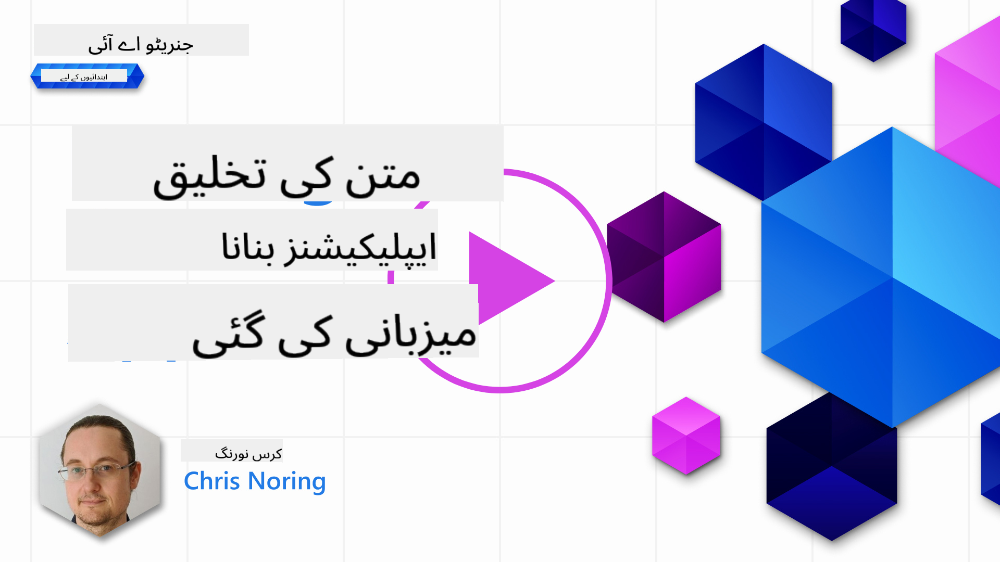

<!--
CO_OP_TRANSLATOR_METADATA:
{
  "original_hash": "df027997f1448323d6159b78a1b669bf",
  "translation_date": "2025-10-17T23:17:43+00:00",
  "source_file": "06-text-generation-apps/README.md",
  "language_code": "ur"
}
-->
# ٹیکسٹ جنریشن ایپلیکیشنز بنانا

[](https://youtu.be/0Y5Luf5sRQA?si=t_xVg0clnAI4oUFZ)

> _(اوپر دی گئی تصویر پر کلک کریں تاکہ اس سبق کی ویڈیو دیکھ سکیں)_

آپ نے اس نصاب کے ذریعے اب تک دیکھا ہے کہ کچھ بنیادی تصورات جیسے پرامپٹس اور ایک مکمل شعبہ جسے "پرامپٹ انجینئرنگ" کہا جاتا ہے، موجود ہیں۔ بہت سے ٹولز جن کے ساتھ آپ تعامل کر سکتے ہیں جیسے ChatGPT، Office 365، Microsoft Power Platform اور دیگر، آپ کو پرامپٹس استعمال کرنے کی حمایت کرتے ہیں تاکہ کچھ حاصل کیا جا سکے۔

اگر آپ اپنی ایپ میں ایسا تجربہ شامل کرنا چاہتے ہیں، تو آپ کو پرامپٹس، کمپلیشنز جیسے تصورات کو سمجھنا ہوگا اور کام کرنے کے لیے ایک لائبریری کا انتخاب کرنا ہوگا۔ یہی چیز آپ اس باب میں سیکھیں گے۔

## تعارف

اس باب میں، آپ:

- openai لائبریری اور اس کے بنیادی تصورات کے بارے میں سیکھیں گے۔
- openai کا استعمال کرتے ہوئے ایک ٹیکسٹ جنریشن ایپ بنائیں گے۔
- پرامپٹ، ٹیمپریچر، اور ٹوکنز جیسے تصورات کو استعمال کرنے کا طریقہ سمجھیں گے تاکہ ایک ٹیکسٹ جنریشن ایپ بنائی جا سکے۔

## سیکھنے کے اہداف

اس سبق کے اختتام پر، آپ قابل ہوں گے:

- وضاحت کریں کہ ٹیکسٹ جنریشن ایپ کیا ہے۔
- openai کا استعمال کرتے ہوئے ایک ٹیکسٹ جنریشن ایپ بنائیں۔
- اپنی ایپ کو زیادہ یا کم ٹوکنز استعمال کرنے کے لیے ترتیب دیں اور ٹیمپریچر کو بھی تبدیل کریں، مختلف نتائج کے لیے۔

## ٹیکسٹ جنریشن ایپ کیا ہے؟

عام طور پر جب آپ ایک ایپ بناتے ہیں تو اس میں کچھ قسم کا انٹرفیس ہوتا ہے جیسے کہ درج ذیل:

- کمانڈ پر مبنی۔ کنسول ایپس عام ایپس ہیں جہاں آپ ایک کمانڈ ٹائپ کرتے ہیں اور یہ ایک کام انجام دیتی ہے۔ مثال کے طور پر، `git` ایک کمانڈ پر مبنی ایپ ہے۔
- یوزر انٹرفیس (UI)۔ کچھ ایپس میں گرافیکل یوزر انٹرفیس (GUIs) ہوتے ہیں جہاں آپ بٹن پر کلک کرتے ہیں، ٹیکسٹ داخل کرتے ہیں، آپشنز منتخب کرتے ہیں اور مزید۔

### کنسول اور UI ایپس کی حدود

اسے ایک کمانڈ پر مبنی ایپ سے موازنہ کریں جہاں آپ ایک کمانڈ ٹائپ کرتے ہیں:

- **یہ محدود ہے**۔ آپ کوئی بھی کمانڈ ٹائپ نہیں کر سکتے، صرف وہی جو ایپ سپورٹ کرتی ہے۔
- **زبان مخصوص**۔ کچھ ایپس کئی زبانوں کو سپورٹ کرتی ہیں، لیکن ڈیفالٹ کے طور پر ایپ ایک مخصوص زبان کے لیے بنائی گئی ہے، چاہے آپ مزید زبانوں کی سپورٹ شامل کر سکیں۔

### ٹیکسٹ جنریشن ایپس کے فوائد

تو ٹیکسٹ جنریشن ایپ مختلف کیسے ہے؟

ایک ٹیکسٹ جنریشن ایپ میں آپ کے پاس زیادہ لچک ہوتی ہے، آپ کمانڈز کے ایک سیٹ یا کسی مخصوص ان پٹ زبان تک محدود نہیں ہوتے۔ اس کے بجائے، آپ قدرتی زبان کا استعمال کرتے ہوئے ایپ کے ساتھ تعامل کر سکتے ہیں۔ ایک اور فائدہ یہ ہے کہ آپ پہلے ہی ایک ڈیٹا سورس کے ساتھ تعامل کر رہے ہیں جو معلومات کے وسیع ذخیرے پر تربیت یافتہ ہے، جبکہ ایک روایتی ایپ صرف ڈیٹا بیس میں موجود معلومات تک محدود ہو سکتی ہے۔

### ٹیکسٹ جنریشن ایپ کے ساتھ کیا بنایا جا سکتا ہے؟

آپ بہت سی چیزیں بنا سکتے ہیں۔ مثال کے طور پر:

- **ایک چیٹ بوٹ**۔ ایک چیٹ بوٹ جو آپ کی کمپنی اور اس کی مصنوعات جیسے موضوعات کے بارے میں سوالات کے جوابات دیتا ہے، ایک اچھا انتخاب ہو سکتا ہے۔
- **مددگار**۔ LLMs متن کو خلاصہ کرنے، متن سے بصیرت حاصل کرنے، ریزیومے جیسے متن تیار کرنے اور مزید چیزوں میں بہت اچھے ہیں۔
- **کوڈ اسسٹنٹ**۔ اس زبان کے ماڈل پر منحصر ہے جسے آپ استعمال کرتے ہیں، آپ ایک کوڈ اسسٹنٹ بنا سکتے ہیں جو آپ کو کوڈ لکھنے میں مدد کرتا ہے۔ مثال کے طور پر، آپ GitHub Copilot جیسے پروڈکٹ کے ساتھ ساتھ ChatGPT کا استعمال کر سکتے ہیں تاکہ آپ کو کوڈ لکھنے میں مدد ملے۔

## میں کیسے شروع کر سکتا ہوں؟

ٹھیک ہے، آپ کو LLM کے ساتھ انٹیگریٹ کرنے کا طریقہ تلاش کرنے کی ضرورت ہے جو عام طور پر درج ذیل دو طریقوں پر مشتمل ہوتا ہے:

- API کا استعمال کریں۔ یہاں آپ اپنی پرامپٹ کے ساتھ ویب درخواستیں بنا رہے ہیں اور واپس جنریٹڈ ٹیکسٹ حاصل کر رہے ہیں۔
- لائبریری کا استعمال کریں۔ لائبریریاں API کالز کو انکیپسولیٹ کرنے میں مدد کرتی ہیں اور انہیں استعمال کرنا آسان بناتی ہیں۔

## لائبریریاں/SDKs

LLMs کے ساتھ کام کرنے کے لیے کچھ مشہور لائبریریاں ہیں جیسے:

- **openai**، یہ لائبریری آپ کے ماڈل سے جڑنا اور پرامپٹس بھیجنا آسان بناتی ہے۔

پھر کچھ لائبریریاں ہیں جو اعلیٰ سطح پر کام کرتی ہیں جیسے:

- **Langchain**۔ Langchain مشہور ہے اور Python کو سپورٹ کرتا ہے۔
- **Semantic Kernel**۔ Semantic Kernel مائیکروسافٹ کی ایک لائبریری ہے جو C#، Python، اور Java زبانوں کو سپورٹ کرتی ہے۔

## openai کا استعمال کرتے ہوئے پہلی ایپ

آئیے دیکھتے ہیں کہ ہم اپنی پہلی ایپ کیسے بنا سکتے ہیں، ہمیں کون سی لائبریریاں درکار ہیں، کتنا ضروری ہے اور اسی طرح۔

### openai انسٹال کریں

OpenAI یا Azure OpenAI کے ساتھ تعامل کے لیے بہت سی لائبریریاں موجود ہیں۔ متعدد پروگرامنگ زبانوں جیسے C#، Python، JavaScript، Java اور مزید کا استعمال کرنا ممکن ہے۔ ہم نے `openai` Python لائبریری کا انتخاب کیا ہے، اس لیے ہم اسے انسٹال کرنے کے لیے `pip` استعمال کریں گے۔

```bash
pip install openai
```

### ایک ریسورس بنائیں

آپ کو درج ذیل اقدامات کرنے کی ضرورت ہے:

- Azure پر ایک اکاؤنٹ بنائیں [https://azure.microsoft.com/free/](https://azure.microsoft.com/free/?WT.mc_id=academic-105485-koreyst)۔
- Azure OpenAI تک رسائی حاصل کریں۔ [https://learn.microsoft.com/azure/ai-services/openai/overview#how-do-i-get-access-to-azure-openai](https://learn.microsoft.com/azure/ai-services/openai/overview#how-do-i-get-access-to-azure-openai?WT.mc_id=academic-105485-koreyst) پر جائیں اور رسائی کی درخواست کریں۔

  > [!NOTE]
  > لکھنے کے وقت، آپ کو Azure OpenAI تک رسائی کے لیے درخواست دینے کی ضرورت ہے۔

- Python انسٹال کریں <https://www.python.org/>
- Azure OpenAI Service ریسورس بنایا ہو۔ اس گائیڈ کو دیکھیں کہ [ریسورس کیسے بنائیں](https://learn.microsoft.com/azure/ai-services/openai/how-to/create-resource?pivots=web-portal?WT.mc_id=academic-105485-koreyst)۔

### API کی اور اینڈپوائنٹ تلاش کریں

اس وقت، آپ کو اپنی `openai` لائبریری کو بتانا ہوگا کہ کون سی API کی استعمال کرنی ہے۔ اپنی API کی تلاش کرنے کے لیے، Azure OpenAI ریسورس کے "Keys and Endpoint" سیکشن میں جائیں اور "Key 1" ویلیو کو کاپی کریں۔


اب جب کہ آپ نے یہ معلومات کاپی کر لی ہیں، آئیے لائبریریوں کو اسے استعمال کرنے کی ہدایت دیں۔

> [!NOTE]
> اپنی API کی کوڈ سے الگ رکھنا بہتر ہے۔ آپ ایسا ماحول کے متغیرات کا استعمال کرتے ہوئے کر سکتے ہیں۔
>
> - ماحول کے متغیر `OPENAI_API_KEY` کو اپنی API کی پر سیٹ کریں۔
>   `export OPENAI_API_KEY='sk-...'`

### Azure کی ترتیب سیٹ اپ کریں

اگر آپ Azure OpenAI استعمال کر رہے ہیں، تو یہاں ہے کہ آپ ترتیب کیسے سیٹ اپ کریں:

```python
openai.api_type = 'azure'
openai.api_key = os.environ["OPENAI_API_KEY"]
openai.api_version = '2023-05-15'
openai.api_base = os.getenv("API_BASE")
```

اوپر ہم درج ذیل سیٹ کر رہے ہیں:

- `api_type` کو `azure` پر۔ یہ لائبریری کو بتاتا ہے کہ Azure OpenAI استعمال کریں اور OpenAI نہیں۔
- `api_key`، یہ آپ کی API کی ہے جو Azure پورٹل میں ملتی ہے۔
- `api_version`، یہ وہ ورژن ہے جو آپ استعمال کرنا چاہتے ہیں۔ لکھنے کے وقت، تازہ ترین ورژن `2023-05-15` ہے۔
- `api_base`، یہ API کا اینڈپوائنٹ ہے۔ آپ اسے Azure پورٹل میں اپنی API کی کے ساتھ دیکھ سکتے ہیں۔

> [!NOTE] > `os.getenv` ایک فنکشن ہے جو ماحول کے متغیرات کو پڑھتا ہے۔ آپ اسے `OPENAI_API_KEY` اور `API_BASE` جیسے ماحول کے متغیرات کو پڑھنے کے لیے استعمال کر سکتے ہیں۔ ان ماحول کے متغیرات کو اپنے ٹرمینل میں سیٹ کریں یا `dotenv` جیسی لائبریری کا استعمال کریں۔

## ٹیکسٹ جنریٹ کریں

ٹیکسٹ جنریٹ کرنے کا طریقہ `Completion` کلاس کا استعمال ہے۔ یہاں ایک مثال ہے:

```python
prompt = "Complete the following: Once upon a time there was a"

completion = openai.Completion.create(model="davinci-002", prompt=prompt)
print(completion.choices[0].text)
```

اوپر دیے گئے کوڈ میں، ہم ایک کمپلیشن آبجیکٹ بناتے ہیں اور ماڈل اور پرامپٹ کو پاس کرتے ہیں۔ پھر ہم جنریٹڈ ٹیکسٹ کو پرنٹ کرتے ہیں۔

### چیٹ کمپلیشنز

اب تک، آپ نے دیکھا کہ ہم نے ٹیکسٹ جنریٹ کرنے کے لیے `Completion` کا استعمال کیا ہے۔ لیکن ایک اور کلاس ہے جسے `ChatCompletion` کہا جاتا ہے جو چیٹ بوٹس کے لیے زیادہ موزوں ہے۔ یہاں اس کا استعمال کرنے کی ایک مثال ہے:

```python
import openai

openai.api_key = "sk-..."

completion = openai.ChatCompletion.create(model="gpt-3.5-turbo", messages=[{"role": "user", "content": "Hello world"}])
print(completion.choices[0].message.content)
```

اس فنکشنلٹی پر مزید ایک آنے والے باب میں۔

## مشق - اپنی پہلی ٹیکسٹ جنریشن ایپ بنائیں

اب جب کہ ہم نے سیکھا کہ openai کو کیسے سیٹ اپ اور ترتیب دیں، یہ وقت ہے کہ اپنی پہلی ٹیکسٹ جنریشن ایپ بنائیں۔ اپنی ایپ بنانے کے لیے، درج ذیل اقدامات کریں:

1. ایک ورچوئل ماحول بنائیں اور openai انسٹال کریں:

   ```bash
   python -m venv venv
   source venv/bin/activate
   pip install openai
   ```

   > [!NOTE]
   > اگر آپ Windows استعمال کر رہے ہیں تو `venv\Scripts\activate` ٹائپ کریں بجائے `source venv/bin/activate` کے۔

   > [!NOTE]
   > اپنی Azure OpenAI کی تلاش کریں [https://portal.azure.com/](https://portal.azure.com/?WT.mc_id=academic-105485-koreyst) پر جا کر `Open AI` تلاش کریں اور `Open AI resource` منتخب کریں اور پھر `Keys and Endpoint` منتخب کریں اور `Key 1` ویلیو کو کاپی کریں۔

1. ایک _app.py_ فائل بنائیں اور اس میں درج ذیل کوڈ دیں:

   ```python
   import openai

   openai.api_key = "<replace this value with your open ai key or Azure OpenAI key>"

   openai.api_type = 'azure'
   openai.api_version = '2023-05-15'
   openai.api_base = "<endpoint found in Azure Portal where your API key is>"
   deployment_name = "<deployment name>"

   # add your completion code
   prompt = "Complete the following: Once upon a time there was a"
   messages = [{"role": "user", "content": prompt}]

   # make completion
   completion = openai.chat.completions.create(model=deployment_name, messages=messages)

   # print response
   print(completion.choices[0].message.content)
   ```

   > [!NOTE]
   > اگر آپ Azure OpenAI استعمال کر رہے ہیں، تو آپ کو `api_type` کو `azure` پر سیٹ کرنے کی ضرورت ہے اور `api_key` کو اپنی Azure OpenAI کی پر سیٹ کرنے کی ضرورت ہے۔

   آپ کو درج ذیل جیسا آؤٹ پٹ نظر آنا چاہیے:

   ```output
    very unhappy _____.

   Once upon a time there was a very unhappy mermaid.
   ```

## مختلف قسم کے پرامپٹس، مختلف کاموں کے لیے

اب آپ نے دیکھا کہ پرامپٹ کا استعمال کرتے ہوئے ٹیکسٹ کیسے جنریٹ کیا جاتا ہے۔ آپ کے پاس ایک پروگرام بھی چل رہا ہے جسے آپ مختلف قسم کے ٹیکسٹ جنریٹ کرنے کے لیے تبدیل اور تبدیل کر سکتے ہیں۔

پرامپٹس کو ہر قسم کے کاموں کے لیے استعمال کیا جا سکتا ہے۔ مثال کے طور پر:

- **ایک قسم کا ٹیکسٹ جنریٹ کریں**۔ مثال کے طور پر، آپ ایک نظم، کوئز کے سوالات وغیرہ جنریٹ کر سکتے ہیں۔
- **معلومات تلاش کریں**۔ آپ پرامپٹس کا استعمال معلومات تلاش کرنے کے لیے کر سکتے ہیں جیسے کہ درج ذیل مثال 'ویب ڈیولپمنٹ میں CORS کا کیا مطلب ہے؟'۔
- **کوڈ جنریٹ کریں**۔ آپ پرامپٹس کا استعمال کوڈ جنریٹ کرنے کے لیے کر سکتے ہیں، مثال کے طور پر ای میلز کی تصدیق کے لیے استعمال ہونے والے ریگولر ایکسپریشن کو تیار کرنا یا کیوں نہ ایک مکمل پروگرام جنریٹ کریں، جیسے کہ ایک ویب ایپ؟

## ایک زیادہ عملی استعمال: ایک ریسیپی جنریٹر

تصور کریں کہ آپ کے پاس گھر میں اجزاء ہیں اور آپ کچھ پکانا چاہتے ہیں۔ اس کے لیے، آپ کو ایک ریسیپی کی ضرورت ہے۔ ریسیپی تلاش کرنے کا ایک طریقہ سرچ انجن کا استعمال ہے یا آپ ایک LLM کا استعمال کر سکتے ہیں۔

آپ ایک پرامپٹ اس طرح لکھ سکتے ہیں:

> "مجھے درج ذیل اجزاء کے ساتھ ایک ڈش کے لیے 5 ریسیپیز دکھائیں: چکن، آلو، اور گاجر۔ ہر ریسیپی کے لیے، استعمال کیے گئے تمام اجزاء کی فہرست بنائیں"

اوپر دیے گئے پرامپٹ کے مطابق، آپ کو ایک جواب مل سکتا ہے جو اس طرح ہوگا:

```output
1. Roasted Chicken and Vegetables:
Ingredients:
- 4 chicken thighs
- 2 potatoes, cut into cubes
- 2 carrots, cut into cubes
- 2 tablespoons olive oil
- 2 cloves garlic, minced
- 1 teaspoon dried thyme
- 1 teaspoon dried oregano
- Salt and pepper, to taste

2. Chicken and Potato Stew:
Ingredients:
- 2 tablespoons olive oil
- 1 onion, diced
- 2 cloves garlic, minced
- 2 chicken breasts, cut into cubes
- 2 potatoes, cut into cubes
- 2 carrots, cut into cubes
- 1 teaspoon dried oregano
- 1 teaspoon dried thyme
- 1 cup chicken broth
- Salt and pepper, to taste

3. Chicken and Potato Bake:
Ingredients:
- 2 tablespoons olive oil
- 2 chicken breasts, cut into cubes
- 2 potatoes, cut into cubes
- 2 carrots, cut into cubes
- 1 onion, diced
- 2 cloves garlic, minced
- 1 teaspoon dried oregano
- 1 teaspoon dried thyme
- 1 cup chicken broth
- Salt and pepper, to taste

4. Chicken and Potato Soup:
Ingredients:
- 2 tablespoons olive oil
- 1 onion, diced
- 2 cloves garlic, minced
- 2 chicken breasts, cut into cubes
- 2 potatoes, cut into cubes
- 2 carrots, cut into cubes
- 1 teaspoon dried oregano
- 1 teaspoon dried thyme
- 4 cups chicken broth
- Salt and pepper, to taste

5. Chicken and Potato Hash:
Ingredients:
- 2 tablespoons olive oil
- 2 chicken breasts, cut into cubes
- 2 potatoes, cut into cubes
- 2 carrots, cut into cubes
- 1 onion, diced
- 2 cloves garlic, minced
- 1 teaspoon dried oregano
```

یہ نتیجہ بہت اچھا ہے، مجھے معلوم ہو گیا کہ کیا پکانا ہے۔ اس وقت، جو مفید بہتری ہو سکتی ہے وہ ہیں:

- وہ اجزاء فلٹر کریں جو مجھے پسند نہیں ہیں یا جن سے مجھے الرجی ہے۔
- ایک شاپنگ لسٹ تیار کریں، اگر میرے پاس گھر میں تمام اجزاء موجود نہ ہوں۔

اوپر دیے گئے معاملات کے لیے، آئیے ایک اضافی پرامپٹ شامل کریں:

> "براہ کرم لہسن کے ساتھ ریسیپیز کو ہٹا دیں کیونکہ مجھے اس سے الرجی ہے اور اسے کسی اور چیز سے بدل دیں۔ نیز، براہ کرم ریسیپیز کے لیے ایک شاپنگ لسٹ تیار کریں، یہ مدنظر رکھتے ہوئے کہ میرے پاس گھر میں چکن، آلو اور گاجر پہلے سے موجود ہیں۔"

اب آپ کے پاس ایک نیا نتیجہ ہے، یعنی:

```output
1. Roasted Chicken and Vegetables:
Ingredients:
- 4 chicken thighs
- 2 potatoes, cut into cubes
- 2 carrots, cut into cubes
- 2 tablespoons olive oil
- 1 teaspoon dried thyme
- 1 teaspoon dried oregano
- Salt and pepper, to taste

2. Chicken and Potato Stew:
Ingredients:
- 2 tablespoons olive oil
- 1 onion, diced
- 2 chicken breasts, cut into cubes
- 2 potatoes, cut into cubes
- 2 carrots, cut into cubes
- 1 teaspoon dried oregano
- 1 teaspoon dried thyme
- 1 cup chicken broth
- Salt and pepper, to taste

3. Chicken and Potato Bake:
Ingredients:
- 2 tablespoons olive oil
- 2 chicken breasts, cut into cubes
- 2 potatoes, cut into cubes
- 2 carrots, cut into cubes
- 1 onion, diced
- 1 teaspoon dried oregano
- 1 teaspoon dried thyme
- 1 cup chicken broth
- Salt and pepper, to taste

4. Chicken and Potato Soup:
Ingredients:
- 2 tablespoons olive oil
- 1 onion, diced
- 2 chicken breasts, cut into cubes
- 2 potatoes, cut into cubes
- 2 carrots, cut into cubes
- 1 teaspoon dried oregano
- 1 teaspoon dried thyme
- 4 cups chicken broth
- Salt and pepper, to taste

5. Chicken and Potato Hash:
Ingredients:
- 2 tablespoons olive oil
- 2 chicken breasts, cut into cubes
- 2 potatoes, cut into cubes
- 2 carrots, cut into cubes
- 1 onion, diced
- 1 teaspoon dried oregano

Shopping List:
- Olive oil
- Onion
- Thyme
- Oregano
- Salt
- Pepper
```

یہ آپ کی پانچ ریسیپیز ہیں، جن میں لہسن کا ذکر نہیں ہے اور آپ کے پاس ایک شاپنگ لسٹ بھی ہے جو مدنظر رکھتی ہے کہ آپ کے پاس گھر میں کیا موجود ہے۔

## مشق - ایک ریسیپی جنریٹر بنائیں

اب جب کہ ہم نے ایک منظر نامہ پیش کیا ہے، آئیے اس مظاہرہ کردہ منظر نامے سے مطابقت رکھنے کے لیے کوڈ لکھیں۔ ایسا کرنے کے لیے، درج ذیل اقدامات کریں:

1. موجودہ _app.py_ فائل کو نقطہ آغاز کے طور پر استعمال کریں
1. `prompt` ویریبل کو تلاش کریں اور اس کا کوڈ درج ذیل میں تبدیل کریں:

   ```python
   prompt = "Show me 5 recipes for a dish with the following ingredients: chicken, potatoes, and carrots. Per recipe, list all the ingredients used"
   ```

   اگر آپ اب کوڈ کو چلائیں، تو آپ کو درج ذیل جیسا آؤٹ پٹ نظر آنا چاہیے:

   ```output
   -Chicken Stew with Potatoes and Carrots: 3 tablespoons oil, 1 onion, chopped, 2 cloves garlic, minced, 1 carrot, peeled and chopped, 1 potato, peeled and chopped, 1 bay leaf, 1 thyme sprig, 1/2 teaspoon salt, 1/4 teaspoon black pepper, 1 1/2 cups chicken broth, 1/2 cup dry white wine, 2 tablespoons chopped fresh parsley, 2 tablespoons unsalted butter, 1 1/2 pounds boneless, skinless chicken thighs, cut into 1-inch pieces
   -Oven-Roasted Chicken with Potatoes and Carrots: 3 tablespoons extra-virgin olive oil, 1 tablespoon Dijon mustard, 1 tablespoon chopped fresh rosemary, 1 tablespoon chopped fresh thyme, 4 cloves garlic, minced, 1 1/2 pounds small red potatoes, quartered, 1 1/2 pounds carrots, quartered lengthwise, 1/2 teaspoon salt, 1/4 teaspoon black pepper, 1 (4-pound) whole chicken
   -Chicken, Potato, and Carrot Casserole: cooking spray, 1 large onion, chopped, 2 cloves garlic, minced, 1 carrot, peeled and shredded, 1 potato, peeled and shredded, 1/2 teaspoon dried thyme leaves, 1/4 teaspoon salt, 1/4 teaspoon black pepper, 2 cups fat-free, low-sodium chicken broth, 1 cup frozen peas, 1/4 cup all-purpose flour, 1 cup 2% reduced-fat milk, 1/4 cup grated Parmesan cheese

   -One Pot Chicken and Potato Dinner: 2 tablespoons olive oil, 1 pound boneless, skinless chicken thighs, cut into 1-inch pieces, 1 large onion, chopped, 3 cloves garlic, minced, 1 carrot, peeled and chopped, 1 potato, peeled and chopped, 1 bay leaf, 1 thyme sprig, 1/2 teaspoon salt, 1/4 teaspoon black pepper, 2 cups chicken broth, 1/2 cup dry white wine

   -Chicken, Potato, and Carrot Curry: 1 tablespoon vegetable oil, 1 large onion, chopped, 2 cloves garlic, minced, 1 carrot, peeled and chopped, 1 potato, peeled and chopped, 1 teaspoon ground coriander, 1 teaspoon ground cumin, 1/2 teaspoon ground turmeric, 1/2 teaspoon ground ginger, 1/4 teaspoon cayenne pepper, 2 cups chicken broth, 1/2 cup dry white wine, 1 (15-ounce) can chickpeas, drained and rinsed, 1/2 cup raisins, 1/2 cup chopped fresh cilantro
   ```

   > نوٹ کریں، آپ کا LLM غیر متعین ہے، اس لیے آپ کو ہر بار پروگرام چلانے پر مختلف نتائج مل سکتے ہیں۔

   بہت اچھا، آئیے دیکھتے ہیں کہ ہم چیزوں کو کیسے بہتر بنا سکتے ہیں۔ چیزوں کو بہتر بنانے کے لیے، ہم یہ یقینی بنانا چاہتے ہیں کہ کوڈ لچکدار ہو، تاکہ اجزاء اور ریسیپیز کی تعداد کو بہتر بنایا جا سکے اور تبدیل کیا جا سکے۔

1. آئیے کوڈ کو درج ذیل طریقے سے تبدیل کریں:

   ```python
   no_recipes = input("No of recipes (for example, 5): ")

   ingredients = input("List of ingredients (for example, chicken, potatoes, and carrots): ")

   # interpolate the number of recipes into the prompt an ingredients
   prompt = f"Show me {no_recipes} recipes for a dish with the following ingredients: {ingredients}. Per recipe, list all the ingredients used"
   ```

   کوڈ کو ٹیسٹ کرنے کے لیے چلانے کا نتیجہ اس طرح نظر آ سکتا ہے:

   ```output
   No of recipes (for example, 5): 3
   List of ingredients (for example, chicken, potatoes, and carrots): milk,strawberries

   -Strawberry milk shake: milk, strawberries, sugar, vanilla extract, ice cubes
   -Strawberry shortcake: milk, flour, baking powder, sugar, salt, unsalted butter, strawberries, whipped cream
   -Strawberry milk: milk, strawberries, sugar, vanilla extract
   ```

### فلٹر اور شاپنگ لسٹ شامل کرکے بہتری لائیں

اب ہمارے پاس ایک کام کرنے والی ایپ ہے جو ریسیپیز تیار کرنے کی صلاحیت رکھتی ہے اور یہ لچکدار ہے کیونکہ یہ صارف کے ان پٹ پر انحصار کرتی ہے، دونوں ریسیپیز کی تعداد پر اور استعمال کیے گئے اجزاء پر۔

اسے مزید بہتر بنانے کے لیے، ہم درج ذیل شامل کرنا چاہتے ہیں:

- **اجزاء کو فلٹر کریں**۔ ہم ان اجزاء کو فلٹر کرنا چاہتے ہیں جو ہمیں پسند نہیں ہیں یا جن سے ہمیں الرجی ہے۔ اس تبدیلی کو حاصل کرنے کے لیے، ہم اپنے موجودہ پرامپٹ کو ایڈٹ کر سکتے ہیں اور اس کے آخر میں فلٹر کنڈیشن شامل کر سکتے ہیں جیسے:

  ```python
  filter = input("Filter (for example, vegetarian, vegan, or gluten-free): ")

  prompt = f"Show me {no_recipes} recipes for a dish with the following ingredients: {ingredients}. Per recipe, list all the ingredients used, no {filter}"
  ```

  اوپر، ہم نے `{filter}` کو پرامپٹ کے آخر میں شامل کیا اور ہم نے صارف سے فلٹر ویلیو بھی حاصل کی۔

  پروگرام چلانے کے ایک مثال انپٹ اب اس طرح نظر آ سکتا ہے:

  ```output
  No of recipes (for example, 5): 3
  List of ingredients (for example, chicken, potatoes, and carrots): onion,milk
  Filter (for example, vegetarian, vegan, or gluten-free): no milk

  1. French Onion Soup

  Ingredients:

  -1 large onion, sliced
  -3 cups beef broth
  -1 cup milk
  -6 slices french bread
  -1/4 cup shredded Parmesan cheese
  -1 tablespoon butter
  -1 teaspoon dried thyme
  -1/4 teaspoon salt
  -1/4 teaspoon black pepper

  Instructions:

  1. In a large pot, sauté onions in butter until golden brown.
  2. Add beef broth, milk, thyme, salt, and pepper. Bring to a boil.
  3. Reduce heat and simmer for 10 minutes.
  4. Place french bread slices on soup bowls.
  5. Ladle soup over bread.
  6. Sprinkle with Parmesan cheese.

  2. Onion and Potato Soup

  Ingredients:

  -1 large onion, chopped
  -2 cups potatoes, diced
  -3 cups vegetable broth
  -1 cup milk
  -1/4 teaspoon black pepper

  Instructions:

  1. In a large pot, sauté onions in butter until golden brown.
  2. Add potatoes, vegetable broth, milk, and pepper. Bring to a boil.
  3. Reduce heat and simmer for 10 minutes.
  4. Serve hot.

  3. Creamy Onion Soup

  Ingredients:

  -1 large onion, chopped
  -3 cups vegetable broth
  -1 cup milk
  -1/4 teaspoon black pepper
  -1/4 cup all-purpose flour
  -1/2 cup shredded Parmesan cheese

  Instructions:

  1. In a large pot, sauté onions in butter until golden brown.
  2. Add vegetable broth, milk, and pepper. Bring to a boil.
  3. Reduce heat and simmer for 10 minutes.
  4. In a small bowl, whisk together flour and Parmesan cheese until smooth.
  5. Add to soup and simmer for an additional 5 minutes, or until soup has thickened.
  ```

  جیسا کہ آپ دیکھ سکتے ہیں، کوئی بھی ریسیپی جس میں دودھ ہو، فلٹر کر دی گئی ہے۔ لیکن، اگر آپ کو لیکٹوز سے الرجی ہے، تو آپ شاید ایسی ریسیپیز کو بھی فلٹر کرنا چاہیں گے جن میں پنیر ہو، اس لیے واضح ہونا ضروری ہے۔

- **ایک شاپنگ لسٹ تیار کریں**۔ ہم ایک شاپنگ لسٹ تیار کرنا چاہتے ہیں، یہ مدنظر رکھتے ہوئے کہ ہمارے پاس گھر میں کیا موجود ہے۔

  اس فنکشنلٹی کے لیے، ہم یا تو سب کچھ ایک پرامپٹ میں حل کرنے کی کوشش کر سکتے ہیں یا ہم اسے دو پرامپٹس میں تقسیم کر سکتے ہیں۔ آئیے دوسرے طریقے کی کوشش کرتے ہیں۔ یہاں ہم ایک اضافی پرامپٹ شامل کرنے کی تجویز دے رہے ہیں، لیکن اس کے کام کرنے کے لیے، ہمیں پہلے پرامپٹ کے نتیجے کو دوسرے پرامپٹ کے سیاق و سباق کے طور پر شامل کرنے کی ضرورت ہوگی۔

  کوڈ کے اس حصے کو
  ```python
  old_prompt_result = completion.choices[0].message.content
  prompt = "Produce a shopping list for the generated recipes and please don't include ingredients that I already have."

  new_prompt = f"{old_prompt_result} {prompt}"
  messages = [{"role": "user", "content": new_prompt}]
  completion = openai.Completion.create(engine=deployment_name, messages=messages, max_tokens=1200)

  # print response
  print("Shopping list:")
  print(completion.choices[0].message.content)
  ```

  درج ذیل باتوں پر غور کریں:

  1. ہم ایک نیا پرامپٹ بنا رہے ہیں، پہلے پرامپٹ کے نتیجے کو نئے پرامپٹ میں شامل کر کے:

     ```python
     new_prompt = f"{old_prompt_result} {prompt}"
     ```

  1. ہم ایک نئی درخواست کرتے ہیں، لیکن پہلے پرامپٹ میں مانگے گئے ٹوکنز کی تعداد کو بھی مدنظر رکھتے ہیں، اس بار ہم `max_tokens` کو 1200 کہتے ہیں۔

     ```python
     completion = openai.Completion.create(engine=deployment_name, prompt=new_prompt, max_tokens=1200)
     ```

     اس کوڈ کو آزما کر، ہم اب درج ذیل نتیجے پر پہنچتے ہیں:

     ```output
     No of recipes (for example, 5): 2
     List of ingredients (for example, chicken, potatoes, and carrots): apple,flour
     Filter (for example, vegetarian, vegan, or gluten-free): sugar


     -Apple and flour pancakes: 1 cup flour, 1/2 tsp baking powder, 1/2 tsp baking soda, 1/4 tsp salt, 1 tbsp sugar, 1 egg, 1 cup buttermilk or sour milk, 1/4 cup melted butter, 1 Granny Smith apple, peeled and grated
     -Apple fritters: 1-1/2 cups flour, 1 tsp baking powder, 1/4 tsp salt, 1/4 tsp baking soda, 1/4 tsp nutmeg, 1/4 tsp cinnamon, 1/4 tsp allspice, 1/4 cup sugar, 1/4 cup vegetable shortening, 1/4 cup milk, 1 egg, 2 cups shredded, peeled apples
     Shopping list:
     -Flour, baking powder, baking soda, salt, sugar, egg, buttermilk, butter, apple, nutmeg, cinnamon, allspice
     ```

## اپنی سیٹ اپ کو بہتر بنائیں

اب تک ہمارے پاس ایسا کوڈ ہے جو کام کرتا ہے، لیکن کچھ تبدیلیاں ہیں جو ہمیں مزید بہتری کے لیے کرنی چاہئیں۔ کچھ چیزیں جو ہمیں کرنی چاہئیں وہ ہیں:

- **رازوں کو کوڈ سے الگ کریں**، جیسے API key۔ راز کوڈ میں نہیں ہونے چاہئیں اور انہیں محفوظ جگہ پر ذخیرہ کیا جانا چاہیے۔ رازوں کو کوڈ سے الگ کرنے کے لیے، ہم ماحول کے متغیرات اور لائبریریوں جیسے `python-dotenv` کا استعمال کر سکتے ہیں تاکہ انہیں فائل سے لوڈ کیا جا سکے۔ کوڈ میں یہ کچھ اس طرح نظر آئے گا:

  1. ایک `.env` فائل بنائیں جس میں درج ذیل مواد ہو:

     ```bash
     OPENAI_API_KEY=sk-...
     ```

     > نوٹ کریں، Azure کے لیے، آپ کو درج ذیل ماحول کے متغیرات سیٹ کرنے کی ضرورت ہے:

     ```bash
     OPENAI_API_TYPE=azure
     OPENAI_API_VERSION=2023-05-15
     OPENAI_API_BASE=<replace>
     ```

     کوڈ میں، آپ ماحول کے متغیرات کو اس طرح لوڈ کریں گے:

     ```python
     from dotenv import load_dotenv

     load_dotenv()

     openai.api_key = os.environ["OPENAI_API_KEY"]
     ```

- **ٹوکنز کی لمبائی پر ایک نظر**۔ ہمیں غور کرنا چاہیے کہ ہمیں مطلوبہ متن پیدا کرنے کے لیے کتنے ٹوکنز کی ضرورت ہے۔ ٹوکنز کی قیمت ہوتی ہے، لہذا جہاں ممکن ہو، ہمیں استعمال کیے گئے ٹوکنز کی تعداد کے ساتھ اقتصادی ہونے کی کوشش کرنی چاہیے۔ مثال کے طور پر، کیا ہم پرامپٹ کو اس طرح بنا سکتے ہیں کہ ہم کم ٹوکنز استعمال کریں؟

  استعمال کیے گئے ٹوکنز کو تبدیل کرنے کے لیے، آپ `max_tokens` پیرامیٹر استعمال کر سکتے ہیں۔ مثال کے طور پر، اگر آپ 100 ٹوکنز استعمال کرنا چاہتے ہیں، تو آپ ایسا کریں گے:

  ```python
  completion = client.chat.completions.create(model=deployment, messages=messages, max_tokens=100)
  ```

- **درجہ حرارت کے ساتھ تجربہ کرنا**۔ درجہ حرارت ایک ایسی چیز ہے جس کا ہم نے ابھی تک ذکر نہیں کیا لیکن یہ ہمارے پروگرام کی کارکردگی کے لیے ایک اہم سیاق و سباق ہے۔ درجہ حرارت کی قدر جتنی زیادہ ہوگی، نتیجہ اتنا ہی بے ترتیب ہوگا۔ اس کے برعکس، درجہ حرارت کی قدر جتنی کم ہوگی، نتیجہ اتنا ہی قابل پیش گوئی ہوگا۔ غور کریں کہ آیا آپ اپنے نتیجے میں تنوع چاہتے ہیں یا نہیں۔

  درجہ حرارت کو تبدیل کرنے کے لیے، آپ `temperature` پیرامیٹر استعمال کر سکتے ہیں۔ مثال کے طور پر، اگر آپ 0.5 کا درجہ حرارت استعمال کرنا چاہتے ہیں، تو آپ ایسا کریں گے:

  ```python
  completion = client.chat.completions.create(model=deployment, messages=messages, temperature=0.5)
  ```

  > نوٹ کریں، 1.0 کے قریب، نتیجہ زیادہ متنوع ہوگا۔

## اسائنمنٹ

اس اسائنمنٹ کے لیے، آپ جو بنانا چاہتے ہیں وہ منتخب کر سکتے ہیں۔

یہاں کچھ تجاویز ہیں:

- ریسیپی جنریٹر ایپ کو مزید بہتر بنانے کے لیے اس میں تبدیلی کریں۔ درجہ حرارت کی قدروں اور پرامپٹس کے ساتھ کھیلیں تاکہ دیکھ سکیں کہ آپ کیا بنا سکتے ہیں۔
- ایک "مطالعہ ساتھی" بنائیں۔ یہ ایپ کسی موضوع کے بارے میں سوالات کے جواب دینے کے قابل ہونی چاہیے، مثال کے طور پر Python، آپ کے پاس ایسے پرامپٹس ہو سکتے ہیں جیسے "Python میں ایک خاص موضوع کیا ہے؟"، یا آپ کے پاس ایسا پرامپٹ ہو سکتا ہے جو کہے، مجھے کسی خاص موضوع کے لیے کوڈ دکھائیں وغیرہ۔
- تاریخ کا بوٹ، تاریخ کو زندہ کریں، بوٹ کو کسی خاص تاریخی کردار کا کردار ادا کرنے کی ہدایت کریں اور اس کی زندگی اور اوقات کے بارے میں سوالات کریں۔

## حل

### مطالعہ ساتھی

ذیل میں ایک ابتدائی پرامپٹ ہے، دیکھیں کہ آپ اسے کیسے استعمال کر سکتے ہیں اور اپنی پسند کے مطابق اسے تبدیل کر سکتے ہیں۔

```text
- "You're an expert on the Python language

    Suggest a beginner lesson for Python in the following format:

    Format:
    - concepts:
    - brief explanation of the lesson:
    - exercise in code with solutions"
```

### تاریخ کا بوٹ

یہاں کچھ پرامپٹس ہیں جنہیں آپ استعمال کر سکتے ہیں:

```text
- "You are Abe Lincoln, tell me about yourself in 3 sentences, and respond using grammar and words like Abe would have used"
- "You are Abe Lincoln, respond using grammar and words like Abe would have used:

   Tell me about your greatest accomplishments, in 300 words"
```

## علم کی جانچ

درجہ حرارت کا تصور کیا کرتا ہے؟

1. یہ کنٹرول کرتا ہے کہ نتیجہ کتنا بے ترتیب ہے۔
1. یہ کنٹرول کرتا ہے کہ جواب کتنا بڑا ہے۔
1. یہ کنٹرول کرتا ہے کہ کتنے ٹوکنز استعمال کیے گئے ہیں۔

## 🚀 چیلنج

اسائنمنٹ پر کام کرتے وقت، درجہ حرارت کو مختلف کرنے کی کوشش کریں، اسے 0، 0.5، اور 1 پر سیٹ کرنے کی کوشش کریں۔ یاد رکھیں کہ 0 سب سے کم متنوع ہے اور 1 سب سے زیادہ ہے۔ آپ کی ایپ کے لیے کون سی قدر بہترین کام کرتی ہے؟

## شاندار کام! اپنی تعلیم جاری رکھیں

اس سبق کو مکمل کرنے کے بعد، ہمارے [Generative AI Learning collection](https://aka.ms/genai-collection?WT.mc_id=academic-105485-koreyst) کو دیکھیں تاکہ اپنی Generative AI کے علم کو مزید بڑھا سکیں!

سبق 7 پر جائیں جہاں ہم دیکھیں گے کہ [چیٹ ایپلیکیشنز کیسے بنائیں](../07-building-chat-applications/README.md?WT.mc_id=academic-105485-koreyst)!

---

**ڈسکلیمر**:  
یہ دستاویز AI ترجمہ سروس [Co-op Translator](https://github.com/Azure/co-op-translator) کا استعمال کرتے ہوئے ترجمہ کی گئی ہے۔ ہم درستگی کے لیے کوشش کرتے ہیں، لیکن براہ کرم آگاہ رہیں کہ خودکار ترجمے میں غلطیاں یا غیر درستیاں ہو سکتی ہیں۔ اصل دستاویز کو اس کی اصل زبان میں مستند ذریعہ سمجھا جانا چاہیے۔ اہم معلومات کے لیے، پیشہ ور انسانی ترجمہ کی سفارش کی جاتی ہے۔ ہم اس ترجمے کے استعمال سے پیدا ہونے والی کسی بھی غلط فہمی یا غلط تشریح کے ذمہ دار نہیں ہیں۔