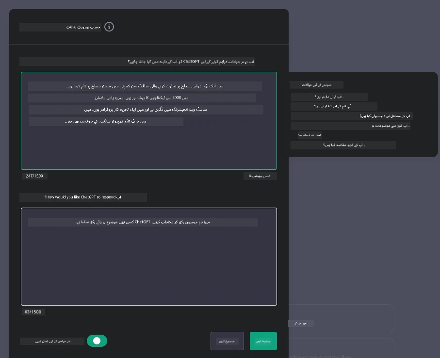

# جنریٹو AI سے چلنے والی چیٹ ایپلیکیشنز کی تعمیر

[](https://youtu.be/R9V0ZY1BEQo?si=IHuU-fS9YWT8s4sA)

> _(اس سبق کی ویڈیو دیکھنے کے لیے اوپر تصویر پر کلک کریں)_

اب جب کہ ہم نے دیکھا کہ ہم ٹیکسٹ جنریشن ایپس کیسے بنا سکتے ہیں، آئیے چیٹ ایپلیکیشنز پر نظر ڈالتے ہیں۔

چیٹ ایپلیکیشنز ہماری روزمرہ زندگیوں میں شامل ہو چکی ہیں اور محض غیر رسمی بات چیت کا ذریعہ نہیں رہیں۔ یہ کسٹمر سروس، ٹیکنیکل سپورٹ، اور حتیٰ کہ پیچیدہ مشورہ دینے والے نظاموں کے لازمی حصے ہیں۔ ممکن ہے کہ آپ نے حال ہی میں کسی چیٹ ایپلیکیشن سے مدد حاصل کی ہو۔ جب ہم جنریٹو AI جیسی جدید ٹیکنالوجیز کو ان پلیٹ فارمز میں شامل کرتے ہیں تو پیچیدگی بڑھتی ہے اور چیلنجز بھی۔

کچھ سوالات جو ہمیں جواب دینے ہیں:

- **ایپ کی تعمیر**۔ ہم مخصوص استعمال کے کیسز کے لیے ان AI سے چلنے والی ایپلیکیشنز کو مؤثر طریقے سے کیسے بنائیں اور بغیر رکاوٹ کے ضم کریں؟
- **نگرانی**۔ تعیناتی کے بعد، ہم ایپلیکیشنز کی فعالیت اور [ذمہ دار AI کے چھ اصول](https://www.microsoft.com/ai/responsible-ai?WT.mc_id=academic-105485-koreyst) کی پابندی کو یقینی بناتے ہوئے انہیں اعلیٰ معیار پر کیسے مانیٹر کر سکتے ہیں؟

جیسے جیسے ہم ایک ایسے دور میں داخل ہو رہے ہیں جو خودکاری اور ہموار انسانی-مشین انٹریکشنز سے تعبیر ہوتا ہے، یہ سمجھنا ضروری ہو جاتا ہے کہ جنریٹو AI چیٹ ایپلیکیشنز کی حد، گہرائی، اور اطلاق کو کیسے تبدیل کرتا ہے۔ یہ سبق ان فن تعمیر کے پہلوؤں کی جانچ کرے گا جو ان پیچیدہ نظاموں کی حمایت کرتے ہیں، مخصوص ڈومین ٹاسک کے لیے ان کی فائن ٹیوننگ کے طریقہ کار پر گہرائی سے بات کرے گا، اور ذمہ دار AI کے نفاذ کو یقینی بنانے کے لیے ضروری میٹرکس اور غور و خوض کا جائزہ لے گا۔

## تعارف

یہ سبق درج ذیل موضوعات کا احاطہ کرتا ہے:

- چیٹ ایپلیکیشنز کو مؤثر طریقے سے بنانے اور ضم کرنے کی تکنیکیں۔
- ایپلیکیشنز میں تخصیص اور فائن ٹیوننگ کا اطلاق کیسے کیا جائے۔
- چیٹ ایپلیکیشنز کی مؤثر نگرانی کے لیے حکمت عملی اور غور و خوض۔

## سیکھنے کے مقاصد

اس سبق کے آخر تک، آپ یہ کر سکیں گے:

- موجودہ نظاموں میں چیٹ ایپلیکیشنز کو بنانے اور ضم کرنے کے متعلق غور و فکر بیان کرنا۔
- مخصوص استعمال کے کیسز کے لیے چیٹ ایپلیکیشنز کو تخصیص کرنا۔
- AI سے چلنے والی چیٹ ایپلیکیشنز کے معیار کو مؤثر طریقے سے مانیٹر اور برقرار رکھنے کے لیے اہم میٹرکس اور غور و خوض کی نشاندہی کرنا۔
- چیٹ ایپلیکیشنز میں AI کی ذمہ دارانہ طور پر استعمال کو یقینی بنانا۔

## چیٹ ایپلیکیشنز میں جنریٹو AI کا انضمام

جنریٹو AI کے ذریعے چیٹ ایپلیکیشنز کو بہتر بنانا صرف انہیں زیادہ ذہین بنانے سے متعلق نہیں؛ بلکہ ان کے فن تعمیر، کارکردگی، اور یوزر انٹرفیس کو بہتر بنا کر ایک معیاری صارف تجربہ فراہم کرنا ہے۔ اس میں فن تعمیر کی بنیادوں، API انضمام، اور یوزر انٹرفیس کے پہلوؤں کی جانچ شامل ہے۔ یہ حصہ آپ کو ان پیچیدہ راستوں سے گزرتے ہوئے ایک جامع روڈمیپ فراہم کرنے کا ارادہ رکھتا ہے، چاہے آپ انہیں موجودہ نظاموں میں شامل کر رہے ہوں یا انہیں مکمل طور پر علیحدہ پلیٹ فارمز کے طور پر بنا رہے ہوں۔

اس حصے کے آخر تک، آپ کو چیٹ ایپلیکیشنز کو مؤثر طریقے سے تعمیر اور شامل کرنے کی مہارت حاصل ہو جائے گی۔

### چیٹ بوٹ یا چیٹ ایپلیکیشن؟

چیٹ ایپلیکیشنز بنانے کی طرف بڑھنے سے پہلے، آئیے 'چیٹ بوٹس' اور 'AI سے چلنے والی چیٹ ایپلیکیشنز' کا موازنہ کریں، جو اپنی الگ الگ رولز اور فنکشنز رکھتے ہیں۔ چیٹ بوٹ کا بنیادی مقصد مخصوص مکالماتی کاموں کو خودکار بنانا ہوتا ہے، جیسے بار بار پوچھے جانے والے سوالات کے جواب دینا یا پیکیج کے ٹریکنگ کی معلومات فراہم کرنا۔ یہ عام طور پر اصول پر مبنی منطق یا پیچیدہ AI الگورتھمز سے چلتے ہیں۔ جبکہ AI سے چلنے والی چیٹ ایپلیکیشن ایک وسیع تر ماحول ہے جو مختلف اقسام کی ڈیجیٹل کمیونیکیشن، جیسے ٹیکسٹ، وائس، اور ویڈیو چیٹس انسانی صارفین کے درمیان ممکن بناتی ہے۔ اس کی نمایاں خصوصیت ایک جنریٹو AI ماڈل کا انضمام ہے جو معلومات کے وسیع تناظر اور سیاق و سباق کی بنیاد پر انسان نما پیچیدہ بات چیت کو تخلیق کرتا ہے۔ ایک جنریٹو AI سے چلنے والی چیٹ ایپلیکیشن اوپن ڈومین مباحثے کر سکتی ہے، بات چیت کے بدلتے ہوئے سیاق و سباق کے مطابق خود کو ڈھال سکتی ہے، اور حتیٰ کہ تخلیقی یا پیچیدہ مکالمے پیدا کر سکتی ہے۔

نیچے دی گئی جدول ہمارے لیے ڈیجیٹل کمیونیکیشن میں ان کے منفرد کردار کو سمجھنے کے لیے اہم فرق اور مماثلتیں بیان کرتی ہے۔

| چیٹ بوٹ                               | جنریٹو AI سے چلنے والی چیٹ ایپلیکیشن |
| ------------------------------------- | -------------------------------------- |
| کام مرکوز اور اصول پر مبنی            | سیاق و سباق کا خیال رکھنے والی          |
| اکثر بڑے نظاموں میں شامل             | ایک یا کئی چیٹ بوٹس کی میزبانی کر سکتی ہے|
| مخصوص پروگرام شدہ فنکشنز تک محدود    | جنریٹو AI ماڈلز کو شامل کرتی ہے         |
| مخصوص اور منظم بات چیت               | اوپن ڈومین مباحثوں کے قابل                |

### SDKs اور APIs کے ذریعے پہلے سے بنائی گئی فعالیت کا استعمال

چیٹ ایپلیکیشن بنانے میں، پہلے سے موجود وسائل کا جائزہ لینا ایک عمدہ قدم ہے۔ SDKs اور APIs کا استعمال کئی وجوہات کی بنا پر فائدہ مند حکمت عملی ہے۔ اچھی دستاویزی SDKs اور APIs کو ضم کرکے، آپ اپنی ایپلیکیشن کو طویل مدتی کامیابی کے لیے مضبوط بنیاد فراہم کر رہے ہیں، اسکیل ایبلٹی اور دیکھ بھال کے مسائل کو حل کرتے ہوئے۔

- **ترقیاتی عمل کو تیز اور بوجھ کم کرتا ہے**: خود سے مہنگا عمل بنانے کے بجائے پہلے سے موجود فعالیت پر انحصار کرنے سے آپ اپنی ایپلیکیشن کے دیگر اہم پہلوؤں پر توجہ مرکوز کر سکتے ہیں، جیسے کاروباری منطق۔
- **بہتر کارکردگی**: جب آپ فنکشنز خود سے بناتے ہیں، تو آپ آخر کار یہ سوال کرتے ہیں "یہ کیسے اسکیل کرتا ہے؟ کیا یہ ایپ اچانک صارفین کی بہتات کو سنبھال سکتا ہے؟" اچھی دیکھ بھال والے SDKs اور APIs عموماً ان مسائل کے حل بھی رکھتے ہیں۔
- **آسان دیکھ بھال**: اپ ڈیٹس اور بہتریاں آسانی سے منظم کی جا سکتی ہیں کیونکہ زیادہ تر APIs اور SDKs کو صرف لائبریری کو اپ ڈیٹ کرنا ہوتا ہے جب نئی ورژن جاری ہوتی ہے۔
- **جدید ترین ٹیکنالوجی تک رسائی**: ایسے ماڈلز کا استعمال جو بڑے ڈیٹاسیٹس پر فائن ٹیون اور ٹرین کیے گئے ہوں، آپ کی ایپلیکیشن کو قدرتی زبان کی صلاحیتیں فراہم کرتا ہے۔

SDK یا API کی فعالیت تک رسائی عام طور پر فراہم کی گئی خدمات کو استعمال کرنے کی اجازت حاصل کرنے سے مشروط ہوتی ہے، جو عام طور پر ایک منفرد کلید یا تصدیقی ٹوکن کے ذریعے ہوتی ہے۔ ہم OpenAI Python لائبریری کا استعمال کرتے ہوئے دیکھیں گے کہ یہ کیسا ہوتا ہے۔ آپ اسے خود بھی آزما سکتے ہیں درج ذیل [OpenAI کے نوٹ بک](./python/oai-assignment.ipynb?WT.mc_id=academic-105485-koreyst) یا [Azure OpenAI سروسز کے نوٹ بک](./python/aoai-assignment.ipynb?WT.mc_id=academic-105485-koreys) میں۔

```python
import os
from openai import OpenAI

API_KEY = os.getenv("OPENAI_API_KEY","")

client = OpenAI(
    api_key=API_KEY
    )

response = client.responses.create(model="gpt-5-mini", input="Suggest two titles for an instructional lesson on chat applications for generative AI.", store=False)
print(response.output_text)
```

اوپر دیے گئے مثال میں GPT-5 mini ماڈل Responses API کے ساتھ پرامپٹ مکمل کرنے کے لیے استعمال کیا گیا ہے، لیکن غور کریں کہ API کلید پہلے سے سیٹ کی گئی ہے۔ اگر آپ کلید سیٹ نہ کریں گے تو آپ کو ایک ایرر موصول ہوگا۔

## صارف تجربہ (UX)

عمومی UX اصول چیٹ ایپلیکیشنز پر لاگو ہوتے ہیں، لیکن مشین لرننگ کے اجزاء کی موجودگی کی وجہ سے کچھ اضافی غور و خوض خاص طور پر اہم ہو جاتے ہیں۔

- **ابہام کو دور کرنے کا طریقہ**: جنریٹو AI ماڈلز کبھی کبھار مبہم جوابات پیدا کرتے ہیں۔ ایسی خصوصیت جو صارف کو وضاحت طلب کرنے کی اجازت دیتی ہے، اس مسئلے سے نمٹنے میں مددگار ثابت ہو سکتی ہے۔
- **سیاق و سباق کا تحفظ**: جدید جنریٹو AI ماڈلز گفتگو کے اندر سیاق و سباق کو یاد رکھنے کی صلاحیت رکھتے ہیں، جو صارف کے تجربے کے لیے مفید ہو سکتی ہے۔ صارفین کو سیاق و سباق کو کنٹرول اور منظم کرنے کی صلاحیت دینا صارف کے تجربے کو بہتر بناتا ہے، لیکن حساس صارف کی معلومات رکھنے کے خطرے کو بھی بڑھا دیتا ہے۔ معلومات کو کتنی دیر کے لیے رکھا جائے، جیسے کہ ایک ریٹینشن پالیسی لگانا، رازداری کے خلاف سیاق و سباق کی ضرورت کو متوازن کر سکتا ہے۔
- **شخصی بنانا**: سیکھنے اور ڈھالنے کی صلاحیت کے ساتھ، AI ماڈلز صارف کے لیے منفرد تجربہ فراہم کرتے ہیں۔ صارف کے پروفائلز جیسے فیچرز کے ذریعے تجربہ کو حسب ضرورت بنانے سے نہ صرف صارف کو سمجھا ہوا محسوس ہوتا ہے، بلکہ مخصوص جوابات تلاش کرنے کے لیے ان کی مدد بھی ہوتی ہے، جس سے بات چیت زیادہ مؤثر اور تسلی بخش بنتی ہے۔

شخصی بنانے کی ایک مثال OpenAI کی ChatGPT میں "کسٹم انسٹرکشنز" کی سیٹنگ ہے۔ یہ آپ کو اپنے بارے میں معلومات فراہم کرنے کی اجازت دیتی ہے جو آپ کے پرامپٹس کے لیے اہم سیاق ہو سکتی ہے۔ یہاں ایک کسٹم انسٹرکشن کی مثال ہے۔



یہ "پروفائل" ChatGPT کو لنکڈ لسٹس پر ایک سبق کی منصوبہ بندی بنانے کی ترغیب دیتا ہے۔ غور کریں کہ ChatGPT صارف کے تجربے کو مدنظر رکھتے ہوئے زیادہ تفصیلی سبق کی منصوبہ بندی بناتا ہے۔


### مائیکروسافٹ کا بڑے زبان کے ماڈلز کے لیے سسٹم میسج فریم ورک

[مائیکروسافٹ نے رہنمائی فراہم کی ہے](https://learn.microsoft.com/azure/ai-foundry/openai/concepts/system-message#define-the-models-output-format?WT.mc_id=academic-105485-koreyst) مؤثر سسٹم میسجز لکھنے کے لیے جب LLMs سے جوابات حاصل کیے جائیں، جسے 4 حصوں میں تقسیم کیا گیا ہے:

1. یہ تعین کرنا کہ ماڈل کس کے لیے ہے، اس کی صلاحیتیں اور حدود۔
2. ماڈل کے آؤٹ پٹ کے فارمیٹ کی تعریف۔
3. مخصوص مثالیں فراہم کرنا جو ماڈل کے متوقع رویے کو ظاہر کریں۔
4. اضافی رویے کے گارڈ ریلز فراہم کرنا۔

### رسائی

چاہے صارف بصری، سماعتی، حرکتی، یا علمی معذوریوں کا شکار ہو، ایک اچھے ڈیزائن کی گئی چیٹ ایپلیکیشن سب کے لیے قابل استعمال ہونی چاہیے۔ درج ذیل فہرست مخصوص خصوصیات پر مشتمل ہے جو مختلف معذوریوں والے صارفین کی آسانی کے لیے ہیں۔

- **بصری معذوری کے لیے خصوصیات**: ہائی کانسٹراسٹ تھیمز اور متن کا سائز بڑھانے کی صلاحیت، سکرین ریڈر کی مطابقت۔
- **سماعتی معذوری کے لیے خصوصیات**: ٹیکسٹ-ٹو-اسپیچ اور اسپیچ-ٹو-ٹیکسٹ فنکشنز، آڈیو نوٹیفیکیشنز کے لیے بصری اشارے۔
- **حرکتی معذوری کے لیے خصوصیات**: کی بورڈ نیویگیشن کی حمایت، وائس کمانڈز۔
- **علمی معذوری کے لیے خصوصیات**: آسان زبان کے اختیارات۔

## مخصوص ڈومین کے لیے زبان کے ماڈلز کی تخصیص اور فائن ٹیوننگ

تصور کریں کہ ایک ایسی چیٹ ایپلیکیشن جو آپ کی کمپنی کے خاص اصطلاحات کو سمجھتی ہو اور اپنے صارفین کے عام سوالات کی پیشگی شناخت کرتی ہو۔ اس کے لیے چند طریقے قابل ذکر ہیں:

- **ڈومین مخصوص زبان کے ماڈلز کا استعمال**۔ DSL کا مطلب ہے ڈومین مخصوص زبان۔ آپ ایک DSL ماڈل استعمال کر سکتے ہیں جو کسی مخصوص ڈومین کی مفاہیم اور منظرناموں کو سمجھنے کے لیے تربیت یافتہ ہو۔
- **فائن ٹیوننگ کا اطلاق**۔ فائن ٹیوننگ آپ کے ماڈل کو مخصوص ڈیٹا کے ساتھ مزید تربیت دینے کا عمل ہے۔

## تخصیص: DSL کا استعمال

ڈومین مخصوص زبان کے ماڈلز (DSL ماڈلز) استعمال کرنے سے صارف کی مشغولیت میں اضافہ ہوتا ہے کیونکہ یہ خصوصی، سیاق و سباق کے لحاظ سے متعلقہ بات چیت فراہم کرتے ہیں۔ یہ ماڈل ایسی تربیت یا فائن ٹیوننگ سے حاصل ہوتا ہے جو کسی خاص میدان، صنعت، یا مضمون سے متعلق ٹیکسٹ کو سمجھتا اور جنریٹ کرتا ہے۔ DSL ماڈل استعمال کرنے کے اختیار میں نیا ماڈل شروع سے تربیت دینا یا پہلے سے موجود ماڈلز کو SDKs اور APIs کے ذریعے استعمال کرنا شامل ہے۔ ایک اور آپشن فائن ٹیوننگ ہے، جس میں موجودہ پری ٹرینڈ ماڈل کو مخصوص ڈومین کے لیے موزوں بنایا جاتا ہے۔

## تخصیص: فائن ٹیوننگ کا اطلاق

جب کسی خصوصی ڈومین یا مخصوص کام میں پری ٹرینڈ ماڈل ناکافی ہو تو فائن ٹیوننگ پر غور کیا جاتا ہے۔

مثال کے طور پر، طبی سوالات پیچیدہ ہوتے ہیں اور بہت زیادہ سیاق و سباق کی ضرورت ہوتی ہے۔ جب کوئی طبی ماہر مریض کی تشخیص کرتا ہے تو یہ مختلف عوامل، جیسے طرز زندگی یا موجودہ حالتوں کی بنیاد پر ہوتا ہے، اور حالیہ طبی جرنلز پر بھی انحصار کر سکتا ہے تاکہ تشخیص کی توثیق ہو سکے۔ ایسے حساس حالات میں، ایک عام مقصد والا AI چیٹ ایپلیکیشن قابل اعتماد ذریعہ نہیں ہو سکتا۔

### منظرنامہ: ایک طبی ایپلیکیشن

ایک ایسی چیٹ ایپلیکیشن کا تصور کریں جو طبی ماہرین کی مدد کے لیے تیز رفتار حوالہ جات فراہم کرتی ہو، جیسے علاج کے رہنما اصول، دوائیوں کے ردعمل، یا حالیہ تحقیقی نتائج۔

ایک عام مقصد ماڈل بنیادی طبی سوالات کے جواب دینے یا عمومی مشورہ دینے کے لیے مناسب ہو سکتا ہے، لیکن یہ چند مشکلات کا سامنا کر سکتا ہے:

- **انتہائی مخصوص یا پیچیدہ کیسز**۔ مثلاً، ایک نیورولوجسٹ اس ایپلیکیشن سے پوچھ سکتا ہے، "پیڈیاٹرک مریضوں میں دوائیوں کے خلاف جدو جہد کرنے والی مرگی کے بہترین حالیہ طریقہ کار کیا ہیں؟"
- **تازہ ترین پیش رفت کی کمی**۔ ایک عام مقصد ماڈل حالیہ نیورولوجی اور فارماکولوجی کی ترقیات کو شامل کرنے میں دشواری محسوس کر سکتا ہے۔

ایسے حالات میں، ماڈل کو خصوصی طبی ڈیٹاسیٹ کے ساتھ فائن ٹیون کرنا اس کی صلاحیت کو بہتر اور زیادہ درست بنانے کے لیے بہت مددگار ثابت ہوتا ہے۔ اس کے لیے ایک وسیع اور متعلقہ ڈیٹاسیٹ کی ضرورت ہوتی ہے جو مخصوص ڈومین کے چیلنجز اور سوالات کی نمائندگی کرتا ہو۔

## اعلیٰ معیار کے AI سے چلنے والے چیٹ تجربے کے لیے غور و خوض

یہ حصہ "اعلیٰ معیار" کی چیٹ ایپلیکیشنز کے لیے معیار وضع کرتا ہے، جن میں موزوں میٹرکس کی گرفت اور AI ٹیکنالوجی کو ذمہ داری سے استعمال کرنے کا فریم ورک شامل ہے۔

### اہم میٹرکس

ایک ایپلیکیشن کی اعلیٰ کارکردگی برقرار رکھنے کے لیے، ضروری ہے کہ اہم میٹرکس اور غور و خوض پر نظر رکھی جائے۔ یہ پیمائشیں نہ صرف ایپلیکیشن کی فعالیت کو یقینی بناتی ہیں بلکہ AI ماڈل اور صارف کے تجربے کے معیار کا بھی جائزہ لیتی ہیں۔ نیچے دی گئی فہرست بنیادی، AI، اور صارف تجربے کے میٹرکس کا احاطہ کرتی ہے۔

| میٹرک                         | تعریف                                                                                                           | چیٹ ڈویلپر کے لیے غور و خوض                                         |
| ----------------------------- | ---------------------------------------------------------------------------------------------------------------- | -------------------------------------------------------------------- |
| **اپ ٹائم**                   | ایپلیکیشن کے چلنے اور صارفین کے لیے دستیاب رہنے کا وقت ناپتا ہے۔                                                | آپ ڈاؤن ٹائم کو کیسے کم کریں گے؟                                     |
| **ریسپانس ٹائم**              | صارف کے سوال کے جواب میں ایپلیکیشن کے لگنے والا وقت۔                                                            | آپ ریسپانس ٹائم کو بہتر بنانے کے لیے سوالات کے عمل کو کیسے بہتر کریں گے؟ |
| **درستگی (Precision)**       | مثبت پیش گوئیوں میں سے درست پیش گوئیوں کا تناسب۔                                                                 | آپ اپنے ماڈل کی درستگی کو کیسے تصدیق کریں گے؟                       |
| **یادداشت (Recall)**          | حقیقی مثبت واقعات میں سے درست پیش گوئیوں کا تناسب۔                                                               | آپ یادداشت کو کیسے ناپیں اور بہتر بنائیں گے؟                      |
| **F1 اسکور**                 | درستگی اور یادداشت کا ہم آہنگی اوسط، جو دونوں کے درمیان توازن قائم کرتا ہے۔                                         | آپ کا ہدف کیا ہے؟ آپ درستگی اور یادداشت کے درمیان توازن کیسے برقرار رکھیں گے؟|
| **پیرفلیکسٹی**               | ماڈل کی پیش گوئی کی گئی احتمال کی تقسیم اس ڈیٹا کی اصل تقسیم سے کس حد تک میل کھاتی ہے، ناپتا ہے۔                     | آپ پیرفلیکسٹی کو کیسے کم کریں گے؟                                   |
| **صارف کی تسلی کے میٹرکس**     | ایپلیکیشن کے بارے میں صارف کا تاثر ناپتا ہے۔ عام طور پر سروے کے ذریعے حاصل کیا جاتا ہے۔                             | آپ صارف کی رائے کتنی بار جمع کریں گے؟ اور اس کی بنیاد پر کیسے تبدیل کریں گے؟|
| **خرابی کی شرح**              | ماڈل کی سمجھنے یا آؤٹ پٹ میں غلطیوں کی شرح۔                                                                       | آپ خرابی کی شرح کو کم کرنے کے لیے کیا حکمت عملی اختیار کریں گے؟       |
| **دوبارہ تربیت کے چکر**       | ماڈل کو نئے ڈیٹا اور بصیرت شامل کرنے کے لیے اپڈیٹ کرنے کی فریکوئنسی۔                                               | آپ ماڈل کو کتنی بار دوبارہ تربیت دیں گے؟ دوبارہ تربیت کے چکر کو کیا حرکت دیتا ہے؟|

| **انوکھے پن کا پتہ لگانا**   | ایسے اوزار اور تکنیکیں جو غیر معمولی نمونوں کی شناخت کرتی ہیں جو متوقع رویے سے مطابقت نہیں رکھتے۔                | آپ انوکھے پن کے ردعمل میں کیسے جواب دیں گے؟                            |

### چیٹ ایپلیکیشنز میں ذمہ دار AI طریقہ کار کا نفاذ

مائیکروسافٹ کا ذمہ دار AI کا طریقہ کار چھ اصولوں کی نشاندہی کرتا ہے جو AI کی ترقی اور استعمال کی رہنمائی کرنا چاہیے۔ نیچے اصول، ان کی تعریف، اور وہ باتیں ہیں جو چیٹ ڈویلپر کو مدنظر رکھنی چاہئیں اور کیوں انہیں سنجیدگی سے لینا چاہیے۔

| اصول                  | مائیکروسافٹ کی تعریف                                   | چیٹ ڈویلپر کے لیے غور و فکر                                         | کیوں یہ اہم ہے                                                                                     |
| ---------------------- | ----------------------------------------------------- | ---------------------------------------------------------------------- | --------------------------------------------------------------------------------------------- |
| منصفانہ رویہ           | AI نظام کو تمام افراد کے ساتھ منصفانہ سلوک کرنا چاہیے۔ | یقینی بنائیں کہ چیٹ ایپلیکیشن صارف کے ڈیٹا کی بنیاد پر امتیاز نہ کرے۔   | صارفین کے درمیان اعتماد اور شمولیت قائم کرنے کے لیے؛ قانونی نتائج سے بچاؤ کے لیے۔              |
| اعتماد اور حفاظت        | AI نظام کو قابل اعتماد اور محفوظ طریقے سے کام کرنا چاہیے۔ | غلطیوں اور خطرات کو کم کرنے کے لیے جانچ اور فیل-سیف نافذ کریں۔         | صارف کی تسلی اور ممکنہ نقصان سے بچاؤ کو یقینی بناتا ہے۔                                        |
| رازداری اور تحفظ       | AI نظام کو محفوظ اور پرائیویسی کا احترام کرنے والا ہونا چاہیے۔ | مضبوط انکرپشن اور ڈیٹا پروٹیکشن کے اقدامات نافذ کریں۔                  | حساس صارف کے ڈیٹا کی حفاظت اور پرائیویسی قوانین کی پابندی کے لیے۔                              |
| شمولیت                | AI نظام کو ہر ایک کو بااختیار بنانا اور لوگوں کو شامل کرنا چاہیے۔ | مختلف آڈیئنس کے لیے قابل رسائی اور استعمال میں آسان UI/UX ڈیزائن کریں۔ | اس بات کو یقینی بناتا ہے کہ ایپلیکیشن مختلف قسم کے لوگ مؤثر طریقے سے استعمال کر سکیں۔           |
| شفافیت                | AI نظام کو قابل فہم ہونا چاہیے۔                         | AI کے جوابوں کے لیے واضح دستاویزات اور وجوہات فراہم کریں۔               | اگر صارف جان سکیں کہ فیصلے کیسے کیے جاتے ہیں تو وہ نظام پر زیادہ اعتماد کرتے ہیں۔               |
| جوابدہی               | AI نظام کے لیے لوگوں کو جوابدہ ہونا چاہیے۔                 | AI فیصلوں کے آڈٹ اور بہتری کے لیے ایک واضح عمل قائم کریں۔              | غلطیوں کی صورت میں مسلسل بہتری اور اصلاحی اقدامات ممکن بناتا ہے۔                             |

## اسائنمنٹ

دیکھیں [assignment](../../../07-building-chat-applications/python)۔ یہ آپ کو آپ کے پہلے چیٹ پرامپٹس چلانے، متن کو درجہ بندی اور خلاصہ کرنے اور مزید سرگرمیوں کی سیریز سے گزرائے گا۔ نوٹ کریں کہ اسائنمنٹس مختلف پروگرامنگ زبانوں میں دستیاب ہیں!

## شاباش! سفر جاری رکھیں

اس سبق کو مکمل کرنے کے بعد، ہمارے [Generative AI Learning collection](https://aka.ms/genai-collection?WT.mc_id=academic-105485-koreyst) کو دیکھیں تاکہ آپ اپنی Generative AI کی معلومات کو مزید بڑھا سکیں!

سبق 8 پر جائیں تاکہ دیکھیں کہ آپ [سرچ ایپلیکیشنز بنانے](../08-building-search-applications/README.md?WT.mc_id=academic-105485-koreyst) کا آغاز کیسے کر سکتے ہیں!

---

<!-- CO-OP TRANSLATOR DISCLAIMER START -->
**ڈس کلیمر**:
یہ دستاویز AI ترجمہ سروس [Co-op Translator](https://github.com/Azure/co-op-translator) کے ذریعے ترجمہ کی گئی ہے۔ جبکہ ہم درستگی کے لیے کوشاں ہیں، براہ کرم اس بات سے آگاہ رہیں کہ خودکار ترجمے میں غلطیاں یا عدم درستیاں ہو سکتی ہیں۔ اصل دستاویز اپنے مادری زبان میں مستند ماخذ سمجھی جائے گی۔ حساس معلومات کے لیے پیشہ ور انسانی ترجمہ کی سفارش کی جاتی ہے۔ اس ترجمے کے استعمال سے پیدا ہونے والی کسی بھی غلط فہمی یا غلط تشریح کی ذمہ داری ہم قبول نہیں کرتے۔
<!-- CO-OP TRANSLATOR DISCLAIMER END -->