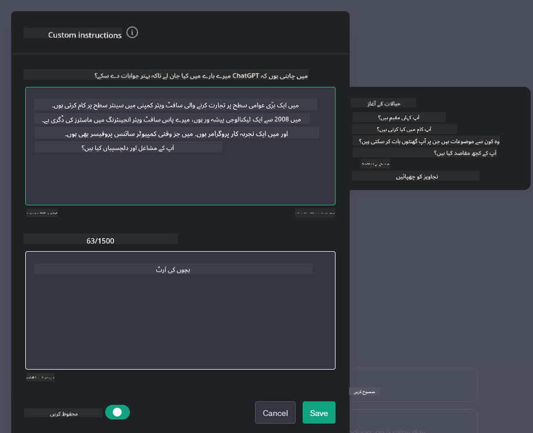
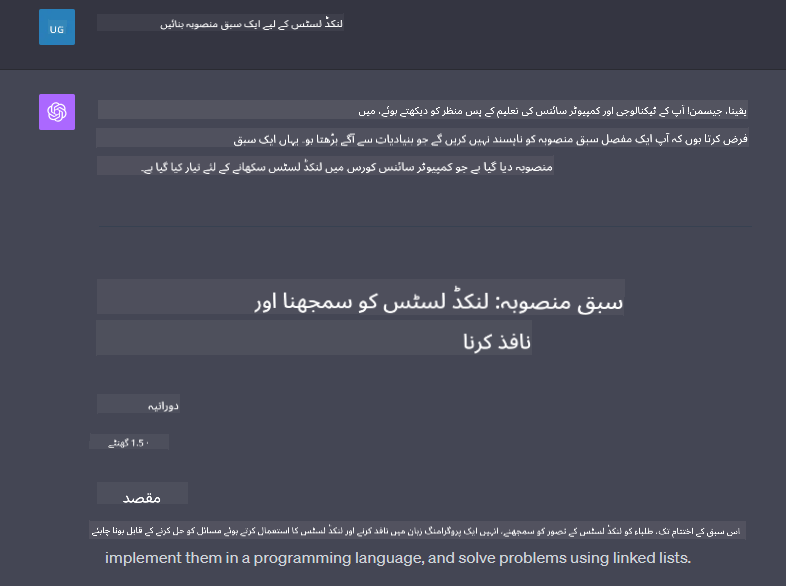

<!--
CO_OP_TRANSLATOR_METADATA:
{
  "original_hash": "ea4bbe640847aafbbba14dae4625e9af",
  "translation_date": "2025-06-25T15:09:56+00:00",
  "source_file": "07-building-chat-applications/README.md",
  "language_code": "ur"
}
-->
# جنریٹیو اے آئی سے چلنے والی چیٹ ایپلی کیشنز بنانا

اب جب کہ ہم نے دیکھا کہ ہم ٹیکسٹ جنریشن ایپس کیسے بنا سکتے ہیں، آئیے چیٹ ایپلی کیشنز کا جائزہ لیتے ہیں۔

چیٹ ایپلی کیشنز ہماری روزمرہ زندگی کا حصہ بن چکی ہیں، جو محض آرام دہ گفتگو کے ذرائع سے زیادہ فراہم کرتی ہیں۔ وہ کسٹمر سروس، تکنیکی معاونت، اور حتیٰ کہ جدید مشورتی نظام کا لازمی جزو ہیں۔ یہ ممکن ہے کہ آپ کو کچھ وقت پہلے کسی چیٹ ایپلی کیشن سے کچھ مدد ملی ہو۔ جیسے جیسے ہم ان پلیٹ فارمز میں جنریٹیو اے آئی جیسی جدید ٹیکنالوجیز کو شامل کرتے ہیں، پیچیدگی بڑھتی ہے اور اسی طرح چیلنجز بھی۔

کچھ سوالات جن کے جوابات ہمیں درکار ہیں:

- **ایپ بنانا**۔ ہم مخصوص استعمال کے کیسز کے لیے ان اے آئی سے چلنے والی ایپلی کیشنز کو کیسے مؤثر طریقے سے بنا اور ضم کر سکتے ہیں؟
- **نگرانی**۔ ایک بار تعینات ہونے کے بعد، ہم ایپلی کیشنز کی نگرانی اور اس بات کو کیسے یقینی بنا سکتے ہیں کہ وہ فعالیت اور [ذمہ دار اے آئی کے چھ اصولوں](https://www.microsoft.com/ai/responsible-ai?WT.mc_id=academic-105485-koreyst) کی پابندی کے لحاظ سے اعلیٰ معیار پر کام کر رہی ہیں؟

جیسے جیسے ہم خودکاری اور ہموار انسان-مشین تعاملات کے عہد میں آگے بڑھتے ہیں، یہ سمجھنا ضروری ہوتا جا رہا ہے کہ جنریٹیو اے آئی چیٹ ایپلی کیشنز کے دائرہ کار، گہرائی، اور موافقت کو کیسے تبدیل کرتا ہے۔ یہ سبق ان پیچیدہ نظاموں کی حمایت کرنے والی آرکیٹیکچر کے پہلوؤں کی تحقیقات کرے گا، انہیں ڈومین مخصوص کاموں کے لیے بہتر بنانے کے طریقہ کار میں گہرائی میں جائے گا، اور ذمہ دار اے آئی کی تعیناتی کو یقینی بنانے کے لیے متعلقہ میٹرکس اور غور و فکر کا جائزہ لے گا۔

## تعارف

یہ سبق شامل ہے:

- چیٹ ایپلی کیشنز کو مؤثر طریقے سے بنانے اور ضم کرنے کی تکنیکیں۔
- ایپلی کیشنز پر حسب ضرورت بنانے اور بہتر بنانے کا اطلاق کیسے کریں۔
- چیٹ ایپلی کیشنز کی مؤثر نگرانی کے لیے حکمت عملی اور غور و فکر۔

## سیکھنے کے اہداف

اس سبق کے اختتام تک، آپ قابل ہوں گے:

- موجودہ نظاموں میں چیٹ ایپلی کیشنز کو بنانے اور ضم کرنے کے لیے غور و فکر کو بیان کریں۔
- مخصوص استعمال کے کیسز کے لیے چیٹ ایپلی کیشنز کو حسب ضرورت بنائیں۔
- اے آئی سے چلنے والی چیٹ ایپلی کیشنز کے معیار کو مؤثر طریقے سے نگرانی اور برقرار رکھنے کے لیے کلیدی میٹرکس اور غور و فکر کی شناخت کریں۔
- یقینی بنائیں کہ چیٹ ایپلی کیشنز اے آئی کو ذمہ داری سے استعمال کرتی ہیں۔

## چیٹ ایپلی کیشنز میں جنریٹیو اے آئی کو ضم کرنا

جنریٹیو اے آئی کے ذریعے چیٹ ایپلی کیشنز کو بلند کرنا صرف انہیں زیادہ ہوشیار بنانا نہیں ہے؛ یہ ان کی آرکیٹیکچر، کارکردگی، اور صارف انٹرفیس کو بہتر بنانے کے بارے میں ہے تاکہ ایک معیاری صارف تجربہ فراہم کیا جا سکے۔ اس میں آرکیٹیکچرل بنیادوں، API انضمام، اور صارف انٹرفیس کے غور و فکر کی تحقیقات شامل ہیں۔ یہ سیکشن آپ کو ان پیچیدہ مناظر کو نیویگیٹ کرنے کے لیے ایک جامع روڈ میپ پیش کرنے کا ارادہ رکھتا ہے، چاہے آپ انہیں موجودہ نظاموں میں پلگ ان کر رہے ہوں یا انہیں اسٹینڈ الون پلیٹ فارمز کے طور پر بنا رہے ہوں۔

اس سیکشن کے اختتام تک، آپ چیٹ ایپلی کیشنز کو مؤثر طریقے سے تعمیر کرنے اور شامل کرنے کے لیے درکار مہارت سے لیس ہوں گے۔

### چیٹ بوٹ یا چیٹ ایپلیکیشن؟

اس سے پہلے کہ ہم چیٹ ایپلی کیشنز بنانے میں غوطہ لگائیں، آئیے 'چیٹ بوٹس' کا موازنہ 'اے آئی سے چلنے والی چیٹ ایپلی کیشنز' سے کریں، جو الگ الگ کردار اور فعالیتیں پیش کرتی ہیں۔ چیٹ بوٹ کا بنیادی مقصد مخصوص گفتگو کے کاموں کو خودکار بنانا ہے، جیسے کہ اکثر پوچھے جانے والے سوالات کے جوابات دینا یا پیکج کو ٹریک کرنا۔ یہ عام طور پر اصول پر مبنی منطق یا پیچیدہ اے آئی الگورتھم کے ذریعے چلایا جاتا ہے۔ اس کے برعکس، ایک اے آئی سے چلنے والی چیٹ ایپلی کیشن ایک بہت زیادہ وسیع ماحول ہے جو انسانی صارفین کے درمیان مختلف اقسام کے ڈیجیٹل مواصلات کو سہولت فراہم کرنے کے لیے ڈیزائن کی گئی ہے، جیسے کہ متن، آواز، اور ویڈیو چیٹس۔ اس کی تعریف کرنے والی خصوصیت ایک جنریٹیو اے آئی ماڈل کا انضمام ہے جو باریک بینی سے انسانی جیسی گفتگو کی نقالی کرتا ہے، وسیع اقسام کے ان پٹ اور سیاق و سباق کے اشارے کی بنیاد پر جوابات تیار کرتا ہے۔ ایک جنریٹیو اے آئی سے چلنے والی چیٹ ایپلی کیشن کھلے ڈومین کے مباحثوں میں مشغول ہو سکتی ہے، ابھرتے ہوئے گفتگو کے سیاق و سباق کے مطابق ڈھل سکتی ہے، اور یہاں تک کہ تخلیقی یا پیچیدہ مکالمے بھی پیدا کر سکتی ہے۔

ذیل میں دی گئی جدول ڈیجیٹل مواصلات میں ان کے منفرد کرداروں کو سمجھنے میں ہماری مدد کرنے کے لیے کلیدی فرق اور مماثلتیں پیش کرتی ہے۔

| چیٹ بوٹ                               | جنریٹیو اے آئی سے چلنے والی چیٹ ایپلی کیشن |
| ------------------------------------- | ------------------------------------------ |
| کام پر مبنی اور اصول پر مبنی          | سیاق و سباق سے آگاہ                         |
| اکثر بڑے نظاموں میں ضم کیا جاتا ہے     | ایک یا ایک سے زیادہ چیٹ بوٹس کی میزبانی کر سکتا ہے |
| پروگرام شدہ افعال تک محدود            | جنریٹیو اے آئی ماڈلز کو شامل کرتا ہے        |
| خصوصی اور منظم تعاملات                | کھلے ڈومین کے مباحثوں کی صلاحیت رکھتا ہے    |

### SDKs اور APIs کے ساتھ پہلے سے بنی ہوئی فعالیتوں کا فائدہ اٹھانا

چیٹ ایپلی کیشن بناتے وقت، پہلا قدم یہ ہے کہ یہ جانچنا کہ پہلے سے کیا موجود ہے۔ چیٹ ایپلی کیشنز بنانے کے لیے SDKs اور APIs کا استعمال ایک فائدہ مند حکمت عملی ہے۔ اچھی طرح سے دستاویزی SDKs اور APIs کو شامل کر کے، آپ اپنی ایپلی کیشن کو طویل مدتی کامیابی کے لیے اسٹریٹجک طور پر پوزیشن کر رہے ہیں، پیمائش اور دیکھ بھال کے خدشات کو حل کر رہے ہیں۔

- **ترقی کے عمل کو تیز کرتا ہے اور اوور ہیڈ کو کم کرتا ہے**: پہلے سے بنی ہوئی فعالیتوں پر انحصار کرنا بجائے اس کے کہ آپ خود انہیں بنائیں، آپ کو اپنی ایپلی کیشن کے دیگر پہلوؤں پر توجہ مرکوز کرنے کی اجازت دیتا ہے جو آپ کے لیے زیادہ اہم ہو سکتے ہیں، جیسے کاروباری منطق۔
- **بہتر کارکردگی**: جب آپ صفر سے فعالیت بناتے ہیں، تو آپ بالآخر اپنے آپ سے پوچھیں گے "یہ کیسے پیمائش کرتا ہے؟ کیا یہ ایپلی کیشن صارفین کے اچانک اضافے کو سنبھالنے کی صلاحیت رکھتی ہے؟" اچھی طرح سے برقرار رکھنے والے SDK اور APIs میں اکثر ان خدشات کے لیے بلٹ ان حل ہوتے ہیں۔
- **آسان دیکھ بھال**: اپ ڈیٹس اور بہتری کو سنبھالنا آسان ہوتا ہے کیونکہ زیادہ تر APIs اور SDKs کو نئی ورژن کی ریلیز کے وقت لائبریری کی اپ ڈیٹ کی ضرورت ہوتی ہے۔
- **جدید ٹیکنالوجی تک رسائی**: ان ماڈلز کا فائدہ اٹھانا جو وسیع ڈیٹا سیٹس پر تربیت یافتہ اور ٹھیک ٹھاک کیے گئے ہیں آپ کی ایپلی کیشن کو قدرتی زبان کی صلاحیتیں فراہم کرتا ہے۔

SDK یا API کی فعالیت تک رسائی عام طور پر فراہم کردہ خدمات کے استعمال کی اجازت حاصل کرنے کے عمل میں شامل ہوتی ہے، جو اکثر ایک منفرد کلید یا تصدیقی ٹوکن کے استعمال کے ذریعے ہوتا ہے۔ ہم دیکھیں گے کہ یہ کیسا لگتا ہے اوپن اے آئی پائتھن لائبریری کا استعمال کرتے ہوئے۔ آپ اس سبق کے لیے [اوپن اے آئی](../../../07-building-chat-applications/python/oai-assignment.ipynb) یا [ایزور اوپن اے آئی سروسز](../../../07-building-chat-applications/python/aoai-assignment.ipynb) کے لیے مندرجہ ذیل نوٹ بک میں خود بھی آزما سکتے ہیں۔

```python
import os
from openai import OpenAI

API_KEY = os.getenv("OPENAI_API_KEY","")

client = OpenAI(
    api_key=API_KEY
    )

chat_completion = client.chat.completions.create(model="gpt-3.5-turbo", messages=[{"role": "user", "content": "Suggest two titles for an instructional lesson on chat applications for generative AI."}])
```

اوپر کی مثال GPT-3.5 ٹربو ماڈل کا استعمال کرتی ہے تاکہ پرامپٹ کو مکمل کیا جا سکے، لیکن نوٹ کریں کہ ایسا کرنے سے پہلے API کلید سیٹ کی جاتی ہے۔ اگر آپ کلید سیٹ نہ کرتے تو آپ کو ایک غلطی موصول ہوتی۔

## صارف تجربہ (UX)

عمومی UX اصول چیٹ ایپلی کیشنز پر لاگو ہوتے ہیں، لیکن یہاں کچھ اضافی غور و فکر ہیں جو مشین لرننگ کے اجزاء کی وجہ سے خاص طور پر اہم ہو جاتے ہیں۔

- **ابہام کو دور کرنے کا طریقہ کار**: جنریٹیو اے آئی ماڈلز کبھی کبھار مبہم جوابات پیدا کرتے ہیں۔ ایک خصوصیت جو صارفین کو وضاحت کے لیے پوچھنے کی اجازت دیتی ہے، مددگار ہو سکتی ہے اگر وہ اس مسئلے کا سامنا کریں۔
- **سیاق و سباق کی برقراری**: جدید جنریٹیو اے آئی ماڈلز کے پاس گفتگو کے دوران سیاق و سباق کو یاد رکھنے کی صلاحیت ہوتی ہے، جو صارف کے تجربے کے لیے ایک ضروری اثاثہ ہو سکتی ہے۔ صارفین کو سیاق و سباق کو کنٹرول اور منظم کرنے کی صلاحیت دینا صارف کے تجربے کو بہتر بناتا ہے، لیکن حساس صارف معلومات کو برقرار رکھنے کے خطرے کو متعارف کراتا ہے۔ اس معلومات کو کتنی دیر تک محفوظ کیا جاتا ہے اس پر غور و فکر، جیسے کہ ایک برقراری پالیسی متعارف کرانا، سیاق و سباق کی ضرورت کو رازداری کے خلاف متوازن کر سکتا ہے۔
- **حسب ضرورت**: سیکھنے اور ڈھلنے کی صلاحیت کے ساتھ، اے آئی ماڈلز صارف کے لیے ایک انفرادی تجربہ پیش کرتے ہیں۔ صارف پروفائلز جیسی خصوصیات کے ذریعے صارف کے تجربے کو ذاتی بنانا نہ صرف صارف کو سمجھا جانے کا احساس دلاتا ہے، بلکہ یہ انہیں مخصوص جوابات تلاش کرنے کی کوشش میں بھی مدد کرتا ہے، جو ایک زیادہ مؤثر اور تسلی بخش تعامل پیدا کرتا ہے۔

ایک ایسی مثال اوپن اے آئی کے چیٹ جی پی ٹی میں "حسب ضرورت ہدایات" کی ترتیبات ہے۔ یہ آپ کو اپنی معلومات فراہم کرنے کی اجازت دیتا ہے جو آپ کے پرامپٹس کے لیے اہم سیاق و سباق ہو سکتی ہے۔ یہاں ایک حسب ضرورت ہدایت کی مثال ہے۔



یہ "پروفائل" چیٹ جی پی ٹی کو لنکڈ لسٹس پر سبق کے منصوبے بنانے کی ہدایت دیتا ہے۔ نوٹ کریں کہ چیٹ جی پی ٹی اس بات کو مدنظر رکھتا ہے کہ صارف کو اس کے تجربے کی بنیاد پر ایک زیادہ تفصیلی سبق کا منصوبہ چاہیے۔



### مائیکروسافٹ کا بڑے زبان ماڈلز کے لیے سسٹم میسج فریم ورک

[مائیکروسافٹ نے رہنمائی فراہم کی ہے](https://learn.microsoft.com/azure/ai-services/openai/concepts/system-message#define-the-models-output-format?WT.mc_id=academic-105485-koreyst) کہ ایل ایل ایمز سے جوابات پیدا کرتے وقت مؤثر سسٹم میسجز لکھنے کے لیے 4 علاقوں میں تقسیم کیا گیا ہے:

1. یہ وضاحت کرنا کہ ماڈل کس کے لیے ہے، اس کی صلاحیتیں اور حدود کیا ہیں۔
2. ماڈل کے آؤٹ پٹ فارمیٹ کی وضاحت۔
3. مخصوص مثالیں فراہم کرنا جو ماڈل کے مطلوبہ رویے کو ظاہر کرتی ہیں۔
4. اضافی رویے کے حفاظتی اقدامات فراہم کرنا۔

### قابل رسائی ہونا

چاہے صارف کو بصری، سمعی، موٹر، یا علمی معذوری ہو، ایک اچھی طرح سے ڈیزائن کردہ چیٹ ایپلی کیشن کو سب کے لیے قابل استعمال ہونا چاہیے۔ درج ذیل فہرست مختلف صارف کی معذوریوں کے لیے قابل رسائی کو بڑھانے کے مقصد سے مخصوص خصوصیات کو توڑ دیتی ہے۔

- **بصری معذوری کے لیے خصوصیات**: ہائی کنٹراسٹ تھیمز اور قابل سائز متن، اسکرین ریڈر کی مطابقت۔
- **سمعی معذوری کے لیے خصوصیات**: ٹیکسٹ ٹو اسپیچ اور اسپیچ ٹو ٹیکسٹ افعال، آڈیو اطلاعات کے لیے بصری اشارے۔
- **موٹر معذوری کے لیے خصوصیات**: کی بورڈ نیویگیشن سپورٹ، صوتی احکامات۔
- **علمی معذوری کے لیے خصوصیات**: سادہ زبان کے اختیارات۔

## ڈومین مخصوص زبان ماڈلز کے لیے حسب ضرورت اور بہتر بنانا

ایک چیٹ ایپلی کیشن کا تصور کریں جو آپ کی کمپنی کے جارجن کو سمجھتی ہو اور اپنے صارف کی بنیاد کے عام سوالات کی توقع کرتی ہو۔ یہاں کچھ نقطہ نظر ہیں جن کا ذکر کرنا ضروری ہے:

- **DSL ماڈلز کا فائدہ اٹھانا**۔ DSL ڈومین مخصوص زبان کے لیے کھڑا ہے۔ آپ ایک نام نہاد DSL ماڈل کو استعمال کر سکتے ہیں جو کسی خاص ڈومین پر تربیت یافتہ ہے تاکہ اس کے تصورات اور منظرنامے کو سمجھ سکے۔
- **بہتر بنانے کا اطلاق کریں**۔ بہتر بنانا آپ کے ماڈل کو مخصوص ڈیٹا کے ساتھ مزید تربیت دینے کا عمل ہے۔

## حسب ضرورت: DSL کا استعمال

ڈومین مخصوص زبان ماڈلز (DSL ماڈلز) کا فائدہ اٹھانا صارف کی مشغولیت کو بڑھا سکتا ہے اور خصوصی، سیاق و سباق سے متعلق تعاملات فراہم کر سکتا ہے۔ یہ ایک ماڈل ہے جو کسی مخصوص میدان، صنعت، یا موضوع سے متعلق متن کو سمجھنے اور پیدا کرنے کے لیے تربیت یافتہ یا بہتر بنایا گیا ہے۔ DSL ماڈل کے استعمال کے اختیارات میں صفر سے تربیت دینا، SDKs اور APIs کے ذریعے پہلے سے موجود ماڈلز کا استعمال شامل ہو سکتا ہے۔ ایک اور آپشن بہتر بنانا ہے، جس میں ایک موجودہ پہلے سے تربیت یافتہ ماڈل کو لے کر اسے کسی خاص ڈومین کے لیے ڈھالنا شامل ہے۔

## حسب ضرورت: بہتر بنانا کا اطلاق کریں

جب کسی مخصوص ڈومین یا مخصوص کام میں پہلے سے تربیت یافتہ ماڈل ناکام ہو جاتا ہے تو اکثر بہتر بنانے پر غور کیا جاتا ہے۔

مثال کے طور پر، طبی سوالات پیچیدہ ہوتے ہیں اور بہت زیادہ سیاق و سباق کی ضرورت ہوتی ہے۔ جب کوئی طبی ماہر مریض کی تشخیص کرتا ہے تو یہ مختلف عوامل پر مبنی ہوتا ہے جیسے طرز زندگی یا پہلے سے موجود حالات، اور یہاں تک کہ ان کی تشخیص کی توثیق کے لیے حالیہ طبی جریدوں پر بھی انحصار کر سکتا ہے۔ ایسے باریک بینی کے منظرناموں میں، ایک عمومی مقصد کے لیے اے آئی چیٹ ایپلی کیشن قابل اعتماد ذریعہ نہیں ہو سکتی۔

### منظرنامہ: ایک طبی ایپلی کیشن

ایک چیٹ ایپلی کیشن پر غور کریں جو طبی ماہرین کی مدد کے لیے تیار کی گئی ہے تاکہ علاج کے رہنما خطوط، دوائیوں کے تعاملات، یا حالیہ تحقیقاتی نتائج کے بارے میں فوری حوالہ جات فراہم کیے جا سکیں۔

ایک عمومی مقصد کا ماڈل بنیادی طبی سوالات کے جوابات دینے یا عمومی مشورے فراہم کرنے کے لیے کافی ہو سکتا ہے، لیکن یہ درج ذیل میں مشکلات کا سامنا کر سکتا ہے:

- **انتہائی مخصوص یا پیچیدہ کیسز**۔ مثال کے طور پر، ایک نیورولوجسٹ ایپلی کیشن سے پوچھ سکتا ہے، "پیڈیاٹرک مریضوں میں دوائیوں سے مزاحم مرگی کے انتظام کے لیے موجودہ بہترین طریقے کیا ہیں؟"
- **حالیہ پیش رفت کی کمی**۔ ایک عمومی مقصد کا ماڈل نیورولوجی اور فارماکولوجی میں حالیہ پیش رفت کو شامل کرتے ہوئے ایک موجودہ جواب فراہم کرنے میں مشکلات کا سامنا کر سکتا ہے۔

ایسی مثالوں میں، ایک خصوصی طبی ڈیٹا سیٹ کے ساتھ ماڈل کو بہتر بنانا ان پیچیدہ طبی سوالات کو زیادہ درستگی اور قابل اعتبار کے ساتھ سنبھالنے کی صلاحیت کو نمایاں طور پر بہتر بنا سکتا ہے۔ اس کے لیے ایک بڑے اور متعلقہ ڈیٹا سیٹ تک رسائی کی ضرورت ہوتی ہے جو ڈومین مخصوص چیلنجز اور سوالات کی نمائندگی کرتا ہے جن کا جواب دینا ضروری ہے۔

## ایک اعلی معیار کے اے آئی سے چلنے والے چیٹ تجربے کے لیے غور و فکر

یہ سیکشن "اعلی معیار" چیٹ ایپلی کیشنز کے معیار کو بیان کرتا ہے، جس میں قابل عمل میٹرکس کی گرفت اور اس فریم ورک کی پیروی شامل ہے جو اے آئی ٹیکنالوجی کو ذمہ داری سے فائدہ اٹھاتا ہے۔

### کلیدی میٹرکس

کسی ایپلی کیشن کی اعلی معیار کی کارکردگی کو برقرار رکھنے کے لیے، کلیدی میٹرکس اور غور و فکر کا ٹریک رکھنا ضروری ہے۔ یہ پیمائش نہ صرف ایپلی کیشن کی فعالیت کو یقینی بناتی ہے بلکہ اے آئی ماڈل اور صارف

**ڈس کلیمر**:
یہ دستاویز AI ترجمہ سروس [Co-op Translator](https://github.com/Azure/co-op-translator) کا استعمال کرتے ہوئے ترجمہ کی گئی ہے۔ ہم درستگی کے لئے کوشش کرتے ہیں، لیکن براہ کرم آگاہ رہیں کہ خودکار ترجمے میں غلطیاں یا عدم درستگی ہو سکتی ہیں۔ اصل دستاویز کو اس کی مقامی زبان میں مستند ذریعہ سمجھا جانا چاہئے۔ اہم معلومات کے لئے، پیشہ ور انسانی ترجمہ کی سفارش کی جاتی ہے۔ ہم اس ترجمے کے استعمال سے پیدا ہونے والی کسی غلط فہمی یا غلط تشریح کے ذمہ دار نہیں ہیں۔