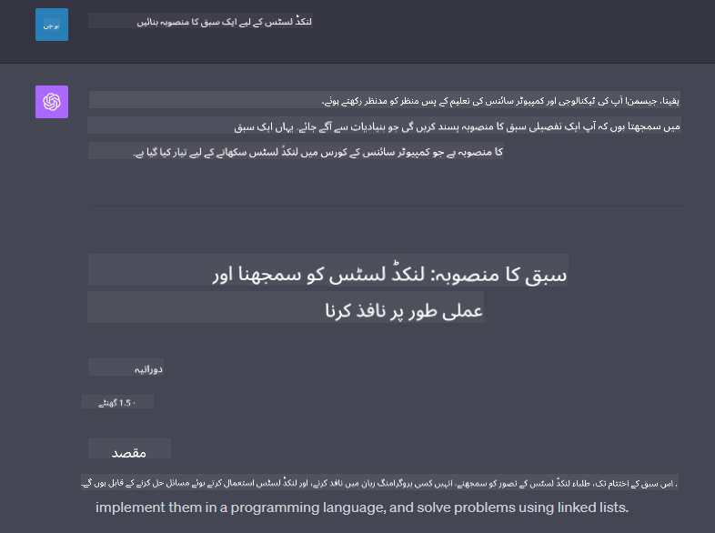

<!--
CO_OP_TRANSLATOR_METADATA:
{
  "original_hash": "a5308963a56cfbad2d73b0fa99fe84b3",
  "translation_date": "2025-10-17T23:18:50+00:00",
  "source_file": "07-building-chat-applications/README.md",
  "language_code": "ur"
}
-->
# جنریٹو اے آئی سے چلنے والی چیٹ ایپلیکیشنز بنانا

[](https://youtu.be/R9V0ZY1BEQo?si=IHuU-fS9YWT8s4sA)

> _(اوپر دی گئی تصویر پر کلک کریں تاکہ اس سبق کی ویڈیو دیکھ سکیں)_

اب جب کہ ہم نے دیکھا کہ ہم ٹیکسٹ جنریشن ایپس کیسے بنا سکتے ہیں، آئیے چیٹ ایپلیکیشنز پر نظر ڈالتے ہیں۔

چیٹ ایپلیکیشنز ہماری روزمرہ زندگی کا حصہ بن چکی ہیں، جو صرف غیر رسمی گفتگو کے ذرائع سے زیادہ پیش کرتی ہیں۔ یہ کسٹمر سروس، تکنیکی مدد، اور حتیٰ کہ پیچیدہ مشاورتی نظاموں کا لازمی حصہ بن چکی ہیں۔ ممکن ہے کہ آپ کو حال ہی میں کسی چیٹ ایپلیکیشن سے مدد ملی ہو۔ جیسے جیسے ہم ان پلیٹ فارمز میں جنریٹو اے آئی جیسی جدید ٹیکنالوجیز کو شامل کرتے ہیں، پیچیدگی بڑھتی ہے اور چیلنجز بھی۔

کچھ سوالات جن کے جوابات ہمیں تلاش کرنے ہیں:

- **ایپ بنانا**۔ ہم ان اے آئی سے چلنے والی ایپلیکیشنز کو مخصوص استعمال کے لیے مؤثر طریقے سے کیسے بنا سکتے ہیں اور بغیر کسی رکاوٹ کے کیسے شامل کر سکتے ہیں؟
- **مانیٹرنگ**۔ ایک بار تعینات ہونے کے بعد، ہم کیسے مانیٹر کر سکتے ہیں اور اس بات کو یقینی بنا سکتے ہیں کہ ایپلیکیشنز اعلیٰ معیار پر کام کر رہی ہیں، چاہے وہ فعالیت کے لحاظ سے ہو یا [ذمہ دار اے آئی کے چھ اصولوں](https://www.microsoft.com/ai/responsible-ai?WT.mc_id=academic-105485-koreyst) کی پاسداری کے لحاظ سے؟

جیسے جیسے ہم ایک ایسے دور میں داخل ہو رہے ہیں جو آٹومیشن اور انسان-مشین کے بے رکاوٹ تعاملات سے متعین ہوتا ہے، یہ سمجھنا ضروری ہو جاتا ہے کہ جنریٹو اے آئی چیٹ ایپلیکیشنز کے دائرہ کار، گہرائی، اور موافقت کو کیسے تبدیل کرتا ہے۔ یہ سبق ان پیچیدہ نظاموں کی حمایت کرنے والے آرکیٹیکچر کے پہلوؤں کی تحقیق کرے گا، انہیں ڈومین مخصوص کاموں کے لیے بہتر بنانے کے طریقوں پر غور کرے گا، اور ذمہ دار اے آئی تعیناتی کو یقینی بنانے کے لیے متعلقہ میٹرکس اور غور و فکر کا جائزہ لے گا۔

## تعارف

یہ سبق شامل کرتا ہے:

- چیٹ ایپلیکیشنز کو مؤثر طریقے سے بنانے اور شامل کرنے کی تکنیک۔
- ایپلیکیشنز پر حسب ضرورت اور بہتر بنانے کا اطلاق کیسے کریں۔
- چیٹ ایپلیکیشنز کو مؤثر طریقے سے مانیٹر کرنے کی حکمت عملی اور غور و فکر۔

## سیکھنے کے مقاصد

اس سبق کے اختتام تک، آپ قابل ہوں گے:

- موجودہ نظاموں میں چیٹ ایپلیکیشنز کو بنانے اور شامل کرنے کے لیے غور و فکر کو بیان کریں۔
- مخصوص استعمال کے لیے چیٹ ایپلیکیشنز کو حسب ضرورت بنائیں۔
- کلیدی میٹرکس اور غور و فکر کی شناخت کریں تاکہ اے آئی سے چلنے والی چیٹ ایپلیکیشنز کے معیار کو مؤثر طریقے سے مانیٹر اور برقرار رکھا جا سکے۔
- اس بات کو یقینی بنائیں کہ چیٹ ایپلیکیشنز اے آئی کو ذمہ داری سے استعمال کریں۔

## جنریٹو اے آئی کو چیٹ ایپلیکیشنز میں شامل کرنا

جنریٹو اے آئی کے ذریعے چیٹ ایپلیکیشنز کو بہتر بنانا صرف انہیں زیادہ ذہین بنانے پر مرکوز نہیں ہے؛ بلکہ یہ ان کے آرکیٹیکچر، کارکردگی، اور یوزر انٹرفیس کو بہتر بنانے کے بارے میں ہے تاکہ ایک معیاری یوزر تجربہ فراہم کیا جا سکے۔ اس میں آرکیٹیکچرل بنیادوں، API انٹیگریشنز، اور یوزر انٹرفیس کے غور و فکر کی تحقیق شامل ہے۔ یہ سیکشن آپ کو ان پیچیدہ مناظر کو نیویگیٹ کرنے کے لیے ایک جامع روڈ میپ پیش کرنے کا مقصد رکھتا ہے، چاہے آپ انہیں موجودہ نظاموں میں شامل کر رہے ہوں یا انہیں اسٹینڈ الون پلیٹ فارمز کے طور پر بنا رہے ہوں۔

اس سیکشن کے اختتام تک، آپ چیٹ ایپلیکیشنز کو مؤثر طریقے سے بنانے اور شامل کرنے کے لیے مہارت حاصل کر لیں گے۔

### چیٹ بوٹ یا چیٹ ایپلیکیشن؟

چیٹ ایپلیکیشنز بنانے سے پہلے، آئیے 'چیٹ بوٹس' اور 'اے آئی سے چلنے والی چیٹ ایپلیکیشنز' کا موازنہ کریں، جو مختلف کردار اور فعالیت فراہم کرتی ہیں۔ چیٹ بوٹ کا بنیادی مقصد مخصوص گفتگو کے کاموں کو خودکار بنانا ہے، جیسے اکثر پوچھے جانے والے سوالات کے جوابات دینا یا پیکج کو ٹریک کرنا۔ یہ عام طور پر اصول پر مبنی منطق یا پیچیدہ اے آئی الگورتھم کے ذریعے چلایا جاتا ہے۔ اس کے برعکس، اے آئی سے چلنے والی چیٹ ایپلیکیشن ایک بہت زیادہ وسیع ماحول ہے جو انسانی صارفین کے درمیان مختلف قسم کی ڈیجیٹل مواصلات کی سہولت فراہم کرنے کے لیے ڈیزائن کی گئی ہے، جیسے ٹیکسٹ، وائس، اور ویڈیو چیٹس۔ اس کی وضاحتی خصوصیت ایک جنریٹو اے آئی ماڈل کا انضمام ہے جو باریک، انسانی جیسی گفتگو کی نقل کرتا ہے، مختلف قسم کے ان پٹ اور سیاق و سباق کے اشارے کی بنیاد پر جوابات پیدا کرتا ہے۔ ایک جنریٹو اے آئی سے چلنے والی چیٹ ایپلیکیشن کھلی ڈومین گفتگو میں مشغول ہو سکتی ہے، بدلتے ہوئے گفتگو کے سیاق و سباق کے مطابق ڈھل سکتی ہے، اور یہاں تک کہ تخلیقی یا پیچیدہ مکالمہ بھی پیدا کر سکتی ہے۔

ذیل میں دی گئی جدول کلیدی فرق اور مماثلتوں کو واضح کرتی ہے تاکہ ہمیں ڈیجیٹل مواصلات میں ان کے منفرد کردار کو سمجھنے میں مدد ملے۔

| چیٹ بوٹ                              | جنریٹو اے آئی سے چلنے والی چیٹ ایپلیکیشن |
| ------------------------------------- | ----------------------------------------- |
| کام پر مرکوز اور اصول پر مبنی         | سیاق و سباق سے آگاہ                      |
| اکثر بڑے نظاموں میں شامل              | ایک یا ایک سے زیادہ چیٹ بوٹس کی میزبانی کر سکتا ہے |
| پروگرام شدہ افعال تک محدود            | جنریٹو اے آئی ماڈلز کو شامل کرتا ہے       |
| مخصوص اور ساختہ تعاملات              | کھلی ڈومین گفتگو کرنے کے قابل            |

### SDKs اور APIs کے ساتھ پہلے سے تیار شدہ فعالیت کا فائدہ اٹھانا

جب چیٹ ایپلیکیشن بنائی جا رہی ہو، تو پہلا قدم یہ جانچنا ہے کہ پہلے سے کیا موجود ہے۔ SDKs اور APIs کا استعمال چیٹ ایپلیکیشنز بنانے کے لیے ایک فائدہ مند حکمت عملی ہے، کئی وجوہات کی بنا پر۔ اچھی طرح سے دستاویزی SDKs اور APIs کو شامل کر کے، آپ اپنی ایپلیکیشن کو طویل مدتی کامیابی کے لیے اسٹریٹجک طور پر پوزیشن دے رہے ہیں، اسکیل ایبلٹی اور دیکھ بھال کے خدشات کو حل کر رہے ہیں۔

- **ترقی کے عمل کو تیز کرتا ہے اور اوور ہیڈ کو کم کرتا ہے**: پہلے سے تیار شدہ فعالیت پر انحصار کرنا بجائے اس کے کہ آپ خود مہنگے عمل سے گزر کر انہیں بنائیں، آپ کو اپنی ایپلیکیشن کے دوسرے پہلوؤں پر توجہ مرکوز کرنے کی اجازت دیتا ہے جو آپ کے لیے زیادہ اہم ہو سکتے ہیں، جیسے کاروباری منطق۔
- **بہتر کارکردگی**: جب آپ فعالیت کو شروع سے بنا رہے ہوں، تو آپ آخرکار خود سے پوچھیں گے "یہ کیسے اسکیل کرے گا؟ کیا یہ ایپلیکیشن صارفین کے اچانک اضافے کو سنبھالنے کے قابل ہے؟" اچھی طرح سے برقرار رکھے گئے SDK اور APIs اکثر ان خدشات کے لیے بلٹ ان حل رکھتے ہیں۔
- **آسان دیکھ بھال**: اپ ڈیٹس اور بہتری کو سنبھالنا آسان ہوتا ہے کیونکہ زیادہ تر APIs اور SDKs کو صرف لائبریری کو اپ ڈیٹ کرنے کی ضرورت ہوتی ہے جب کوئی نیا ورژن جاری ہوتا ہے۔
- **جدید ترین ٹیکنالوجی تک رسائی**: ایسے ماڈلز کا فائدہ اٹھانا جو وسیع ڈیٹا سیٹس پر تربیت یافتہ اور بہتر کیے گئے ہیں، آپ کی ایپلیکیشن کو قدرتی زبان کی صلاحیتیں فراہم کرتا ہے۔

SDK یا API کی فعالیت تک رسائی عام طور پر فراہم کردہ خدمات کے استعمال کی اجازت حاصل کرنے میں شامل ہوتی ہے، جو اکثر ایک منفرد کلید یا توثیق ٹوکن کے استعمال کے ذریعے ہوتی ہے۔ ہم OpenAI Python Library کا استعمال کریں گے تاکہ یہ دیکھ سکیں کہ یہ کیسا لگتا ہے۔ آپ اس سبق کے لیے [OpenAI کے نوٹ بک](./python/oai-assignment.ipynb?WT.mc_id=academic-105485-koreyst) یا [Azure OpenAI Services کے نوٹ بک](./python/aoai-assignment.ipynb?WT.mc_id=academic-105485-koreys) میں خود بھی آزما سکتے ہیں۔

```python
import os
from openai import OpenAI

API_KEY = os.getenv("OPENAI_API_KEY","")

client = OpenAI(
    api_key=API_KEY
    )

chat_completion = client.chat.completions.create(model="gpt-3.5-turbo", messages=[{"role": "user", "content": "Suggest two titles for an instructional lesson on chat applications for generative AI."}])
```

اوپر دی گئی مثال GPT-3.5 Turbo ماڈل کا استعمال کرتی ہے تاکہ پرامپٹ کو مکمل کیا جا سکے، لیکن نوٹ کریں کہ API کلید کو ایسا کرنے سے پہلے سیٹ کیا گیا ہے۔ اگر آپ کلید سیٹ نہ کریں تو آپ کو ایک ایرر ملے گا۔

## یوزر تجربہ (UX)

چیٹ ایپلیکیشنز پر عمومی UX اصول لاگو ہوتے ہیں، لیکن یہاں کچھ اضافی غور و فکر ہیں جو مشین لرننگ کے اجزاء کی وجہ سے خاص طور پر اہم ہو جاتے ہیں۔

- **ابہام کو حل کرنے کا طریقہ کار**: جنریٹو اے آئی ماڈلز کبھی کبھار مبہم جوابات پیدا کرتے ہیں۔ ایک فیچر جو صارفین کو وضاحت طلب کرنے کی اجازت دیتا ہے، اس مسئلے کا سامنا کرنے پر مددگار ثابت ہو سکتا ہے۔
- **سیاق و سباق برقرار رکھنا**: جدید جنریٹو اے آئی ماڈلز گفتگو کے سیاق و سباق کو یاد رکھنے کی صلاحیت رکھتے ہیں، جو یوزر تجربے کے لیے ایک ضروری اثاثہ ہو سکتا ہے۔ صارفین کو سیاق و سباق کو کنٹرول اور منظم کرنے کی صلاحیت دینا یوزر تجربے کو بہتر بناتا ہے، لیکن حساس صارف معلومات کو برقرار رکھنے کا خطرہ پیدا کرتا ہے۔ اس معلومات کو کتنی دیر تک ذخیرہ کیا جائے، جیسے کہ ایک برقرار رکھنے کی پالیسی متعارف کرانا، سیاق و سباق کی ضرورت اور پرائیویسی کے درمیان توازن قائم کر سکتا ہے۔
- **ذاتی نوعیت**: سیکھنے اور ڈھلنے کی صلاحیت کے ساتھ، اے آئی ماڈلز صارف کے لیے ایک انفرادی تجربہ پیش کرتے ہیں۔ یوزر پروفائلز جیسے فیچرز کے ذریعے یوزر تجربے کو ذاتی بنانا نہ صرف صارف کو سمجھا ہوا محسوس کراتا ہے، بلکہ یہ انہیں مخصوص جوابات تلاش کرنے میں مدد دیتا ہے، ایک زیادہ مؤثر اور اطمینان بخش تعامل پیدا کرتا ہے۔

ذاتی نوعیت کی ایک مثال OpenAI کے ChatGPT میں "Custom instructions" سیٹنگز ہے۔ یہ آپ کو اپنے بارے میں معلومات فراہم کرنے کی اجازت دیتا ہے جو آپ کے پرامپٹس کے لیے اہم سیاق و سباق ہو سکتی ہے۔ یہاں ایک مثال ہے:


یہ "پروفائل" ChatGPT کو لنکڈ لسٹس پر ایک سبق منصوبہ بنانے کے لیے پرامپٹ کرتا ہے۔ نوٹ کریں کہ ChatGPT اس بات کو مدنظر رکھتا ہے کہ صارف اپنی تجربے کی بنیاد پر ایک زیادہ تفصیلی سبق منصوبہ چاہتا ہے۔



### مائیکروسافٹ کا سسٹم میسج فریم ورک برائے بڑے زبان ماڈلز

[مائیکروسافٹ نے رہنمائی فراہم کی ہے](https://learn.microsoft.com/azure/ai-services/openai/concepts/system-message#define-the-models-output-format?WT.mc_id=academic-105485-koreyst) کہ LLMs سے جوابات پیدا کرتے وقت مؤثر سسٹم میسجز لکھنے کے لیے، جو 4 شعبوں میں تقسیم ہے:

1. ماڈل کس کے لیے ہے، اس کی صلاحیتوں اور حدود کی وضاحت۔
2. ماڈل کے آؤٹ پٹ فارمیٹ کی وضاحت۔
3. مخصوص مثالیں فراہم کرنا جو ماڈل کے مطلوبہ رویے کو ظاہر کرتی ہیں۔
4. اضافی رویے کے حفاظتی اصول فراہم کرنا۔

### رسائی

چاہے صارف کو بصری، سماعتی، موٹر، یا علمی معذوری ہو، ایک اچھی طرح سے ڈیزائن کی گئی چیٹ ایپلیکیشن سب کے لیے قابل استعمال ہونی چاہیے۔ درج ذیل فہرست مختلف صارف معذوریوں کے لیے رسائی کو بڑھانے کے لیے مخصوص خصوصیات کو توڑتی ہے۔

- **بصری معذوری کے لیے خصوصیات**: ہائی کنٹراسٹ تھیمز اور قابل سائز ٹیکسٹ، اسکرین ریڈر مطابقت۔
- **سماعتی معذوری کے لیے خصوصیات**: ٹیکسٹ ٹو اسپیچ اور اسپیچ ٹو ٹیکسٹ فنکشنز، آڈیو نوٹیفکیشنز کے لیے بصری اشارے۔
- **موٹر معذوری کے لیے خصوصیات**: کی بورڈ نیویگیشن سپورٹ، وائس کمانڈز۔
- **علمی معذوری کے لیے خصوصیات**: آسان زبان کے اختیارات۔

## ڈومین مخصوص زبان ماڈلز کے لیے حسب ضرورت اور بہتر بنانا

ایک چیٹ ایپلیکیشن کا تصور کریں جو آپ کی کمپنی کی اصطلاحات کو سمجھتی ہو اور ان مخصوص سوالات کی پیش گوئی کرتی ہو جو اس کے صارفین عام طور پر کرتے ہیں۔ یہاں دو طریقے قابل ذکر ہیں:

- **DSL ماڈلز کا فائدہ اٹھانا**۔ DSL کا مطلب ہے ڈومین مخصوص زبان۔ آپ ایک نام نہاد DSL ماڈل کا فائدہ اٹھا سکتے ہیں جو کسی مخصوص ڈومین پر تربیت یافتہ ہے تاکہ اس کے تصورات اور منظرناموں کو سمجھ سکے۔
- **بہتر بنانا**۔ بہتر بنانا ایک مخصوص ڈیٹا کے ساتھ اپنے ماڈل کو مزید تربیت دینے کا عمل ہے۔

## حسب ضرورت: DSL کا استعمال

ڈومین مخصوص زبان ماڈلز (DSL ماڈلز) کا فائدہ اٹھانا صارف کی مشغولیت کو بڑھا سکتا ہے اور خصوصی، سیاق و سباق سے متعلق تعاملات فراہم کر سکتا ہے۔ یہ ایک ماڈل ہے جو کسی مخصوص میدان، صنعت، یا موضوع سے متعلق متن کو سمجھنے اور پیدا کرنے کے لیے تربیت یافتہ یا بہتر بنایا گیا ہے۔ DSL ماڈل استعمال کرنے کے اختیارات میں ایک کو شروع سے تربیت دینا، یا SDKs اور APIs کے ذریعے پہلے سے موجود ماڈلز کا استعمال شامل ہو سکتا ہے۔ ایک اور آپشن بہتر بنانا ہے، جو ایک موجودہ پہلے سے تربیت یافتہ ماڈل کو لے کر اسے کسی مخصوص ڈومین کے لیے ڈھالنے کا عمل ہے۔

## حسب ضرورت: بہتر بنانا

بہتر بنانا اکثر اس وقت سمجھا جاتا ہے جب ایک پہلے سے تربیت یافتہ ماڈل کسی مخصوص ڈومین یا مخصوص کام میں کمی کرتا ہے۔

مثال کے طور پر، طبی سوالات پیچیدہ ہوتے ہیں اور بہت زیادہ سیاق و سباق کی ضرورت ہوتی ہے۔ جب ایک طبی پیشہ ور کسی مریض کی تشخیص کرتا ہے تو یہ مختلف عوامل پر مبنی ہوتا ہے جیسے طرز زندگی یا پہلے سے موجود حالات، اور یہاں تک کہ حالیہ طبی جرائد پر بھی ان کے تشخیص کی توثیق کے لیے انحصار کر سکتا ہے۔ ایسے باریک منظرناموں میں، ایک عام مقصد کے اے آئی چیٹ ایپلیکیشن قابل اعتماد ذریعہ نہیں ہو سکتی۔

### منظرنامہ: ایک طبی ایپلیکیشن

ایک چیٹ ایپلیکیشن پر غور کریں جو طبی ماہرین کو علاج کے رہنما اصولوں، دوائیوں کے تعاملات، یا حالیہ تحقیقاتی نتائج کے بارے میں فوری حوالہ فراہم کرنے میں مدد کرتی ہے۔

ایک عام مقصد کا ماڈل بنیادی طبی سوالات کے جوابات دینے یا عمومی مشورہ فراہم کرنے کے لیے کافی ہو سکتا ہے، لیکن یہ درج ذیل میں جدوجہد کر سکتا ہے:

- **انتہائی مخصوص یا پیچیدہ کیسز**۔ مثال کے طور پر، ایک نیورولوجسٹ ایپلیکیشن سے پوچھ سکتا ہے، "بچوں کے مریضوں میں ڈرگ ریزسٹنٹ ایپیلپسی کے انتظام کے موجودہ بہترین طریقے کیا ہیں؟"
- **حالیہ پیش رفت کی کمی**۔ ایک عام مقصد کا ماڈل نیورولوجی اور فارماکولوجی میں حالیہ پیش رفت کو شامل کرتے ہوئے موجودہ جواب فراہم کرنے میں جدوجہد کر سکتا ہے۔

ایسے معاملات میں، ایک مخصوص طبی ڈیٹا سیٹ کے ساتھ ماڈل کو بہتر بنانا ان پیچیدہ طبی سوالات کو زیادہ درست اور قابل اعتماد طریقے سے سنبھالنے کی صلاحیت کو نمایاں طور پر بہتر بنا سکتا ہے۔ اس کے لیے ایک بڑے اور متعلقہ ڈیٹا سیٹ تک رسائی کی ضرورت ہوتی ہے جو ان ڈومین مخصوص چیلنجز اور سوالات کی نمائندگی کرتا ہے جنہیں حل کرنے کی ضرورت ہے۔

## اعلیٰ معیار کے اے آئی سے چلنے والے چیٹ تجربے کے لیے غور و فکر

یہ سیکشن "اعلیٰ معیار" چیٹ ایپلیکیشنز کے معیار کو بیان کرتا ہے، جس میں قابل عمل میٹرکس کی گرفت اور ایک فریم ورک کی پاسداری شامل ہے جو اے آئی ٹیکنالوجی کو ذمہ داری سے فائدہ اٹھاتا ہے۔

### کلیدی میٹرکس

ایپلیکیشن کی اعلیٰ معیار کی کارکردگی کو برقرار رکھنے کے لیے، کلیدی میٹرکس اور غور و فکر کو ٹریک کرنا ضروری ہے۔ یہ پیمائشیں نہ صرف ایپلیکیشن کی فعالیت کو یقینی بناتی ہیں بلکہ اے آئی ماڈل اور یوزر تجربے کے
| **غیر معمولی صورتحال کی شناخت** | غیر معمولی نمونوں کی شناخت کے لیے اوزار اور تکنیک جو متوقع رویے سے مطابقت نہیں رکھتے۔ | آپ غیر معمولی صورتحال پر کیسے ردعمل دیں گے؟ |

### چیٹ ایپلیکیشنز میں ذمہ دار AI کے اصولوں کا نفاذ

مائیکروسافٹ کے ذمہ دار AI کے اصولوں نے چھ اصولوں کی نشاندہی کی ہے جو AI کی ترقی اور استعمال کی رہنمائی کرنی چاہیے۔ نیچے دیے گئے اصول، ان کی تعریف، اور چیٹ ڈیولپر کے لیے غور کرنے کی باتیں اور ان اصولوں کو سنجیدگی سے لینے کی وجوہات درج ہیں۔

| اصول                  | مائیکروسافٹ کی تعریف                                    | چیٹ ڈیولپر کے لیے غور کرنے کی باتیں                                      | یہ کیوں اہم ہے                                                                          |
| --------------------- | ----------------------------------------------------- | ---------------------------------------------------------------------- | -------------------------------------------------------------------------------------- |
| انصاف                | AI سسٹمز کو تمام لوگوں کے ساتھ منصفانہ سلوک کرنا چاہیے۔ | یقینی بنائیں کہ چیٹ ایپلیکیشن صارف کے ڈیٹا کی بنیاد پر امتیاز نہ کرے۔ | صارفین کے درمیان اعتماد اور شمولیت پیدا کرنے کے لیے؛ قانونی پیچیدگیوں سے بچنے کے لیے۔ |
| قابل اعتماد اور محفوظ | AI سسٹمز کو قابل اعتماد اور محفوظ طریقے سے کام کرنا چاہیے۔ | غلطیوں اور خطرات کو کم کرنے کے لیے ٹیسٹنگ اور حفاظتی اقدامات نافذ کریں۔ | صارفین کی تسلی کو یقینی بناتا ہے اور ممکنہ نقصان سے بچاتا ہے۔                      |
| پرائیویسی اور سیکیورٹی | AI سسٹمز کو محفوظ ہونا چاہیے اور پرائیویسی کا احترام کرنا چاہیے۔ | مضبوط انکرپشن اور ڈیٹا تحفظ کے اقدامات نافذ کریں۔                     | حساس صارف ڈیٹا کی حفاظت کے لیے اور پرائیویسی قوانین کی تعمیل کے لیے۔                  |
| شمولیت               | AI سسٹمز کو سب کو طاقتور بنانا چاہیے اور لوگوں کو شامل کرنا چاہیے۔ | UI/UX کو اس طرح ڈیزائن کریں کہ یہ مختلف سامعین کے لیے قابل رسائی اور آسان ہو۔ | یقینی بناتا ہے کہ زیادہ سے زیادہ لوگ ایپلیکیشن کو مؤثر طریقے سے استعمال کر سکیں۔    |
| شفافیت               | AI سسٹمز کو سمجھنے کے قابل ہونا چاہیے۔                  | AI کے جوابات کے لیے واضح دستاویزات اور وجوہات فراہم کریں۔             | صارفین زیادہ امکان رکھتے ہیں کہ وہ اس سسٹم پر اعتماد کریں اگر وہ فیصلوں کو سمجھ سکیں۔ |
| جوابدہی              | لوگوں کو AI سسٹمز کے لیے جوابدہ ہونا چاہیے۔            | AI کے فیصلوں کا جائزہ لینے اور بہتر بنانے کے لیے واضح عمل قائم کریں۔ | غلطیوں کی صورت میں جاری بہتری اور اصلاحی اقدامات کو ممکن بناتا ہے۔                 |

## اسائنمنٹ

[اسائنمنٹ](../../../07-building-chat-applications/python) دیکھیں۔ یہ آپ کو مختلف مشقوں کے ذریعے لے جائے گا، جیسے کہ اپنی پہلی چیٹ پرامپٹس چلانا، متن کو درجہ بندی اور خلاصہ کرنا، اور مزید۔ نوٹ کریں کہ اسائنمنٹس مختلف پروگرامنگ زبانوں میں دستیاب ہیں!

## شاندار کام! سفر جاری رکھیں

اس سبق کو مکمل کرنے کے بعد، ہمارے [Generative AI Learning collection](https://aka.ms/genai-collection?WT.mc_id=academic-105485-koreyst) کو دیکھیں تاکہ اپنی Generative AI کی معلومات کو مزید بہتر کریں!

سبق 8 پر جائیں تاکہ دیکھ سکیں کہ آپ [سرچ ایپلیکیشنز بنانا](../08-building-search-applications/README.md?WT.mc_id=academic-105485-koreyst) کیسے شروع کر سکتے ہیں!

---

**ڈسکلیمر**:  
یہ دستاویز AI ترجمہ سروس [Co-op Translator](https://github.com/Azure/co-op-translator) کا استعمال کرتے ہوئے ترجمہ کی گئی ہے۔ ہم درستگی کے لیے کوشش کرتے ہیں، لیکن براہ کرم آگاہ رہیں کہ خودکار ترجمے میں غلطیاں یا غیر درستیاں ہو سکتی ہیں۔ اصل دستاویز کو اس کی اصل زبان میں مستند ذریعہ سمجھا جانا چاہیے۔ اہم معلومات کے لیے، پیشہ ور انسانی ترجمہ کی سفارش کی جاتی ہے۔ اس ترجمے کے استعمال سے پیدا ہونے والی کسی بھی غلط فہمی یا غلط تشریح کے لیے ہم ذمہ دار نہیں ہیں۔