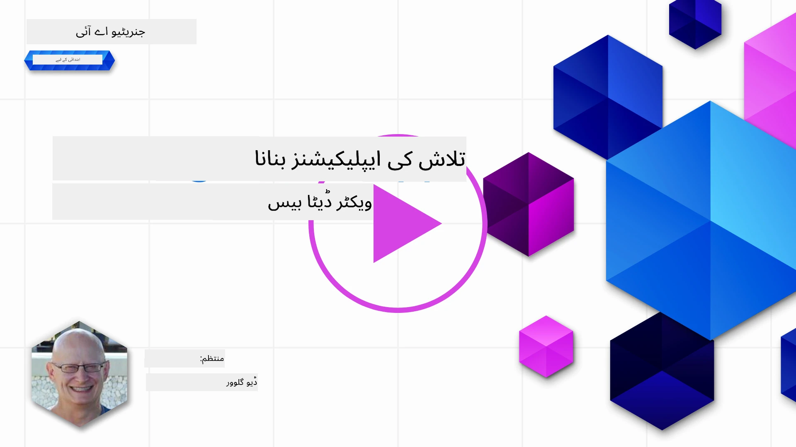
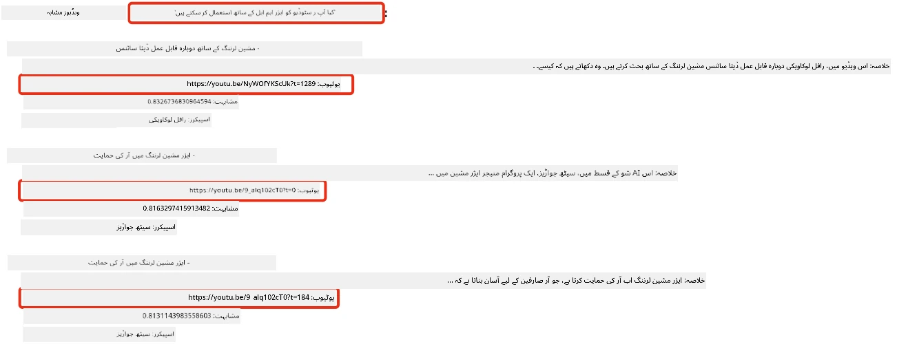
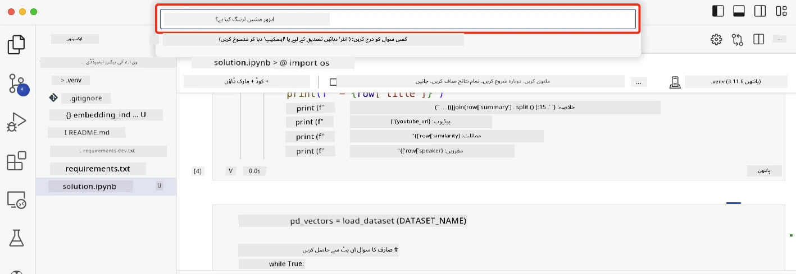

# سرچ ایپلیکیشنز بنانا  

[](https://youtu.be/W0-nzXjOjr0?si=GcsqiTTvd7RKbo7V)  

> > _اس سبق کی ویڈیو دیکھنے کے لیے اوپر تصویر پر کلک کریں_  

LLMs صرف چیٹ بوٹس اور متن کی تخلیق تک محدود نہیں ہیں۔ ایمبیڈنگز کا استعمال کرتے ہوئے سرچ ایپلیکیشنز بنانا بھی ممکن ہے۔ ایمبیڈنگز ڈیٹا کی عددی نمائندگیاں ہیں جنہیں ویکٹرز بھی کہا جاتا ہے، اور یہ ڈیٹا کے لیے سمانٹک سرچ کے لیے استعمال کی جا سکتی ہیں۔  

اس سبق میں، آپ ہمارے تعلیمی اسٹارٹ اپ کے لیے سرچ ایپلیکیشن بنانے جا رہے ہیں۔ ہمارا اسٹارٹ اپ ایک غیر منافع بخش تنظیم ہے جو ترقی پذیر ممالک کے طلباء کو مفت تعلیم فراہم کرتی ہے۔ ہمارے اسٹارٹ اپ کے پاس بہت سے YouTube ویڈیوز ہیں جو طلباء AI کے بارے میں سیکھنے کے لیے استعمال کر سکتے ہیں۔ ہمارا اسٹارٹ اپ ایک سرچ ایپلیکیشن بنانا چاہتا ہے جو طلباء کو سوال ٹائپ کر کے YouTube ویڈیو تلاش کرنے کی اجازت دے۔  

مثال کے طور پر، کوئی طالب علم 'Jupyter Notebooks کیا ہیں؟' یا 'Azure ML کیا ہے؟' ٹائپ کر سکتا ہے اور سرچ ایپلیکیشن ایسے YouTube ویڈیوز کی فہرست واپس کرے گی جو اس سوال سے متعلق ہوں، اور بہتر یہ کہ، سرچ ایپلیکیشن ویڈیو میں اس جگہ کا لنک بھی دے گی جہاں سوال کا جواب موجود ہے۔  

## تعارف  

اس سبق میں، ہم مندرجہ ذیل چیزیں سیکھیں گے:  

- سمانٹک اور کی ورڈ سرچ کے مابین فرق  
- ٹیکسٹ ایمبیڈنگز کیا ہیں  
- ٹیکسٹ ایمبیڈنگ انڈیکس بنانا  
- ٹیکسٹ ایمبیڈنگ انڈیکس میں سرچ کرنا  

## تعلیمی مقاصد  

اس سبق کو مکمل کرنے کے بعد، آپ قابل ہوں گے:  

- سمانٹک اور کی ورڈ سرچ میں فرق بتائیں  
- ٹیکسٹ ایمبیڈنگز کی وضاحت کریں  
- ایمبیڈنگز کا استعمال کرتے ہوئے ڈیٹا تلاش کرنے کے لیے ایپلیکیشن بنائیں  

## سرچ ایپلیکیشن کیوں بنائیں؟  

ایک سرچ ایپلیکیشن بنانے سے آپ سمجھ سکیں گے کہ ایمبیڈنگز کا استعمال کرتے ہوئے ڈیٹا کو کس طرح تلاش کیا جاتا ہے۔ آپ یہ بھی سیکھیں گے کہ ایک ایسی سرچ ایپلیکیشن کیسے بنائی جائے جو طلباء کو معلومات جلدی تلاش کرنے میں مدد دے۔  

اس سبق میں Microsoft [AI Show](https://www.youtube.com/playlist?list=PLlrxD0HtieHi0mwteKBOfEeOYf0LJU4O1) YouTube چینل کی ٹرانسکرپٹس کے لیے ایمبیڈنگ انڈیکس شامل ہے۔ AI Show ایک یوٹیوب چینل ہے جو آپ کو AI اور مشین لرننگ کے بارے میں سکھاتا ہے۔ ایمبیڈنگ انڈیکس میں اکتوبر 2023 تک ہر YouTube ٹرانسکرپٹ کے ایمبیڈنگ شامل ہیں۔ آپ ایمبیڈنگ انڈیکس کا استعمال ہمارے اسٹارٹ اپ کے لیے سرچ ایپلیکیشن بنانے کے لیے کریں گے۔ سرچ ایپلیکیشن ویڈیو میں اس جگہ کا لنک واپس کرتی ہے جہاں سوال کا جواب موجود ہو۔ یہ طلباء کے لیے معلومات جلدی تلاش کرنے کا بہترین طریقہ ہے۔  

ذیل میں سوال 'کیا آپ rstudio کو Azure ML کے ساتھ استعمال کر سکتے ہیں؟' کے لیے ایک سمانٹک سوال کی مثال دی گئی ہے۔ YouTube کا URL دیکھیں، آپ کو اس URL میں ایک ٹائم اسٹیمپ ملے گا جو آپ کو ویڈیو میں اس جگہ لے جائے گا جہاں سوال کا جواب موجود ہے۔  

  

## سمانٹک سرچ کیا ہے؟  

اب آپ سوچ رہے ہوں گے، سمانٹک سرچ کیا ہے؟ سمانٹک سرچ ایک سرچ تکنیک ہے جو سوال میں موجود الفاظ کے معنی یا مفہوم کو استعمال کرتی ہے تاکہ متعلقہ نتائج واپس کریں۔  

یہ سمانٹک سرچ کی ایک مثال ہے۔ فرض کریں کہ آپ ایک گاڑی خریدنا چاہتے ہیں، آپ 'میری خواب کی گاڑی' تلاش کر سکتے ہیں، سمانٹک سرچ سمجھتی ہے کہ آپ ایک گاڑی کا خواب نہیں دیکھ رہے، بلکہ آپ اپنی 'آئیڈیل' گاڑی خریدنا چاہتے ہیں۔ سمانٹک سرچ آپ کی نیت کو سمجھتی ہے اور متعلقہ نتائج واپس کرتی ہے۔ اس کا متبادل 'کی ورڈ سرچ' ہے جو حرفی طور پر گاڑیوں کے خواب تلاش کرے گا اور عموماً غیر متعلقہ نتائج دے گا۔  

## ٹیکسٹ ایمبیڈنگز کیا ہیں؟  

[ٹیکسٹ ایمبیڈنگز](https://en.wikipedia.org/wiki/Word_embedding?WT.mc_id=academic-105485-koreyst) ایک ٹیکسٹ کی نمائندہ تکنیک ہے جو [نیچرل لینگویج پروسیسنگ](https://en.wikipedia.org/wiki/Natural_language_processing?WT.mc_id=academic-105485-koreyst) میں استعمال ہوتی ہے۔ ٹیکسٹ ایمبیڈنگز متن کی سمانٹک عددی نمائندگیاں ہیں۔ ایمبیڈنگز ڈیٹا کی ایسی نمائندگی کرتے ہیں جو مشین کے لیے سمجھنا آسان ہو۔ ٹیکسٹ ایمبیڈنگز بنانے کے کئی ماڈلز موجود ہیں، اس سبق میں ہم خاص طور پر OpenAI ایمبیڈنگ ماڈل استعمال کر کے ایمبیڈنگز بنانے پر توجہ دیں گے۔  

یہاں ایک مثال ہے، فرض کریں یہ متن AI Show YouTube چینل کے ایک قسط کے ٹرانسکرپٹ میں ہے:  

```text
Today we are going to learn about Azure Machine Learning.
```
  
ہم متن کو OpenAI ایمبیڈنگ API کو بھیجیں گے اور یہ 1536 نمبروں پر مشتمل ایک ایمبیڈنگ واپس کرے گا جسے ویکٹر بھی کہتے ہیں۔ ویکٹر میں ہر نمبر متن کے ایک مختلف پہلو کی نمائندگی کرتا ہے۔ آسانی کے لیے، یہاں ویکٹر کے پہلے 10 نمبرز دیے گئے ہیں۔  

```python
[-0.006655829958617687, 0.0026128944009542465, 0.008792596869170666, -0.02446001023054123, -0.008540431968867779, 0.022071078419685364, -0.010703742504119873, 0.003311325330287218, -0.011632772162556648, -0.02187200076878071, ...]
```
  
## ایمبیڈنگ انڈیکس کیسے بنایا جاتا ہے؟  

اس سبق کے لیے ایمبیڈنگ انڈیکس Python اسکرپٹس کی ایک سیریز کے ذریعے بنایا گیا ہے۔ آپ اس سبق کے 'scripts' فولڈر میں [README](./scripts/README.md?WT.mc_id=academic-105485-koreyst) میں اسکرپٹس اور ہدایات کو پا سکیں گے۔ آپ کو یہ اسکرپٹس چلانے کی ضرورت نہیں کیونکہ ایمبیڈنگ انڈیکس آپ کے لیے فراہم کیا گیا ہے۔  

یہ اسکرپٹس درج ذیل کام انجام دیتے ہیں:  

1. [AI Show](https://www.youtube.com/playlist?list=PLlrxD0HtieHi0mwteKBOfEeOYf0LJU4O1) پلے لسٹ کے ہر YouTube ویڈیو کا ٹرانسکرپٹ ڈاؤن لوڈ کیا جاتا ہے۔  
2. [OpenAI Functions](https://learn.microsoft.com/azure/ai-foundry/openai/how-to/function-calling?WT.mc_id=academic-105485-koreyst) کا استعمال کرتے ہوئے، YouTube ٹرانسکرپٹ کے پہلے 3 منٹ سے اسپیکر کا نام حاصل کرنے کی کوشش کی جاتی ہے۔ ہر ویڈیو کے لیے اسپیکر کا نام ایمبیڈنگ انڈیکس `embedding_index_3m.json` میں محفوظ کیا جاتا ہے۔  
3. پھر ٹرانسکرپٹ کے متن کو **3 منٹ کے ٹیکسٹ حصوں** میں تقسیم کیا جاتا ہے۔ ہر حصے میں اگلے حصے سے تقریباً 20 الفاظ کا اوورلیپ شامل ہوتا ہے تاکہ حصے کی ایمبیڈنگ کٹی نہ جائے اور بہتر سرچ سیاق و سباق فراہم کیا جا سکے۔  
4. ہر ٹیکسٹ حصہ OpenAI چیٹ API کو دیا جاتا ہے تاکہ اسے 60 الفاظ تک سمری میں تبدیل کیا جا سکے۔ سمری بھی ایمبیڈنگ انڈیکس `embedding_index_3m.json` میں محفوظ کی جاتی ہے۔  
5. آخر میں، یہ حصہ OpenAI ایمبیڈنگ API کو دیا جاتا ہے۔ ایمبیڈنگ API 1536 نمبروں پر مشتمل ایک ویکٹر واپس کرتا ہے جو حصے کے معانی کی نمائندگی کرتا ہے۔ یہ حصہ اور OpenAI ایمبیڈنگ ویکٹر ایمبیڈنگ انڈیکس `embedding_index_3m.json` میں محفوظ کیے جاتے ہیں۔  

### ویکٹر ڈیٹا بیس  

سبق کی سہولت کے لیے ایمبیڈنگ انڈیکس ایک JSON فائل `embedding_index_3m.json` میں ذخیرہ کیا گیا ہے اور Pandas DataFrame میں لوڈ کیا گیا ہے۔ تاہم، عملی ماحول میں ایمبیڈنگ انڈیکس ایسے ویکٹر ڈیٹا بیس میں ذخیرہ کیا جائے گا جیسے کہ [Azure Cognitive Search](https://learn.microsoft.com/training/modules/improve-search-results-vector-search?WT.mc_id=academic-105485-koreyst)، [Redis](https://cookbook.openai.com/examples/vector_databases/redis/readme?WT.mc_id=academic-105485-koreyst)، [Pinecone](https://cookbook.openai.com/examples/vector_databases/pinecone/readme?WT.mc_id=academic-105485-koreyst)، [Weaviate](https://cookbook.openai.com/examples/vector_databases/weaviate/readme?WT.mc_id=academic-105485-koreyst) وغیرہ۔  

## کوسائن مماثلت کو سمجھنا  

ہم نے ٹیکسٹ ایمبیڈنگز کے بارے میں سیکھا، اگلا قدم یہ ہے کہ ٹیکسٹ ایمبیڈنگز کو ڈیٹا کی تلاش کے لیے اور خاص طور پر دیے گئے سوال کے سب سے مشابہ ایمبیڈنگ تلاش کرنے کے لیے کوسائن مماثلت استعمال کریں۔  

### کوسائن مماثلت کیا ہے؟  

کوسائن مماثلت دو ویکٹرز کے درمیان مماثلت کی پیمائش ہے، اسے `قریبی پڑوسی تلاش` کے طور پر بھی جانا جاتا ہے۔ کوسائن مماثلت تلاش کرنے کے لیے آپ کو OpenAI ایمبیڈنگ API کا استعمال کرتے ہوئے سوالی متن کے لیے ویکٹرائز کرنا ہوگا۔ پھر سوالی ویکٹر اور ایمبیڈنگ انڈیکس میں ہر ویکٹر کے درمیان _کوسائن مماثلت_ کا حساب لگائیں۔ یاد رکھیں، ایمبیڈنگ انڈیکس میں ہر YouTube ٹرانسکرپٹ کے ٹیکسٹ حصے کے لیے ایک ویکٹر ہوتا ہے۔ آخر میں نتائج کو کوسائن مماثلت کے حساب سے ترتیب دیں اور سب سے زیادہ کوسائن مماثلت والے ٹیکسٹ حصے سوال کے سب سے مشابہ ہوں گے۔  

ریاضیاتی نقطہ نظر سے، کوسائن مماثلت دو ویکٹرز کے درمیان زاویے کے کوسائن کی پیمائش کرتی ہے جو کثیر جہتی جگہ میں پروجیکٹ کیے گئے ہوتے ہیں۔ یہ پیمائش فائدہ مند ہے کیونکہ اگر دو دستاویزات Euclidean فاصلے کے لحاظ سے دور ہوں، تو بھی وہ ایک دوسرے کے درمیان چھوٹا زاویہ رکھ سکتی ہیں اور اس لیے کوسائن مماثلت زیادہ ہو سکتی ہے۔ کوسائن مماثلت کی مساوات کے بارے میں مزید معلومات کے لیے، [Cosine similarity](https://en.wikipedia.org/wiki/Cosine_similarity?WT.mc_id=academic-105485-koreyst) دیکھیں۔  

## اپنی پہلی سرچ ایپلیکیشن بنانا  

اب ہم سیکھیں گے کہ ایمبیڈنگز کا استعمال کرکے سرچ ایپلیکیشن کیسے بنائیں۔ یہ سرچ ایپلیکیشن طلباء کو ایک سوال ٹائپ کر کے ویڈیو تلاش کرنے کی اجازت دے گی۔ سرچ ایپلیکیشن ایسے ویڈیوز کی فہرست واپس کرے گی جو سوال سے متعلق ہوں۔ سرچ ایپلیکیشن ویڈیو میں اس جگہ کا لنک بھی دے گی جہاں سوال کا جواب موجود ہے۔  

یہ حل Windows 11، macOS، اور Ubuntu 22.04 پر Python 3.10 یا اس کے بعد کے ورژن کے ساتھ بنایا اور ٹیسٹ کیا گیا ہے۔ آپ Python کو [python.org](https://www.python.org/downloads/?WT.mc_id=academic-105485-koreyst) سے ڈاؤن لوڈ کر سکتے ہیں۔  

## اسائنمنٹ - طلباء کے لیے سرچ ایپلیکیشن بنانا  

ہم نے سبق کے شروع میں اپنا اسٹارٹ اپ متعارف کرایا تھا۔ اب وقت ہے کہ طلباء کو ان کے اسیسمنٹس کے لیے سرچ ایپلیکیشن بنانے کے قابل بنائیں۔  

اس اسائنمنٹ میں آپ Azure OpenAI سروسز بنائیں گے جنہیں سرچ ایپلیکیشن کی تعمیر کے لیے استعمال کیا جائے گا۔ آپ درج ذیل Azure OpenAI سروسز بنائیں گے۔ اس اسائنمنٹ کو مکمل کرنے کے لیے آپ کو Azure سبسکرپشن درکار ہوگی۔  

### Azure Cloud Shell شروع کریں  

1. [Azure پورٹل](https://portal.azure.com/?WT.mc_id=academic-105485-koreyst) میں سائن ان کریں۔  
2. Azure پورٹل کے اوپر دائیں کونے میں Cloud Shell آئیکن منتخب کریں۔  
3. ماحول کی قسم کے لیے **Bash** منتخب کریں۔  

#### ریسورس گروپ بنائیں  

> ان ہدایات کے لیے ہم "semantic-video-search" نامی ریسورس گروپ استعمال کر رہے ہیں جو East US میں ہے۔  
> آپ ریسورس گروپ کا نام بدل سکتے ہیں، لیکن اگر ریسورسز کی جگہ تبدیل کریں تو  
> [ماڈل دستیابی جدول](https://aka.ms/oai/models?WT.mc_id=academic-105485-koreyst) چیک کریں۔  

```shell
az group create --name semantic-video-search --location eastus
```
  
#### Azure OpenAI سروس ریسورس بنائیں  

Azure Cloud Shell سے، مندرجہ ذیل کمانڈ چلائیں تاکہ Azure OpenAI سروس ریسورس بنایا جا سکے۔  

```shell
az cognitiveservices account create --name semantic-video-openai --resource-group semantic-video-search \
    --location eastus --kind OpenAI --sku s0
```
  
#### اس ایپلیکیشن میں استعمال کے لیے اینڈپوائنٹ اور کیز حاصل کریں  

Azure Cloud Shell سے، مندرجہ ذیل کمانڈز چلائیں تاکہ Azure OpenAI سروس ریسورس کے اینڈپوائنٹ اور کیز حاصل کی جا سکیں۔  

```shell
az cognitiveservices account show --name semantic-video-openai \
   --resource-group  semantic-video-search | jq -r .properties.endpoint
az cognitiveservices account keys list --name semantic-video-openai \
   --resource-group semantic-video-search | jq -r .key1
```
  
#### OpenAI ایمبیڈنگ ماڈل تعینات کریں  

Azure Cloud Shell سے، مندرجہ ذیل کمانڈ چلائیں تاکہ OpenAI ایمبیڈنگ ماڈل کو ڈیپلائے کیا جا سکے۔  

```shell
az cognitiveservices account deployment create \
    --name semantic-video-openai \
    --resource-group  semantic-video-search \
    --deployment-name text-embedding-ada-002 \
    --model-name text-embedding-ada-002 \
    --model-version "2"  \
    --model-format OpenAI \
    --sku-capacity 100 --sku-name "Standard"
```
  
## حل  

GitHub Codespaces میں [solution notebook](./python/aoai-solution.ipynb?WT.mc_id=academic-105485-koreyst) کھولیں اور Jupyter Notebook کی ہدایات پر عمل کریں۔  

جب آپ نوٹ بک چلائیں گے، آپ سے سوال داخل کرنے کے لیے کہا جائے گا۔ ان پٹ باکس کچھ اس طرح نظر آئے گا:  

  

## زبردست کام! اپنی تعلیم جاری رکھیں  

اس سبق کو مکمل کرنے کے بعد، ہماری [Generative AI Learning collection](https://aka.ms/genai-collection?WT.mc_id=academic-105485-koreyst) دیکھیں تاکہ اپنی Generative AI کی معلومات کو مزید بڑھایا جا سکے!  

اب سبق 9 پر جائیں جہاں ہم دیکھیں گے کہ [تصویری تخلیقی ایپلیکیشنز کیسے بنائیں](../09-building-image-applications/README.md?WT.mc_id=academic-105485-koreyst)!  

---

<!-- CO-OP TRANSLATOR DISCLAIMER START -->
**ڈس کلیمر**:
یہ دستاویز AI ترجمہ سروس [Co-op Translator](https://github.com/Azure/co-op-translator) کے ذریعے ترجمہ کی گئی ہے۔ جبکہ ہم درستگی کے لیے کوشاں ہیں، براہ کرم اس بات سے آگاہ رہیں کہ خودکار ترجمے میں غلطیاں یا عدم درستیاں ہو سکتی ہیں۔ اصل دستاویز اپنے مادری زبان میں مستند ماخذ سمجھی جائے گی۔ حساس معلومات کے لیے پیشہ ور انسانی ترجمہ کی سفارش کی جاتی ہے۔ اس ترجمے کے استعمال سے پیدا ہونے والی کسی بھی غلط فہمی یا غلط تشریح کی ذمہ داری ہم قبول نہیں کرتے۔
<!-- CO-OP TRANSLATOR DISCLAIMER END -->