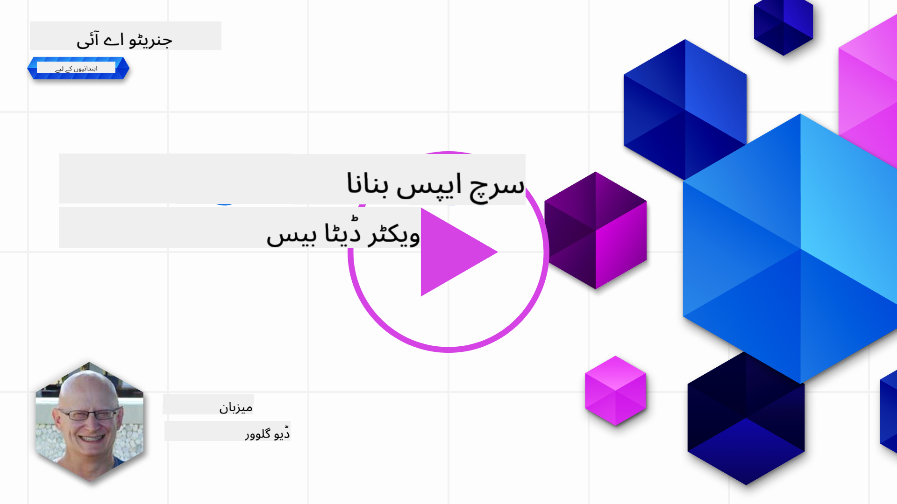

<!--
CO_OP_TRANSLATOR_METADATA:
{
  "original_hash": "d46aad0917a1a342d613e2c13d457da5",
  "translation_date": "2025-07-09T12:47:56+00:00",
  "source_file": "08-building-search-applications/README.md",
  "language_code": "ur"
}
-->
# سرچ ایپلیکیشنز بنانا

[](https://aka.ms/gen-ai-lesson8-gh?WT.mc_id=academic-105485-koreyst)

> > _اس سبق کی ویڈیو دیکھنے کے لیے اوپر تصویر پر کلک کریں_

LLMs صرف چیٹ بوٹس اور ٹیکسٹ جنریشن تک محدود نہیں ہیں۔ ایمبیڈنگز کا استعمال کرتے ہوئے سرچ ایپلیکیشنز بنانا بھی ممکن ہے۔ ایمبیڈنگز ڈیٹا کی عددی نمائندگیاں ہوتی ہیں جنہیں ویکٹرز بھی کہا جاتا ہے، اور یہ ڈیٹا کے لیے معنوی تلاش (semantic search) میں استعمال کی جا سکتی ہیں۔

اس سبق میں، آپ ہماری تعلیمی اسٹارٹ اپ کے لیے ایک سرچ ایپلیکیشن بنائیں گے۔ ہماری اسٹارٹ اپ ایک غیر منافع بخش ادارہ ہے جو ترقی پذیر ممالک کے طلباء کو مفت تعلیم فراہم کرتا ہے۔ ہمارے پاس YouTube پر بہت سے ویڈیوز ہیں جن سے طلباء AI کے بارے میں سیکھ سکتے ہیں۔ ہماری اسٹارٹ اپ چاہتی ہے کہ ایک ایسی سرچ ایپلیکیشن بنائی جائے جو طلباء کو سوال ٹائپ کر کے YouTube ویڈیو تلاش کرنے کی سہولت دے۔

مثال کے طور پر، کوئی طالب علم 'What are Jupyter Notebooks?' یا 'What is Azure ML' ٹائپ کر سکتا ہے اور سرچ ایپلیکیشن ایسے YouTube ویڈیوز کی فہرست دے گی جو سوال سے متعلق ہوں، اور اس سے بھی بہتر، سرچ ایپلیکیشن ویڈیو میں اس جگہ کا لنک دے گی جہاں سوال کا جواب موجود ہو۔

## تعارف

اس سبق میں ہم مندرجہ ذیل موضوعات پر بات کریں گے:

- معنوی تلاش بمقابلہ کی ورڈ تلاش۔
- ٹیکسٹ ایمبیڈنگز کیا ہیں۔
- ٹیکسٹ ایمبیڈنگز انڈیکس بنانا۔
- ٹیکسٹ ایمبیڈنگز انڈیکس میں تلاش کرنا۔

## سیکھنے کے مقاصد

اس سبق کو مکمل کرنے کے بعد، آپ کر سکیں گے:

- معنوی اور کی ورڈ تلاش میں فرق بتانا۔
- وضاحت کرنا کہ ٹیکسٹ ایمبیڈنگز کیا ہیں۔
- ایمبیڈنگز کا استعمال کرتے ہوئے ڈیٹا تلاش کرنے والی ایپلیکیشن بنانا۔

## سرچ ایپلیکیشن کیوں بنائیں؟

سرچ ایپلیکیشن بنانے سے آپ کو یہ سمجھنے میں مدد ملے گی کہ ایمبیڈنگز کو ڈیٹا تلاش کے لیے کیسے استعمال کیا جاتا ہے۔ آپ یہ بھی سیکھیں گے کہ ایسی سرچ ایپلیکیشن کیسے بنائی جائے جو طلباء کو معلومات جلدی تلاش کرنے میں مدد دے۔

سبق میں Microsoft [AI Show](https://www.youtube.com/playlist?list=PLlrxD0HtieHi0mwteKBOfEeOYf0LJU4O1) یوٹیوب چینل کے ٹرانسکرپٹس کا ایمبیڈنگ انڈیکس شامل ہے۔ AI Show ایک یوٹیوب چینل ہے جو آپ کو AI اور مشین لرننگ سکھاتا ہے۔ ایمبیڈنگ انڈیکس میں اکتوبر 2023 تک کے یوٹیوب ٹرانسکرپٹس کے ایمبیڈنگز شامل ہیں۔ آپ اس انڈیکس کو استعمال کرتے ہوئے ہماری اسٹارٹ اپ کے لیے سرچ ایپلیکیشن بنائیں گے۔ سرچ ایپلیکیشن ویڈیو میں اس جگہ کا لنک دے گی جہاں سوال کا جواب موجود ہو۔ یہ طلباء کے لیے معلومات جلدی تلاش کرنے کا بہترین طریقہ ہے۔

ذیل میں سوال 'can you use rstudio with azure ml?' کے لیے ایک معنوی تلاش کی مثال ہے۔ یوٹیوب یو آر ایل میں ایک ٹائم اسٹیمپ شامل ہے جو آپ کو ویڈیو میں اس جگہ لے جاتا ہے جہاں سوال کا جواب موجود ہے۔


## معنوی تلاش کیا ہے؟

اب آپ سوچ رہے ہوں گے کہ معنوی تلاش کیا ہے؟ معنوی تلاش ایک ایسا طریقہ ہے جو سوال میں الفاظ کے معنی یا مفہوم کو استعمال کر کے متعلقہ نتائج دیتا ہے۔

یہاں معنوی تلاش کی ایک مثال ہے۔ فرض کریں آپ گاڑی خریدنا چاہتے ہیں، آپ 'my dream car' تلاش کرتے ہیں، معنوی تلاش سمجھتا ہے کہ آپ گاڑی کے خواب نہیں دیکھ رہے بلکہ اپنی 'آئیڈیل' گاڑی خریدنا چاہتے ہیں۔ معنوی تلاش آپ کی نیت کو سمجھ کر متعلقہ نتائج دیتا ہے۔ اس کے برعکس، کی ورڈ تلاش لفظی طور پر گاڑیوں کے خواب تلاش کرے گا اور اکثر غیر متعلقہ نتائج دے گا۔

## ٹیکسٹ ایمبیڈنگز کیا ہیں؟

[ٹیکسٹ ایمبیڈنگز](https://en.wikipedia.org/wiki/Word_embedding?WT.mc_id=academic-105485-koreyst) ایک ٹیکسٹ کی نمائندگی کا طریقہ ہیں جو [نیچرل لینگویج پروسیسنگ](https://en.wikipedia.org/wiki/Natural_language_processing?WT.mc_id=academic-105485-koreyst) میں استعمال ہوتے ہیں۔ ٹیکسٹ ایمبیڈنگز ٹیکسٹ کی معنوی عددی نمائندگیاں ہیں۔ ایمبیڈنگز ڈیٹا کو اس طرح ظاہر کرتی ہیں کہ مشین کے لیے اسے سمجھنا آسان ہو۔ ٹیکسٹ ایمبیڈنگز بنانے کے کئی ماڈلز ہیں، اس سبق میں ہم OpenAI ایمبیڈنگ ماڈل کے ذریعے ایمبیڈنگز بنانے پر توجہ دیں گے۔

مثال کے طور پر، فرض کریں نیچے دیا گیا ٹیکسٹ AI Show یوٹیوب چینل کے ایک قسط کے ٹرانسکرپٹ میں ہے:

```text
Today we are going to learn about Azure Machine Learning.
```

ہم اس ٹیکسٹ کو OpenAI ایمبیڈنگ API کو بھیجیں گے اور یہ 1536 نمبروں پر مشتمل ایک ویکٹر واپس کرے گا۔ ویکٹر میں ہر نمبر ٹیکسٹ کے مختلف پہلو کی نمائندگی کرتا ہے۔ یہاں ویکٹر کے پہلے 10 نمبرز دیے گئے ہیں۔

```python
[-0.006655829958617687, 0.0026128944009542465, 0.008792596869170666, -0.02446001023054123, -0.008540431968867779, 0.022071078419685364, -0.010703742504119873, 0.003311325330287218, -0.011632772162556648, -0.02187200076878071, ...]
```

## ایمبیڈنگ انڈیکس کیسے بنایا جاتا ہے؟

اس سبق کے لیے ایمبیڈنگ انڈیکس Python اسکرپٹس کی ایک سیریز سے بنایا گیا ہے۔ آپ کو یہ اسکرپٹس اور ہدایات [README](./scripts/README.md?WT.mc_id=academic-105485-koreyst) میں 'scripts' فولڈر میں ملیں گی۔ آپ کو یہ اسکرپٹس چلانے کی ضرورت نہیں کیونکہ ایمبیڈنگ انڈیکس آپ کے لیے فراہم کیا گیا ہے۔

اسکرپٹس درج ذیل کام کرتے ہیں:

1. [AI Show](https://www.youtube.com/playlist?list=PLlrxD0HtieHi0mwteKBOfEeOYf0LJU4O1) پلے لسٹ کے ہر یوٹیوب ویڈیو کا ٹرانسکرپٹ ڈاؤن لوڈ کیا جاتا ہے۔
2. [OpenAI Functions](https://learn.microsoft.com/azure/ai-services/openai/how-to/function-calling?WT.mc_id=academic-105485-koreyst) کا استعمال کرتے ہوئے، پہلے 3 منٹ کے ٹرانسکرپٹ سے اسپیکر کا نام نکالنے کی کوشش کی جاتی ہے۔ ہر ویڈیو کے اسپیکر کا نام `embedding_index_3m.json` انڈیکس میں محفوظ کیا جاتا ہے۔
3. ٹرانسکرپٹ کو **3 منٹ کے ٹیکسٹ حصوں** میں تقسیم کیا جاتا ہے۔ ہر حصہ اگلے حصے سے تقریباً 20 الفاظ اوورلیپ کرتا ہے تاکہ ایمبیڈنگ کٹ نہ جائے اور بہتر تلاش کا سیاق و سباق فراہم ہو۔
4. ہر ٹیکسٹ حصہ OpenAI Chat API کو بھیجا جاتا ہے تاکہ اسے 60 الفاظ میں خلاصہ کیا جا سکے۔ خلاصہ بھی `embedding_index_3m.json` میں محفوظ کیا جاتا ہے۔
5. آخر میں، ٹیکسٹ حصہ OpenAI ایمبیڈنگ API کو بھیجا جاتا ہے۔ ایمبیڈنگ API 1536 نمبروں پر مشتمل ویکٹر واپس کرتا ہے جو حصے کے معنوی مطلب کی نمائندگی کرتا ہے۔ حصہ اور ویکٹر `embedding_index_3m.json` میں محفوظ کیے جاتے ہیں۔

### ویکٹر ڈیٹا بیسز

سبق کی آسانی کے لیے، ایمبیڈنگ انڈیکس JSON فائل `embedding_index_3m.json` میں محفوظ ہے اور Pandas DataFrame میں لوڈ کیا جاتا ہے۔ تاہم، پروڈکشن میں ایمبیڈنگ انڈیکس کو ویکٹر ڈیٹا بیس جیسے [Azure Cognitive Search](https://learn.microsoft.com/training/modules/improve-search-results-vector-search?WT.mc_id=academic-105485-koreyst)، [Redis](https://cookbook.openai.com/examples/vector_databases/redis/readme?WT.mc_id=academic-105485-koreyst)، [Pinecone](https://cookbook.openai.com/examples/vector_databases/pinecone/readme?WT.mc_id=academic-105485-koreyst)، [Weaviate](https://cookbook.openai.com/examples/vector_databases/weaviate/readme?WT.mc_id=academic-105485-koreyst) وغیرہ میں رکھا جائے گا۔

## کوسائن مماثلت کو سمجھنا

ہم نے ٹیکسٹ ایمبیڈنگز کے بارے میں سیکھا، اگلا قدم یہ ہے کہ ٹیکسٹ ایمبیڈنگز کو ڈیٹا تلاش کے لیے کیسے استعمال کیا جائے، خاص طور پر کوسائن مماثلت کے ذریعے دیے گئے سوال کے سب سے ملتے جلتے ایمبیڈنگز کیسے تلاش کیے جائیں۔

### کوسائن مماثلت کیا ہے؟

کوسائن مماثلت دو ویکٹرز کے درمیان مماثلت کی پیمائش ہے، اسے `nearest neighbor search` بھی کہا جاتا ہے۔ کوسائن مماثلت تلاش کرنے کے لیے آپ کو OpenAI ایمبیڈنگ API کے ذریعے سوال کے متن کو ویکٹرائز کرنا ہوگا۔ پھر سوال کے ویکٹر اور ایمبیڈنگ انڈیکس میں موجود ہر ویکٹر کے درمیان کوسائن مماثلت کا حساب لگائیں۔ یاد رکھیں، ایمبیڈنگ انڈیکس میں ہر یوٹیوب ٹرانسکرپٹ کے ٹیکسٹ حصے کا ویکٹر ہوتا ہے۔ آخر میں، نتائج کو کوسائن مماثلت کے حساب سے ترتیب دیں، اور سب سے زیادہ مماثلت والے ٹیکسٹ حصے سوال کے سب سے قریب ہوں گے۔

ریاضی کے نقطہ نظر سے، کوسائن مماثلت دو ویکٹرز کے درمیان زاویہ کے کوسائن کی پیمائش ہے جو کثیر جہتی جگہ میں پروجیکٹ کیے گئے ہوں۔ یہ پیمائش مفید ہے کیونکہ اگر دو دستاویزات Euclidean فاصلے سے دور ہوں، تو بھی ان کے درمیان زاویہ چھوٹا ہو سکتا ہے اور اس لیے کوسائن مماثلت زیادہ ہو سکتی ہے۔ کوسائن مماثلت کے فارمولے کے بارے میں مزید معلومات کے لیے [Cosine similarity](https://en.wikipedia.org/wiki/Cosine_similarity?WT.mc_id=academic-105485-koreyst) دیکھیں۔

## اپنی پہلی سرچ ایپلیکیشن بنانا

اب ہم سیکھیں گے کہ ایمبیڈنگز کا استعمال کرتے ہوئے سرچ ایپلیکیشن کیسے بنائی جائے۔ یہ سرچ ایپلیکیشن طلباء کو سوال ٹائپ کر کے ویڈیو تلاش کرنے کی اجازت دے گی۔ سرچ ایپلیکیشن سوال سے متعلق ویڈیوز کی فہرست دے گی اور ویڈیو میں اس جگہ کا لنک بھی دے گی جہاں سوال کا جواب موجود ہو۔

یہ حل Windows 11، macOS، اور Ubuntu 22.04 پر Python 3.10 یا اس سے بعد کے ورژن کے ساتھ بنایا اور ٹیسٹ کیا گیا ہے۔ آپ Python [python.org](https://www.python.org/downloads/?WT.mc_id=academic-105485-koreyst) سے ڈاؤن لوڈ کر سکتے ہیں۔

## اسائنمنٹ - طلباء کے لیے سرچ ایپلیکیشن بنانا

سبق کے شروع میں ہم نے اپنی اسٹارٹ اپ کا تعارف کرایا تھا۔ اب وقت ہے کہ طلباء کو ان کے اسائنمنٹس کے لیے سرچ ایپلیکیشن بنانے کے قابل بنایا جائے۔

اس اسائنمنٹ میں، آپ Azure OpenAI Services بنائیں گے جو سرچ ایپلیکیشن بنانے کے لیے استعمال ہوں گے۔ آپ درج ذیل Azure OpenAI Services بنائیں گے۔ اس اسائنمنٹ کو مکمل کرنے کے لیے آپ کو Azure سبسکرپشن کی ضرورت ہوگی۔

### Azure Cloud Shell شروع کریں

1. [Azure portal](https://portal.azure.com/?WT.mc_id=academic-105485-koreyst) میں سائن ان کریں۔
2. Azure پورٹل کے اوپری دائیں کونے میں Cloud Shell آئیکن منتخب کریں۔
3. ماحول کی قسم کے لیے **Bash** منتخب کریں۔

#### ریسورس گروپ بنائیں

> ان ہدایات کے لیے، ہم "semantic-video-search" نامی ریسورس گروپ استعمال کر رہے ہیں جو East US میں ہے۔
> آپ ریسورس گروپ کا نام بدل سکتے ہیں، لیکن جب ریسورسز کی جگہ بدلیں،
> تو [model availability table](https://aka.ms/oai/models?WT.mc_id=academic-105485-koreyst) چیک کریں۔

```shell
az group create --name semantic-video-search --location eastus
```

#### Azure OpenAI Service ریسورس بنائیں

Azure Cloud Shell سے درج ذیل کمانڈ چلائیں تاکہ Azure OpenAI Service ریسورس بنایا جا سکے۔

```shell
az cognitiveservices account create --name semantic-video-openai --resource-group semantic-video-search \
    --location eastus --kind OpenAI --sku s0
```

#### اس ایپلیکیشن میں استعمال کے لیے endpoint اور keys حاصل کریں

Azure Cloud Shell سے درج ذیل کمانڈز چلائیں تاکہ Azure OpenAI Service ریسورس کے endpoint اور keys حاصل کیے جا سکیں۔

```shell
az cognitiveservices account show --name semantic-video-openai \
   --resource-group  semantic-video-search | jq -r .properties.endpoint
az cognitiveservices account keys list --name semantic-video-openai \
   --resource-group semantic-video-search | jq -r .key1
```

#### OpenAI ایمبیڈنگ ماڈل تعینات کریں

Azure Cloud Shell سے درج ذیل کمانڈ چلائیں تاکہ OpenAI ایمبیڈنگ ماڈل تعینات کیا جا سکے۔

```shell
az cognitiveservices account deployment create \
    --name semantic-video-openai \
    --resource-group  semantic-video-search \
    --deployment-name text-embedding-ada-002 \
    --model-name text-embedding-ada-002 \
    --model-version "2"  \
    --model-format OpenAI \
    --sku-capacity 100 --sku-name "Standard"
```

## حل

GitHub Codespaces میں [solution notebook](../../../08-building-search-applications/python/aoai-solution.ipynb) کھولیں اور Jupyter Notebook میں دی گئی ہدایات پر عمل کریں۔

جب آپ نوٹ بک چلائیں گے، تو آپ سے سوال پوچھا جائے گا۔ ان پٹ باکس کچھ اس طرح نظر آئے گا:


## شاباش! اپنی تعلیم جاری رکھیں

اس سبق کو مکمل کرنے کے بعد، ہماری [Generative AI Learning collection](https://aka.ms/genai-collection?WT.mc_id=academic-105485-koreyst) دیکھیں تاکہ آپ اپنی Generative AI کی مہارت کو مزید بہتر بنا سکیں!

سبق 9 پر جائیں جہاں ہم دیکھیں گے کہ [تصویری جنریشن ایپلیکیشنز کیسے بنائیں](../09-building-image-applications/README.md?WT.mc_id=academic-105485-koreyst)!

**دستخطی نوٹ**:  
یہ دستاویز AI ترجمہ سروس [Co-op Translator](https://github.com/Azure/co-op-translator) کے ذریعے ترجمہ کی گئی ہے۔ اگرچہ ہم درستگی کے لیے کوشاں ہیں، براہ کرم آگاہ رہیں کہ خودکار ترجمے میں غلطیاں یا عدم درستیاں ہو سکتی ہیں۔ اصل دستاویز اپنی مادری زبان میں ہی معتبر ماخذ سمجھی جانی چاہیے۔ اہم معلومات کے لیے پیشہ ور انسانی ترجمہ کی سفارش کی جاتی ہے۔ اس ترجمے کے استعمال سے پیدا ہونے والی کسی بھی غلط فہمی یا غلط تشریح کی ذمہ داری ہم پر عائد نہیں ہوتی۔