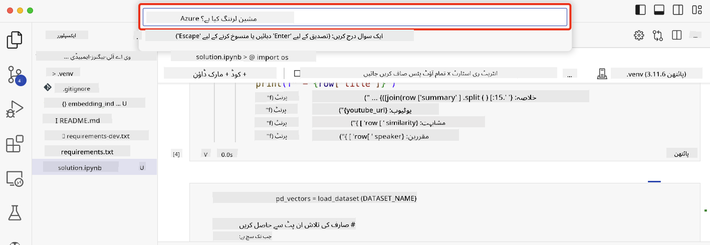

<!--
CO_OP_TRANSLATOR_METADATA:
{
  "original_hash": "58953c08b8ba7073b836d4270ea0fe86",
  "translation_date": "2025-10-17T13:05:43+00:00",
  "source_file": "08-building-search-applications/README.md",
  "language_code": "ur"
}
-->
# سرچ ایپلیکیشنز بنانا

[](https://youtu.be/W0-nzXjOjr0?si=GcsqiTTvd7RKbo7V)

> > _اوپر دی گئی تصویر پر کلک کریں تاکہ اس سبق کی ویڈیو دیکھ سکیں_

LLMs صرف چیٹ بوٹس اور ٹیکسٹ جنریشن تک محدود نہیں ہیں۔ ایمبیڈنگز کا استعمال کرتے ہوئے سرچ ایپلیکیشنز بنانا بھی ممکن ہے۔ ایمبیڈنگز ڈیٹا کی عددی نمائندگی ہیں جنہیں ویکٹرز بھی کہا جاتا ہے، اور یہ ڈیٹا کے سیمینٹک سرچ کے لیے استعمال کی جا سکتی ہیں۔

اس سبق میں، آپ ہمارے ایجوکیشن اسٹارٹ اپ کے لیے ایک سرچ ایپلیکیشن بنائیں گے۔ ہمارا اسٹارٹ اپ ایک غیر منافع بخش تنظیم ہے جو ترقی پذیر ممالک کے طلباء کو مفت تعلیم فراہم کرتا ہے۔ ہمارے اسٹارٹ اپ کے پاس یوٹیوب ویڈیوز کی ایک بڑی تعداد ہے جنہیں طلباء AI کے بارے میں سیکھنے کے لیے استعمال کر سکتے ہیں۔ ہمارا اسٹارٹ اپ ایک سرچ ایپلیکیشن بنانا چاہتا ہے جو طلباء کو سوال ٹائپ کر کے یوٹیوب ویڈیو تلاش کرنے کی اجازت دے۔

مثال کے طور پر، ایک طالب علم 'جیوپیٹر نوٹ بکس کیا ہیں؟' یا 'Azure ML کیا ہے؟' ٹائپ کر سکتا ہے اور سرچ ایپلیکیشن سوال سے متعلق یوٹیوب ویڈیوز کی فہرست واپس کرے گی، اور اس سے بھی بہتر، سرچ ایپلیکیشن ویڈیو میں اس جگہ کا لنک واپس کرے گی جہاں سوال کا جواب موجود ہے۔

## تعارف

اس سبق میں ہم درج ذیل موضوعات کا احاطہ کریں گے:

- سیمینٹک بمقابلہ کی ورڈ سرچ۔
- ٹیکسٹ ایمبیڈنگز کیا ہیں۔
- ٹیکسٹ ایمبیڈنگز انڈیکس بنانا۔
- ٹیکسٹ ایمبیڈنگز انڈیکس میں سرچ کرنا۔

## سیکھنے کے اہداف

اس سبق کو مکمل کرنے کے بعد، آپ:

- سیمینٹک اور کی ورڈ سرچ کے درمیان فرق بتا سکیں گے۔
- ٹیکسٹ ایمبیڈنگز کی وضاحت کر سکیں گے۔
- ایمبیڈنگز کا استعمال کرتے ہوئے ڈیٹا تلاش کرنے کے لیے ایک ایپلیکیشن بنا سکیں گے۔

## سرچ ایپلیکیشن کیوں بنائیں؟

سرچ ایپلیکیشن بنانا آپ کو ایمبیڈنگز کا استعمال کرتے ہوئے ڈیٹا تلاش کرنے کا طریقہ سمجھنے میں مدد دے گا۔ آپ ایک ایسی سرچ ایپلیکیشن بنانا بھی سیکھیں گے جو طلباء کو جلدی معلومات حاصل کرنے میں مدد دے سکے۔

سبق میں مائیکروسافٹ [AI شو](https://www.youtube.com/playlist?list=PLlrxD0HtieHi0mwteKBOfEeOYf0LJU4O1) یوٹیوب چینل کے یوٹیوب ٹرانسکرپٹس کا ایمبیڈنگ انڈیکس شامل ہے۔ AI شو ایک یوٹیوب چینل ہے جو آپ کو AI اور مشین لرننگ کے بارے میں سکھاتا ہے۔ ایمبیڈنگ انڈیکس میں اکتوبر 2023 تک کے یوٹیوب ٹرانسکرپٹس کے ایمبیڈنگز شامل ہیں۔ آپ اس ایمبیڈنگ انڈیکس کا استعمال ہمارے اسٹارٹ اپ کے لیے ایک سرچ ایپلیکیشن بنانے کے لیے کریں گے۔ سرچ ایپلیکیشن ویڈیو میں اس جگہ کا لنک واپس کرے گی جہاں سوال کا جواب موجود ہے۔ یہ طلباء کے لیے جلدی معلومات حاصل کرنے کا ایک بہترین طریقہ ہے۔

ذیل میں 'کیا آپ Azure ML کے ساتھ rstudio استعمال کر سکتے ہیں؟' سوال کے لیے سیمینٹک کوئری کی ایک مثال دی گئی ہے۔ یوٹیوب یو آر ایل چیک کریں، آپ دیکھیں گے کہ یو آر ایل میں ایک ٹائم اسٹیمپ شامل ہے جو آپ کو ویڈیو میں اس جگہ لے جاتا ہے جہاں سوال کا جواب موجود ہے۔


## سیمینٹک سرچ کیا ہے؟

اب آپ سوچ رہے ہوں گے، سیمینٹک سرچ کیا ہے؟ سیمینٹک سرچ ایک سرچ تکنیک ہے جو کوئری میں الفاظ کے معنی یا سیمینٹکس کا استعمال کرتی ہے تاکہ متعلقہ نتائج واپس کیے جا سکیں۔

یہاں سیمینٹک سرچ کی ایک مثال ہے۔ فرض کریں آپ ایک گاڑی خریدنا چاہتے ہیں، آپ 'میری خوابوں کی گاڑی' تلاش کر سکتے ہیں، سیمینٹک سرچ سمجھتی ہے کہ آپ گاڑی کے بارے میں `خواب` نہیں دیکھ رہے ہیں بلکہ آپ اپنی `آئیڈیل` گاڑی خریدنا چاہتے ہیں۔ سیمینٹک سرچ آپ کے ارادے کو سمجھتی ہے اور متعلقہ نتائج واپس کرتی ہے۔ اس کے برعکس `کی ورڈ سرچ` لفظی طور پر گاڑیوں کے خوابوں کی تلاش کرے گی اور اکثر غیر متعلقہ نتائج واپس کرے گی۔

## ٹیکسٹ ایمبیڈنگز کیا ہیں؟

[ٹیکسٹ ایمبیڈنگز](https://en.wikipedia.org/wiki/Word_embedding?WT.mc_id=academic-105485-koreyst) ایک ٹیکسٹ نمائندگی تکنیک ہے جو [نیچرل لینگویج پروسیسنگ](https://en.wikipedia.org/wiki/Natural_language_processing?WT.mc_id=academic-105485-koreyst) میں استعمال ہوتی ہے۔ ٹیکسٹ ایمبیڈنگز ٹیکسٹ کی سیمینٹک عددی نمائندگی ہیں۔ ایمبیڈنگز ڈیٹا کو اس طرح سے ظاہر کرنے کے لیے استعمال کی جاتی ہیں جو مشین کے لیے سمجھنا آسان ہو۔ ٹیکسٹ ایمبیڈنگز بنانے کے لیے بہت سے ماڈلز موجود ہیں، اس سبق میں ہم OpenAI ایمبیڈنگ ماڈل کا استعمال کرتے ہوئے ایمبیڈنگز بنانے پر توجہ مرکوز کریں گے۔

یہاں ایک مثال ہے، تصور کریں کہ درج ذیل ٹیکسٹ AI شو یوٹیوب چینل کے ایک ایپیسوڈ کے ٹرانسکرپٹ میں موجود ہے:

```text
Today we are going to learn about Azure Machine Learning.
```

ہم ٹیکسٹ کو OpenAI ایمبیڈنگ API کو پاس کریں گے اور یہ درج ذیل ایمبیڈنگ واپس کرے گا جو 1536 نمبروں پر مشتمل ہے یعنی ایک ویکٹر۔ ویکٹر میں ہر نمبر ٹیکسٹ کے مختلف پہلو کی نمائندگی کرتا ہے۔ اختصار کے لیے، ویکٹر میں پہلے 10 نمبر یہاں دیے گئے ہیں۔

```python
[-0.006655829958617687, 0.0026128944009542465, 0.008792596869170666, -0.02446001023054123, -0.008540431968867779, 0.022071078419685364, -0.010703742504119873, 0.003311325330287218, -0.011632772162556648, -0.02187200076878071, ...]
```

## ایمبیڈنگ انڈیکس کیسے بنایا جاتا ہے؟

اس سبق کے لیے ایمبیڈنگ انڈیکس Python اسکرپٹس کی ایک سیریز کے ساتھ بنایا گیا تھا۔ آپ اس سبق کے 'scripts' فولڈر میں [README](./scripts/README.md?WT.mc_id=academic-105485-koreyst) کے ساتھ اسکرپٹس اور ہدایات تلاش کریں گے۔ آپ کو یہ اسکرپٹس چلانے کی ضرورت نہیں ہے کیونکہ ایمبیڈنگ انڈیکس آپ کے لیے فراہم کیا گیا ہے۔

اسکرپٹس درج ذیل آپریشنز انجام دیتے ہیں:

1. [AI شو](https://www.youtube.com/playlist?list=PLlrxD0HtieHi0mwteKBOfEeOYf0LJU4O1) پلے لسٹ میں موجود ہر یوٹیوب ویڈیو کے ٹرانسکرپٹ کو ڈاؤن لوڈ کیا جاتا ہے۔
2. [OpenAI Functions](https://learn.microsoft.com/azure/ai-services/openai/how-to/function-calling?WT.mc_id=academic-105485-koreyst) کا استعمال کرتے ہوئے یوٹیوب ٹرانسکرپٹ کے پہلے 3 منٹ سے اسپیکر کا نام نکالنے کی کوشش کی جاتی ہے۔ ہر ویڈیو کے اسپیکر کا نام ایمبیڈنگ انڈیکس `embedding_index_3m.json` میں محفوظ کیا جاتا ہے۔
3. ٹرانسکرپٹ ٹیکسٹ کو **3 منٹ کے ٹیکسٹ سیگمنٹس** میں تقسیم کیا جاتا ہے۔ سیگمنٹ میں اگلے سیگمنٹ سے تقریباً 20 الفاظ شامل ہوتے ہیں تاکہ ایمبیڈنگ سیگمنٹ کٹ نہ جائے اور بہتر سرچ کانٹیکسٹ فراہم کرے۔
4. ہر ٹیکسٹ سیگمنٹ کو OpenAI Chat API کو پاس کیا جاتا ہے تاکہ ٹیکسٹ کو 60 الفاظ میں خلاصہ کیا جا سکے۔ خلاصہ بھی ایمبیڈنگ انڈیکس `embedding_index_3m.json` میں محفوظ کیا جاتا ہے۔
5. آخر میں، سیگمنٹ ٹیکسٹ کو OpenAI ایمبیڈنگ API کو پاس کیا جاتا ہے۔ ایمبیڈنگ API 1536 نمبروں کا ویکٹر واپس کرتا ہے جو سیگمنٹ کے سیمینٹک معنی کی نمائندگی کرتا ہے۔ سیگمنٹ کے ساتھ OpenAI ایمبیڈنگ ویکٹر ایمبیڈنگ انڈیکس `embedding_index_3m.json` میں محفوظ کیا جاتا ہے۔

### ویکٹر ڈیٹابیسز

سبق کی سادگی کے لیے، ایمبیڈنگ انڈیکس ایک JSON فائل `embedding_index_3m.json` میں محفوظ کیا جاتا ہے اور Pandas DataFrame میں لوڈ کیا جاتا ہے۔ تاہم، پروڈکشن میں، ایمبیڈنگ انڈیکس کو ویکٹر ڈیٹابیس میں محفوظ کیا جائے گا جیسے [Azure Cognitive Search](https://learn.microsoft.com/training/modules/improve-search-results-vector-search?WT.mc_id=academic-105485-koreyst)، [Redis](https://cookbook.openai.com/examples/vector_databases/redis/readme?WT.mc_id=academic-105485-koreyst)، [Pinecone](https://cookbook.openai.com/examples/vector_databases/pinecone/readme?WT.mc_id=academic-105485-koreyst)، [Weaviate](https://cookbook.openai.com/examples/vector_databases/weaviate/readme?WT.mc_id=academic-105485-koreyst)، وغیرہ۔

## کوسائن سمیلیریٹی کو سمجھنا

ہم نے ٹیکسٹ ایمبیڈنگز کے بارے میں سیکھا، اگلا قدم یہ سیکھنا ہے کہ ٹیکسٹ ایمبیڈنگز کا استعمال کرتے ہوئے ڈیٹا کو کیسے تلاش کیا جائے اور خاص طور پر کوسائن سمیلیریٹی کا استعمال کرتے ہوئے دی گئی کوئری کے سب سے زیادہ مشابہ ایمبیڈنگز کو کیسے تلاش کیا جائے۔

### کوسائن سمیلیریٹی کیا ہے؟

کوسائن سمیلیریٹی دو ویکٹرز کے درمیان مشابہت کی پیمائش ہے، آپ اسے `nearest neighbor search` کے طور پر بھی سنیں گے۔ کوسائن سمیلیریٹی سرچ انجام دینے کے لیے آپ کو OpenAI ایمبیڈنگ API کا استعمال کرتے ہوئے _query_ ٹیکسٹ کے لیے _vectorize_ کرنا ہوگا۔ پھر کوئری ویکٹر اور ایمبیڈنگ انڈیکس میں موجود ہر ویکٹر کے درمیان _cosine similarity_ کا حساب لگائیں۔ یاد رکھیں، ایمبیڈنگ انڈیکس میں ہر یوٹیوب ٹرانسکرپٹ ٹیکسٹ سیگمنٹ کے لیے ایک ویکٹر موجود ہے۔ آخر میں، کوسائن سمیلیریٹی کے لحاظ سے نتائج کو ترتیب دیں اور سب سے زیادہ کوسائن سمیلیریٹی والے ٹیکسٹ سیگمنٹس کوئری کے سب سے زیادہ مشابہ ہوں گے۔

ریاضی کے نقطہ نظر سے، کوسائن سمیلیریٹی دو ویکٹرز کے درمیان زاویہ کے کوسائن کی پیمائش کرتی ہے جو کثیر جہتی جگہ میں پروجیکٹ کیے گئے ہیں۔ یہ پیمائش فائدہ مند ہے، کیونکہ اگر دو دستاویزات سائز کی وجہ سے یورکلین فاصلے سے دور ہیں، تو وہ اب بھی ایک دوسرے کے درمیان چھوٹا زاویہ رکھ سکتی ہیں اور اس طرح زیادہ کوسائن سمیلیریٹی رکھ سکتی ہیں۔ کوسائن سمیلیریٹی مساوات کے بارے میں مزید معلومات کے لیے، دیکھیں [کوسائن سمیلیریٹی](https://en.wikipedia.org/wiki/Cosine_similarity?WT.mc_id=academic-105485-koreyst)۔

## اپنی پہلی سرچ ایپلیکیشن بنانا

اگلا، ہم ایمبیڈنگز کا استعمال کرتے ہوئے ایک سرچ ایپلیکیشن بنانے کا طریقہ سیکھیں گے۔ سرچ ایپلیکیشن طلباء کو سوال ٹائپ کر کے ویڈیو تلاش کرنے کی اجازت دے گی۔ سرچ ایپلیکیشن سوال سے متعلق ویڈیوز کی فہرست واپس کرے گی۔ سرچ ایپلیکیشن ویڈیو میں اس جگہ کا لنک بھی واپس کرے گی جہاں سوال کا جواب موجود ہے۔

یہ حل Windows 11، macOS، اور Ubuntu 22.04 پر Python 3.10 یا اس کے بعد کے ورژن کا استعمال کرتے ہوئے بنایا اور آزمایا گیا۔ آپ Python کو [python.org](https://www.python.org/downloads/?WT.mc_id=academic-105485-koreyst) سے ڈاؤن لوڈ کر سکتے ہیں۔

## اسائنمنٹ - طلباء کو سرچ ایپلیکیشن بنانے کے قابل بنانا

ہم نے سبق کے آغاز میں اپنے اسٹارٹ اپ کا تعارف کرایا۔ اب وقت ہے کہ طلباء کو ان کے اسیسمنٹس کے لیے سرچ ایپلیکیشن بنانے کے قابل بنایا جائے۔

اس اسائنمنٹ میں، آپ Azure OpenAI Services بنائیں گے جو سرچ ایپلیکیشن بنانے کے لیے استعمال ہوں گے۔ آپ درج ذیل Azure OpenAI Services بنائیں گے۔ اس اسائنمنٹ کو مکمل کرنے کے لیے آپ کو Azure سبسکرپشن کی ضرورت ہوگی۔

### Azure Cloud Shell شروع کریں

1. [Azure پورٹل](https://portal.azure.com/?WT.mc_id=academic-105485-koreyst) میں سائن ان کریں۔
2. Azure پورٹل کے اوپری دائیں کونے میں Cloud Shell آئیکن منتخب کریں۔
3. ماحول کی قسم کے لیے **Bash** منتخب کریں۔

#### ریسورس گروپ بنائیں

> ان ہدایات کے لیے، ہم East US میں "semantic-video-search" نامی ریسورس گروپ استعمال کر رہے ہیں۔
> آپ ریسورس گروپ کا نام تبدیل کر سکتے ہیں، لیکن جب ریسورسز کے لیے مقام تبدیل کریں،
> [ماڈل دستیابی ٹیبل](https://aka.ms/oai/models?WT.mc_id=academic-105485-koreyst) چیک کریں۔

```shell
az group create --name semantic-video-search --location eastus
```

#### Azure OpenAI Service ریسورس بنائیں

Azure Cloud Shell سے، درج ذیل کمانڈ چلائیں تاکہ Azure OpenAI Service ریسورس بنایا جا سکے۔

```shell
az cognitiveservices account create --name semantic-video-openai --resource-group semantic-video-search \
    --location eastus --kind OpenAI --sku s0
```

#### اس ایپلیکیشن میں استعمال کے لیے اینڈپوائنٹ اور کیز حاصل کریں

Azure Cloud Shell سے، درج ذیل کمانڈز چلائیں تاکہ Azure OpenAI Service ریسورس کے لیے اینڈپوائنٹ اور کیز حاصل کی جا سکیں۔

```shell
az cognitiveservices account show --name semantic-video-openai \
   --resource-group  semantic-video-search | jq -r .properties.endpoint
az cognitiveservices account keys list --name semantic-video-openai \
   --resource-group semantic-video-search | jq -r .key1
```

#### OpenAI ایمبیڈنگ ماڈل کو ڈیپلائی کریں

Azure Cloud Shell سے، درج ذیل کمانڈ چلائیں تاکہ OpenAI ایمبیڈنگ ماڈل کو ڈیپلائی کیا جا سکے۔

```shell
az cognitiveservices account deployment create \
    --name semantic-video-openai \
    --resource-group  semantic-video-search \
    --deployment-name text-embedding-ada-002 \
    --model-name text-embedding-ada-002 \
    --model-version "2"  \
    --model-format OpenAI \
    --sku-capacity 100 --sku-name "Standard"
```

## حل

GitHub Codespaces میں [solution notebook](./python/aoai-solution.ipynb?WT.mc_id=academic-105485-koreyst) کھولیں اور Jupyter Notebook میں دی گئی ہدایات پر عمل کریں۔

جب آپ نوٹ بک چلائیں گے، تو آپ سے کوئری درج کرنے کے لیے کہا جائے گا۔ ان پٹ باکس اس طرح نظر آئے گا:



## زبردست کام! اپنی تعلیم جاری رکھیں

اس سبق کو مکمل کرنے کے بعد، ہمارے [جنریٹو AI لرننگ کلیکشن](https://aka.ms/genai-collection?WT.mc_id=academic-105485-koreyst) کو چیک کریں تاکہ اپنی جنریٹو AI کی معلومات کو مزید بہتر کریں!

سبق 9 پر جائیں جہاں ہم دیکھیں گے کہ [امیج جنریشن ایپلیکیشنز کیسے بنائیں](../09-building-image-applications/README.md?WT.mc_id=academic-105485-koreyst)!

---

**ڈسکلیمر**:  
یہ دستاویز AI ترجمہ سروس [Co-op Translator](https://github.com/Azure/co-op-translator) کا استعمال کرتے ہوئے ترجمہ کی گئی ہے۔ ہم درستگی کے لیے کوشش کرتے ہیں، لیکن براہ کرم آگاہ رہیں کہ خودکار ترجمے میں غلطیاں یا غیر درستیاں ہو سکتی ہیں۔ اصل دستاویز کو اس کی اصل زبان میں مستند ذریعہ سمجھا جانا چاہیے۔ اہم معلومات کے لیے، پیشہ ور انسانی ترجمہ کی سفارش کی جاتی ہے۔ ہم اس ترجمے کے استعمال سے پیدا ہونے والی کسی بھی غلط فہمی یا غلط تشریح کے ذمہ دار نہیں ہیں۔