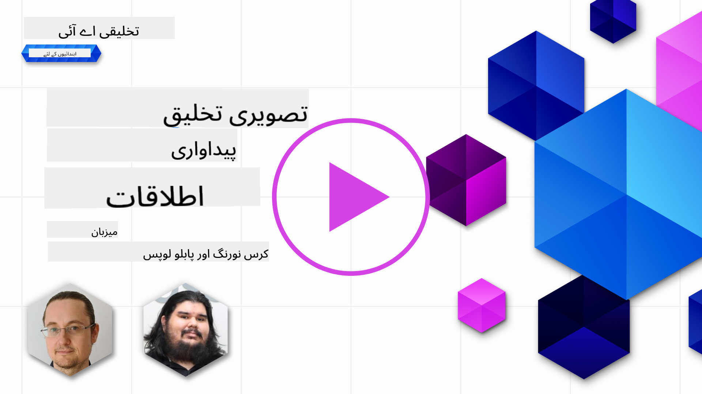

<!--
CO_OP_TRANSLATOR_METADATA:
{
  "original_hash": "238cde5c90363d70ecc939569378da51",
  "translation_date": "2025-10-17T13:11:25+00:00",
  "source_file": "09-building-image-applications/README.md",
  "language_code": "ur"
}
-->
# تصویری تخلیقی ایپلیکیشنز بنانا

[](https://youtu.be/B5VP0_J7cs8?si=5P3L5o7F_uS_QcG9)

LLMs صرف متن تخلیق کرنے تک محدود نہیں ہیں۔ متن کی وضاحتوں سے تصاویر تخلیق کرنا بھی ممکن ہے۔ تصاویر کو ایک موڈالٹی کے طور پر استعمال کرنا مختلف شعبوں جیسے میڈٹیک، آرکیٹیکچر، سیاحت، گیم ڈیولپمنٹ اور دیگر میں بہت مفید ہو سکتا ہے۔ اس باب میں، ہم دو مشہور تصویری تخلیقی ماڈلز، DALL-E اور Midjourney پر غور کریں گے۔

## تعارف

اس سبق میں ہم درج ذیل موضوعات پر بات کریں گے:

- تصویری تخلیق اور اس کی افادیت۔
- DALL-E اور Midjourney، یہ کیا ہیں اور کیسے کام کرتے ہیں۔
- تصویری تخلیقی ایپلیکیشن کیسے بنائی جائے۔

## سیکھنے کے مقاصد

اس سبق کو مکمل کرنے کے بعد، آپ:

- تصویری تخلیقی ایپلیکیشن بنا سکیں گے۔
- اپنی ایپلیکیشن کے لیے میٹا پرامپٹس کے ذریعے حدود مقرر کر سکیں گے۔
- DALL-E اور Midjourney کے ساتھ کام کر سکیں گے۔

## تصویری تخلیقی ایپلیکیشن کیوں بنائیں؟

تصویری تخلیقی ایپلیکیشنز جنریٹو AI کی صلاحیتوں کو دریافت کرنے کا بہترین طریقہ ہیں۔ ان کا استعمال مختلف مقاصد کے لیے کیا جا سکتا ہے، جیسے:

- **تصویری ترمیم اور ترکیب**۔ آپ مختلف استعمالات کے لیے تصاویر تخلیق کر سکتے ہیں، جیسے تصویری ترمیم اور ترکیب۔

- **مختلف صنعتوں میں اطلاق**۔ یہ مختلف صنعتوں جیسے میڈٹیک، سیاحت، گیم ڈیولپمنٹ اور دیگر کے لیے تصاویر تخلیق کرنے میں بھی استعمال ہو سکتی ہیں۔

## منظرنامہ: Edu4All

اس سبق کے حصے کے طور پر، ہم اپنے اسٹارٹ اپ، Edu4All کے ساتھ کام جاری رکھیں گے۔ طلباء اپنی اسیسمنٹس کے لیے تصاویر تخلیق کریں گے، تصاویر کی نوعیت طلباء پر منحصر ہے، لیکن وہ اپنی پریوں کی کہانی کے لیے تصاویر بنا سکتے ہیں، اپنے کہانی کے لیے نیا کردار تخلیق کر سکتے ہیں یا اپنے خیالات اور تصورات کو بصری شکل دے سکتے ہیں۔

یہاں ایک مثال ہے کہ Edu4All کے طلباء کلاس میں یادگاروں پر کام کرتے ہوئے کیا تخلیق کر سکتے ہیں:


ایک پرامپٹ استعمال کرتے ہوئے جیسے:

> "ایفل ٹاور کے قریب کتا، صبح کی روشنی میں"

## DALL-E اور Midjourney کیا ہیں؟

[DALL-E](https://openai.com/dall-e-2?WT.mc_id=academic-105485-koreyst) اور [Midjourney](https://www.midjourney.com/?WT.mc_id=academic-105485-koreyst) دو مشہور تصویری تخلیقی ماڈلز ہیں، جو آپ کو پرامپٹس کے ذریعے تصاویر تخلیق کرنے کی اجازت دیتے ہیں۔

### DALL-E

آئیے DALL-E سے شروع کرتے ہیں، جو ایک جنریٹو AI ماڈل ہے جو متن کی وضاحتوں سے تصاویر تخلیق کرتا ہے۔

> [DALL-E دو ماڈلز، CLIP اور diffused attention کا مجموعہ ہے](https://towardsdatascience.com/openais-dall-e-and-clip-101-a-brief-introduction-3a4367280d4e?WT.mc_id=academic-105485-koreyst)۔

- **CLIP**، ایک ماڈل ہے جو تصاویر اور متن سے عددی نمائندگی (embeddings) تخلیق کرتا ہے۔

- **Diffused attention**، ایک ماڈل ہے جو embeddings سے تصاویر تخلیق کرتا ہے۔ DALL-E تصاویر اور متن کے ڈیٹا سیٹ پر تربیت یافتہ ہے اور متن کی وضاحتوں سے تصاویر تخلیق کرنے کے لیے استعمال کیا جا سکتا ہے۔ مثال کے طور پر، DALL-E کو ایک ٹوپی میں بلی یا ایک موہاک والے کتے کی تصویر تخلیق کرنے کے لیے استعمال کیا جا سکتا ہے۔

### Midjourney

Midjourney DALL-E کی طرح کام کرتا ہے، یہ متن کے پرامپٹس سے تصاویر تخلیق کرتا ہے۔ Midjourney کو بھی پرامپٹس جیسے "ایک ٹوپی میں بلی" یا "موہاک والے کتے" کے ذریعے تصاویر تخلیق کرنے کے لیے استعمال کیا جا سکتا ہے۔


_تصویر کا کریڈٹ ویکیپیڈیا، Midjourney کے ذریعے تخلیق کردہ تصویر_

## DALL-E اور Midjourney کیسے کام کرتے ہیں؟

سب سے پہلے، [DALL-E](https://arxiv.org/pdf/2102.12092.pdf?WT.mc_id=academic-105485-koreyst)۔ DALL-E ایک جنریٹو AI ماڈل ہے جو ٹرانسفارمر آرکیٹیکچر پر مبنی ہے اور ایک _آٹو ریگریسیو ٹرانسفارمر_ کے ساتھ کام کرتا ہے۔

ایک _آٹو ریگریسیو ٹرانسفارمر_ وضاحت کرتا ہے کہ ماڈل متن کی وضاحتوں سے تصاویر کیسے تخلیق کرتا ہے، یہ ایک وقت میں ایک پکسل تخلیق کرتا ہے، اور پھر تخلیق کردہ پکسلز کو اگلے پکسل تخلیق کرنے کے لیے استعمال کرتا ہے۔ یہ عمل نیورل نیٹ ورک کی متعدد تہوں سے گزرتا ہے، جب تک کہ تصویر مکمل نہ ہو جائے۔

اس عمل کے ساتھ، DALL-E تخلیق کردہ تصویر میں خصوصیات، اشیاء، خصوصیات، اور مزید کو کنٹرول کرتا ہے۔ تاہم، DALL-E 2 اور 3 تخلیق کردہ تصویر پر زیادہ کنٹرول فراہم کرتے ہیں۔

## اپنی پہلی تصویری تخلیقی ایپلیکیشن بنانا

تو تصویری تخلیقی ایپلیکیشن بنانے کے لیے آپ کو کن لائبریریوں کی ضرورت ہے؟

- **python-dotenv**، یہ لائبریری آپ کے رازوں کو _.env_ فائل میں کوڈ سے دور رکھنے کے لیے استعمال کرنے کی سختی سے سفارش کی جاتی ہے۔
- **openai**، یہ لائبریری آپ OpenAI API کے ساتھ تعامل کے لیے استعمال کریں گے۔
- **pillow**، Python میں تصاویر کے ساتھ کام کرنے کے لیے۔
- **requests**، HTTP درخواستیں بنانے میں مدد کے لیے۔

## Azure OpenAI ماڈل تخلیق اور تعینات کریں

اگر پہلے سے نہیں کیا گیا، تو [Microsoft Learn](https://learn.microsoft.com/azure/ai-foundry/openai/how-to/create-resource?pivots=web-portal) صفحے پر دی گئی ہدایات پر عمل کریں
Azure OpenAI ریسورس اور ماڈل تخلیق کرنے کے لیے۔ DALL-E 3 کو ماڈل کے طور پر منتخب کریں۔

## ایپ بنائیں

1. _.env_ فائل تخلیق کریں جس میں درج ذیل مواد ہو:

   ```text
   AZURE_OPENAI_ENDPOINT=<your endpoint>
   AZURE_OPENAI_API_KEY=<your key>
   AZURE_OPENAI_DEPLOYMENT="dall-e-3"
   ```

   Azure OpenAI Foundry Portal میں اپنے ریسورس کے "Deployments" سیکشن میں یہ معلومات تلاش کریں۔

1. مذکورہ لائبریریوں کو _requirements.txt_ فائل میں جمع کریں، جیسے:

   ```text
   python-dotenv
   openai
   pillow
   requests
   ```

1. اس کے بعد، ورچوئل ماحول تخلیق کریں اور لائبریریاں انسٹال کریں:

   ```bash
   python3 -m venv venv
   source venv/bin/activate
   pip install -r requirements.txt
   ```

   ونڈوز کے لیے، ورچوئل ماحول تخلیق اور فعال کرنے کے لیے درج ذیل کمانڈز استعمال کریں:

   ```bash
   python3 -m venv venv
   venv\Scripts\activate.bat
   ```

1. _app.py_ نامی فائل میں درج ذیل کوڈ شامل کریں:

    ```python
    import openai
    import os
    import requests
    from PIL import Image
    import dotenv
    from openai import OpenAI, AzureOpenAI
    
    # import dotenv
    dotenv.load_dotenv()
    
    # configure Azure OpenAI service client 
    client = AzureOpenAI(
      azure_endpoint = os.environ["AZURE_OPENAI_ENDPOINT"],
      api_key=os.environ['AZURE_OPENAI_API_KEY'],
      api_version = "2024-02-01"
      )
    try:
        # Create an image by using the image generation API
        generation_response = client.images.generate(
                                prompt='Bunny on horse, holding a lollipop, on a foggy meadow where it grows daffodils',
                                size='1024x1024', n=1,
                                model=os.environ['AZURE_OPENAI_DEPLOYMENT']
                              )

        # Set the directory for the stored image
        image_dir = os.path.join(os.curdir, 'images')

        # If the directory doesn't exist, create it
        if not os.path.isdir(image_dir):
            os.mkdir(image_dir)

        # Initialize the image path (note the filetype should be png)
        image_path = os.path.join(image_dir, 'generated-image.png')

        # Retrieve the generated image
        image_url = generation_response.data[0].url  # extract image URL from response
        generated_image = requests.get(image_url).content  # download the image
        with open(image_path, "wb") as image_file:
            image_file.write(generated_image)

        # Display the image in the default image viewer
        image = Image.open(image_path)
        image.show()

    # catch exceptions
    except openai.InvalidRequestError as err:
        print(err)
   ```

آئیے اس کوڈ کی وضاحت کرتے ہیں:

- سب سے پہلے، ہم ان لائبریریوں کو درآمد کرتے ہیں جن کی ہمیں ضرورت ہے، جن میں OpenAI لائبریری، dotenv لائبریری، requests لائبریری، اور Pillow لائبریری شامل ہیں۔

  ```python
  import openai
  import os
  import requests
  from PIL import Image
  import dotenv
  ```

- اس کے بعد، ہم _.env_ فائل سے ماحول کے متغیرات لوڈ کرتے ہیں۔

  ```python
  # import dotenv
  dotenv.load_dotenv()
  ```

- اس کے بعد، ہم Azure OpenAI سروس کلائنٹ کو ترتیب دیتے ہیں۔

  ```python
  # Get endpoint and key from environment variables
  client = AzureOpenAI(
      azure_endpoint = os.environ["AZURE_OPENAI_ENDPOINT"],
      api_key=os.environ['AZURE_OPENAI_API_KEY'],
      api_version = "2024-02-01"
      )
  ```

- اس کے بعد، ہم تصویر تخلیق کرتے ہیں:

  ```python
  # Create an image by using the image generation API
  generation_response = client.images.generate(
                        prompt='Bunny on horse, holding a lollipop, on a foggy meadow where it grows daffodils',
                        size='1024x1024', n=1,
                        model=os.environ['AZURE_OPENAI_DEPLOYMENT']
                      )
  ```

  مذکورہ کوڈ JSON آبجیکٹ کے ساتھ جواب دیتا ہے جس میں تخلیق کردہ تصویر کا URL شامل ہوتا ہے۔ ہم URL کو استعمال کرتے ہوئے تصویر ڈاؤنلوڈ کر سکتے ہیں اور اسے فائل میں محفوظ کر سکتے ہیں۔

- آخر میں، ہم تصویر کو کھولتے ہیں اور معیاری تصویر دیکھنے والے کے ذریعے اسے دکھاتے ہیں:

  ```python
  image = Image.open(image_path)
  image.show()
  ```

### تصویر تخلیق کرنے کی مزید تفصیلات

آئیے اس کوڈ پر نظر ڈالیں جو تصویر تخلیق کرتا ہے:

   ```python
     generation_response = client.images.generate(
                               prompt='Bunny on horse, holding a lollipop, on a foggy meadow where it grows daffodils',
                               size='1024x1024', n=1,
                               model=os.environ['AZURE_OPENAI_DEPLOYMENT']
                           )
   ```

- **prompt**، وہ متن پرامپٹ ہے جو تصویر تخلیق کرنے کے لیے استعمال ہوتا ہے۔ اس صورت میں، ہم پرامپٹ "گھوڑے پر خرگوش، ہاتھ میں لالی پاپ، دھندلے میدان میں جہاں نرگس کے پھول اگتے ہیں" استعمال کر رہے ہیں۔
- **size**، تخلیق کردہ تصویر کا سائز ہے۔ اس صورت میں، ہم 1024x1024 پکسلز کی تصویر تخلیق کر رہے ہیں۔
- **n**، تخلیق کردہ تصاویر کی تعداد ہے۔ اس صورت میں، ہم دو تصاویر تخلیق کر رہے ہیں۔
- **temperature**، ایک پیرامیٹر ہے جو جنریٹو AI ماڈل کے آؤٹ پٹ کی بے ترتیبی کو کنٹرول کرتا ہے۔ temperature 0 اور 1 کے درمیان ایک قدر ہے جہاں 0 کا مطلب ہے کہ آؤٹ پٹ متعین ہے اور 1 کا مطلب ہے کہ آؤٹ پٹ بے ترتیب ہے۔ ڈیفالٹ قدر 0.7 ہے۔

تصاویر کے ساتھ مزید کام کرنے کے لیے اگلے حصے میں مزید تفصیلات دی جائیں گی۔

## تصویری تخلیق کی اضافی صلاحیتیں

آپ نے دیکھا کہ ہم نے Python میں چند لائنوں کے ذریعے تصویر تخلیق کی۔ تاہم، تصاویر کے ساتھ مزید کام بھی کیے جا سکتے ہیں۔

آپ درج ذیل کام بھی کر سکتے ہیں:

- **ترمیم کریں**۔ موجودہ تصویر، ماسک اور پرامپٹ فراہم کر کے آپ تصویر میں تبدیلی کر سکتے ہیں۔ مثال کے طور پر، آپ تصویر کے کسی حصے میں کچھ شامل کر سکتے ہیں۔ تصور کریں کہ ہمارے خرگوش کی تصویر میں، آپ خرگوش کو ایک ٹوپی پہنا سکتے ہیں۔ یہ کام تصویر، ماسک (تبدیلی کے علاقے کی شناخت) اور متن پرامپٹ فراہم کر کے کیا جا سکتا ہے۔
> نوٹ: یہ DALL-E 3 میں سپورٹ نہیں ہے۔

یہاں GPT Image کا استعمال کرتے ہوئے ایک مثال ہے:

   ```python
   response = client.images.edit(
       model="gpt-image-1",
       image=open("sunlit_lounge.png", "rb"),
       mask=open("mask.png", "rb"),
       prompt="A sunlit indoor lounge area with a pool containing a flamingo"
   )
   image_url = response.data[0].url
   ```

  بنیادی تصویر میں صرف پول کے ساتھ لاؤنج ہوگا لیکن حتمی تصویر میں فلیمنگو ہوگا:

<div style="display: flex; justify-content: space-between; align-items: center; margin: 20px 0;">
  
  
  
</div>

- **تغیرات تخلیق کریں**۔ خیال یہ ہے کہ آپ موجودہ تصویر لیں اور اس سے تغیرات تخلیق کرنے کو کہیں۔ تغیر تخلیق کرنے کے لیے، آپ تصویر اور متن پرامپٹ فراہم کرتے ہیں اور کوڈ کچھ اس طرح ہوتا ہے:

  ```python
  response = openai.Image.create_variation(
    image=open("bunny-lollipop.png", "rb"),
    n=1,
    size="1024x1024"
  )
  image_url = response['data'][0]['url']
  ```

  > نوٹ، یہ صرف OpenAI پر سپورٹ ہے۔

## Temperature

Temperature ایک پیرامیٹر ہے جو جنریٹو AI ماڈل کے آؤٹ پٹ کی بے ترتیبی کو کنٹرول کرتا ہے۔ temperature 0 اور 1 کے درمیان ایک قدر ہے جہاں 0 کا مطلب ہے کہ آؤٹ پٹ متعین ہے اور 1 کا مطلب ہے کہ آؤٹ پٹ بے ترتیب ہے۔ ڈیفالٹ قدر 0.7 ہے۔

آئیے temperature کے کام کرنے کی مثال دیکھتے ہیں، اس پرامپٹ کو دو بار چلا کر:

> پرامپٹ: "گھوڑے پر خرگوش، ہاتھ میں لالی پاپ، دھندلے میدان میں جہاں نرگس کے پھول اگتے ہیں"


اب اسی پرامپٹ کو دوبارہ چلائیں تاکہ دیکھ سکیں کہ ہمیں ایک جیسی تصویر دوبارہ نہیں ملے گی:


جیسا کہ آپ دیکھ سکتے ہیں، تصاویر ایک جیسی ہیں لیکن بالکل ایک جیسی نہیں۔ آئیے temperature کی قدر کو 0.1 پر تبدیل کریں اور دیکھیں کیا ہوتا ہے:

```python
 generation_response = client.images.create(
        prompt='Bunny on horse, holding a lollipop, on a foggy meadow where it grows daffodils',    # Enter your prompt text here
        size='1024x1024',
        n=2
    )
```

### Temperature تبدیل کرنا

تو آئیے آؤٹ پٹ کو زیادہ متعین بنانے کی کوشش کریں۔ ہم نے تخلیق کردہ دو تصاویر سے مشاہدہ کیا کہ پہلی تصویر میں خرگوش ہے اور دوسری تصویر میں گھوڑا ہے، لہذا تصاویر میں بہت فرق ہے۔

آئیے اس لیے اپنے کوڈ کو تبدیل کریں اور temperature کو 0 پر سیٹ کریں، کچھ اس طرح:

```python
generation_response = client.images.create(
        prompt='Bunny on horse, holding a lollipop, on a foggy meadow where it grows daffodils',    # Enter your prompt text here
        size='1024x1024',
        n=2,
        temperature=0
    )
```

اب جب آپ یہ کوڈ چلائیں گے، آپ کو یہ دو تصاویر ملیں گی:

- 
- 

یہاں آپ واضح طور پر دیکھ سکتے ہیں کہ تصاویر ایک دوسرے سے زیادہ مشابہت رکھتی ہیں۔

## اپنی ایپلیکیشن کے لیے حدود مقرر کرنے کے لیے میٹا پرامپٹس کا استعمال کیسے کریں

ہمارے ڈیمو کے ساتھ، ہم پہلے ہی اپنے کلائنٹس کے لیے تصاویر تخلیق کر سکتے ہیں۔ تاہم، ہمیں اپنی ایپلیکیشن کے لیے کچھ حدود مقرر کرنے کی ضرورت ہے۔

مثال کے طور پر، ہم ایسی تصاویر تخلیق نہیں کرنا چاہتے جو کام کے لیے محفوظ نہ ہوں، یا جو بچوں کے لیے مناسب نہ ہوں۔

ہم یہ _میٹا پرامپٹس_ کے ذریعے کر سکتے ہیں۔ میٹا پرامپٹس وہ متن پرامپٹس ہیں جو جنریٹو AI ماڈل کے آؤٹ پٹ کو کنٹرول کرنے کے لیے استعمال ہوتے ہیں۔ مثال کے طور پر، ہم میٹا پرامپٹس کا استعمال آؤٹ پٹ کو کنٹرول کرنے کے لیے کر سکتے ہیں، اور یہ یقینی بنا سکتے ہیں کہ تخلیق کردہ تصاویر کام کے لیے محفوظ ہوں، یا بچوں کے لیے مناسب ہوں۔

### یہ کیسے کام کرتا ہے؟

اب، میٹا پرامپٹس کیسے کام کرتے ہیں؟

میٹا پرامپٹس وہ متن پرامپٹس ہیں جو جنریٹو AI ماڈل کے آؤٹ پٹ کو کنٹرول کرنے کے لیے استعمال ہوتے ہیں، یہ متن پرامپٹ سے پہلے پوزیشن میں ہوتے ہیں، اور ماڈل کے آؤٹ پٹ کو کنٹرول کرنے کے لیے استعمال ہوتے ہیں اور ایپلیکیشنز میں ماڈل کے آؤٹ پٹ کو کنٹرول کرنے کے لیے شامل کیے جاتے ہیں۔ پرامپٹ ان پٹ اور میٹا پرامپٹ انپٹ کو ایک متن پرامپٹ میں شامل کرتے ہوئے۔

میٹا پرامپٹ کی ایک مثال درج ذیل ہو سکتی ہے:

```text
You are an assistant designer that creates images for children.

The image needs to be safe for work and appropriate for children.

The image needs to be in color.

The image needs to be in landscape orientation.

The image needs to be in a 16:9 aspect ratio.

Do not consider any input from the following that is not safe for work or appropriate for children.

(Input)

```

اب، آئیے دیکھتے ہیں کہ ہم اپنے ڈیمو میں میٹا پرامپٹس کا استعمال کیسے کر سکتے ہیں۔

```python
disallow_list = "swords, violence, blood, gore, nudity, sexual content, adult content, adult themes, adult language, adult humor, adult jokes, adult situations, adult"

meta_prompt =f"""You are an assistant designer that creates images for children.

The image needs to be safe for work and appropriate for children.

The image needs to be in color.

The image needs to be in landscape orientation.

The image needs to be in a 16:9 aspect ratio.

Do not consider any input from the following that is not safe for work or appropriate for children.
{disallow_list}
"""

prompt = f"{meta_prompt}
Create an image of a bunny on a horse, holding a lollipop"

# TODO add request to generate image
```

مذکورہ پرامپٹ سے، آپ دیکھ سکتے ہیں کہ تخلیق کردہ تمام تصاویر میٹا پرامپٹ کو مدنظر رکھتی ہیں۔

## اسائنمنٹ - آئیے طلباء کو فعال کریں

ہم نے اس سبق کے آغاز میں Edu4All کا تعارف کرایا۔ اب وقت ہے کہ طلباء کو اپنی اسیسمنٹس کے لیے تصاویر تخلیق کرنے کے قابل بنائیں۔

طلباء اپنی اسیسمنٹس کے لیے یادگاروں پر مشتمل تصاویر تخلیق کریں گے، یادگاروں کی نوعیت طلباء پر منحصر ہے۔ طلباء کو اس کام میں اپنی تخلیقی صلاحیتوں کا استعمال کرنے کے لیے کہا گیا ہے تاکہ ان یادگاروں کو مختلف سیاق و سباق میں رکھ سکیں۔

## حل

یہاں ایک ممکنہ حل ہے:
```python
import openai
import os
import requests
from PIL import Image
import dotenv
from openai import AzureOpenAI
# import dotenv
dotenv.load_dotenv()

# Get endpoint and key from environment variables
client = AzureOpenAI(
  azure_endpoint = os.environ["AZURE_OPENAI_ENDPOINT"],
  api_key=os.environ['AZURE_OPENAI_API_KEY'],
  api_version = "2024-02-01"
  )


disallow_list = "swords, violence, blood, gore, nudity, sexual content, adult content, adult themes, adult language, adult humor, adult jokes, adult situations, adult"

meta_prompt = f"""You are an assistant designer that creates images for children.

The image needs to be safe for work and appropriate for children.

The image needs to be in color.

The image needs to be in landscape orientation.

The image needs to be in a 16:9 aspect ratio.

Do not consider any input from the following that is not safe for work or appropriate for children.
{disallow_list}
"""

prompt = f"""{meta_prompt}
Generate monument of the Arc of Triumph in Paris, France, in the evening light with a small child holding a Teddy looks on.
""""

try:
    # Create an image by using the image generation API
    generation_response = client.images.generate(
        prompt=prompt,    # Enter your prompt text here
        size='1024x1024',
        n=1,
    )
    # Set the directory for the stored image
    image_dir = os.path.join(os.curdir, 'images')

    # If the directory doesn't exist, create it
    if not os.path.isdir(image_dir):
        os.mkdir(image_dir)

    # Initialize the image path (note the filetype should be png)
    image_path = os.path.join(image_dir, 'generated-image.png')

    # Retrieve the generated image
    image_url = generation_response.data[0].url  # extract image URL from response
    generated_image = requests.get(image_url).content  # download the image
    with open(image_path, "wb") as image_file:
        image_file.write(generated_image)

    # Display the image in the default image viewer
    image = Image.open(image_path)
    image.show()

# catch exceptions
except openai.BadRequestError as err:
    print(err)
```
  
## شاندار کام! اپنی تعلیم جاری رکھیں  

اس سبق کو مکمل کرنے کے بعد، ہماری [Generative AI Learning collection](https://aka.ms/genai-collection?WT.mc_id=academic-105485-koreyst) دیکھیں تاکہ اپنی Generative AI کی معلومات کو مزید بہتر کریں!  

سبق 10 پر جائیں جہاں ہم دیکھیں گے کہ [کم کوڈ کے ساتھ AI ایپلیکیشنز کیسے بنائیں](../10-building-low-code-ai-applications/README.md?WT.mc_id=academic-105485-koreyst)  

---

**ڈسکلیمر**:  
یہ دستاویز AI ترجمہ سروس [Co-op Translator](https://github.com/Azure/co-op-translator) کا استعمال کرتے ہوئے ترجمہ کی گئی ہے۔ ہم درستگی کے لیے کوشش کرتے ہیں، لیکن براہ کرم آگاہ رہیں کہ خودکار ترجمے میں غلطیاں یا غیر درستیاں ہو سکتی ہیں۔ اصل دستاویز کو اس کی اصل زبان میں مستند ذریعہ سمجھا جانا چاہیے۔ اہم معلومات کے لیے، پیشہ ور انسانی ترجمہ کی سفارش کی جاتی ہے۔ ہم اس ترجمے کے استعمال سے پیدا ہونے والی کسی بھی غلط فہمی یا غلط تشریح کے ذمہ دار نہیں ہیں۔