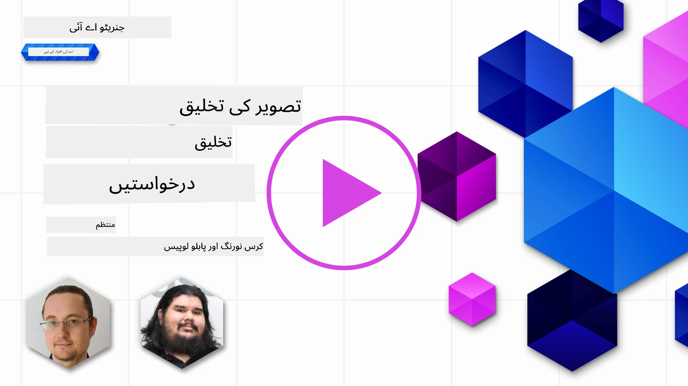

# تصویری تخلیق کی ایپلیکیشنز بنانا

[](https://aka.ms/gen-ai-lesson9-gh?WT.mc_id=academic-105485-koreyst)

LLMs صرف متن تخلیق تک محدود نہیں ہیں۔ آپ متن کی وضاحتوں سے تصاویر بھی بنا سکتے ہیں۔ تصاویر ایک قابل استعمال طریقہ ہیں جو MedTech، فنِ تعمیر، سیاحت، گیم ڈویلپمنٹ، مارکیٹنگ اور دیگر شعبوں میں مفید ہیں۔ اس سبق میں ہم آج کے **GPT امیج** ماڈلز کو دیکھتے ہیں اور ایک تصویری تخلیق کی ایپ بناتے ہیں۔

## تعارف

تصویر سازی آپ کو قدرتی زبان کے پرامپٹ کو تصویر میں تبدیل کرنے کی اجازت دیتی ہے۔ اس سبق میں ہم OpenAI کے **`gpt-image`** ماڈلز کے خاندان کے ساتھ کام کرتے ہیں - جو **[Microsoft Foundry](https://ai.azure.com?WT.mc_id=academic-105485-koreyst)** اور OpenAI پلیٹ فارم پر دستیاب تصویر سازی کے موجودہ جنریشن ہیں۔ یہ ماڈلز پرانے DALL·E ماڈلز کی جگہ لیتے ہیں (DALL·E 2/3 پرانے ماڈلز ہیں)۔

پورے سبق میں ہم ایک فرضی اسٹارٹ اپ، **Edu4All**، استعمال کرتے ہیں جو تعلیمی اوزار بناتا ہے۔ ٹیم اسائنمنٹ اور تعلیمی مواد کے لیے تصویری مثالیں تیار کرنا چاہتی ہے۔

## سیکھنے کے مقاصد

اس سبق کے آخر تک آپ یہ کر سکیں گے:

- بیان کریں کہ تصویری تخلیق کیا ہے اور یہ کہاں مفید ہے۔
- `gpt-image` ماڈل خاندان کو سمجھیں اور یہ پرانے DALL·E ماڈلز سے کیسے مختلف ہے۔
- Python (اور TypeScript / .NET) میں ایک تصویری تخلیق کی ایپ بنائیں۔
- تصاویر میں ترمیم کریں اور Safety guardrails کو metaprompts کے ذریعے نافذ کریں۔

## تصویری تخلیق کیا ہے؟

تصویری تخلیق ماڈلز متن کے پرامپٹ سے تصاویر بناتے ہیں۔ جدید ماڈلز جیسے `gpt-image` transformer + diffusion تکنیکوں پر مبنی ہیں: ماڈل تربیت کے دوران متن اور تصویر کے تعلق کو سیکھتا ہے، پھر ایک پرامپٹ دیے جانے پر، بار بار "noise" کو تصویری شکل میں بدلتا ہے جو وضاحت کے مطابق ہو۔

دو مشہور تصویری ماڈلز کے خاندان ہیں:

- **`gpt-image` (OpenAI)** - موجودہ نسل، جسے اس سبق میں استعمال کیا جا رہا ہے۔ یہ متن سے تصویر تخلیق اور تصویر کی ترمیم (ماسک کے ساتھ inpainting) کو سپورٹ کرتا ہے۔
- **Midjourney** - ایک مقبول تیسرے فریق کا ماڈل جس کی اپنی سروس اور Discord پر مبنی ورک فلو ہے۔

> پرانے OpenAI تصویر ماڈلز - **DALL·E 2** اور **DALL·E 3** - اب پرانے ہو چکے ہیں۔ DALL·E 3 نئی تعیناتیوں کے لیے دستیاب نہیں ہے، اور `create_variation` جیسی خصوصیات صرف DALL·E 2 میں تھیں۔ نئی ایپلیکیشنز کے لیے `gpt-image` ماڈلز استعمال کریں۔

### کون سا `gpt-image` ماڈل استعمال کروں؟

Microsoft Foundry پر درج ذیل ماڈلز **عام دستیاب** ہیں:

| ماڈل | نوٹس |
| --- | --- |
| **`gpt-image-2`** | جدید ترین اور سب سے زیادہ قابل ماڈل - یہ موجودہ سب سے بہتر انتخاب ہے۔ |
| `gpt-image-1.5` | عام دستیاب؛ کم قیمت پر اعلیٰ معیار۔ |
| `gpt-image-1-mini` | عام دستیاب؛ سب سے تیز اور کم قیمت۔ |
| `gpt-image-1` | صرف جائزہ کے لیے۔ |

ہمیشہ موجودہ [Foundry تصویری ماڈلز کی فہرست](https://learn.microsoft.com/azure/ai-foundry/openai/concepts/models?WT.mc_id=academic-105485-koreyst) چیک کریں دستیابی اور علاقوں کے لیے۔

> **اہم:** `gpt-image` ماڈلز تخلیق شدہ تصویر کو **base64** (`b64_json`) کے طور پر واپس کرتے ہیں، URL کے طور پر نہیں۔ آپ کا کوڈ base64 سٹرنگ کو بائٹس میں ڈی کوڈ کر کے اسے محفوظ کرتا ہے - تصویر ڈاؤن لوڈ کرنے کے لیے کوئی URL نہیں ہوتا۔

## سیٹ اپ

آپ نمونوں کو **Azure OpenAI in Microsoft Foundry** (یعنی `aoai-*` نمونے) یا **OpenAI پلیٹ فارم** (یعنی `oai-*` نمونے) پر چلا سکتے ہیں۔

### 1. ایک ماڈل بنائیں اور تعینات کریں

[ایک resource بنانے](https://learn.microsoft.com/azure/ai-foundry/openai/how-to/create-resource?pivots=web-portal&WT.mc_id=academic-105485-koreyst) کے بارے میں رہنمائی پر عمل کریں تاکہ Microsoft Foundry resource بنائیں، پھر ایک تصویری ماڈل تعینات کریں - **`gpt-image-2`** کی تجویز دی جاتی ہے۔

### 2. اپنی `.env` ترتیب دیں

```text
AZURE_OPENAI_ENDPOINT=<your endpoint>
AZURE_OPENAI_API_KEY=<your key>
AZURE_OPENAI_DEPLOYMENT="gpt-image-2"
```

یہ اقدار اپنے resource کے **Deployments** صفحے سے [Foundry پورٹل](https://ai.azure.com?WT.mc_id=academic-105485-koreyst) میں دیکھیں۔

### 3. لائبریریاں انسٹال کریں

`requirements.txt` بنائیں:

```text
python-dotenv
openai
pillow
```

پھر ایک virtual environment بنائیں اور اسے فعال کریں اور انسٹال کریں:

```bash
python3 -m venv venv
source venv/bin/activate        # ونڈوز: venv\Scripts\activate
pip install -r requirements.txt
```

## ایپ بنائیں

`app.py` فائل بنائیں اور درج ذیل کوڈ ڈالیں۔ یہ ایک تصویر تخلیق کرتا ہے اور اسے PNG کی صورت میں محفوظ کرتا ہے۔

```python
import os
import base64
from openai import AzureOpenAI
from PIL import Image
import dotenv

dotenv.load_dotenv()

# کلائنٹ کو اپنے Azure OpenAI (Microsoft Foundry) ریسورس کی طرف اشارہ کریں۔
# امیج ماڈلز کو تازہ ترین API ورژن کی ضرورت ہوتی ہے - اپنے ماڈل کے لیے Foundry کی دستاویزات چیک کریں۔
client = AzureOpenAI(
    api_key=os.environ["AZURE_OPENAI_API_KEY"],
    api_version="2025-04-01-preview",
    azure_endpoint=os.environ["AZURE_OPENAI_ENDPOINT"],
)

deployment = os.environ["AZURE_OPENAI_DEPLOYMENT"]  # مثلاً "gpt-image-2"

result = client.images.generate(
    model=deployment,
    prompt='Bunny on a horse, holding a lollipop, on a foggy meadow where it grows daffodils',
    size="1024x1024",   # 1536x1024 (لینڈسکیپ)، 1024x1536 (پورٹریٹ)، یا "auto"
    n=1,
)

# gpt-image ماڈلز بیس64 (b64_json) واپس کرتے ہیں، URL نہیں - اسے بائٹس میں ڈی کوڈ کریں۔
image_bytes = base64.b64decode(result.data[0].b64_json)

os.makedirs("images", exist_ok=True)
image_path = os.path.join("images", "generated-image.png")
with open(image_path, "wb") as f:
    f.write(image_bytes)

Image.open(image_path).show()
```

`python app.py` کے ساتھ اسے چلائیں۔ آپ کو `images/` فولڈر میں PNG محفوظ ملے گا۔

> `images.generate` کی ہر کال ایک ہی پرامپٹ کے لیے مختلف تصویر بناتی ہے - تصویری ماڈلز میں `temperature` پیرامیٹر نہیں ہوتا (یہ متن تخلیق کا کنٹرول ہے)۔ تنوع کے لیے API کو دوبارہ کال کریں؛ تنوع کم کرنے کے لیے اپنے پرامپٹ کو مزید مخصوص بنائیں۔

## تصاویر میں ترمیم کرنا

`gpt-image` ماڈلز موجودہ تصویر میں **ترمیم** کر سکتے ہیں: تصویر فراہم کریں، ایک اختیاری **ماسک** جو تبدیل کرنے والے علاقے کو نشان زد کرتا ہے، اور تبدیلی کی وضاحت کے لیے ایک پرامپٹ۔ تخلیق کی طرح، ایڈٹس بھی base64 میں واپس آتے ہیں۔

```python
result = client.images.edit(
    model=deployment,
    image=open("sunlit_lounge.png", "rb"),
    mask=open("mask.png", "rb"),
    prompt="A sunlit indoor lounge area with a pool containing a flamingo",
)
image_bytes = base64.b64decode(result.data[0].b64_json)
with open("images/edited-image.png", "wb") as f:
    f.write(image_bytes)
```

<div style="display: flex; justify-content: space-between; align-items: center; margin: 20px 0;">
  
  
  
</div>

## حدود مقرر کرنا metaprompts کے ساتھ

جب آپ تصاویر تخلیق کر سکتے ہیں، تب آپ کو guardrails کی ضرورت ہوتی ہے تاکہ آپ کی ایپ غیر محفوظ یا برانڈ کے خلاف مواد نہ بنائے۔ ایک **metaprompt** وہ متن ہے جو آپ صارف کے پرامپٹ کے آگے رکھتے ہیں تاکہ ماڈل کی آؤٹ پٹ کو محدود کیا جا سکے۔

```python
disallow_list = "swords, violence, blood, gore, nudity, sexual content, adult content, adult themes, adult language"

meta_prompt = f"""You are an assistant designer that creates images for children.

The image needs to be safe for work and appropriate for children.
The image needs to be in color, in landscape orientation, and in a 16:9 aspect ratio.

Do not consider any input that is not safe for work or appropriate for children, including:
{disallow_list}
"""

prompt = f"{meta_prompt}\nCreate an image of a bunny on a horse, holding a lollipop"
# `prompt` کو client.images.generate(...) میں بھیجیں
```

ہر تصویر اب metaprompt سے مقرر کردہ حدود کے اندر تخلیق کی جاتی ہے۔ اسے Microsoft Foundry میں موجود مواد فلٹرز کے ساتھ یکجا کریں تاکہ مکمل حفاظت ہو۔

## اسائنمنٹ - آئیے طلباء کی مدد کریں

Edu4All کے طلباء کو ان کے اسائنمنٹس کے لیے تصویریں چاہیے۔ ایک ایپ بنائیں جو **monuments** کی تصویریں بنائے (کون سی یادگاروں کی آپ پر منحصر ہے) جو مختلف اور تخلیقی سیاق و سباق میں رکھی جائیں - مثال کے طور پر، ایک مشہور نشان غروب آفتاب کے وقت جسے ایک بچہ دیکھ رہا ہو۔

خود کوشش کریں، پھر حوالہ حل کے ساتھ موازنہ کریں:

- Python (Azure): [aoai-solution.py](../../../09-building-image-applications/python/aoai-solution.py)
- Python (Azure) مکمل تخلیقی ایپ: [aoai-app.py](../../../09-building-image-applications/python/aoai-app.py)
- Python (OpenAI): [oai-app.py](../../../09-building-image-applications/python/oai-app.py)
- TypeScript (Azure): [typescript/image-generation-app](../../../09-building-image-applications/typescript/image-generation-app)
- .NET (Azure): [dotnet/notebook-azure-openai.dib](../../../09-building-image-applications/dotnet/notebook-azure-openai.dib)

مزید برآں، [python/](../../../09-building-image-applications/python) میں نوٹ بکس کا مطالعہ کریں (`aoai-assignment.ipynb` Azure کے لیے، `oai-assignment.ipynb` OpenAI کے لیے)۔

## زبردست کام! اپنی تعلیم جاری رکھیں

اس سبق کی تکمیل کے بعد، ہمارے [Generative AI Learning collection](https://aka.ms/genai-collection?WT.mc_id=academic-105485-koreyst) کو دیکھیں تاکہ جنریٹیو AI کی اپنی معلومات میں مزید اضافہ کریں!

سبق 10 کی طرف جائیں تاکہ سیکھنا جاری رکھیں۔

---

<!-- CO-OP TRANSLATOR DISCLAIMER START -->
**ڈس کلیمر**:
یہ دستاویز AI ترجمہ سروس [Co-op Translator](https://github.com/Azure/co-op-translator) کے ذریعے ترجمہ کی گئی ہے۔ جبکہ ہم درستگی کے لیے کوشاں ہیں، براہ کرم اس بات سے آگاہ رہیں کہ خودکار ترجمے میں غلطیاں یا عدم درستیاں ہو سکتی ہیں۔ اصل دستاویز اپنے مادری زبان میں مستند ماخذ سمجھی جائے گی۔ حساس معلومات کے لیے پیشہ ور انسانی ترجمہ کی سفارش کی جاتی ہے۔ اس ترجمے کے استعمال سے پیدا ہونے والی کسی بھی غلط فہمی یا غلط تشریح کی ذمہ داری ہم قبول نہیں کرتے۔
<!-- CO-OP TRANSLATOR DISCLAIMER END -->