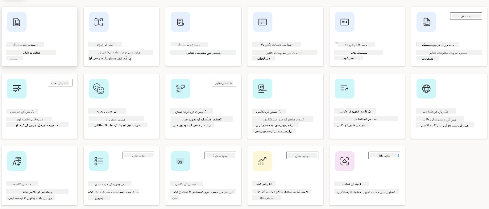
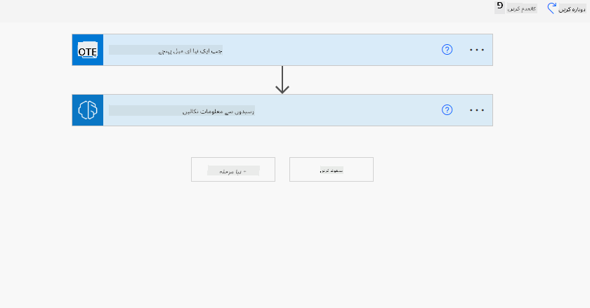
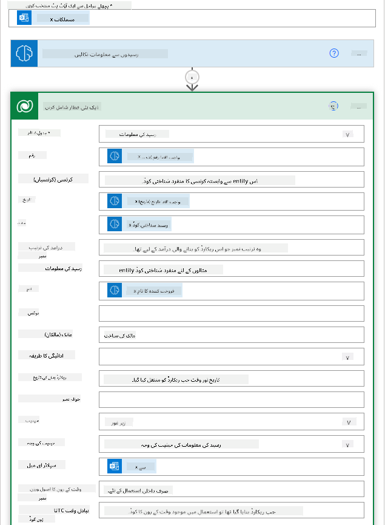
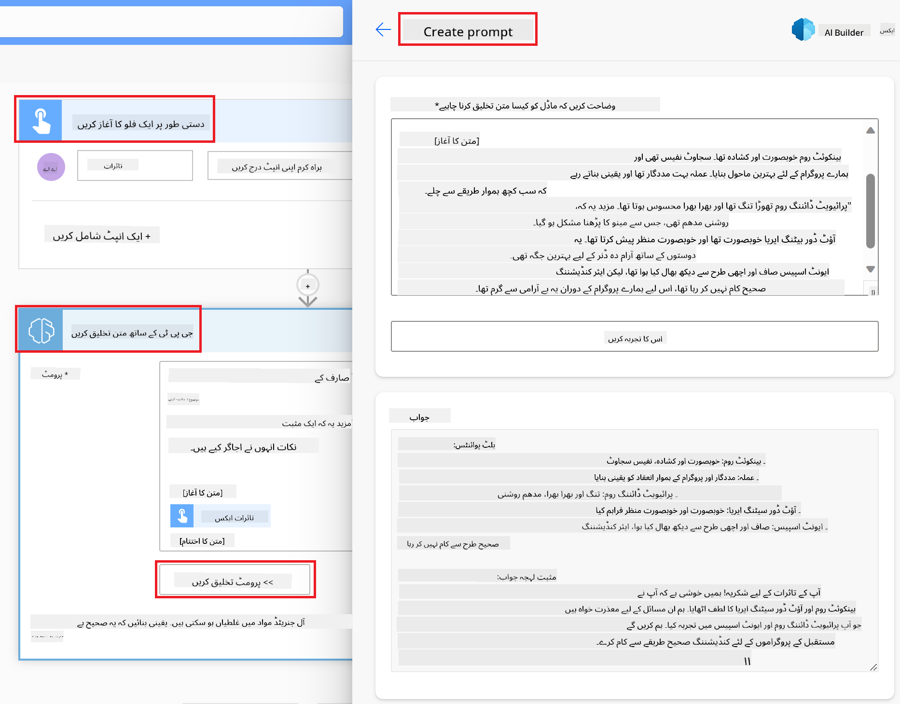

<!--
CO_OP_TRANSLATOR_METADATA:
{
  "original_hash": "f5ff3b6204a695a117d6f452403c95f7",
  "translation_date": "2025-05-19T19:41:01+00:00",
  "source_file": "10-building-low-code-ai-applications/README.md",
  "language_code": "ur"
}
-->
# کم کوڈ اے آئی ایپلیکیشنز بنانا

## تعارف

اب جب کہ ہم نے امیج بنانے والی ایپلیکیشنز بنانا سیکھ لیا ہے، آئیے کم کوڈ کے بارے میں بات کرتے ہیں۔ جنریٹو اے آئی مختلف شعبوں میں استعمال ہو سکتا ہے، جن میں کم کوڈ بھی شامل ہے، لیکن کم کوڈ کیا ہے اور ہم اس میں اے آئی کو کیسے شامل کر سکتے ہیں؟

کم کوڈ ڈیولپمنٹ پلیٹ فارمز کی مدد سے روایتی ڈیولپرز اور غیر ڈیولپرز کے لیے ایپس اور سلوشنز بنانا آسان ہو گیا ہے۔ کم کوڈ ڈیولپمنٹ پلیٹ فارمز آپ کو بغیر یا بہت کم کوڈ کے ایپس اور سلوشنز بنانے کی سہولت دیتے ہیں۔ یہ ایک بصری ڈیولپمنٹ ماحول فراہم کرکے حاصل کیا جاتا ہے جو آپ کو ایپس اور سلوشنز بنانے کے لیے اجزاء کو ڈریگ اور ڈراپ کرنے کی اجازت دیتا ہے۔ اس سے آپ کو تیزی سے اور کم وسائل کے ساتھ ایپس اور سلوشنز بنانے میں مدد ملتی ہے۔ اس سبق میں، ہم دیکھیں گے کہ کم کوڈ کو کیسے استعمال کیا جائے اور پاور پلیٹ فارم کے ذریعے کم کوڈ ڈیولپمنٹ کو اے آئی کے ساتھ کیسے بہتر بنایا جائے۔

پاور پلیٹ فارم تنظیموں کو اپنے ٹیموں کو ایک بدیہی کم کوڈ یا بغیر کوڈ کے ماحول کے ذریعے اپنے حل بنانے کا موقع فراہم کرتا ہے۔ یہ ماحول حل بنانے کے عمل کو آسان بناتا ہے۔ پاور پلیٹ فارم کے ساتھ، حل دنوں یا ہفتوں میں بنائے جا سکتے ہیں بجائے مہینوں یا سالوں کے۔ پاور پلیٹ فارم میں پانچ کلیدی پروڈکٹس شامل ہیں: پاور ایپس، پاور آٹومیٹ، پاور بی آئی، پاور پیجز اور کوپائلٹ اسٹوڈیو۔

یہ سبق شامل کرتا ہے:

- پاور پلیٹ فارم میں جنریٹو اے آئی کا تعارف
- کوپائلٹ کا تعارف اور اس کا استعمال کیسے کریں
- پاور پلیٹ فارم میں جنریٹو اے آئی کا استعمال کرتے ہوئے ایپس اور فلو بنانا
- اے آئی بلڈر کے ساتھ پاور پلیٹ فارم میں اے آئی ماڈلز کو سمجھنا

## سیکھنے کے مقاصد

اس سبق کے آخر تک، آپ قابل ہو جائیں گے:

- پاور پلیٹ فارم میں کوپائلٹ کیسے کام کرتا ہے اسے سمجھنا۔

- ہمارے تعلیمی سٹارٹ اپ کے لیے ایک اسٹوڈنٹ اسائنمنٹ ٹریکر ایپ بنانا۔

- انوائس پروسیسنگ فلو بنانا جو انوائسز سے معلومات نکالنے کے لیے اے آئی کا استعمال کرتا ہے۔

- جی پی ٹی اے آئی ماڈل کے ساتھ ٹیکسٹ تخلیق کرتے وقت بہترین طریقے اپنانا۔

آپ اس سبق میں جو ٹولز اور ٹیکنالوجیز استعمال کریں گے وہ ہیں:

- **پاور ایپس**، اسٹوڈنٹ اسائنمنٹ ٹریکر ایپ کے لیے، جو ایپس بنانے کے لیے کم کوڈ ڈیولپمنٹ ماحول فراہم کرتا ہے تاکہ ڈیٹا کو ٹریک، مینج اور انٹریکٹ کیا جا سکے۔

- **ڈیٹا ورس**، اسٹوڈنٹ اسائنمنٹ ٹریکر ایپ کے ڈیٹا کو اسٹور کرنے کے لیے جہاں ڈیٹا ورس ایپ کے ڈیٹا کو اسٹور کرنے کے لیے کم کوڈ ڈیٹا پلیٹ فارم فراہم کرے گا۔

- **پاور آٹومیٹ**، انوائس پروسیسنگ فلو کے لیے جہاں آپ کے پاس انوائس پروسیسنگ کے عمل کو خودکار بنانے کے لیے ورک فلو بنانے کے لیے کم کوڈ ڈیولپمنٹ ماحول ہوگا۔

- **اے آئی بلڈر**، انوائس پروسیسنگ اے آئی ماڈل کے لیے جہاں آپ ہمارے سٹارٹ اپ کے لیے انوائسز کو پروسیس کرنے کے لیے پہلے سے بنے ہوئے اے آئی ماڈلز کا استعمال کریں گے۔

## پاور پلیٹ فارم میں جنریٹو اے آئی

کم کوڈ ڈیولپمنٹ اور ایپلیکیشن کو جنریٹو اے آئی کے ساتھ بہتر بنانا پاور پلیٹ فارم کے لیے ایک اہم توجہ کا علاقہ ہے۔ مقصد یہ ہے کہ ہر کسی کو اے آئی سے چلنے والی ایپس، سائٹس، ڈیش بورڈز بنانے اور عمل کو خودکار کرنے کے قابل بنانا، _بغیر کسی ڈیٹا سائنس کی مہارت کے_۔ یہ مقصد پاور پلیٹ فارم میں کوپائلٹ اور اے آئی بلڈر کی شکل میں جنریٹو اے آئی کو کم کوڈ ڈیولپمنٹ کے تجربے میں ضم کرکے حاصل کیا جاتا ہے۔

### یہ کیسے کام کرتا ہے؟

کوپائلٹ ایک اے آئی اسسٹنٹ ہے جو آپ کو اپنی ضروریات کو قدرتی زبان میں بات چیت کے مراحل کے ذریعے بیان کر کے پاور پلیٹ فارم کے حل بنانے کی اجازت دیتا ہے۔ آپ، مثال کے طور پر، اپنے اے آئی اسسٹنٹ کو ہدایت دے سکتے ہیں کہ آپ کی ایپ کن فیلڈز کا استعمال کرے گی اور یہ ایپ اور بنیادی ڈیٹا ماڈل دونوں کو بنا دے گی یا آپ پاور آٹومیٹ میں فلو کیسے سیٹ اپ کرنا ہے یہ بتا سکتے ہیں۔

آپ اپنے ایپ اسکرینز میں ایک فیچر کے طور پر کوپائلٹ سے چلنے والی فعالیتوں کو استعمال کر سکتے ہیں تاکہ صارفین کو بات چیت کے ذریعے بصیرت حاصل کرنے کے قابل بنایا جا سکے۔

اے آئی بلڈر پاور پلیٹ فارم میں دستیاب ایک کم کوڈ اے آئی قابلیت ہے جو آپ کو اے آئی ماڈلز کا استعمال کرنے کی اجازت دیتا ہے تاکہ آپ کو عمل کو خودکار بنانے اور نتائج کی پیش گوئی کرنے میں مدد مل سکے۔ اے آئی بلڈر کے ساتھ آپ اپنے ڈیٹا کو ڈیٹا ورس یا مختلف کلاؤڈ ڈیٹا ذرائع، جیسے شیئرپوائنٹ، ون ڈرائیو یا ایزور میں جوڑنے والی ایپس اور فلو میں اے آئی لا سکتے ہیں۔

کوپائلٹ پاور پلیٹ فارم کی تمام مصنوعات میں دستیاب ہے: پاور ایپس، پاور آٹومیٹ، پاور بی آئی، پاور پیجز اور پاور ورچوئل ایجنٹس۔ اے آئی بلڈر پاور ایپس اور پاور آٹومیٹ میں دستیاب ہے۔ اس سبق میں، ہم اپنے تعلیمی سٹارٹ اپ کے لیے حل بنانے کے لیے پاور ایپس اور پاور آٹومیٹ میں کوپائلٹ اور اے آئی بلڈر کو استعمال کرنے پر توجہ مرکوز کریں گے۔

### پاور ایپس میں کوپائلٹ

پاور پلیٹ فارم کے حصے کے طور پر، پاور ایپس ڈیٹا کو ٹریک، مینج اور انٹریکٹ کرنے کے لیے ایپس بنانے کے لیے ایک کم کوڈ ڈیولپمنٹ ماحول فراہم کرتا ہے۔ یہ ایپ ڈیولپمنٹ سروسز کا ایک مجموعہ ہے جس میں ایک اسکیل ایبل ڈیٹا پلیٹ فارم اور کلاؤڈ سروسز اور آن پرمائز ڈیٹا سے جڑنے کی صلاحیت ہے۔ پاور ایپس آپ کو ایسی ایپس بنانے کی اجازت دیتا ہے جو براؤزرز، ٹیبلٹس اور فونز پر چلتی ہیں اور انہیں ساتھی کارکنوں کے ساتھ شیئر کیا جا سکتا ہے۔ پاور ایپس صارفین کو ایپ ڈیولپمنٹ میں ایک سادہ انٹرفیس کے ساتھ آسانی فراہم کرتا ہے، تاکہ ہر کاروباری صارف یا پرو ڈیولپر اپنی مرضی کی ایپس بنا سکے۔ ایپ ڈیولپمنٹ کے تجربے کو بھی جنریٹو اے آئی کے ذریعے کوپائلٹ کے ساتھ بہتر بنایا گیا ہے۔

پاور ایپس میں کوپائلٹ اے آئی اسسٹنٹ فیچر آپ کو یہ بیان کرنے کی اجازت دیتا ہے کہ آپ کو کس قسم کی ایپ کی ضرورت ہے اور آپ کی ایپ کو کون سی معلومات ٹریک، جمع یا دکھانی چاہیے۔ کوپائلٹ آپ کی وضاحت کی بنیاد پر ایک ذمہ دار کینوس ایپ بناتا ہے۔ آپ پھر اپنی ضروریات کو پورا کرنے کے لیے ایپ کو اپنی مرضی کے مطابق بنا سکتے ہیں۔ اے آئی کوپائلٹ آپ کو ڈیٹا اسٹور کرنے کے لیے درکار فیلڈز کے ساتھ ڈیٹا ورس ٹیبل بھی تیار کرتا ہے اور کچھ نمونہ ڈیٹا تجویز کرتا ہے۔ ہم دیکھیں گے کہ ڈیٹا ورس کیا ہے اور آپ اسے پاور ایپس میں کیسے استعمال کر سکتے ہیں اس سبق میں آگے۔ آپ پھر بات چیت کے مراحل کے ذریعے اے آئی کوپائلٹ اسسٹنٹ فیچر کا استعمال کرتے ہوئے ٹیبل کو اپنی ضروریات کے مطابق بنا سکتے ہیں۔ یہ فیچر پاور ایپس کے ہوم اسکرین سے آسانی سے دستیاب ہے۔

### پاور آٹومیٹ میں کوپائلٹ

پاور پلیٹ فارم کے حصے کے طور پر، پاور آٹومیٹ صارفین کو ایپلیکیشنز اور سروسز کے درمیان خودکار ورک فلو بنانے کی اجازت دیتا ہے۔ یہ مواصلات، ڈیٹا اکٹھا کرنے، اور فیصلوں کی منظوری جیسے بار بار ہونے والے کاروباری عمل کو خودکار بنانے میں مدد کرتا ہے۔ اس کا سادہ انٹرفیس ہر تکنیکی قابلیت کے حامل صارفین (ابتدائی سے لے کر تجربہ کار ڈویلپرز تک) کو کام کے کاموں کو خودکار بنانے کی اجازت دیتا ہے۔ ورک فلو ڈیولپمنٹ کے تجربے کو بھی جنریٹو اے آئی کے ذریعے کوپائلٹ کے ساتھ بہتر بنایا گیا ہے۔

پاور آٹومیٹ میں کوپائلٹ اے آئی اسسٹنٹ فیچر آپ کو یہ بیان کرنے کی اجازت دیتا ہے کہ آپ کو کس قسم کے فلو کی ضرورت ہے اور آپ چاہتے ہیں کہ آپ کا فلو کیا اقدامات کرے۔ کوپائلٹ آپ کی وضاحت کی بنیاد پر ایک فلو تیار کرتا ہے۔ آپ پھر اپنی ضروریات کو پورا کرنے کے لیے فلو کو اپنی مرضی کے مطابق بنا سکتے ہیں۔ اے آئی کوپائلٹ آپ کو وہ اقدامات بھی تجویز کرتا ہے جن کی آپ کو خودکار بنانے کے لیے درکار کام کرنے کی ضرورت ہوتی ہے۔ ہم دیکھیں گے کہ فلو کیا ہیں اور آپ انہیں پاور آٹومیٹ میں کیسے استعمال کر سکتے ہیں اس سبق میں آگے۔ آپ پھر بات چیت کے مراحل کے ذریعے اے آئی کوپائلٹ اسسٹنٹ فیچر کا استعمال کرتے ہوئے اقدامات کو اپنی ضروریات کے مطابق بنا سکتے ہیں۔ یہ فیچر پاور آٹومیٹ کے ہوم اسکرین سے آسانی سے دستیاب ہے۔

## اسائنمنٹ: ہمارے سٹارٹ اپ کے لیے کوپائلٹ کا استعمال کرتے ہوئے طالب علم کے اسائنمنٹس اور انوائسز کا نظم کریں

ہمارا سٹارٹ اپ طلباء کو آن لائن کورسز فراہم کرتا ہے۔ سٹارٹ اپ تیزی سے بڑھا ہے اور اب اپنے کورسز کی طلب کو پورا کرنے میں مشکل کا سامنا کر رہا ہے۔ سٹارٹ اپ نے آپ کو پاور پلیٹ فارم ڈویلپر کے طور پر ان کی مدد کرنے کے لیے کم کوڈ حل بنانے کے لیے رکھا ہے تاکہ وہ اپنے طالب علم کے اسائنمنٹس اور انوائسز کا انتظام کر سکیں۔ ان کے حل کو ایپ کے ذریعے طالب علم کے اسائنمنٹس کو ٹریک اور منظم کرنے اور ورک فلو کے ذریعے انوائس پروسیسنگ کے عمل کو خودکار کرنے کے قابل ہونا چاہیے۔ آپ سے کہا گیا ہے کہ اس حل کو تیار کرنے کے لیے جنریٹو اے آئی کا استعمال کریں۔

جب آپ کوپائلٹ کا استعمال شروع کر رہے ہیں، تو آپ پرامپٹس کے ساتھ ایپس اور فلو بنانے کے لیے [پاور پلیٹ فارم کوپائلٹ پرامپٹ لائبریری](https://github.com/pnp/powerplatform-prompts?WT.mc_id=academic-109639-somelezediko) کا استعمال کر سکتے ہیں۔ اس لائبریری میں پرامپٹس کی فہرست شامل ہے جسے آپ کوپائلٹ کے ساتھ ایپس اور فلو بنانے کے لیے استعمال کر سکتے ہیں۔ آپ کوپائلٹ کے لیے اپنی ضروریات کو بیان کرنے کے طریقے کے بارے میں خیال حاصل کرنے کے لیے لائبریری میں پرامپٹس کا بھی استعمال کر سکتے ہیں۔

### ہمارے سٹارٹ اپ کے لیے اسٹوڈنٹ اسائنمنٹ ٹریکر ایپ بنائیں

ہمارے سٹارٹ اپ کے اساتذہ طلباء کے اسائنمنٹس کو ٹریک کرنے میں مشکلات کا سامنا کر رہے ہیں۔ وہ اسائنمنٹس کو ٹریک کرنے کے لیے ایک اسپریڈ شیٹ کا استعمال کر رہے ہیں لیکن یہ طلباء کی تعداد بڑھنے کے ساتھ مشکل ہو گیا ہے۔ انہوں نے آپ سے کہا ہے کہ ایک ایپ بنائیں جو انہیں طلباء کے اسائنمنٹس کو ٹریک اور منظم کرنے میں مدد دے۔ ایپ انہیں نئے اسائنمنٹس شامل کرنے، اسائنمنٹس دیکھنے، اسائنمنٹس کو اپ ڈیٹ کرنے اور اسائنمنٹس کو حذف کرنے کی اجازت دے۔ ایپ اساتذہ اور طلباء کو ان اسائنمنٹس کو دیکھنے کی اجازت بھی دے جو گریڈ کیے گئے ہیں اور وہ جو گریڈ نہیں کیے گئے ہیں۔

آپ پاور ایپس میں کوپائلٹ کا استعمال کرتے ہوئے نیچے دیے گئے مراحل پر عمل کرتے ہوئے ایپ بنائیں گے:

1. [پاور ایپس](https://make.powerapps.com?WT.mc_id=academic-105485-koreyst) کے ہوم اسکرین پر جائیں۔

1. ہوم اسکرین پر موجود ٹیکسٹ ایریا کا استعمال کرتے ہوئے اس ایپ کو بیان کریں جو آپ بنانا چاہتے ہیں۔ مثال کے طور پر، **_میں ایک ایپ بنانا چاہتا ہوں جو طلباء کے اسائنمنٹس کو ٹریک اور منظم کرے_**۔ پرامپٹ کو اے آئی کوپائلٹ کو بھیجنے کے لیے **بھیجیں** بٹن پر کلک کریں۔

1. اے آئی کوپائلٹ آپ کو ڈیٹا اسٹور کرنے کے لیے درکار فیلڈز کے ساتھ ڈیٹا ورس ٹیبل تجویز کرے گا اور کچھ نمونہ ڈیٹا۔ آپ پھر بات چیت کے مراحل کے ذریعے اے آئی کوپائلٹ اسسٹنٹ فیچر کا استعمال کرتے ہوئے ٹیبل کو اپنی ضروریات کے مطابق بنا سکتے ہیں۔

   > **اہم**: ڈیٹا ورس پاور پلیٹ فارم کے لیے بنیادی ڈیٹا پلیٹ فارم ہے۔ یہ ایپ کے ڈیٹا کو اسٹور کرنے کے لیے ایک کم کوڈ ڈیٹا پلیٹ فارم ہے۔ یہ ایک مکمل طور پر منظم سروس ہے جو مائیکروسافٹ کلاؤڈ میں ڈیٹا کو محفوظ طریقے سے اسٹور کرتی ہے اور آپ کے پاور پلیٹ فارم ماحول کے اندر فراہم کی جاتی ہے۔ اس کے ساتھ ڈیٹا گورننس کی صلاحیتیں بھی شامل ہیں، جیسے کہ ڈیٹا کی درجہ بندی، ڈیٹا نسب، باریک بینی سے رسائی کا کنٹرول، اور مزید۔ آپ ڈیٹا ورس کے بارے میں مزید [یہاں](https://docs.microsoft.com/powerapps/maker/data-platform/data-platform-intro?WT.mc_id=academic-109639-somelezediko) سیکھ سکتے ہیں۔

1. اساتذہ طلباء کو ان کے اسائنمنٹس کی پیشرفت کے بارے میں اپ ڈیٹ رکھنے کے لیے ان طلباء کو ای میل بھیجنا چاہتے ہیں جنہوں نے اپنے اسائنمنٹس جمع کرائے ہیں۔ آپ کوپائلٹ کا استعمال کرتے ہوئے طالب علم کے ای میل کو اسٹور کرنے کے لیے ٹیبل میں ایک نیا فیلڈ شامل کر سکتے ہیں۔ مثال کے طور پر، آپ ٹیبل میں ایک نیا فیلڈ شامل کرنے کے لیے درج ذیل پرامپٹ کا استعمال کر سکتے ہیں: **_میں طالب علم کے ای میل کو اسٹور کرنے کے لیے ایک کالم شامل کرنا چاہتا ہوں_**۔ پرامپٹ کو اے آئی کوپائلٹ کو بھیجنے کے لیے **بھیجیں** بٹن پر کلک کریں۔

1. اے آئی کوپائلٹ ایک نیا فیلڈ تیار کرے گا اور آپ پھر اپنی ضروریات کو پورا کرنے کے لیے فیلڈ کو اپنی مرضی کے مطابق بنا سکتے ہیں۔

1. ٹیبل کے ساتھ کام مکمل ہونے کے بعد، ایپ بنانے کے لیے **ایپ بنائیں** بٹن پر کلک کریں۔

1. اے آئی کوپائلٹ آپ کی وضاحت کی بنیاد پر ایک ذمہ دار کینوس ایپ بنائے گا۔ آپ پھر اپنی ضروریات کو پورا کرنے کے لیے ایپ کو اپنی مرضی کے مطابق بنا سکتے ہیں۔

1. اساتذہ کو طلباء کو ای میل بھیجنے کے لیے، آپ کوپائلٹ کا استعمال کرتے ہوئے ایپ میں ایک نئی اسکرین شامل کر سکتے ہیں۔ مثال کے طور پر، آپ ایپ میں ایک نئی اسکرین شامل کرنے کے لیے درج ذیل پرامپٹ کا استعمال کر سکتے ہیں: **_میں طلباء کو ای میل بھیجنے کے لیے ایک اسکرین شامل کرنا چاہتا ہوں_**۔ پرامپٹ کو اے آئی کوپائلٹ کو بھیجنے کے لیے **بھیجیں** بٹن پر کلک کریں۔

1. اے آئی کوپائلٹ ایک نئی اسکرین تیار کرے گا اور آپ پھر اپنی ضروریات کو پورا کرنے کے لیے اسکرین کو اپنی مرضی کے مطابق بنا سکتے ہیں۔

1. ایپ کے ساتھ کام مکمل ہونے کے بعد، ایپ کو محفوظ کرنے کے لیے **محفوظ کریں** بٹن پر کلک کریں۔

1. ایپ کو اساتذہ کے ساتھ شیئر کرنے کے لیے، **شیئر کریں** بٹن پر کلک کریں اور پھر دوبارہ **شیئر کریں** بٹن پر کلک کریں۔ آپ پھر ان کے ای میل ایڈریس درج کرکے ایپ کو اساتذہ کے ساتھ شیئر کر سکتے ہیں۔

> **آپ کا ہوم ورک**: آپ نے ابھی جو ایپ بنائی ہے وہ ایک اچھی شروعات ہے لیکن اسے بہتر بنایا جا سکتا ہے۔ ای میل فیچر کے ساتھ، اساتذہ صرف طلباء کو ای میلز بھیج سکتے ہیں جنہیں اپنے ای میلز ٹائپ کرنے کی ضرورت ہوتی ہے۔ کیا آپ کوپائلٹ کا استعمال کرتے ہوئے ایک آٹومیشن بنا سکتے ہیں جو اساتذہ کو خود بخود ای میل بھیجنے کے قابل بنائے جب وہ اپنے اسائنمنٹس جمع کرائیں؟ آپ کا اشارہ یہ ہے کہ صحیح پرامپٹ کے ساتھ آپ پاور آٹومیٹ میں کوپائلٹ کا استعمال کر کے یہ بنا سکتے ہیں۔

### ہمارے سٹارٹ اپ کے لیے انوائسز کی معلومات کے لیے ٹیبل بنائیں

ہمارے سٹارٹ اپ کی مالیاتی ٹیم انوائسز کو ٹریک کرنے میں مشکلات کا سامنا کر رہی ہے۔ وہ انوائسز کو ٹریک کرنے کے لیے ایک اسپریڈ شیٹ کا استعمال کر رہے ہیں لیکن یہ انوائسز کی تعداد بڑھنے کے ساتھ مشکل ہو گیا ہے۔ انہوں نے آپ سے کہا ہے کہ ایک ٹیبل بنائیں جو انہیں موصول ہونے والی انوائس
ایک متن۔ - **جذبات کا تجزیہ**: یہ ماڈل متن میں مثبت، منفی، غیر جانبدار یا ملا جلا جذبات کا پتہ لگاتا ہے۔ - **بزنس کارڈ ریڈر**: یہ ماڈل بزنس کارڈز سے معلومات نکالتا ہے۔ - **متن کی شناخت**: یہ ماڈل تصاویر سے متن نکالتا ہے۔ - **آبجیکٹ ڈیٹیکشن**: یہ ماڈل تصاویر سے اشیاء کا پتہ لگاتا اور نکالتا ہے۔ - **دستاویز کی پروسیسنگ**: یہ ماڈل فارم سے معلومات نکالتا ہے۔ - **انوائس پروسیسنگ**: یہ ماڈل انوائسز سے معلومات نکالتا ہے۔ کسٹم AI ماڈلز کے ساتھ آپ اپنا ماڈل AI بلڈر میں لا سکتے ہیں تاکہ یہ کسی بھی AI بلڈر کسٹم ماڈل کی طرح کام کر سکے، جس سے آپ اپنے ڈیٹا کا استعمال کرتے ہوئے ماڈل کو تربیت دے سکیں۔ آپ ان ماڈلز کو عمل کو خودکار بنانے اور پاور ایپس اور پاور آٹومیٹ دونوں میں نتائج کی پیش گوئی کرنے کے لیے استعمال کر سکتے ہیں۔ جب آپ اپنا ماڈل استعمال کرتے ہیں تو کچھ پابندیاں لاگو ہوتی ہیں۔ ان پابندیوں کے بارے میں مزید پڑھیں [limitations](https://learn.microsoft.com/ai-builder/byo-model#limitations?WT.mc_id=academic-105485-koreyst)۔ 

## اسائنمنٹ #2 - ہماری اسٹارٹ اپ کے لیے انوائس پروسیسنگ فلو بنائیں

مالیاتی ٹیم انوائسز کو پروسیس کرنے میں مشکلات کا سامنا کر رہی ہے۔ انہوں نے انوائسز کو ٹریک کرنے کے لیے اسپریڈشیٹ کا استعمال کیا ہے لیکن جیسے جیسے انوائسز کی تعداد میں اضافہ ہوا ہے، اسے منظم کرنا مشکل ہو گیا ہے۔ انہوں نے آپ سے درخواست کی ہے کہ آپ ایک ورک فلو بنائیں جو انہیں AI کے استعمال سے انوائسز کو پروسیس کرنے میں مدد دے۔ ورک فلو انہیں انوائسز سے معلومات نکالنے اور ڈیٹا ورس ٹیبل میں معلومات ذخیرہ کرنے کے قابل بنانا چاہیے۔ ورک فلو انہیں نکالی گئی معلومات کے ساتھ مالیاتی ٹیم کو ای میل بھیجنے کے قابل بھی بنانا چاہیے۔ اب جب کہ آپ جانتے ہیں کہ AI بلڈر کیا ہے اور آپ کو اسے کیوں استعمال کرنا چاہیے، آئیے دیکھتے ہیں کہ آپ انوائس پروسیسنگ AI ماڈل کو AI بلڈر میں کیسے استعمال کر سکتے ہیں، جس کا ہم نے پہلے ذکر کیا تھا، تاکہ ایک ورک فلو بنایا جا سکے جو مالیاتی ٹیم کو انوائسز پروسیس کرنے میں مدد دے۔ انوائس پروسیسنگ AI ماڈل کو AI بلڈر میں استعمال کرتے ہوئے مالیاتی ٹیم کو انوائسز پروسیس کرنے میں مدد دینے والا ورک فلو بنانے کے لیے نیچے دیے گئے مراحل پر عمل کریں:

1. [پاور آٹومیٹ](https://make.powerautomate.com?WT.mc_id=academic-105485-koreyst) ہوم اسکرین پر جائیں۔
2. ہوم اسکرین پر موجود ٹیکسٹ ایریا کا استعمال کریں تاکہ آپ جو ورک فلو بنانا چاہتے ہیں اس کی وضاحت کریں۔ مثال کے طور پر، **_جب انوائس میری میل باکس میں آئے تو پروسیس کریں_**۔ AI کوپائلٹ کو پیغام بھیجنے کے لیے **بھیجیں** بٹن پر کلک کریں۔ 
3. AI کوپائلٹ آپ کو وہ اقدامات تجویز کرے گا جو آپ کو اس کام کو خودکار بنانے کے لیے انجام دینے کی ضرورت ہے۔ آپ **اگلا** بٹن پر کلک کر کے اگلے مراحل پر جا سکتے ہیں۔
4. اگلے مرحلے میں، پاور آٹومیٹ آپ کو فلو کے لیے ضروری کنیکشنز سیٹ اپ کرنے کا مشورہ دے گا۔ جب آپ کام کر لیں تو **فلو بنائیں** بٹن پر کلک کریں تاکہ فلو بنایا جا سکے۔
5. AI کوپائلٹ ایک فلو تیار کرے گا اور آپ پھر فلو کو اپنی ضروریات کے مطابق تخصیص کر سکتے ہیں۔
6. فلو کے ٹریگر کو اپ ڈیٹ کریں اور **فولڈر** کو اس فولڈر پر سیٹ کریں جہاں انوائسز ذخیرہ کی جائیں گی۔ مثال کے طور پر، آپ فولڈر کو **ان باکس** پر سیٹ کر سکتے ہیں۔ **ایڈوانسڈ آپشنز دکھائیں** پر کلک کریں اور **صرف منسلکات کے ساتھ** کو **ہاں** پر سیٹ کریں۔ یہ یقینی بنائے گا کہ فلو صرف اس وقت چلے گا جب فولڈر میں منسلکہ کے ساتھ ای میل وصول کی جائے۔
7. فلو سے درج ذیل اقدامات کو ہٹا دیں: **HTML سے متن**، **کمپوز**، **کمپوز 2**، **کمپوز 3** اور **کمپوز 4** کیونکہ آپ انہیں استعمال نہیں کریں گے۔
8. فلو سے **کنڈیشن** ایکشن کو ہٹا دیں کیونکہ آپ اسے استعمال نہیں کریں گے۔ اسے درج ذیل اسکرین شاٹ کی طرح دیکھنا چاہیے: 
9. **ایکشن شامل کریں** بٹن پر کلک کریں اور **ڈیٹا ورس** کی تلاش کریں۔ **ایک نئی قطار شامل کریں** ایکشن کو منتخب کریں۔
10. **انوائسز سے معلومات نکالیں** ایکشن پر، **انوائس فائل** کو ای میل سے **منسلکہ مواد** کی طرف اشارہ کریں۔ یہ یقینی بنائے گا کہ فلو انوائس منسلکہ سے معلومات نکالے۔
11. آپ نے پہلے جو **ٹیبل** بنایا تھا اسے منتخب کریں۔ مثال کے طور پر، آپ **انوائس معلومات** ٹیبل کو منتخب کر سکتے ہیں۔ درج ذیل فیلڈز کو پُر کرنے کے لیے پچھلے ایکشن سے متحرک مواد کا انتخاب کریں: - ID - رقم - تاریخ - نام - حیثیت - **حیثیت** کو **منتظر** پر سیٹ کریں۔ - سپلائر ای میل - **جب ایک نئی ای میل آئے** ٹریگر سے **سے** متحرک مواد کا استعمال کریں۔ 
12. جب آپ فلو کے ساتھ کام کر لیں تو فلو کو محفوظ کرنے کے لیے **محفوظ کریں** بٹن پر کلک کریں۔ آپ پھر فلو کو ٹیسٹ کر سکتے ہیں تاکہ آپ نے ٹریگر میں مخصوص فولڈر میں انوائس کے ساتھ ای میل بھیج کر فلو کو ٹیسٹ کریں۔

> **آپ کا ہوم ورک**: جو فلو آپ نے ابھی بنایا ہے وہ ایک اچھا آغاز ہے، اب آپ کو سوچنا ہے کہ آپ کس طرح ایک خودکار نظام بنا سکتے ہیں جو ہماری مالیاتی ٹیم کو سپلائر کو ای میل بھیجنے کے قابل بنائے تاکہ انہیں ان کے انوائس کی موجودہ حیثیت کے بارے میں اپ ڈیٹ کیا جا سکے۔ آپ کی اشارہ: فلو کو انوائس کی حیثیت میں تبدیلی آنے پر چلنا چاہیے۔

## پاور آٹومیٹ میں ٹیکسٹ جنریشن AI ماڈل استعمال کریں

AI بلڈر میں GPT AI ماڈل کے ساتھ ٹیکسٹ تخلیق کریں آپ کو ایک پرامپٹ کی بنیاد پر متن تخلیق کرنے کی اجازت دیتا ہے اور یہ مائیکروسافٹ ایزور اوپنAI سروس سے چلتا ہے۔ اس قابلیت کے ساتھ، آپ GPT (جنریٹو پری-ٹرینڈ ٹرانسفارمر) ٹیکنالوجی کو اپنے ایپس اور فلو میں شامل کر سکتے ہیں تاکہ مختلف خودکار فلو اور بصیرت انگیز ایپلیکیشنز بنائی جا سکیں۔

GPT ماڈلز وسیع مقدار میں ڈیٹا پر وسیع تربیت سے گزرتے ہیں، جس سے انہیں پرامپٹ فراہم کیے جانے پر انسانی زبان سے قریب تر متن تخلیق کرنے کے قابل بنایا جاتا ہے۔ جب ورک فلو آٹومیشن کے ساتھ ضم کیا جاتا ہے، AI ماڈلز جیسے GPT کو مختلف کاموں کو خودکار اور ہموار بنانے کے لیے استعمال کیا جا سکتا ہے۔

مثال کے طور پر، آپ مختلف استعمال کے کیسز کے لیے خودکار طور پر متن تخلیق کرنے کے لیے فلو بنا سکتے ہیں، جیسے: ای میل کے مسودے، مصنوعات کی وضاحتیں، اور مزید۔ آپ ماڈل کو مختلف ایپس کے لیے متن تخلیق کرنے کے لیے بھی استعمال کر سکتے ہیں، جیسے چیٹ بوٹس اور کسٹمر سروس ایپس جو کسٹمر سروس ایجنٹس کو کسٹمر کی انکوائریوں کا مؤثر اور مؤثر طریقے سے جواب دینے کے قابل بناتی ہیں۔

پاور آٹومیٹ میں اس AI ماڈل کو استعمال کرنے کا طریقہ سیکھنے کے لیے، [AI بلڈر اور GPT کے ساتھ ذہانت شامل کریں](https://learn.microsoft.com/training/modules/ai-builder-text-generation/?WT.mc_id=academic-109639-somelezediko) ماڈیول کو دیکھیں۔

## زبردست کام! اپنی تعلیم جاری رکھیں

اس سبق کو مکمل کرنے کے بعد، ہماری [جنریٹو AI لرننگ کلیکشن](https://aka.ms/genai-collection?WT.mc_id=academic-105485-koreyst) کو دیکھیں تاکہ جنریٹو AI کے علم کو مزید بڑھا سکیں!

سبق 11 کی طرف جائیں جہاں ہم دیکھیں گے کہ جنریٹو AI کو فنکشن کالنگ کے ساتھ کیسے ضم کیا جائے [integrate Generative AI with Function Calling](../11-integrating-with-function-calling/README.md?WT.mc_id=academic-105485-koreyst)!

**ڈس کلیمر**:  
یہ دستاویز AI ترجمہ سروس [Co-op Translator](https://github.com/Azure/co-op-translator) کا استعمال کرتے ہوئے ترجمہ کی گئی ہے۔ ہم درستگی کے لیے کوشش کرتے ہیں، لیکن براہ کرم آگاہ رہیں کہ خودکار ترجمے میں غلطیاں یا بے ضابطگیاں ہو سکتی ہیں۔ اصل دستاویز کو اس کی مقامی زبان میں مستند ذریعہ سمجھا جانا چاہیے۔ اہم معلومات کے لیے، پیشہ ور انسانی ترجمہ کی سفارش کی جاتی ہے۔ ہم اس ترجمے کے استعمال سے پیدا ہونے والی کسی بھی غلط فہمی یا غلط تشریح کے ذمہ دار نہیں ہیں۔