# کم کوڈ AI ایپلیکیشنز بنانا

[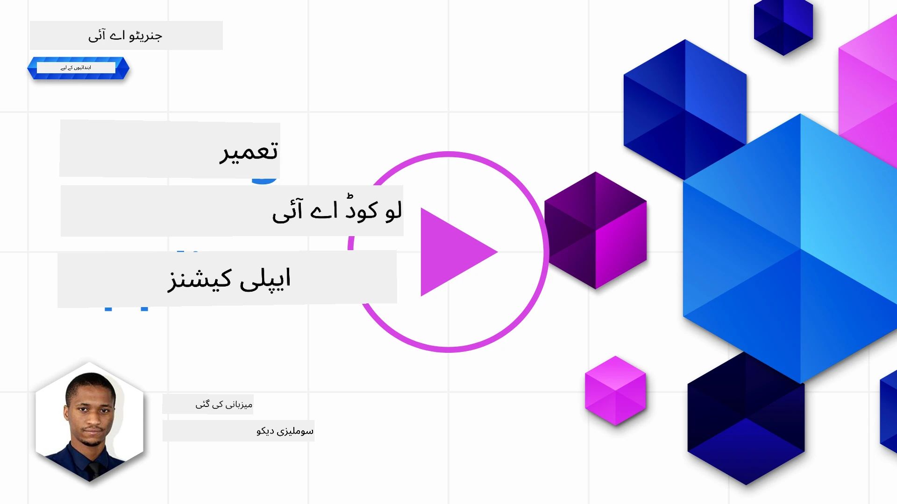](https://youtu.be/1vzq3Nd8GBA?si=h6LHWJXdmqf6mhDg)

> _(اس سبق کی ویڈیو دیکھنے کے لیے اوپر تصویر پر کلک کریں)_

## تعارف

اب جب ہم نے تصویری ایپلیکیشنز بنانے کا طریقہ سیکھ لیا ہے، تو آئیے کم کوڈ کے بارے میں بات کرتے ہیں۔ جنریٹو AI مختلف شعبوں کے لیے استعمال کی جا سکتی ہے جن میں کم کوڈ بھی شامل ہے، لیکن کم کوڈ کیا ہے اور ہم اس میں AI کیسے شامل کر سکتے ہیں؟

ایپس اور حل بنانے کا عمل روایتی ڈویلپرز اور غیر ڈویلپرز کے لیے کم کوڈ ڈیولپمنٹ پلیٹ فارمز کے استعمال سے آسان ہو گیا ہے۔ کم کوڈ ڈیولپمنٹ پلیٹ فارمز آپ کو کم یا بغیر کوڈ کے ایپس اور حل بنانے کی اجازت دیتے ہیں۔ یہ ایک بصری ترقیاتی ماحول فراہم کر کے حاصل کیا جاتا ہے جو آپ کو ایپس اور حل بنانے کے لیے اجزاء کو ڈریگ اور ڈراپ کرنے کی سہولت دیتا ہے۔ اس سے آپ تیزی سے اور کم وسائل کے ساتھ ایپس اور حل بنا سکتے ہیں۔ اس سبق میں، ہم کم کوڈ کے استعمال اور Power Platform کے ذریعے AI کے ساتھ کم کوڈ ڈیولپمنٹ کو بہتر بنانے پر گہرائی سے بات کریں گے۔

پاور پلیٹ فارم تنظیموں کو موقع فراہم کرتا ہے کہ وہ اپنی ٹیموں کو ایک بصری، کم کوڈ یا نو کوڈ ماحول کے ذریعے اپنی اپنی حل بنانے کے قابل بنائیں۔ یہ ماحول حل بنانے کے عمل کو آسان بناتا ہے۔ پاور پلیٹ فارم کے ساتھ، حل دنوں یا ہفتوں میں بنائے جا سکتے ہیں بجائے مہینوں یا سالوں کے۔ پاور پلیٹ فارم میں پانچ کلیدی مصنوعات شامل ہیں: Power Apps، Power Automate، Power BI، Power Pages اور Copilot Studio۔

یہ سبق درج ذیل موضوعات کا احاطہ کرتا ہے:

- پاور پلیٹ فارم میں جنریٹو AI کا تعارف
- کوپائلٹ کا تعارف اور اس کے استعمال کا طریقہ
- پاور پلیٹ فارم میں جنریٹو AI کا استعمال کرتے ہوئے ایپس اور فلو بنانے کا طریقہ
- AI Builder کے ساتھ پاور پلیٹ فارم میں AI ماڈلز کو سمجھنا
- Microsoft Copilot Studio کے ساتھ ذہین ایجنٹ بنانا

## تعلیمی مقاصد

اس سبق کے آخر تک آپ قابل ہو جائیں گے کہ:

- پاور پلیٹ فارم میں کوپائلٹ کے کام کرنے کا طریقہ سمجھیں۔

- ہماری تعلیمی اسٹارٹ اپ کے لیے ایک اسٹوڈنٹ اسائمنٹ ٹریکر ایپ بنائیں۔

- انوائس پروسیسنگ فلو بنائیں جو انوائسز سے معلومات نکالنے کے لیے AI استعمال کرتا ہے۔

- GPT AI ماڈل کے ساتھ ٹیکسٹ بنانے پر بہترین طریقے اپنائیں۔

- سمجھیں کہ Microsoft Copilot Studio کیا ہے اور اس سے ذہین ایجنٹ کیسے بنائیں۔

اس سبق میں آپ جن آلات اور ٹیکنالوجیز کا استعمال کریں گے وہ یہ ہیں:

- **Power Apps**، اسٹوڈنٹ اسائمنٹ ٹریکر ایپ کے لیے، جو ایپس بنانے کے لیے کم کوڈ ڈیولپمنٹ ماحول فراہم کرتا ہے تاکہ آپ ڈیٹا کو ٹریک، منظم اور انٹرایکٹ کر سکیں۔

- **Dataverse**، اسٹوڈنٹ اسائمنٹ ٹریکر ایپ کے ڈیٹا کو ذخیرہ کرنے کے لیے، جہاں Dataverse ایپ کے ڈیٹا کو ذخیرہ کرنے کے لیے ایک کم کوڈ ڈیٹا پلیٹ فارم فراہم کرے گا۔

- **Power Automate**، انوائس پروسیسنگ فلو کے لیے جہاں آپ کو ورک فلو بنانے کے لیے کم کوڈ ڈیولپمنٹ ماحول فراہم کیا جائے گا تاکہ انوائس پروسیسنگ کے عمل کو خود کار بنایا جا سکے۔

- **AI Builder**، انوائس پروسیسنگ AI ماڈل کے لیے جہاں آپ پہلے سے بنے ہوئے AI ماڈلز استعمال کریں گے تاکہ ہمارے اسٹارٹ اپ کے انوائسز کو پراسیس کیا جا سکے۔

## پاور پلیٹ فارم میں جنریٹو AI

پاور پلیٹ فارم کے لیے جنریٹو AI کے ساتھ کم کوڈ ڈیولپمنٹ اور ایپلیکیشن کو بہتر بنانا ایک اہم توجہ کا مرکز ہے۔ مقصد یہ ہے کہ ہر کوئی AI-پاورڈ ایپس، سائٹس، ڈیش بورڈز بنائے اور AI کے ساتھ عمل کو خودکار بنائے، _بغیر کسی ڈیٹا سائنس کی مہارت کے_. یہ مقصد پاور پلیٹ فارم میں کوپائلٹ اور AI Builder کی صورت میں جنریٹو AI کو کم کوڈ تجربے میں ضم کر کے حاصل کیا جاتا ہے۔

### یہ کیسے کام کرتا ہے؟

کوپائلٹ ایک AI معاون ہے جو آپ کو پاور پلیٹ فارم کے حل بنانے میں مدد دیتا ہے، جہاں آپ اپنی ضروریات کو قدرتی زبان میں بات چیت کے ذریعے بیان کرتے ہیں۔ آپ اپنی AI معاون کو ہدایت دے سکتے ہیں کہ آپ کی ایپ کون کون سے فیلڈز استعمال کرے گی اور یہ ایپ اور اس کا بنیادی ڈیٹا ماڈل دونوں بنائے گا، یا آپ پاور آٹومیٹ میں فلو کیسے ترتیب دینا ہے بتا سکتے ہیں۔

آپ کوپائلٹ کی خصوصیات کو اپنی ایپ اسکرینز پر فیچر کے طور پر استعمال کر سکتے ہیں تاکہ صارفین بات چیت کے ذریعے بصیرت حاصل کر سکیں۔

AI Builder ایک کم کوڈ AI صلاحیت ہے جو پاور پلیٹ فارم میں دستیاب ہے اور آپ کو AI ماڈلز استعمال کرتے ہوئے عمل کو خودکار بنانے اور نتائج کی پیش گوئی کرنے میں مدد دیتی ہے۔ AI Builder کے ساتھ آپ اپنی ایپس اور فلو میں AI لا سکتے ہیں جو کہ Dataverse یا مختلف کلاؤڈ ڈیٹا سورسز جیسے SharePoint، OneDrive یا Azure سے جڑے ہوتے ہیں۔

کوپائلٹ پاور پلیٹ فارم کی تمام مصنوعات میں دستیاب ہے: Power Apps، Power Automate، Power BI، Power Pages اور Copilot Studio (سابقہ Power Virtual Agents)۔ AI Builder Power Apps اور Power Automate میں دستیاب ہے۔ اس سبق میں، ہم Copilot اور AI Builder کو Power Apps اور Power Automate میں استعمال کرنے پر توجہ مرکوز کریں گے تاکہ ہمارے تعلیمی اسٹارٹ اپ کے لیے ایک حل بنایا جا سکے۔

### پاور ایپس میں کوپائلٹ

پاور پلیٹ فارم کے حصے کے طور پر، Power Apps ایک کم کوڈ ڈیولپمنٹ ماحول فراہم کرتا ہے تاکہ آپ ایپس بنا سکیں جو ڈیٹا کو ٹریک، منظم اور انٹرایکٹ کر سکیں۔ یہ ایک ایپ ڈویلپمنٹ سروسز کا مجموعہ ہے جس میں ایک اسکیل ایبل ڈیٹا پلیٹ فارم اور کلاؤڈ سروسز اور آن-پرمیسس ڈیٹا سے کنیکٹ ہونے کی صلاحیت شامل ہے۔ Power Apps آپ کو ایسے ایپس بنانے کی اجازت دیتا ہے جو براوزرز، ٹیبلٹس، اور فونز پر چلیں اور ساتھی کارکنوں کے ساتھ شیئر کی جا سکیں۔ Power Apps ایک سادہ انٹرفیس کے ذریعے صارفین کو ایپ ڈویلپمنٹ میں آسانی فراہم کرتا ہے، تاکہ ہر کاروباری صارف یا پرو ڈویلپر اپنی مرضی کی ایپس بنا سکے۔ جنریٹو AI کے ذریعے کوپائلٹ کے ساتھ یہ تجربہ بھی بہتر بنایا گیا ہے۔

پاور ایپس میں کوپائلٹ AI معاون کی خصوصیت آپ کو بیان کرنے دیتی ہے کہ آپ کو کس قسم کی ایپ چاہیے اور آپ کی ایپ کون سی معلومات ٹریک، جمع یا دکھائے گی۔ پھر کوپائلٹ آپ کی وضاحت کی بنیاد پر ایک ریسپانسیو کینوس ایپ تیار کرتا ہے۔ آپ پھر ایپ کو اپنی ضروریات کے مطابق تخصیص کر سکتے ہیں۔ AI کوپائلٹ ایک ڈیٹا ورکس جدول بھی تیار کرتا ہے اور تجویز کرتا ہے جس میں وہ فیلڈز شامل ہوتے ہیں جن میں آپ کو وہ ڈیٹا ذخیرہ کرنا ہے جو آپ ٹریک کرنا چاہتے ہیں اور کچھ نمونہ ڈیٹا بھی شامل ہوتا ہے۔ اس سبق میں ہم بعد میں دیکھیں گے کہ Dataverse کیا ہے اور آپ اسے Power Apps میں کیسے استعمال کر سکتے ہیں۔ پھر آپ بات چیت کے ذریعے AI کوپائلٹ اسسٹنٹ فیچر کی مدد سے جدول کو اپنی ضروریات کے مطابق بدل سکتے ہیں۔ یہ فیچر پاور ایپس کے ہوم اسکرین سے فوراً دستیاب ہے۔

### پاور آٹومیٹ میں کوپائلٹ

پاور پلیٹ فارم کے حصے کے طور پر، Power Automate صارفین کو ایپلیکیشنز اور سروسز کے درمیان خودکار ورک فلو بنانے کی اجازت دیتا ہے۔ یہ مواصلات، ڈیٹا جمع کرنے، اور فیصلہ سازی کی منظوری جیسے دہراتے ہوئے کاروباری عمل کو خودکار بناتا ہے۔ اس کا سادہ انٹرفیس ہر تکنیکی صلاحیت کے صارفین (نو آموز سے تجربہ کار ڈویلپر تک) کو کام کے ٹاسک خودکار بنانے کی اجازت دیتا ہے۔ ورک فلو ڈیولپمنٹ کا تجربہ بھی جنریٹو AI کے ذریعے کوپائلٹ کے ساتھ بہتر بنایا گیا ہے۔

پاور آٹومیٹ میں کوپائلٹ AI معاون کی خصوصیت آپ کو بتانے دیتی ہے کہ آپ کو کس قسم کا فلو چاہیے اور آپ اپنا فلو کن کاروائیوں پر عمل کرتے دیکھنا چاہتے ہیں۔ کوپائلٹ پھر آپ کی وضاحت کی بنیاد پر فلو تیار کرتا ہے۔ پھر آپ فلو کو اپنی ضرورت کے مطابق تخصیص کر سکتے ہیں۔ AI کوپائلٹ وہ کاروائیاں بھی تیار کرتا ہے اور تجویز دیتا ہے جن کی آپ کو مطلوبہ کام کو خودکار بنانے کے لیے ضرورت ہوتی ہے۔ اس سبق میں ہم بعد میں دیکھیں گے کہ فلو کیا ہیں اور آپ پاور آٹومیٹ میں انہیں کیسے استعمال کر سکتے ہیں۔ پھر آپ AI کوپائلٹ معاون کی مدد سے بات چیت کے مراحل کے ذریعے کاروائیوں کو اپنی ضرورت کے مطابق ڈھال سکتے ہیں۔ یہ فیچر پاور آٹومیٹ کے ہوم اسکرین سے فوری دستیاب ہے۔

## Microsoft Copilot Studio کے ساتھ ذہین ایجنٹس بنانا

[Microsoft Copilot Studio](https://learn.microsoft.com/microsoft-copilot-studio/fundamentals-what-is-copilot-studio?WT.mc_id=academic-105485-koreyst) (سابقہ Power Virtual Agents) پاور پلیٹ فارم کا کم کوڈ ممبر ہے جو **AI ایجنٹس** بناتا ہے — بات چیت کرنے والے کوپائلٹس جو سوالات کے جواب دے سکتے ہیں، کارروائیاں کر سکتے ہیں، اور آپ کے صارفین کی جانب سے کام خودکار بنا سکتے ہیں۔ پاور پلیٹ فارم کی باقی مصنوعات کی طرح، آپ ان ایجنٹس کو ایک بصری، قدرتی زبان پر مبنی تجربے میں بناتے ہیں: آپ وضاحت کرتے ہیں کہ آپ چاہتے ہیں ایجنٹ کیا کرے، اور کوپائلٹ اسٹوڈیو اس کی ہدایات، معلومات، اور کارروائیوں کو ترتیب دینے میں مدد کرتا ہے۔

ہمارے تعلیمی اسٹارٹ اپ کے لیے، آپ ایک ایسا ایجنٹ بنا سکتے ہیں جو طالب علموں کے کورسز کے بارے میں سوالات کا جواب دے، اسائمنٹ کی آخری تاریخ چیک کرے، اور بغیر کوڈ لکھے ایک انسٹرکٹر کو ای میل بھیج سکے۔

کوپائلٹ اسٹوڈیو کو طاقتور بنانے والی تازہ ترین صلاحیتوں میں شامل ہیں:

- **آپ کے علم سے جنریٹو جوابات**۔ ہر بات چیت کو ہاتھ سے لکھنے کے بجائے، آپ **علمی ذرائع** کنیکٹ کر سکتے ہیں — عوامی ویب سائٹس، شیئرپوائنٹ، OneDrive، Dataverse، اپ لوڈ کی گئی فائلیں، یا کنیکٹرز کے ذریعے ادارہ جاتی ڈیٹا — اور ایجنٹ ان سے مستند جوابات تیار کرتا ہے۔

- **جنریٹو آرکسٹریکشن**۔ سخت ٹریگر الفاظ پر انحصار کرنے کے بجائے، ایجنٹ AI کا استعمال کرتا ہے تاکہ درخواست کو سمجھے اور متحرک طور پر ان علمی ذرائع، موضوعات، اور کاروائیوں کا انتخاب کرے جو اسے پورا کریں، بشمول کئی مراحل کو آپس میں جوڑنا۔

- **کاروائیاں اور کنیکٹرز**۔ ایجنٹس صرف بات چیت نہیں کرتے بلکہ کام بھی کر سکتے ہیں۔ آپ ایجنٹ کو 1,500+ پہلے سے بنے ہوئے پاور پلیٹ فارم کنیکٹرز، پاور آٹومیٹ فلو، کسٹم REST API، پرامپٹس، یا **ماڈل کانٹیکسٹ پروٹوکول (MCP)** سرورز کی مدد سے کاروائیاں دے سکتے ہیں۔

- **خود مختار ایجنٹس**۔ ایجنٹس صرف چیٹ ونڈو میں جواب دینے تک محدود نہیں ہیں۔ آپ ایسے **خود مختار ایجنٹس** بنا سکتے ہیں جو واقعات، مثلاً نئی ای میل، Dataverse میں نیا ریکارڈ، یا فائل اپ لوڈ ہونے پر متحرک ہوں اور پھر پس منظر میں کام مکمل کریں۔

- **کئی ایجنٹس کی آرکسٹریشن**۔ ایجنٹس دوسرے ایجنٹس کو کال کر سکتے ہیں۔ ایک کوپائلٹ اسٹوڈیو ایجنٹ دوسرے ایجنٹس کو ہینڈ آف کر سکتا ہے یا دیگر ایجنٹس کے ذریعہ بڑھایا جا سکتا ہے، بشمول Microsoft 365 Copilot میں شائع شدہ ایجنٹس اور Microsoft Foundry میں بنائے گئے ایجنٹس۔

- **ماڈل کا انتخاب**۔ بلٹ ان ماڈلز کے علاوہ، آپ Microsoft Foundry ماڈل کیٹلاگ سے ماڈلز لا سکتے ہیں تاکہ اپنے ایجنٹ کی سوچ اور جواب دینے کے انداز کو اپنی مرضی کے مطابق بنائیں۔

- **کسی بھی جگہ اشاعت**۔ ایک بار بننے کے بعد، ایجنٹ کو متعدد چینلز پر شائع کیا جا سکتا ہے — Microsoft Teams، Microsoft 365 Copilot، ویب سائٹ یا کسٹم ایپ، اور مزید — جس میں سیکیورٹی، تصدیق، اور تجزیات پاور پلیٹ فارم ایڈمن تجربے کے ذریعے منظم کیے جاتے ہیں۔

آپ اپنا پہلا ایجنٹ [copilotstudio.microsoft.com](https://copilotstudio.microsoft.com?WT.mc_id=academic-105485-koreyst) پر بنانا شروع کر سکتے ہیں اور [Microsoft Copilot Studio کی دستاویزات](https://learn.microsoft.com/microsoft-copilot-studio/?WT.mc_id=academic-105485-koreyst) میں مزید جان سکتے ہیں۔

## اسائنمنٹ: ہمارے اسٹارٹ اپ کے لیے طالب علموں کی اسائنمنٹس اور انوائسز کا انتظام کریں، کوپائلٹ استعمال کرتے ہوئے

ہمارا اسٹارٹ اپ طالب علموں کو آن لائن کورسز فراہم کرتا ہے۔ اسٹارٹ اپ تیزی سے بڑھا ہے اور اب کورسز کی طلب کو پورا کرنے میں مشکل کا شکار ہے۔ اسٹارٹ اپ نے آپ کو پاور پلیٹ فارم ڈویلپر کے طور پر ملازمت دی ہے تاکہ وہ ایک کم کوڈ حل بنا سکیں جو انہیں طالب علموں کی اسائنمنٹس اور انوائسز کو منظم کرنے میں مدد دے۔ ان کا حل ایسا ہونا چاہیے جو ایک ایپ کے ذریعہ طالب علم اسائنمنٹس کو ٹریک اور منظم کرے اور ورک فلو کے ذریعے انوائس پراسیسنگ کے عمل کو خودکار بنائے۔ آپ سے کہا گیا ہے کہ جنریٹو AI استعمال کرتے ہوئے یہ حل تیار کریں۔

جب آپ کوپائلٹ کے استعمال میں شروع کر رہے ہوں، تو آپ [Power Platform Copilot Prompt Library](https://github.com/pnp/powerplatform-prompts?WT.mc_id=academic-109639-somelezediko) کا استعمال کر سکتے ہیں تاکہ پرامپٹس کے ساتھ شروع کیا جا سکے۔ یہ لائبریری پرامپٹس کی ایک فہرست فراہم کرتی ہے جنہیں آپ کوپائلٹ کے ساتھ ایپس اور فلو بنانے کے لیے استعمال کر سکتے ہیں۔ آپ پرامپٹس کو بطور خیالات بھی استعمال کر سکتے ہیں کہ آپ کوپائلٹ کو اپنی ضروریات کیسے بیان کریں۔

### ہمارے اسٹارٹ اپ کے لیے ایک اسٹوڈنٹ اسائمنٹ ٹریکر ایپ بنائیں

ہمارے اسٹارٹ اپ کے معلمین طالب علموں کی اسائنمنٹس کو ٹریک کرنے میں جدوجہد کر رہے ہیں۔ وہ اسائنمنٹس کو ٹریک کرنے کے لیے ایک اسپریڈشیٹ استعمال کر رہے تھے لیکن جب طلباء کی تعداد بڑھ گئی تو اسے منظم کرنا مشکل ہو گیا۔ انہوں نے آپ سے کہا ہے کہ ایک ایسی ایپ بنائیں جو اسائنمنٹس کو ٹریک اور منظم کرنے میں ان کی مدد کرے۔ ایپ انہیں نئی اسائنمنٹس شامل کرنے، اسائنمنٹس دیکھنے، اسائنمنٹس کو اپ ڈیٹ کرنے، اور اسائنمنٹس کو حذف کرنے کی اجازت دے۔ ایپ معلمین اور طلباء کو یہ بھی دکھانا چاہیے کہ کون سی اسائنمنٹس گریڈ کی جا چکی ہیں اور کون سی نہیں۔

آپ نیچے دیے گئے مراحل کی پیروی کرتے ہوئے کوپائلٹ کے ذریعے Power Apps میں یہ ایپ بنائیں گے:

1. [Power Apps](https://make.powerapps.com?WT.mc_id=academic-105485-koreyst) کے ہوم اسکرین پر جائیں۔

1. ہوم اسکرین کے ٹیکسٹ ایریا میں اس ایپ کی وضاحت کریں جو آپ بنانا چاہتے ہیں۔ مثال کے طور پر، **_میں ایک ایسی ایپ بنانا چاہتا ہوں جو طالب علموں کی اسائنمنٹس کو ٹریک اور منظم کرے_**۔ AI کوپائلٹ کو پرامپٹ بھیجنے کے لیے **Send** بٹن پر کلک کریں۔

1. AI کوپائلٹ ایک Dataverse جدول تجویز کرے گا جس میں وہ فیلڈز شامل ہوں گے جن میں آپ کو وہ ڈیٹا ذخیرہ کرنا ہے جو آپ ٹریک کرنا چاہتے ہیں اور کچھ نمونہ ڈیٹا بھی ہوگا۔ پھر آپ AI کوپائلٹ اسسٹنٹ فیچر کے ذریعے بات چیت کے مراحل کا استعمال کرتے ہوئے جدول کو اپنی ضروریات کے مطابق تبدیل کر سکتے ہیں۔

   > **اہم**: Dataverse پاور پلیٹ فارم کے لیے بنیادی ڈیٹا پلیٹ فارم ہے۔ یہ ایپ کے ڈیٹا کو ذخیرہ کرنے کے لیے ایک کم کوڈ ڈیٹا پلیٹ فارم ہے۔ یہ ایک مکمل طور پر مینیجڈ سروس ہے جو Microsoft کلاؤڈ میں محفوظ طریقے سے ڈیٹا ذخیرہ کرتی ہے اور آپ کے پاور پلیٹ فارم ماحول کے اندر دستیاب ہوتی ہے۔ یہ بلٹ ان ڈیٹا گورننس صلاحیتوں کے ساتھ آتا ہے، جیسے ڈیٹا کی درجہ بندی، ڈیٹا لائنج، باریک بینی تک رسائی کنٹرول، اور بہت کچھ۔ آپ یہاں [Dataverse کے بارے میں مزید جان سکتے ہیں](https://learn.microsoft.com/power-apps/maker/data-platform/data-platform-intro?WT.mc_id=academic-109639-somelezediko)۔

   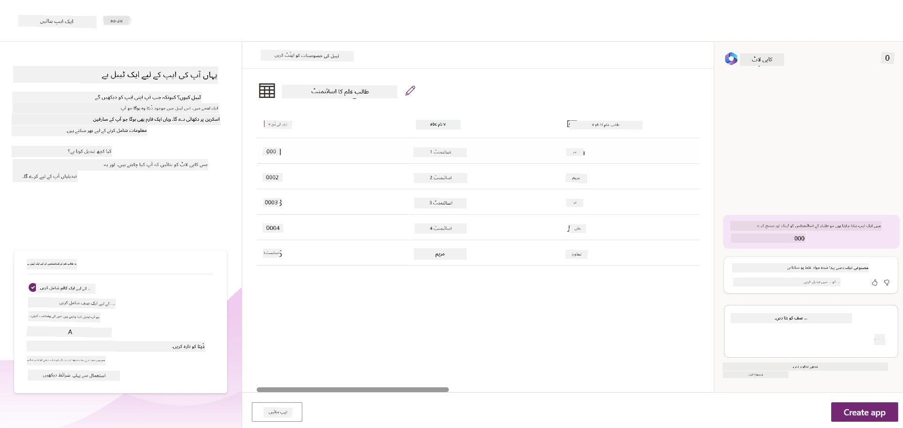

1. معلمین ان طلباء کو ای میل بھیجنا چاہتے ہیں جنہوں نے اپنی اسائنمنٹس جمع کروائی ہیں تاکہ وہ اسائنمنٹس کی پیش رفت سے آگاہ رہیں۔ آپ کوپائلٹ کا استعمال کرتے ہوئے جدول میں طالب علم کا ای میل ذخیرہ کرنے کے لیے ایک نیا فیلڈ شامل کر سکتے ہیں۔ مثال کے طور پر، آپ جدول میں نیا فیلڈ شامل کرنے کے لیے مندرجہ ذیل پرامپٹ استعمال کر سکتے ہیں: **_میں طالب علم کا ای میل ذخیرہ کرنے کے لیے ایک کالم شامل کرنا چاہتا ہوں_**۔ AI کوپائلٹ کو پرامپٹ بھیجنے کے لیے **Send** بٹن پر کلک کریں۔

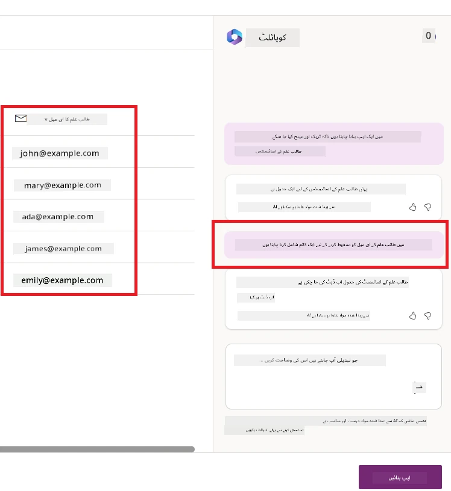

1. AI کوپائلٹ ایک نیا فیلڈ تیار کرے گا اور پھر آپ فیلڈ کو اپنی ضروریات کے مطابق تخصیص کر سکتے ہیں۔

1. ایک بار جب آپ جدول مکمل کر لیں، ایپ بنانے کے لیے **Create app** بٹن پر کلک کریں۔

1. AI Copilot آپ کی وضاحت کی بنیاد پر ایک responsive Canvas ایپ بنائے گا۔ پھر آپ ایپ کو اپنی ضروریات کے مطابق تخصیص کر سکتے ہیں۔

1. اساتذہ کو طلباء کو ای میل بھیجنے کے لیے، آپ Copilot کا استعمال کر کے ایپ میں نیا اسکرین شامل کر سکتے ہیں۔ مثلاً، آپ مندرجہ ذیل پرامپٹ استعمال کر سکتے ہیں: **_میں طلباء کو ای میل بھیجنے کے لیے ایک اسکرین شامل کرنا چاہتا ہوں_**۔ AI Copilot کو پرامپٹ بھیجنے کے لیے **Send** بٹن پر کلک کریں۔

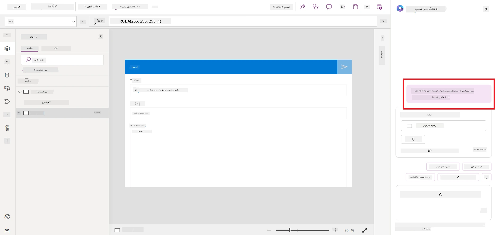

1. AI Copilot ایک نیا اسکرین بنائے گا اور پھر آپ اسکرین کو اپنی ضروریات کے مطابق تخصیص کر سکتے ہیں۔

1. جب آپ ایپ کے کام مکمل کر لیں تو ایپ محفوظ کرنے کے لیے **Save** بٹن پر کلک کریں۔

1. اساتذہ کے ساتھ ایپ شیئر کرنے کے لیے **Share** بٹن پر کلک کریں اور پھر دوبارہ **Share** پر کلک کریں۔ آپ پھر اساتذہ کے ای میل ایڈریس درج کر کے ایپ شیئر کر سکتے ہیں۔

> **آپ کا ہوم ورک**: جو ایپ آپ نے بنائی ہے وہ ایک اچھا آغاز ہے لیکن اسے بہتر کیا جا سکتا ہے۔ ای میل فیچر کے ساتھ، اساتذہ صرف طلباء کو دستی طور پر ای میل بھیج سکتے ہیں کیونکہ انہیں ای میل ٹائپ کرنی پڑتی ہے۔ کیا آپ Copilot کا استعمال کر کے ایسا خودکار نظام بنا سکتے ہیں جو اساتذہ کو ای میل خودکار طور پر بھیجنے کی سہولت دے جب طلباء اپنے اسائنمنٹس جمع کرواتے ہیں؟ آپ کی رہنمائی کے لیے، آپ صحیح پرامپٹ کے ساتھ Copilot کو Power Automate میں استعمال کر سکتے ہیں۔

### ہماری اسٹارٹ اپ کے لیے انوائس معلومات کا جدول بنائیں

ہماری اسٹارٹ اپ کی مالیاتی ٹیم کو انوائسز کا حساب رکھنے میں دشواری ہو رہی ہے۔ وہ انوائسز کو ٹریک کرنے کے لیے اسپریڈشیٹ استعمال کر رہے تھے مگر انوائسز کی تعداد بڑھنے کی وجہ سے اسے منظم کرنا مشکل ہو گیا ہے۔ انہوں نے آپ سے کہا ہے کہ ایسا جدول بنائیں جس سے انوائسز کی معلومات محفوظ، ٹریک اور منظم کی جا سکیں۔ یہ جدول خودکار نظام بنانے کے لیے استعمال ہو گا جو تمام انوائس معلومات نکال کر جدول میں ذخیرہ کرے گا۔ اس جدول سے مالیاتی ٹیم کو یہ بھی سہولت ملے گی کہ وہ ادا شدہ اور غیر ادا شدہ انوائسز دیکھ سکیں۔

Power Platform میں ایک بنیادی ڈیٹا پلیٹ فارم ہے جسے Dataverse کہا جاتا ہے جو آپ کی ایپس اور حلوں کے لیے ڈیٹا ذخیرہ کرنے کی سہولت دیتا ہے۔ Dataverse ایک کم کوڈ والا ڈیٹا پلیٹ فارم ہے جو ایپ کے ڈیٹا کو ذخیرہ کرتا ہے۔ یہ ایک مکمل طور پر مینیج کیا جانے والا سروس ہے جو مائیکروسافٹ کلاؤڈ میں محفوظ طریقے سے ڈیٹا ذخیرہ کرتا ہے اور آپ کے Power Platform کے ماحول میں دستیاب ہے۔ اس میں ڈیٹا گورننس کی خصوصیات شامل ہیں جیسے ڈیٹا کی درجہ بندی، ڈیٹا لائنج، باریک رسائی کنٹرول اور بہت کچھ۔ آپ مزید جان سکتے ہیں [Dataverse کے بارے میں یہاں](https://learn.microsoft.com/power-apps/maker/data-platform/data-platform-intro?WT.mc_id=academic-109639-somelezediko)۔

ہماری اسٹارٹ اپ کے لیے Dataverse کیوں استعمال کریں؟ Dataverse میں معیاری اور حسب ضرورت جدولوں کا استعمال کرکے آپ کے ڈیٹا کے لیے محفوظ اور کلاؤڈ بیسڈ ذخیرہ فراہم کیا جاتا ہے۔ جدول آپ کو مختلف اقسام کے ڈیٹا ذخیرہ کرنے دیتے ہیں، جیسے کہ آپ ایک ایکسل ورک بک میں مختلف ورک شیٹس استعمال کرتے ہیں۔ آپ ان جدولوں کا استعمال مخصوص کاروباری یا تنظیمی ڈیٹا کے لیے کر سکتے ہیں۔ Dataverse استعمال کرنے کے کچھ فائدے یہ ہیں:

- **آسانی سے انتظام**: میٹا ڈیٹا اور ڈیٹا دونوں کلاؤڈ میں محفوظ ہوتے ہیں، لہٰذا آپ کو ان کے ذخیرہ یا انتظام کی تفصیلات کی فکر نہیں کرنی پڑتی۔ آپ اپنے ایپس اور حل تیار کرنے پر توجہ دے سکتے ہیں۔

- **محفوظ**: Dataverse آپ کے ڈیٹا کے لیے محفوظ اور کلاؤڈ بیسڈ ذخیرہ فراہم کرتا ہے۔ آپ رول کی بنیاد پر سیکورٹی کے ذریعے ڈیٹا تک رسائی کو کنٹرول کر سکتے ہیں کہ کون ڈیٹا دیکھ سکتا ہے اور کیسے۔

- **مفصل میٹا ڈیٹا**: ڈیٹا کی اقسام اور تعلقات کو براہ راست Power Apps میں استعمال کیا جاتا ہے۔

- **منطق اور تصدیق**: آپ بزنس رولز، کیلکولیٹڈ فیلڈز، اور ویلیڈیشن رولز کا استعمال کر کے کاروباری منطق نافذ کر سکتے ہیں اور ڈیٹا کی درستگی برقرار رکھ سکتے ہیں۔

اب جب آپ جان گئے کہ Dataverse کیا ہے اور اسے کیوں استعمال کرنا چاہیے، آئیے دیکھتے ہیں کہ آپ Copilot سے Dataverse میں جدول کیسے بنا سکتے ہیں تاکہ ہماری مالیاتی ٹیم کی ضروریات پوری ہوں۔

> **نوٹ**: آپ اس جدول کو اگلے حصے میں استعمال کریں گے تاکہ ایک خودکار نظام بنایا جا سکے جو تمام انوائس معلومات نکال کر جدول میں محفوظ کرے۔

Copilot کا استعمال کرتے ہوئے Dataverse میں جدول بنانے کے لیے درج ذیل مراحل پر عمل کریں:

1. [Power Apps](https://make.powerapps.com?WT.mc_id=academic-105485-koreyst) کے ہوم اسکرین پر جائیں۔

2. بائیں نیویگیشن بار میں **Tables** منتخب کریں اور پھر **Describe the new Table** پر کلک کریں۔

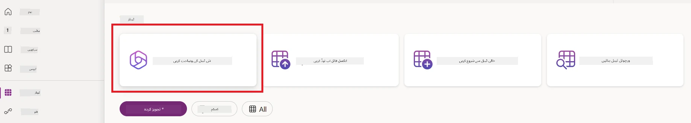

1. **Describe the new Table** اسکرین پر جدول کو بیان کرنے کے لیے ٹیکسٹ ایریا استعمال کریں۔ مثلاً، **_میں انوائس معلومات ذخیرہ کرنے کے لیے جدول بنانا چاہتا ہوں_**۔ AI Copilot کو پرامپٹ بھیجنے کے لیے **Send** بٹن پر کلک کریں۔

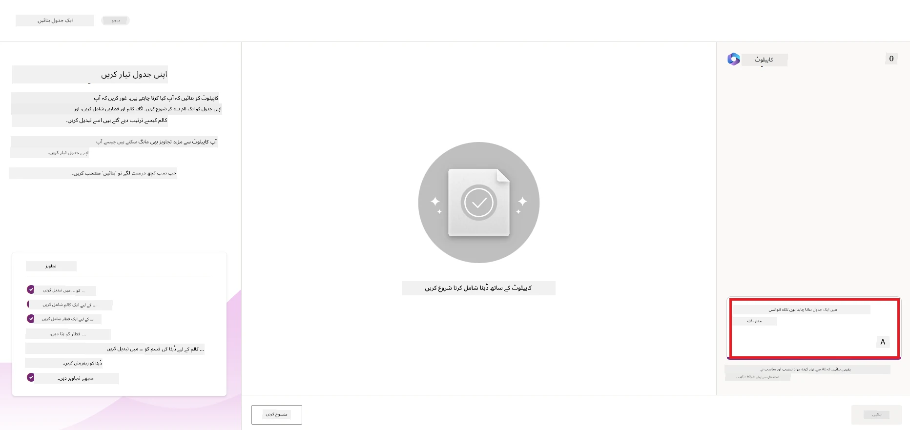

1. AI Copilot آپ کی ضرورت کے مطابق ڈیٹا محفوظ کرنے کے لیے Dataverse جدول اور کچھ نمونہ ڈیٹا تجویز کرے گا۔ پھر آپ AI Copilot اسسٹنٹ کی مدد سے جدول کو بات چیت کی صورت میں اپنی مرضی کے مطابق بنا سکتے ہیں۔

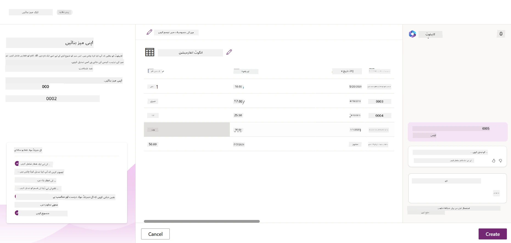

1. مالیاتی ٹیم سپلائر کو انوائس کی موجودہ حیثیت بتانے کے لیے ای میل بھیجنا چاہتی ہے۔ آپ Copilot کا استعمال کرتے ہوئے جدول میں سپلائر ای میل رکھنے کے لیے نیا کالم شامل کر سکتے ہیں۔ مثلاً، آپ یوں کہہ سکتے ہیں: **_میں سپلائر ای میل محفوظ کرنے کے لیے ایک کالم شامل کرنا چاہتا ہوں_**۔ AI Copilot کو پرامپٹ بھیجنے کے لیے **Send** پر کلک کریں۔

1. AI Copilot نیا فیلڈ بنائے گا اور پھر آپ اسے اپنی ضروریات کے مطابق تخصیص کر سکتے ہیں۔

1. جب جدول مکمل ہو جائے تو جدول بنانے کے لیے **Create** بٹن پر کلک کریں۔

## Power Platform میں AI ماڈلز AI Builder کے ساتھ

AI Builder Power Platform میں ایک کم کوڈ AI صلاحیت ہے جو آپ کو AI ماڈلز استعمال کر کے عمل خودکار کرنے اور نتائج کی پیش گوئی میں مدد دیتی ہے۔ AI Builder کے ذریعے آپ AI کو اپنے ایپس اور فلو میں شامل کر سکتے ہیں جو Dataverse یا مختلف کلاؤڈ ڈیٹا ذرائع جیسے SharePoint، OneDrive یا Azure سے جڑے ہوتے ہیں۔

## پری بلٹ AI ماڈلز بمقابلہ حسب ضرورت AI ماڈلز

AI Builder دو اقسام کے AI ماڈلز فراہم کرتا ہے: پری بلٹ AI ماڈلز اور حسب ضرورت AI ماڈلز۔ پری بلٹ AI ماڈلز وہ تیار شدہ ماڈلز ہیں جو مائیکروسافٹ نے تربیت دیے ہیں اور Power Platform میں دستیاب ہیں۔ یہ آپ کو بغیر ڈیٹا اکٹھا کیے یا اپنا ماڈل بنانے، تربیت دینے اور شائع کرنے کے بغیر آپ کے ایپس اور فلو میں ذہانت شامل کرنے میں مدد دیتے ہیں۔ آپ ان ماڈلز کو عمل خودکار بنانے اور نتائج پیش گوئی کرنے کے لیے استعمال کر سکتے ہیں۔

Power Platform میں دستیاب کچھ پری بلٹ AI ماڈلز درج ذیل ہیں:

- **Key Phrase Extraction**: یہ ماڈل متن سے اہم الفاظ اخذ کرتا ہے۔
- **Language Detection**: یہ ماڈل متن کی زبان کا پتہ لگاتا ہے۔
- **Sentiment Analysis**: یہ ماڈل متن میں مثبت، منفی، غیر جانبدار یا مخلوط جذبات کا پتہ لگاتا ہے۔
- **Business Card Reader**: یہ ماڈل بزنس کارڈز سے معلومات نکالتا ہے۔
- **Text Recognition**: یہ ماڈل تصویروں سے متن نکالتا ہے۔
- **Object Detection**: یہ ماڈل تصویروں سے اشیاء کا پتہ لگا کر نکالتا ہے۔
- **Document processing**: یہ ماڈل فارم سے معلومات نکالتا ہے۔
- **Invoice Processing**: یہ ماڈل انوائسز سے معلومات نکالتا ہے۔

حسب ضرورت AI ماڈلز کے ذریعے آپ اپنا ماڈل AI Builder میں لا سکتے ہیں تاکہ یہ کسی بھی AI Builder کے حسب ضرورت ماڈل کی طرح کام کرے، اور آپ اپنے ڈیٹا سے ماڈل کو تربیت دے سکتے ہیں۔ آپ ان ماڈلز کو Power Apps اور Power Automate دونوں میں عمل خودکار بنانے اور نتائج پیش گوئی کے لیے استعمال کر سکتے ہیں۔ اپنا ماڈل استعمال کرنے پر کچھ حدود لاگو ہوتی ہیں۔ ان حدود کے بارے میں مزید پڑھیں [یہاں](https://learn.microsoft.com/ai-builder/byo-model#limitations?WT.mc_id=academic-105485-koreyst)۔

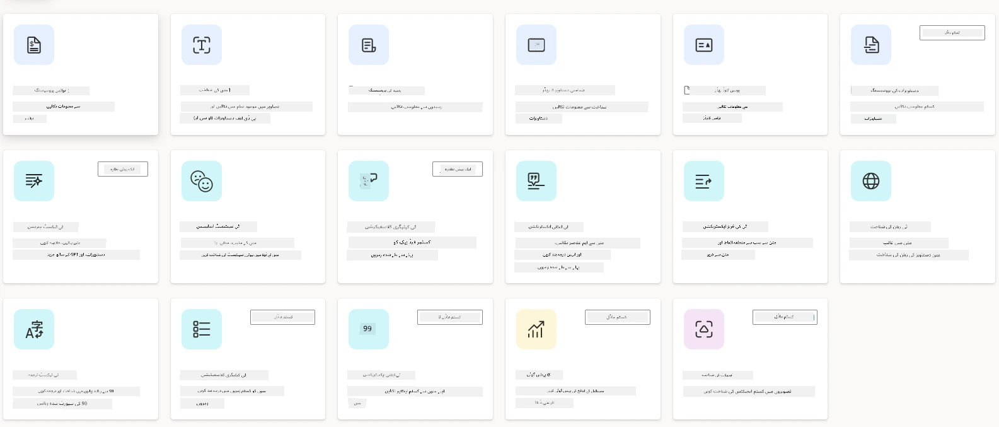

## اسائنمنٹ #2 - ہماری اسٹارٹ اپ کے لیے انوائس پراسیسنگ فلو بنائیں

مالیاتی ٹیم انوائسز کو پراسیس کرنے میں دشواری محسوس کر رہی ہے۔ وہ انوائسز کو ٹریک کرنے کے لیے اسپریڈشیٹ استعمال کر رہے تھے مگر انوائسز کی تعداد بڑھنے کی وجہ سے یہ انتظام مشکل ہو گیا ہے۔ انہوں نے آپ سے مطالبہ کیا ہے کہ ایسا ورک فلو بنائیں جو AI استعمال کر کے انوائسز کو پراسیس کرے۔ یہ ورک فلو انوائسز سے معلومات نکالے اور Dataverse جدول میں محفوظ کرے۔ ورک فلو مالیاتی ٹیم کو نکالی گئی معلومات کے ساتھ ای میل بھیجنے کی بھی سہولت دے۔

اب جب آپ جان گئے کہ AI Builder کیا ہے اور اسے کیوں استعمال کرنا چاہیے، آئیے دیکھتے ہیں کہ آپ نے پہلے ہم نے جو Invoice Processing AI Model سیکھا تھا، اس کا استعمال کرتے ہوئے مالیاتی ٹیم کے لیے انوائسز پراسیس کرنے والا ورک فلو کیسے بنایا جا سکتا ہے۔

انوائس پراسیسنگ AI ماڈل استعمال کر کے مالیاتی ٹیم کے لیے ورک فلو بنانے کے لیے درج ذیل مراحل پر عمل کریں:

1. [Power Automate](https://make.powerautomate.com?WT.mc_id=academic-105485-koreyst) کے ہوم اسکرین پر جائیں۔

2. ہوم اسکرین پر دیے گئے ٹیکسٹ ایریا میں وہ ورک فلو بیان کریں جو آپ بنانا چاہتے ہیں۔ مثلاً، **_جب میرے میل باکس میں انوائس آئے تو اس کی پراسیسنگ کریں_**۔ AI Copilot کو پرامپٹ بھیجنے کے لیے **Send** بٹن پر کلک کریں۔

   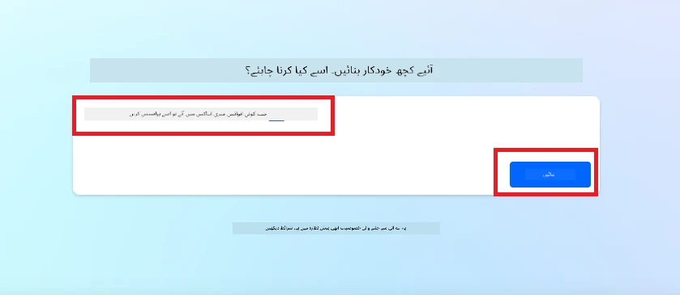

3. AI Copilot اس کام کو خودکار بنانے کے لیے درکار اقدامات تجویز کرے گا۔ اگلے مراحل دیکھنے کے لیے **Next** بٹن پر کلک کریں۔

4. اگلے مرحلے پر Power Automate آپ سے فلو کے لیے کنکشن سیٹ اپ کرنے کو کہے گا۔ مکمل کرنے کے بعد، فلو بنانے کے لیے **Create flow** بٹن پر کلک کریں۔

5. AI Copilot ایک فلو بنائے گا، پھر آپ اس فلو کو اپنی ضروریات کے مطابق تخصیص کر سکتے ہیں۔

6. فلو کے ٹریگر کو اپ ڈیٹ کریں اور **Folder** اس فولڈر پر سیٹ کریں جہاں انوائسز محفوظ ہوں گی۔ مثلاً، آپ فولڈر کو **Inbox** سیٹ کر سکتے ہیں۔ **Show advanced options** پر کلک کریں اور **Only with Attachments** کو **Yes** پر سیٹ کریں۔ اس سے یہ یقینی بنے گا کہ فلو صرف اس وقت چلے جب کسی ای میل میں اٹیچمنٹ ہو۔

7. فلو میں سے درج ذیل اقدامات ہٹا دیں: **HTML to text**, **Compose**, **Compose 2**, **Compose 3** اور **Compose 4** کیونکہ آپ انہیں استعمال نہیں کریں گے۔

8. فلو سے **Condition** ایکشن بھی ہٹا دیں کیونکہ آپ اسے استعمال نہیں کریں گے۔ یہ اسکرین شاٹ جیسا نظر آنا چاہیے:

   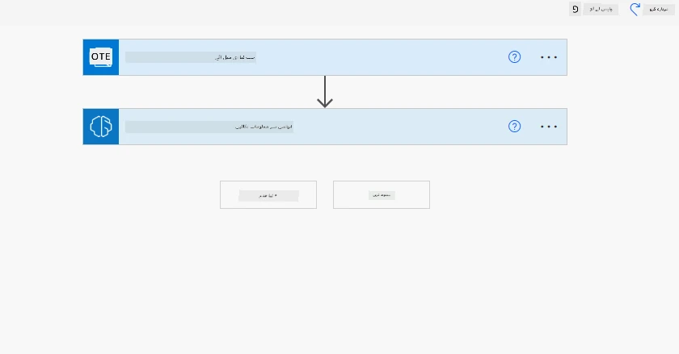

9. **Add an action** بٹن پر کلک کریں اور **Dataverse** تلاش کریں۔ پھر **Add a new row** ایکشن منتخب کریں۔

10. **Extract Information from invoices** ایکشن میں، **Invoice File** کو ای میل کے **Attachment Content** پر پوائنٹ کریں۔ اس سے فلو انوائس اٹیچمنٹ سے معلومات نکالے گا۔

11. پہلے بنائے گئے جدول کو منتخب کریں۔ مثلاً، آپ **Invoice Information** جدول منتخب کر سکتے ہیں۔ پچھلے ایکشن سے ڈائنامک مواد استعمال کرتے ہوئے درج ذیل فیلڈز کو بھریں:

    - ID
    - Amount
    - Date
    - Name
    - Status - **Status** کو **Pending** پر سیٹ کریں۔
    - Supplier Email - **When a new email arrives** ٹریگر کے **From** ڈائنامک مواد کو استعمال کریں۔

    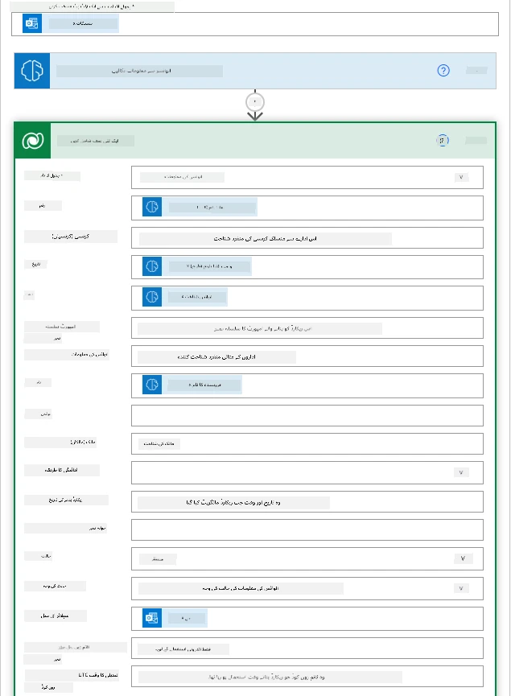

12. جب فلو مکمل ہو جائے تو فلو محفوظ کرنے کے لیے **Save** بٹن پر کلک کریں۔ پھر آپ ٹرگر میں متعین فولڈر میں انوائس کے ساتھ ای میل بھیج کر فلو کا ٹیسٹ کر سکتے ہیں۔

> **آپ کا ہوم ورک**: جو فلو آپ نے بنایا ہے وہ ایک اچھا آغاز ہے، اب آپ کو سوچنا ہے کہ ایسا خودکار نظام کیسے بنایا جائے جو ہماری مالیاتی ٹیم کو سپلائر کو انوائس کی موجودہ حیثیت سے آگاہ کرنے کے لیے ای میل بھیجنے کی اجازت دے۔ اشارہ: فلو تب چلنا چاہیے جب انوائس کا اسٹیٹس تبدیل ہو۔

## Power Automate میں Text Generation AI ماڈل استعمال کریں

AI Builder میں Create Text with GPT AI Model آپ کو پرامپٹ کی بنیاد پر متن بنانے کی سہولت دیتا ہے اور یہ Microsoft Azure OpenAI Service سے تقویت یافتہ ہے۔ اس کی مدد سے آپ GPT (Generative Pre-Trained Transformer) ٹیکنالوجی کو اپنے ایپس اور فلو میں شامل کر کے مختلف خودکار فلو اور بصیرت رکھنے والی ایپلیکیشنز بنا سکتے ہیں۔

GPT ماڈلز وسیع ڈیٹا پر تربیت یافتہ ہوتے ہیں، جس سے وہ پرامپٹ ملنے پر انسانی زبان کے بہت قریب متن تیار کر سکتے ہیں۔ ورک فلو آٹومیشن کے ساتھ مل کر، GPT جیسے AI ماڈلز کو مختلف کاموں کو خودکار بنانے اور آسان بنانے کے لیے استعمال کیا جا سکتا ہے۔

مثال کے طور پر، آپ ای میل کے مسودات، مصنوعات کی تفصیلات اور مزید کے خودکار متن بنانے کے لیے فلو تیار کر سکتے ہیں۔ آپ ماڈل کو چیٹ بوٹس اور کسٹمر سروس ایپس جیسی کئی ایپس میں بھی استعمال کر سکتے ہیں تاکہ کسٹمر سروس ایجنٹس مؤثر اور تیز تر جواب دے سکیں۔

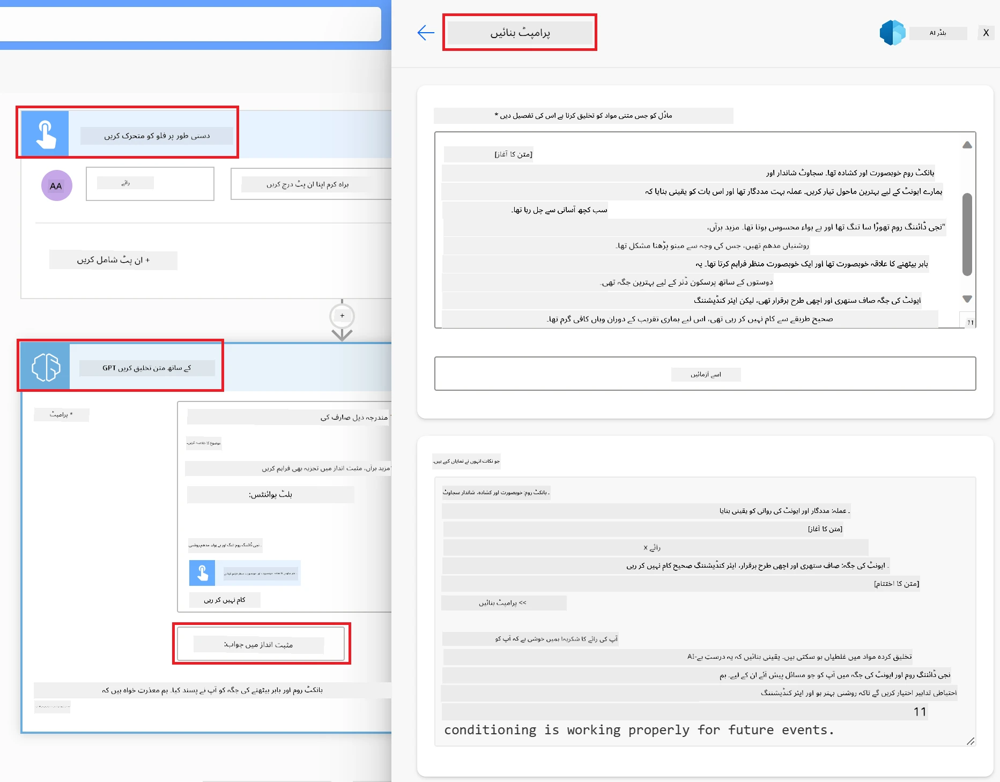

اس AI ماڈل کو Power Automate میں استعمال کرنے کا طریقہ سیکھنے کے لیے، [AI Builder اور GPT کے ساتھ ذہانت شامل کریں](https://learn.microsoft.com/training/modules/ai-builder-text-generation/?WT.mc_id=academic-109639-somelezediko) ماڈیول کا جائزہ لیں۔

## شاندار کام! اپنی تعلیم جاری رکھیں

اس سبق کے مکمل ہونے کے بعد، ہماری [Generative AI Learning collection](https://aka.ms/genai-collection?WT.mc_id=academic-105485-koreyst) دیکھیں تاکہ آپ اپنی Generative AI کی معلومات کو مزید بڑھا سکیں!

کیا آپ Copilot کو حسب ضرورت بنانا چاہتے ہیں اور اس سے زیادہ فائدہ اٹھانا چاہتے ہیں؟ [Awesome Copilot](https://github.com/github/awesome-copilot?WT.mc_id=academic-105485-koreyst) دریافت کریں — انسٹرکشنز، ایجنٹس، مہارتوں، اور کنفیگریشنز کا ایک کمیونٹی تعاون یافتہ مجموعہ جو آپ کو GitHub Copilot کا زیادہ سے زیادہ فائدہ اٹھانے میں مدد دے گا۔

سبق 11 کی طرف جائیں جہاں ہم دیکھیں گے کہ [Function Calling کے ساتھ Generative AI کو کیسے مربوط کیا جائے](../11-integrating-with-function-calling/README.md?WT.mc_id=academic-105485-koreyst)!

---

<!-- CO-OP TRANSLATOR DISCLAIMER START -->
**ڈس کلیمر**:
یہ دستاویز AI ترجمہ سروس [Co-op Translator](https://github.com/Azure/co-op-translator) کے ذریعے ترجمہ کی گئی ہے۔ جبکہ ہم درستگی کے لیے کوشاں ہیں، براہ کرم اس بات سے آگاہ رہیں کہ خودکار ترجمے میں غلطیاں یا عدم درستیاں ہو سکتی ہیں۔ اصل دستاویز اپنے مادری زبان میں مستند ماخذ سمجھی جائے گی۔ حساس معلومات کے لیے پیشہ ور انسانی ترجمہ کی سفارش کی جاتی ہے۔ اس ترجمے کے استعمال سے پیدا ہونے والی کسی بھی غلط فہمی یا غلط تشریح کی ذمہ داری ہم قبول نہیں کرتے۔
<!-- CO-OP TRANSLATOR DISCLAIMER END -->