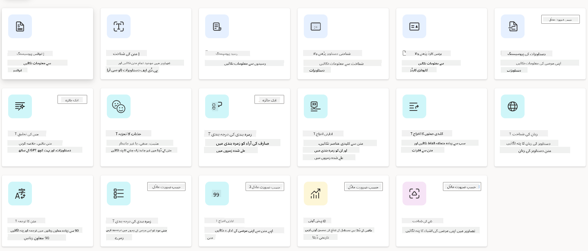
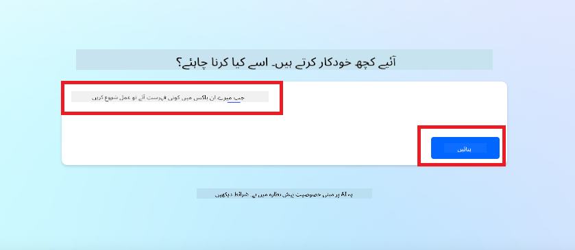
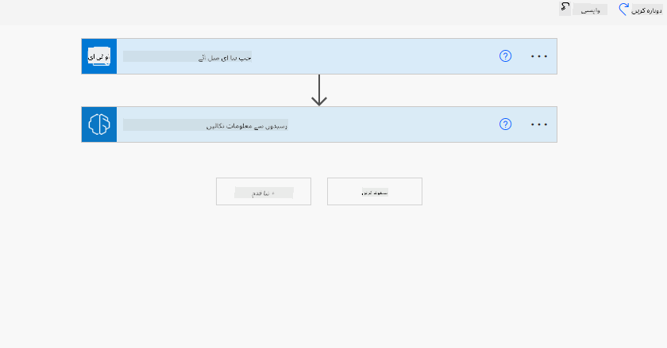
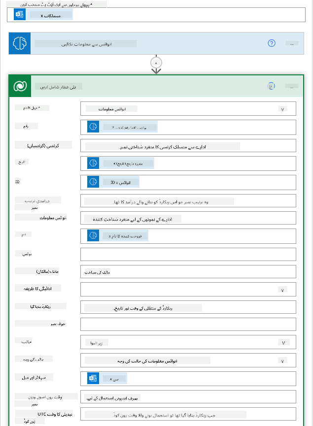
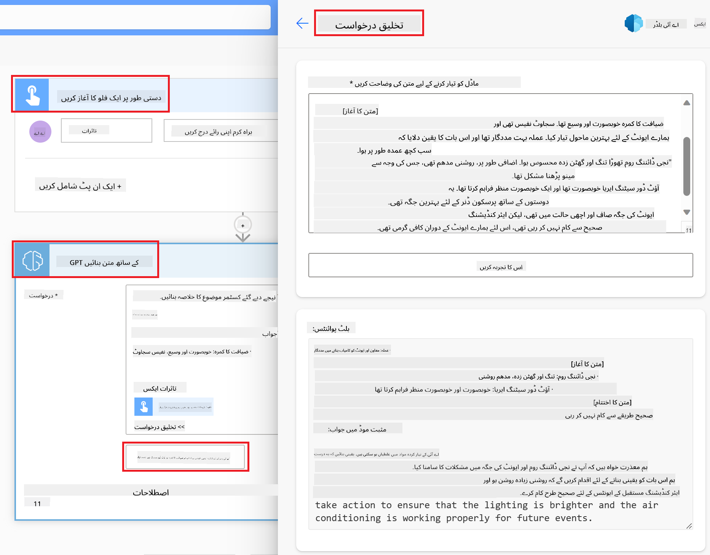

<!--
CO_OP_TRANSLATOR_METADATA:
{
  "original_hash": "f5ff3b6204a695a117d6f452403c95f7",
  "translation_date": "2025-06-25T17:59:48+00:00",
  "source_file": "10-building-low-code-ai-applications/README.md",
  "language_code": "ur"
}
-->
# کم کوڈ اے آئی ایپلیکیشنز کی تعمیر

## تعارف

اب جب کہ ہم نے سیکھ لیا ہے کہ تصویر پیدا کرنے والی ایپلیکیشنز کیسے بنائیں، آئیے کم کوڈ کے بارے میں بات کرتے ہیں۔ جنریٹیو اے آئی کو مختلف شعبوں میں استعمال کیا جا سکتا ہے بشمول کم کوڈ، لیکن کم کوڈ کیا ہے اور ہم اس میں اے آئی کو کیسے شامل کر سکتے ہیں؟

ایپلیکیشنز اور سلوشنز کی تعمیر روایتی ڈویلپرز اور غیر ڈویلپرز کے لیے کم کوڈ ڈیولپمنٹ پلیٹ فارمز کے استعمال کے ذریعے آسان ہو گئی ہے۔ کم کوڈ ڈیولپمنٹ پلیٹ فارمز آپ کو کم یا بغیر کوڈ کے ایپلیکیشنز اور سلوشنز بنانے کے قابل بناتے ہیں۔ یہ ایک بصری ترقیاتی ماحول فراہم کر کے حاصل کیا جاتا ہے جو آپ کو ایپلیکیشنز اور سلوشنز بنانے کے لیے اجزاء کو گھسیٹنے اور چھوڑنے کے قابل بناتا ہے۔ یہ آپ کو ایپلیکیشنز اور سلوشنز کو تیزی سے اور کم وسائل کے ساتھ بنانے کے قابل بناتا ہے۔ اس سبق میں، ہم کم کوڈ کو استعمال کرنے کے طریقہ پر گہرائی سے غور کرتے ہیں اور پاور پلیٹ فارم کا استعمال کرتے ہوئے اے آئی کے ساتھ کم کوڈ ڈیولپمنٹ کو کیسے بڑھایا جا سکتا ہے۔

پاور پلیٹ فارم تنظیموں کو اپنے ٹیموں کو ایک بدیہی کم کوڈ یا بغیر کوڈ کے ماحول کے ذریعے اپنے حل تیار کرنے کا موقع فراہم کرتا ہے۔ یہ ماحول حل بنانے کے عمل کو آسان بناتا ہے۔ پاور پلیٹ فارم کے ساتھ، سلوشنز دنوں یا ہفتوں میں بنائے جا سکتے ہیں، مہینوں یا سالوں کے بجائے۔ پاور پلیٹ فارم پانچ اہم پروڈکٹس پر مشتمل ہے: پاور ایپس، پاور آٹومیٹ، پاور بی آئی، پاور پیجز اور کوپائلٹ اسٹوڈیو۔

یہ سبق شامل کرتا ہے:

- پاور پلیٹ فارم میں جنریٹیو اے آئی کا تعارف
- کوپائلٹ کا تعارف اور اسے کیسے استعمال کیا جائے
- پاور پلیٹ فارم میں ایپلیکیشنز اور فلو بنانے کے لیے جنریٹیو اے آئی کا استعمال
- اے آئی بلڈر کے ساتھ پاور پلیٹ فارم میں اے آئی ماڈلز کو سمجھنا

## سیکھنے کے مقاصد

اس سبق کے اختتام تک، آپ قابل ہوں گے:

- پاور پلیٹ فارم میں کوپائلٹ کیسے کام کرتا ہے کو سمجھنا۔

- ہماری تعلیمی اسٹارٹ اپ کے لیے ایک اسٹوڈنٹ اسائنمنٹ ٹریکر ایپ بنانا۔

- ایک انوائس پروسیسنگ فلو بنانا جو انوائسز سے معلومات نکالنے کے لیے اے آئی کا استعمال کرتا ہے۔

- جی پی ٹی اے آئی ماڈل کے ساتھ ٹیکسٹ بنانے کے بہترین طریقوں کا اطلاق کرنا۔

اس سبق میں آپ جو ٹولز اور ٹیکنالوجیز استعمال کریں گے وہ ہیں:

- **پاور ایپس**، اسٹوڈنٹ اسائنمنٹ ٹریکر ایپ کے لیے، جو ایپلیکیشنز بنانے کے لیے ایک کم کوڈ ترقیاتی ماحول فراہم کرتی ہے تاکہ ڈیٹا کو ٹریک، منیج اور انٹرایکٹ کیا جا سکے۔

- **ڈیٹا ورس**، اسٹوڈنٹ اسائنمنٹ ٹریکر ایپ کے لیے ڈیٹا کو ذخیرہ کرنے کے لیے جہاں ڈیٹا ورس ایپ کے ڈیٹا کو ذخیرہ کرنے کے لیے کم کوڈ ڈیٹا پلیٹ فارم فراہم کرے گا۔

- **پاور آٹومیٹ**، انوائس پروسیسنگ فلو کے لیے جہاں آپ کو انوائس پروسیسنگ کے عمل کو خودکار کرنے کے لیے ورک فلو بنانے کے لیے کم کوڈ ترقیاتی ماحول حاصل ہوگا۔

- **اے آئی بلڈر**، انوائس پروسیسنگ اے آئی ماڈل کے لیے جہاں آپ ہمارے اسٹارٹ اپ کے لیے انوائسز کو پروسیس کرنے کے لیے پہلے سے بنے ہوئے اے آئی ماڈلز استعمال کریں گے۔

## پاور پلیٹ فارم میں جنریٹیو اے آئی

کم کوڈ ڈیولپمنٹ اور ایپلیکیشن کو جنریٹیو اے آئی کے ساتھ بڑھانا پاور پلیٹ فارم کے لیے ایک اہم توجہ کا علاقہ ہے۔ مقصد یہ ہے کہ ہر کسی کو اے آئی سے چلنے والی ایپلیکیشنز، سائٹس، ڈیش بورڈز بنانے اور اے آئی کے ساتھ عمل کو خودکار کرنے کے قابل بنانا ہے، _بغیر کسی ڈیٹا سائنس کی مہارت کی ضرورت کے_۔ اس مقصد کو کوپائلٹ اور اے آئی بلڈر کی شکل میں پاور پلیٹ فارم میں کم کوڈ ڈیولپمنٹ کے تجربے میں جنریٹیو اے آئی کو ضم کرکے حاصل کیا جاتا ہے۔

### یہ کیسے کام کرتا ہے؟

کوپائلٹ ایک اے آئی اسسٹنٹ ہے جو آپ کو پاور پلیٹ فارم کے حل بنانے کے لیے قدرتی زبان کا استعمال کرتے ہوئے اپنی ضروریات کو بیان کرنے کے سلسلے میں بات چیت کے اقدامات کے ذریعے قابل بناتا ہے۔ آپ مثال کے طور پر اپنے اے آئی اسسٹنٹ کو ہدایت دے سکتے ہیں کہ آپ کی ایپ کون سے فیلڈز استعمال کرے گی اور یہ ایپ اور بنیادی ڈیٹا ماڈل دونوں بنائے گا یا آپ پاور آٹومیٹ میں فلو سیٹ اپ کرنے کا طریقہ بتا سکتے ہیں۔

آپ اپنی ایپ اسکرینز میں صارفین کو بات چیت کے ذریعے انٹریکشنز کے ذریعے بصیرت حاصل کرنے کے قابل بنانے کے لیے کوپائلٹ سے چلنے والی خصوصیات کو بطور فیچر استعمال کر سکتے ہیں۔

اے آئی بلڈر پاور پلیٹ فارم میں دستیاب ایک کم کوڈ اے آئی قابلیت ہے جو آپ کو اے آئی ماڈلز کو استعمال کرنے کے قابل بناتی ہے تاکہ آپ کو عمل کو خودکار کرنے اور نتائج کی پیش گوئی کرنے میں مدد ملے۔ اے آئی بلڈر کے ساتھ آپ اپنے ڈیٹا کو ڈیٹا ورس یا مختلف کلاؤڈ ڈیٹا سورسز، جیسے شیئرپوائنٹ، ون ڈرائیو یا ایزور میں جوڑنے والی ایپلیکیشنز اور فلو میں اے آئی لا سکتے ہیں۔

کوپائلٹ پاور پلیٹ فارم کے تمام پروڈکٹس میں دستیاب ہے: پاور ایپس، پاور آٹومیٹ، پاور بی آئی، پاور پیجز اور پاور ورچوئل ایجنٹس۔ اے آئی بلڈر پاور ایپس اور پاور آٹومیٹ میں دستیاب ہے۔ اس سبق میں، ہم پاور ایپس اور پاور آٹومیٹ میں کوپائلٹ اور اے آئی بلڈر کو استعمال کرنے پر توجہ مرکوز کریں گے تاکہ ہماری تعلیمی اسٹارٹ اپ کے لیے ایک حل بنایا جا سکے۔

### پاور ایپس میں کوپائلٹ

پاور پلیٹ فارم کا حصہ ہونے کے ناطے، پاور ایپس ایپلیکیشنز بنانے کے لیے ایک کم کوڈ ترقیاتی ماحول فراہم کرتی ہے تاکہ ڈیٹا کو ٹریک، منیج اور انٹرایکٹ کیا جا سکے۔ یہ ایپلیکیشن ڈویلپمنٹ سروسز کا ایک سوٹ ہے جس میں ایک اسکیل ایبل ڈیٹا پلیٹ فارم اور کلاؤڈ سروسز اور آن پریمیس ڈیٹا سے جڑنے کی صلاحیت ہے۔ پاور ایپس آپ کو ایسی ایپلیکیشنز بنانے کی اجازت دیتی ہے جو براؤزرز، ٹیبلٹس، اور فونز پر چلتی ہیں، اور انہیں ساتھی کارکنوں کے ساتھ شیئر کیا جا سکتا ہے۔ پاور ایپس صارفین کو ایک سادہ انٹرفیس کے ساتھ ایپلیکیشن ڈویلپمنٹ میں آسانی فراہم کرتی ہے، تاکہ ہر کاروباری صارف یا پرو ڈویلپر اپنی مرضی کی ایپلیکیشنز بنا سکے۔ جنریٹیو اے آئی کے ذریعے کوپائلٹ کے ساتھ ایپلیکیشن ڈویلپمنٹ کا تجربہ بھی بڑھا دیا گیا ہے۔

پاور ایپس میں کوپائلٹ اے آئی اسسٹنٹ کی خصوصیت آپ کو یہ بیان کرنے کے قابل بناتی ہے کہ آپ کو کس قسم کی ایپلیکیشن کی ضرورت ہے اور آپ چاہتے ہیں کہ آپ کی ایپلیکیشن کیا ٹریک، جمع یا دکھائے۔ کوپائلٹ آپ کی وضاحت کی بنیاد پر ایک جوابی کینوس ایپ تیار کرتا ہے۔ آپ پھر اپنی ضروریات کو پورا کرنے کے لیے ایپ کو اپنی مرضی کے مطابق بنا سکتے ہیں۔ اے آئی کوپائلٹ آپ کو ڈیٹا ذخیرہ کرنے کے لیے درکار فیلڈز کے ساتھ ڈیٹا ورس ٹیبل بھی تیار کرتا ہے اور کچھ نمونہ ڈیٹا بھی تجویز کرتا ہے۔ ہم اس سبق میں بعد میں دیکھیں گے کہ ڈیٹا ورس کیا ہے اور آپ پاور ایپس میں اسے کیسے استعمال کر سکتے ہیں۔ آپ پھر بات چیت کے اقدامات کے ذریعے اے آئی کوپائلٹ اسسٹنٹ کی خصوصیت کو استعمال کرتے ہوئے ٹیبل کو اپنی ضروریات کے مطابق بنا سکتے ہیں۔ یہ خصوصیت پاور ایپس کے ہوم اسکرین سے آسانی سے دستیاب ہے۔

### پاور آٹومیٹ میں کوپائلٹ

پاور پلیٹ فارم کا حصہ ہونے کے ناطے، پاور آٹومیٹ صارفین کو ایپلیکیشنز اور سروسز کے درمیان خودکار ورک فلو بنانے کی اجازت دیتا ہے۔ یہ بات چیت، ڈیٹا جمع کرنے، اور فیصلوں کی منظوری جیسے بار بار کے کاروباری عمل کو خودکار بنانے میں مدد کرتا ہے۔ اس کا سادہ انٹرفیس ہر تکنیکی مہارت کے حامل صارفین (ابتدائی سے لے کر تجربہ کار ڈویلپرز تک) کو کام کے کاموں کو خودکار بنانے کی اجازت دیتا ہے۔ ورک فلو ڈویلپمنٹ کا تجربہ بھی جنریٹیو اے آئی کے ذریعے کوپائلٹ کے ساتھ بڑھایا گیا ہے۔

پاور آٹومیٹ میں کوپائلٹ اے آئی اسسٹنٹ کی خصوصیت آپ کو یہ بیان کرنے کے قابل بناتی ہے کہ آپ کو کس قسم کے فلو کی ضرورت ہے اور آپ چاہتے ہیں کہ آپ کا فلو کیا اقدامات کرے۔ کوپائلٹ آپ کی وضاحت کی بنیاد پر ایک فلو تیار کرتا ہے۔ آپ پھر اپنی ضروریات کو پورا کرنے کے لیے فلو کو اپنی مرضی کے مطابق بنا سکتے ہیں۔ اے آئی کوپائلٹ آپ کو وہ اقدامات بھی تیار کرتا ہے اور تجویز کرتا ہے جو آپ کو وہ کام انجام دینے کے لیے درکار ہیں جسے آپ خودکار بنانا چاہتے ہیں۔ ہم اس سبق میں بعد میں دیکھیں گے کہ فلو کیا ہیں اور آپ انہیں پاور آٹومیٹ میں کیسے استعمال کر سکتے ہیں۔ آپ پھر بات چیت کے اقدامات کے ذریعے اے آئی کوپائلٹ اسسٹنٹ کی خصوصیت کو استعمال کرتے ہوئے اقدامات کو اپنی ضروریات کے مطابق بنا سکتے ہیں۔ یہ خصوصیت پاور آٹومیٹ کے ہوم اسکرین سے آسانی سے دستیاب ہے۔

## اسائنمنٹ: ہمارے اسٹارٹ اپ کے لیے طلباء کے اسائنمنٹس اور انوائسز کا انتظام کریں، کوپائلٹ کا استعمال کرتے ہوئے

ہمارا اسٹارٹ اپ طلباء کو آن لائن کورسز فراہم کرتا ہے۔ اسٹارٹ اپ تیزی سے بڑھ گیا ہے اور اب اپنے کورسز کی طلب کو پورا کرنے میں جدوجہد کر رہا ہے۔ اسٹارٹ اپ نے آپ کو ایک پاور پلیٹ فارم ڈویلپر کے طور پر ان کے طلباء کے اسائنمنٹس اور انوائسز کا انتظام کرنے میں مدد کرنے کے لیے ایک کم کوڈ حل بنانے میں مدد کے لیے رکھا ہے۔ ان کے حل کو ایپ کے ذریعے طلباء کے اسائنمنٹس کو ٹریک اور منیج کرنے اور ورک فلو کے ذریعے انوائس پروسیسنگ کے عمل کو خودکار بنانے میں مدد کرنی چاہیے۔ آپ سے کہا گیا ہے کہ آپ حل تیار کرنے کے لیے جنریٹیو اے آئی کا استعمال کریں۔

جب آپ کوپائلٹ کا استعمال کرتے ہوئے شروعات کر رہے ہیں، تو آپ کوپائلٹ کے ساتھ ایپلیکیشنز اور فلو بنانے کے لیے شروع کرنے کے لیے [پاور پلیٹ فارم کوپائلٹ پرامپٹ لائبریری](https://github.com/pnp/powerplatform-prompts?WT.mc_id=academic-109639-somelezediko) کا استعمال کر سکتے ہیں۔ اس لائبریری میں پرامپٹس کی ایک فہرست شامل ہے جو آپ کو کوپائلٹ کے ساتھ ایپلیکیشنز اور فلو بنانے کے لیے استعمال کر سکتی ہے۔ آپ لائبریری میں موجود پرامپٹس کو استعمال کر کے یہ جان سکتے ہیں کہ آپ کوپائلٹ کو اپنی ضروریات کو کیسے بیان کریں۔

### ہمارے اسٹارٹ اپ کے لیے ایک اسٹوڈنٹ اسائنمنٹ ٹریکر ایپ بنائیں

ہمارے اسٹارٹ اپ کے اساتذہ طلباء کے اسائنمنٹس کو ٹریک کرنے میں جدوجہد کر رہے ہیں۔ وہ اسائنمنٹس کو ٹریک کرنے کے لیے ایک اسپریڈشیٹ استعمال کر رہے ہیں لیکن طلباء کی تعداد بڑھنے کے ساتھ یہ منظم کرنا مشکل ہو گیا ہے۔ انہوں نے آپ سے ایک ایسی ایپ بنانے کو کہا ہے جو انہیں طلباء کے اسائنمنٹس کو ٹریک اور منیج کرنے میں مدد دے۔ ایپ انہیں نئے اسائنمنٹس شامل کرنے، اسائنمنٹس دیکھنے، اسائنمنٹس کو اپ ڈیٹ کرنے اور اسائنمنٹس کو حذف کرنے کے قابل بنائے۔ ایپ اساتذہ اور طلباء کو اسائنمنٹس کو دیکھنے کے قابل بھی بنائے جو گریڈ کیے گئے ہیں اور جو گریڈ نہیں کیے گئے ہیں۔

آپ نیچے دیے گئے اقدامات پر عمل کرتے ہوئے کوپائلٹ کا استعمال کرتے ہوئے پاور ایپس میں ایپ بنائیں گے:

1. [پاور ایپس](https://make.powerapps.com?WT.mc_id=academic-105485-koreyst) ہوم اسکرین پر جائیں۔

1. ہوم اسکرین پر موجود ٹیکسٹ ایریا کا استعمال کریں تاکہ اس ایپ کو بیان کریں جو آپ بنانا چاہتے ہیں۔ مثال کے طور پر، **_میں ایک ایپ بنانا چاہتا ہوں جو طلباء کے اسائنمنٹس کو ٹریک اور منیج کرے_**۔ پرامپٹ کو اے آئی کوپائلٹ کو بھیجنے کے لیے **Send** بٹن پر کلک کریں۔

1. اے آئی کوپائلٹ آپ کو ڈیٹا ذخیرہ کرنے کے لیے درکار فیلڈز کے ساتھ ایک ڈیٹا ورس ٹیبل تجویز کرے گا اور کچھ نمونہ ڈیٹا بھی فراہم کرے گا۔ آپ پھر بات چیت کے اقدامات کے ذریعے اے آئی کوپائلٹ اسسٹنٹ کی خصوصیت کو استعمال کرتے ہوئے ٹیبل کو اپنی ضروریات کے مطابق بنا سکتے ہیں۔

   > **اہم**: ڈیٹا ورس پاور پلیٹ فارم کے لیے بنیادی ڈیٹا پلیٹ فارم ہے۔ یہ ایپ کے ڈیٹا کو ذخیرہ کرنے کے لیے ایک کم کوڈ ڈیٹا پلیٹ فارم ہے۔ یہ ایک مکمل طور پر منظم سروس ہے جو مائیکروسافٹ کلاؤڈ میں ڈیٹا کو محفوظ طریقے سے ذخیرہ کرتی ہے اور آپ کے پاور پلیٹ فارم ماحول کے اندر فراہم کی جاتی ہے۔ اس میں بلٹ ان ڈیٹا گورننس کی صلاحیتیں ہیں، جیسے ڈیٹا کی درجہ بندی، ڈیٹا لائنج، باریک بینی سے رسائی کا کنٹرول، اور مزید۔ آپ ڈیٹا ورس کے بارے میں مزید جان سکتے ہیں [یہاں](https://docs.microsoft.com/powerapps/maker/data-platform/data-platform-intro?WT.mc_id=academic-109639-somelezediko)۔

1. اساتذہ ان طلباء کو ای میل بھیجنا چاہتے ہیں جنہوں نے اپنے اسائنمنٹس جمع کروائے ہیں تاکہ انہیں اپنے اسائنمنٹس کی پیشرفت کے بارے میں اپ ڈیٹ رکھا جا سکے۔ آپ ٹیبل میں اسٹوڈنٹ ای میل کو ذخیرہ کرنے کے لیے نیا فیلڈ شامل کرنے کے لیے کوپائلٹ کا استعمال کر سکتے ہیں۔ مثال کے طور پر، آپ مندرجہ ذیل پرامپٹ کا استعمال کرتے ہوئے ٹیبل میں نیا فیلڈ شامل کر سکتے ہیں: **_میں اسٹوڈنٹ ای میل کو ذخیرہ کرنے کے لیے ایک کالم شامل کرنا چاہتا ہوں_**۔ پرامپٹ کو اے آئی کوپائلٹ کو بھیجنے کے لیے **Send** بٹن پر کلک کریں۔

1. اے آئی کوپائلٹ نیا فیلڈ تیار کرے گا اور آپ پھر اپنی ضروریات کے مطابق فیلڈ کو اپنی مرضی کے مطابق بنا سکتے ہیں۔

1. ایک بار جب آپ ٹیبل کے ساتھ فارغ ہو جائیں تو، ایپ بنانے کے لیے **Create app** بٹن پر کلک کریں۔

1. اے آئی کوپائلٹ آپ کی وضاحت کی بنیاد پر ایک جوابی کینوس ایپ تیار کرے گا۔ آپ پھر اپنی ضروریات کے مطابق ایپ کو اپنی مرضی کے مطابق بنا سکتے ہیں۔

1. اساتذہ کو طلباء کو ای میل بھیجنے کے لیے، آپ کوپائلٹ کا استعمال کرتے ہوئے ایپ میں ایک نئی اسکرین شامل کر سکتے ہیں۔ مثال کے طور پر، آپ مندرجہ ذیل پرامپٹ کا استعمال کرتے ہوئے ایپ میں ایک نئی اسکرین شامل کر سکتے ہیں: **_میں طلباء کو ای میل بھیجنے کے لیے ایک اسکرین شامل کرنا چاہتا ہوں_**۔ پرامپٹ کو اے آئی کوپائلٹ کو بھیجنے کے لیے **Send** بٹن پر کلک کریں۔

1. اے آئی کوپائلٹ ایک نئی اسکرین تیار کرے گا اور آپ پھر اپنی ضروریات کے مطابق اسکرین کو اپنی مرضی کے مطابق بنا سکتے ہیں۔

1. ایک بار جب آپ ایپ کے ساتھ فارغ ہو جائیں تو، ایپ کو محفوظ کرنے کے لیے **Save** بٹن پر کلک کریں۔

1. ایپ کو اساتذہ کے ساتھ شیئر کرنے کے لیے، **Share** بٹن پر کلک کریں اور پھر دوبارہ **Share** بٹن پر کلک کریں۔ آپ پھر اساتذہ کے ای میل ایڈریسز درج کر کے ایپ کو ان کے ساتھ شیئر کر سکتے ہیں۔

> **آپ کا ہوم ورک**: جو ایپ آپ نے ابھی بنائی ہے وہ ایک اچھی شروعات ہے لیکن اسے بہتر بنایا جا سکتا ہے۔ ای میل فیچر کے ساتھ، اساتذہ صرف طلباء کو ای میل بھیج سکتے ہیں جو اپنے ای میلز کو ٹائپ کر کے دستی طور پر ای میل بھیج سکتے ہیں۔ کیا آپ کوپائلٹ کا استعمال کرتے ہوئے ایک آٹومیشن بنا سکتے ہیں جو اساتذہ کو طلباء کو خود بخود ای میل بھیجنے کے قابل بنائے جب وہ اپنے اسائنمنٹس جمع کروائیں؟ آپ کا اشارہ یہ ہے کہ صحیح پرامپٹ کے ساتھ آپ پاور آٹومیٹ میں کوپائلٹ کو استعمال کر کے یہ بنا سکتے ہیں۔

### ہمارے اسٹارٹ اپ کے لیے انوائسز کی
ایک متن۔ - **جذباتی تجزیہ**: یہ ماڈل متن میں مثبت، منفی، غیر جانبدار یا مخلوط جذبات کا پتہ لگاتا ہے۔ - **بزنس کارڈ ریڈر**: یہ ماڈل بزنس کارڈز سے معلومات نکالتا ہے۔ - **متن کی شناخت**: یہ ماڈل تصاویر سے متن نکالتا ہے۔ - **شے کا پتہ لگانا**: یہ ماڈل تصاویر سے اشیاء کا پتہ لگاتا ہے اور نکالتا ہے۔ - **دستاویز پروسیسنگ**: یہ ماڈل فارموں سے معلومات نکالتا ہے۔ - **انوائس پروسیسنگ**: یہ ماڈل انوائسز سے معلومات نکالتا ہے۔ کسٹم AI ماڈلز کے ساتھ آپ اپنا ماڈل AI بلڈر میں لا سکتے ہیں تاکہ یہ کسی بھی AI بلڈر کسٹم ماڈل کی طرح کام کر سکے، جو آپ کو اپنے ڈیٹا کا استعمال کرتے ہوئے ماڈل کو تربیت دینے کی اجازت دیتا ہے۔ آپ ان ماڈلز کو پاور ایپس اور پاور آٹومیٹ دونوں میں عمل کو خودکار کرنے اور نتائج کی پیش گوئی کرنے کے لیے استعمال کر سکتے ہیں۔ جب آپ اپنا ماڈل استعمال کر رہے ہوں تو کچھ حدود لاگو ہوتی ہیں۔ ان حدود کے بارے میں مزید پڑھیں [حدود](https://learn.microsoft.com/ai-builder/byo-model#limitations?WT.mc_id=academic-105485-koreyst)۔  ## اسائنمنٹ #2 - ہماری اسٹارٹ اپ کے لیے انوائس پروسیسنگ فلو بنائیں فنانس ٹیم کو انوائسز کو پروسیس کرنے میں مشکلات کا سامنا ہے۔ وہ انوائسز کو ٹریک کرنے کے لیے اسپریڈشیٹ استعمال کر رہے ہیں لیکن جیسے جیسے انوائسز کی تعداد بڑھ گئی ہے، اس کا انتظام کرنا مشکل ہو گیا ہے۔ انہوں نے آپ سے AI کا استعمال کرتے ہوئے انوائسز کو پروسیس کرنے میں مدد کرنے کے لیے ورک فلو بنانے کو کہا ہے۔ ورک فلو انہیں انوائسز سے معلومات نکالنے اور معلومات کو ڈیٹاورس ٹیبل میں محفوظ کرنے کے قابل بنانا چاہیے۔ ورک فلو انہیں نکالی گئی معلومات کے ساتھ فنانس ٹیم کو ای میل بھیجنے کے قابل بھی بنانا چاہیے۔ اب جب کہ آپ جانتے ہیں کہ AI بلڈر کیا ہے اور آپ کو اسے کیوں استعمال کرنا چاہیے، آئیے دیکھتے ہیں کہ آپ AI بلڈر میں انوائس پروسیسنگ AI ماڈل کو کیسے استعمال کر سکتے ہیں، جس کا ہم نے پہلے ذکر کیا تھا، ورک فلو بنانے کے لیے جو فنانس ٹیم کو انوائسز پروسیس کرنے میں مدد کرے گا۔ AI بلڈر میں انوائس پروسیسنگ AI ماڈل کا استعمال کرتے ہوئے فنانس ٹیم کو انوائسز پروسیس کرنے میں مدد کرنے کے لیے ورک فلو بنانے کے لیے، نیچے دیے گئے مراحل پر عمل کریں: 1. [پاور آٹومیٹ](https://make.powerautomate.com?WT.mc_id=academic-105485-koreyst) ہوم اسکرین پر جائیں۔ 2. ہوم اسکرین پر ٹیکسٹ ایریا کا استعمال کریں تاکہ آپ جو ورک فلو بنانا چاہتے ہیں اس کی وضاحت کریں۔ مثال کے طور پر، **_ایک انوائس پروسیس کریں جب یہ میرے میل باکس میں آئے_**۔ ای آئی کوپائلٹ کو پرامپٹ بھیجنے کے لیے **بھیجیں** بٹن پر کلک کریں۔  3. AI کوپائلٹ آپ کو وہ اعمال تجویز کرے گا جو آپ کو خودکار کرنے کے لیے انجام دینے کی ضرورت ہے۔ آپ اگلے مراحل کے ذریعے جانے کے لیے **اگلا** بٹن پر کلک کر سکتے ہیں۔ 4. اگلے مرحلے پر، پاور آٹومیٹ آپ کو فلو کے لیے مطلوبہ کنکشنز سیٹ اپ کرنے کے لیے پرامپٹ کرے گا۔ جب آپ فارغ ہو جائیں، فلو بنانے کے لیے **فلو بنائیں** بٹن پر کلک کریں۔ 5. AI کوپائلٹ ایک فلو تیار کرے گا اور پھر آپ اپنی ضروریات کے مطابق فلو کو اپنی مرضی کے مطابق بنا سکتے ہیں۔ 6. فلو کے ٹرگر کو اپ ڈیٹ کریں اور **فولڈر** کو اس فولڈر پر سیٹ کریں جہاں انوائسز محفوظ کی جائیں گی۔ مثال کے طور پر، آپ فولڈر کو **ان باکس** پر سیٹ کر سکتے ہیں۔ **ایڈوانسڈ آپشنز دکھائیں** پر کلک کریں اور **صرف اٹیچمنٹس کے ساتھ** کو **ہاں** پر سیٹ کریں۔ یہ یقینی بنائے گا کہ فلو صرف اس وقت چلتا ہے جب فولڈر میں اٹیچمنٹ کے ساتھ ای میل موصول ہو۔ 7. فلو سے درج ذیل اعمال کو ہٹا دیں: **HTML سے متن**، **مرکب**، **مرکب 2**، **مرکب 3** اور **مرکب 4** کیونکہ آپ ان کا استعمال نہیں کریں گے۔ 8. فلو سے **کنڈیشن** ایکشن کو ہٹا دیں کیونکہ آپ اس کا استعمال نہیں کریں گے۔ یہ درج ذیل اسکرین شاٹ کی طرح ہونا چاہیے:  9. **ایک ایکشن شامل کریں** بٹن پر کلک کریں اور **ڈیٹاورس** کو تلاش کریں۔ **ایک نئی قطار شامل کریں** ایکشن کو منتخب کریں۔ 10. **انوائسز سے معلومات نکالیں** ایکشن پر، **انوائس فائل** کو ای میل سے **اٹیچمنٹ مواد** کی طرف اشارہ کرنے کے لیے اپ ڈیٹ کریں۔ یہ یقینی بنائے گا کہ فلو انوائس اٹیچمنٹ سے معلومات نکالے۔ 11. وہ **ٹیبل** منتخب کریں جو آپ نے پہلے بنایا تھا۔ مثال کے طور پر، آپ **انوائس معلومات** ٹیبل منتخب کر سکتے ہیں۔ درج ذیل فیلڈز کو بھرنے کے لیے پچھلے ایکشن سے ڈائنامک مواد کا انتخاب کریں: - ID - رقم - تاریخ - نام - حالت - **حالت** کو **زیر التواء** پر سیٹ کریں۔ - سپلائر ای میل - **جب نیا ای میل موصول ہو** ٹرگر سے **سے** ڈائنامک مواد کا استعمال کریں۔  12. جب آپ فلو کے ساتھ فارغ ہو جائیں، فلو کو محفوظ کرنے کے لیے **محفوظ کریں** بٹن پر کلک کریں۔ آپ پھر اس فلو کی جانچ اس فولڈر میں انوائس کے ساتھ ای میل بھیج کر کر سکتے ہیں جو آپ نے ٹرگر میں مخصوص کیا تھا۔ > **آپ کا ہوم ورک**: آپ نے ابھی جو فلو بنایا ہے وہ ایک اچھی شروعات ہے، اب آپ کو سوچنا ہوگا کہ آپ کیسے ایک خودکار عمل بنا سکتے ہیں جو ہماری فنانس ٹیم کو سپلائر کو ان کے انوائس کی موجودہ حالت کے بارے میں اپ ڈیٹ کرنے کے لیے ای میل بھیجنے کے قابل بنائے۔ آپ کا اشارہ: فلو کو انوائس کی حالت بدلنے پر چلنا چاہیے۔

## پاور آٹومیٹ میں ٹیکسٹ جنریشن AI ماڈل کا استعمال کریں

AI بلڈر میں GPT AI ماڈل کے ساتھ ٹیکسٹ بنانے کی قابلیت آپ کو پرامپٹ کی بنیاد پر متن پیدا کرنے کی اجازت دیتی ہے اور یہ مائیکروسافٹ ایزور اوپنAI سروس کے ذریعہ تقویت یافتہ ہے۔ اس قابلیت کے ساتھ، آپ GPT (جنریٹو پری ٹرینڈ ٹرانسفارمر) ٹیکنالوجی کو اپنے ایپس اور فلو میں شامل کر سکتے ہیں تاکہ مختلف خودکار فلو اور بصیرت انگیز ایپلی کیشنز بنائی جا سکیں۔

GPT ماڈلز وسیع مقدار میں ڈیٹا پر وسیع تربیت حاصل کرتے ہیں، جس سے انہیں پرامپٹ فراہم کرنے پر انسانی زبان سے قریب تر متن پیدا کرنے کی صلاحیت حاصل ہوتی ہے۔ جب ورک فلو آٹومیشن کے ساتھ مربوط کیا جاتا ہے، AI ماڈلز جیسے GPT کو وسیع پیمانے پر کاموں کو ہموار اور خودکار کرنے کے لیے استعمال کیا جا سکتا ہے۔

مثال کے طور پر، آپ مختلف استعمال کے کیسز کے لیے خود بخود متن پیدا کرنے کے لیے فلو بنا سکتے ہیں، جیسے: ای میلز کے مسودے، مصنوعات کی وضاحتیں، اور مزید۔ آپ ماڈل کو مختلف ایپس کے لیے متن پیدا کرنے کے لیے بھی استعمال کر سکتے ہیں، جیسے چیٹ بوٹس اور کسٹمر سروس ایپس جو کسٹمر سروس ایجنٹس کو کسٹمر کے استفسارات کا مؤثر اور مؤثر طریقے سے جواب دینے کے قابل بناتی ہیں۔

اس AI ماڈل کو پاور آٹومیٹ میں استعمال کرنے کا طریقہ سیکھنے کے لیے، [AI بلڈر اور GPT کے ساتھ ذہانت شامل کریں](https://learn.microsoft.com/training/modules/ai-builder-text-generation/?WT.mc_id=academic-109639-somelezediko) ماڈیول کو دیکھیں۔

## زبردست کام! اپنی تعلیم جاری رکھیں

اس سبق کو مکمل کرنے کے بعد، اپنی جنریٹو AI کی معلومات کو بہتر بنانے کے لیے ہماری [جنریٹو AI لرننگ کلیکشن](https://aka.ms/genai-collection?WT.mc_id=academic-105485-koreyst) کو دیکھیں!

سبق 11 پر جائیں جہاں ہم دیکھیں گے کہ جنریٹو AI کو فنکشن کالنگ کے ساتھ کیسے [ضم کریں](../11-integrating-with-function-calling/README.md?WT.mc_id=academic-105485-koreyst)!

**ڈس کلیمر**:  
یہ دستاویز AI ترجمہ سروس [Co-op Translator](https://github.com/Azure/co-op-translator) کا استعمال کرتے ہوئے ترجمہ کی گئی ہے۔ اگرچہ ہم درستگی کے لیے کوشش کرتے ہیں، براہ کرم آگاہ رہیں کہ خودکار ترجمے میں غلطیاں یا نقائص ہو سکتے ہیں۔ اصل دستاویز کو اس کی مقامی زبان میں مستند ماخذ سمجھا جانا چاہیے۔ اہم معلومات کے لیے، پیشہ ورانہ انسانی ترجمہ کی سفارش کی جاتی ہے۔ ہم اس ترجمے کے استعمال سے پیدا ہونے والی کسی بھی غلط فہمی یا غلط تشریح کے ذمہ دار نہیں ہیں۔