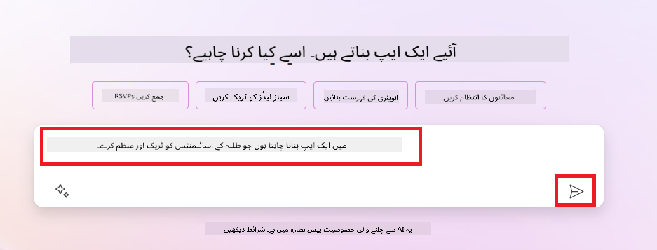
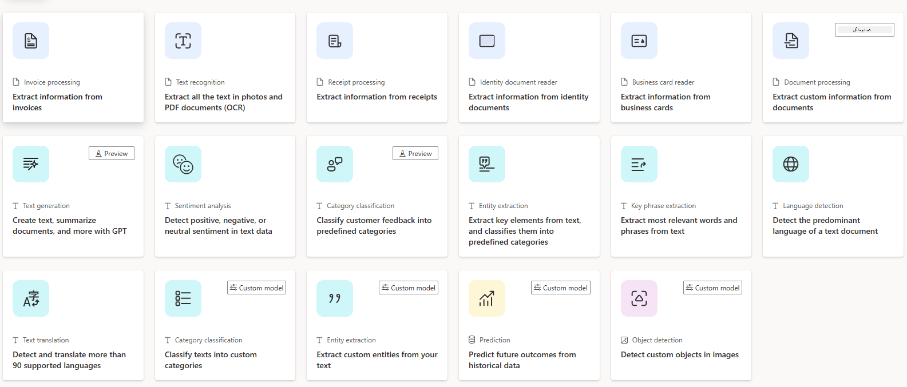
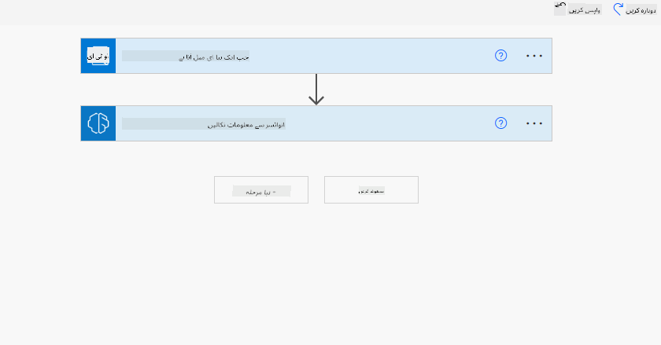
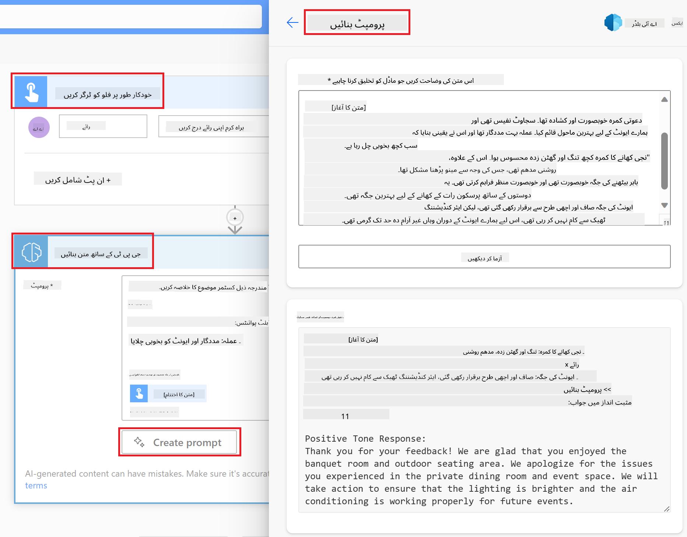

<!--
CO_OP_TRANSLATOR_METADATA:
{
  "original_hash": "f5ff3b6204a695a117d6f452403c95f7",
  "translation_date": "2025-07-09T13:43:19+00:00",
  "source_file": "10-building-low-code-ai-applications/README.md",
  "language_code": "ur"
}
-->
# لو کوڈ AI ایپلیکیشنز بنانا

> _(اس سبق کی ویڈیو دیکھنے کے لیے اوپر تصویر پر کلک کریں)_

## تعارف

اب جب کہ ہم نے سیکھ لیا ہے کہ تصویر بنانے والی ایپلیکیشنز کیسے بنائی جاتی ہیں، تو آئیے لو کوڈ کے بارے میں بات کرتے ہیں۔ جنریٹو AI مختلف شعبوں میں استعمال ہو سکتا ہے جن میں لو کوڈ بھی شامل ہے، لیکن لو کوڈ کیا ہے اور ہم اس میں AI کیسے شامل کر سکتے ہیں؟

روایتی ڈویلپرز اور غیر ڈویلپرز کے لیے Low Code Development Platforms کے ذریعے ایپس اور حل بنانا آسان ہو گیا ہے۔ Low Code Development Platforms آپ کو کم یا بالکل بغیر کوڈ کے ایپس اور حل بنانے کی سہولت دیتی ہیں۔ یہ ایک بصری ترقیاتی ماحول فراہم کرتی ہیں جہاں آپ کمپونینٹس کو ڈریگ اور ڈراپ کر کے ایپس اور حل بنا سکتے ہیں۔ اس سے آپ تیزی سے اور کم وسائل کے ساتھ ایپس اور حل بنا سکتے ہیں۔ اس سبق میں، ہم Low Code کے استعمال اور Power Platform کے ذریعے AI کے ساتھ لو کوڈ ترقی کو بہتر بنانے پر تفصیل سے بات کریں گے۔

Power Platform تنظیموں کو موقع فراہم کرتا ہے کہ وہ اپنی ٹیموں کو ایک آسان لو کوڈ یا نو کوڈ ماحول کے ذریعے اپنی خود کی حل بنانے کے قابل بنائیں۔ یہ ماحول حل بنانے کے عمل کو آسان بناتا ہے۔ Power Platform کے ذریعے حل دنوں یا ہفتوں میں بنائے جا سکتے ہیں بجائے مہینوں یا سالوں کے۔ Power Platform کے پانچ اہم مصنوعات ہیں: Power Apps، Power Automate، Power BI، Power Pages اور Copilot Studio۔

اس سبق میں شامل ہیں:

- Power Platform میں Generative AI کا تعارف  
- Copilot کا تعارف اور اسے کیسے استعمال کریں  
- Power Platform میں Generative AI کے ذریعے ایپس اور فلو بنانا  
- AI Builder کے ساتھ Power Platform میں AI ماڈلز کو سمجھنا  

## سیکھنے کے مقاصد

اس سبق کے اختتام تک، آپ قابل ہوں گے:

- سمجھنا کہ Power Platform میں Copilot کیسے کام کرتا ہے۔

- اپنی تعلیمی اسٹارٹ اپ کے لیے Student Assignment Tracker App بنانا۔

- انوائس سے معلومات نکالنے کے لیے AI استعمال کرتے ہوئے Invoice Processing Flow بنانا۔

- Create Text with GPT AI Model استعمال کرتے وقت بہترین طریقے اپنانا۔

اس سبق میں آپ جو ٹولز اور ٹیکنالوجیز استعمال کریں گے وہ ہیں:

- **Power Apps**، Student Assignment Tracker ایپ کے لیے، جو ایپس بنانے کے لیے ایک لو کوڈ ترقیاتی ماحول فراہم کرتا ہے تاکہ ڈیٹا کو ٹریک، منظم اور انٹرایکٹ کیا جا سکے۔

- **Dataverse**، Student Assignment Tracker ایپ کے ڈیٹا کو ذخیرہ کرنے کے لیے، جو ایپ کے ڈیٹا کو ذخیرہ کرنے کے لیے ایک لو کوڈ ڈیٹا پلیٹ فارم فراہم کرتا ہے۔

- **Power Automate**، Invoice Processing فلو کے لیے، جہاں آپ ورک فلو بنانے کے لیے لو کوڈ ترقیاتی ماحول استعمال کریں گے تاکہ انوائس پراسیسنگ کے عمل کو خودکار بنایا جا سکے۔

- **AI Builder**، Invoice Processing AI ماڈل کے لیے، جہاں آپ پہلے سے بنے ہوئے AI ماڈلز استعمال کریں گے تاکہ ہمارے اسٹارٹ اپ کے انوائسز کو پراسیس کیا جا سکے۔

## Power Platform میں Generative AI

لو کوڈ ترقی اور ایپلیکیشنز کو جنریٹو AI کے ذریعے بہتر بنانا Power Platform کا ایک اہم مرکز ہے۔ مقصد یہ ہے کہ ہر کوئی AI سے چلنے والی ایپس، سائٹس، ڈیش بورڈز بنا سکے اور AI کے ذریعے عمل کو خودکار بنا سکے، _بغیر کسی ڈیٹا سائنس کی مہارت کے_۔ یہ مقصد Power Platform میں جنریٹو AI کو لو کوڈ ترقیاتی تجربے میں شامل کر کے حاصل کیا جاتا ہے، جس کی شکل ہے Copilot اور AI Builder۔

### یہ کیسے کام کرتا ہے؟

Copilot ایک AI اسسٹنٹ ہے جو آپ کو Power Platform کے حل بنانے میں مدد دیتا ہے، جہاں آپ اپنی ضروریات کو قدرتی زبان میں بات چیت کے ذریعے بیان کرتے ہیں۔ مثال کے طور پر، آپ AI اسسٹنٹ کو بتا سکتے ہیں کہ آپ کی ایپ کون سے فیلڈز استعمال کرے گی، اور یہ ایپ اور اس کے نیچے کا ڈیٹا ماڈل دونوں بنا دے گا، یا آپ Power Automate میں فلو کیسے سیٹ اپ کرنا ہے، یہ بھی بتا سکتے ہیں۔

آپ Copilot کی خصوصیات کو اپنی ایپ کے اسکرینز میں فیچر کے طور پر استعمال کر سکتے ہیں تاکہ صارفین بات چیت کے ذریعے بصیرت حاصل کر سکیں۔

AI Builder Power Platform میں دستیاب ایک لو کوڈ AI صلاحیت ہے جو آپ کو AI ماڈلز استعمال کرنے کی اجازت دیتی ہے تاکہ آپ عمل کو خودکار بنا سکیں اور نتائج کی پیش گوئی کر سکیں۔ AI Builder کے ذریعے آپ اپنی ایپس اور فلو میں AI لا سکتے ہیں جو Dataverse یا مختلف کلاؤڈ ڈیٹا ذرائع جیسے SharePoint، OneDrive یا Azure سے جڑتے ہیں۔

Copilot Power Platform کی تمام مصنوعات میں دستیاب ہے: Power Apps، Power Automate، Power BI، Power Pages اور Power Virtual Agents۔ AI Builder Power Apps اور Power Automate میں دستیاب ہے۔ اس سبق میں، ہم Copilot اور AI Builder کو Power Apps اور Power Automate میں استعمال کرنے پر توجہ دیں گے تاکہ اپنی تعلیمی اسٹارٹ اپ کے لیے حل بنایا جا سکے۔

### Power Apps میں Copilot

Power Platform کے حصے کے طور پر، Power Apps ایک لو کوڈ ترقیاتی ماحول فراہم کرتا ہے تاکہ ایپس بنائی جا سکیں جو ڈیٹا کو ٹریک، منظم اور انٹرایکٹ کر سکیں۔ یہ ایپ ڈویلپمنٹ سروسز کا ایک مجموعہ ہے جس میں ایک قابل توسیع ڈیٹا پلیٹ فارم اور کلاؤڈ سروسز اور آن-پرمیسس ڈیٹا سے کنیکٹ کرنے کی صلاحیت شامل ہے۔ Power Apps آپ کو ایسی ایپس بنانے دیتا ہے جو براؤزرز، ٹیبلٹس اور فونز پر چلتی ہیں اور ساتھی کارکنوں کے ساتھ شیئر کی جا سکتی ہیں۔ Power Apps صارفین کو آسان انٹرفیس کے ذریعے ایپ ڈویلپمنٹ میں مدد دیتا ہے تاکہ ہر کاروباری صارف یا پروفیشنل ڈویلپر اپنی مرضی کی ایپس بنا سکے۔ ایپ ڈویلپمنٹ کا تجربہ Generative AI کے ذریعے Copilot کے ساتھ مزید بہتر ہوتا ہے۔

Power Apps میں Copilot AI اسسٹنٹ فیچر آپ کو بتانے دیتا ہے کہ آپ کو کس قسم کی ایپ چاہیے اور آپ کی ایپ کون سی معلومات ٹریک، جمع یا دکھائے گی۔ Copilot آپ کی وضاحت کی بنیاد پر ایک ریسپانسیو Canvas ایپ تیار کرتا ہے۔ آپ پھر اپنی ضروریات کے مطابق ایپ کو حسب ضرورت بنا سکتے ہیں۔ AI Copilot ایک Dataverse Table بھی بناتا اور تجویز کرتا ہے جس میں وہ فیلڈز شامل ہوتے ہیں جن میں آپ کو ڈیٹا ذخیرہ کرنا ہوتا ہے اور کچھ نمونہ ڈیٹا بھی شامل ہوتا ہے۔ ہم اس سبق میں بعد میں دیکھیں گے کہ Dataverse کیا ہے اور آپ اسے Power Apps میں کیسے استعمال کر سکتے ہیں۔ آپ پھر AI Copilot اسسٹنٹ فیچر کے ذریعے بات چیت کے مراحل میں ٹیبل کو اپنی ضروریات کے مطابق ڈھال سکتے ہیں۔ یہ فیچر Power Apps کے ہوم اسکرین سے آسانی سے دستیاب ہے۔

### Power Automate میں Copilot

Power Platform کے حصے کے طور پر، Power Automate صارفین کو ایپلیکیشنز اور سروسز کے درمیان خودکار ورک فلو بنانے دیتا ہے۔ یہ کاروباری عمل کو خودکار بنانے میں مدد دیتا ہے جیسے مواصلات، ڈیٹا جمع کرنا، اور فیصلوں کی منظوری۔ اس کا آسان انٹرفیس ہر تکنیکی مہارت رکھنے والے صارف (نئے سے تجربہ کار ڈویلپر تک) کو کام کے کاموں کو خودکار بنانے کی اجازت دیتا ہے۔ ورک فلو ڈویلپمنٹ کا تجربہ بھی Generative AI کے ذریعے Copilot کے ساتھ بہتر ہوتا ہے۔

Power Automate میں Copilot AI اسسٹنٹ فیچر آپ کو بتانے دیتا ہے کہ آپ کو کس قسم کا فلو چاہیے اور آپ کا فلو کون سے اقدامات انجام دے۔ Copilot آپ کی وضاحت کی بنیاد پر فلو تیار کرتا ہے۔ آپ پھر اپنی ضروریات کے مطابق فلو کو حسب ضرورت بنا سکتے ہیں۔ AI Copilot آپ کو وہ اقدامات بھی تجویز کرتا ہے جو آپ کو مطلوبہ کام کو خودکار بنانے کے لیے کرنے ہوں گے۔ ہم اس سبق میں بعد میں دیکھیں گے کہ فلو کیا ہوتے ہیں اور آپ انہیں Power Automate میں کیسے استعمال کر سکتے ہیں۔ آپ پھر AI Copilot اسسٹنٹ فیچر کے ذریعے بات چیت کے مراحل میں اقدامات کو اپنی ضروریات کے مطابق ڈھال سکتے ہیں۔ یہ فیچر Power Automate کے ہوم اسکرین سے آسانی سے دستیاب ہے۔

## اسائنمنٹ: Copilot استعمال کرتے ہوئے ہمارے اسٹارٹ اپ کے لیے طلبہ کے اسائنمنٹس اور انوائسز کا انتظام کریں

ہمارا اسٹارٹ اپ طلبہ کو آن لائن کورسز فراہم کرتا ہے۔ اسٹارٹ اپ تیزی سے بڑھ رہا ہے اور اب اپنے کورسز کی طلب کو پورا کرنے میں مشکل محسوس کر رہا ہے۔ اسٹارٹ اپ نے آپ کو Power Platform ڈویلپر کے طور پر ملازمت دی ہے تاکہ وہ ایک لو کوڈ حل بنا سکیں جو طلبہ کے اسائنمنٹس اور انوائسز کا انتظام کرنے میں مدد دے۔ ان کا حل ایک ایپ کے ذریعے طلبہ کے اسائنمنٹس کو ٹریک اور منظم کرنے اور ایک ورک فلو کے ذریعے انوائس پراسیسنگ کے عمل کو خودکار بنانے کے قابل ہونا چاہیے۔ آپ سے کہا گیا ہے کہ آپ جنریٹو AI استعمال کرتے ہوئے یہ حل تیار کریں۔

جب آپ Copilot استعمال کرنا شروع کریں تو آپ [Power Platform Copilot Prompt Library](https://github.com/pnp/powerplatform-prompts?WT.mc_id=academic-109639-somelezediko) استعمال کر سکتے ہیں تاکہ پرامپٹس کے ساتھ آغاز کیا جا سکے۔ اس لائبریری میں پرامپٹس کی فہرست ہے جنہیں آپ Copilot کے ساتھ ایپس اور فلو بنانے کے لیے استعمال کر سکتے ہیں۔ آپ اس لائبریری کے پرامپٹس کو یہ سمجھنے کے لیے بھی استعمال کر سکتے ہیں کہ اپنی ضروریات کو Copilot کو کیسے بیان کیا جائے۔

### ہمارے اسٹارٹ اپ کے لیے Student Assignment Tracker App بنائیں

ہمارے اسٹارٹ اپ کے اساتذہ طلبہ کے اسائنمنٹس کو ٹریک کرنے میں مشکل محسوس کر رہے ہیں۔ وہ اسائنمنٹس کو ٹریک کرنے کے لیے اسپریڈشیٹ استعمال کر رہے تھے لیکن طلبہ کی تعداد بڑھنے کے ساتھ یہ مشکل ہو گیا ہے۔ انہوں نے آپ سے کہا ہے کہ آپ ایک ایسی ایپ بنائیں جو اسائنمنٹس کو ٹریک اور منظم کرنے میں مدد دے۔ ایپ کو نئے اسائنمنٹس شامل کرنے، اسائنمنٹس دیکھنے، اپ ڈیٹ کرنے اور حذف کرنے کی سہولت دینی چاہیے۔ ایپ اساتذہ اور طلبہ کو یہ بھی دکھائے کہ کون سے اسائنمنٹس کی گریڈنگ ہو چکی ہے اور کون سے نہیں ہوئی۔

آپ Copilot کو Power Apps میں استعمال کرتے ہوئے نیچے دیے گئے مراحل کی پیروی کرتے ہوئے ایپ بنائیں گے:

1. [Power Apps](https://make.powerapps.com?WT.mc_id=academic-105485-koreyst) کے ہوم اسکرین پر جائیں۔

1. ہوم اسکرین پر موجود ٹیکسٹ ایریا میں وہ ایپ بیان کریں جو آپ بنانا چاہتے ہیں۔ مثال کے طور پر، **_میں ایک ایسی ایپ بنانا چاہتا ہوں جو طلبہ کے اسائنمنٹس کو ٹریک اور منظم کرے_**۔ AI Copilot کو پرامپٹ بھیجنے کے لیے **Send** بٹن پر کلک کریں۔

1. AI Copilot آپ کے لیے ایک Dataverse Table تجویز کرے گا جس میں وہ فیلڈز ہوں گے جن میں آپ کو ڈیٹا ذخیرہ کرنا ہے اور کچھ نمونہ ڈیٹا بھی شامل ہوگا۔ آپ پھر AI Copilot اسسٹنٹ فیچر کے ذریعے بات چیت کے مراحل میں ٹیبل کو اپنی ضروریات کے مطابق ڈھال سکتے ہیں۔

   > **اہم**: Dataverse Power Platform کے لیے بنیادی ڈیٹا پلیٹ فارم ہے۔ یہ ایپ کے ڈیٹا کو ذخیرہ کرنے کے لیے ایک لو کوڈ ڈیٹا پلیٹ فارم ہے۔ یہ ایک مکمل منظم سروس ہے جو Microsoft Cloud میں ڈیٹا کو محفوظ طریقے سے ذخیرہ کرتی ہے اور آپ کے Power Platform ماحول میں پروویژن کی جاتی ہے۔ اس میں بلٹ ان ڈیٹا گورننس خصوصیات شامل ہیں، جیسے ڈیٹا کی درجہ بندی، ڈیٹا لائنج، باریک بینی سے رسائی کنٹرول، اور بہت کچھ۔ آپ Dataverse کے بارے میں مزید یہاں جان سکتے ہیں: [یہاں](https://docs.microsoft.com/powerapps/maker/data-platform/data-platform-intro?WT.mc_id=academic-109639-somelezediko)۔

   

1. اساتذہ ان طلبہ کو ای میل بھیجنا چاہتے ہیں جنہوں نے اپنے اسائنمنٹس جمع کروائے ہیں تاکہ انہیں اسائنمنٹس کی پیش رفت سے آگاہ رکھا جا سکے۔ آپ Copilot استعمال کرتے ہوئے ٹیبل میں ایک نیا فیلڈ شامل کر سکتے ہیں تاکہ طلبہ کا ای میل ذخیرہ کیا جا سکے۔ مثال کے طور پر، آپ درج ذیل پرامپٹ استعمال کر سکتے ہیں: **_میں ٹیبل میں طلبہ کے ای میل ذخیرہ کرنے کے لیے ایک کالم شامل کرنا چاہتا ہوں_**۔ AI Copilot کو پرامپٹ بھیجنے کے لیے **Send** بٹن پر کلک کریں۔

1. AI Copilot ایک نیا فیلڈ بنائے گا اور آپ پھر اس فیلڈ کو اپنی ضروریات کے مطابق ڈھال سکتے ہیں۔

1. جب آپ ٹیبل مکمل کر لیں، تو ایپ بنانے کے لیے **Create app** بٹن پر کلک کریں۔

1. AI Copilot آپ کی وضاحت کی بنیاد پر ایک ریسپانسیو Canvas ایپ تیار کرے گا۔ آپ پھر ایپ کو اپنی ضروریات کے مطابق حسب ضرورت بنا سکتے ہیں۔

1. اساتذہ کو طلبہ کو ای میل بھیجنے کے لیے، آپ Copilot استعمال کرتے ہوئے ایپ میں ایک نیا اسکرین شامل کر سکتے ہیں۔ مثال کے طور پر، آپ درج ذیل پرامپٹ استعمال کر سکتے ہیں: **_میں طلبہ کو ای میل بھیجنے کے لیے ایک اسکرین شامل کرنا چاہتا ہوں_**۔ AI Copilot کو پرامپٹ بھیجنے کے لیے **Send** بٹن پر کلک کریں۔

1. AI Copilot ایک نیا اسکرین بنائے گا اور آپ پھر اس اسکرین کو اپنی ضروریات کے مطابق ڈھال سکتے ہیں۔

1. جب آپ ایپ مکمل کر لیں، تو اسے محفوظ کرنے کے لیے **Save** بٹن پر کلک کریں۔

1. اساتذہ کے ساتھ ایپ شیئر کرنے کے لیے، **Share** بٹن پر کلک کریں اور پھر دوبارہ **Share** بٹن پر کلک کریں۔ آپ ایپ کو اساتذہ کے ای میل پتے درج کر کے شیئر کر سکتے ہیں۔

> **آپ کا ہوم ورک**: آپ نے جو ایپ ابھی بنائی ہے وہ ایک اچھا آغاز ہے لیکن اسے بہتر بنایا جا سکتا ہے۔ ای میل فیچر کے ساتھ، اساتذہ صرف دستی طور پر ای میلز بھیج سکتے ہیں کیونکہ انہیں ای میلز ٹائپ کرنی پڑتی ہیں۔ کیا آپ Copilot استعمال کرتے ہوئے ایک ایسا آٹومیشن بنا سکتے ہیں جو اساتذہ کو خودکار طور پر ای میلز بھیجنے دے جب طلبہ اپنے اسائنمنٹس جمع کروائیں؟ آپ کی رہنمائی کے لیے، صحیح پرامپٹ کے ساتھ آپ Power Automate میں Copilot استعمال کر کے یہ کر سکتے ہیں۔

### ہمارے اسٹارٹ اپ کے لیے انوائسز کی معلومات کا ٹیبل بنائیں

ہمارے اسٹارٹ اپ کی فنانس ٹیم انوائسز کو ٹریک کرنے میں مشکل محسوس کر رہی ہے۔ وہ انوائسز کو ٹریک کرنے کے لیے اسپریڈشیٹ استعمال کر رہے تھے لیکن انوائسز کی تعداد بڑھنے کے ساتھ یہ مشکل ہو گیا ہے۔ انہوں نے آپ سے کہا ہے کہ آپ ایک ایسا ٹیبل بنائیں جو انوائسز کی معلومات ذخیرہ، ٹریک اور منظم کرنے میں مدد دے۔ یہ ٹیبل ایک آٹومیشن بنانے کے لیے استعمال کیا جائے گا جو تمام انوائس معلومات نکال کر ٹیبل میں ذخیرہ کرے گا۔ یہ ٹیبل فنانس ٹیم کو یہ دیکھنے کی بھی اجازت دے گا کہ کون سی انوائسز ادا کی جا چکی ہیں اور کون سی نہیں۔

Power Platform کے پاس ایک بنیادی ڈیٹا پلیٹ فارم ہے جسے Dataverse کہتے ہیں جو آپ کو اپنی ایپس اور حل کے لیے ڈیٹا ذخیرہ کرنے کی اجازت دیتا ہے۔ Dataverse ایپ کے ڈیٹا کو ذخیرہ کرنے کے لیے ایک لو کوڈ ڈیٹا پلیٹ فارم فراہم کرتا ہے۔ یہ ایک مکمل منظم سروس ہے جو Microsoft Cloud میں ڈیٹا کو محفوظ طریقے سے ذخیرہ کرتی ہے اور آپ کے Power Platform ماحول میں پروویژن کی جاتی ہے۔ اس میں بلٹ ان ڈیٹا گورننس خصوصیات شامل ہیں، جیسے ڈیٹا کی درجہ بندی، ڈیٹا لائنج، باریک بینی سے رسائی کنٹرول، اور بہت کچھ۔ آپ Dataverse کے بارے میں مزید یہاں جان سکتے ہیں: [یہاں](https://docs.microsoft.com/powerapps/maker/data-platform/data-platform-intro?WT.mc_id=academic-109639-somelezediko)۔

ہمیں اپنے اسٹارٹ اپ کے لیے Dataverse کیوں استعمال کرنا چاہیے؟ Dataverse کے اندر موجود معیاری اور حسب ضرورت ٹیبلز آپ کے ڈیٹا کے لیے ایک محفوظ اور کلاؤڈ بیسڈ ذخیرہ فراہم کرتے ہیں۔ ٹیبلز آپ کو مختلف قسم کے ڈیٹا ذخیرہ کرنے دیتے ہیں، بالکل اسی طرح جیسے آپ ایکسل ورک بک میں متعدد ورک شیٹس استعمال کرتے ہیں۔ آپ ٹیبلز کو اپنے ادارے یا کاروباری ضروریات کے مطابق مخصوص ڈیٹا ذخیرہ کرنے کے لیے استعمال کر سکتے ہیں۔ Dataverse استعمال کرنے کے کچھ فوائد جو
- **آسان انتظام**: میٹا ڈیٹا اور ڈیٹا دونوں کلاؤڈ میں محفوظ ہوتے ہیں، اس لیے آپ کو اس بات کی فکر نہیں کرنی پڑتی کہ وہ کیسے محفوظ یا منظم کیے جاتے ہیں۔ آپ اپنی ایپس اور حل بنانے پر توجہ مرکوز کر سکتے ہیں۔

- **محفوظ**: Dataverse آپ کے ڈیٹا کے لیے ایک محفوظ اور کلاؤڈ بیسڈ اسٹوریج فراہم کرتا ہے۔ آپ رول بیسڈ سیکیورٹی کے ذریعے کنٹرول کر سکتے ہیں کہ کون آپ کی ٹیبلز کے ڈیٹا تک رسائی حاصل کر سکتا ہے اور وہ کس طرح رسائی حاصل کرے گا۔

- **مفصل میٹا ڈیٹا**: ڈیٹا کی اقسام اور تعلقات براہ راست Power Apps میں استعمال ہوتے ہیں۔

- **منطق اور تصدیق**: آپ بزنس رولز، کیلکولیٹڈ فیلڈز، اور ویلیڈیشن رولز استعمال کر کے کاروباری منطق نافذ کر سکتے ہیں اور ڈیٹا کی درستگی برقرار رکھ سکتے ہیں۔

اب جب کہ آپ جان چکے ہیں کہ Dataverse کیا ہے اور آپ کو اسے کیوں استعمال کرنا چاہیے، آئیے دیکھتے ہیں کہ آپ Copilot کا استعمال کرتے ہوئے Dataverse میں ایک ٹیبل کیسے بنا سکتے ہیں جو ہماری فنانس ٹیم کی ضروریات کو پورا کرے۔

> **Note** : آپ اگلے سیکشن میں اس ٹیبل کو استعمال کریں گے تاکہ ایک آٹومیشن بنائی جا سکے جو تمام انوائس کی معلومات نکال کر ٹیبل میں محفوظ کرے۔

Copilot کا استعمال کرتے ہوئے Dataverse میں ٹیبل بنانے کے لیے درج ذیل مراحل پر عمل کریں:

1. [Power Apps](https://make.powerapps.com?WT.mc_id=academic-105485-koreyst) کے ہوم اسکرین پر جائیں۔

2. بائیں نیویگیشن بار میں **Tables** منتخب کریں اور پھر **Describe the new Table** پر کلک کریں۔

3. **Describe the new Table** اسکرین پر، ٹیکسٹ ایریا میں اس ٹیبل کی وضاحت کریں جو آپ بنانا چاہتے ہیں۔ مثال کے طور پر، **_I want to create a table to store invoice information_**۔ AI Copilot کو پرامپٹ بھیجنے کے لیے **Send** بٹن پر کلک کریں۔

4. AI Copilot آپ کو ایک Dataverse ٹیبل تجویز کرے گا جس میں وہ فیلڈز ہوں گے جن کی آپ کو ڈیٹا محفوظ کرنے کے لیے ضرورت ہے اور کچھ نمونہ ڈیٹا بھی ہوگا۔ آپ پھر AI Copilot اسسٹنٹ فیچر کے ذریعے بات چیت کے مراحل میں ٹیبل کو اپنی ضروریات کے مطابق حسبِ منشا بنا سکتے ہیں۔

5. فنانس ٹیم سپلائر کو انوائس کی موجودہ صورتحال سے آگاہ کرنے کے لیے ای میل بھیجنا چاہتی ہے۔ آپ Copilot کا استعمال کرتے ہوئے ٹیبل میں سپلائر ای میل محفوظ کرنے کے لیے نیا فیلڈ شامل کر سکتے ہیں۔ مثال کے طور پر، آپ درج ذیل پرامپٹ استعمال کر سکتے ہیں: **_I want to add a column to store supplier email_**۔ AI Copilot کو پرامپٹ بھیجنے کے لیے **Send** پر کلک کریں۔

6. AI Copilot نیا فیلڈ تیار کرے گا اور آپ اسے اپنی ضروریات کے مطابق حسبِ منشا بنا سکتے ہیں۔

7. جب آپ ٹیبل بنا لیں، تو **Create** بٹن پر کلک کر کے ٹیبل بنائیں۔

## Power Platform میں AI Models اور AI Builder

AI Builder Power Platform میں ایک لو کوڈ AI صلاحیت ہے جو آپ کو AI Models استعمال کرنے کی اجازت دیتی ہے تاکہ آپ عمل کو خودکار بنا سکیں اور نتائج کی پیش گوئی کر سکیں۔ AI Builder کے ذریعے آپ اپنی ایپس اور فلو میں AI شامل کر سکتے ہیں جو Dataverse یا مختلف کلاؤڈ ڈیٹا ذرائع جیسے SharePoint، OneDrive، یا Azure سے جڑے ہوتے ہیں۔

## Prebuilt AI Models بمقابلہ Custom AI Models

AI Builder دو قسم کے AI Models فراہم کرتا ہے: Prebuilt AI Models اور Custom AI Models۔ Prebuilt AI Models وہ تیار شدہ ماڈلز ہیں جنہیں Microsoft نے تربیت دی ہے اور Power Platform میں دستیاب ہیں۔ یہ آپ کی ایپس اور فلو میں ذہانت شامل کرنے میں مدد دیتے ہیں بغیر ڈیٹا جمع کیے اور اپنے ماڈلز بنانے، تربیت دینے اور شائع کرنے کی ضرورت کے۔ آپ ان ماڈلز کو عمل کو خودکار بنانے اور نتائج کی پیش گوئی کے لیے استعمال کر سکتے ہیں۔

Power Platform میں دستیاب کچھ Prebuilt AI Models میں شامل ہیں:

- **Key Phrase Extraction**: یہ ماڈل متن سے اہم جملے نکالتا ہے۔
- **Language Detection**: یہ ماڈل متن کی زبان کا پتہ لگاتا ہے۔
- **Sentiment Analysis**: یہ ماڈل متن میں مثبت، منفی، غیر جانبدار، یا مخلوط جذبات کا پتہ لگاتا ہے۔
- **Business Card Reader**: یہ ماڈل بزنس کارڈز سے معلومات نکالتا ہے۔
- **Text Recognition**: یہ ماڈل تصاویر سے متن نکالتا ہے۔
- **Object Detection**: یہ ماڈل تصاویر سے اشیاء کا پتہ لگاتا اور نکالتا ہے۔
- **Document processing**: یہ ماڈل فارم سے معلومات نکالتا ہے۔
- **Invoice Processing**: یہ ماڈل انوائسز سے معلومات نکالتا ہے۔

Custom AI Models کے ذریعے آپ اپنا ماڈل AI Builder میں لا سکتے ہیں تاکہ یہ کسی بھی AI Builder کسٹم ماڈل کی طرح کام کرے، اور آپ اپنے ڈیٹا سے ماڈل کو تربیت دے سکتے ہیں۔ آپ ان ماڈلز کو Power Apps اور Power Automate دونوں میں عمل کو خودکار بنانے اور نتائج کی پیش گوئی کے لیے استعمال کر سکتے ہیں۔ اپنے ماڈل کے استعمال پر کچھ پابندیاں لاگو ہوتی ہیں۔ ان پابندیوں کے بارے میں مزید پڑھیں [limitations](https://learn.microsoft.com/ai-builder/byo-model#limitations?WT.mc_id=academic-105485-koreyst)۔

## اسائنمنٹ #2 - ہمارے اسٹارٹ اپ کے لیے انوائس پروسیسنگ فلو بنائیں

فنانس ٹیم انوائسز کو پروسیس کرنے میں مشکلات کا سامنا کر رہی ہے۔ وہ انوائسز کو ٹریک کرنے کے لیے اسپریڈشیٹ استعمال کر رہے تھے لیکن انوائسز کی تعداد بڑھنے کی وجہ سے انتظام مشکل ہو گیا ہے۔ انہوں نے آپ سے درخواست کی ہے کہ آپ ایک ورک فلو بنائیں جو AI کا استعمال کرتے ہوئے انوائسز کو پروسیس کرنے میں ان کی مدد کرے۔ یہ ورک فلو انوائسز سے معلومات نکال کر Dataverse ٹیبل میں محفوظ کرے گا۔ اس کے علاوہ، یہ ورک فلو فنانس ٹیم کو نکالی گئی معلومات کے ساتھ ای میل بھی بھیجے گا۔

اب جب کہ آپ جان چکے ہیں کہ AI Builder کیا ہے اور آپ کو اسے کیوں استعمال کرنا چاہیے، آئیے دیکھتے ہیں کہ آپ AI Builder میں Invoice Processing AI Model کا استعمال کرتے ہوئے فنانس ٹیم کی مدد کے لیے ورک فلو کیسے بنا سکتے ہیں۔

Invoice Processing AI Model کا استعمال کرتے ہوئے فنانس ٹیم کے لیے ورک فلو بنانے کے لیے درج ذیل مراحل پر عمل کریں:

1. [Power Automate](https://make.powerautomate.com?WT.mc_id=academic-105485-koreyst) کے ہوم اسکرین پر جائیں۔

2. ہوم اسکرین پر موجود ٹیکسٹ ایریا میں اس ورک فلو کی وضاحت کریں جو آپ بنانا چاہتے ہیں۔ مثال کے طور پر، **_Process an invoice when it arrives in my mailbox_**۔ AI Copilot کو پرامپٹ بھیجنے کے لیے **Send** بٹن پر کلک کریں۔

   

3. AI Copilot آپ کو وہ ایکشنز تجویز کرے گا جو آپ کے کام کو خودکار بنانے کے لیے ضروری ہیں۔ آپ اگلے مراحل پر جانے کے لیے **Next** بٹن پر کلک کر سکتے ہیں۔

4. اگلے مرحلے پر، Power Automate آپ سے فلو کے لیے درکار کنکشنز سیٹ اپ کرنے کو کہے گا۔ جب آپ مکمل کر لیں، تو فلو بنانے کے لیے **Create flow** بٹن پر کلک کریں۔

5. AI Copilot ایک فلو تیار کرے گا اور آپ اسے اپنی ضروریات کے مطابق حسبِ منشا بنا سکتے ہیں۔

6. فلو کے ٹرگر کو اپ ڈیٹ کریں اور **Folder** کو اس فولڈر پر سیٹ کریں جہاں انوائسز محفوظ ہوں گی۔ مثال کے طور پر، آپ فولڈر کو **Inbox** پر سیٹ کر سکتے ہیں۔ **Show advanced options** پر کلک کریں اور **Only with Attachments** کو **Yes** پر سیٹ کریں۔ اس سے یہ یقینی ہوگا کہ فلو صرف اس وقت چلے جب فولڈر میں اٹیچمنٹ والی ای میل آئے۔

7. فلو سے درج ذیل ایکشنز ہٹا دیں: **HTML to text**, **Compose**, **Compose 2**, **Compose 3** اور **Compose 4** کیونکہ آپ انہیں استعمال نہیں کریں گے۔

8. فلو سے **Condition** ایکشن بھی ہٹا دیں کیونکہ آپ اسے استعمال نہیں کریں گے۔ یہ اسکرین شاٹ کی طرح نظر آنا چاہیے:

   

9. **Add an action** بٹن پر کلک کریں اور **Dataverse** تلاش کریں۔ پھر **Add a new row** ایکشن منتخب کریں۔

10. **Extract Information from invoices** ایکشن میں، **Invoice File** کو ای میل کے **Attachment Content** سے جوڑیں۔ اس سے یہ یقینی ہوگا کہ فلو انوائس اٹیچمنٹ سے معلومات نکالے۔

11. وہ **Table** منتخب کریں جو آپ نے پہلے بنایا تھا۔ مثال کے طور پر، آپ **Invoice Information** ٹیبل منتخب کر سکتے ہیں۔ پچھلے ایکشن سے ڈائنامک مواد منتخب کریں تاکہ درج ذیل فیلڈز کو بھرا جا سکے:

    - ID  
    - Amount  
    - Date  
    - Name  
    - Status - **Status** کو **Pending** پر سیٹ کریں۔  
    - Supplier Email - **When a new email arrives** ٹرگر سے **From** ڈائنامک مواد استعمال کریں۔

    

12. جب آپ فلو مکمل کر لیں، تو اسے محفوظ کرنے کے لیے **Save** بٹن پر کلک کریں۔ پھر آپ فلو کو ٹیسٹ کرنے کے لیے انوائس کے ساتھ ایک ای میل اس فولڈر میں بھیج سکتے ہیں جو آپ نے ٹرگر میں مخصوص کیا ہے۔

> **آپ کا ہوم ورک**: آپ نے جو فلو بنایا ہے وہ ایک اچھا آغاز ہے، اب آپ کو سوچنا ہے کہ آپ کیسے ایک آٹومیشن بنا سکتے ہیں جو ہماری فنانس ٹیم کو سپلائر کو ای میل بھیجنے کے قابل بنائے تاکہ انوائس کی موجودہ صورتحال سے آگاہ کیا جا سکے۔ آپ کی ہنٹ: فلو کو اس وقت چلنا چاہیے جب انوائس کی صورتحال تبدیل ہو۔

## Power Automate میں Text Generation AI Model کا استعمال

AI Builder میں Create Text with GPT AI Model آپ کو پرامپٹ کی بنیاد پر متن تیار کرنے کی سہولت دیتا ہے اور یہ Microsoft Azure OpenAI Service سے چلتا ہے۔ اس صلاحیت کے ذریعے، آپ GPT (Generative Pre-Trained Transformer) ٹیکنالوجی کو اپنی ایپس اور فلو میں شامل کر سکتے ہیں تاکہ مختلف خودکار فلو اور بصیرت افروز ایپلیکیشنز بنا سکیں۔

GPT ماڈلز وسیع مقدار میں ڈیٹا پر تربیت یافتہ ہوتے ہیں، جس کی بدولت یہ پرامپٹ ملنے پر انسان جیسا متن تیار کر سکتے ہیں۔ ورک فلو آٹومیشن کے ساتھ انضمام کے ذریعے، GPT جیسے AI ماڈلز کو مختلف کاموں کو آسان اور خودکار بنانے کے لیے استعمال کیا جا سکتا ہے۔

مثال کے طور پر، آپ فلو بنا سکتے ہیں جو خودکار طور پر مختلف استعمالات کے لیے متن تیار کرے، جیسے ای میل کے مسودے، مصنوعات کی تفصیلات، اور بہت کچھ۔ آپ اس ماڈل کو چیٹ بوٹس اور کسٹمر سروس ایپس کے لیے بھی استعمال کر سکتے ہیں جو کسٹمر سروس ایجنٹس کو مؤثر اور تیز جواب دینے میں مدد دیتی ہیں۔

Power Automate میں اس AI ماڈل کے استعمال کا طریقہ سیکھنے کے لیے [Add intelligence with AI Builder and GPT](https://learn.microsoft.com/training/modules/ai-builder-text-generation/?WT.mc_id=academic-109639-somelezediko) ماڈیول کا مطالعہ کریں۔

## شاباش! اپنی تعلیم جاری رکھیں

اس سبق کو مکمل کرنے کے بعد، ہماری [Generative AI Learning collection](https://aka.ms/genai-collection?WT.mc_id=academic-105485-koreyst) دیکھیں تاکہ اپنی Generative AI کی معلومات کو مزید بہتر بنا سکیں!

سبق 11 پر جائیں جہاں ہم دیکھیں گے کہ [Generative AI کو Function Calling کے ساتھ کیسے مربوط کیا جائے](../11-integrating-with-function-calling/README.md?WT.mc_id=academic-105485-koreyst)!

**دستخطی نوٹ**:  
یہ دستاویز AI ترجمہ سروس [Co-op Translator](https://github.com/Azure/co-op-translator) کے ذریعے ترجمہ کی گئی ہے۔ اگرچہ ہم درستگی کے لیے کوشاں ہیں، براہ کرم آگاہ رہیں کہ خودکار ترجمے میں غلطیاں یا عدم درستیاں ہو سکتی ہیں۔ اصل دستاویز اپنی مادری زبان میں ہی معتبر ماخذ سمجھی جانی چاہیے۔ اہم معلومات کے لیے پیشہ ور انسانی ترجمہ کی سفارش کی جاتی ہے۔ اس ترجمے کے استعمال سے پیدا ہونے والی کسی بھی غلط فہمی یا غلط تشریح کی ذمہ داری ہم پر عائد نہیں ہوتی۔