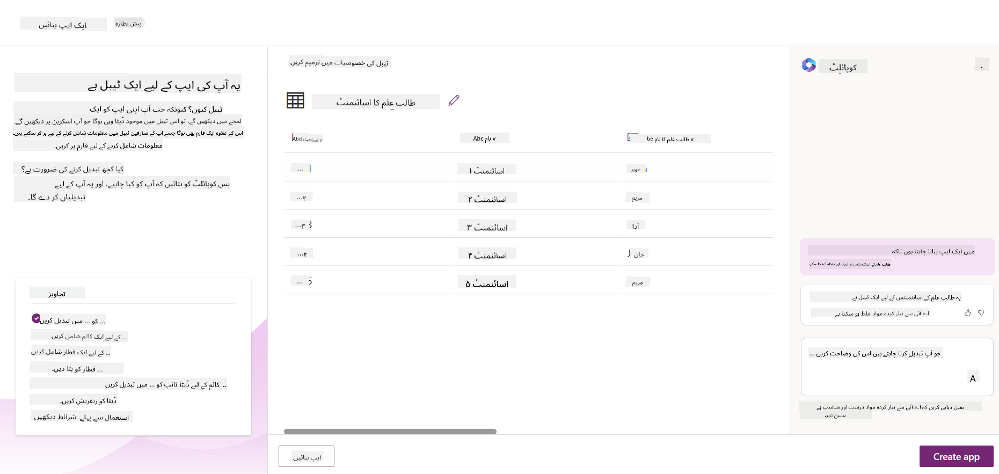
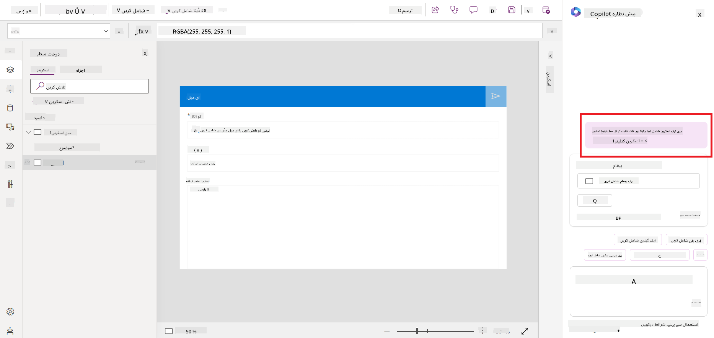
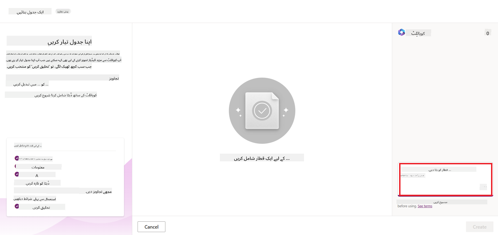
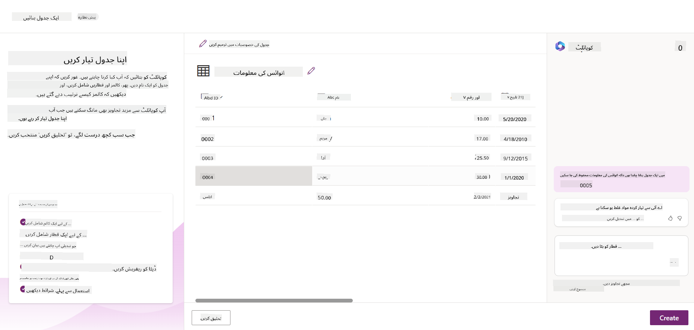

<!--
CO_OP_TRANSLATOR_METADATA:
{
  "original_hash": "846ac8e3b7dcfb697d3309fec05f0fea",
  "translation_date": "2025-10-17T13:03:38+00:00",
  "source_file": "10-building-low-code-ai-applications/README.md",
  "language_code": "ur"
}
-->
# کم کوڈ اے آئی ایپلیکیشنز بنانا

> _(اوپر دی گئی تصویر پر کلک کریں تاکہ اس سبق کی ویڈیو دیکھ سکیں)_

## تعارف

اب جب کہ ہم نے تصویر بنانے والی ایپلیکیشنز بنانا سیکھ لیا ہے، آئیے کم کوڈ کے بارے میں بات کرتے ہیں۔ جنریٹو اے آئی مختلف شعبوں میں استعمال ہو سکتی ہے، جن میں کم کوڈ بھی شامل ہے، لیکن کم کوڈ کیا ہے اور ہم اس میں اے آئی کیسے شامل کر سکتے ہیں؟

ایپلیکیشنز اور حل بنانا روایتی ڈویلپرز اور غیر ڈویلپرز کے لیے کم کوڈ ڈیولپمنٹ پلیٹ فارمز کے ذریعے آسان ہو گیا ہے۔ کم کوڈ ڈیولپمنٹ پلیٹ فارمز آپ کو ایپلیکیشنز اور حل بنانے کی اجازت دیتے ہیں جن میں کوڈنگ کی بہت کم یا بالکل ضرورت نہیں ہوتی۔ یہ ایک بصری ڈیولپمنٹ ماحول فراہم کر کے حاصل کیا جاتا ہے جو آپ کو ایپلیکیشنز اور حل بنانے کے لیے اجزاء کو ڈریگ اور ڈراپ کرنے کی اجازت دیتا ہے۔ اس سے آپ ایپلیکیشنز اور حل تیزی سے اور کم وسائل کے ساتھ بنا سکتے ہیں۔ اس سبق میں، ہم کم کوڈ کے استعمال اور پاور پلیٹ فارم کے ذریعے کم کوڈ ڈیولپمنٹ کو اے آئی کے ساتھ بہتر بنانے کے طریقے پر گہرائی سے بات کریں گے۔

پاور پلیٹ فارم تنظیموں کو اپنے ٹیموں کو ایک آسان کم کوڈ یا بغیر کوڈ کے ماحول کے ذریعے اپنے حل بنانے کا اختیار فراہم کرتا ہے۔ یہ ماحول حل بنانے کے عمل کو آسان بناتا ہے۔ پاور پلیٹ فارم کے ذریعے، حل دنوں یا ہفتوں میں بنائے جا سکتے ہیں، مہینوں یا سالوں کے بجائے۔ پاور پلیٹ فارم پانچ اہم پروڈکٹس پر مشتمل ہے: پاور ایپس، پاور آٹومیٹ، پاور بی آئی، پاور پیجز اور کوپائلٹ اسٹوڈیو۔

یہ سبق شامل کرتا ہے:

- پاور پلیٹ فارم میں جنریٹو اے آئی کا تعارف
- کوپائلٹ کا تعارف اور اس کے استعمال کا طریقہ
- پاور پلیٹ فارم میں جنریٹو اے آئی کے ذریعے ایپلیکیشنز اور فلو بنانا
- اے آئی بلڈر کے ساتھ پاور پلیٹ فارم میں اے آئی ماڈلز کو سمجھنا

## سیکھنے کے اہداف

اس سبق کے اختتام تک، آپ یہ کرنے کے قابل ہوں گے:

- پاور پلیٹ فارم میں کوپائلٹ کے کام کرنے کے طریقے کو سمجھنا۔

- ہماری ایجوکیشن اسٹارٹ اپ کے لیے اسٹوڈنٹ اسائنمنٹ ٹریکر ایپ بنانا۔

- ایک انوائس پروسیسنگ فلو بنانا جو انوائسز سے معلومات نکالنے کے لیے اے آئی کا استعمال کرے۔

- جی پی ٹی اے آئی ماڈل کے ساتھ ٹیکسٹ بنانے کے بہترین طریقے اپنانا۔

اس سبق میں آپ جو ٹولز اور ٹیکنالوجیز استعمال کریں گے وہ ہیں:

- **پاور ایپس**، اسٹوڈنٹ اسائنمنٹ ٹریکر ایپ کے لیے، جو ڈیٹا کو ٹریک، مینیج اور انٹریکٹ کرنے کے لیے ایپلیکیشنز بنانے کے لیے کم کوڈ ڈیولپمنٹ ماحول فراہم کرتا ہے۔

- **ڈیٹا ورس**، اسٹوڈنٹ اسائنمنٹ ٹریکر ایپ کے ڈیٹا کو اسٹور کرنے کے لیے، جہاں ڈیٹا ورس ایپ کے ڈیٹا کو اسٹور کرنے کے لیے کم کوڈ ڈیٹا پلیٹ فارم فراہم کرے گا۔

- **پاور آٹومیٹ**، انوائس پروسیسنگ فلو کے لیے، جہاں آپ انوائس پروسیسنگ کے عمل کو خودکار بنانے کے لیے ورک فلو بنانے کے لیے کم کوڈ ڈیولپمنٹ ماحول حاصل کریں گے۔

- **اے آئی بلڈر**، انوائس پروسیسنگ اے آئی ماڈل کے لیے، جہاں آپ ہمارے اسٹارٹ اپ کے انوائسز کو پروسیس کرنے کے لیے پہلے سے بنے ہوئے اے آئی ماڈلز استعمال کریں گے۔

## پاور پلیٹ فارم میں جنریٹو اے آئی

کم کوڈ ڈیولپمنٹ اور ایپلیکیشنز کو جنریٹو اے آئی کے ساتھ بہتر بنانا پاور پلیٹ فارم کے لیے ایک اہم فوکس ایریا ہے۔ مقصد یہ ہے کہ ہر کسی کو اے آئی سے چلنے والی ایپلیکیشنز، سائٹس، ڈیش بورڈز بنانے اور اے آئی کے ساتھ پروسیسز کو خودکار کرنے کے قابل بنایا جائے، _بغیر کسی ڈیٹا سائنس کی مہارت کی ضرورت کے_۔ یہ مقصد پاور پلیٹ فارم میں کم کوڈ ڈیولپمنٹ کے تجربے میں جنریٹو اے آئی کو کوپائلٹ اور اے آئی بلڈر کی شکل میں شامل کر کے حاصل کیا جاتا ہے۔

### یہ کیسے کام کرتا ہے؟

کوپائلٹ ایک اے آئی اسسٹنٹ ہے جو آپ کو پاور پلیٹ فارم کے حل بنانے کے لیے قدرتی زبان میں گفتگو کے مراحل کے ذریعے اپنی ضروریات بیان کرنے کی اجازت دیتا ہے۔ مثال کے طور پر، آپ اپنے اے آئی اسسٹنٹ کو ہدایت دے سکتے ہیں کہ آپ کی ایپ میں کون سے فیلڈز استعمال ہوں گے اور یہ آپ کی وضاحت کے مطابق ایپ اور بنیادی ڈیٹا ماڈل دونوں بنائے گا یا آپ پاور آٹومیٹ میں فلو سیٹ اپ کرنے کا طریقہ بتا سکتے ہیں۔

آپ اپنی ایپ اسکرینز میں کوپائلٹ سے چلنے والی خصوصیات کو بطور فیچر استعمال کر سکتے ہیں تاکہ صارفین کو گفتگو کے ذریعے بصیرت حاصل کرنے میں مدد ملے۔

اے آئی بلڈر پاور پلیٹ فارم میں دستیاب ایک کم کوڈ اے آئی صلاحیت ہے جو آپ کو اے آئی ماڈلز استعمال کرنے کی اجازت دیتی ہے تاکہ آپ پروسیسز کو خودکار بنا سکیں اور نتائج کی پیش گوئی کر سکیں۔ اے آئی بلڈر کے ذریعے آپ اپنے ڈیٹا ورس یا مختلف کلاؤڈ ڈیٹا سورسز جیسے شیئرپوائنٹ، ون ڈرائیو یا ایزور میں موجود ڈیٹا سے جڑے ایپلیکیشنز اور فلو میں اے آئی شامل کر سکتے ہیں۔

کوپائلٹ پاور پلیٹ فارم کی تمام پروڈکٹس میں دستیاب ہے: پاور ایپس، پاور آٹومیٹ، پاور بی آئی، پاور پیجز اور پاور ورچوئل ایجنٹس۔ اے آئی بلڈر پاور ایپس اور پاور آٹومیٹ میں دستیاب ہے۔ اس سبق میں، ہم پاور ایپس اور پاور آٹومیٹ میں کوپائلٹ اور اے آئی بلڈر کے استعمال پر توجہ مرکوز کریں گے تاکہ ہماری ایجوکیشن اسٹارٹ اپ کے لیے ایک حل بنایا جا سکے۔

### پاور ایپس میں کوپائلٹ

پاور پلیٹ فارم کے حصے کے طور پر، پاور ایپس ڈیٹا کو ٹریک، مینیج اور انٹریکٹ کرنے کے لیے ایپلیکیشنز بنانے کے لیے کم کوڈ ڈیولپمنٹ ماحول فراہم کرتا ہے۔ یہ ایپ ڈیولپمنٹ سروسز کا ایک مجموعہ ہے جس میں ایک اسکیل ایبل ڈیٹا پلیٹ فارم اور کلاؤڈ سروسز اور آن پریمیس ڈیٹا سے جڑنے کی صلاحیت شامل ہے۔ پاور ایپس آپ کو ایپلیکیشنز بنانے کی اجازت دیتا ہے جو براؤزرز، ٹیبلٹس اور فونز پر چلتی ہیں اور ساتھیوں کے ساتھ شیئر کی جا سکتی ہیں۔ پاور ایپس صارفین کو ایک سادہ انٹرفیس کے ساتھ ایپ ڈیولپمنٹ میں آسانی فراہم کرتا ہے، تاکہ ہر کاروباری صارف یا پرو ڈویلپر اپنی مرضی کے مطابق ایپلیکیشنز بنا سکے۔ ایپ ڈیولپمنٹ کا تجربہ جنریٹو اے آئی کے ذریعے کوپائلٹ کے ساتھ بھی بہتر بنایا گیا ہے۔

پاور ایپس میں کوپائلٹ اے آئی اسسٹنٹ فیچر آپ کو یہ بیان کرنے کی اجازت دیتا ہے کہ آپ کو کس قسم کی ایپ چاہیے اور آپ کی ایپ کو کون سی معلومات ٹریک، جمع یا دکھانی چاہیے۔ کوپائلٹ آپ کی وضاحت کے مطابق ایک ریسپانسیو کینوس ایپ بناتا ہے۔ آپ پھر اپنی ضروریات کے مطابق ایپ کو حسب ضرورت بنا سکتے ہیں۔ اے آئی کوپائلٹ ڈیٹا ورس ٹیبل بھی بناتا ہے جس میں وہ فیلڈز شامل ہوتے ہیں جن کی آپ کو ڈیٹا اسٹور کرنے کے لیے ضرورت ہوتی ہے اور کچھ نمونہ ڈیٹا بھی فراہم کرتا ہے۔ ہم اس سبق میں بعد میں دیکھیں گے کہ ڈیٹا ورس کیا ہے اور آپ اسے پاور ایپس میں کیسے استعمال کر سکتے ہیں۔ آپ پھر ٹیبل کو اپنی ضروریات کے مطابق حسب ضرورت بنا سکتے ہیں، اے آئی کوپائلٹ اسسٹنٹ فیچر کے ذریعے گفتگو کے مراحل استعمال کرتے ہوئے۔ یہ فیچر پاور ایپس کے ہوم اسکرین سے آسانی سے دستیاب ہے۔

### پاور آٹومیٹ میں کوپائلٹ

پاور پلیٹ فارم کے حصے کے طور پر، پاور آٹومیٹ صارفین کو ایپلیکیشنز اور سروسز کے درمیان خودکار ورک فلو بنانے کی اجازت دیتا ہے۔ یہ بار بار ہونے والے کاروباری پروسیسز جیسے کمیونیکیشن، ڈیٹا کلیکشن اور فیصلہ سازی کی منظوری کو خودکار بنانے میں مدد کرتا ہے۔ اس کا سادہ انٹرفیس ہر تکنیکی قابلیت کے حامل صارفین (ابتدائی سے لے کر تجربہ کار ڈویلپرز تک) کو کام کے کاموں کو خودکار بنانے کی اجازت دیتا ہے۔ ورک فلو ڈیولپمنٹ کا تجربہ جنریٹو اے آئی کے ذریعے کوپائلٹ کے ساتھ بھی بہتر بنایا گیا ہے۔

پاور آٹومیٹ میں کوپائلٹ اے آئی اسسٹنٹ فیچر آپ کو یہ بیان کرنے کی اجازت دیتا ہے کہ آپ کو کس قسم کا فلو چاہیے اور آپ کے فلو کو کون سے اعمال انجام دینے چاہئیں۔ کوپائلٹ آپ کی وضاحت کے مطابق ایک فلو بناتا ہے۔ آپ پھر اپنی ضروریات کے مطابق فلو کو حسب ضرورت بنا سکتے ہیں۔ اے آئی کوپائلٹ وہ اعمال بھی تجویز کرتا ہے جن کی آپ کو اس کام کو خودکار بنانے کے لیے ضرورت ہوتی ہے۔ ہم اس سبق میں بعد میں دیکھیں گے کہ فلو کیا ہیں اور آپ انہیں پاور آٹومیٹ میں کیسے استعمال کر سکتے ہیں۔ آپ پھر اعمال کو اپنی ضروریات کے مطابق حسب ضرورت بنا سکتے ہیں، اے آئی کوپائلٹ اسسٹنٹ فیچر کے ذریعے گفتگو کے مراحل استعمال کرتے ہوئے۔ یہ فیچر پاور آٹومیٹ کے ہوم اسکرین سے آسانی سے دستیاب ہے۔

## اسائنمنٹ: ہمارے اسٹارٹ اپ کے لیے اسٹوڈنٹ اسائنمنٹ اور انوائسز کو کوپائلٹ کے ذریعے مینیج کریں

ہمارا اسٹارٹ اپ طلباء کو آن لائن کورسز فراہم کرتا ہے۔ اسٹارٹ اپ تیزی سے بڑھا ہے اور اب اپنے کورسز کی مانگ کو پورا کرنے میں مشکلات کا سامنا کر رہا ہے۔ اسٹارٹ اپ نے آپ کو پاور پلیٹ فارم ڈویلپر کے طور پر رکھا ہے تاکہ وہ ایک کم کوڈ حل بنانے میں مدد کریں جو انہیں اپنے اسٹوڈنٹ اسائنمنٹ اور انوائسز کو مینیج کرنے میں مدد دے۔ ان کا حل انہیں ایک ایپ کے ذریعے اسٹوڈنٹ اسائنمنٹ کو ٹریک اور مینیج کرنے اور ایک ورک فلو کے ذریعے انوائس پروسیسنگ کے عمل کو خودکار بنانے میں مدد فراہم کرنا چاہیے۔ آپ سے کہا گیا ہے کہ جنریٹو اے آئی کا استعمال کرتے ہوئے حل تیار کریں۔

جب آپ کوپائلٹ کا استعمال شروع کر رہے ہوں، تو آپ [پاور پلیٹ فارم کوپائلٹ پرامپٹ لائبریری](https://github.com/pnp/powerplatform-prompts?WT.mc_id=academic-109639-somelezediko) استعمال کر سکتے ہیں تاکہ پرامپٹس کے ساتھ شروعات کریں۔ اس لائبریری میں پرامپٹس کی ایک فہرست شامل ہے جسے آپ کوپائلٹ کے ساتھ ایپلیکیشنز اور فلو بنانے کے لیے استعمال کر سکتے ہیں۔ آپ لائبریری میں موجود پرامپٹس کو اپنی ضروریات کو کوپائلٹ کے سامنے بیان کرنے کے طریقے کے بارے میں آئیڈیا حاصل کرنے کے لیے بھی استعمال کر سکتے ہیں۔

### ہمارے اسٹارٹ اپ کے لیے اسٹوڈنٹ اسائنمنٹ ٹریکر ایپ بنائیں

ہمارے اسٹارٹ اپ کے اساتذہ اسٹوڈنٹ اسائنمنٹ کو ٹریک کرنے میں مشکلات کا سامنا کر رہے ہیں۔ وہ اسائنمنٹ کو ٹریک کرنے کے لیے ایک اسپریڈشیٹ استعمال کر رہے ہیں لیکن طلباء کی تعداد میں اضافے کے ساتھ یہ مینیج کرنا مشکل ہو گیا ہے۔ انہوں نے آپ سے ایک ایپ بنانے کو کہا ہے جو انہیں اسٹوڈنٹ اسائنمنٹ کو ٹریک اور مینیج کرنے میں مدد دے۔ ایپ انہیں نئے اسائنمنٹ شامل کرنے، اسائنمنٹ دیکھنے، اسائنمنٹ اپ ڈیٹ کرنے اور اسائنمنٹ ڈیلیٹ کرنے کی اجازت دے۔ ایپ اساتذہ اور طلباء کو یہ دیکھنے کی بھی اجازت دے کہ کون سے اسائنمنٹ گریڈ کیے گئے ہیں اور کون سے گریڈ نہیں کیے گئے ہیں۔

آپ پاور ایپس میں کوپائلٹ کا استعمال کرتے ہوئے درج ذیل مراحل کے ذریعے ایپ بنائیں گے:

1. [پاور ایپس](https://make.powerapps.com?WT.mc_id=academic-105485-koreyst) ہوم اسکرین پر جائیں۔

1. ہوم اسکرین پر موجود ٹیکسٹ ایریا کا استعمال کرتے ہوئے اس ایپ کو بیان کریں جو آپ بنانا چاہتے ہیں۔ مثال کے طور پر، **_میں ایک ایپ بنانا چاہتا ہوں جو اسٹوڈنٹ اسائنمنٹ کو ٹریک اور مینیج کرے_**۔ پرامپٹ کو اے آئی کوپائلٹ کو بھیجنے کے لیے **Send** بٹن پر کلک کریں۔

1. اے آئی کوپائلٹ آپ کے ڈیٹا کو ٹریک کرنے کے لیے درکار فیلڈز کے ساتھ ایک ڈیٹا ورس ٹیبل تجویز کرے گا اور کچھ نمونہ ڈیٹا فراہم کرے گا۔ آپ پھر گفتگو کے مراحل کے ذریعے اے آئی کوپائلٹ اسسٹنٹ فیچر کا استعمال کرتے ہوئے ٹیبل کو اپنی ضروریات کے مطابق حسب ضرورت بنا سکتے ہیں۔

   > **اہم**: ڈیٹا ورس پاور پلیٹ فارم کے لیے بنیادی ڈیٹا پلیٹ فارم ہے۔ یہ ایپ کے ڈیٹا کو اسٹور کرنے کے لیے ایک کم کوڈ ڈیٹا پلیٹ فارم ہے۔ یہ ایک مکمل طور پر منظم سروس ہے جو مائیکروسافٹ کلاؤڈ میں ڈیٹا کو محفوظ طریقے سے اسٹور کرتی ہے اور آپ کے پاور پلیٹ فارم ماحول میں فراہم کی جاتی ہے۔ اس میں بلٹ ان ڈیٹا گورننس صلاحیتیں شامل ہیں، جیسے ڈیٹا کی درجہ بندی، ڈیٹا کی لائنج، باریک بینی سے رسائی کنٹرول، اور مزید۔ آپ ڈیٹا ورس کے بارے میں مزید [یہاں](https://docs.microsoft.com/powerapps/maker/data-platform/data-platform-intro?WT.mc_id=academic-109639-somelezediko) سیکھ سکتے ہیں۔

   

1. اساتذہ طلباء کو ای میلز بھیجنا چاہتے ہیں جنہوں نے اپنے اسائنمنٹ جمع کرائے ہیں تاکہ انہیں ان کے اسائنمنٹ کی پیش رفت کے بارے میں اپ ڈیٹ رکھا جا سکے۔ آپ ٹیبل میں طلباء کے ای میل کو اسٹور کرنے کے لیے ایک نیا فیلڈ شامل کرنے کے لیے کوپائلٹ کا استعمال کر سکتے ہیں۔ مثال کے طور پر، آپ درج ذیل پرامپٹ کا استعمال کر سکتے ہیں: **_میں ایک کالم شامل کرنا چاہتا ہوں تاکہ طلباء کے ای میل کو اسٹور کیا جا سکے_**۔ پرامپٹ کو اے آئی کوپائلٹ کو بھیجنے کے لیے **Send** بٹن پر کلک کریں۔

1. اے آئی کوپائلٹ ایک نیا فیلڈ بنائے گا اور آپ پھر فیلڈ کو اپنی ضروریات کے مطابق حسب ضرورت بنا سکتے ہیں۔

1. ٹیبل مکمل کرنے کے بعد، ایپ بنانے کے لیے **Create app** بٹن پر کلک کریں۔

1. اے آئی کوپائلٹ آپ کی وضاحت کے مطابق ایک ریسپانسیو کینوس ایپ بنائے گا۔ آپ پھر ایپ کو اپنی ضروریات کے مطابق حسب ضرورت بنا سکتے ہیں۔

1. اساتذہ کو طلباء کو ای میل بھیجنے کے لیے، آپ ایپ میں ایک نیا اسکرین شامل کرنے کے لیے کوپائلٹ کا استعمال کر سکتے ہیں۔ مثال کے طور پر، آپ درج ذیل پرامپٹ کا استعمال کر سکتے ہیں: **_میں طلباء کو ای میل بھیجنے کے لیے ایک اسکرین شامل کرنا چاہتا ہوں_**۔ پرامپٹ کو اے آئی کوپائلٹ کو بھیجنے کے لیے **Send** بٹن پر کلک کریں۔

1. اے آئی کوپائلٹ ایک نیا اسکرین بنائے گا اور آپ پھر اسکرین کو اپنی ضروریات کے مطابق حسب ضرورت بنا سکتے ہیں۔

1. ایپ مکمل کرنے کے بعد، ایپ کو محفوظ کرنے کے لیے **Save** بٹن پر کلک کریں۔

1. ایپ کو اساتذہ کے ساتھ شیئر کرنے کے لیے، **Share** بٹن پر کلک کریں اور پھر دوبارہ **Share** بٹن پر کلک کریں۔ آپ پھر اساتذہ کے ای میل ایڈریسز درج کر کے ایپ کو ان کے ساتھ شیئر کر سکتے ہیں۔

> **آپ کا ہوم ورک**: آپ نے جو ایپ ابھی بنائی ہے وہ ایک اچھی شروعات ہے لیکن اسے بہتر بنایا جا سکتا ہے۔ ای میل فیچر کے ساتھ، اساتذہ صرف طلباء کو ای میلز دستی طور پر بھیج سکتے ہیں، جس کے لیے انہیں ای میلز
کیوں ہمیں اپنے اسٹارٹ اپ کے لیے ڈیٹا ورس استعمال کرنا چاہیے؟ ڈیٹا ورس کے معیاری اور حسب ضرورت ٹیبلز آپ کے ڈیٹا کے لیے محفوظ اور کلاؤڈ پر مبنی اسٹوریج کا آپشن فراہم کرتے ہیں۔ ٹیبلز آپ کو مختلف قسم کے ڈیٹا کو محفوظ کرنے کی اجازت دیتے ہیں، بالکل اسی طرح جیسے آپ ایکسل ورک بک میں متعدد ورک شیٹس استعمال کرتے ہیں۔ آپ اپنی تنظیم یا کاروباری ضروریات کے مطابق ڈیٹا محفوظ کرنے کے لیے ٹیبلز استعمال کر سکتے ہیں۔ ڈیٹا ورس استعمال کرنے سے ہمارے اسٹارٹ اپ کو درج ذیل فوائد حاصل ہوں گے:

- **آسان انتظام**: میٹا ڈیٹا اور ڈیٹا دونوں کلاؤڈ میں محفوظ ہوتے ہیں، لہذا آپ کو ان کے اسٹوریج یا انتظام کی تفصیلات کی فکر کرنے کی ضرورت نہیں۔ آپ اپنی ایپس اور حل بنانے پر توجہ مرکوز کر سکتے ہیں۔

- **محفوظ**: ڈیٹا ورس آپ کے ڈیٹا کے لیے محفوظ اور کلاؤڈ پر مبنی اسٹوریج کا آپشن فراہم کرتا ہے۔ آپ رول بیسڈ سیکیورٹی کا استعمال کرتے ہوئے کنٹرول کر سکتے ہیں کہ کون آپ کے ٹیبلز کے ڈیٹا تک رسائی حاصل کر سکتا ہے اور کیسے۔

- **ریچ میٹا ڈیٹا**: ڈیٹا کی اقسام اور تعلقات پاور ایپس کے اندر براہ راست استعمال کیے جاتے ہیں۔

- **منطق اور توثیق**: آپ کاروباری اصول، حسابی فیلڈز، اور توثیق کے اصول استعمال کر سکتے ہیں تاکہ کاروباری منطق کو نافذ کیا جا سکے اور ڈیٹا کی درستگی کو برقرار رکھا جا سکے۔

اب جب کہ آپ جانتے ہیں کہ ڈیٹا ورس کیا ہے اور آپ کو اسے کیوں استعمال کرنا چاہیے، آئیے دیکھتے ہیں کہ آپ کوپائلٹ کا استعمال کرتے ہوئے ڈیٹا ورس میں اپنے فنانس ٹیم کی ضروریات کو پورا کرنے کے لیے ٹیبل کیسے بنا سکتے ہیں۔

> **نوٹ**: آپ اس ٹیبل کو اگلے سیکشن میں ایک آٹومیشن بنانے کے لیے استعمال کریں گے جو تمام انوائس معلومات نکالے گا اور ٹیبل میں محفوظ کرے گا۔

ڈیٹا ورس میں کوپائلٹ کا استعمال کرتے ہوئے ٹیبل بنانے کے لیے، درج ذیل مراحل پر عمل کریں:

1. [پاور ایپس](https://make.powerapps.com?WT.mc_id=academic-105485-koreyst) ہوم اسکرین پر جائیں۔

2. بائیں نیویگیشن بار پر، **Tables** منتخب کریں اور پھر **Describe the new Table** پر کلک کریں۔

3. **Describe the new Table** اسکرین پر، اس ٹیبل کو بیان کرنے کے لیے ٹیکسٹ ایریا استعمال کریں جو آپ بنانا چاہتے ہیں۔ مثال کے طور پر، **_میں انوائس معلومات محفوظ کرنے کے لیے ایک ٹیبل بنانا چاہتا ہوں_**۔ **Send** بٹن پر کلک کریں تاکہ پرامپٹ کو AI کوپائلٹ کو بھیجا جا سکے۔

4. AI کوپائلٹ آپ کے ڈیٹا کو ٹریک کرنے کے لیے ضروری فیلڈز کے ساتھ ایک ڈیٹا ورس ٹیبل تجویز کرے گا اور کچھ نمونہ ڈیٹا فراہم کرے گا۔ آپ پھر AI کوپائلٹ اسسٹنٹ فیچر کے ذریعے گفتگو کے مراحل کے ذریعے ٹیبل کو اپنی ضروریات کے مطابق بنا سکتے ہیں۔

5. فنانس ٹیم سپلائر کو ان کے انوائس کی موجودہ حیثیت کے بارے میں اپ ڈیٹ کرنے کے لیے ای میل بھیجنا چاہتی ہے۔ آپ کوپائلٹ کا استعمال کرتے ہوئے ٹیبل میں ایک نیا فیلڈ شامل کر سکتے ہیں تاکہ سپلائر ای میل محفوظ کیا جا سکے۔ مثال کے طور پر، آپ درج ذیل پرامپٹ استعمال کر سکتے ہیں: **_میں سپلائر ای میل محفوظ کرنے کے لیے ایک کالم شامل کرنا چاہتا ہوں_**۔ **Send** بٹن پر کلک کریں تاکہ پرامپٹ کو AI کوپائلٹ کو بھیجا جا سکے۔

6. AI کوپائلٹ ایک نیا فیلڈ تیار کرے گا اور آپ پھر فیلڈ کو اپنی ضروریات کے مطابق بنا سکتے ہیں۔

7. جب آپ ٹیبل کے ساتھ فارغ ہو جائیں، تو **Create** بٹن پر کلک کریں تاکہ ٹیبل بنایا جا سکے۔

## پاور پلیٹ فارم میں AI ماڈلز کے ساتھ AI بلڈر

AI بلڈر پاور پلیٹ فارم میں دستیاب ایک لو کوڈ AI صلاحیت ہے جو آپ کو AI ماڈلز استعمال کرنے کے قابل بناتی ہے تاکہ آپ عمل کو خودکار بنا سکیں اور نتائج کی پیش گوئی کر سکیں۔ AI بلڈر کے ساتھ آپ AI کو اپنی ایپس اور فلو میں لا سکتے ہیں جو ڈیٹا ورس یا مختلف کلاؤڈ ڈیٹا سورسز جیسے شیئرپوائنٹ، ون ڈرائیو یا ایزور سے جڑتے ہیں۔

## پری بلٹ AI ماڈلز بمقابلہ کسٹم AI ماڈلز

AI بلڈر دو قسم کے AI ماڈلز فراہم کرتا ہے: پری بلٹ AI ماڈلز اور کسٹم AI ماڈلز۔ پری بلٹ AI ماڈلز تیار شدہ AI ماڈلز ہیں جو مائیکروسافٹ کے ذریعے تربیت یافتہ ہیں اور پاور پلیٹ فارم میں دستیاب ہیں۔ یہ آپ کو اپنے ایپس اور فلو میں ذہانت شامل کرنے میں مدد دیتے ہیں بغیر ڈیٹا جمع کرنے اور پھر اپنے ماڈلز بنانے، تربیت دینے اور شائع کرنے کی ضرورت کے۔ آپ ان ماڈلز کو عمل کو خودکار بنانے اور نتائج کی پیش گوئی کرنے کے لیے استعمال کر سکتے ہیں۔

پاور پلیٹ فارم میں دستیاب کچھ پری بلٹ AI ماڈلز شامل ہیں:

- **کلیدی جملے نکالنا**: یہ ماڈل متن سے کلیدی جملے نکالتا ہے۔
- **زبان کا پتہ لگانا**: یہ ماڈل متن کی زبان کا پتہ لگاتا ہے۔
- **جذباتی تجزیہ**: یہ ماڈل متن میں مثبت، منفی، غیر جانبدار، یا مخلوط جذبات کا پتہ لگاتا ہے۔
- **بزنس کارڈ ریڈر**: یہ ماڈل بزنس کارڈز سے معلومات نکالتا ہے۔
- **متن کی شناخت**: یہ ماڈل تصاویر سے متن نکالتا ہے۔
- **آبجیکٹ کی شناخت**: یہ ماڈل تصاویر سے اشیاء کا پتہ لگاتا ہے اور نکالتا ہے۔
- **دستاویز پروسیسنگ**: یہ ماڈل فارم سے معلومات نکالتا ہے۔
- **انوائس پروسیسنگ**: یہ ماڈل انوائسز سے معلومات نکالتا ہے۔

کسٹم AI ماڈلز کے ساتھ آپ اپنا ماڈل AI بلڈر میں لا سکتے ہیں تاکہ یہ کسی بھی AI بلڈر کسٹم ماڈل کی طرح کام کر سکے، جو آپ کو اپنے ڈیٹا کا استعمال کرتے ہوئے ماڈل کو تربیت دینے کی اجازت دیتا ہے۔ آپ ان ماڈلز کو پاور ایپس اور پاور آٹومیٹ میں عمل کو خودکار بنانے اور نتائج کی پیش گوئی کرنے کے لیے استعمال کر سکتے ہیں۔ اپنے ماڈل کا استعمال کرتے وقت کچھ حدود لاگو ہوتی ہیں۔ ان حدود کے بارے میں مزید پڑھیں [یہاں](https://learn.microsoft.com/ai-builder/byo-model#limitations?WT.mc_id=academic-105485-koreyst)۔

## اسائنمنٹ #2 - ہمارے اسٹارٹ اپ کے لیے انوائس پروسیسنگ فلو بنائیں

فنانس ٹیم انوائسز کو پروسیس کرنے میں مشکلات کا سامنا کر رہی ہے۔ وہ انوائسز کو ٹریک کرنے کے لیے اسپریڈشیٹ استعمال کر رہے ہیں لیکن انوائسز کی تعداد بڑھنے کے ساتھ یہ انتظام مشکل ہو گیا ہے۔ انہوں نے آپ سے درخواست کی ہے کہ آپ ایک ورک فلو بنائیں جو انہیں AI کا استعمال کرتے ہوئے انوائسز پروسیس کرنے میں مدد دے۔ ورک فلو انہیں انوائسز سے معلومات نکالنے اور ڈیٹا ورس ٹیبل میں معلومات محفوظ کرنے کے قابل بنائے گا۔ ورک فلو انہیں نکالی گئی معلومات کے ساتھ فنانس ٹیم کو ای میل بھیجنے کے قابل بھی بنائے گا۔

اب جب کہ آپ جانتے ہیں کہ AI بلڈر کیا ہے اور آپ کو اسے کیوں استعمال کرنا چاہیے، آئیے دیکھتے ہیں کہ آپ AI بلڈر میں انوائس پروسیسنگ AI ماڈل کا استعمال کرتے ہوئے ایک ورک فلو کیسے بنا سکتے ہیں جو فنانس ٹیم کو انوائسز پروسیس کرنے میں مدد دے۔

انوائس پروسیسنگ AI ماڈل کا استعمال کرتے ہوئے فنانس ٹیم کو انوائسز پروسیس کرنے میں مدد دینے کے لیے ورک فلو بنانے کے لیے، درج ذیل مراحل پر عمل کریں:

1. [پاور آٹومیٹ](https://make.powerautomate.com?WT.mc_id=academic-105485-koreyst) ہوم اسکرین پر جائیں۔

2. ہوم اسکرین پر ٹیکسٹ ایریا استعمال کریں تاکہ اس ورک فلو کو بیان کریں جو آپ بنانا چاہتے ہیں۔ مثال کے طور پر، **_جب انوائس میرے میل باکس میں آئے تو اسے پروسیس کریں_**۔ **Send** بٹن پر کلک کریں تاکہ پرامپٹ کو AI کوپائلٹ کو بھیجا جا سکے۔

   

3. AI کوپائلٹ ان اقدامات کی تجویز کرے گا جو آپ کو اس کام کو خودکار بنانے کے لیے انجام دینے کی ضرورت ہے۔ آپ **Next** بٹن پر کلک کر کے اگلے مراحل پر جا سکتے ہیں۔

4. اگلے مرحلے پر، پاور آٹومیٹ آپ کو فلو کے لیے مطلوبہ کنکشنز سیٹ اپ کرنے کا اشارہ دے گا۔ جب آپ فارغ ہو جائیں، تو **Create flow** بٹن پر کلک کریں تاکہ فلو بنایا جا سکے۔

5. AI کوپائلٹ ایک فلو تیار کرے گا اور آپ پھر فلو کو اپنی ضروریات کے مطابق بنا سکتے ہیں۔

6. فلو کے ٹرگر کو اپ ڈیٹ کریں اور **Folder** کو اس فولڈر پر سیٹ کریں جہاں انوائسز محفوظ کی جائیں گی۔ مثال کے طور پر، آپ فولڈر کو **Inbox** پر سیٹ کر سکتے ہیں۔ **Show advanced options** پر کلک کریں اور **Only with Attachments** کو **Yes** پر سیٹ کریں۔ یہ یقینی بنائے گا کہ فلو صرف اس وقت چلے گا جب فولڈر میں ایک ای میل کے ساتھ ایک اٹیچمنٹ موصول ہو۔

7. فلو سے درج ذیل ایکشنز کو ہٹا دیں: **HTML to text**, **Compose**, **Compose 2**, **Compose 3** اور **Compose 4** کیونکہ آپ انہیں استعمال نہیں کریں گے۔

8. فلو سے **Condition** ایکشن کو ہٹا دیں کیونکہ آپ اسے استعمال نہیں کریں گے۔ یہ درج ذیل اسکرین شاٹ کی طرح نظر آنا چاہیے:

   

9. **Add an action** بٹن پر کلک کریں اور **Dataverse** تلاش کریں۔ **Add a new row** ایکشن منتخب کریں۔

10. **Extract Information from invoices** ایکشن پر، **Invoice File** کو ای میل کے **Attachment Content** کی طرف پوائنٹ کریں۔ یہ یقینی بنائے گا کہ فلو انوائس اٹیچمنٹ سے معلومات نکالے۔

11. وہ **Table** منتخب کریں جو آپ نے پہلے بنایا تھا۔ مثال کے طور پر، آپ **Invoice Information** ٹیبل منتخب کر سکتے ہیں۔ پچھلے ایکشن سے ڈائنامک مواد کا استعمال کرتے ہوئے درج ذیل فیلڈز کو پُر کریں:

    - ID
    - Amount
    - Date
    - Name
    - Status - **Status** کو **Pending** پر سیٹ کریں۔
    - Supplier Email - **When a new email arrives** ٹرگر سے **From** ڈائنامک مواد استعمال کریں۔

    

12. جب آپ فلو کے ساتھ فارغ ہو جائیں، تو **Save** بٹن پر کلک کریں تاکہ فلو محفوظ کیا جا سکے۔ آپ پھر فلو کو اس فولڈر میں ایک انوائس کے ساتھ ای میل بھیج کر ٹیسٹ کر سکتے ہیں جو آپ نے ٹرگر میں مخصوص کیا تھا۔

> **آپ کا ہوم ورک**: جو فلو آپ نے ابھی بنایا ہے وہ ایک اچھا آغاز ہے، اب آپ کو سوچنا ہوگا کہ آپ کس طرح ایک آٹومیشن بنا سکتے ہیں جو ہماری فنانس ٹیم کو سپلائر کو ان کے انوائس کی موجودہ حیثیت کے بارے میں اپ ڈیٹ کرنے کے لیے ای میل بھیجنے کے قابل بنائے۔ آپ کا اشارہ: فلو کو اس وقت چلنا چاہیے جب انوائس کی حیثیت تبدیل ہو۔

## پاور آٹومیٹ میں ٹیکسٹ جنریشن AI ماڈل کا استعمال کریں

AI بلڈر میں GPT AI ماڈل کے ساتھ ٹیکسٹ بنانے کی صلاحیت آپ کو ایک پرامپٹ کی بنیاد پر ٹیکسٹ بنانے کے قابل بناتی ہے اور یہ مائیکروسافٹ ایزور اوپن AI سروس کے ذریعے چلتی ہے۔ اس صلاحیت کے ساتھ، آپ GPT (جنریٹو پری ٹرینڈ ٹرانسفارمر) ٹیکنالوجی کو اپنی ایپس اور فلو میں شامل کر سکتے ہیں تاکہ مختلف خودکار فلو اور بصیرت انگیز ایپلیکیشنز بنائی جا سکیں۔

GPT ماڈلز وسیع مقدار میں ڈیٹا پر وسیع تربیت سے گزرتے ہیں، جو انہیں ایک پرامپٹ فراہم کیے جانے پر انسانی زبان سے قریب ترین ٹیکسٹ پیدا کرنے کے قابل بناتا ہے۔ ورک فلو آٹومیشن کے ساتھ انضمام کے وقت، GPT جیسے AI ماڈلز کو مختلف کاموں کو ہموار اور خودکار بنانے کے لیے استعمال کیا جا سکتا ہے۔

مثال کے طور پر، آپ مختلف استعمال کے معاملات کے لیے خود بخود ٹیکسٹ بنانے کے لیے فلو بنا سکتے ہیں، جیسے: ای میل کے مسودے، پروڈکٹ کی تفصیلات، اور مزید۔ آپ ماڈل کو مختلف ایپس کے لیے ٹیکسٹ بنانے کے لیے بھی استعمال کر سکتے ہیں، جیسے چیٹ بوٹس اور کسٹمر سروس ایپس جو کسٹمر سروس ایجنٹس کو کسٹمر کی انکوائریوں کا مؤثر اور مؤثر طریقے سے جواب دینے کے قابل بناتی ہیں۔

اس AI ماڈل کو پاور آٹومیٹ میں استعمال کرنے کا طریقہ سیکھنے کے لیے، [AI بلڈر اور GPT کے ساتھ ذہانت شامل کریں](https://learn.microsoft.com/training/modules/ai-builder-text-generation/?WT.mc_id=academic-109639-somelezediko) ماڈیول پر جائیں۔

## زبردست کام! اپنی تعلیم جاری رکھیں

اس سبق کو مکمل کرنے کے بعد، ہمارے [جنریٹو AI لرننگ کلیکشن](https://aka.ms/genai-collection?WT.mc_id=academic-105485-koreyst) کو دیکھیں تاکہ اپنی جنریٹو AI کی معلومات کو مزید بہتر کریں!

سبق 11 پر جائیں جہاں ہم دیکھیں گے کہ [فنکشن کالنگ کے ساتھ جنریٹو AI کو کیسے ضم کریں](../11-integrating-with-function-calling/README.md?WT.mc_id=academic-105485-koreyst)!

---

**اعلانِ لاتعلقی**:  
یہ دستاویز AI ترجمہ سروس [Co-op Translator](https://github.com/Azure/co-op-translator) کا استعمال کرتے ہوئے ترجمہ کی گئی ہے۔ ہم درستگی کی بھرپور کوشش کرتے ہیں، لیکن براہ کرم آگاہ رہیں کہ خودکار ترجمے میں غلطیاں یا غیر درستیاں ہو سکتی ہیں۔ اصل دستاویز کو اس کی اصل زبان میں مستند ذریعہ سمجھا جانا چاہیے۔ اہم معلومات کے لیے، پیشہ ور انسانی ترجمہ کی سفارش کی جاتی ہے۔ اس ترجمے کے استعمال سے پیدا ہونے والی کسی بھی غلط فہمی یا غلط تشریح کے لیے ہم ذمہ دار نہیں ہیں۔