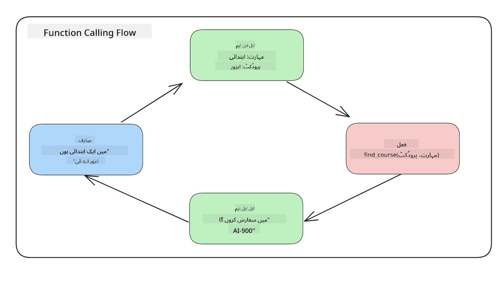
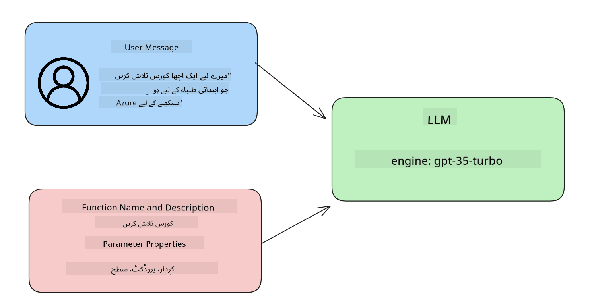

<!--
CO_OP_TRANSLATOR_METADATA:
{
  "original_hash": "77a48a201447be19aa7560706d6f93a0",
  "translation_date": "2025-05-19T21:20:46+00:00",
  "source_file": "11-integrating-with-function-calling/README.md",
  "language_code": "ur"
}
-->
# فنکشن کالنگ کے ساتھ انضمام

آپ نے پچھلے اسباق میں کافی کچھ سیکھا ہے۔ تاہم، ہم مزید بہتری لا سکتے ہیں۔ کچھ چیزیں جن پر ہم بات کر سکتے ہیں وہ ہیں کہ ہم کس طرح زیادہ مستقل جواب کی شکل حاصل کر سکتے ہیں تاکہ جواب کے ساتھ نیچے کی طرف کام کرنا آسان ہو سکے۔ اس کے علاوہ، ہم اپنے ایپلیکیشن کو مزید تقویت دینے کے لیے دیگر ذرائع سے ڈیٹا شامل کرنا چاہتے ہیں۔

یہ باب مذکورہ مسائل کو حل کرنے کی کوشش کر رہا ہے۔

## تعارف

یہ سبق درج ذیل پر مشتمل ہوگا:

- وضاحت کریں کہ فنکشن کالنگ کیا ہے اور اس کے استعمال کے کیسز۔
- Azure OpenAI کا استعمال کرتے ہوئے فنکشن کال بنانا۔
- فنکشن کال کو ایپلیکیشن میں ضم کرنے کا طریقہ۔

## سیکھنے کے اہداف

اس سبق کے آخر تک، آپ قابل ہوں گے:

- فنکشن کالنگ کے استعمال کے مقصد کی وضاحت کریں۔
- Azure OpenAI سروس کا استعمال کرتے ہوئے فنکشن کال ترتیب دیں۔
- آپ کی ایپلیکیشن کے استعمال کے کیس کے لیے موثر فنکشن کالز ڈیزائن کریں۔

## منظر نامہ: فنکشنز کے ساتھ ہمارے چیٹ بوٹ کو بہتر بنانا

اس سبق کے لیے، ہم اپنی تعلیمی اسٹارٹ اپ کے لیے ایک فیچر بنانا چاہتے ہیں جو صارفین کو تکنیکی کورسز تلاش کرنے کے لیے چیٹ بوٹ استعمال کرنے کی اجازت دیتا ہے۔ ہم ان کے ہنر کی سطح، موجودہ کردار اور دلچسپی کی ٹیکنالوجی کے مطابق کورسز کی سفارش کریں گے۔

اس منظر نامے کو مکمل کرنے کے لیے، ہم استعمال کریں گے:

- `Azure OpenAI` صارف کے لیے چیٹ تجربہ تخلیق کرنے کے لیے۔
- `Microsoft Learn Catalog API` صارفین کو صارف کی درخواست کے مطابق کورسز تلاش کرنے میں مدد کرنے کے لیے۔
- `Function Calling` صارف کی درخواست کو لے کر اسے API درخواست بنانے کے لیے فنکشن کو بھیجنے کے لیے۔

شروع کرنے کے لیے، آئیے دیکھتے ہیں کہ ہم پہلے مقام پر فنکشن کالنگ کیوں استعمال کرنا چاہیں گے:

## فنکشن کالنگ کیوں

فنکشن کالنگ سے پہلے، LLM سے جوابات غیر منظم اور غیر مستقل تھے۔ ڈویلپرز کو پیچیدہ توثیق کوڈ لکھنے کی ضرورت تھی تاکہ یہ یقینی بنایا جا سکے کہ وہ جواب کی ہر مختلف شکل کو سنبھال سکیں۔ صارفین کو "اسٹاک ہوم میں موجودہ موسم کیا ہے؟" جیسے جوابات نہیں مل سکتے تھے۔ یہ اس لیے ہے کہ ماڈلز اس وقت تک محدود تھے جب تک کہ ڈیٹا کو تربیت نہیں دی گئی تھی۔

فنکشن کالنگ Azure OpenAI سروس کی ایک خصوصیت ہے جو درج ذیل حدود پر قابو پانے کے لیے ہے:

- **مستقل جواب کی شکل**۔ اگر ہم جواب کی شکل کو بہتر طریقے سے کنٹرول کر سکتے ہیں تو ہم جواب کو نیچے کی طرف دوسرے نظاموں میں زیادہ آسانی سے ضم کر سکتے ہیں۔
- **بیرونی ڈیٹا**۔ چیٹ کے تناظر میں ایپلیکیشن کے دیگر ذرائع سے ڈیٹا استعمال کرنے کی صلاحیت۔

## مسئلے کو ایک منظر نامے کے ذریعے ظاہر کرنا

> ہم آپ کو [شامل کردہ نوٹ بک](../../../11-integrating-with-function-calling/python/aoai-assignment.ipynb) استعمال کرنے کی تجویز کرتے ہیں اگر آپ نیچے دیے گئے منظر نامے کو چلانا چاہتے ہیں۔ آپ محض پڑھ بھی سکتے ہیں کیونکہ ہم مسئلہ کو ظاہر کرنے کی کوشش کر رہے ہیں جہاں فنکشنز مسئلہ کو حل کرنے میں مدد کر سکتے ہیں۔

آئیے اس مثال کو دیکھتے ہیں جو جواب کی شکل کے مسئلے کو ظاہر کرتی ہے:

فرض کریں کہ ہم طالب علم کے ڈیٹا کا ایک ڈیٹا بیس بنانا چاہتے ہیں تاکہ ہم انہیں صحیح کورس تجویز کر سکیں۔ نیچے دو طلباء کی وضاحتیں ہیں جو ان کے مواد میں بہت ملتی جلتی ہیں۔

1. ہمارے Azure OpenAI وسائل سے کنکشن بنائیں:

   ```python
   import os
   import json
   from openai import AzureOpenAI
   from dotenv import load_dotenv
   load_dotenv()

   client = AzureOpenAI(
   api_key=os.environ['AZURE_OPENAI_API_KEY'],  # this is also the default, it can be omitted
   api_version = "2023-07-01-preview"
   )

   deployment=os.environ['AZURE_OPENAI_DEPLOYMENT']
   ```

   نیچے کچھ Python کوڈ ہے جو ہمارے Azure OpenAI کنکشن کو ترتیب دینے کے لیے ہے جہاں ہم `api_type`, `api_base`, `api_version` and `api_key`.

1. Creating two student descriptions using variables `student_1_description` and `student_2_description` کو سیٹ کرتے ہیں۔

   ```python
   student_1_description="Emily Johnson is a sophomore majoring in computer science at Duke University. She has a 3.7 GPA. Emily is an active member of the university's Chess Club and Debate Team. She hopes to pursue a career in software engineering after graduating."

   student_2_description = "Michael Lee is a sophomore majoring in computer science at Stanford University. He has a 3.8 GPA. Michael is known for his programming skills and is an active member of the university's Robotics Club. He hopes to pursue a career in artificial intelligence after finishing his studies."
   ```

   ہم اوپر دی گئی طالب علم کی وضاحتوں کو LLM کو بھیجنا چاہتے ہیں تاکہ ڈیٹا کو پارس کیا جا سکے۔ اس ڈیٹا کو بعد میں ہماری ایپلیکیشن میں استعمال کیا جا سکتا ہے اور API کو بھیجا جا سکتا ہے یا ڈیٹا بیس میں محفوظ کیا جا سکتا ہے۔

1. آئیے دو ایک جیسے پرامپٹس بنائیں جن میں ہم LLM کو اس معلومات کے بارے میں ہدایات دیتے ہیں جس میں ہم دلچسپی رکھتے ہیں:

   ```python
   prompt1 = f'''
   Please extract the following information from the given text and return it as a JSON object:

   name
   major
   school
   grades
   club

   This is the body of text to extract the information from:
   {student_1_description}
   '''

   prompt2 = f'''
   Please extract the following information from the given text and return it as a JSON object:

   name
   major
   school
   grades
   club

   This is the body of text to extract the information from:
   {student_2_description}
   '''
   ```

   اوپر دیے گئے پرامپٹس LLM کو معلومات نکالنے اور جواب کو JSON فارمیٹ میں واپس کرنے کی ہدایت دیتے ہیں۔

1. پرامپٹس اور Azure OpenAI کے ساتھ کنکشن ترتیب دینے کے بعد، ہم اب پرامپٹس کو LLM کو بھیجیں گے `openai.ChatCompletion`. We store the prompt in the `messages` variable and assign the role to `user` کا استعمال کرتے ہوئے۔ یہ صارف کی طرف سے ایک پیغام کو چیٹ بوٹ میں لکھنے کی نقل ہے۔

   ```python
   # response from prompt one
   openai_response1 = client.chat.completions.create(
   model=deployment,
   messages = [{'role': 'user', 'content': prompt1}]
   )
   openai_response1.choices[0].message.content

   # response from prompt two
   openai_response2 = client.chat.completions.create(
   model=deployment,
   messages = [{'role': 'user', 'content': prompt2}]
   )
   openai_response2.choices[0].message.content
   ```

اب ہم دونوں درخواستیں LLM کو بھیج سکتے ہیں اور جو جواب ہمیں موصول ہوتا ہے اس کا جائزہ لے سکتے ہیں `openai_response1['choices'][0]['message']['content']`.

1. Lastly, we can convert the response to JSON format by calling `json.loads` کی طرح تلاش کرکے:

   ```python
   # Loading the response as a JSON object
   json_response1 = json.loads(openai_response1.choices[0].message.content)
   json_response1
   ```

   جواب 1:

   ```json
   {
     "name": "Emily Johnson",
     "major": "computer science",
     "school": "Duke University",
     "grades": "3.7",
     "club": "Chess Club"
   }
   ```

   جواب 2:

   ```json
   {
     "name": "Michael Lee",
     "major": "computer science",
     "school": "Stanford University",
     "grades": "3.8 GPA",
     "club": "Robotics Club"
   }
   ```

   اگرچہ پرامپٹس ایک جیسے ہیں اور وضاحتیں ملتی جلتی ہیں، ہم `Grades` property formatted differently, as we can sometimes get the format `3.7` or `3.7 GPA` for example.

   This result is because the LLM takes unstructured data in the form of the written prompt and returns also unstructured data. We need to have a structured format so that we know what to expect when storing or using this data

So how do we solve the formatting problem then? By using functional calling, we can make sure that we receive structured data back. When using function calling, the LLM does not actually call or run any functions. Instead, we create a structure for the LLM to follow for its responses. We then use those structured responses to know what function to run in our applications.



We can then take what is returned from the function and send this back to the LLM. The LLM will then respond using natural language to answer the user's query.

## Use Cases for using function calls

There are many different use cases where function calls can improve your app like:

- **Calling External Tools**. Chatbots are great at providing answers to questions from users. By using function calling, the chatbots can use messages from users to complete certain tasks. For example, a student can ask the chatbot to "Send an email to my instructor saying I need more assistance with this subject". This can make a function call to `send_email(to: string, body: string)`

- **Create API or Database Queries**. Users can find information using natural language that gets converted into a formatted query or API request. An example of this could be a teacher who requests "Who are the students that completed the last assignment" which could call a function named `get_completed(student_name: string, assignment: int, current_status: string)`

- **Creating Structured Data**. Users can take a block of text or CSV and use the LLM to extract important information from it. For example, a student can convert a Wikipedia article about peace agreements to create AI flashcards. This can be done by using a function called `get_important_facts(agreement_name: string, date_signed: string, parties_involved: list)`

## Creating Your First Function Call

The process of creating a function call includes 3 main steps:

1. **Calling** the Chat Completions API with a list of your functions and a user message.
2. **Reading** the model's response to perform an action i.e. execute a function or API Call.
3. **Making** another call to Chat Completions API with the response from your function to use that information to create a response to the user.



### Step 1 - creating messages

The first step is to create a user message. This can be dynamically assigned by taking the value of a text input or you can assign a value here. If this is your first time working with the Chat Completions API, we need to define the `role` and the `content` of the message.

The `role` can be either `system` (creating rules), `assistant` (the model) or `user` (the end-user). For function calling, we will assign this as `user` کی قدریں دیکھتے ہیں اور ایک مثال سوال۔

```python
messages= [ {"role": "user", "content": "Find me a good course for a beginner student to learn Azure."} ]
```

مختلف کردار تفویض کرنے سے، LLM کے لیے یہ واضح ہو جاتا ہے کہ آیا یہ سسٹم کچھ کہہ رہا ہے یا صارف، جو ایک گفتگو کی تاریخ بنانے میں مدد کرتا ہے جس پر LLM تعمیر کر سکتا ہے۔

### مرحلہ 2 - فنکشنز بنانا

اگلا، ہم ایک فنکشن اور اس فنکشن کے پیرامیٹرز کی وضاحت کریں گے۔ ہم یہاں صرف ایک فنکشن استعمال کریں گے جسے `search_courses` but you can create multiple functions.

> **Important** : Functions are included in the system message to the LLM and will be included in the amount of available tokens you have available.

Below, we create the functions as an array of items. Each item is a function and has properties `name`, `description` and `parameters` کہا جاتا ہے:

```python
functions = [
   {
      "name":"search_courses",
      "description":"Retrieves courses from the search index based on the parameters provided",
      "parameters":{
         "type":"object",
         "properties":{
            "role":{
               "type":"string",
               "description":"The role of the learner (i.e. developer, data scientist, student, etc.)"
            },
            "product":{
               "type":"string",
               "description":"The product that the lesson is covering (i.e. Azure, Power BI, etc.)"
            },
            "level":{
               "type":"string",
               "description":"The level of experience the learner has prior to taking the course (i.e. beginner, intermediate, advanced)"
            }
         },
         "required":[
            "role"
         ]
      }
   }
]
```

آئیے نیچے ہر فنکشن کی مثال کو مزید تفصیل سے بیان کریں:

- `name` - The name of the function that we want to have called.
- `description` - This is the description of how the function works. Here it's important to be specific and clear.
- `parameters` - A list of values and format that you want the model to produce in its response. The parameters array consists of items where the items have the following properties:
  1.  `type` - The data type of the properties will be stored in.
  1.  `properties` - List of the specific values that the model will use for its response
      1. `name` - The key is the name of the property that the model will use in its formatted response, for example, `product`.
      1. `type` - The data type of this property, for example, `string`.
      1. `description` - Description of the specific property.

There's also an optional property `required` - required property for the function call to be completed.

### Step 3 - Making the function call

After defining a function, we now need to include it in the call to the Chat Completion API. We do this by adding `functions` to the request. In this case `functions=functions`.

There is also an option to set `function_call` to `auto`. This means we will let the LLM decide which function should be called based on the user message rather than assigning it ourselves.

Here's some code below where we call `ChatCompletion.create`, note how we set `functions=functions` and `function_call="auto"` اور اس طرح LLM کو فیصلہ کرنے کی آزادی دیتے ہیں کہ کب ہمیں فراہم کردہ فنکشنز کو کال کریں:

```python
response = client.chat.completions.create(model=deployment,
                                        messages=messages,
                                        functions=functions,
                                        function_call="auto")

print(response.choices[0].message)
```

جواب اب کچھ اس طرح واپس آ رہا ہے:

```json
{
  "role": "assistant",
  "function_call": {
    "name": "search_courses",
    "arguments": "{\n  \"role\": \"student\",\n  \"product\": \"Azure\",\n  \"level\": \"beginner\"\n}"
  }
}
```

یہاں ہم دیکھ سکتے ہیں کہ فنکشن `search_courses` was called and with what arguments, as listed in the `arguments` property in the JSON response.

The conclusion the LLM was able to find the data to fit the arguments of the function as it was extracting it from the value provided to the `messages` parameter in the chat completion call. Below is a reminder of the `messages` کی قدر:

```python
messages= [ {"role": "user", "content": "Find me a good course for a beginner student to learn Azure."} ]
```

جیسا کہ آپ دیکھ سکتے ہیں، `student`, `Azure` and `beginner` was extracted from `messages` and set as input to the function. Using functions this way is a great way to extract information from a prompt but also to provide structure to the LLM and have reusable functionality.

Next, we need to see how we can use this in our app.

## Integrating Function Calls into an Application

After we have tested the formatted response from the LLM, we can now integrate this into an application.

### Managing the flow

To integrate this into our application, let's take the following steps:

1. First, let's make the call to the OpenAI services and store the message in a variable called `response_message`۔

   ```python
   response_message = response.choices[0].message
   ```

1. اب ہم اس فنکشن کی وضاحت کریں گے جو Microsoft Learn API کو کورسز کی فہرست حاصل کرنے کے لیے کال کرے گا:

   ```python
   import requests

   def search_courses(role, product, level):
     url = "https://learn.microsoft.com/api/catalog/"
     params = {
        "role": role,
        "product": product,
        "level": level
     }
     response = requests.get(url, params=params)
     modules = response.json()["modules"]
     results = []
     for module in modules[:5]:
        title = module["title"]
        url = module["url"]
        results.append({"title": title, "url": url})
     return str(results)
   ```

   نوٹ کریں کہ ہم اب ایک حقیقی Python فنکشن بناتے ہیں جو `functions` variable. We're also making real external API calls to fetch the data we need. In this case, we go against the Microsoft Learn API to search for training modules.

Ok, so we created `functions` variables and a corresponding Python function, how do we tell the LLM how to map these two together so our Python function is called?

1. To see if we need to call a Python function, we need to look into the LLM response and see if `function_call` میں متعارف کرائے گئے فنکشن ناموں سے میل کھاتا ہے اور اس کا حصہ ہے اور مخصوص فنکشن کو کال کرتا ہے۔ یہاں بتایا گیا ہے کہ آپ نیچے دیے گئے چیک کو کیسے کر سکتے ہیں:

   ```python
   # Check if the model wants to call a function
   if response_message.function_call.name:
    print("Recommended Function call:")
    print(response_message.function_call.name)
    print()

    # Call the function.
    function_name = response_message.function_call.name

    available_functions = {
            "search_courses": search_courses,
    }
    function_to_call = available_functions[function_name]

    function_args = json.loads(response_message.function_call.arguments)
    function_response = function_to_call(**function_args)

    print("Output of function call:")
    print(function_response)
    print(type(function_response))


    # Add the assistant response and function response to the messages
    messages.append( # adding assistant response to messages
        {
            "role": response_message.role,
            "function_call": {
                "name": function_name,
                "arguments": response_message.function_call.arguments,
            },
            "content": None
        }
    )
    messages.append( # adding function response to messages
        {
            "role": "function",
            "name": function_name,
            "content":function_response,
        }
    )
   ```

   یہ تین لائنیں یقینی بناتی ہیں کہ ہم فنکشن کا نام، دلائل نکالیں اور کال کریں:

   ```python
   function_to_call = available_functions[function_name]

   function_args = json.loads(response_message.function_call.arguments)
   function_response = function_to_call(**function_args)
   ```

   نیچے ہمارا کوڈ چلانے کے آؤٹ پٹ ہیں:

   **آؤٹ پٹ**

   ```Recommended Function call:
   {
     "name": "search_courses",
     "arguments": "{\n  \"role\": \"student\",\n  \"product\": \"Azure\",\n  \"level\": \"beginner\"\n}"
   }

   Output of function call:
   [{'title': 'Describe concepts of cryptography', 'url': 'https://learn.microsoft.com/training/modules/describe-concepts-of-cryptography/?
   WT.mc_id=api_CatalogApi'}, {'title': 'Introduction to audio classification with TensorFlow', 'url': 'https://learn.microsoft.com/en-
   us/training/modules/intro-audio-classification-tensorflow/?WT.mc_id=api_CatalogApi'}, {'title': 'Design a Performant Data Model in Azure SQL
   Database with Azure Data Studio', 'url': 'https://learn.microsoft.com/training/modules/design-a-data-model-with-ads/?
   WT.mc_id=api_CatalogApi'}, {'title': 'Getting started with the Microsoft Cloud Adoption Framework for Azure', 'url':
   'https://learn.microsoft.com/training/modules/cloud-adoption-framework-getting-started/?WT.mc_id=api_CatalogApi'}, {'title': 'Set up the
   Rust development environment', 'url': 'https://learn.microsoft.com/training/modules/rust-set-up-environment/?WT.mc_id=api_CatalogApi'}]
   <class 'str'>
   ```

1. اب ہم اپ ڈیٹ شدہ پیغام `messages` کو LLM کو بھیجیں گے تاکہ ہم API JSON فارمیٹ شدہ جواب کے بجائے قدرتی زبان میں جواب حاصل کر سکیں۔

   ```python
   print("Messages in next request:")
   print(messages)
   print()

   second_response = client.chat.completions.create(
      messages=messages,
      model=deployment,
      function_call="auto",
      functions=functions,
      temperature=0
         )  # get a new response from GPT where it can see the function response


   print(second_response.choices[0].message)
   ```

   **آؤٹ پٹ**

   ```python
   {
     "role": "assistant",
     "content": "I found some good courses for beginner students to learn Azure:\n\n1. [Describe concepts of cryptography] (https://learn.microsoft.com/training/modules/describe-concepts-of-cryptography/?WT.mc_id=api_CatalogApi)\n2. [Introduction to audio classification with TensorFlow](https://learn.microsoft.com/training/modules/intro-audio-classification-tensorflow/?WT.mc_id=api_CatalogApi)\n3. [Design a Performant Data Model in Azure SQL Database with Azure Data Studio](https://learn.microsoft.com/training/modules/design-a-data-model-with-ads/?WT.mc_id=api_CatalogApi)\n4. [Getting started with the Microsoft Cloud Adoption Framework for Azure](https://learn.microsoft.com/training/modules/cloud-adoption-framework-getting-started/?WT.mc_id=api_CatalogApi)\n5. [Set up the Rust development environment](https://learn.microsoft.com/training/modules/rust-set-up-environment/?WT.mc_id=api_CatalogApi)\n\nYou can click on the links to access the courses."
   }

   ```

## اسائنمنٹ

Azure OpenAI فنکشن کالنگ کے بارے میں اپنی تعلیم کو جاری رکھنے کے لیے آپ بنا سکتے ہیں:

- فنکشن کے مزید پیرامیٹرز جو سیکھنے والوں کو مزید کورسز تلاش کرنے میں مدد کر سکتے ہیں۔
- ایک اور فنکشن کال بنائیں جو سیکھنے والے سے ان کی مادری زبان جیسی مزید معلومات لے
- ایرر ہینڈلنگ بنائیں جب فنکشن کال اور/یا API کال کوئی موزوں کورسز واپس نہ کرے

اشارہ: دیکھیں کہ یہ ڈیٹا کیسے اور کہاں دستیاب ہے، اس کے لیے [Learn API حوالہ دستاویزات](https://learn.microsoft.com/training/support/catalog-api-developer-reference?WT.mc_id=academic-105485-koreyst) صفحہ دیکھیں۔

## شاندار کام! سفر جاری رکھیں

یہ سبق مکمل کرنے کے بعد، ہمارے [Generative AI Learning مجموعہ](https://aka.ms/genai-collection?WT.mc_id=academic-105485-koreyst) کو دیکھیں تاکہ آپ اپنی Generative AI معلومات کو مزید بڑھا سکیں!

سبق 12 کی طرف جائیں، جہاں ہم دیکھیں گے کہ AI ایپلیکیشنز کے لیے UX کو کیسے ڈیزائن کیا جائے!

**ڈس کلیمر**:  
یہ دستاویز AI ترجمہ سروس [Co-op Translator](https://github.com/Azure/co-op-translator) کا استعمال کرتے ہوئے ترجمہ کی گئی ہے۔ ہم درستگی کے لیے کوشاں ہیں، لیکن براہ کرم آگاہ رہیں کہ خودکار تراجم میں غلطیاں یا عدم درستگیاں ہو سکتی ہیں۔ اصل دستاویز کو اس کی اصل زبان میں مستند ذریعہ سمجھا جانا چاہیے۔ اہم معلومات کے لیے، پیشہ ور انسانی ترجمہ کی سفارش کی جاتی ہے۔ اس ترجمہ کے استعمال سے پیدا ہونے والی کسی بھی غلط فہمی یا غلط تشریح کے لیے ہم ذمہ دار نہیں ہیں۔