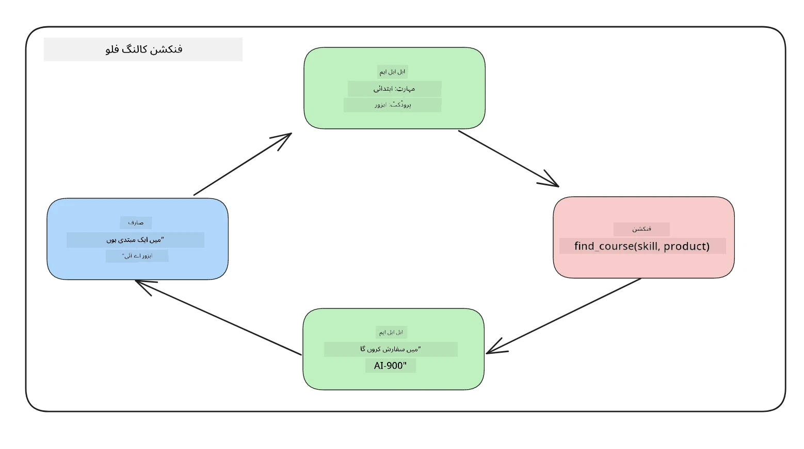
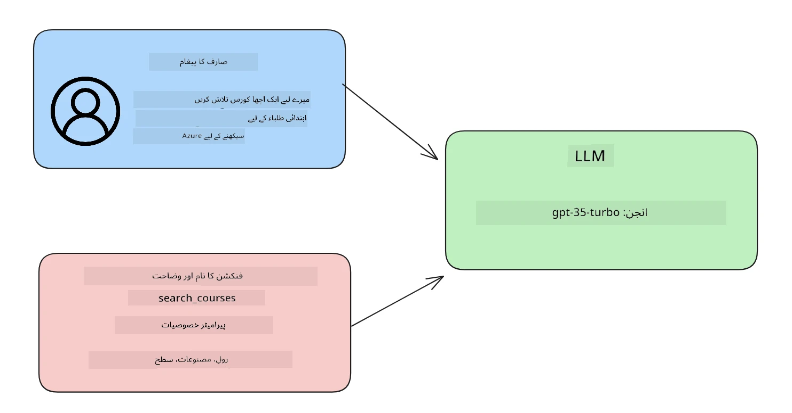

# فنکشن کالنگ کے ساتھ انٹیگریشن

[](https://youtu.be/DgUdCLX8qYQ?si=f1ouQU5HQx6F8Gl2)

آپ نے پچھلے اسباق میں اب تک کافی کچھ سیکھ لیا ہے۔ تاہم، ہم مزید بہتری لا سکتے ہیں۔ کچھ چیزیں جنہیں ہم بہتر کر سکتے ہیں وہ یہ ہیں کہ ہم کیسے ایک زیادہ مستقل جوابی فارمٹ حاصل کر سکتے ہیں تاکہ جواب کے ساتھ بعد میں کام کرنا آسان ہو جائے۔ نیز، ہم ہو سکتا ہے اپنی ایپلیکیشن کو مزید خوشحال بنانے کے لیے دوسرے ذرائع سے ڈیٹا بھی شامل کرنا چاہیں۔

اوپر بیان کردہ مسائل وہ ہیں جن پر یہ باب توجہ مرکوز کرے گا۔

## تعارف

یہ سبق مندرجہ ذیل چیزوں کا احاطہ کرے گا:

- فنکشن کالنگ کیا ہے اور اس کے استعمال کے کیسز کی وضاحت۔
- Azure OpenAI کا استعمال کرتے ہوئے فنکشن کال بنانا۔
- ایک ایپلیکیشن میں فنکشن کال کو انٹیگریٹ کرنے کا طریقہ۔

## سیکھنے کے اہداف

اس سبق کے آخر تک، آپ قابل ہو جائیں گے کہ:

- فنکشن کالنگ کے استعمال کا مقصد بیان کریں۔
- Azure OpenAI سروس استعمال کرتے ہوئے فنکشن کال کی سیٹ اپ کریں۔
- آپ کی ایپلیکیشن کے استعمال کے کیس کے لیے مؤثر فنکشن کالز کا ڈیزائن کریں۔

## منظرنامہ: فنکشنز کے ساتھ ہمارے چیٹ بوٹ کو بہتر بنانا

اس سبق کے لیے، ہم اپنی تعلیمی اسٹارٹ اپ کے لیے ایک فیچر بنانا چاہتے ہیں جو صارفین کو تکنیکی کورسز تلاش کرنے کے لیے چیٹ بوٹ استعمال کرنے کی اجازت دے۔ ہم ایسے کورسز کی سفارش کریں گے جو ان کے مہارت کے درجے، موجودہ کردار، اور دلچسپی کی ٹیکنالوجی کے مطابق ہوں۔

اس منظرنامے کو مکمل کرنے کے لیے، ہم درج ذیل کا امتزاج استعمال کریں گے:

- صارف کے لیے چیٹ تجربہ بنانے کے لیے `Azure OpenAI`۔
- صارف کی درخواست کی بنیاد پر کورسز تلاش کرنے میں مدد کے لیے `Microsoft Learn Catalog API`۔
- صارف کے سوال کو لیتے ہوئے اسے فنکشن کو بھیجنے کے لیے `Function Calling` تاکہ API درخواست کی جا سکے۔

شروع کرنے کے لیے، آئیے دیکھتے ہیں کہ ہم کیوں پہلے فنکشن کالنگ استعمال کرنا چاہیں گے:

## فنکشن کالنگ کیوں؟

فنکشن کالنگ سے پہلے، LLM سے جوابات غیر منظم اور غیر مستقل تھے۔ ڈیولپرز کو ہر قسم کے جواب کو سنبھالنے کے لیے پیچیدہ ویلڈیشن کوڈ لکھنا پڑتا تھا۔ صارفین ایسے سوالات کے جواب نہیں حاصل کر سکتے تھے جیسے "اسٹاک ہوم میں موجودہ موسم کیا ہے؟" اس کی وجہ یہ تھی کہ ماڈلز اس وقت کے ڈیٹا تک محدود ہوتے تھے جس پر وہ تربیت یافتہ تھے۔

فنکشن کالنگ Azure OpenAI سروس کی ایک خصوصیت ہے جو درج ذیل محدودیتوں کو دور کرتی ہے:

- **مستقل جوابی فارمٹ**۔ اگر ہم جواب کے فارمٹ کو بہتر کنٹرول کر سکیں تو ہم آسانی سے جواب کو دوسری سسٹمز کے ساتھ انٹیگریٹ کر سکتے ہیں۔
- **بیرونی ڈیٹا**۔ چیٹ کے سیاق و سباق میں ایپلیکیشن کے دوسرے ذرائع سے ڈیٹا استعمال کرنے کی صلاحیت۔

## ایک منظرنامے کے ذریعے مسئلہ کی وضاحت

> ہم آپ کو مشورہ دیتے ہیں کہ اگر آپ نیچے والا منظرنامہ چلانا چاہتے ہیں تو [شامل شدہ نوٹ بک](./python/aoai-assignment.ipynb?WT.mc_id=academic-105485-koreyst) استعمال کریں۔ آپ صرف پڑھ بھی سکتے ہیں کیونکہ ہم ایک مسئلہ کی وضاحت کرنا چاہتے ہیں جہاں فنکشنز اس مسئلہ کو حل کرنے میں مدد کر سکتے ہیں۔

آئیے ایک مثال دیکھتے ہیں جو جوابی فارمٹ کے مسئلہ کو ظاہر کرتی ہے:

فرض کریں ہم طلباء کے ڈیٹا کا ایک ڈیٹا بیس بنانا چاہتے ہیں تاکہ ہم ان کے لیے درست کورس تجویز کر سکیں۔ نیچے دو طلباء کی تفصیلات ہیں جو ڈیٹا میں بہت مشابہت رکھتی ہیں۔

1. Azure OpenAI ریسورس سے کنکشن بنائیں:

   ```python
   import os
   import json
   from openai import OpenAI
   from dotenv import load_dotenv
   load_dotenv()

   # ریسپانسز API ایزور اوپن اے آئی (مائیکروسافٹ فاؤنڈری) v1 اینڈپوائنٹ سے فراہم کی جاتی ہے
   # اس لیے ہم اوپن اے آئی کلائنٹ کو <your-endpoint>/openai/v1/ کی طرف اشارہ کرتے ہیں۔
   endpoint = os.environ['AZURE_OPENAI_ENDPOINT']
   client = OpenAI(
   api_key=os.environ['AZURE_OPENAI_API_KEY'],
   base_url=f"{endpoint.rstrip('/')}/openai/v1/",
   )

   deployment=os.environ['AZURE_OPENAI_DEPLOYMENT']
   ```

   نیچے کچھ پائتھون کوڈ ہے جو Azure OpenAI سے کنکشن قائم کرنے کے لیے ہے۔ چونکہ ہم v1 اینڈ پوائنٹ استعمال کرتے ہیں، ہمیں صرف `api_key` اور `base_url` سیٹ کرنے کی ضرورت ہے (کوئی `api_version` ضرورت نہیں)۔

1. دو طلباء کی تفصیلات متغیرات `student_1_description` اور `student_2_description` میں بنائیں۔

   ```python
   student_1_description="Emily Johnson is a sophomore majoring in computer science at Duke University. She has a 3.7 GPA. Emily is an active member of the university's Chess Club and Debate Team. She hopes to pursue a career in software engineering after graduating."

   student_2_description = "Michael Lee is a sophomore majoring in computer science at Stanford University. He has a 3.8 GPA. Michael is known for his programming skills and is an active member of the university's Robotics Club. He hopes to pursue a career in artificial intelligence after finishing his studies."
   ```

   ہم چاہیں گے کہ اوپر دی گئی طالب علم کی تفصیلات کو LLM بھیج کر ڈیٹا کو پارس کریں۔ یہ ڈیٹا بعد میں ہماری ایپلیکیشن میں استعمال کیا جا سکتا ہے اور API کو بھیجا جا سکتا ہے یا ڈیٹا بیس میں ذخیرہ کیا جا سکتا ہے۔

1. آئیے دو یکساں پرامپٹس بنائیں جن میں ہم LLM کو ہدایت کرتے ہیں کہ ہمیں کس معلومات میں دلچسپی ہے:

   ```python
   prompt1 = f'''
   Please extract the following information from the given text and return it as a JSON object:

   name
   major
   school
   grades
   club

   This is the body of text to extract the information from:
   {student_1_description}
   '''

   prompt2 = f'''
   Please extract the following information from the given text and return it as a JSON object:

   name
   major
   school
   grades
   club

   This is the body of text to extract the information from:
   {student_2_description}
   '''
   ```

   اوپر والے پرامپٹس LLM کو ہدایت کرتے ہیں کہ معلومات نکالے اور جواب JSON فارمیٹ میں واپس کرے۔

1. پرامپٹس اور Azure OpenAI کنکشن سیٹ اپ کرنے کے بعد، اب ہم `client.responses.create` کا استعمال کرتے ہوئے پرامپٹس LLM کو بھیجیں گے۔ ہم پرامپٹ کو `input` متغیر میں محفوظ کرتے ہیں اور رول `user` مقرر کرتے ہیں۔ یہ صارف کی جانب سے چیٹ بوٹ کو پیغام بھیجنے کی تقلید کے لیے ہے۔

   ```python
   # پرامپٹ ایک سے جواب
   openai_response1 = client.responses.create(
   model=deployment,
   input = [{'role': 'user', 'content': prompt1}],
   store=False,
   )
   openai_response1.output_text

   # پرامپٹ دو سے جواب
   openai_response2 = client.responses.create(
   model=deployment,
   input = [{'role': 'user', 'content': prompt2}],
   store=False,
   )
   openai_response2.output_text
   ```

اب ہم دونوں درخواستیں LLM کو بھیج سکتے ہیں اور جو جواب ملے اس کا جائزہ لے سکتے ہیں جیسے `openai_response1.output_text`۔

1. آخر میں، ہم جواب کو `json.loads` کال کر کے JSON فارمیٹ میں تبدیل کر سکتے ہیں:

   ```python
   # ردعمل کو JSON آبجیکٹ کے طور پر لوڈ کر رہے ہیں
   json_response1 = json.loads(openai_response1.output_text)
   json_response1
   ```

   جواب 1:

   ```json
   {
     "name": "Emily Johnson",
     "major": "computer science",
     "school": "Duke University",
     "grades": "3.7",
     "club": "Chess Club"
   }
   ```

   جواب 2:

   ```json
   {
     "name": "Michael Lee",
     "major": "computer science",
     "school": "Stanford University",
     "grades": "3.8 GPA",
     "club": "Robotics Club"
   }
   ```

   اگرچہ پرامپٹس ایک جیسے ہیں اور تفصیلات مشابہت رکھتی ہیں، ہم `Grades` پراپرٹی کی ویلیوز کی مختلف فارمیٹنگ دیکھتے ہیں، مثلاً کبھی `3.7` یا `3.7 GPA` جیسا فارمیٹ ملتا ہے۔

   یہ نتیجہ اس لیے آتا ہے کیونکہ LLM تحریری پرامپٹ کی غیر منظم ڈیٹا لیتا ہے اور غیر منظم ڈیٹا واپس کرتا ہے۔ ہمیں ایک منظم فارمیٹ کی ضرورت ہے تاکہ ہمیں معلوم ہو کہ اس ڈیٹا کو ذخیرہ یا استعمال کرتے وقت کیا توقع کرنی ہے۔

تو پھر ہم فارمیٹنگ کے مسئلہ کو کیسے حل کریں؟ فنکشن کالنگ استعمال کر کے، ہم یقینی بنا سکتے ہیں کہ ہمیں منظم ڈیٹا واپس ملے۔ فنکشن کالنگ کے دوران، LLM اصل میں کوئی فنکشن نہیں چلاتا۔ اس کی جگہ، ہم LLM کے لیے ایک ساخت بناتے ہیں جس پر وہ اپنے جوابات کے لیے عمل کرے۔ ہم پھر ان منظم جوابات کو جاننے کے لیے استعمال کرتے ہیں کہ ہماری ایپلیکیشن میں کون سا فنکشن چلانا ہے۔



ہم پھر فنکشن سے واپس آنے والی معلومات کو لے کر اسے دوبارہ LLM کو بھیج سکتے ہیں۔ LLM پھر صارف کے سوال کا جواب قدرتی زبان میں دے گا۔

## فنکشن کالز کے استعمال کے کیسز

بہت سے مختلف استعمال ہیں جہاں فنکشن کالز آپ کی ایپ کو بہتر بنا سکتے ہیں، مثلاً:

- **بیرونی ٹولز کال کرنا**۔ چیٹ بوٹس صارفین کے سوالات کے جوابات دینے میں بہت اچھے ہوتے ہیں۔ فنکشن کالنگ کا استعمال کر کے، چیٹ بوٹس صارف کے پیغام کو استعمال کر کے خاص کام مکمل کر سکتے ہیں۔ مثال کے طور پر، ایک طالب علم چیٹ بوٹ کو کہہ سکتا ہے "میرے انسٹرکٹر کو ای میل بھیجو کہ مجھے اس مضمون میں مزید مدد کی ضرورت ہے"۔ یہ `send_email(to: string, body: string)` فنکشن کال کر سکتا ہے۔

- **API یا ڈیٹا بیس کی استفسار بنانا**۔ صارفین قدرتی زبان استعمال کرتے ہوئے معلومات تلاش کر سکتے ہیں جو ایک منظم کیوری یا API ریکویسٹ میں تبدیل ہو جاتی ہے۔ اس کی مثال ایک استاد ہو سکتا ہے جو پوچھے "وہ کون سے طلباء ہیں جنہوں نے آخری اسائنمنٹ مکمل کی؟" جو `get_completed(student_name: string, assignment: int, current_status: string)` فنکشن کال کر سکتا ہے۔

- **منظم ڈیٹا تیار کرنا**۔ صارفین ایک متن یا CSV بلاک لے کر LLM کا استعمال کر کے اہم معلومات نکال سکتے ہیں۔ مثال کے طور پر، ایک طالب علم امن معاہدوں پر ویکی پیڈیا آرٹیکل کو AI فلیش کارڈز بنانے کے لیے تبدیل کر سکتا ہے۔ یہ `get_important_facts(agreement_name: string, date_signed: string, parties_involved: list)` فنکشن کال کر کے کیا جا سکتا ہے۔

## اپنی پہلی فنکشن کال بنانا

فنکشن کال بنانے کا عمل تین بنیادی مراحل پر مشتمل ہے:

1. اپنی فنکشنز (ٹولز) کی فہرست اور صارف کا پیغام لے کر Responses API کو کال کرنا۔
2. ماڈل کے جواب کو پڑھنا تاکہ کوئی کارروائی کی جا سکے مثلاً فنکشن یا API کال کرنا۔
3. آپ کے فنکشن سے موصولہ جواب کو استعمال کرتے ہوئے Responses API کو دوبارہ کال کرنا تاکہ صارف کو جواب دیا جا سکے۔



### مرحلہ 1 - پیغامات بنانا

پہلا مرحلہ صارف کا پیغام بنانا ہے۔ یہ متحرک طور پر ایک متن ان پٹ سے لیا جا سکتا ہے یا آپ یہاں کوئی قدر تفویض کر سکتے ہیں۔ اگر یہ آپ کا Responses API کے ساتھ پہلا تجربہ ہے، تو ہمیں پیغام کی `role` اور `content` کی تعریف کرنے کی ضرورت ہے۔

`role` ہو سکتا ہے `system` (قواعد بنانا)، `assistant` (ماڈل) یا `user` (آخری صارف)۔ فنکشن کالنگ کے لیے، ہم اسے `user` اور ایک مثال سوال کے طور پر تفویض کریں گے۔

```python
messages= [ {"role": "user", "content": "Find me a good course for a beginner student to learn Azure."} ]
```

مختلف رول مقرر کر کے، LLM کے لیے واضح ہو جاتا ہے کہ بات نظام کہہ رہا ہے یا صارف، جو ایک بات چیت کی تاریخ بنانے میں مدد دیتا ہے جس پر LLM آگے بڑھ سکتا ہے۔

### مرحلہ 2 - فنکشنز بنانا

اگلا، ہم ایک فنکشن اور اس کے پیرامیٹرز کی وضاحت کریں گے۔ یہاں ہم صرف ایک فنکشن `search_courses` استعمال کریں گے لیکن آپ متعدد فنکشنز بنا سکتے ہیں۔

> **اہم**: فنکشنز LLM کو بھیجے جانے والے نظامی پیغام میں شامل ہوتے ہیں اور آپ کے دستیاب ٹوکن کی مقدار میں شمار ہوتے ہیں۔

نیچے، ہم فنکشنز کو آرے کی صورت میں بناتے ہیں۔ ہر آئٹم Responses API کے فلیٹ فارمیٹ میں ایک ٹول ہے، جس کی خصوصیات `type`, `name`, `description` اور `parameters` ہیں:

```python
functions = [
   {
      "type":"function",
      "name":"search_courses",
      "description":"Retrieves courses from the search index based on the parameters provided",
      "parameters":{
         "type":"object",
         "properties":{
            "role":{
               "type":"string",
               "description":"The role of the learner (i.e. developer, data scientist, student, etc.)"
            },
            "product":{
               "type":"string",
               "description":"The product that the lesson is covering (i.e. Azure, Power BI, etc.)"
            },
            "level":{
               "type":"string",
               "description":"The level of experience the learner has prior to taking the course (i.e. beginner, intermediate, advanced)"
            }
         },
         "required":[
            "role"
         ]
      }
   }
]
```

آئیے ہر فنکشن کی تفصیل نیچے مزید کریں:

- `name` - وہ فنکشن کا نام جو کال کرنا چاہتے ہیں۔
- `description` - فنکشن کیسے کام کرتا ہے کی وضاحت۔ یہاں واضح اور مخصوص ہونا ضروری ہے۔
- `parameters` - وہ اقدار اور فارمیٹ کی فہرست جو ماڈل کو اپنے جواب میں پیدا کرنی ہے۔ پیرامیٹرز آرے عناصر پر مشتمل ہے جن کی خصوصیات درج ذیل ہیں:
  1.  `type` - وہ ڈیٹا کی قسم جس میں پراپرٹیز محفوظ ہوں گی۔
  1.  `properties` - وہ مخصوص اقدار جنہیں ماڈل اپنے جواب میں استعمال کرے گا:
      1. `name` - اس پراپرٹی کا نام جو ماڈل اپنی فارمیٹڈ جواب میں استعمال کرے گا، مثلاً `product`۔
      1. `type` - اس پراپرٹی کی ڈیٹا قسم، مثلاً `string`۔
      1. `description` - اس مخصوص پراپرٹی کی وضاحت۔

ایک اختیاری پراپرٹی `required` بھی ہے - جس سے فنکشن کال مکمل ہونے کے لیے پراپرٹی ضروری ہوتی ہے۔

### مرحلہ 3 - فنکشن کال کرنا

فنکشن کی تعریف کے بعد، اب ہمیں اسے Responses API کال میں شامل کرنا ہے۔ ہم یہ `tools` کو درخواست میں شامل کر کے کرتے ہیں۔ اس کیس میں `tools=functions` ہے۔

ایک آپشن `tool_choice` کو `auto` سیٹ کرنے کا بھی ہے۔ اس کا مطلب ہے کہ ہم LLM کو فیصلہ کرنے دیں گے کہ صارف کے پیغام کی بنیاد پر کون سا فنکشن کال کرنا ہے بجائے اس کے کہ ہم خود متعین کریں۔

نیچے کچھ کوڈ ہے جہاں ہم `client.responses.create` کو کال کرتے ہیں، غور کریں کہ ہم نے `tools=functions` اور `tool_choice="auto"` سیٹ کیا ہے اور اس طرح LLM کو فنکشن کال کرنے کا انتخاب دیا ہے:

```python
response = client.responses.create(model=deployment,
                                        input=messages,
                                        tools=functions,
                                        tool_choice="auto",
                                        store=False)

print(response.output)
```

آنے والا جواب اب `response.output` میں ایک `function_call` آئٹم شامل کرتا ہے جو کچھ اس طرح دکھائی دیتا ہے:

```json
{
  "type": "function_call",
  "name": "search_courses",
  "call_id": "call_abc123",
  "arguments": "{\n  \"role\": \"student\",\n  \"product\": \"Azure\",\n  \"level\": \"beginner\"\n}"
}
```

یہاں ہم دیکھ سکتے ہیں کہ `search_courses` فنکشن کو کس طرح کال کیا گیا اور کن دلائل کے ساتھ، جو JSON جواب میں `arguments` پراپرٹی میں دکھائے گئے ہیں۔

نتیجہ یہ ہے کہ LLM نے یہ ڈیٹا ڈھونڈ لیا جو فنکشن کے دلائل کے مطابق تھا کیونکہ وہ اسے Responses API کال میں `input` پیرامیٹر کو دی گئی ویلیو سے نکال رہا تھا۔ نیچے `messages` کی قدر یاد دلائی گئی ہے:

```python
messages= [ {"role": "user", "content": "Find me a good course for a beginner student to learn Azure."} ]
```

جیسا کہ آپ دیکھ سکتے ہیں، `student`, `Azure` اور `beginner` کو `messages` سے نکال کر فنکشن کے انپٹ کے طور پر سیٹ کیا گیا۔ فنکشنز کو اس طرح استعمال کرنا پرامپٹ سے معلومات نکالنے کا ایک بہترین طریقہ ہے لیکن ساتھ ہی LLM کو ساخت دینا اور متعلقہ فعالیت فراہم کرنا بھی ہے۔

اگلا، ہمیں دیکھنا ہے کہ ہم اسے اپنی ایپ میں کیسے استعمال کر سکتے ہیں۔

## فنکشن کالز کو ایپلیکیشن میں انٹیگریٹ کرنا

LLM سے منظم جواب کی جانچ کے بعد، اب ہم اسے ایپلیکیشن میں انٹیگریٹ کر سکتے ہیں۔

### فلو کا انتظام کرنا

اسے اپنی ایپلیکیشن میں شامل کرنے کے لیے، آئیے درج ذیل اقدامات کریں:

1. سب سے پہلے، OpenAI سروسز کو کال کریں اور جوابی `output` میں سے فنکشن کال آئٹمز نکالیں۔

   ```python
   response_items = response.output
   tool_calls = [item for item in response_items if item.type == "function_call"]
   ```

1. اب ہم فنکشن کی تعریف کریں گے جو Microsoft Learn API کو کال کرے تاکہ کورسز کی فہرست حاصل کی جا سکے:

   ```python
   import requests

   def search_courses(role, product, level):
     url = "https://learn.microsoft.com/api/catalog/"
     params = {
        "role": role,
        "product": product,
        "level": level
     }
     response = requests.get(url, params=params)
     modules = response.json()["modules"]
     results = []
     for module in modules[:5]:
        title = module["title"]
        url = module["url"]
        results.append({"title": title, "url": url})
     return str(results)
   ```

   دھیان دیں کہ ہم اب ایک حقیقی پائتھون فنکشن بنا رہے ہیں جو `functions` متغیر میں متعارف کروائے گئے فنکشن ناموں سے میل کھاتا ہے۔ ہم حقیقی بیرونی API کال کر کے ضرورت کا ڈیٹا حاصل کر رہے ہیں۔ اس کیس میں، ہم Microsoft Learn API کو تربیتی ماڈیولز تلاش کرنے کے لیے کال کرتے ہیں۔

ٹھیک ہے، تو ہم نے `functions` متغیرات بنائیں اور ایک متعلقہ پائتھون فنکشن بھی بنایا، اب ہم LLM کو یہ کیسے بتائیں کہ یہ دونوں کیسے ایک ساتھ نقشہ کریں تاکہ ہمارا پائتھون فنکشن کال ہو؟

1. دیکھنے کے لیے کہ آیا ہمیں کوئی پائتھون فنکشن کال کرنا ہے، ہمیں LLM کے جواب میں `function_call` آئٹم کو دیکھنا ہوگا اور متعینہ فنکشن کال کرنا ہوگی۔ نیچے آپ یہ چیک کیسے کریں دیکھ سکتے ہیں:

   ```python
   # چیک کریں کہ آیا ماڈل فنکشن کو کال کرنا چاہتا ہے
   if tool_calls:
    for tool_call in tool_calls:
     print("Recommended Function call:")
     print(tool_call.name)
     print()

     # فنکشن کو کال کریں۔
     function_name = tool_call.name

     available_functions = {
             "search_courses": search_courses,
     }
     function_to_call = available_functions[function_name]

     function_args = json.loads(tool_call.arguments)
     function_response = function_to_call(**function_args)

     print("Output of function call:")
     print(function_response)
     print(type(function_response))

     # فنکشن کال اور اس کا نتیجہ گفتگو میں واپس شامل کریں۔
     # ماڈل کی function_call آئٹم کو اس کی آؤٹ پٹ سے پہلے شامل کرنا ضروری ہے۔
     messages.append(tool_call)  # اسسٹنٹ کی function_call آئٹم
     messages.append( # فنکشن کا نتیجہ
         {
             "type": "function_call_output",
             "call_id": tool_call.call_id,
             "output": function_response,
         }
     )
   ```

   یہ تین لائنیں نام، دلائل نکالنا اور کال کرنا یقینی بناتی ہیں:

   ```python
   function_to_call = available_functions[function_name]

   function_args = json.loads(tool_call.arguments)
   function_response = function_to_call(**function_args)
   ```

   نیچے ہمارے کوڈ کو چلانے کا آؤٹ پٹ دیا گیا ہے:

   **آؤٹ پٹ**

   ```Recommended Function call:
   {
     "name": "search_courses",
     "arguments": "{\n  \"role\": \"student\",\n  \"product\": \"Azure\",\n  \"level\": \"beginner\"\n}"
   }

   Output of function call:
   [{'title': 'Describe concepts of cryptography', 'url': 'https://learn.microsoft.com/training/modules/describe-concepts-of-cryptography/?
   WT.mc_id=api_CatalogApi'}, {'title': 'Introduction to audio classification with TensorFlow', 'url': 'https://learn.microsoft.com/en-
   us/training/modules/intro-audio-classification-tensorflow/?WT.mc_id=api_CatalogApi'}, {'title': 'Design a Performant Data Model in Azure SQL
   Database with Azure Data Studio', 'url': 'https://learn.microsoft.com/training/modules/design-a-data-model-with-ads/?
   WT.mc_id=api_CatalogApi'}, {'title': 'Getting started with the Microsoft Cloud Adoption Framework for Azure', 'url':
   'https://learn.microsoft.com/training/modules/cloud-adoption-framework-getting-started/?WT.mc_id=api_CatalogApi'}, {'title': 'Set up the
   Rust development environment', 'url': 'https://learn.microsoft.com/training/modules/rust-set-up-environment/?WT.mc_id=api_CatalogApi'}]
   <class 'str'>
   ```

1. اب ہم اپ ڈیٹ شدہ پیغام، `messages` کو LLM کو بھیجیں گے تاکہ ہم API JSON فارمیٹ شدہ جواب کی بجائے قدرتی زبان میں جواب حاصل کر سکیں۔

   ```python
   print("Messages in next request:")
   print(messages)
   print()

   second_response = client.responses.create(
      input=messages,
      model=deployment,
      tool_choice="auto",
      tools=functions,
      temperature=0,
      store=False,
         )  # ماڈل سے ایک نیا جواب حاصل کریں جہاں وہ فنکشن کے جواب کو دیکھ سکے


   print(second_response.output_text)
   ```

   **آؤٹ پٹ**

   ```text
   I found some good courses for beginner students to learn Azure:

   1. [Describe concepts of cryptography](https://learn.microsoft.com/training/modules/describe-concepts-of-cryptography/?WT.mc_id=api_CatalogApi)
   2. [Introduction to audio classification with TensorFlow](https://learn.microsoft.com/training/modules/intro-audio-classification-tensorflow/?WT.mc_id=api_CatalogApi)
   3. [Design a Performant Data Model in Azure SQL Database with Azure Data Studio](https://learn.microsoft.com/training/modules/design-a-data-model-with-ads/?WT.mc_id=api_CatalogApi)
   4. [Getting started with the Microsoft Cloud Adoption Framework for Azure](https://learn.microsoft.com/training/modules/cloud-adoption-framework-getting-started/?WT.mc_id=api_CatalogApi)
   5. [Set up the Rust development environment](https://learn.microsoft.com/training/modules/rust-set-up-environment/?WT.mc_id=api_CatalogApi)

   You can click on the links to access the courses.
   ```

## مشق

Azure OpenAI فنکشن کالنگ کی اپنی تعلیم جاری رکھنے کے لیے آپ بنا سکتے ہیں:

- فنکشن کے مزید پیرامیٹرز جو سیکھنے والوں کو مزید کورسز تلاش کرنے میں مدد کر سکتے ہیں۔

- ایک اور فنکشن کال بنائیں جو سیکھنے والے سے ان کی مادری زبان جیسی مزید معلومات لے
- غلطی کی ہینڈلنگ تیار کریں جب فنکشن کال اور/یا API کال کوئی مناسب کورسز واپس نہ کرے

اشارہ: دیکھنے کے لیے [Learn API reference documentation](https://learn.microsoft.com/training/support/catalog-api-developer-reference?WT.mc_id=academic-105485-koreyst) صفحہ پر عمل کریں کہ یہ ڈیٹا کہاں اور کیسے دستیاب ہے۔

## زبردست کام! سفر جاری رکھیں

اس سبق کو مکمل کرنے کے بعد، ہماری [Generative AI Learning collection](https://aka.ms/genai-collection?WT.mc_id=academic-105485-koreyst) دیکھیں تاکہ اپنی Generative AI کی مہارت کو مزید بہتر کریں!

سبق 12 پر جائیں، جہاں ہم دیکھیں گے کہ [AI ایپلی کیشنز کے لیے UX کیسے ڈیزائن کریں](../12-designing-ux-for-ai-applications/README.md?WT.mc_id=academic-105485-koreyst)!

---

<!-- CO-OP TRANSLATOR DISCLAIMER START -->
**ڈس کلیمر**:
یہ دستاویز AI ترجمہ سروس [Co-op Translator](https://github.com/Azure/co-op-translator) کے ذریعے ترجمہ کی گئی ہے۔ جبکہ ہم درستگی کے لیے کوشاں ہیں، براہ کرم اس بات سے آگاہ رہیں کہ خودکار ترجمے میں غلطیاں یا عدم درستیاں ہو سکتی ہیں۔ اصل دستاویز اپنے مادری زبان میں مستند ماخذ سمجھی جائے گی۔ حساس معلومات کے لیے پیشہ ور انسانی ترجمہ کی سفارش کی جاتی ہے۔ اس ترجمے کے استعمال سے پیدا ہونے والی کسی بھی غلط فہمی یا غلط تشریح کی ذمہ داری ہم قبول نہیں کرتے۔
<!-- CO-OP TRANSLATOR DISCLAIMER END -->