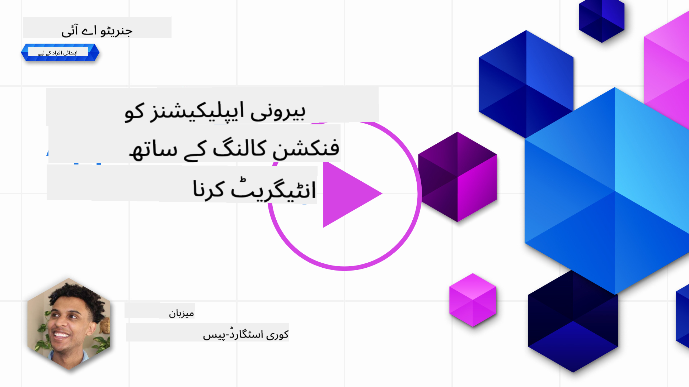
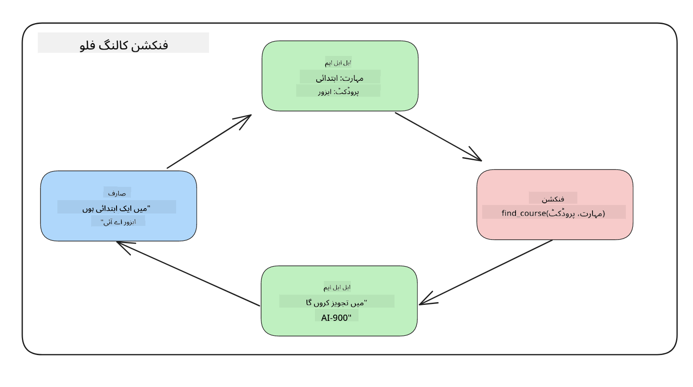

<!--
CO_OP_TRANSLATOR_METADATA:
{
  "original_hash": "f6f84f9ef2d066cd25850cab93580a50",
  "translation_date": "2025-10-17T13:04:43+00:00",
  "source_file": "11-integrating-with-function-calling/README.md",
  "language_code": "ur"
}
-->
# فنکشن کالنگ کے ساتھ انضمام

[](https://youtu.be/DgUdCLX8qYQ?si=f1ouQU5HQx6F8Gl2)

آپ نے پچھلے اسباق میں کافی کچھ سیکھا ہے۔ تاہم، ہم مزید بہتری لا سکتے ہیں۔ کچھ چیزیں جن پر ہم غور کر سکتے ہیں وہ ہیں کہ ہم کس طرح زیادہ مستقل جواب فارمیٹ حاصل کر سکتے ہیں تاکہ جواب کے ساتھ نیچے کام کرنا آسان ہو۔ اس کے علاوہ، ہم اپنی ایپلیکیشن کو مزید بہتر بنانے کے لیے دیگر ذرائع سے ڈیٹا شامل کرنا چاہ سکتے ہیں۔

یہ باب مذکورہ بالا مسائل کو حل کرنے کی کوشش کرتا ہے۔

## تعارف

یہ سبق درج ذیل موضوعات کا احاطہ کرے گا:

- فنکشن کالنگ کیا ہے اور اس کے استعمال کے معاملات کی وضاحت کریں۔
- Azure OpenAI کا استعمال کرتے ہوئے فنکشن کال بنانا۔
- فنکشن کال کو ایپلیکیشن میں ضم کرنے کا طریقہ۔

## سیکھنے کے اہداف

اس سبق کے اختتام تک، آپ قابل ہوں گے:

- فنکشن کالنگ کے استعمال کے مقصد کی وضاحت کریں۔
- Azure OpenAI سروس کا استعمال کرتے ہوئے فنکشن کال سیٹ اپ کریں۔
- اپنی ایپلیکیشن کے استعمال کے معاملے کے لیے مؤثر فنکشن کالز ڈیزائن کریں۔

## منظرنامہ: ہمارے چیٹ بوٹ کو فنکشنز کے ساتھ بہتر بنانا

اس سبق کے لیے، ہم اپنی تعلیمی اسٹارٹ اپ کے لیے ایک فیچر بنانا چاہتے ہیں جو صارفین کو تکنیکی کورسز تلاش کرنے کے لیے چیٹ بوٹ استعمال کرنے کی اجازت دیتا ہے۔ ہم کورسز کی سفارش کریں گے جو ان کی مہارت کی سطح، موجودہ کردار اور دلچسپی کی ٹیکنالوجی کے مطابق ہوں۔

اس منظرنامے کو مکمل کرنے کے لیے، ہم درج ذیل کا مجموعہ استعمال کریں گے:

- `Azure OpenAI` صارف کے لیے چیٹ کا تجربہ بنانے کے لیے۔
- `Microsoft Learn Catalog API` صارفین کو ان کی درخواست کے مطابق کورسز تلاش کرنے میں مدد کرنے کے لیے۔
- `Function Calling` صارف کی درخواست کو لے کر اسے فنکشن میں بھیجنے کے لیے تاکہ API درخواست کی جا سکے۔

شروع کرنے کے لیے، آئیے دیکھتے ہیں کہ ہم پہلے فنکشن کالنگ کیوں استعمال کرنا چاہیں گے:

## فنکشن کالنگ کیوں؟

فنکشن کالنگ سے پہلے، LLM سے جوابات غیر منظم اور غیر مستقل تھے۔ ڈویلپرز کو پیچیدہ توثیق کوڈ لکھنے کی ضرورت تھی تاکہ یہ یقینی بنایا جا سکے کہ وہ جواب کی ہر قسم کو سنبھال سکیں۔ صارفین کو ایسے سوالات کے جوابات نہیں مل سکتے تھے جیسے "اسٹاک ہوم میں موجودہ موسم کیا ہے؟"۔ اس کی وجہ یہ ہے کہ ماڈلز صرف اس وقت تک محدود تھے جب تک کہ ڈیٹا پر تربیت دی گئی تھی۔

فنکشن کالنگ Azure OpenAI سروس کی ایک خصوصیت ہے جو درج ذیل حدود کو دور کرتی ہے:

- **مستقل جواب فارمیٹ**۔ اگر ہم جواب فارمیٹ کو بہتر طریقے سے کنٹرول کر سکتے ہیں تو ہم جواب کو دیگر سسٹمز میں ضم کرنا آسان بنا سکتے ہیں۔
- **بیرونی ڈیٹا**۔ ایپلیکیشن کے دیگر ذرائع سے ڈیٹا کو چیٹ کے سیاق و سباق میں استعمال کرنے کی صلاحیت۔

## مسئلے کو منظرنامے کے ذریعے واضح کرنا

> ہم تجویز کرتے ہیں کہ آپ [شامل کردہ نوٹ بک](./python/aoai-assignment.ipynb?WT.mc_id=academic-105485-koreyst) استعمال کریں اگر آپ نیچے دیے گئے منظرنامے کو چلانا چاہتے ہیں۔ آپ صرف پڑھ بھی سکتے ہیں کیونکہ ہم ایک مسئلہ کو واضح کرنے کی کوشش کر رہے ہیں جہاں فنکشنز مسئلے کو حل کرنے میں مدد کر سکتے ہیں۔

آئیے ایک مثال دیکھتے ہیں جو جواب فارمیٹ کے مسئلے کو واضح کرتی ہے:

فرض کریں ہم طالب علم کے ڈیٹا کا ایک ڈیٹا بیس بنانا چاہتے ہیں تاکہ ہم انہیں صحیح کورس تجویز کر سکیں۔ نیچے ہمارے پاس دو طالب علموں کی وضاحتیں ہیں جو ڈیٹا میں بہت مماثل ہیں۔

1. ہمارے Azure OpenAI ریسورس سے کنکشن بنائیں:

   ```python
   import os
   import json
   from openai import AzureOpenAI
   from dotenv import load_dotenv
   load_dotenv()

   client = AzureOpenAI(
   api_key=os.environ['AZURE_OPENAI_API_KEY'],  # this is also the default, it can be omitted
   api_version = "2023-07-01-preview"
   )

   deployment=os.environ['AZURE_OPENAI_DEPLOYMENT']
   ```

   نیچے کچھ Python کوڈ ہے جو ہمارے Azure OpenAI کنکشن کو ترتیب دینے کے لیے `api_type`, `api_base`, `api_version` اور `api_key` سیٹ کرتا ہے۔

1. دو طالب علموں کی وضاحتیں متغیرات `student_1_description` اور `student_2_description` کا استعمال کرتے ہوئے بنائیں۔

   ```python
   student_1_description="Emily Johnson is a sophomore majoring in computer science at Duke University. She has a 3.7 GPA. Emily is an active member of the university's Chess Club and Debate Team. She hopes to pursue a career in software engineering after graduating."

   student_2_description = "Michael Lee is a sophomore majoring in computer science at Stanford University. He has a 3.8 GPA. Michael is known for his programming skills and is an active member of the university's Robotics Club. He hopes to pursue a career in artificial intelligence after finishing his studies."
   ```

   ہم چاہتے ہیں کہ اوپر دی گئی طالب علم کی وضاحتیں LLM کو بھیجیں تاکہ ڈیٹا کو پارس کیا جا سکے۔ یہ ڈیٹا بعد میں ہماری ایپلیکیشن میں استعمال کیا جا سکتا ہے اور API کو بھیجا جا سکتا ہے یا ڈیٹا بیس میں محفوظ کیا جا سکتا ہے۔

1. آئیے دو ایک جیسے پرامپٹس بنائیں جن میں ہم LLM کو ہدایت دیتے ہیں کہ ہم کس معلومات میں دلچسپی رکھتے ہیں:

   ```python
   prompt1 = f'''
   Please extract the following information from the given text and return it as a JSON object:

   name
   major
   school
   grades
   club

   This is the body of text to extract the information from:
   {student_1_description}
   '''

   prompt2 = f'''
   Please extract the following information from the given text and return it as a JSON object:

   name
   major
   school
   grades
   club

   This is the body of text to extract the information from:
   {student_2_description}
   '''
   ```

   اوپر دیے گئے پرامپٹس LLM کو معلومات نکالنے کی ہدایت دیتے ہیں اور جواب کو JSON فارمیٹ میں واپس کرنے کی ہدایت دیتے ہیں۔

1. پرامپٹس اور Azure OpenAI کنکشن ترتیب دینے کے بعد، ہم اب پرامپٹس کو LLM کو بھیجیں گے `openai.ChatCompletion` کا استعمال کرتے ہوئے۔ ہم پرامپٹ کو `messages` متغیر میں محفوظ کرتے ہیں اور کردار کو `user` تفویض کرتے ہیں۔ یہ چیٹ بوٹ کو لکھے گئے صارف کے پیغام کی نقل کرنے کے لیے ہے۔

   ```python
   # response from prompt one
   openai_response1 = client.chat.completions.create(
   model=deployment,
   messages = [{'role': 'user', 'content': prompt1}]
   )
   openai_response1.choices[0].message.content

   # response from prompt two
   openai_response2 = client.chat.completions.create(
   model=deployment,
   messages = [{'role': 'user', 'content': prompt2}]
   )
   openai_response2.choices[0].message.content
   ```

اب ہم دونوں درخواستیں LLM کو بھیج سکتے ہیں اور جو جواب ہمیں موصول ہوتا ہے اس کا جائزہ لے سکتے ہیں جیسے `openai_response1['choices'][0]['message']['content']`۔

1. آخر میں، ہم جواب کو JSON فارمیٹ میں تبدیل کر سکتے ہیں `json.loads` کو کال کر کے:

   ```python
   # Loading the response as a JSON object
   json_response1 = json.loads(openai_response1.choices[0].message.content)
   json_response1
   ```

   جواب 1:

   ```json
   {
     "name": "Emily Johnson",
     "major": "computer science",
     "school": "Duke University",
     "grades": "3.7",
     "club": "Chess Club"
   }
   ```

   جواب 2:

   ```json
   {
     "name": "Michael Lee",
     "major": "computer science",
     "school": "Stanford University",
     "grades": "3.8 GPA",
     "club": "Robotics Club"
   }
   ```

   حالانکہ پرامپٹس ایک جیسے ہیں اور وضاحتیں مماثل ہیں، ہم دیکھتے ہیں کہ `Grades` پراپرٹی کی قدریں مختلف فارمیٹ میں ہیں، جیسے کبھی `3.7` یا `3.7 GPA`۔

   یہ نتیجہ اس لیے ہے کہ LLM غیر منظم ڈیٹا کو تحریری پرامپٹ کی شکل میں لیتا ہے اور غیر منظم ڈیٹا واپس کرتا ہے۔ ہمیں ایک منظم فارمیٹ کی ضرورت ہے تاکہ ہم جان سکیں کہ اس ڈیٹا کو محفوظ کرتے وقت یا استعمال کرتے وقت کیا توقع کرنی ہے۔

تو پھر ہم فارمیٹنگ کے مسئلے کو کیسے حل کریں؟ فنکشن کالنگ کا استعمال کرتے ہوئے، ہم یہ یقینی بنا سکتے ہیں کہ ہمیں منظم ڈیٹا واپس ملے۔ فنکشن کالنگ کا استعمال کرتے وقت، LLM دراصل کوئی فنکشن کال یا چلانے نہیں کرتا۔ اس کے بجائے، ہم LLM کے جوابات کے لیے ایک ڈھانچہ بناتے ہیں۔ پھر ہم ان منظم جوابات کو جاننے کے لیے استعمال کرتے ہیں کہ ہماری ایپلیکیشنز میں کون سا فنکشن چلانا ہے۔



پھر ہم فنکشن سے واپس آنے والے ڈیٹا کو لے سکتے ہیں اور اسے LLM کو بھیج سکتے ہیں۔ LLM پھر صارف کے سوال کا جواب دینے کے لیے قدرتی زبان کا استعمال کرے گا۔

## فنکشن کالز کے استعمال کے معاملات

فنکشن کالز آپ کی ایپ کو بہتر بنانے کے لیے مختلف استعمال کے معاملات میں مدد کر سکتی ہیں جیسے:

- **بیرونی ٹولز کو کال کرنا**۔ چیٹ بوٹس صارفین کے سوالات کے جوابات فراہم کرنے میں بہترین ہیں۔ فنکشن کالنگ کا استعمال کرتے ہوئے، چیٹ بوٹس صارفین کے پیغامات کو مخصوص کاموں کو مکمل کرنے کے لیے استعمال کر سکتے ہیں۔ مثال کے طور پر، ایک طالب علم چیٹ بوٹ سے کہہ سکتا ہے "میرے انسٹرکٹر کو ای میل بھیجیں کہ مجھے اس مضمون میں مزید مدد کی ضرورت ہے"۔ یہ `send_email(to: string, body: string)` فنکشن کال کر سکتا ہے۔

- **API یا ڈیٹا بیس کی درخواستیں بنانا**۔ صارفین قدرتی زبان کا استعمال کرتے ہوئے معلومات تلاش کر سکتے ہیں جو فارمیٹڈ درخواست یا API درخواست میں تبدیل ہو جاتی ہے۔ اس کی ایک مثال ایک استاد ہو سکتا ہے جو درخواست کرتا ہے "وہ کون سے طالب علم ہیں جنہوں نے آخری اسائنمنٹ مکمل کی؟" جو `get_completed(student_name: string, assignment: int, current_status: string)` نامی فنکشن کو کال کر سکتا ہے۔

- **منظم ڈیٹا بنانا**۔ صارفین متن یا CSV کا بلاک لے سکتے ہیں اور LLM کا استعمال کرتے ہوئے اس سے اہم معلومات نکال سکتے ہیں۔ مثال کے طور پر، ایک طالب علم امن معاہدوں کے بارے میں ویکیپیڈیا مضمون کو AI فلیش کارڈز بنانے کے لیے تبدیل کر سکتا ہے۔ یہ `get_important_facts(agreement_name: string, date_signed: string, parties_involved: list)` نامی فنکشن کا استعمال کرتے ہوئے کیا جا سکتا ہے۔

## اپنا پہلا فنکشن کال بنانا

فنکشن کال بنانے کا عمل 3 اہم مراحل پر مشتمل ہے:

1. **کال کرنا**۔ چیٹ کمپلیشن API کو فنکشنز کی فہرست اور صارف کے پیغام کے ساتھ کال کریں۔
2. **پڑھنا**۔ ماڈل کے جواب کو ایکشن انجام دینے کے لیے پڑھیں یعنی فنکشن یا API کال کو چلائیں۔
3. **بنانا**۔ چیٹ کمپلیشن API کو فنکشن کے جواب کے ساتھ دوبارہ کال کریں تاکہ صارف کو جواب دینے کے لیے اس معلومات کا استعمال کیا جا سکے۔


### مرحلہ 1 - پیغامات بنانا

پہلا مرحلہ صارف کا پیغام بنانا ہے۔ یہ متن کے ان پٹ کی قدر لے کر متحرک طور پر تفویض کیا جا سکتا ہے یا آپ یہاں قدر تفویض کر سکتے ہیں۔ اگر یہ آپ کا پہلا موقع ہے کہ آپ چیٹ کمپلیشن API کے ساتھ کام کر رہے ہیں، تو ہمیں پیغام کے `role` اور `content` کو متعین کرنے کی ضرورت ہے۔

`role` یا تو `system` (قواعد بنانا)، `assistant` (ماڈل) یا `user` (آخری صارف) ہو سکتا ہے۔ فنکشن کالنگ کے لیے، ہم اسے `user` کے طور پر تفویض کریں گے اور ایک مثال سوال دیں گے۔

```python
messages= [ {"role": "user", "content": "Find me a good course for a beginner student to learn Azure."} ]
```

مختلف کردار تفویض کر کے، یہ LLM کے لیے واضح ہو جاتا ہے کہ آیا یہ نظام کچھ کہہ رہا ہے یا صارف، جو LLM کو گفتگو کی تاریخ بنانے میں مدد کرتا ہے جس پر وہ کام کر سکتا ہے۔

### مرحلہ 2 - فنکشنز بنانا

اگلا، ہم ایک فنکشن اور اس فنکشن کے پیرامیٹرز کو متعین کریں گے۔ ہم یہاں صرف ایک فنکشن استعمال کریں گے جسے `search_courses` کہا جاتا ہے لیکن آپ متعدد فنکشنز بنا سکتے ہیں۔

> **اہم**: فنکشنز LLM کو سسٹم پیغام میں شامل کیے جاتے ہیں اور آپ کے پاس دستیاب ٹوکنز کی مقدار میں شامل کیے جائیں گے۔

نیچے، ہم فنکشنز کو آئٹمز کی صف کے طور پر بناتے ہیں۔ ہر آئٹم ایک فنکشن ہے اور اس میں پراپرٹیز `name`, `description` اور `parameters` ہیں:

```python
functions = [
   {
      "name":"search_courses",
      "description":"Retrieves courses from the search index based on the parameters provided",
      "parameters":{
         "type":"object",
         "properties":{
            "role":{
               "type":"string",
               "description":"The role of the learner (i.e. developer, data scientist, student, etc.)"
            },
            "product":{
               "type":"string",
               "description":"The product that the lesson is covering (i.e. Azure, Power BI, etc.)"
            },
            "level":{
               "type":"string",
               "description":"The level of experience the learner has prior to taking the course (i.e. beginner, intermediate, advanced)"
            }
         },
         "required":[
            "role"
         ]
      }
   }
]
```

آئیے ہر فنکشن انسٹینس کو مزید تفصیل سے بیان کرتے ہیں:

- `name` - فنکشن کا نام جسے ہم کال کرنا چاہتے ہیں۔
- `description` - یہ فنکشن کے کام کرنے کا بیان ہے۔ یہاں مخصوص اور واضح ہونا ضروری ہے۔
- `parameters` - اقدار اور فارمیٹ کی فہرست جو آپ چاہتے ہیں کہ ماڈل اپنے جواب میں پیدا کرے۔ پیرامیٹرز کی صف میں آئٹمز ہوتے ہیں جہاں آئٹمز میں درج ذیل پراپرٹیز ہوتی ہیں:
  1.  `type` - پراپرٹیز جس ڈیٹا ٹائپ میں محفوظ ہوں گی۔
  1.  `properties` - مخصوص اقدار کی فہرست جو ماڈل اپنے جواب کے لیے استعمال کرے گا۔
      1. `name` - کلید پراپرٹی کا نام ہے جو ماڈل اپنے فارمیٹڈ جواب میں استعمال کرے گا، مثال کے طور پر، `product`۔
      1. `type` - اس پراپرٹی کا ڈیٹا ٹائپ، مثال کے طور پر، `string`۔
      1. `description` - مخصوص پراپرٹی کی وضاحت۔

یہاں ایک اختیاری پراپرٹی بھی ہے `required` - فنکشن کال کو مکمل کرنے کے لیے ضروری پراپرٹی۔

### مرحلہ 3 - فنکشن کال بنانا

فنکشن کو متعین کرنے کے بعد، ہمیں اب اسے چیٹ کمپلیشن API کی کال میں شامل کرنے کی ضرورت ہے۔ ہم یہ درخواست میں `functions` شامل کر کے کرتے ہیں۔ اس صورت میں `functions=functions`۔

یہ آپشن بھی موجود ہے کہ `function_call` کو `auto` پر سیٹ کریں۔ اس کا مطلب ہے کہ ہم LLM کو صارف کے پیغام کی بنیاد پر فیصلہ کرنے دیں گے کہ کون سا فنکشن کال کیا جانا چاہیے بجائے اس کے کہ ہم خود اسے تفویض کریں۔

یہاں نیچے کچھ کوڈ ہے جہاں ہم `ChatCompletion.create` کو کال کرتے ہیں، نوٹ کریں کہ ہم `functions=functions` اور `function_call="auto"` سیٹ کرتے ہیں اور اس طرح LLM کو یہ انتخاب دیتے ہیں کہ کب فراہم کردہ فنکشنز کو کال کرنا ہے:

```python
response = client.chat.completions.create(model=deployment,
                                        messages=messages,
                                        functions=functions,
                                        function_call="auto")

print(response.choices[0].message)
```

جواب اب اس طرح نظر آتا ہے:

```json
{
  "role": "assistant",
  "function_call": {
    "name": "search_courses",
    "arguments": "{\n  \"role\": \"student\",\n  \"product\": \"Azure\",\n  \"level\": \"beginner\"\n}"
  }
}
```

یہاں ہم دیکھ سکتے ہیں کہ فنکشن `search_courses` کو کال کیا گیا اور کن دلائل کے ساتھ، جیسا کہ JSON جواب میں `arguments` پراپرٹی میں درج ہے۔

LLM نے دلائل کے مطابق ڈیٹا تلاش کرنے کا نتیجہ نکالا کیونکہ یہ اسے چیٹ کمپلیشن کال میں `messages` پیرامیٹر میں فراہم کردہ قدر سے نکال رہا تھا۔ نیچے `messages` قدر کی یاد دہانی ہے:

```python
messages= [ {"role": "user", "content": "Find me a good course for a beginner student to learn Azure."} ]
```

جیسا کہ آپ دیکھ سکتے ہیں، `student`, `Azure` اور `beginner` کو `messages` سے نکالا گیا اور فنکشن کے ان پٹ کے طور پر سیٹ کیا گیا۔ اس طرح فنکشنز کا استعمال پرامپٹ سے معلومات نکالنے کا ایک بہترین طریقہ ہے بلکہ LLM کو ڈھانچہ فراہم کرنے اور قابل استعمال فعالیت رکھنے کا بھی۔

اگلا، ہمیں دیکھنا ہے کہ ہم اسے اپنی ایپ میں کیسے استعمال کر سکتے ہیں۔

## فنکشن کالز کو ایپلیکیشن میں ضم کرنا

LLM سے فارمیٹڈ جواب کی جانچ کرنے کے بعد، ہم اب اسے اپنی ایپلیکیشن میں ضم کر سکتے ہیں۔

### فلو کا انتظام کرنا

اسے اپنی ایپلیکیشن میں ضم کرنے کے لیے، آئیے درج ذیل مراحل اختیار کریں:

1. پہلے، آئیے OpenAI سروسز کو کال کریں اور پیغام کو `response_message` نامی متغیر میں محفوظ کریں۔

   ```python
   response_message = response.choices[0].message
   ```

1. اب ہم فنکشن کو متعین کریں گے جو Microsoft Learn API کو کال کرے گا تاکہ کورسز کی فہرست حاصل کی جا سکے:

   ```python
   import requests

   def search_courses(role, product, level):
     url = "https://learn.microsoft.com/api/catalog/"
     params = {
        "role": role,
        "product": product,
        "level": level
     }
     response = requests.get(url, params=params)
     modules = response.json()["modules"]
     results = []
     for module in modules[:5]:
        title = module["title"]
        url = module["url"]
        results.append({"title": title, "url": url})
     return str(results)
   ```

   نوٹ کریں کہ ہم اب ایک حقیقی Python فنکشن بناتے ہیں جو `functions` متغیر میں متعارف کرائے گئے فنکشن ناموں سے میل کھاتا ہے۔ ہم مطلوبہ ڈیٹا حاصل کرنے کے لیے حقیقی بیرونی API کالز بھی کر رہے ہیں۔ اس صورت میں، ہم Microsoft Learn API کے خلاف جا رہے ہیں تاکہ تربیتی ماڈیولز تلاش کریں۔

ٹھیک ہے، ہم نے `functions` متغیر اور ایک متعلقہ Python فنکشن بنایا، ہم LLM کو یہ کیسے بتاتے ہیں کہ ان دونوں کو ایک دوسرے سے کیسے جوڑیں تاکہ ہمارا Python فنکشن کال ہو؟

1. یہ دیکھنے کے لیے کہ آیا ہمیں Python فنکشن کال کرنے کی ضرورت ہے، ہمیں LLM جواب میں دیکھنا ہوگا کہ آیا `function_call` اس کا حصہ ہے اور اشارہ کردہ فنکشن کو کال کریں۔ یہاں آپ نیچے دی گئی جانچ کر سکتے ہیں:

   ```python
   # Check if the model wants to call a function
   if response_message.function_call.name:
    print("Recommended Function call:")
    print(response_message.function_call.name)
    print()

    # Call the function.
    function_name = response_message.function_call.name

    available_functions = {
            "search_courses": search_courses,
    }
    function_to_call = available_functions[function_name]

    function_args = json.loads(response_message.function_call.arguments)
    function_response = function_to_call(**function_args)

    print("Output of function call:")
    print(function_response)
    print(type(function_response))


    # Add the assistant response and function response to the messages
    messages.append( # adding assistant response to messages
        {
            "role": response_message.role,
            "function_call": {
                "name": function_name,
                "arguments": response_message.function_call.arguments,
            },
            "content": None
        }
    )
    messages.append( # adding function response to messages
        {
            "role": "function",
            "name": function_name,
            "content":function_response,
        }
    )
   ```

   یہ تین لائنیں، یقینی بناتی ہیں کہ ہم فنکشن کا نام، دلائل نکالیں اور کال کریں:

   ```python
   function_to_call = available_functions[function_name]

   function_args = json.loads(response_message.function_call.arguments)
   function_response = function_to_call(**function_args)
   ```

   نیچے ہمارا کوڈ چلانے کے آؤٹ پٹ ہے:

   **آؤٹ پٹ**

   ```Recommended Function call:
   {
     "name": "search_courses",
     "arguments": "{\n  \"role\": \"student\",\n  \"product\": \"Azure\",\n  \"level\": \"beginner\"\n}"
   }

   Output of function call:
   [{'title': 'Describe concepts of cryptography', 'url': 'https://learn.microsoft.com/training/modules/describe-concepts-of-cryptography/?
   WT.mc_id=api_CatalogApi'}, {'title': 'Introduction to audio classification with TensorFlow', 'url': 'https://learn.microsoft.com/en-
   us/training/modules/intro-audio-classification-tensorflow/?WT.mc_id=api_CatalogApi'}, {'title': 'Design a Performant Data Model in Azure SQL
   Database with Azure Data Studio', 'url': 'https://learn.microsoft.com/training/modules/design-a-data-model-with-ads/?
   WT.mc_id=api_CatalogApi'}, {'title': 'Getting started with the Microsoft Cloud Adoption Framework for Azure', 'url':
   'https://learn.microsoft.com/training/modules/cloud-adoption-framework-getting-started/?WT.mc_id=api_CatalogApi'}, {'title': 'Set up the
   Rust development environment', 'url': 'https://learn.microsoft.com/training/modules/rust-set-up-environment/?WT.mc_id=api_CatalogApi'}]
   <class 'str'>
   ```

1. اب ہم اپ ڈیٹ شدہ پیغام، `messages` کو LLM کو بھیجیں گے تاکہ ہم API JSON فارمیٹڈ جواب کے بجائے قدرتی زبان میں جواب حاصل کر سکیں۔

   ```python
   print("Messages in next request:")
   print(messages)
   print()

   second_response = client.chat.completions.create(
      messages=messages,
      model=deployment,
      function_call="auto",
      functions=functions,
      temperature=0
         )  # get a new response from GPT where it can see the function response


   print(second_response.choices[0].message)
   ```

   **آؤٹ پٹ**

   ```python
   {
     "role": "assistant",
     "content": "I found some good courses for beginner students to learn Azure:\n\n1. [Describe concepts of cryptography] (https://learn.microsoft.com/training/modules/describe-concepts-of-cryptography/?WT.mc_id=api_CatalogApi)\n2. [Introduction to audio classification with TensorFlow](https://learn.microsoft.com/training/modules/intro-audio-classification-tensorflow/?WT.mc_id=api_CatalogApi)\n3. [Design a Performant Data Model in Azure SQL Database with Azure Data Studio](https://learn.microsoft.com/training/modules/design-a-data-model-with-ads/?WT.mc_id=api_CatalogApi)\n4. [Getting started with the Microsoft Cloud Adoption Framework for Azure](https://learn.microsoft.com/training/modules/cloud-adoption-framework-getting-started/?WT.mc_id=api_CatalogApi)\n5. [Set up the Rust development environment](https://learn.microsoft.com/training/modules/rust-set-up-environment/?WT.mc_id=api_CatalogApi)\n\nYou can click on the links to access the courses."
   }

   ```

## اسائنمنٹ

Azure OpenAI فنکشن کالنگ کی اپنی تعلیم کو جاری رکھنے کے لیے آپ بنا سکتے ہیں:

- فنکشن کے مزید پیرامیٹرز جو سیکھنے والوں کو مزید کورسز تلاش کرنے میں مدد دے سکتے ہیں۔
- ایک اور فنکشن کال بنائیں جو سیکھنے والے سے مزید معلومات لے جیسے ان کی مادری زبان۔
- جب فنکشن کال اور/یا API کال کوئی مناسب کورسز واپس نہ کرے تو غلطی کو ہینڈل کرنے کا طریقہ بنائیں

اشارہ: دیکھنے کے لیے [Learn API reference documentation](https://learn.microsoft.com/training/support/catalog-api-developer-reference?WT.mc_id=academic-105485-koreyst) صفحہ پر جائیں کہ یہ ڈیٹا کیسے اور کہاں دستیاب ہے۔

## شاندار کام! سفر جاری رکھیں

اس سبق کو مکمل کرنے کے بعد، ہمارے [Generative AI Learning collection](https://aka.ms/genai-collection?WT.mc_id=academic-105485-koreyst) کو دیکھیں تاکہ اپنی Generative AI کی معلومات کو مزید بہتر کریں!

سبق 12 پر جائیں، جہاں ہم دیکھیں گے کہ [AI ایپلیکیشنز کے لیے UX کیسے ڈیزائن کریں](../12-designing-ux-for-ai-applications/README.md?WT.mc_id=academic-105485-koreyst)!

---

**اعلانِ لاتعلقی**:  
یہ دستاویز AI ترجمہ سروس [Co-op Translator](https://github.com/Azure/co-op-translator) کا استعمال کرتے ہوئے ترجمہ کی گئی ہے۔ ہم درستگی کے لیے کوشش کرتے ہیں، لیکن براہ کرم آگاہ رہیں کہ خودکار ترجمے میں غلطیاں یا غیر درستیاں ہو سکتی ہیں۔ اصل دستاویز کو اس کی اصل زبان میں مستند ذریعہ سمجھا جانا چاہیے۔ اہم معلومات کے لیے، پیشہ ور انسانی ترجمہ کی سفارش کی جاتی ہے۔ اس ترجمے کے استعمال سے پیدا ہونے والی کسی بھی غلط فہمی یا غلط تشریح کے لیے ہم ذمہ دار نہیں ہیں۔