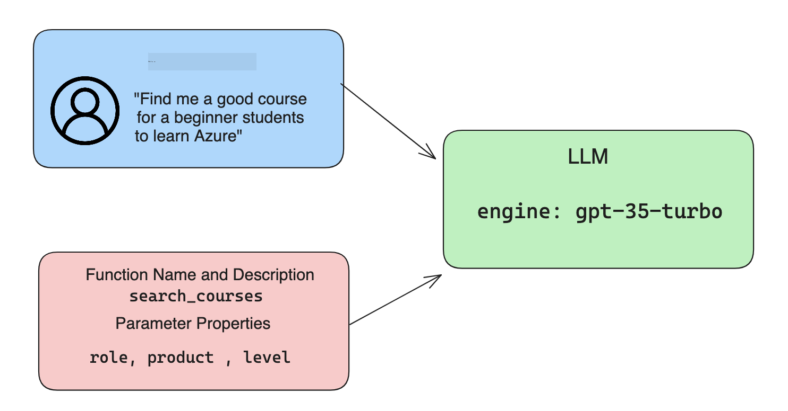

<!--
CO_OP_TRANSLATOR_METADATA:
{
  "original_hash": "77a48a201447be19aa7560706d6f93a0",
  "translation_date": "2025-07-09T14:24:26+00:00",
  "source_file": "11-integrating-with-function-calling/README.md",
  "language_code": "ur"
}
-->
# فنکشن کالنگ کے ساتھ انضمام

[](https://aka.ms/gen-ai-lesson11-gh?WT.mc_id=academic-105485-koreyst)

آپ نے پچھلے اسباق میں کافی کچھ سیکھا ہے۔ تاہم، ہم مزید بہتری لا سکتے ہیں۔ کچھ چیزیں جن پر ہم توجہ دے سکتے ہیں وہ یہ ہیں کہ ہم کس طرح ایک زیادہ مستقل ردعمل کا فارمیٹ حاصل کر سکتے ہیں تاکہ جواب کے ساتھ آگے کام کرنا آسان ہو جائے۔ نیز، ہم اپنی ایپلیکیشن کو مزید بہتر بنانے کے لیے دیگر ذرائع سے ڈیٹا شامل کرنا چاہیں گے۔

مندرجہ بالا مسائل وہ ہیں جنہیں یہ باب حل کرنے کی کوشش کر رہا ہے۔

## تعارف

اس سبق میں شامل ہوگا:

- فنکشن کالنگ کیا ہے اور اس کے استعمال کے مواقع کی وضاحت۔
- Azure OpenAI کے ذریعے فنکشن کال بنانا۔
- ایک ایپلیکیشن میں فنکشن کال کو کیسے شامل کیا جائے۔

## سیکھنے کے مقاصد

اس سبق کے اختتام تک، آپ قابل ہوں گے:

- فنکشن کالنگ کے استعمال کا مقصد بیان کرنا۔
- Azure OpenAI سروس کے ذریعے فنکشن کال سیٹ اپ کرنا۔
- اپنی ایپلیکیشن کے استعمال کے کیس کے لیے مؤثر فنکشن کالز ڈیزائن کرنا۔

## منظرنامہ: اپنے چیٹ بوٹ کو فنکشنز کے ساتھ بہتر بنانا

اس سبق کے لیے، ہم اپنی تعلیمی اسٹارٹ اپ کے لیے ایک فیچر بنانا چاہتے ہیں جو صارفین کو تکنیکی کورسز تلاش کرنے کے لیے چیٹ بوٹ استعمال کرنے کی اجازت دے۔ ہم ایسے کورسز کی سفارش کریں گے جو ان کی مہارت کی سطح، موجودہ کردار اور دلچسپی کی ٹیکنالوجی کے مطابق ہوں۔

اس منظرنامے کو مکمل کرنے کے لیے، ہم درج ذیل کا امتزاج استعمال کریں گے:

- `Azure OpenAI` صارف کے لیے چیٹ کا تجربہ بنانے کے لیے۔
- `Microsoft Learn Catalog API` صارفین کو ان کی درخواست کی بنیاد پر کورسز تلاش کرنے میں مدد کے لیے۔
- `Function Calling` صارف کے سوال کو لے کر اسے فنکشن کو بھیجنے کے لیے تاکہ API کی درخواست کی جا سکے۔

شروع کرنے کے لیے، آئیے دیکھتے ہیں کہ ہم فنکشن کالنگ کیوں استعمال کرنا چاہیں گے:

## فنکشن کالنگ کیوں

فنکشن کالنگ سے پہلے، LLM سے جوابات غیر منظم اور غیر مستقل ہوتے تھے۔ ڈویلپرز کو ہر قسم کے جواب کو سنبھالنے کے لیے پیچیدہ ویلیڈیشن کوڈ لکھنا پڑتا تھا۔ صارفین ایسے سوالات کے جواب نہیں حاصل کر سکتے تھے جیسے "اسٹاک ہوم میں موجودہ موسم کیسا ہے؟"۔ اس کی وجہ یہ تھی کہ ماڈلز صرف اس وقت کے ڈیٹا تک محدود تھے جس پر انہیں تربیت دی گئی تھی۔

فنکشن کالنگ Azure OpenAI سروس کی ایک خصوصیت ہے جو درج ذیل حدود کو دور کرتی ہے:

- **مستقل ردعمل کا فارمیٹ**۔ اگر ہم ردعمل کے فارمیٹ کو بہتر کنٹرول کر سکیں تو ہم اسے آسانی سے دیگر نظاموں کے ساتھ مربوط کر سکتے ہیں۔
- **بیرونی ڈیٹا**۔ ایپلیکیشن کے دیگر ذرائع سے ڈیٹا کو چیٹ کے سیاق و سباق میں استعمال کرنے کی صلاحیت۔

## مسئلے کی وضاحت ایک منظرنامے کے ذریعے

> ہم آپ کو مشورہ دیتے ہیں کہ اگر آپ نیچے دیا گیا منظرنامہ چلانا چاہتے ہیں تو [شامل شدہ نوٹ بک](../../../11-integrating-with-function-calling/python/aoai-assignment.ipynb) استعمال کریں۔ آپ صرف پڑھ بھی سکتے ہیں کیونکہ ہم ایک مسئلہ کی وضاحت کر رہے ہیں جہاں فنکشنز اس مسئلے کو حل کرنے میں مدد کر سکتے ہیں۔

آئیے ایک مثال دیکھتے ہیں جو ردعمل کے فارمیٹ کے مسئلے کو ظاہر کرتی ہے:

فرض کریں ہم طلباء کے ڈیٹا کا ایک ڈیٹا بیس بنانا چاہتے ہیں تاکہ ہم ان کے لیے درست کورس تجویز کر سکیں۔ نیچے دو طلباء کی تفصیلات دی گئی ہیں جو ڈیٹا میں بہت ملتی جلتی ہیں۔

1. اپنے Azure OpenAI ریسورس سے کنکشن بنائیں:

   ```python
   import os
   import json
   from openai import AzureOpenAI
   from dotenv import load_dotenv
   load_dotenv()

   client = AzureOpenAI(
   api_key=os.environ['AZURE_OPENAI_API_KEY'],  # this is also the default, it can be omitted
   api_version = "2023-07-01-preview"
   )

   deployment=os.environ['AZURE_OPENAI_DEPLOYMENT']
   ```

   نیچے کچھ Python کوڈ ہے جو Azure OpenAI کے ساتھ کنکشن کی ترتیب دیتا ہے جہاں ہم `api_type`, `api_base`, `api_version` اور `api_key` سیٹ کرتے ہیں۔

1. دو طلباء کی تفصیلات متغیرات `student_1_description` اور `student_2_description` کے ذریعے بنائیں۔

   ```python
   student_1_description="Emily Johnson is a sophomore majoring in computer science at Duke University. She has a 3.7 GPA. Emily is an active member of the university's Chess Club and Debate Team. She hopes to pursue a career in software engineering after graduating."

   student_2_description = "Michael Lee is a sophomore majoring in computer science at Stanford University. He has a 3.8 GPA. Michael is known for his programming skills and is an active member of the university's Robotics Club. He hopes to pursue a career in artificial intelligence after finishing his studies."
   ```

   ہم اوپر دی گئی طلباء کی تفصیلات کو LLM کو بھیجنا چاہتے ہیں تاکہ وہ ڈیٹا کو پارس کرے۔ یہ ڈیٹا بعد میں ہماری ایپلیکیشن میں استعمال ہو سکتا ہے، API کو بھیجا جا سکتا ہے یا ڈیٹا بیس میں محفوظ کیا جا سکتا ہے۔

1. آئیے دو ایک جیسے پرامپٹس بنائیں جن میں ہم LLM کو ہدایت دیتے ہیں کہ ہمیں کون سی معلومات چاہیے:

   ```python
   prompt1 = f'''
   Please extract the following information from the given text and return it as a JSON object:

   name
   major
   school
   grades
   club

   This is the body of text to extract the information from:
   {student_1_description}
   '''

   prompt2 = f'''
   Please extract the following information from the given text and return it as a JSON object:

   name
   major
   school
   grades
   club

   This is the body of text to extract the information from:
   {student_2_description}
   '''
   ```

   اوپر دیے گئے پرامپٹس LLM کو ہدایت دیتے ہیں کہ معلومات نکالے اور جواب JSON فارمیٹ میں دے۔

1. پرامپٹس اور Azure OpenAI کے کنکشن کو سیٹ کرنے کے بعد، ہم اب پرامپٹس کو LLM کو بھیجیں گے `openai.ChatCompletion` کا استعمال کرتے ہوئے۔ ہم پرامپٹ کو `messages` متغیر میں محفوظ کرتے ہیں اور رول کو `user` تفویض کرتے ہیں۔ یہ اس لیے ہے کہ صارف کی طرف سے چیٹ بوٹ کو بھیجے جانے والے پیغام کی نقل کی جا سکے۔

   ```python
   # response from prompt one
   openai_response1 = client.chat.completions.create(
   model=deployment,
   messages = [{'role': 'user', 'content': prompt1}]
   )
   openai_response1.choices[0].message.content

   # response from prompt two
   openai_response2 = client.chat.completions.create(
   model=deployment,
   messages = [{'role': 'user', 'content': prompt2}]
   )
   openai_response2.choices[0].message.content
   ```

اب ہم دونوں درخواستیں LLM کو بھیج سکتے ہیں اور جو جواب ہمیں ملتا ہے اسے اس طرح دیکھ سکتے ہیں `openai_response1['choices'][0]['message']['content']`۔

1. آخر میں، ہم جواب کو JSON فارمیٹ میں تبدیل کر سکتے ہیں `json.loads` کال کر کے:

   ```python
   # Loading the response as a JSON object
   json_response1 = json.loads(openai_response1.choices[0].message.content)
   json_response1
   ```

   جواب 1:

   ```json
   {
     "name": "Emily Johnson",
     "major": "computer science",
     "school": "Duke University",
     "grades": "3.7",
     "club": "Chess Club"
   }
   ```

   جواب 2:

   ```json
   {
     "name": "Michael Lee",
     "major": "computer science",
     "school": "Stanford University",
     "grades": "3.8 GPA",
     "club": "Robotics Club"
   }
   ```

   اگرچہ پرامپٹس ایک جیسے ہیں اور تفصیلات ملتی جلتی ہیں، ہم دیکھتے ہیں کہ `Grades` پراپرٹی کی قدریں مختلف فارمیٹ میں ہیں، جیسے کبھی `3.7` اور کبھی `3.7 GPA`۔

   یہ نتیجہ اس لیے ہے کیونکہ LLM غیر منظم ڈیٹا کو تحریری پرامپٹ کی شکل میں لیتا ہے اور غیر منظم ڈیٹا واپس کرتا ہے۔ ہمیں ایک منظم فارمیٹ چاہیے تاکہ ہمیں معلوم ہو کہ جب ہم اس ڈیٹا کو محفوظ یا استعمال کریں تو کیا توقع کرنی ہے۔

تو ہم فارمیٹنگ کے مسئلے کو کیسے حل کریں؟ فنکشن کالنگ کے ذریعے، ہم یقینی بنا سکتے ہیں کہ ہمیں منظم ڈیٹا واپس ملے۔ فنکشن کالنگ استعمال کرتے وقت، LLM درحقیقت کوئی فنکشن کال یا رن نہیں کرتا۔ اس کے بجائے، ہم LLM کے لیے ایک ڈھانچہ بناتے ہیں جس کی وہ اپنی جوابات میں پیروی کرے۔ پھر ہم ان منظم جوابات کو استعمال کرتے ہیں تاکہ معلوم ہو کہ ہماری ایپلیکیشن میں کون سا فنکشن چلانا ہے۔


پھر ہم فنکشن سے جو کچھ واپس آتا ہے اسے لے کر دوبارہ LLM کو بھیج سکتے ہیں۔ LLM پھر قدرتی زبان میں جواب دے گا تاکہ صارف کے سوال کا جواب دے سکے۔

## فنکشن کالز کے استعمال کے مواقع

ایسے کئی مختلف مواقع ہیں جہاں فنکشن کالز آپ کی ایپ کو بہتر بنا سکتی ہیں، جیسے:

- **بیرونی ٹولز کو کال کرنا**۔ چیٹ بوٹس صارفین کے سوالات کے جوابات دینے میں بہترین ہوتے ہیں۔ فنکشن کالنگ کے ذریعے، چیٹ بوٹس صارفین کے پیغامات کو استعمال کر کے مخصوص کام مکمل کر سکتے ہیں۔ مثال کے طور پر، ایک طالب علم چیٹ بوٹ سے کہہ سکتا ہے "میرے انسٹرکٹر کو ای میل بھیجو کہ مجھے اس موضوع میں مزید مدد چاہیے"۔ یہ فنکشن کال کر سکتا ہے `send_email(to: string, body: string)`

- **API یا ڈیٹا بیس کی کوئریز بنانا**۔ صارفین قدرتی زبان میں معلومات تلاش کر سکتے ہیں جو ایک منظم کوئری یا API درخواست میں تبدیل ہو جاتی ہے۔ مثال کے طور پر، ایک استاد پوچھ سکتا ہے "وہ کون سے طلباء ہیں جنہوں نے آخری اسائنمنٹ مکمل کی؟" جو فنکشن کال کر سکتا ہے `get_completed(student_name: string, assignment: int, current_status: string)`

- **منظم ڈیٹا بنانا**۔ صارفین ایک متن یا CSV بلاک لے کر LLM سے اہم معلومات نکال سکتے ہیں۔ مثال کے طور پر، ایک طالب علم امن معاہدوں کے بارے میں ویکیپیڈیا آرٹیکل کو AI فلیش کارڈز بنانے کے لیے تبدیل کر سکتا ہے۔ یہ فنکشن کال کر کے کیا جا سکتا ہے `get_important_facts(agreement_name: string, date_signed: string, parties_involved: list)`

## اپنا پہلا فنکشن کال بنانا

فنکشن کال بنانے کا عمل تین اہم مراحل پر مشتمل ہے:

1. اپنی فنکشنز کی فہرست اور صارف کا پیغام لے کر Chat Completions API کو کال کرنا۔
2. ماڈل کے جواب کو پڑھنا تاکہ کوئی عمل انجام دیا جا سکے، مثلاً فنکشن یا API کال چلانا۔
3. اپنے فنکشن کے جواب کے ساتھ دوبارہ Chat Completions API کو کال کرنا تاکہ اس معلومات کو صارف کو جواب دینے کے لیے استعمال کیا جا سکے۔



### مرحلہ 1 - پیغامات بنانا

پہلا مرحلہ صارف کا پیغام بنانا ہے۔ یہ متحرک طور پر ٹیکسٹ ان پٹ کی ویلیو لے کر تفویض کیا جا سکتا ہے یا آپ یہاں کوئی ویلیو دے سکتے ہیں۔ اگر یہ آپ کا پہلا موقع ہے کہ آپ Chat Completions API کے ساتھ کام کر رہے ہیں، تو ہمیں پیغام کا `role` اور `content` متعین کرنا ہوگا۔

`role` ہو سکتا ہے `system` (قواعد بنانے والا)، `assistant` (ماڈل) یا `user` (آخری صارف)۔ فنکشن کالنگ کے لیے، ہم اسے `user` تفویض کریں گے اور ایک مثال سوال دیں گے۔

```python
messages= [ {"role": "user", "content": "Find me a good course for a beginner student to learn Azure."} ]
```

مختلف رولز تفویض کر کے، LLM کو واضح کیا جاتا ہے کہ یہ نظام کہہ رہا ہے یا صارف، جو ایک گفتگو کی تاریخ بنانے میں مدد دیتا ہے جس پر LLM کام کر سکتا ہے۔

### مرحلہ 2 - فنکشنز بنانا

اگلا، ہم ایک فنکشن اور اس کے پیرامیٹرز کی تعریف کریں گے۔ ہم یہاں صرف ایک فنکشن `search_courses` استعمال کریں گے لیکن آپ متعدد فنکشنز بنا سکتے ہیں۔

> **Important** : فنکشنز LLM کو بھیجے جانے والے سسٹم پیغام میں شامل ہوتے ہیں اور آپ کے دستیاب ٹوکنز کی مقدار میں شامل ہوں گے۔

نیچے، ہم فنکشنز کو آئٹمز کی ایک فہرست کے طور پر بناتے ہیں۔ ہر آئٹم ایک فنکشن ہے اور اس کی خصوصیات `name`, `description` اور `parameters` ہیں:

```python
functions = [
   {
      "name":"search_courses",
      "description":"Retrieves courses from the search index based on the parameters provided",
      "parameters":{
         "type":"object",
         "properties":{
            "role":{
               "type":"string",
               "description":"The role of the learner (i.e. developer, data scientist, student, etc.)"
            },
            "product":{
               "type":"string",
               "description":"The product that the lesson is covering (i.e. Azure, Power BI, etc.)"
            },
            "level":{
               "type":"string",
               "description":"The level of experience the learner has prior to taking the course (i.e. beginner, intermediate, advanced)"
            }
         },
         "required":[
            "role"
         ]
      }
   }
]
```

آئیے ہر فنکشن کی تفصیل ذیل میں دیکھیں:

- `name` - فنکشن کا نام جو ہم کال کرنا چاہتے ہیں۔
- `description` - یہ فنکشن کے کام کرنے کی وضاحت ہے۔ یہاں واضح اور مخصوص ہونا ضروری ہے۔
- `parameters` - وہ ویلیوز اور فارمیٹ کی فہرست جو آپ چاہتے ہیں کہ ماڈل اپنے جواب میں پیدا کرے۔ پیرامیٹرز کی فہرست میں آئٹمز ہوتے ہیں جن کی خصوصیات درج ذیل ہیں:
  1. `type` - وہ ڈیٹا ٹائپ جس میں پراپرٹیز محفوظ ہوں گی۔
  2. `properties` - مخصوص ویلیوز کی فہرست جو ماڈل اپنے جواب میں استعمال کرے گا۔
      1. `name` - وہ کلید جو ماڈل اپنے فارمیٹ شدہ جواب میں استعمال کرے گا، مثلاً `product`۔
      2. `type` - اس پراپرٹی کا ڈیٹا ٹائپ، مثلاً `string`۔
      3. `description` - اس مخصوص پراپرٹی کی وضاحت۔

ایک اختیاری پراپرٹی `required` بھی ہے - فنکشن کال مکمل کرنے کے لیے ضروری پراپرٹی۔

### مرحلہ 3 - فنکشن کال کرنا

فنکشن کی تعریف کے بعد، اب ہمیں اسے Chat Completion API کال میں شامل کرنا ہوگا۔ ہم یہ `functions` کو درخواست میں شامل کر کے کرتے ہیں۔ اس صورت میں `functions=functions`۔

ایک آپشن یہ بھی ہے کہ `function_call` کو `auto` پر سیٹ کریں۔ اس کا مطلب ہے کہ ہم LLM کو فیصلہ کرنے دیں گے کہ صارف کے پیغام کی بنیاد پر کون سا فنکشن کال کرنا ہے بجائے اس کے کہ ہم خود تفویض کریں۔

نیچے کچھ کوڈ ہے جہاں ہم `ChatCompletion.create` کال کرتے ہیں، نوٹ کریں کہ ہم `functions=functions` اور `function_call="auto"` سیٹ کر رہے ہیں اور اس طرح LLM کو اختیار دے رہے ہیں کہ وہ کب فنکشن کال کرے:

```python
response = client.chat.completions.create(model=deployment,
                                        messages=messages,
                                        functions=functions,
                                        function_call="auto")

print(response.choices[0].message)
```

اب جو جواب آ رہا ہے وہ کچھ یوں دکھائی دیتا ہے:

```json
{
  "role": "assistant",
  "function_call": {
    "name": "search_courses",
    "arguments": "{\n  \"role\": \"student\",\n  \"product\": \"Azure\",\n  \"level\": \"beginner\"\n}"
  }
}
```

یہاں ہم دیکھ سکتے ہیں کہ فنکشن `search_courses` کال کیا گیا اور کن دلائل کے ساتھ، جو JSON جواب میں `arguments` پراپرٹی میں درج ہیں۔

نتیجہ یہ نکلا کہ LLM نے وہ ڈیٹا تلاش کیا جو فنکشن کے دلائل سے میل کھاتا تھا کیونکہ وہ اسے `messages` پیرامیٹر میں دی گئی ویلیو سے نکال رہا تھا۔ نیچے `messages` کی ویلیو یاد دہانی کے لیے ہے:

```python
messages= [ {"role": "user", "content": "Find me a good course for a beginner student to learn Azure."} ]
```

جیسا کہ آپ دیکھ سکتے ہیں، `student`, `Azure` اور `beginner` کو `messages` سے نکالا گیا اور فنکشن کے ان پٹ کے طور پر سیٹ کیا گیا۔ فنکشنز کو اس طرح استعمال کرنا معلومات نکالنے کا ایک بہترین طریقہ ہے اور ساتھ ہی LLM کو ساخت فراہم کرنے اور دوبارہ قابل استعمال فعالیت رکھنے کا بھی۔

اب ہمیں دیکھنا ہے کہ ہم اسے اپنی ایپ میں کیسے استعمال کر سکتے ہیں۔

## فنکشن کالز کو ایپلیکیشن میں شامل کرنا

جب ہم نے LLM سے فارمیٹ شدہ جواب کی جانچ کر لی، تو اب ہم اسے ایپلیکیشن میں شامل کر سکتے ہیں۔

### فلو کا انتظام

اپنی ایپلیکیشن میں شامل کرنے کے لیے، آئیے درج ذیل اقدامات کریں:

1. سب سے پہلے، OpenAI سروسز کو کال کریں اور پیغام کو ایک متغیر `response_message` میں محفوظ کریں۔

   ```python
   response_message = response.choices[0].message
   ```

1. اب ہم وہ فنکشن ڈیفائن کریں گے جو Microsoft Learn API کو کال کرے گا تاکہ کورسز کی فہرست حاصل کی جا سکے:

   ```python
   import requests

   def search_courses(role, product, level):
     url = "https://learn.microsoft.com/api/catalog/"
     params = {
        "role": role,
        "product": product,
        "level": level
     }
     response = requests.get(url, params=params)
     modules = response.json()["modules"]
     results = []
     for module in modules[:5]:
        title = module["title"]
        url = module["url"]
        results.append({"title": title, "url": url})
     return str(results)
   ```

   نوٹ کریں کہ ہم اب ایک حقیقی Python فنکشن بنا رہے ہیں جو `functions` متغیر میں متعارف کرائے گئے فنکشن ناموں سے میپ ہوتا ہے۔ ہم حقیقی بیرونی API کالز کر رہے ہیں تاکہ مطلوبہ ڈیٹا حاصل کیا جا سکے۔ اس صورت میں، ہم Microsoft Learn API کے خلاف تربیتی ماڈیولز تلاش کرتے ہیں۔

تو ہم نے `functions` متغیر اور ایک متعلقہ Python فنکشن بنایا، اب ہم LLM کو کیسے بتائیں کہ ان دونوں کو کیسے میپ کیا جائے تاکہ ہمارا Python فنکشن کال ہو؟

1. یہ دیکھنے کے لیے کہ آیا ہمیں Python فنکشن کال کرنا ہے، ہمیں LLM کے جواب میں دیکھنا ہوگا کہ آیا `function_call` موجود ہے اور اس کے مطابق فنکشن کال کریں۔ نیچے چیک کرنے کا طریقہ دیا گیا ہے:

   ```python
   # Check if the model wants to call a function
   if response_message.function_call.name:
    print("Recommended Function call:")
    print(response_message.function_call.name)
    print()

    # Call the function.
    function_name = response_message.function_call.name

    available_functions = {
            "search_courses": search_courses,
    }
    function_to_call = available_functions[function_name]

    function_args = json.loads(response_message.function_call.arguments)
    function_response = function_to_call(**function_args)

    print("Output of function call:")
    print(function_response)
    print(type(function_response))


    # Add the assistant response and function response to the messages
    messages.append( # adding assistant response to messages
        {
            "role": response_message.role,
            "function_call": {
                "name": function_name,
                "arguments": response_message.function_call.arguments,
            },
            "content": None
        }
    )
    messages.append( # adding function response to messages
        {
            "role": "function",
            "name": function_name,
            "content":function_response,
        }
    )
   ```

   یہ تین لائنیں یقینی بناتی ہیں کہ ہم فنکشن کا نام، دلائل نکالیں اور کال کریں:

   ```python
   function_to_call = available_functions[function_name]

   function_args = json.loads(response_message.function_call.arguments)
   function_response = function_to_call(**function_args)
   ```

   نیچے ہمارے کوڈ کے چلانے کا آؤٹ پٹ ہے:

   **Output**

   ```Recommended Function call:
   {
     "name": "search_courses",
     "arguments": "{\n  \"role\": \"student\",\n  \"product\": \"Azure\",\n  \"level\": \"beginner\"\n}"
   }

   Output of function call:
   [{'title': 'Describe concepts of cryptography', 'url': 'https://learn.microsoft.com/training/modules/describe-concepts-of-cryptography/?
   WT.mc_id=api_CatalogApi'}, {'title': 'Introduction to audio classification with TensorFlow', 'url': 'https://learn.microsoft.com/en-
   us/training/modules/intro-audio-classification-tensorflow/?WT.mc_id=api_CatalogApi'}, {'title': 'Design a Performant Data Model in Azure SQL
   Database with Azure Data Studio', 'url': 'https://learn.microsoft.com/training/modules/design-a-data-model-with-ads/?
   WT.mc_id=api_CatalogApi'}, {'title': 'Getting started with the Microsoft Cloud Adoption Framework for Azure', 'url':
   'https://learn.microsoft.com/training/modules/cloud-adoption-framework-getting-started/?WT.mc_id=api_CatalogApi'}, {'title': 'Set up the
   Rust development environment', 'url': 'https://learn.microsoft.com/training/modules/rust-set-up-environment/?WT.mc_id=api_CatalogApi'}]
   <class 'str'>
   ```

1. اب ہم اپ ڈیٹ شدہ پیغام `messages` کو LLM کو بھیجیں گے تاکہ ہمیں API JSON فارمیٹ کے بجائے قدرتی زبان میں جواب ملے۔

   ```python
   print("Messages in next request:")
   print(messages)
   print()

   second_response = client.chat.completions.create(
      messages=messages,
      model=deployment,
      function_call="auto",
      functions=functions,
      temperature=0
         )  # get a new response from GPT where it can see the function response


   print(second_response.choices[0].message)
   ```

   **Output**

   ```python
   {
     "role": "assistant",
     "content": "I found some good courses for beginner students to learn Azure:\n\n1. [Describe concepts of cryptography] (https://learn.microsoft.com/training/modules/describe-concepts-of-cryptography/?WT.mc_id=api_CatalogApi)\n2. [Introduction to audio classification with TensorFlow](https://learn.microsoft.com/training/modules/intro-audio-classification-tensorflow/?WT.mc_id=api_CatalogApi)\n3. [Design a Performant Data Model in Azure SQL Database with Azure Data Studio](https://learn.microsoft.com/training/modules/design-a-data-model-with-ads/?WT.mc_id=api_CatalogApi)\n4. [Getting started with the Microsoft Cloud Adoption Framework for Azure](https://learn.microsoft.com/training/modules/cloud-adoption-framework-getting-started/?WT.mc_id=api_CatalogApi)\n5. [Set up the Rust development environment](https://learn.microsoft.com/training/modules/rust-set-up-environment/?WT.mc_id=api_CatalogApi)\n\nYou can click on the links to access the courses."
   }

   ```

## اسائنمنٹ

Azure OpenAI فنکشن کالنگ کی اپنی تعلیم جاری رکھنے کے لیے آپ بنا سکتے ہیں:

- فنکشن کے مزید پیرامیٹرز جو سیکھنے والوں کو مزید کورسز تلاش کرنے میں مدد دے سکتے ہیں۔
- ایک اور فنکشن کال بنائیں جو سیکھنے والے کی مادری زبان جیسی مزید معلومات لے۔
- ایسی ایرر ہینڈلنگ بنائیں جب فنکشن کال اور/یا API کال کوئی مناسب کورسز واپس نہ کرے۔
## شاندار کام! سفر جاری رکھیں

اس سبق کو مکمل کرنے کے بعد، ہمارے [Generative AI Learning collection](https://aka.ms/genai-collection?WT.mc_id=academic-105485-koreyst) کو دیکھیں تاکہ آپ اپنی Generative AI کی مہارت کو مزید بڑھا سکیں!

سبق 12 کی طرف جائیں، جہاں ہم دیکھیں گے کہ [AI ایپلیکیشنز کے لیے UX کیسے ڈیزائن کریں](../12-designing-ux-for-ai-applications/README.md?WT.mc_id=academic-105485-koreyst)!

**دستخطی دستبرداری**:  
یہ دستاویز AI ترجمہ سروس [Co-op Translator](https://github.com/Azure/co-op-translator) کے ذریعے ترجمہ کی گئی ہے۔ اگرچہ ہم درستگی کے لیے کوشاں ہیں، براہ کرم آگاہ رہیں کہ خودکار ترجمے میں غلطیاں یا عدم درستیاں ہو سکتی ہیں۔ اصل دستاویز اپنی مادری زبان میں ہی معتبر ماخذ سمجھی جانی چاہیے۔ اہم معلومات کے لیے پیشہ ور انسانی ترجمہ کی سفارش کی جاتی ہے۔ اس ترجمے کے استعمال سے پیدا ہونے والی کسی بھی غلط فہمی یا غلط تشریح کی ذمہ داری ہم پر عائد نہیں ہوتی۔