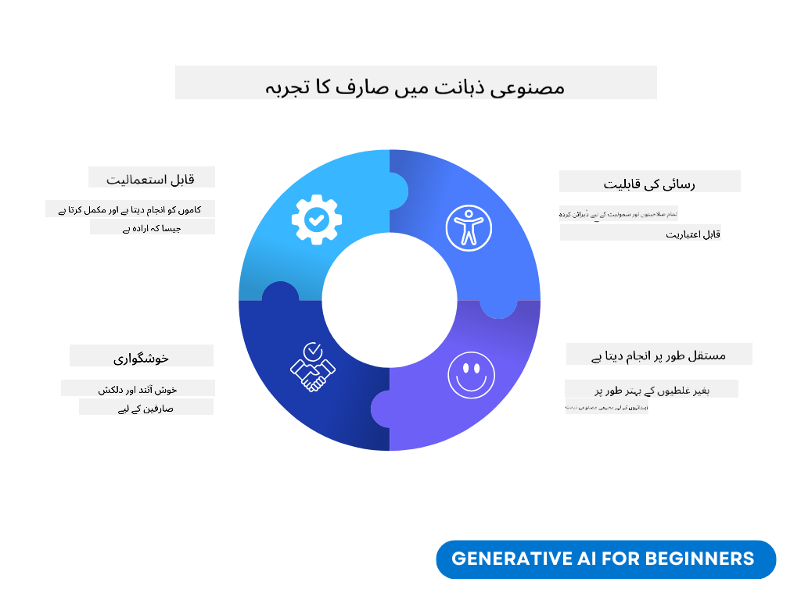
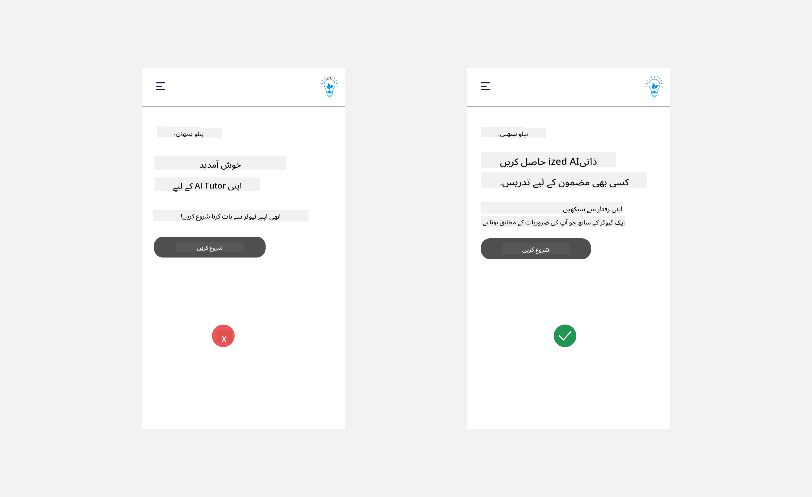
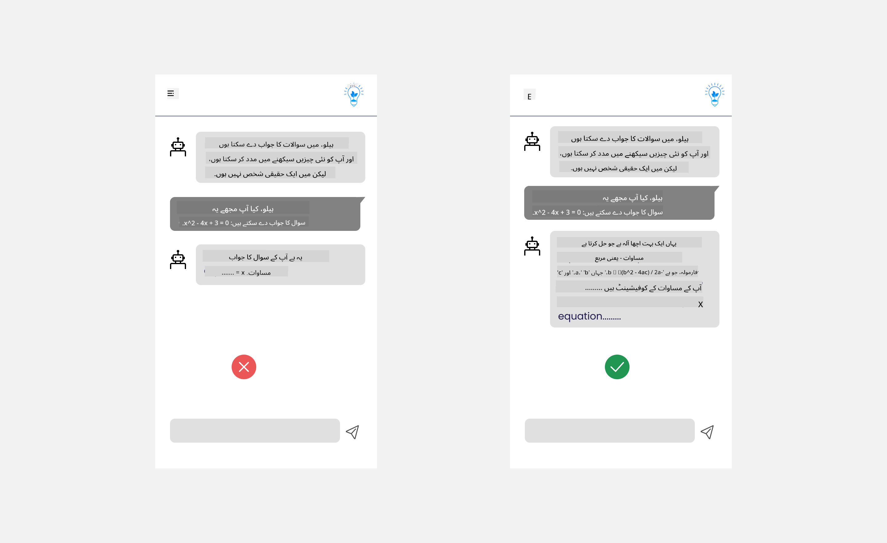
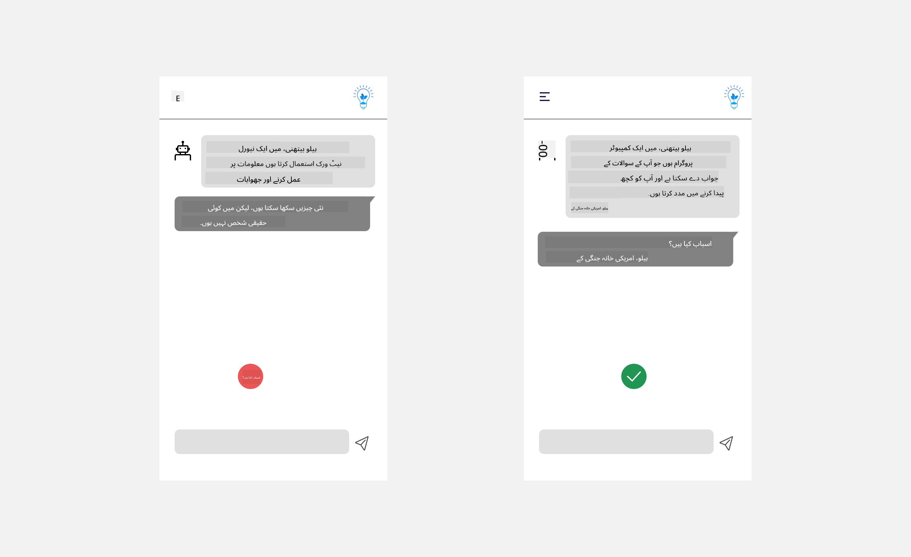
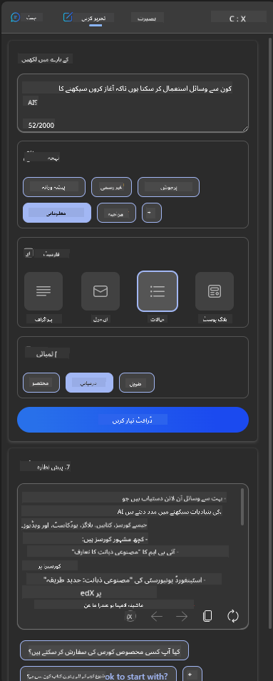
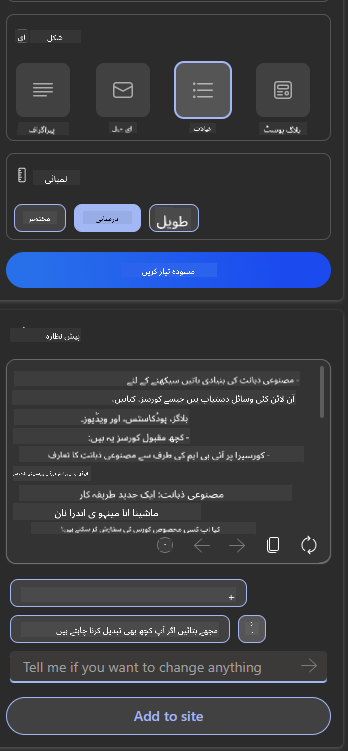
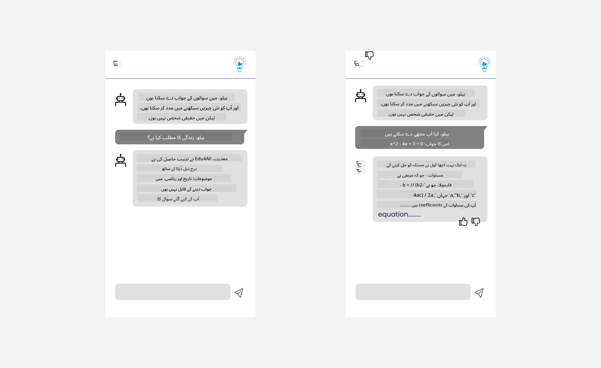

<!--
CO_OP_TRANSLATOR_METADATA:
{
  "original_hash": "78bbeed50fd4dc9fdee931f5daf98cb3",
  "translation_date": "2025-10-17T13:14:19+00:00",
  "source_file": "12-designing-ux-for-ai-applications/README.md",
  "language_code": "ur"
}
-->
# AI ایپلیکیشنز کے لیے UX ڈیزائن کرنا

> _(اوپر دی گئی تصویر پر کلک کریں تاکہ اس سبق کی ویڈیو دیکھ سکیں)_

یوزر ایکسپیرینس ایپ بنانے کا ایک بہت اہم پہلو ہے۔ صارفین کو آپ کی ایپ کو مؤثر طریقے سے استعمال کرنے کے قابل ہونا چاہیے تاکہ وہ اپنے کام انجام دے سکیں۔ مؤثر ہونا ایک بات ہے لیکن آپ کو ایپ اس طرح ڈیزائن کرنی چاہیے کہ ہر کوئی اسے استعمال کر سکے، تاکہ وہ _قابل رسائی_ ہو۔ یہ باب اس پہلو پر توجہ مرکوز کرے گا تاکہ آپ ایک ایسی ایپ ڈیزائن کریں جو لوگ استعمال کر سکیں اور کرنا چاہیں۔

## تعارف

یوزر ایکسپیرینس وہ ہے کہ صارف کسی خاص پروڈکٹ یا سروس کے ساتھ کیسے تعامل کرتا ہے اور اسے کیسے استعمال کرتا ہے، چاہے وہ کوئی نظام ہو، ٹول ہو یا ڈیزائن۔ AI ایپلیکیشنز تیار کرتے وقت، ڈویلپرز نہ صرف یوزر ایکسپیرینس کو مؤثر بنانے پر توجہ دیتے ہیں بلکہ اخلاقیات پر بھی غور کرتے ہیں۔ اس سبق میں، ہم ان AI ایپلیکیشنز بنانے کا احاطہ کریں گے جو صارفین کی ضروریات کو پورا کرتی ہیں۔

سبق میں درج ذیل پہلو شامل ہوں گے:

- یوزر ایکسپیرینس کا تعارف اور صارفین کی ضروریات کو سمجھنا
- AI ایپلیکیشنز کو اعتماد اور شفافیت کے لیے ڈیزائن کرنا
- AI ایپلیکیشنز کو تعاون اور فیڈبیک کے لیے ڈیزائن کرنا

## سیکھنے کے اہداف

اس سبق کے بعد، آپ قابل ہوں گے:

- سمجھ سکیں کہ AI ایپلیکیشنز کو صارفین کی ضروریات کے مطابق کیسے بنایا جائے۔
- AI ایپلیکیشنز کو اس طرح ڈیزائن کریں جو اعتماد اور تعاون کو فروغ دے۔

### پیشگی شرط

کچھ وقت نکالیں اور [یوزر ایکسپیرینس اور ڈیزائن تھنکنگ](https://learn.microsoft.com/training/modules/ux-design?WT.mc_id=academic-105485-koreyst) کے بارے میں مزید پڑھیں۔

## یوزر ایکسپیرینس کا تعارف اور صارفین کی ضروریات کو سمجھنا

ہمارے خیالی تعلیمی اسٹارٹ اپ میں، ہمارے دو بنیادی صارفین ہیں، اساتذہ اور طلباء۔ دونوں صارفین کی منفرد ضروریات ہیں۔ یوزر سینٹرڈ ڈیزائن صارف کو ترجیح دیتا ہے تاکہ پروڈکٹس ان لوگوں کے لیے موزوں اور فائدہ مند ہوں جن کے لیے وہ بنائی گئی ہیں۔

ایپلیکیشن کو **مفید، قابل اعتماد، قابل رسائی اور خوشگوار** ہونا چاہیے تاکہ ایک اچھا یوزر ایکسپیرینس فراہم کیا جا سکے۔

### قابل استعمال

مفید ہونے کا مطلب یہ ہے کہ ایپلیکیشن میں وہ فنکشنلٹی ہو جو اس کے مطلوبہ مقصد سے مطابقت رکھتی ہو، جیسے کہ گریڈنگ کے عمل کو خودکار بنانا یا نظرثانی کے لیے فلیش کارڈز تیار کرنا۔ ایک ایپلیکیشن جو گریڈنگ کے عمل کو خودکار بناتی ہے، اسے طلباء کے کام کو پہلے سے طے شدہ معیار کے مطابق درست اور مؤثر طریقے سے اسکور دینا چاہیے۔ اسی طرح، ایک ایپلیکیشن جو نظرثانی کے لیے فلیش کارڈز تیار کرتی ہے، اسے اپنے ڈیٹا کی بنیاد پر متعلقہ اور متنوع سوالات تیار کرنے کے قابل ہونا چاہیے۔

### قابل اعتماد

قابل اعتماد ہونے کا مطلب یہ ہے کہ ایپلیکیشن مستقل طور پر اور بغیر کسی غلطی کے اپنا کام انجام دے سکتی ہے۔ تاہم، AI بھی انسانوں کی طرح کامل نہیں ہے اور غلطیوں کا شکار ہو سکتا ہے۔ ایپلیکیشنز کو غلطیوں یا غیر متوقع حالات کا سامنا ہو سکتا ہے جن کے لیے انسانی مداخلت یا تصحیح کی ضرورت ہو۔ آپ غلطیوں کو کیسے ہینڈل کرتے ہیں؟ اس سبق کے آخری حصے میں، ہم اس بات کا احاطہ کریں گے کہ AI سسٹمز اور ایپلیکیشنز کو تعاون اور فیڈبیک کے لیے کیسے ڈیزائن کیا جاتا ہے۔

### قابل رسائی

قابل رسائی ہونے کا مطلب یہ ہے کہ یوزر ایکسپیرینس کو مختلف صلاحیتوں والے صارفین، بشمول معذور افراد تک بڑھایا جائے، تاکہ کوئی بھی پیچھے نہ رہ جائے۔ قابل رسائی رہنما اصولوں اور اصولوں پر عمل کرتے ہوئے، AI حل زیادہ جامع، قابل استعمال اور تمام صارفین کے لیے فائدہ مند بن جاتے ہیں۔

### خوشگوار

خوشگوار ہونے کا مطلب یہ ہے کہ ایپلیکیشن استعمال کرنے میں لطف اندوز ہو۔ ایک دلکش یوزر ایکسپیرینس صارف پر مثبت اثر ڈال سکتا ہے، انہیں ایپلیکیشن پر واپس آنے کی ترغیب دے سکتا ہے اور کاروباری آمدنی میں اضافہ کر سکتا ہے۔

ہر چیلنج کو AI کے ذریعے حل نہیں کیا جا سکتا۔ AI آپ کے یوزر ایکسپیرینس کو بڑھانے کے لیے آتا ہے، چاہے وہ دستی کاموں کو خودکار بنانا ہو یا یوزر ایکسپیرینس کو ذاتی بنانا۔

## AI ایپلیکیشنز کو اعتماد اور شفافیت کے لیے ڈیزائن کرنا

AI ایپلیکیشنز ڈیزائن کرتے وقت اعتماد پیدا کرنا بہت ضروری ہے۔ اعتماد اس بات کو یقینی بناتا ہے کہ صارف کو یقین ہو کہ ایپلیکیشن کام کرے گی، مستقل طور پر نتائج فراہم کرے گی اور نتائج وہی ہوں گے جو صارف کو چاہیے۔ اس علاقے میں ایک خطرہ عدم اعتماد اور زیادہ اعتماد ہے۔ عدم اعتماد اس وقت ہوتا ہے جب صارف کو AI سسٹم پر بہت کم یا کوئی اعتماد نہیں ہوتا، جس کی وجہ سے صارف آپ کی ایپلیکیشن کو مسترد کر دیتا ہے۔ زیادہ اعتماد اس وقت ہوتا ہے جب صارف AI سسٹم کی صلاحیت کو زیادہ سمجھتا ہے، جس کی وجہ سے صارفین AI سسٹم پر بہت زیادہ اعتماد کرتے ہیں۔ مثال کے طور پر، ایک خودکار گریڈنگ سسٹم کے معاملے میں زیادہ اعتماد اساتذہ کو کچھ کاغذات کو پروف کرنے سے روک سکتا ہے تاکہ یہ یقینی بنایا جا سکے کہ گریڈنگ سسٹم اچھی طرح کام کرتا ہے۔ اس سے طلباء کے لیے غیر منصفانہ یا غلط گریڈز، یا فیڈبیک اور بہتری کے مواقع ضائع ہو سکتے ہیں۔

اعتماد کو ڈیزائن کے مرکز میں رکھنے کے دو طریقے وضاحت اور کنٹرول ہیں۔

### وضاحت

جب AI فیصلوں کو مطلع کرنے میں مدد کرتا ہے جیسے کہ مستقبل کی نسلوں کو علم دینا، تو اساتذہ اور والدین کے لیے یہ سمجھنا بہت ضروری ہے کہ AI فیصلے کیسے کیے جاتے ہیں۔ یہ وضاحت ہے - یہ سمجھنا کہ AI ایپلیکیشنز فیصلے کیسے کرتی ہیں۔ وضاحت کے لیے ڈیزائن کرنے میں وہ تفصیلات شامل کرنا شامل ہے جو اس بات کو اجاگر کرتی ہیں کہ AI نے آؤٹ پٹ تک کیسے پہنچا۔ سامعین کو معلوم ہونا چاہیے کہ آؤٹ پٹ AI کے ذریعے تیار کیا گیا ہے نہ کہ انسان کے ذریعے۔ مثال کے طور پر، "اب اپنے ٹیوٹر کے ساتھ چیٹنگ شروع کریں" کہنے کے بجائے "AI ٹیوٹر استعمال کریں جو آپ کی ضروریات کے مطابق ہو اور آپ کو اپنی رفتار سے سیکھنے میں مدد کرے" کہیں۔

ایک اور مثال یہ ہے کہ AI صارف اور ذاتی ڈیٹا کو کیسے استعمال کرتا ہے۔ مثال کے طور پر، ایک صارف جس کا پرسونا طالب علم ہے، اس کے پرسونا کی بنیاد پر کچھ حدود ہو سکتی ہیں۔ AI سوالات کے جوابات ظاہر کرنے کے قابل نہیں ہو سکتا لیکن صارف کو یہ سوچنے میں مدد دے سکتا ہے کہ وہ مسئلہ کیسے حل کر سکتے ہیں۔

وضاحت کا ایک آخری اہم حصہ وضاحتوں کو آسان بنانا ہے۔ طلباء اور اساتذہ AI ماہرین نہیں ہو سکتے، اس لیے ایپلیکیشن کیا کر سکتی ہے یا نہیں کر سکتی اس کی وضاحتیں آسان اور سمجھنے میں آسان ہونی چاہئیں۔

### کنٹرول

جنریٹو AI صارف اور AI کے درمیان تعاون پیدا کرتا ہے، جہاں مثال کے طور پر صارف مختلف نتائج کے لیے پرامپٹس میں ترمیم کر سکتا ہے۔ اس کے علاوہ، ایک بار آؤٹ پٹ تیار ہونے کے بعد، صارفین کو نتائج میں ترمیم کرنے کے قابل ہونا چاہیے تاکہ انہیں کنٹرول کا احساس ہو۔ مثال کے طور پر، Bing استعمال کرتے وقت، آپ اپنے پرامپٹ کو فارمیٹ، ٹون اور لمبائی کی بنیاد پر اپنی مرضی کے مطابق بنا سکتے ہیں۔ اس کے علاوہ، آپ اپنے آؤٹ پٹ میں تبدیلیاں شامل کر سکتے ہیں اور آؤٹ پٹ کو نیچے دکھائے گئے کے مطابق ترمیم کر سکتے ہیں:

Bing میں ایک اور فیچر جو صارف کو ایپلیکیشن پر کنٹرول فراہم کرتا ہے وہ یہ ہے کہ AI کے استعمال کردہ ڈیٹا میں شامل ہونے اور باہر نکلنے کی صلاحیت۔ ایک اسکول ایپلیکیشن کے لیے، ایک طالب علم اپنے نوٹس کے ساتھ ساتھ اساتذہ کے وسائل کو نظرثانی کے مواد کے طور پر استعمال کرنا چاہ سکتا ہے۔

> AI ایپلیکیشنز ڈیزائن کرتے وقت، صارفین کو زیادہ اعتماد نہ کرنے کو یقینی بنانے کے لیے ارادیت کلیدی ہے، اس کی صلاحیتوں کی غیر حقیقی توقعات قائم کرنا۔ ایسا کرنے کا ایک طریقہ پرامپٹس اور نتائج کے درمیان رکاوٹ پیدا کرنا ہے۔ صارف کو یاد دلانا کہ یہ AI ہے نہ کہ کوئی انسان

## AI ایپلیکیشنز کو تعاون اور فیڈبیک کے لیے ڈیزائن کرنا

جیسا کہ پہلے ذکر کیا گیا ہے، جنریٹو AI صارف اور AI کے درمیان تعاون پیدا کرتا ہے۔ زیادہ تر تعاملات صارف کے پرامپٹ داخل کرنے اور AI کے آؤٹپٹ تیار کرنے کے ساتھ ہوتے ہیں۔ اگر آؤٹپٹ غلط ہو تو کیا ہوگا؟ ایپلیکیشن غلطیوں کو کیسے ہینڈل کرتی ہے اگر وہ واقع ہوں؟ کیا AI صارف کو مورد الزام ٹھہراتا ہے یا غلطی کی وضاحت کرنے میں وقت لیتا ہے؟

AI ایپلیکیشنز کو فیڈبیک حاصل کرنے اور دینے کے لیے بنایا جانا چاہیے۔ یہ نہ صرف AI سسٹم کو بہتر بنانے میں مدد کرتا ہے بلکہ صارفین کے ساتھ اعتماد بھی پیدا کرتا ہے۔ ڈیزائن میں فیڈبیک لوپ شامل ہونا چاہیے، ایک مثال آؤٹپٹ پر ایک سادہ تھمبز اپ یا ڈاؤن ہو سکتی ہے۔

اسے ہینڈل کرنے کا ایک اور طریقہ یہ ہے کہ سسٹم کی صلاحیتوں اور حدود کو واضح طور پر بتایا جائے۔ جب کوئی صارف AI کی صلاحیتوں سے باہر کچھ طلب کرتا ہے، تو اس سے نمٹنے کا بھی ایک طریقہ ہونا چاہیے، جیسا کہ نیچے دکھایا گیا ہے۔

سسٹم کی غلطیاں ایپلیکیشنز کے ساتھ عام ہیں جہاں صارف کو AI کے دائرہ کار سے باہر معلومات کے ساتھ مدد کی ضرورت ہو سکتی ہے یا ایپلیکیشن میں صارف کے ذریعہ پیدا کردہ سوالات/مضامین کی تعداد پر حد ہو سکتی ہے۔ مثال کے طور پر، ایک AI ایپلیکیشن جو محدود مضامین کے ڈیٹا پر تربیت یافتہ ہے، مثال کے طور پر، تاریخ اور ریاضی جغرافیہ کے سوالات کو ہینڈل کرنے کے قابل نہیں ہو سکتی۔ اس کو کم کرنے کے لیے، AI سسٹم اس طرح کا جواب دے سکتا ہے: "معاف کیجیے، ہماری پروڈکٹ کو درج ذیل مضامین کے ڈیٹا کے ساتھ تربیت دی گئی ہے.....، میں آپ کے پوچھے گئے سوال کا جواب دینے کے قابل نہیں ہوں۔"

AI ایپلیکیشنز کامل نہیں ہیں، اس لیے ان سے غلطیاں ہونے کا امکان ہے۔ اپنی ایپلیکیشنز کو ڈیزائن کرتے وقت، آپ کو صارفین سے فیڈبیک اور غلطیوں کو ہینڈل کرنے کے لیے ایک ایسا طریقہ بنانا چاہیے جو آسان اور آسانی سے قابل وضاحت ہو۔

## اسائنمنٹ

اب تک آپ نے جو بھی AI ایپلیکیشنز بنائی ہیں، ان میں درج ذیل اقدامات کو نافذ کرنے پر غور کریں:

- **خوشگوار:** غور کریں کہ آپ اپنی ایپ کو مزید خوشگوار کیسے بنا سکتے ہیں۔ کیا آپ ہر جگہ وضاحتیں شامل کر رہے ہیں؟ کیا آپ صارف کو دریافت کرنے کی ترغیب دے رہے ہیں؟ آپ اپنی غلطی کے پیغامات کو کیسے لکھ رہے ہیں؟

- **قابل استعمال:** ایک ویب ایپ بنائیں۔ یقینی بنائیں کہ آپ کی ایپ ماؤس اور کی بورڈ دونوں کے ذریعے نیویگیٹ کی جا سکتی ہے۔

- **اعتماد اور شفافیت:** AI اور اس کے آؤٹپٹ پر مکمل اعتماد نہ کریں، غور کریں کہ آپ آؤٹپٹ کی تصدیق کے لیے عمل میں انسان کو کیسے شامل کریں گے۔ اعتماد اور شفافیت حاصل کرنے کے دیگر طریقوں پر بھی غور کریں اور انہیں نافذ کریں۔

- **کنٹرول:** صارف کو اس ڈیٹا پر کنٹرول دیں جو وہ ایپلیکیشن کو فراہم کرتے ہیں۔ AI ایپلیکیشن میں ڈیٹا کلیکشن میں شامل ہونے اور باہر نکلنے کا ایک طریقہ نافذ کریں۔

<!-- ## [لیکچر کے بعد کا کوئز](../../../12-designing-ux-for-ai-applications/quiz-url) -->

## اپنی تعلیم جاری رکھیں!

اس سبق کو مکمل کرنے کے بعد، ہمارے [Generative AI Learning collection](https://aka.ms/genai-collection?WT.mc_id=academic-105485-koreyst) کو دیکھیں تاکہ اپنی جنریٹو AI کی معلومات کو مزید بہتر کریں!

سبق 13 کی طرف جائیں، جہاں ہم دیکھیں گے کہ [AI ایپلیکیشنز کو محفوظ بنانا](../13-securing-ai-applications/README.md?WT.mc_id=academic-105485-koreyst)!

---

**اعلانِ لاتعلقی**:  
یہ دستاویز AI ترجمہ سروس [Co-op Translator](https://github.com/Azure/co-op-translator) کا استعمال کرتے ہوئے ترجمہ کی گئی ہے۔ ہم درستگی کی بھرپور کوشش کرتے ہیں، لیکن براہ کرم آگاہ رہیں کہ خودکار ترجمے میں غلطیاں یا غیر درستیاں ہو سکتی ہیں۔ اصل دستاویز کو اس کی اصل زبان میں مستند ذریعہ سمجھا جانا چاہیے۔ اہم معلومات کے لیے، پیشہ ور انسانی ترجمہ کی سفارش کی جاتی ہے۔ اس ترجمے کے استعمال سے پیدا ہونے والی کسی بھی غلط فہمی یا غلط تشریح کے لیے ہم ذمہ دار نہیں ہیں۔