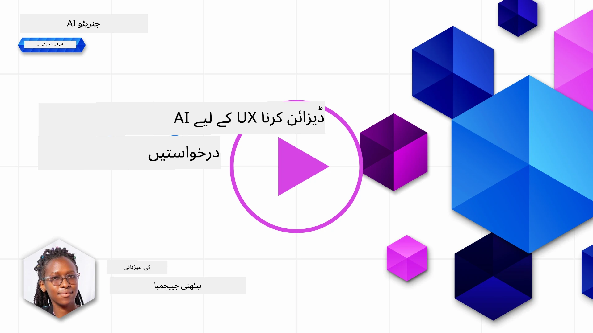
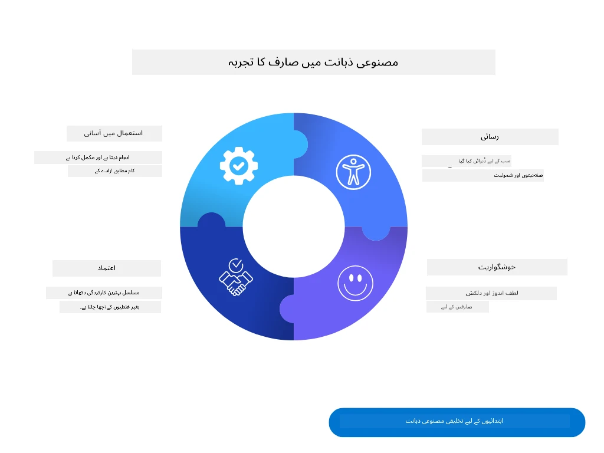
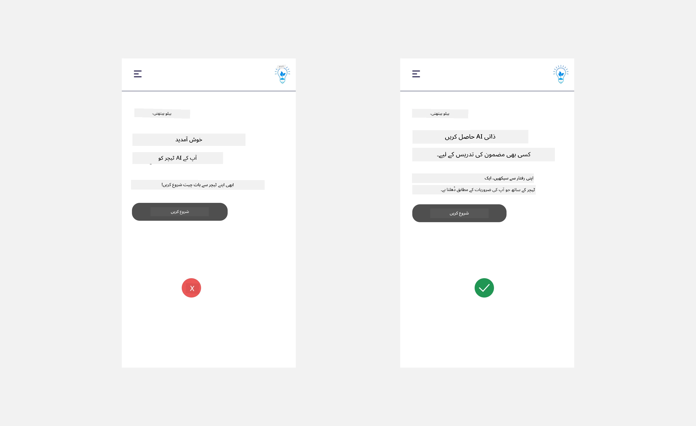
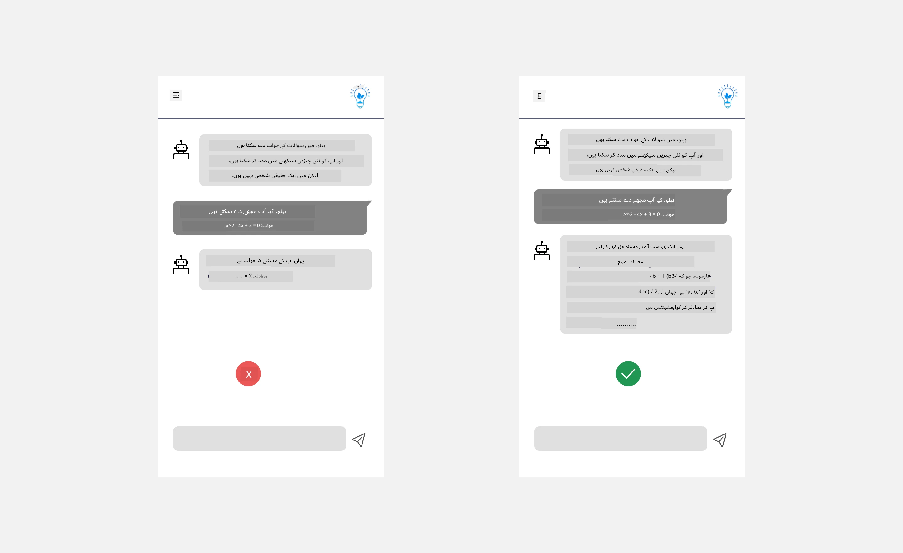
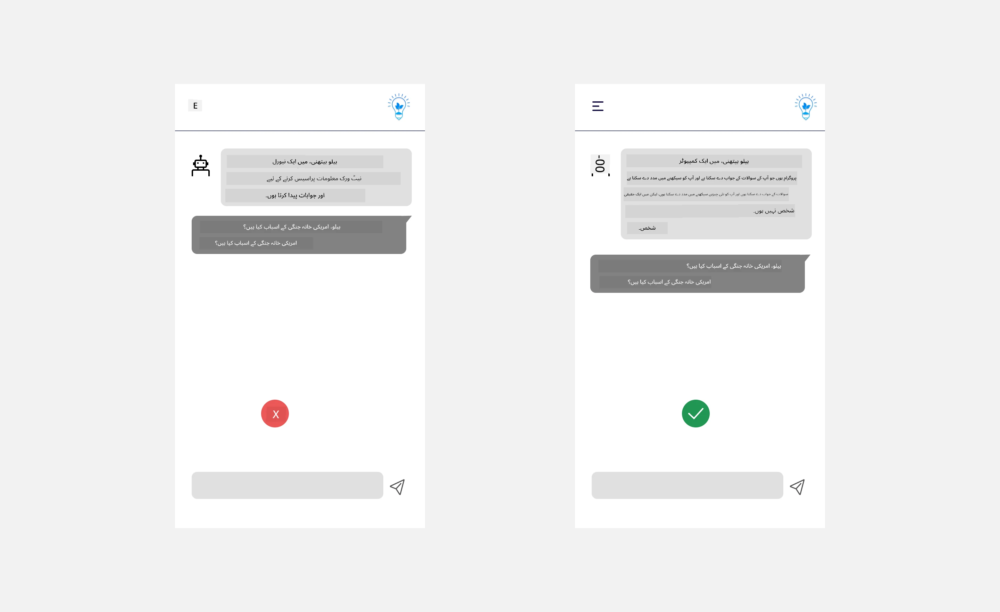
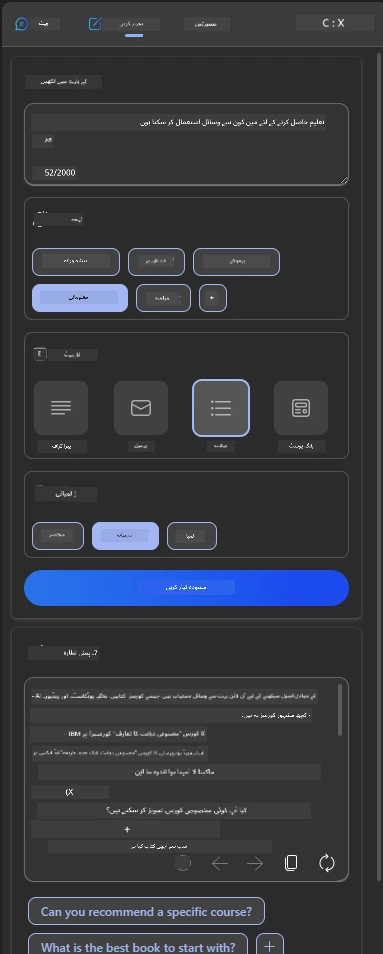
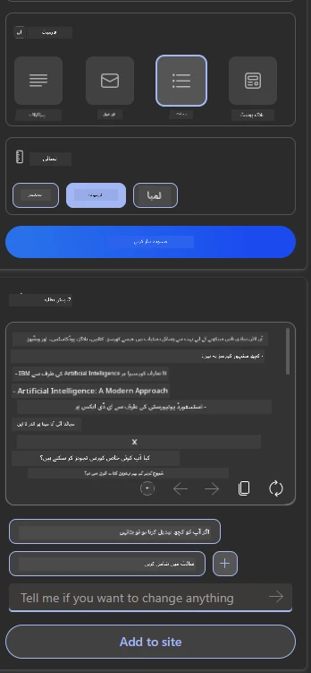
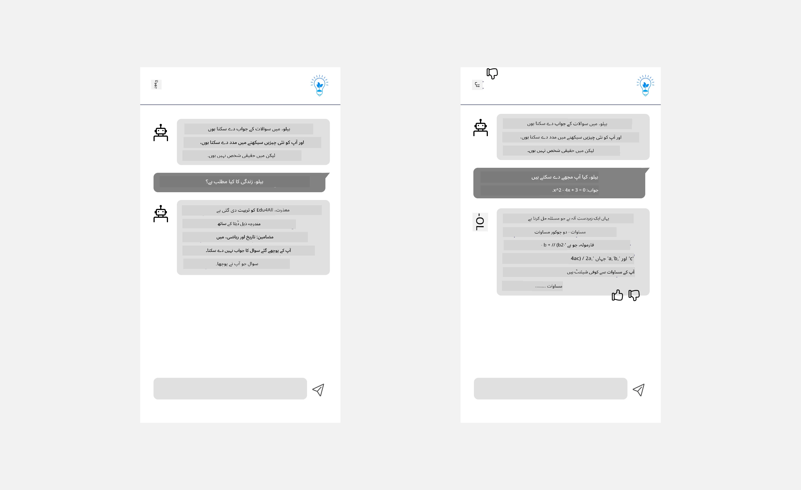

# AI ایپلیکیشنز کے لیے UX ڈیزائن کرنا

> _ (ویڈیو دیکھنے کے لیے اوپر تصویر پر کلک کریں)_

یوزر ایکسپیریئنس ایپس بنانے کا ایک بہت اہم پہلو ہے۔ صارفین کو آپ کی ایپ کو مؤثر طریقے سے استعمال کرتے ہوئے کام انجام دینا چاہیے۔ مؤثر ہونا ایک بات ہے لیکن آپ کو ایسی ایپس بھی ڈیزائن کرنی ہوں گی جو ہر کسی کے لیے قابل رسائی ہوں تاکہ وہ _accessible_ ہوں۔ یہ باب اسی موضوع پر توجہ دے گا تاکہ آپ آخرکار ایسی ایپ ڈیزائن کریں جو لوگ استعمال کر سکیں اور کرنا چاہیں۔

## تعارف

یوزر ایکسپیریئنس کا مطلب ہے کسی مخصوص پروڈکٹ یا سروس کے ساتھ صارف کی بات چیت اور استعمال، چاہے وہ سسٹم ہو، ٹول ہو، یا ڈیزائن ہو۔ AI ایپلیکیشنز تیار کرتے وقت، ڈویلپرز نہ صرف اس بات پر توجہ دیتے ہیں کہ یوزر ایکسپیریئنس مؤثر ہو بلکہ اخلاقی بھی ہو۔ اس سبق میں ہم ایسے AI ایپلیکیشنز بنانے کا احاطہ کرتے ہیں جو صارف کی ضروریات کو پورا کریں۔

یہ سبق درج ذیل موضوعات پر روشنی ڈالے گا:

- یوزر ایکسپیریئنس اور صارف کی ضروریات کا تعارف
- AI ایپلیکیشنز کو اعتماد اور شفافیت کے لیے ڈیزائن کرنا
- AI ایپلیکیشنز کو تعاون اور فیڈبیک کے لیے ڈیزائن کرنا

## سیکھنے کے مقاصد

اس سبق کے بعد آپ اہل ہوں گے کہ:

- ایسی AI ایپلیکیشنز بنائیں جو صارف کی ضروریات کو پورا کریں۔
- AI ایپلیکیشنز ڈیزائن کریں جو اعتماد اور تعاون کو فروغ دیں۔

### پیشگی معلومات

کچھ وقت نکالیں اور [یوزر ایکسپیریئنس اور ڈیزائن تھنکنگ](https://learn.microsoft.com/training/modules/ux-design?WT.mc_id=academic-105485-koreyst) کے بارے میں مزید پڑھیں۔

## یوزر ایکسپیریئنس اور صارف کی ضروریات کا تعارف

ہماری فرضی تعلیمی اسٹارٹ اپ میں، ہمارے دو بنیادی صارفین ہیں، اساتذہ اور طلباء۔ ہر صارف کی منفرد ضروریات ہیں۔ صارف مرکز ڈیزائن صارف کو ترجیح دیتا ہے تاکہ مصنوعات متعلقہ اور فائدہ مند ہوں جن کے لیے وہ بنائی گئی ہیں۔

ایپلیکیشن کو **مفید، قابل اعتماد، قابل رسائی اور خوشگوار** ہونا چاہیے تاکہ اچھا یوزر ایکسپیریئنس فراہم کیا جا سکے۔

### استعمال کی سہولت

مفید ہونے کا مطلب ہے کہ ایپلیکیشن کی فعالیت اس کے مقصد سے میل کھاتی ہو، جیسے گریڈنگ کے عمل کو خودکار بنانا یا نظر ثانی کے لیے فلیش کارڈز تیار کرنا۔ گریڈنگ کے عمل کو خودکار بنانے والی ایپلیکیشن کو طلباء کے کام کو درست اور مؤثر طریقے سے پہلے سے طے شدہ معیارات کے مطابق اسکور کرنا چاہیے۔ اسی طرح، نظر ثانی کے فلیش کارڈز بنانے والی ایپلیکیشن کو متعلقہ اور مختلف سوالات اس کے ڈیٹا کی بنیاد پر تیار کرنی چاہیے۔

### قابل اعتماد ہونا

قابل اعتماد ہونا اس بات کا مطلب ہے کہ ایپلیکیشن مستقل اور بغیر غلطیوں کے اپنا کام انجام دے سکے۔ تاہم، AI انسانوں کی طرح کامل نہیں ہے اور غلطیوں کا خطرہ رکھتا ہے۔ ایپلیکیشنز کو ایسی غلطیوں یا غیر متوقع حالات کا سامنا ہو سکتا ہے جن کے لیے انسانی مداخلت یا تصحیح کی ضرورت ہو۔ آپ غلطیوں کو کیسے سنبھالتے ہیں؟ اس سبق کے آخری حصے میں، ہم دیکھیں گے کہ AI سسٹمز اور ایپلیکیشنز کو تعاون اور فیڈبیک کے لیے کیسے ڈیزائن کیا جاتا ہے۔

### قابل رسائی ہونا

قابل رسائی ہونے کا مطلب ہے کہ یوزر ایکسپیریئنس کو مختلف صلاحیتوں والے صارفین تک بڑھانا، بشمول ایسے افراد جنہیں معذوریاں ہوں، تاکہ کوئی باہر نہ رہ جائے۔ قابل رسائی رہنما اصول اور اصولوں کی پیروی کرکے، AI حل مزید شمولیتی، قابل استعمال اور تمام صارفین کے لیے فائدہ مند بن جاتے ہیں۔

### خوشگوار ہونا

خوشگوار ہونے کا مطلب ہے کہ ایپلیکیشن کا استعمال خوشگوار ہو۔ کشش یوزر ایکسپیریئنس صارف کے لیے مثبت اثر ڈال سکتی ہے، انہیں ایپلیکیشن پر واپس آنے کی ترغیب دیتی ہے اور کاروباری آمدنی بڑھاتی ہے۔

ہر مسئلہ AI سے حل نہیں ہو سکتا۔ AI یوزر ایکسپیریئنس کو بڑھاتا ہے، چاہے وہ دستی کاموں کو خودکار بنانا ہو، یا صارف کے تجربات کو شخصی بنانا۔

## اعتماد اور شفافیت کے لیے AI ایپلیکیشنز ڈیزائن کرنا

AI ایپلیکیشنز ڈیزائن کرتے وقت اعتماد قائم کرنا بہت ضروری ہے۔ اعتماد اس بات کو یقینی بناتا ہے کہ صارف کو یقین ہو کہ ایپ کام مکمل کرے گی، مسلسل نتائج دے گی اور نتائج وہی ہوں گے جو صارف چاہتا ہے۔ اس علاقے میں خطرہ بداعتمادی اور ضرورت سے زیادہ اعتماد ہے۔ بداعتمادی اس وقت ہوتی ہے جب صارف کو AI سسٹم پر تھوڑا یا کوئی اعتماد نہ ہو، جس کی وجہ سے صارف آپ کی ایپلیکیشن کو رد کر دیتا ہے۔ ضرورت سے زیادہ اعتماد اس وقت ہوتا ہے جب صارف AI سسٹم کی صلاحیتوں کا اندازہ زیادہ لگا لیتا ہے، جس سے صارف بہت زیادہ اعتماد کر لیتا ہے۔ مثال کے طور پر، ضرورت سے زیادہ اعتماد کی صورت میں خودکار گریڈنگ سسٹم اساتذہ کو کچھ پرچوں کو چیک کرنے سے روک سکتا ہے تاکہ یقین ہو کہ گریڈنگ سسٹم درست کام کر رہا ہے۔ اس کا نتیجہ طلباء کے لیے غیر منصفانہ یا غیر درست گریڈز یا فیڈبیک اور بہتری کے مواقع کے ضیاع کی صورت میں نکل سکتا ہے۔

اعتماد کو ڈیزائن کے مرکز میں رکھنے کے دو طریقے وضاحت پسندی اور کنٹرول ہیں۔

### وضاحت پسندی

جب AI فیصلوں میں مدد دیتا ہے جیسے آئندہ نسلوں کو علم دینا، تو یہ ضروری ہے کہ اساتذہ اور والدین سمجھ سکیں کہ AI فیصلے کیسے کیے جاتے ہیں۔ یہ وضاحت پسندی ہے - یہ سمجھنا کہ AI ایپلیکیشنز کیسے فیصلے کرتی ہیں۔ وضاحت پسندی کے لیے ڈیزائن میں وہ تفصیلات شامل ہوتی ہیں جو بتاتی ہیں کہ AI نے نتیجہ کیسے حاصل کیا۔ ناظرین کو معلوم ہونا چاہیے کہ نتیجہ AI نے پیدا کیا ہے نہ کہ انسان نے۔ مثال کے طور پر، "ابھی اپنے ٹیوٹر کے ساتھ بات چیت شروع کریں" کہنے کے بجائے کہیں "AI ٹیوٹر استعمال کریں جو آپ کی ضروریات کے مطابق ہوتا ہے اور آپ کی رفتار سے سیکھنے میں مدد دیتا ہے۔"

ایک اور مثال یہ ہے کہ AI صارف اور ذاتی ڈیٹا کو کیسے استعمال کرتا ہے۔ مثال کے طور پر، طلباء کے شخصی پہلو کی بنیاد پر AI کچھ سوالات کے جواب ظاہر نہیں کر سکتا لیکن صارف کو اس بات پر سوچنے کی رہنمائی کر سکتا ہے کہ وہ مسئلہ کیسے حل کر سکتا ہے۔

وضاحت پسندی کا آخری اہم پہلو وضاحتوں کو آسان بنانا ہے۔ طلباء اور اساتذہ AI ماہرین نہیں ہو سکتے، اس لیے یہ سمجھانا کہ ایپ کیا کر سکتی ہے یا نہیں کر سکتی، سادہ اور سمجھنے میں آسان ہونا چاہیے۔

### کنٹرول

جنریٹیو AI AI اور صارف کے درمیان تعاون پیدا کرتا ہے، جہاں صارف مختلف نتائج کے لیے پرامپٹس تبدیل کر سکتا ہے۔ مزید برآں، ایک بار نتیجہ پیدا ہونے کے بعد، صارفین نتائج میں تبدیلی کر سکیں تاکہ انہیں کنٹرول کا احساس ہو۔ مثلاً، Microsoft Copilot (سابقہ Bing Chat) استعمال کرتے ہوئے، آپ اپنی پرامپٹ کو فارمیٹ، لہجہ اور لمبائی کی بنیاد پر تشکیل دے سکتے ہیں۔ اس کے علاوہ، آپ اپنے آؤٹ پٹ میں تبدیلیاں بھی شامل کر سکتے ہیں جیسا کہ نیچے دکھایا گیا ہے:

Microsoft Copilot کی ایک اور خصوصیت جو صارف کو ایپلیکیشن کے اوپر کنٹرول دیتی ہے وہ ڈیٹا کے استعمال میں شمولیت یا انکار کرنے کی صلاحیت ہے۔ سکول کی ایپلیکیشن کے لیے، طالب علم اپنے نوٹس کے ساتھ اساتذہ کے وسائل کو بھی نظر ثانی کے مواد کے طور پر استعمال کرنا چاہ سکتا ہے۔

> AI ایپلیکیشنز ڈیزائن کرتے وقت، ارادے کا ہونا کلیدی حیثیت رکھتا ہے تاکہ صارفین AI کی صلاحیتوں کے حوالے سے غیر حقیقی توقعات نہ لگائیں اور ضرورت سے زیادہ اعتماد نہ کریں۔ ایسا کرنے کا ایک طریقہ پرامپٹس اور نتائج کے درمیان رکاوٹ پیدا کرنا ہے تاکہ صارف کو یاد دلایا جا سکے کہ یہ AI ہے، کوئی انسان نہیں۔

## تعاون اور فیڈبیک کے لیے AI ایپلیکیشنز ڈیزائن کرنا

جیسا کہ پہلے بتایا گیا، جنریٹیو AI صارف اور AI کے درمیان تعاون پیدا کرتا ہے۔ زیادہ تر تعاملات صارف کی طرف سے پرامپٹ داخل کرنے اور AI کی طرف سے نتیجہ پیدا کرنے پر مبنی ہوتے ہیں۔ اگر نتیجہ غلط ہو تو کیا ہوگا؟ ایپلیکیشن غلطیوں کو کس طرح سنبھالتی ہے؟ کیا AI صارف کو مورد الزام ٹھہراتا ہے یا غلطی کی وضاحت میں وقت دیتا ہے؟

AI ایپلیکیشنز کو فیڈبیک وصول کرنے اور دینے کے لیے بنایا جانا چاہیے۔ یہ نہ صرف AI سسٹم کو بہتر بنانے میں مدد دیتا ہے بلکہ صارفین کے ساتھ اعتماد بھی پیدا کرتا ہے۔ ڈیزائن میں فیڈبیک لوپ شامل ہونا چاہیے، ایک مثال آؤٹ پٹ پر سادہ تھمب اپ یا تھمب ڈاؤن ہو سکتی ہے۔

ایک اور طریقہ یہ ہے کہ سسٹم کی صلاحیتوں اور محدودیتوں کو واضح طور پر بیان کیا جائے۔ جب صارف AI کی صلاحیتوں سے باہر کچھ درخواست کرتا ہے، تو اس کا بھی سنبھالنے کا طریقہ ہونا چاہیے، جیسا کہ نیچے دکھایا گیا ہے۔

سسٹم کی غلطیاں عام ہیں خاص طور پر ایپلیکیشنز میں جہاں صارف کو AI کے دائرہ کار سے باہر معلومات کی ضرورت ہو یا ایپلیکیشن پر کوئی حد ہو کہ ایک صارف کتنے سوالات/موضوعات کے خلاصے بنا سکتا ہے۔ مثال کے طور پر، ایک AI ایپلیکیشن جو محدود موضوعات جیسے تاریخ اور ریاضی کے ڈیٹا پر تربیت دی گئی ہو، جغرافیہ سے متعلق سوالات کا جواب دینے سے قاصر ہو سکتی ہے۔ اس کا حل یہ ہو سکتا ہے کہ AI سسٹم جواب دے جائے: "معذرت، ہمارا پروڈکٹ درج ذیل موضوعات پر ڈیٹا کے ساتھ تربیت یافتہ ہے۔۔۔، میں آپ کے سوال کا جواب نہیں دے سکتا۔"

AI ایپلیکیشنز مکمل نہیں ہیں، اس لیے وہ غلطیاں کریں گے۔ اپنی ایپلیکیشنز ڈیزائن کرتے وقت یقینی بنائیں کہ آپ صارفین سے فیڈبیک وصول کرنے اور غلطیوں کو سنبھالنے کے لیے ایک ایسا نظام بنائیں جو سادہ اور سمجھنے میں آسان ہو۔

## اسائنمنٹ

جو بھی AI ایپس آپ نے اب تک بنائی ہیں، ان میں ذیل کے اقدامات پر غور کریں اور انہیں اپنے ایپ میں نافذ کریں:

- **خوشگوار:** غور کریں کہ آپ اپنی ایپ کو مزید خوشگوار کیسے بنا سکتے ہیں۔ کیا آپ ہر جگہ وضاحتیں دے رہے ہیں؟ کیا آپ صارف کو تلاش کرنے کی ترغیب دے رہے ہیں؟ آپ اپنی غلطی کے پیغامات کس طرح لکھ رہے ہیں؟

- **استعمال کی سہولت:** ویب ایپ بنا رہے ہیں۔ یقینی بنائیں کہ آپ کی ایپ ماؤس اور کی بورڈ دونوں سے قابلِ نیویگیشن ہو۔

- **اعتماد اور شفافیت:** AI اور اس کے آؤٹ پٹ پر مکمل اعتماد نہ کریں، غور کریں کہ آپ کیسا انسان کو اس عمل میں شامل کریں گے تاکہ آؤٹ پٹ کی تصدیق ہو۔ نیز، اعتماد اور شفافیت حاصل کرنے کے دیگر طریقے بھی غور و عمل کریں۔

- **کنٹرول:** صارف کو یہ اختیار دیں کہ وہ ایپلیکیشن کو کون سا ڈیٹا فراہم کرتا ہے۔ AI ایپلیکیشن میں ڈیٹا اکٹھا کرنے کے لیے صارف کو شمولیت یا انکار کرنے کا طریقہ نافذ کریں۔

<!-- ## [لیکچر کے بعد کا کوئز](../../../12-designing-ux-for-ai-applications/quiz-url) -->

## اپنی تعلیم جاری رکھیں!

اس سبق کو مکمل کرنے کے بعد، ہماری [Generative AI Learning collection](https://aka.ms/genai-collection?WT.mc_id=academic-105485-koreyst) دیکھیں تاکہ اپنی Generative AI کی معلومات کو مزید بڑھا سکیں!

سبق ۱۳ کی طرف جائیں، جہاں ہم [AI ایپلیکیشنز کو محفوظ بنانے](../13-securing-ai-applications/README.md?WT.mc_id=academic-105485-koreyst) کے بارے میں جانیں گے!

---

<!-- CO-OP TRANSLATOR DISCLAIMER START -->
**ڈس کلیمر**:
یہ دستاویز AI ترجمہ سروس [Co-op Translator](https://github.com/Azure/co-op-translator) کے ذریعے ترجمہ کی گئی ہے۔ جبکہ ہم درستگی کے لیے کوشاں ہیں، براہ کرم اس بات سے آگاہ رہیں کہ خودکار ترجمے میں غلطیاں یا عدم درستیاں ہو سکتی ہیں۔ اصل دستاویز اپنے مادری زبان میں مستند ماخذ سمجھی جائے گی۔ حساس معلومات کے لیے پیشہ ور انسانی ترجمہ کی سفارش کی جاتی ہے۔ اس ترجمے کے استعمال سے پیدا ہونے والی کسی بھی غلط فہمی یا غلط تشریح کی ذمہ داری ہم قبول نہیں کرتے۔
<!-- CO-OP TRANSLATOR DISCLAIMER END -->