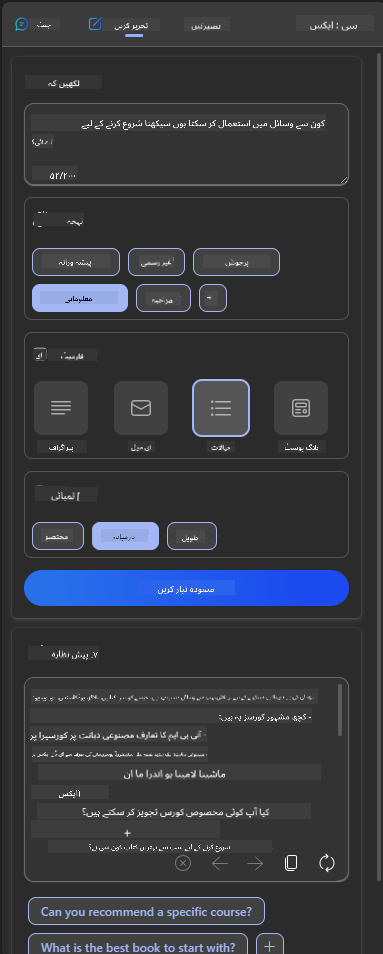

<!--
CO_OP_TRANSLATOR_METADATA:
{
  "original_hash": "747668e4c53d067369f06e9ec2e6313e",
  "translation_date": "2025-08-26T14:29:27+00:00",
  "source_file": "12-designing-ux-for-ai-applications/README.md",
  "language_code": "ur"
}
-->
# اے آئی ایپلیکیشنز کے لیے یوزر ایکسپیرینس ڈیزائن کرنا

> _(اوپر دی گئی تصویر پر کلک کریں اور اس سبق کی ویڈیو دیکھیں)_

یوزر ایکسپیرینس ایپ بنانے میں بہت اہم کردار ادا کرتا ہے۔ صارفین کو آپ کی ایپ کو مؤثر طریقے سے استعمال کرنے کے قابل ہونا چاہیے تاکہ وہ اپنے کام انجام دے سکیں۔ مؤثر ہونا ایک بات ہے، لیکن آپ کو ایپ اس طرح بھی ڈیزائن کرنی چاہیے کہ ہر کوئی اسے استعمال کر سکے، یعنی اسے _آسان رسائی_ والی بنائیں۔ اس باب میں اسی پہلو پر توجہ دی جائے گی تاکہ آپ ایسی ایپ ڈیزائن کریں جسے لوگ استعمال کرنا چاہیں اور کر سکیں۔

## تعارف

یوزر ایکسپیرینس اس بات کو ظاہر کرتا ہے کہ صارف کسی پروڈکٹ یا سروس کے ساتھ کیسے تعامل کرتا ہے، چاہے وہ کوئی سسٹم ہو، ٹول ہو یا ڈیزائن۔ جب اے آئی ایپلیکیشنز تیار کی جاتی ہیں تو ڈیولپرز صرف مؤثر یوزر ایکسپیرینس پر ہی نہیں بلکہ اخلاقیات پر بھی توجہ دیتے ہیں۔ اس سبق میں ہم یہ سیکھیں گے کہ کس طرح ایسی مصنوعی ذہانت (AI) ایپلیکیشنز بنائی جائیں جو صارفین کی ضروریات کو پورا کریں۔

اس سبق میں درج ذیل موضوعات شامل ہیں:

- یوزر ایکسپیرینس کا تعارف اور صارف کی ضروریات کو سمجھنا
- اعتماد اور شفافیت کے لیے اے آئی ایپلیکیشنز ڈیزائن کرنا
- تعاون اور فیڈبیک کے لیے اے آئی ایپلیکیشنز ڈیزائن کرنا

## سیکھنے کے مقاصد

اس سبق کے بعد آپ یہ کر سکیں گے:

- سمجھ سکیں گے کہ کس طرح اے آئی ایپلیکیشنز صارف کی ضروریات کو پورا کرتی ہیں۔
- ایسی اے آئی ایپلیکیشنز ڈیزائن کر سکیں گے جو اعتماد اور تعاون کو فروغ دیں۔

### پیشگی علم

کچھ وقت نکالیں اور [یوزر ایکسپیرینس اور ڈیزائن تھنکنگ](https://learn.microsoft.com/training/modules/ux-design?WT.mc_id=academic-105485-koreyst) کے بارے میں مزید پڑھیں۔

## یوزر ایکسپیرینس کا تعارف اور صارف کی ضروریات کو سمجھنا

ہماری فرضی تعلیمی اسٹارٹ اپ میں دو بنیادی صارفین ہیں: اساتذہ اور طلبہ۔ دونوں کی الگ الگ ضروریات ہیں۔ یوزر سینٹرڈ ڈیزائن میں صارف کو ترجیح دی جاتی ہے تاکہ پروڈکٹس ان کے لیے فائدہ مند اور متعلقہ ہوں۔

ایپلیکیشن کو **مفید، قابل اعتماد، قابل رسائی اور خوشگوار** ہونا چاہیے تاکہ اچھا یوزر ایکسپیرینس فراہم کیا جا سکے۔

### قابل استعمال ہونا

مفید ہونے کا مطلب ہے کہ ایپلیکیشن میں وہ فیچرز ہوں جو اس کے مقصد کے مطابق ہوں، جیسے گریڈنگ کے عمل کو خودکار بنانا یا ریویژن کے لیے فلیش کارڈز تیار کرنا۔ اگر ایپلیکیشن گریڈنگ کو خودکار بناتی ہے تو اسے طلبہ کے کام کو پہلے سے طے شدہ معیار کے مطابق درست اور مؤثر طریقے سے اسکور دینا چاہیے۔ اسی طرح، اگر ایپلیکیشن ریویژن فلیش کارڈز تیار کرتی ہے تو اسے ڈیٹا کی بنیاد پر متعلقہ اور متنوع سوالات بنانے چاہئیں۔

### قابل اعتماد ہونا

قابل اعتماد ہونے کا مطلب ہے کہ ایپلیکیشن مسلسل اور بغیر غلطی کے اپنا کام انجام دے سکے۔ تاہم، اے آئی بھی انسانوں کی طرح مکمل نہیں ہے اور اس میں غلطی کا امکان رہتا ہے۔ ایپلیکیشنز میں غلطیاں یا غیر متوقع صورتحال پیش آ سکتی ہیں جن میں انسانی مداخلت یا درستگی کی ضرورت ہو۔ آپ غلطیوں کو کیسے سنبھالتے ہیں؟ اس سبق کے آخری حصے میں ہم یہ سیکھیں گے کہ اے آئی سسٹمز اور ایپلیکیشنز کو تعاون اور فیڈبیک کے لیے کیسے ڈیزائن کیا جاتا ہے۔

### قابل رسائی ہونا

قابل رسائی ہونے کا مطلب ہے کہ یوزر ایکسپیرینس کو مختلف صلاحیتوں والے صارفین تک بڑھایا جائے، جن میں معذور افراد بھی شامل ہیں، تاکہ کوئی بھی محروم نہ رہے۔ اگر آپ رسائی کے اصولوں اور رہنما خطوط پر عمل کریں تو اے آئی حل سب کے لیے زیادہ جامع، قابل استعمال اور فائدہ مند بن جاتے ہیں۔

### خوشگوار ہونا

خوشگوار ہونے کا مطلب ہے کہ ایپلیکیشن استعمال کرنے میں لطف دے۔ دلکش یوزر ایکسپیرینس صارف پر مثبت اثر ڈال سکتا ہے، انہیں ایپلیکیشن پر واپس آنے کی ترغیب دے سکتا ہے اور کاروباری آمدنی میں اضافہ کر سکتا ہے۔

ہر مسئلہ کا حل اے آئی سے نہیں نکلتا۔ اے آئی آپ کے یوزر ایکسپیرینس کو بہتر بنانے کے لیے آتا ہے، چاہے وہ دستی کاموں کو خودکار بنانا ہو یا یوزر ایکسپیرینس کو ذاتی بنانا ہو۔

## اعتماد اور شفافیت کے لیے اے آئی ایپلیکیشنز ڈیزائن کرنا

اے آئی ایپلیکیشنز ڈیزائن کرتے وقت اعتماد پیدا کرنا بہت اہم ہے۔ اعتماد اس بات کو یقینی بناتا ہے کہ صارف کو یقین ہو کہ ایپلیکیشن کام کرے گی، مسلسل نتائج دے گی اور وہ نتائج صارف کی ضرورت کے مطابق ہوں گے۔ اس شعبے میں ایک خطرہ بے اعتمادی اور حد سے زیادہ اعتماد ہے۔ بے اعتمادی اس وقت ہوتی ہے جب صارف کو اے آئی سسٹم پر کم یا بالکل اعتماد نہ ہو، جس سے وہ آپ کی ایپلیکیشن کو رد کر دیتا ہے۔ حد سے زیادہ اعتماد اس وقت ہوتا ہے جب صارف اے آئی سسٹم کی صلاحیت کو بڑھا چڑھا کر سمجھتا ہے، جس سے وہ اس پر ضرورت سے زیادہ بھروسہ کرتا ہے۔ مثال کے طور پر، اگر گریڈنگ سسٹم پر حد سے زیادہ اعتماد ہو تو استاد کچھ پیپرز کو چیک نہ کرے اور صرف سسٹم پر بھروسہ کرے، جس سے طلبہ کے لیے غیر منصفانہ یا غلط گریڈز آ سکتے ہیں یا فیڈبیک اور بہتری کے مواقع ضائع ہو سکتے ہیں۔

اعتماد کو ڈیزائن کے مرکز میں رکھنے کے دو طریقے ہیں: وضاحت پذیری اور کنٹرول۔

### وضاحت پذیری

جب اے آئی فیصلے کرنے میں مدد دیتی ہے، جیسے مستقبل کی نسلوں کو علم دینا، تو اساتذہ اور والدین کے لیے یہ سمجھنا ضروری ہے کہ اے آئی کے فیصلے کیسے کیے جاتے ہیں۔ یہی وضاحت پذیری ہے - یہ سمجھنا کہ اے آئی ایپلیکیشنز کیسے فیصلے کرتی ہیں۔ وضاحت پذیری کے لیے ڈیزائن میں یہ شامل ہے کہ کیسے اے آئی نے نتیجہ نکالا، اس کی تفصیل دی جائے۔ صارفین کو معلوم ہونا چاہیے کہ نتیجہ اے آئی نے تیار کیا ہے، انسان نے نہیں۔ مثال کے طور پر، "اب اپنے ٹیچر سے چیٹ کریں" کی بجائے کہیں "اے آئی ٹییوٹر استعمال کریں جو آپ کی ضروریات کے مطابق ڈھلتا ہے اور آپ کو اپنی رفتار سے سیکھنے میں مدد دیتا ہے۔"

ایک اور مثال یہ ہے کہ اے آئی صارف اور ذاتی ڈیٹا کیسے استعمال کرتی ہے۔ مثال کے طور پر، اگر صارف کی پرسونا "طالب علم" ہے تو اس کی کچھ حدود ہو سکتی ہیں۔ اے آئی سوالات کے جوابات ظاہر نہیں کر سکتی، لیکن صارف کو مسئلہ حل کرنے کے طریقے سوچنے میں رہنمائی کر سکتی ہے۔

وضاحت پذیری کا ایک اور اہم حصہ وضاحتوں کو آسان بنانا ہے۔ طلبہ اور اساتذہ اے آئی کے ماہر نہیں ہوتے، اس لیے ایپلیکیشن کیا کر سکتی ہے اور کیا نہیں، اس کی وضاحت آسان اور قابل فہم ہونی چاہیے۔

### کنٹرول

جنریٹو اے آئی صارف اور اے آئی کے درمیان تعاون پیدا کرتی ہے، جیسے صارف مختلف نتائج کے لیے پرامپٹس کو تبدیل کر سکتا ہے۔ اس کے علاوہ، جب نتیجہ تیار ہو جائے تو صارفین کو اسے تبدیل کرنے کی اجازت ہونی چاہیے تاکہ انہیں کنٹرول کا احساس ہو۔ مثال کے طور پر، Bing استعمال کرتے وقت آپ اپنے پرامپٹ کو فارمیٹ، انداز اور لمبائی کے مطابق ڈھال سکتے ہیں۔ اس کے علاوہ، آپ اپنے نتیجے میں تبدیلیاں کر سکتے ہیں اور اسے حسبِ ضرورت تبدیل کر سکتے ہیں، جیسا کہ نیچے دکھایا گیا ہے:

Bing میں ایک اور فیچر یہ ہے کہ صارف کو اس بات پر کنٹرول حاصل ہے کہ اے آئی کون سا ڈیٹا استعمال کرے۔ کسی اسکول ایپلیکیشن میں، طالب علم چاہے تو اپنی نوٹس اور اساتذہ کے وسائل کو ریویژن کے لیے استعمال کر سکتا ہے۔

> جب اے آئی ایپلیکیشنز ڈیزائن کریں تو ارادے کے ساتھ یہ یقینی بنائیں کہ صارفین حد سے زیادہ اعتماد نہ کریں اور اس کی صلاحیتوں کے بارے میں غیر حقیقی توقعات نہ رکھیں۔ اس کا ایک طریقہ یہ ہے کہ پرامپٹس اور نتائج کے درمیان کچھ رکاوٹ پیدا کریں۔ صارف کو یاد دلائیں کہ یہ اے آئی ہے، انسان نہیں۔

## تعاون اور فیڈبیک کے لیے اے آئی ایپلیکیشنز ڈیزائن کرنا

جیسا کہ پہلے ذکر کیا گیا، جنریٹو اے آئی صارف اور اے آئی کے درمیان تعاون پیدا کرتی ہے۔ زیادہ تر تعاملات میں صارف پرامپٹ دیتا ہے اور اے آئی نتیجہ تیار کرتی ہے۔ اگر نتیجہ غلط ہو تو کیا ہوگا؟ ایپلیکیشن غلطی کو کیسے سنبھالتی ہے؟ کیا اے آئی صارف کو الزام دیتی ہے یا غلطی کی وضاحت کرتی ہے؟

اے آئی ایپلیکیشنز کو اس طرح بنایا جانا چاہیے کہ وہ فیڈبیک لے اور دے سکیں۔ اس سے نہ صرف اے آئی سسٹم بہتر ہوتا ہے بلکہ صارفین کا اعتماد بھی بڑھتا ہے۔ ڈیزائن میں فیڈبیک لوپ شامل ہونا چاہیے، مثال کے طور پر نتیجے پر سادہ تھمز اپ یا ڈاؤن۔

ایک اور طریقہ یہ ہے کہ سسٹم کی صلاحیتوں اور حدود کو واضح طور پر بتایا جائے۔ جب صارف ایسی چیز مانگے جو اے آئی کی صلاحیت سے باہر ہو، تو اس کے لیے بھی کوئی حل ہونا چاہیے، جیسا کہ نیچے دکھایا گیا ہے۔

سسٹم کی غلطیاں ایپلیکیشنز میں عام ہیں، جہاں صارف کو ایسی معلومات میں مدد چاہیے جو اے آئی کے دائرہ کار سے باہر ہو یا ایپلیکیشن میں اس بات کی حد ہو کہ صارف کتنے سوالات/مضامین کے خلاصے بنا سکتا ہے۔ مثال کے طور پر، اگر اے آئی ایپلیکیشن صرف تاریخ اور ریاضی کے مضامین کے ڈیٹا سے تربیت یافتہ ہے تو وہ جغرافیہ کے سوالات نہیں سنبھال سکتی۔ اس صورت میں، اے آئی سسٹم اس طرح جواب دے سکتا ہے: "معذرت، ہمارا پروڈکٹ درج ذیل مضامین کے ڈیٹا سے تربیت یافتہ ہے.....، میں آپ کے سوال کا جواب نہیں دے سکتا۔"

اے آئی ایپلیکیشنز مکمل نہیں ہیں، اس لیے ان سے غلطی ہونا ممکن ہے۔ جب آپ اپنی ایپلیکیشنز ڈیزائن کریں تو اس میں صارفین سے فیڈبیک لینے اور غلطیوں کو آسان اور قابل وضاحت طریقے سے سنبھالنے کی گنجائش ضرور رکھیں۔

## اسائنمنٹ

اب تک جو بھی اے آئی ایپلیکیشنز آپ نے بنائی ہیں، ان میں درج ذیل اقدامات پر غور کریں:

- **خوشگوار:** سوچیں کہ آپ اپنی ایپ کو مزید خوشگوار کیسے بنا سکتے ہیں۔ کیا آپ ہر جگہ وضاحتیں دے رہے ہیں؟ کیا آپ صارف کو ایپ ایکسپلور کرنے کی ترغیب دے رہے ہیں؟ آپ اپنے ایرر میسجز کیسے لکھ رہے ہیں؟

- **قابل استعمال:** اگر ویب ایپ بنا رہے ہیں تو یقینی بنائیں کہ آپ کی ایپ ماؤس اور کی بورڈ دونوں سے نیویگیٹ کی جا سکتی ہے۔

- **اعتماد اور شفافیت:** اے آئی اور اس کے نتائج پر مکمل بھروسہ نہ کریں، سوچیں کہ آپ اس عمل میں انسان کو کیسے شامل کریں گے تاکہ نتیجے کی تصدیق ہو سکے۔ اس کے علاوہ اعتماد اور شفافیت حاصل کرنے کے دیگر طریقے بھی اپنائیں۔

- **کنٹرول:** صارف کو اس ڈیٹا پر کنٹرول دیں جو وہ ایپلیکیشن کو فراہم کرتا ہے۔ ایسا طریقہ بنائیں کہ صارف ڈیٹا کلیکشن میں شامل یا خارج ہو سکے۔

## اپنی تعلیم جاری رکھیں!

اس سبق کے بعد ہماری [جنریٹو اے آئی لرننگ کلیکشن](https://aka.ms/genai-collection?WT.mc_id=academic-105485-koreyst) دیکھیں اور اپنی جنریٹو اے آئی کی معلومات کو مزید بہتر بنائیں!

اب چلیں سبق 13 کی طرف، جہاں ہم دیکھیں گے کہ [اے آئی ایپلیکیشنز کو محفوظ کیسے بنائیں](../13-securing-ai-applications/README.md?WT.mc_id=academic-105485-koreyst)!

---

**اعلانِ دستبرداری**:  
یہ دستاویز AI ترجمہ سروس [Co-op Translator](https://github.com/Azure/co-op-translator) کے ذریعے ترجمہ کی گئی ہے۔ اگرچہ ہم درستگی کی بھرپور کوشش کرتے ہیں، براہ کرم آگاہ رہیں کہ خودکار ترجمے میں غلطیاں یا عدم درستگی ہو سکتی ہے۔ اصل دستاویز اپنی زبان میں مستند ماخذ سمجھی جائے۔ اہم معلومات کے لیے پیشہ ور انسانی ترجمہ کی سفارش کی جاتی ہے۔ اس ترجمے کے استعمال سے پیدا ہونے والی کسی بھی غلط فہمی یا غلط تشریح کی ذمہ داری ہماری نہیں ہوگی۔