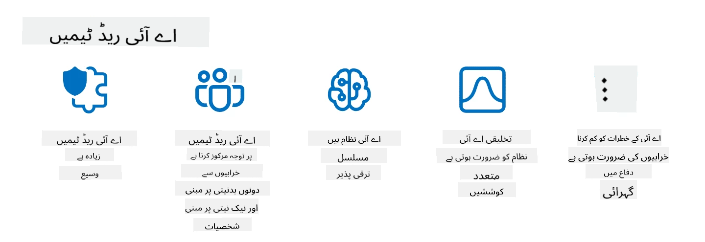

<!--
CO_OP_TRANSLATOR_METADATA:
{
  "original_hash": "a2faf8ee7a0b851efa647a19788f1e5b",
  "translation_date": "2025-10-17T13:12:00+00:00",
  "source_file": "13-securing-ai-applications/README.md",
  "language_code": "ur"
}
-->
# آپ کی جنریٹو AI ایپلیکیشنز کو محفوظ بنانا

## تعارف

اس سبق میں شامل ہوگا:

- AI سسٹمز کے تناظر میں سیکیورٹی۔
- AI سسٹمز کو لاحق عام خطرات اور دھمکیاں۔
- AI سسٹمز کو محفوظ بنانے کے طریقے اور غور و فکر۔

## سیکھنے کے مقاصد

اس سبق کو مکمل کرنے کے بعد، آپ کو سمجھ ہوگی:

- AI سسٹمز کو لاحق خطرات اور دھمکیاں۔
- AI سسٹمز کو محفوظ بنانے کے عام طریقے اور عمل۔
- کس طرح سیکیورٹی ٹیسٹنگ کے نفاذ سے غیر متوقع نتائج اور صارف کے اعتماد کی کمی کو روکا جا سکتا ہے۔

## جنریٹو AI کے تناظر میں سیکیورٹی کا مطلب کیا ہے؟

جیسے جیسے مصنوعی ذہانت (AI) اور مشین لرننگ (ML) ٹیکنالوجیز ہماری زندگیوں کو تشکیل دے رہی ہیں، یہ ضروری ہے کہ نہ صرف صارف کے ڈیٹا بلکہ خود AI سسٹمز کی بھی حفاظت کی جائے۔ AI/ML کا استعمال انڈسٹریز میں اعلیٰ قدر کے فیصلے کرنے کے عمل میں بڑھ رہا ہے، جہاں غلط فیصلہ سنگین نتائج کا باعث بن سکتا ہے۔

یہاں کچھ اہم نکات ہیں جن پر غور کرنا چاہیے:

- **AI/ML کا اثر**: AI/ML کا روزمرہ زندگی پر گہرا اثر ہے، اور اس کی حفاظت کرنا ضروری ہو گیا ہے۔
- **سیکیورٹی چیلنجز**: AI/ML کے اثرات کو مناسب توجہ کی ضرورت ہے تاکہ AI پر مبنی مصنوعات کو پیچیدہ حملوں سے بچایا جا سکے، چاہے وہ ٹرولز ہوں یا منظم گروپس۔
- **اسٹریٹجک مسائل**: ٹیک انڈسٹری کو طویل مدتی صارف کی حفاظت اور ڈیٹا سیکیورٹی کو یقینی بنانے کے لیے اسٹریٹجک چیلنجز کو فعال طور پر حل کرنا ہوگا۔

مزید برآں، مشین لرننگ ماڈلز عام طور پر بدنیتی پر مبنی ان پٹ اور بے ضرر غیر معمولی ڈیٹا کے درمیان فرق کرنے سے قاصر ہوتے ہیں۔ تربیتی ڈیٹا کا ایک بڑا ذریعہ غیر منظم، غیر معتدل، عوامی ڈیٹاسیٹس سے حاصل ہوتا ہے، جو تیسرے فریق کے تعاون کے لیے کھلے ہوتے ہیں۔ حملہ آوروں کو ڈیٹاسیٹس کو نقصان پہنچانے کی ضرورت نہیں ہوتی جب وہ ان میں آزادانہ طور پر تعاون کر سکتے ہیں۔ وقت کے ساتھ، کم اعتماد والا بدنیتی پر مبنی ڈیٹا، اگر ڈیٹا کی ساخت/فارمیٹنگ درست رہے، تو اعلیٰ اعتماد والے قابل اعتماد ڈیٹا میں تبدیل ہو جاتا ہے۔

اسی لیے یہ ضروری ہے کہ آپ کے ماڈلز کے فیصلے کرنے کے لیے استعمال ہونے والے ڈیٹا اسٹورز کی سالمیت اور حفاظت کو یقینی بنایا جائے۔

## AI کے خطرات اور خطرات کو سمجھنا

AI اور متعلقہ سسٹمز کے لحاظ سے، ڈیٹا پوائزننگ آج سب سے اہم سیکیورٹی خطرہ ہے۔ ڈیٹا پوائزننگ وہ عمل ہے جب کوئی شخص جان بوجھ کر AI کو تربیت دینے کے لیے استعمال ہونے والی معلومات کو تبدیل کرتا ہے، جس کی وجہ سے یہ غلطیاں کرتا ہے۔ یہ معیاری ڈیٹیکشن اور تخفیف کے طریقوں کی عدم موجودگی، اور تربیت کے لیے غیر معتبر یا غیر منظم عوامی ڈیٹاسیٹس پر انحصار کی وجہ سے ہوتا ہے۔ ڈیٹا کی سالمیت کو برقرار رکھنے اور خراب تربیتی عمل کو روکنے کے لیے، آپ کے ڈیٹا کی اصل اور نسب کو ٹریک کرنا ضروری ہے۔ بصورت دیگر، پرانی کہاوت "کچرا اندر، کچرا باہر" درست ثابت ہوتی ہے، جس کے نتیجے میں ماڈل کی کارکردگی متاثر ہوتی ہے۔

یہاں کچھ مثالیں ہیں کہ ڈیٹا پوائزننگ آپ کے ماڈلز کو کیسے متاثر کر سکتی ہے:

1. **لیبل فلپنگ**: ایک بائنری کلاسیفکیشن ٹاسک میں، ایک مخالف جان بوجھ کر تربیتی ڈیٹا کے ایک چھوٹے حصے کے لیبلز کو پلٹ دیتا ہے۔ مثال کے طور پر، بے ضرر نمونوں کو بدنیتی پر مبنی کے طور پر لیبل کیا جاتا ہے، جس کی وجہ سے ماڈل غلط ایسوسی ایشنز سیکھتا ہے۔\
   **مثال**: ایک اسپام فلٹر جو جائز ای میلز کو اسپام کے طور پر غلط درجہ بندی کرتا ہے، لیبلز میں چھیڑ چھاڑ کی وجہ سے۔
2. **فیچر پوائزننگ**: ایک حملہ آور تربیتی ڈیٹا میں خصوصیات کو ہلکے سے تبدیل کرتا ہے تاکہ تعصب پیدا کیا جا سکے یا ماڈل کو گمراہ کیا جا سکے۔\
   **مثال**: پروڈکٹ کی تفصیلات میں غیر متعلقہ کلیدی الفاظ شامل کرنا تاکہ سفارشاتی نظام کو متاثر کیا جا سکے۔
3. **ڈیٹا انجیکشن**: تربیتی سیٹ میں بدنیتی پر مبنی ڈیٹا شامل کرنا تاکہ ماڈل کے رویے کو متاثر کیا جا سکے۔\
   **مثال**: جعلی صارف کے جائزے شامل کرنا تاکہ جذباتی تجزیہ کے نتائج کو متاثر کیا جا سکے۔
4. **بیک ڈور حملے**: ایک مخالف تربیتی ڈیٹا میں ایک چھپا ہوا پیٹرن (بیک ڈور) داخل کرتا ہے۔ ماڈل اس پیٹرن کو پہچاننا سیکھتا ہے اور جب متحرک ہوتا ہے تو بدنیتی پر مبنی طور پر برتاؤ کرتا ہے۔\
   **مثال**: ایک چہرے کی شناخت کا نظام جو بیک ڈورڈ تصاویر کے ساتھ تربیت یافتہ ہوتا ہے جو کسی مخصوص شخص کی غلط شناخت کرتا ہے۔

MITRE کارپوریشن نے [ATLAS (Adversarial Threat Landscape for Artificial-Intelligence Systems)](https://atlas.mitre.org/?WT.mc_id=academic-105485-koreyst) تخلیق کیا ہے، جو AI سسٹمز پر حقیقی دنیا کے حملوں میں مخالفین کے ذریعہ استعمال کیے جانے والے حربوں اور تکنیکوں کا ایک علمی ذخیرہ ہے۔

> AI سے چلنے والے سسٹمز میں کمزوریوں کی تعداد میں اضافہ ہو رہا ہے، کیونکہ AI کا انضمام موجودہ سسٹمز کے حملے کی سطح کو روایتی سائبر حملوں سے آگے بڑھاتا ہے۔ ہم نے ATLAS کو ان منفرد اور ارتقاء پذیر کمزوریوں کے بارے میں آگاہی بڑھانے کے لیے تیار کیا ہے، کیونکہ عالمی برادری مختلف سسٹمز میں AI کو شامل کر رہی ہے۔ ATLAS کو MITRE ATT&CK® فریم ورک کے بعد ماڈل بنایا گیا ہے اور اس کے حربے، تکنیکیں، اور طریقہ کار (TTPs) ATT&CK میں موجود افراد کے لیے تکمیلی ہیں۔

بالکل MITRE ATT&CK® فریم ورک کی طرح، جو روایتی سائبر سیکیورٹی میں جدید خطرے کی نقل کے منظرنامے کی منصوبہ بندی کے لیے وسیع پیمانے پر استعمال ہوتا ہے، ATLAS ایک آسانی سے تلاش کرنے والا TTPs سیٹ فراہم کرتا ہے جو ابھرتے ہوئے حملوں کے خلاف دفاع کے لیے بہتر طور پر سمجھنے اور تیاری میں مدد کر سکتا ہے۔

مزید برآں، اوپن ویب ایپلیکیشن سیکیورٹی پروجیکٹ (OWASP) نے "[ٹاپ 10 فہرست](https://llmtop10.com/?WT.mc_id=academic-105485-koreyst)" تخلیق کی ہے جو LLMs استعمال کرنے والی ایپلیکیشنز میں پائی جانے والی سب سے اہم کمزوریوں کو اجاگر کرتی ہے۔ فہرست میں خطرات جیسے کہ مذکورہ ڈیٹا پوائزننگ کے ساتھ ساتھ دیگر خطرات شامل ہیں جیسے:

- **پرومپٹ انجیکشن**: ایک تکنیک جس میں حملہ آور ایک بڑے لینگویج ماڈل (LLM) کو احتیاط سے تیار کردہ ان پٹ کے ذریعے چھیڑتے ہیں، جس کی وجہ سے یہ اپنے مطلوبہ رویے سے باہر کام کرتا ہے۔
- **سپلائی چین کی کمزوریاں**: وہ اجزاء اور سافٹ ویئر جو LLM کے ذریعہ استعمال ہونے والی ایپلیکیشنز بناتے ہیں، جیسے کہ Python ماڈیولز یا بیرونی ڈیٹاسیٹس، خود بھی سمجھوتہ کیے جا سکتے ہیں، جس کے نتیجے میں غیر متوقع نتائج، متعارف شدہ تعصبات اور یہاں تک کہ بنیادی انفراسٹرکچر میں کمزوریاں پیدا ہو سکتی ہیں۔
- **زیادہ انحصار**: LLMs غلطیوں کا شکار ہیں اور غلط یا غیر محفوظ نتائج فراہم کرنے کے لیے مشہور ہیں۔ کئی دستاویزی حالات میں، لوگوں نے نتائج کو من و عن قبول کیا، جس کے نتیجے میں غیر ارادی حقیقی دنیا کے منفی نتائج سامنے آئے۔

Microsoft Cloud Advocate Rod Trent نے ایک مفت ای بک لکھی ہے، [Must Learn AI Security](https://github.com/rod-trent/OpenAISecurity/tree/main/Must_Learn/Book_Version?WT.mc_id=academic-105485-koreyst)، جو ان اور دیگر ابھرتے ہوئے AI خطرات میں گہرائی سے جاتی ہے اور ان منظرناموں سے نمٹنے کے بہترین طریقے پر وسیع رہنمائی فراہم کرتی ہے۔

## AI سسٹمز اور LLMs کے لیے سیکیورٹی ٹیسٹنگ

مصنوعی ذہانت (AI) مختلف شعبوں اور صنعتوں کو تبدیل کر رہی ہے، معاشرے کے لیے نئے امکانات اور فوائد پیش کر رہی ہے۔ تاہم، AI ڈیٹا کی رازداری، تعصب، وضاحت کی کمی، اور ممکنہ غلط استعمال جیسے اہم چیلنجز اور خطرات بھی پیدا کرتی ہے۔ لہذا، یہ ضروری ہے کہ AI سسٹمز محفوظ اور ذمہ دار ہوں، یعنی وہ اخلاقی اور قانونی معیارات پر عمل کریں اور صارفین اور اسٹیک ہولڈرز کے ذریعہ ان پر اعتماد کیا جا سکے۔

سیکیورٹی ٹیسٹنگ ایک AI سسٹم یا LLM کی سیکیورٹی کا جائزہ لینے کا عمل ہے، ان کی کمزوریوں کی نشاندہی اور استحصال کے ذریعے۔ یہ ڈویلپرز، صارفین، یا تیسرے فریق کے آڈیٹرز کے ذریعہ انجام دیا جا سکتا ہے، ٹیسٹنگ کے مقصد اور دائرہ کار پر منحصر ہے۔ AI سسٹمز اور LLMs کے لیے سب سے عام سیکیورٹی ٹیسٹنگ کے طریقے یہ ہیں:

- **ڈیٹا کی صفائی**: یہ تربیتی ڈیٹا یا AI سسٹم یا LLM کے ان پٹ سے حساس یا نجی معلومات کو ہٹانے یا گمنام بنانے کا عمل ہے۔ ڈیٹا کی صفائی ڈیٹا لیکیج اور بدنیتی پر مبنی چھیڑ چھاڑ کو روکنے میں مدد کر سکتی ہے، خفیہ یا ذاتی ڈیٹا کی نمائش کو کم کر کے۔
- **مخالفانہ ٹیسٹنگ**: یہ مخالفانہ مثالیں تیار کرنے اور AI سسٹم یا LLM کے ان پٹ یا آؤٹ پٹ پر لاگو کرنے کا عمل ہے تاکہ مخالفانہ حملوں کے خلاف اس کی مضبوطی اور لچک کا جائزہ لیا جا سکے۔ مخالفانہ ٹیسٹنگ AI سسٹم یا LLM کی کمزوریوں اور خامیوں کی نشاندہی اور تخفیف میں مدد کر سکتی ہے جن کا حملہ آور فائدہ اٹھا سکتے ہیں۔
- **ماڈل کی تصدیق**: یہ AI سسٹم یا LLM کے ماڈل پیرامیٹرز یا آرکیٹیکچر کی درستگی اور مکمل ہونے کی تصدیق کرنے کا عمل ہے۔ ماڈل کی تصدیق اس بات کو یقینی بنا کر ماڈل چوری کا پتہ لگانے اور روکنے میں مدد کر سکتی ہے کہ ماڈل محفوظ اور مستند ہے۔
- **آؤٹ پٹ کی توثیق**: یہ AI سسٹم یا LLM کے آؤٹ پٹ کے معیار اور قابل اعتماد ہونے کی توثیق کرنے کا عمل ہے۔ آؤٹ پٹ کی توثیق بدنیتی پر مبنی چھیڑ چھاڑ کا پتہ لگانے اور درست کرنے میں مدد کر سکتی ہے، اس بات کو یقینی بنا کر کہ آؤٹ پٹ مستقل اور درست ہے۔

OpenAI، AI سسٹمز میں ایک رہنما، نے اپنے ریڈ ٹیمنگ نیٹ ورک اقدام کے حصے کے طور پر _حفاظتی جائزے_ قائم کیے ہیں، جن کا مقصد AI سسٹمز کے آؤٹ پٹ کی جانچ کرنا ہے تاکہ AI کی حفاظت میں تعاون کیا جا سکے۔

> جائزے سادہ سوال و جواب کے ٹیسٹ سے لے کر زیادہ پیچیدہ تخروپن تک ہو سکتے ہیں۔ ٹھوس مثالوں کے طور پر، یہاں OpenAI کے ذریعہ AI رویوں کا مختلف زاویوں سے جائزہ لینے کے لیے تیار کردہ نمونہ جائزے ہیں:

#### قائل کرنا

- [MakeMeSay](https://github.com/openai/evals/tree/main/evals/elsuite/make_me_say/readme.md?WT.mc_id=academic-105485-koreyst): AI سسٹم دوسرے AI سسٹم کو خفیہ لفظ کہنے پر کتنا اچھا دھوکہ دے سکتا ہے؟
- [MakeMePay](https://github.com/openai/evals/tree/main/evals/elsuite/make_me_pay/readme.md?WT.mc_id=academic-105485-koreyst): AI سسٹم دوسرے AI سسٹم کو رقم عطیہ کرنے پر کتنا اچھا قائل کر سکتا ہے؟
- [Ballot Proposal](https://github.com/openai/evals/tree/main/evals/elsuite/ballots/readme.md?WT.mc_id=academic-105485-koreyst): AI سسٹم دوسرے AI سسٹم کی سیاسی تجویز کی حمایت کو کتنا اچھا متاثر کر سکتا ہے؟

#### اسٹیگانوگرافی (چھپی ہوئی پیغام رسانی)

- [Steganography](https://github.com/openai/evals/tree/main/evals/elsuite/steganography/readme.md?WT.mc_id=academic-105485-koreyst): AI سسٹم دوسرے AI سسٹم کے ذریعہ پکڑے بغیر خفیہ پیغامات کتنے اچھے طریقے سے پاس کر سکتا ہے؟
- [Text Compression](https://github.com/openai/evals/tree/main/evals/elsuite/text_compression/readme.md?WT.mc_id=academic-105485-koreyst): AI سسٹم پیغامات کو چھپانے کے قابل بنانے کے لیے پیغامات کو کمپریس اور ڈی کمپریس کتنے اچھے طریقے سے کر سکتا ہے؟
- [Schelling Point](https://github.com/openai/evals/blob/main/evals/elsuite/schelling_point/README.md?WT.mc_id=academic-105485-koreyst): AI سسٹم دوسرے AI سسٹم کے ساتھ بغیر براہ راست بات چیت کے کتنا اچھا تعاون کر سکتا ہے؟

### AI سیکیورٹی

یہ ضروری ہے کہ ہم AI سسٹمز کو بدنیتی پر مبنی حملوں، غلط استعمال، یا غیر ارادی نتائج سے بچانے کی کوشش کریں۔ اس میں AI سسٹمز کی حفاظت، قابل اعتمادیت، اور اعتماد کو یقینی بنانے کے لیے اقدامات شامل ہیں، جیسے:

- AI ماڈلز کو تربیت دینے اور چلانے کے لیے استعمال ہونے والے ڈیٹا اور الگورتھمز کو محفوظ بنانا
- AI سسٹمز تک غیر مجاز رسائی، چھیڑ چھاڑ، یا تخریب کاری کو روکنا
- AI سسٹمز میں تعصب، امتیاز، یا اخلاقی مسائل کا پتہ لگانا اور تخفیف کرنا
- AI کے فیصلوں اور اعمال کی جوابدہی، شفافیت، اور وضاحت کو یقینی بنانا
- AI سسٹمز کے اہداف اور اقدار کو انسانوں اور معاشرے کے ساتھ ہم آہنگ کرنا

AI سیکیورٹی AI سسٹمز اور ڈیٹا کی سالمیت، دستیابی، اور رازداری کو یقینی بنانے کے لیے اہم ہے۔ AI سیکیورٹی کے کچھ چیلنجز اور مواقع یہ ہیں:

- موقع: سائبر سیکیورٹی حکمت عملیوں میں AI کو شامل کرنا کیونکہ یہ خطرات کی نشاندہی کرنے اور ردعمل کے وقت کو بہتر بنانے میں اہم کردار ادا کر سکتا ہے۔ AI فشنگ، میلویئر، یا رینسم ویئر جیسے سائبر حملوں کا پتہ لگانے اور تخفیف کو خودکار اور بڑھانے میں مدد کر سکتا ہے۔
- چیلنج: AI مخالفین کے ذریعہ نفیس حملے شروع کرنے کے لیے بھی استعمال کیا جا سکتا ہے، جیسے جعلی یا گمراہ کن مواد تیار کرنا، صارفین کی نقالی کرنا، یا AI سسٹمز میں کمزوریوں کا فائدہ اٹھانا۔ لہذا، AI ڈویلپرز کے پاس ایسے سسٹمز ڈیزائن کرنے کی منفرد ذمہ داری ہے جو غلط استعمال کے خلاف مضبوط اور لچکدار ہوں۔

### ڈیٹا کا تحفظ

LLMs اس ڈیٹا کی رازداری اور سیکیورٹی کے لیے خطرات پیدا کر سکتے ہیں جسے وہ استعمال کرتے ہیں۔ مثال کے طور پر، LLMs ممکنہ طور پر اپنے تربیتی ڈیٹا سے حساس معلومات کو یاد کر سکتے ہیں اور لیک کر سکتے ہیں، جیسے ذاتی نام، پتے، پاس ورڈز، یا کریڈٹ کارڈ نمبر۔ انہیں بدنیتی پر مبنی اداکاروں کے ذریعہ بھی چھیڑا یا حملہ کیا جا سکتا ہے جو ان کی کمزوریوں یا تعصبات کا فائدہ اٹھانا چاہتے ہیں۔ لہذا، ان خطرات سے آگاہ ہونا اور LLMs کے ساتھ استعمال ہونے والے ڈیٹا کی حفاظت کے لیے مناسب اقدامات کرنا ضروری ہے۔ آپ LLMs کے ساتھ استعمال ہونے والے ڈیٹا کی حفاظت کے لیے کئی اقدامات کر سکتے ہیں۔ ان اقدامات میں شامل ہیں:

- **LLMs کے ساتھ شیئر کیے جانے والے ڈیٹا کی مقدار اور قسم کو محدود کرنا**: صرف وہ ڈیٹا شیئر کریں جو مطلوبہ مقاصد کے لیے ضروری اور متعلقہ ہو، اور کوئی بھی ڈیٹا شیئر کرنے سے گریز کریں جو حساس، خفیہ، یا ذاتی ہو۔ صارفین کو بھی LLMs کے ساتھ شیئر کیے جانے والے ڈیٹا کو گمنام یا انکرپٹ کرنا چاہیے، جیسے کسی بھی شناختی معلومات کو ہٹانا یا ماسک کرنا، یا محفوظ مواصلاتی چینلز استعمال کرنا۔
- **LLMs کے ذریعہ تیار کردہ ڈیٹا کی تصدیق کرنا**: ہمیشہ LLMs کے ذریعہ تیار کردہ آؤٹ پٹ کی درستگی اور معیار کو چیک کریں تاکہ یہ یقینی بنایا جا سکے کہ ان میں کوئی ناپسندیدہ یا
حقیقی دنیا کے خطرات کی نقل کرنا اب مضبوط AI نظام بنانے کے لیے ایک معیاری عمل سمجھا جاتا ہے، جس میں اسی طرح کے اوزار، حکمت عملی، اور طریقے استعمال کیے جاتے ہیں تاکہ نظام کے خطرات کی شناخت کی جا سکے اور دفاع کرنے والوں کے ردعمل کو جانچا جا سکے۔

> AI ریڈ ٹیمنگ کا عمل اب ایک وسیع تر معنی اختیار کر چکا ہے: یہ نہ صرف سیکیورٹی کی کمزوریوں کی جانچ کرتا ہے بلکہ دیگر نظامی ناکامیوں کی جانچ بھی شامل کرتا ہے، جیسے کہ ممکنہ طور پر نقصان دہ مواد کی تخلیق۔ AI نظام نئے خطرات کے ساتھ آتے ہیں، اور ریڈ ٹیمنگ ان نئے خطرات کو سمجھنے کے لیے بنیادی حیثیت رکھتی ہے، جیسے کہ پرامپٹ انجیکشن اور غیر مستند مواد کی پیداوار۔ - [Microsoft AI Red Team building future of safer AI](https://www.microsoft.com/security/blog/2023/08/07/microsoft-ai-red-team-building-future-of-safer-ai/?WT.mc_id=academic-105485-koreyst)

ذیل میں وہ اہم نکات ہیں جنہوں نے مائیکروسافٹ کے AI ریڈ ٹیم پروگرام کو تشکیل دیا ہے۔

1. **AI ریڈ ٹیمنگ کا وسیع دائرہ کار:**
   AI ریڈ ٹیمنگ اب سیکیورٹی اور ذمہ دار AI (RAI) نتائج دونوں کو شامل کرتی ہے۔ روایتی طور پر، ریڈ ٹیمنگ سیکیورٹی پہلوؤں پر مرکوز تھی، ماڈل کو ایک ویکٹر کے طور پر دیکھتے ہوئے (جیسے کہ بنیادی ماڈل کو چوری کرنا)۔ تاہم، AI نظام نئے سیکیورٹی خطرات متعارف کراتے ہیں (جیسے کہ پرامپٹ انجیکشن، زہر دینا)، جن پر خصوصی توجہ کی ضرورت ہوتی ہے۔ سیکیورٹی سے آگے، AI ریڈ ٹیمنگ انصاف کے مسائل (جیسے کہ دقیانوسی تصورات) اور نقصان دہ مواد (جیسے کہ تشدد کی تعریف) کی جانچ بھی کرتی ہے۔ ان مسائل کی ابتدائی شناخت دفاعی سرمایہ کاری کو ترجیح دینے کی اجازت دیتی ہے۔
2. **بدنیتی اور بے ضرر ناکامیاں:**
   AI ریڈ ٹیمنگ بدنیتی اور بے ضرر دونوں نقطہ نظر سے ناکامیوں پر غور کرتی ہے۔ مثال کے طور پر، جب نئے Bing کی ریڈ ٹیمنگ کی جاتی ہے، تو ہم نہ صرف یہ دیکھتے ہیں کہ بدنیتی پر مبنی مخالفین نظام کو کیسے خراب کر سکتے ہیں بلکہ یہ بھی کہ عام صارفین کو ممکنہ طور پر پریشان کن یا نقصان دہ مواد کا سامنا کیسے ہو سکتا ہے۔ روایتی سیکیورٹی ریڈ ٹیمنگ کے برعکس، جو بنیادی طور پر بدنیتی پر مبنی اداکاروں پر مرکوز ہوتی ہے، AI ریڈ ٹیمنگ وسیع تر شخصیات اور ممکنہ ناکامیوں کو مدنظر رکھتی ہے۔
3. **AI نظام کی متحرک نوعیت:**
   AI ایپلیکیشنز مسلسل ترقی کرتی ہیں۔ بڑے زبان ماڈل ایپلیکیشنز میں، ڈویلپرز بدلتے ہوئے تقاضوں کے مطابق ڈھلتے ہیں۔ مسلسل ریڈ ٹیمنگ مسلسل چوکسی اور بدلتے ہوئے خطرات کے مطابق ڈھلنے کو یقینی بناتی ہے۔

AI ریڈ ٹیمنگ سب کچھ شامل نہیں ہے اور اسے اضافی کنٹرولز جیسے [رول بیسڈ ایکسیس کنٹرول (RBAC)](https://learn.microsoft.com/azure/ai-services/openai/how-to/role-based-access-control?WT.mc_id=academic-105485-koreyst) اور جامع ڈیٹا مینجمنٹ حل کے لیے ایک تکمیلی حرکت کے طور پر سمجھا جانا چاہیے۔ یہ ایک سیکیورٹی حکمت عملی کو پورا کرنے کے لیے ہے جو محفوظ اور ذمہ دار AI حل کو استعمال کرنے پر مرکوز ہے جو پرائیویسی اور سیکیورٹی کو مدنظر رکھتے ہوئے تعصبات، نقصان دہ مواد اور غلط معلومات کو کم کرنے کی کوشش کرتا ہے جو صارفین کے اعتماد کو ختم کر سکتے ہیں۔

یہاں اضافی مطالعہ کی ایک فہرست ہے جو آپ کو بہتر طور پر سمجھنے میں مدد دے سکتی ہے کہ ریڈ ٹیمنگ آپ کے AI نظام میں خطرات کی شناخت اور ان کے اثرات کو کم کرنے میں کیسے مدد کر سکتی ہے:

- [بڑے زبان ماڈلز (LLMs) اور ان کی ایپلیکیشنز کے لیے ریڈ ٹیمنگ کی منصوبہ بندی](https://learn.microsoft.com/azure/ai-services/openai/concepts/red-teaming?WT.mc_id=academic-105485-koreyst)
- [OpenAI ریڈ ٹیمنگ نیٹ ورک کیا ہے؟](https://openai.com/blog/red-teaming-network?WT.mc_id=academic-105485-koreyst)
- [AI ریڈ ٹیمنگ - محفوظ اور زیادہ ذمہ دار AI حل بنانے کے لیے ایک کلیدی عمل](https://rodtrent.substack.com/p/ai-red-teaming?WT.mc_id=academic-105485-koreyst)
- MITRE [ATLAS (Adversarial Threat Landscape for Artificial-Intelligence Systems)](https://atlas.mitre.org/?WT.mc_id=academic-105485-koreyst)، AI نظام پر حقیقی دنیا کے حملوں میں مخالفین کے ذریعہ استعمال کیے جانے والے حربوں اور تکنیکوں کا ایک علمی ذخیرہ۔

## علم کی جانچ

ڈیٹا کی سالمیت کو برقرار رکھنے اور غلط استعمال کو روکنے کے لیے ایک اچھا طریقہ کیا ہو سکتا ہے؟

1. ڈیٹا تک رسائی اور ڈیٹا مینجمنٹ کے لیے مضبوط رول بیسڈ کنٹرولز رکھیں
1. ڈیٹا کی غلط نمائندگی یا غلط استعمال کو روکنے کے لیے ڈیٹا لیبلنگ کو نافذ کریں اور اس کا آڈٹ کریں
1. یقینی بنائیں کہ آپ کا AI انفراسٹرکچر مواد فلٹرنگ کی حمایت کرتا ہے

A:1، جبکہ تینوں بہترین تجاویز ہیں، یہ یقینی بنانا کہ آپ صارفین کو مناسب ڈیٹا تک رسائی کے حقوق تفویض کر رہے ہیں، LLMs کے ذریعہ استعمال کیے جانے والے ڈیٹا کی ہیرا پھیری اور غلط نمائندگی کو روکنے میں بہت مددگار ثابت ہوگا۔

## 🚀 چیلنج

مزید پڑھیں کہ آپ AI کے دور میں [حساس معلومات کو کیسے محفوظ اور منظم کر سکتے ہیں](https://learn.microsoft.com/training/paths/purview-protect-govern-ai/?WT.mc_id=academic-105485-koreyst)۔

## شاندار کام، اپنی تعلیم جاری رکھیں

اس سبق کو مکمل کرنے کے بعد، ہمارے [Generative AI Learning collection](https://aka.ms/genai-collection?WT.mc_id=academic-105485-koreyst) کو دیکھیں تاکہ اپنی Generative AI کی معلومات کو مزید بہتر کریں!

سبق 14 پر جائیں جہاں ہم [Generative AI Application Lifecycle](../14-the-generative-ai-application-lifecycle/README.md?WT.mc_id=academic-105485-koreyst) پر نظر ڈالیں گے!

---

**ڈسکلیمر**:  
یہ دستاویز AI ترجمہ سروس [Co-op Translator](https://github.com/Azure/co-op-translator) کا استعمال کرتے ہوئے ترجمہ کی گئی ہے۔ ہم درستگی کے لیے کوشش کرتے ہیں، لیکن براہ کرم آگاہ رہیں کہ خودکار ترجمے میں غلطیاں یا غیر درستیاں ہو سکتی ہیں۔ اصل دستاویز کو اس کی اصل زبان میں مستند ذریعہ سمجھا جانا چاہیے۔ اہم معلومات کے لیے، پیشہ ور انسانی ترجمہ کی سفارش کی جاتی ہے۔ ہم اس ترجمے کے استعمال سے پیدا ہونے والی کسی بھی غلط فہمی یا غلط تشریح کے ذمہ دار نہیں ہیں۔