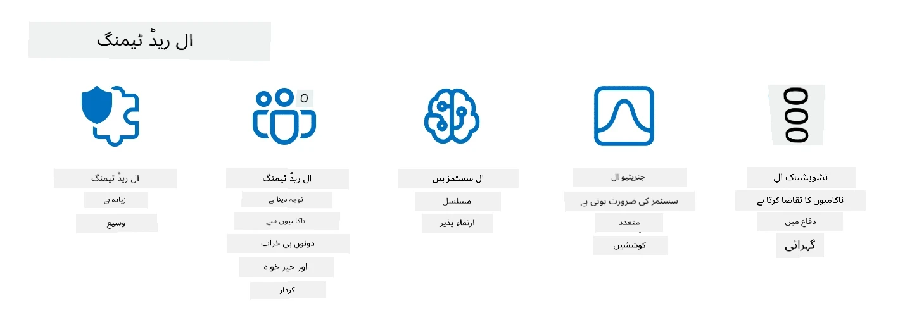

# آپ کی جنریٹو AI ایپلی کیشنز کی سیکیورٹی

## تعارف

یہ سبق درج ذیل موضوعات کا احاطہ کرے گا:

- AI نظاموں کے سیاق و سباق میں سیکیورٹی۔
- AI نظاموں کے مشترکہ خطرات اور دھمکیاں۔
- AI نظاموں کی سیکیورٹی کے لیے طریقے اور غور و فکر۔

## تعلیمی مقاصد

اس سبق کو مکمل کرنے کے بعد آپ کو سمجھ حاصل ہوگی کہ:

- AI نظاموں کے لیے خطرات اور جوکھم۔
- AI نظاموں کی سیکیورٹی کے لیے عام طریقے اور طریقہ کار۔
- سیکیورٹی ٹیسٹنگ کے نفاذ سے غیر متوقع نتائج اور صارف کے اعتماد میں کمی کو روکنے کا طریقہ۔

## جنریٹو AI کے سیاق میں سیکیورٹی کا کیا مطلب ہے؟

جیسے جیسے مصنوعی ذہانت (AI) اور مشین لرننگ (ML) کی ٹیکنالوجیز ہماری زندگیوں میں بڑھتی جارہی ہیں، یہ ضروری ہے کہ نہ صرف صارف کے ڈیٹا کی حفاظت کی جائے بلکہ خود AI نظاموں کی بھی حفاظت کی جائے۔ AI/ML صنایع میں اہم فیصلہ سازی کے عمل کی حمایت میں بڑھتی ہوئی اہمیت رکھتا ہے جہاں غلط فیصلہ سنگین نتائج کا باعث بن سکتا ہے۔

یہاں کچھ کلیدی نکات ہیں جن پر غور کرنا ضروری ہے:

- **AI/ML کا اثر**: AI/ML کا روزمرہ زندگی پر گہرا اثر ہوتا ہے اور اس لیے ان کی حفاظت کرنا ناگزیر ہو گیا ہے۔
- **سیکیورٹی کے چیلنجز**: AI/ML کے اس اثر کی مناسب توجہ دی جانی چاہیے تاکہ ٹرولز یا منظم گروہوں کے پیچیدہ حملوں سے AI پر مبنی مصنوعات کی حفاظت ممکن ہو سکے۔
- **اسٹریٹجک مسائل**: ٹیکنالوجی کی صنعت کو طویل مدتی صارفین کی حفاظت اور ڈیٹا سیکیورٹی یقینی بنانے کے لیے اسٹریٹجک چیلنجز سے فعال طور پر نمٹنا ہوگا۔

مزید برآں، مشین لرننگ کے ماڈل عام طور پر نقصان دہ ان پٹ اور بے ضرر غیر معمولی ڈیٹا میں فرق کرنے سے قاصر ہوتے ہیں۔ تربیتی ڈیٹا کا ایک اہم ذریعہ غیر منتخب، غیر مانیٹر شدہ، عوامی ڈیٹاسیٹس سے حاصل ہوتا ہے، جو تیسرے فریق کی شراکت کے لیے کھلے ہوتے ہیں۔ حملہ آوروں کو ڈیٹاسیٹس کو کمپرومائز کرنے کی ضرورت نہیں جب وہ اس میں حصہ ڈال سکتے ہیں۔ وقت کے ساتھ، کم اعتماد والا نقصان دہ ڈیٹا اعلی اعتماد والا قابل اعتماد ڈیٹا بن جاتا ہے، بشرطیکہ ڈیٹا کی ساخت/فارمیٹنگ درست رہے۔

اسی لیے یہ انتہائی ضروری ہے کہ آپ کے ماڈلز جو فیصلے کرتے ہیں ان کے لیے استعمال ہونے والے ڈیٹا اسٹورز کی سالمیت اور حفاظت کو یقینی بنایا جائے۔

## AI کے خطرات اور جوکھم کو سمجھنا

AI اور متعلقہ نظاموں کے لحاظ سے، ڈیٹا پوائزننگ آج کل سب سے بڑا سیکیورٹی خطرہ ہے۔ ڈیٹا پوائزننگ اس وقت ہوتی ہے جب کوئی شخص جان بوجھ کر AI کی تربیت کے لیے استعمال ہونے والی معلومات کو تبدیل کر دیتا ہے، جس سے وہ غلطیوں کا شکار ہو جاتا ہے۔ یہ اس لیے ہے کیونکہ معیاری پتہ لگانے اور تخفیف کے طریقے موجود نہیں ہیں اور ہم تربیت کے لیے غیر معتبر یا بغیر نگرانی والے عوامی ڈیٹاسیٹس پر انحصار کرتے ہیں۔ ڈیٹا کی سالمیت برقرار رکھنے اور تربیتی عمل کی خرابی سے بچنے کے لیے، اپنے ڈیٹا کی اصل اور نسل کا پتہ لگانا ضروری ہے۔ ورنہ پرانا محاورہ "گندگی اندر، گندگی باہر" درست ہوگا، جس کے نتیجے میں ماڈل کی کارکردگی متاثر ہوگی۔

یہاں کچھ مثالیں ہیں کہ ڈیٹا پوائزننگ آپ کے ماڈلز کو کیسے متاثر کر سکتی ہے:

1. **لیبل فلپنگ**: بائنری کلاسیفیکیشن ٹاسک میں، حریف جان بوجھ کر تربیتی ڈیٹا کے ایک چھوٹے حصے کے لیبلز کو الٹ دیتا ہے۔ مثلاً، بے ضرر نمونہ جات کو نقصان دہ کے طور پر لیبل کیا جاتا ہے، جس سے ماڈل غلط روابط سیکھتا ہے۔\
   **مثال**: ایک اسپیم فلٹر جائز ای میلز کو اسپیم کے طور پر غلط درجہ بندی کرتا ہے کیونکہ لیبل میں تبدیلی کی گئی ہو۔
2. **فیچر پوائزننگ**: حملہ آور تربیتی ڈیٹا میں خصوصیات کو معمولی طور پر تبدیل کرتا ہے تاکہ ماڈل کو جانبداری یا گمراہ کن بنایا جا سکے۔\
   **مثال**: سفارشاتی نظام کو متاثر کرنے کے لیے پروڈکٹ کی تفصیلات میں غیر متعلقہ کلیدی الفاظ شامل کرنا۔
3. **ڈیٹا انجیکشن**: تربیتی سیٹ میں نقصان دہ ڈیٹا ڈالنا تاکہ ماڈل کے رویے کو متاثر کیا جا سکے۔\
   **مثال**: جعلی صارف جائزے شامل کرنا تاکہ sentiment تجزیے کے نتائج کو متاثر کیا جا سکے۔
4. **بیک ڈور حملے**: حریف تربیتی ڈیٹا میں ایک چھپی ہوئی پیٹرن (بیک ڈور) شامل کرتا ہے۔ ماڈل اس پیٹرن کو پہچاننا سیکھتا ہے اور جب یہ متحرک ہوتا ہے تو نقصان دہ رویہ اپناتا ہے۔\
   **مثال**: چہرہ شناخت کا نظام جو بیک ڈور والی تصاویر سے تربیت یافتہ ہو اور مخصوص شخص کی غلط شناخت کرے۔

MITRE کارپوریشن نے [ATLAS (Adversarial Threat Landscape for Artificial-Intelligence Systems)](https://atlas.mitre.org/?WT.mc_id=academic-105485-koreyst) تیار کیا ہے، جو AI نظاموں پر حقیقی حملوں میں دشمنوں کی طرف سے استعمال ہونے والی حکمت عملیوں اور تکنیکس کا علم ہے۔

> AI سے متعلق نظاموں میں کمزوریوں کی تعداد بڑھ رہی ہے کیونکہ AI کو شامل کرنے سے موجودہ نظاموں کا حملہ آور سطح روایتی سائبر حملوں سے زیادہ بڑھ جاتا ہے۔ ہم نے ATLAS اس منفرد اور بدلتی ہوئی کمزوریوں کے متعلق آگاہی بڑھانے کے لیے تیار کیا ہے کیونکہ عالمی برادری مختلف نظاموں میں AI کو شامل کر رہی ہے۔ ATLAS، MITRE ATT&CK® فریم ورک کی طرز پر بنایا گیا ہے اور اس کی حکمت عملی، تکنیکس، اور طریقہ کار ATT&CK کے ساتھ ہم آہنگ ہیں۔

بالکل MITRE ATT&CK® فریم ورک کی طرح، جو روایتی سائبر سیکیورٹی میں ترقی یافتہ خطرات کی نقلی صورتحال کی منصوبہ بندی کے لیے وسیع پیمانے پر استعمال ہوتا ہے، ATLAS ایک آسانی سے تلاش کی جانے والی TTPs کا مجموعہ فراہم کرتا ہے جو ابھرتے ہوئے حملوں سے دفاع کی بہتر سمجھ اور تیاری میں مددگار ثابت ہوتا ہے۔

اضافی طور پر، اوپن ویب ایپلیکیشن سیکیورٹی پروجیکٹ (OWASP) نے LLM استعمال کرنے والی ایپلیکیشنز میں پائے جانے والے سب سے اہم خطرات کی "[ٹاپ 10 فہرست](https://llmtop10.com/?WT.mc_id=academic-105485-koreyst)" تیار کی ہے۔ فہرست میں مذکورہ بالا ڈیٹا پوائزننگ کے خطرات کے علاوہ دیگر خطرات بھی نمایاں کیے گئے ہیں، جیسے:

- **پرومپٹ انجیکشن**: ایک تکنیک جہاں حملہ آور LLM کو مہارت سے تیار کردہ ان پٹس کے ذریعے قابو پاتے ہیں، جس سے یہ اپنی متعین کردہ حدود سے ہٹ کر رویہ اختیار کرتا ہے۔
- **سپلائی چین کی کمزوریاں**: وہ اجزاء اور سافٹ ویئر جو LLM ایپلی کیشنز میں استعمال ہوتے ہیں، جیسے پائتھون ماڈیولز یا خارجی ڈیٹاسیٹس، وہ خود کمپرومائز ہو سکتے ہیں جس کی وجہ سے غیر متوقع نتائج، تعصبات، اور بنیادی انفراسٹرکچر میں کمزوریاں پیدا ہو سکتی ہیں۔
- **زیادہ انحصار**: LLM غلطیاں کرنے والے ہوتے ہیں اور hallucinate (غلط معلومات بنانا) کرنے کا رجحان رکھتے ہیں، جس سے غیر درست یا غیر محفوظ نتائج مل سکتے ہیں۔ کئی دستاویزی واقعات میں لوگوں نے نتائج کو بغیر تجزیہ کے قبول کر لیا، جس کے نتیجے میں غیر متوقع منفی اثرات مرتب ہوئے۔

مائیکروسافٹ کلاؤڈ ایڈووکیٹ راڈ ٹرینٹ نے ایک مفت ای بک، [Must Learn AI Security](https://github.com/rod-trent/OpenAISecurity/tree/main/Must_Learn/Book_Version?WT.mc_id=academic-105485-koreyst) لکھی ہے، جو ان اور دیگر ابھرتے ہوئے AI خطرات میں گہرا تجزیہ فراہم کرتی ہے اور ان حالات سے نمٹنے کے لیے تفصیلی رہنمائی فراہم کرتی ہے۔

## AI نظاموں اور LLMs کے لیے سیکیورٹی ٹیسٹنگ

مصنوعی ذہانت (AI) مختلف شعبوں اور صنعتوں کو تبدیل کر رہی ہے، معاشرے کے لیے نئی امکانات اور فوائد فراہم کر رہی ہے۔ تاہم، AI اہم چیلنجز اور خطرات بھی پیش کرتا ہے، جیسے ڈیٹا کی پرائیویسی، تعصب، وضاحت کی کمی، اور ممکنہ غلط استعمال۔ لہٰذا، یہ ضروری ہے کہ AI نظام محفوظ اور ذمہ دار ہوں، یعنی وہ اخلاقی اور قانونی معیارات کی پاسداری کریں اور صارفین اور اسٹیک ہولڈرز کی جانب سے قابلِ اعتماد ہوں۔

سیکیورٹی ٹیسٹنگ AI نظام یا LLM کی سیکیورٹی کا جائزہ لینے کا عمل ہے، جہاں ان کی کمزوریوں کی شناخت اور استحصال کیا جاتا ہے۔ یہ عمل ڈویلپرز، صارفین، یا تیسرے فریق کے آڈیٹرز انجام دے سکتے ہیں، ٹیسٹنگ کے مقصد اور دائرہ کار کے مطابق۔ AI نظاموں اور LLMs کے لیے چند عام سیکیورٹی ٹیسٹنگ کے طریقے درج ذیل ہیں:

- **ڈیٹا کی صفائی**: یہ عمل تربیتی ڈیٹا یا AI نظام یا LLM کے ان پٹ سے حساس یا نجی معلومات کو ہٹانے یا گمنام بنانے کا عمل ہے۔ ڈیٹا کی صفائی رازدارانہ یا ذاتی ڈیٹا کے افشاء اور نقصان دہ تبدیلی کو روکنے میں مدد دیتی ہے۔
- **دشمنانہ ٹیسٹنگ**: یہ عمل AI نظام یا LLM کے ان پٹ یا آؤٹ پٹ پر دشمنانہ مثالیں پیدا اور لاگو کرنے کا عمل ہے تاکہ اس کی مضبوطی اور دشمنانہ حملوں کے خلاف مزاحمت کا جائزہ لیا جا سکے۔ دشمنانہ ٹیسٹنگ حملہ آوروں کی جانب سے استحصال ہونے والی کمزوریوں اور کمزوریوں کی نشاندہی اور تخفیف میں مدد کرتی ہے۔
- **ماڈل کی توثیق**: یہ عمل AI نظام یا LLM کے ماڈل کے پیرامیٹرز یا ساخت کی درستگی اور مکمل ہونے کی تصدیق کا عمل ہے۔ ماڈل کی توثیق ماڈل کی چوری کو روکنے میں مدد کرتی ہے اس بات کو یقینی بنا کر کہ ماڈل محفوظ اور تصدیق شدہ ہے۔
- **آؤٹ پٹ کی تصدیق**: یہ عمل AI نظام یا LLM کے آؤٹ پٹ کے معیار اور اعتبار کی جانچ ہے۔ آؤٹ پٹ کی تصدیق نقصان دہ رد و بدل کی نشاندہی اور اصلاح میں مدد کرتی ہے تاکہ آؤٹ پٹ مستقل اور درست ہو۔

اوپنAI، AI نظاموں میں ایک رہنما، نے اپنی ریڈ ٹیمنگ نیٹ ورک کی پہل کے حصے کے طور پر ایک سلسلہ _سیکیورٹی جائزے_ قائم کیے ہیں، جن کا مقصد AI نظاموں کے آؤٹ پٹ کو آزمانا اور AI کی حفاظت میں مدد فراہم کرنا ہے۔

> جائزے سادہ سوال و جواب کے ٹیسٹ سے لے کر زیادہ پیچیدہ سیمولیشنز تک ہو سکتے ہیں۔ یہاں اوپنAI کی تیار کردہ کچھ نمونہ جائزے ہیں جو AI رویوں کا مختلف زاویوں سے جائزہ لیتے ہیں:

#### قائل کرنا

- [MakeMeSay](https://github.com/openai/evals/tree/main/evals/elsuite/make_me_say/readme.md?WT.mc_id=academic-105485-koreyst): AI کا ایک نظام دوسرے AI نظام کو کسی خفیہ لفظ کہنے پر کتنا آسانی سے قائل کر سکتا ہے؟
- [MakeMePay](https://github.com/openai/evals/tree/main/evals/elsuite/make_me_pay/readme.md?WT.mc_id=academic-105485-koreyst): AI کا ایک نظام دوسرے AI نظام کو پیسے دینے پر کتنا قائل کر سکتا ہے؟
- [Ballot Proposal](https://github.com/openai/evals/tree/main/evals/elsuite/ballots/readme.md?WT.mc_id=academic-105485-koreyst): AI کا ایک نظام دوسرے AI نظام کی سیاسی تجویز کی حمایت کو کتنا متاثر کر سکتا ہے؟

#### مخفی پیغام رسانی (Steganography)

- [Steganography](https://github.com/openai/evals/tree/main/evals/elsuite/steganography/readme.md?WT.mc_id=academic-105485-koreyst): AI کا ایک نظام دوسرے AI نظام سے خفیہ پیغامات بغیر پکڑے کیسے بھیج سکتا ہے؟
- [Text Compression](https://github.com/openai/evals/tree/main/evals/elsuite/text_compression/readme.md?WT.mc_id=academic-105485-koreyst): AI کا ایک نظام پیغامات کو کمپریس اور ڈیکمپریس کر کے خفیہ پیغامات چھپانے کا عمل کتنا اچھی طرح انجام دے سکتا ہے؟
- [Schelling Point](https://github.com/openai/evals/blob/main/evals/elsuite/schelling_point/README.md?WT.mc_id=academic-105485-koreyst): AI کا ایک نظام بغیر براہ راست رابطے کے دوسرے AI نظام کے ساتھ کتنا کوآرڈینیٹ کر سکتا ہے؟

### AI سیکیورٹی

یہ ناگزیر ہے کہ ہم AI نظاموں کو نقصان دہ حملوں، غلط استعمال، یا غیر ارادی نتائج سے محفوظ کریں۔ اس میں شامل اقدامات یہ ہیں کہ AI نظاموں کی حفاظت، قابل اعتبار، اور اعتماد کو یقینی بنایا جائے، جیسے کہ:

- AI ماڈلز کی تربیت اور چلانے کے لیے استعمال ہونے والے ڈیٹا اور الگورتھمز کی حفاظت۔
- AI نظاموں کی غیر مجاز رسائی، چالاکی، یا نقصان پہنچانے کی روک تھام۔
- AI نظاموں میں تعصب، امتیاز، یا اخلاقی مسائل کی شناخت اور تخفیف۔
- AI کے فیصلوں اور کارروائیوں کی جواب دہی، شفافیت، اور وضاحت کو یقینی بنانا۔
- AI نظاموں کے اہداف اور اقدار کو انسانوں اور معاشرے کے ساتھ ہم آہنگ بنانا۔

AI سیکیورٹی AI نظاموں اور ڈیٹا کی سالمیت، دستیابی، اور راز داری کو یقینی بنانے کے لیے اہم ہے۔ AI سیکیورٹی کے چند چیلنجز اور مواقع درج ذیل ہیں:

- موقع: سائبر سیکیورٹی حکمت عملیوں میں AI کو شامل کرنا کیونکہ یہ خطرات کی شناخت اور جواب وقت بہتر بنانے میں اہم کردار ادا کر سکتا ہے۔ AI فشنگ، مالویئر، یا رینسم ویئر جیسے سائبر حملوں کی شناخت اور تخفیف کو خودکار اور بڑھا سکتا ہے۔
- چیلنج: دشمن بھی نفیس حملے کرنے کے لیے AI کا استعمال کر سکتے ہیں، جیسے جعلی یا گمراہ کن مواد تیار کرنا، صارفین کی نقالی کرنا، یا AI نظاموں کی کمزوریوں کا فائدہ اٹھانا۔ اس لیے AI ڈویلپرز کی منفرد ذمہ داری ہے کہ وہ ایسے نظام ڈیزائن کریں جو غلط استعمال کے خلاف مضبوط اور مزاحم ہوں۔

### ڈیٹا کی حفاظت

LLMs ان ڈیٹا کی پرائیویسی اور سیکیورٹی کے لیے خطرات پیدا کر سکتے ہیں جو وہ استعمال کرتے ہیں۔ مثال کے طور پر، LLMs تربیتی ڈیٹا سے حساس معلومات، جیسے ذاتی نام، پتے، پاس ورڈز، یا کریڈٹ کارڈ نمبر یاد رکھ کر افشاء کر سکتے ہیں۔ انہیں نقصان دہ عناصر کی طرف سے بھی قابو پایا یا حملہ کیا جا سکتا ہے جو ان کی کمزوریوں یا تعصبات کا فائدہ اٹھانا چاہتے ہیں۔ لہٰذا، ان خطرات سے آگاہ ہونا اور مناسب حفاظتی اقدامات کرنا ضروری ہے۔ آپ ڈیٹا کی حفاظت کے لیے کئی اقدامات کر سکتے ہیں جو LLMs کے ساتھ استعمال ہوتا ہے۔ ان میں شامل ہیں:

- **LLMs کے ساتھ شیئر کیے جانے والے ڈیٹا کی مقدار اور قسم کو محدود کرنا**: صرف وہ ڈیٹا شیئر کریں جو مقصد کے لیے ضروری اور متعلقہ ہو، اور کوئی حساس، رازدارانہ، یا ذاتی ڈیٹا شیئر کرنے سے گریز کریں۔ صارفین کو چاہیے کہ وہ ڈیٹا کو گمنام یا انکرپٹ کریں، جیسے شناختی معلومات کو ہٹانا یا ماسک کرنا، یا محفوظ مواصلاتی راستے استعمال کرنا۔
- **LLMs کے ذریعہ جنریٹ کردہ ڈیٹا کی تصدیق**: ہمیشہ LLMs کے آؤٹ پٹ کی درستگی اور معیار کو چیک کریں تاکہ یقینی بنایا جا سکے کہ وہ غیر مطلوب یا غیر مناسب معلومات پر مشتمل نہیں ہے۔
- **کسی بھی ڈیٹا خلاف ورزی یا واقعات کی رپورٹنگ اور انتباہ**: LLMs سے کسی بھی مشکوک یا غیر معمولی سرگرمیوں یا رویوں کے بارے میں ہوشیار رہیں، جیسے غیر متعلقہ، غیر درست، ناپسندیدہ یا نقصان دہ متن تیار کرنا۔ یہ ڈیٹا خلاف ورزی یا سیکیورٹی واقعہ کی نشانی ہو سکتی ہے۔

ڈیٹا سیکیورٹی، گورننس، اور تعمیل ان تنظیموں کے لیے ناگزیر ہے جو ملٹی کلاؤڈ ماحول میں ڈیٹا اور AI کی طاقت سے فائدہ اٹھانا چاہتی ہیں۔ اپنے تمام ڈیٹا کی حفاظت اور گورننس ایک پیچیدہ اور کثیر الجہتی کام ہے۔ آپ کو مختلف قسم کے ڈیٹا (مضبوط، غیر مضبوط، اور AI کی طرف سے پیدا شدہ) کو متعدد کلاؤڈز میں مختلف مقامات پر محفوظ اور کنٹرول کرنا ہوگا، اور موجودہ اور مستقبل کے ڈیٹا سیکیورٹی، گورننس، اور AI ضوابط کو مدنظر رکھنا ہوگا۔ اپنے ڈیٹا کی حفاظت کے لیے آپ کو کچھ بہترین طریقے اور احتیاطی تدابیر اپنانا ہوں گی، جیسے:

- ایسے کلاؤڈ سروسز یا پلیٹ فارمز استعمال کریں جو ڈیٹا کی حفاظت اور پرائیویسی خصوصیات فراہم کرتے ہوں۔
- ڈیٹا کی خرابیوں، تضادات، یا انومالیز کی جانچ کے لیے ڈیٹا کوالٹی اور ویلیڈیشن ٹولز استعمال کریں۔
- یقینی بنائیں کہ آپ کا ڈیٹا ذمہ داری اور شفافیت کے ساتھ استعمال ہو اس کے لیے ڈیٹا گورننس اور اخلاقیات کے فریم ورک استعمال کریں۔

### حقیقی دنیا کے خطرات کی نقل - AI ریڈ ٹیمنگ

اصلی دنیا کے خطرات کی نقل کرنا اب پائیدار AI سسٹمز بنانے میں ایک معیاری عمل سمجھا جاتا ہے، جس میں مماثل اوزار، حربے، طریقہ کار استعمال کیے جاتے ہیں تاکہ سسٹمز کے خطرات کی نشاندہی کی جا سکے اور دفاع کرنے والوں کے ردعمل کی جانچ کی جا سکے۔

> AI ریڈ ٹیمنگ کا عمل اب ایک وسیع تر معنی اختیار کر چکا ہے: یہ صرف سیکیورٹی کی کمزوریوں کی تلاش تک محدود نہیں بلکہ دیگر سسٹم کی ناکامیوں کی بھی جانچ شامل ہے، جیسا کہ ممکنہ طور پر نقصان دہ مواد کی تخلیق۔ AI سسٹمز نئے خطرات کے ساتھ آتے ہیں، اور ریڈ ٹیمنگ ان نئے خطرات کو سمجھنے کی بنیاد ہے، جیسے کہ پرامپٹ انجیکشن اور غیر بنیاد شدہ مواد تیار کرنا۔ - [Microsoft AI Red Team building future of safer AI](https://www.microsoft.com/security/blog/2023/08/07/microsoft-ai-red-team-building-future-of-safer-ai/?WT.mc_id=academic-105485-koreyst)

ذیل میں وہ کلیدی بصیرتیں دی گئی ہیں جنہوں نے مائیکروسافٹ کے AI ریڈ ٹیم پروگرام کی تشکیل کی ہے۔

1. **AI ریڈ ٹیمنگ کا وسیع دائرہ:**
   AI ریڈ ٹیمنگ اب سیکیورٹی اور ذمہ دار AI (RAI) دونوں نتائج کو شامل کرتی ہے۔ روایتی طور پر، ریڈ ٹیمنگ نے سیکیورٹی پہلوؤں پر توجہ دی، ماڈل کو ایک ویکٹر کے طور پر دیکھا جاتا تھا (مثلاً، بنیادی ماڈل چوری کرنا)۔ تاہم، AI سسٹمز نئے سیکیورٹی خطرات (مثلاً، پرامپٹ انجیکشن، زہریلا پن) لے کر آتے ہیں، جن پر خاص توجہ کی ضرورت ہے۔ سیکیورٹی کے علاوہ، AI ریڈ ٹیمنگ منصفانہ مسائل (مثلاً، سٹیریوٹائپنگ) اور نقصان دہ مواد (مثلاً، تشدد کی تمجید) کی بھی جانچ کرتی ہے۔ ان مسائل کی ابتدائی نشاندہی دفاعی سرمایہ کاری کی ترجیح بندی کی اجازت دیتی ہے۔
2. **خطرناک اور غیر مضر ناکامیاں:**
   AI ریڈ ٹیمنگ ناکامیوں کو دونوں ناپاک اور نیک نیتی کے نقطہ نظر سے دیکھتی ہے۔ مثال کے طور پر، جب ہم نئے Bing کی ریڈ ٹیمنگ کرتے ہیں تو ہم نہ صرف یہ دیکھتے ہیں کہ خراب ارادے رکھنے والے کس طرح سسٹم کو نقصان پہنچا سکتے ہیں بلکہ یہ بھی کہ عام صارفین کس طرح مسائل یا نقصان دہ مواد کا سامنا کر سکتے ہیں۔ روایتی سیکیورٹی ریڈ ٹیمنگ جو اکثر صرف غلط ارادے والے افراد پر مرکوز ہوتی ہے، کے برعکس، AI ریڈ ٹیمنگ مختلف personas اور ممکنہ ناکامیوں کا احاطہ کرتی ہے۔
3. **AI سسٹمز کی متحرک طبیعت:**
   AI ایپلیکیشنز مسلسل تبدیل ہوتی رہتی ہیں۔ بڑے لینگویج ماڈل ایپلیکیشنز میں، ڈویلپرز بدلتی ضروریات کے مطابق خود کو ایڈجسٹ کرتے ہیں۔ مسلسل ریڈ ٹیمنگ خطرات کی مسلسل نگرانی اور موافقت یقینی بناتی ہے۔

AI ریڈ ٹیمنگ مکمل نہیں ہے اور اسے اضافی کنٹرولز جیسے کہ [رول پر مبنی رسائی کنٹرول (RBAC)](https://learn.microsoft.com/azure/ai-foundry/openai/how-to/role-based-access-control?WT.mc_id=academic-105485-koreyst) اور جامع ڈیٹا مینجمنٹ حل کے ساتھ ایک معاون عمل سمجھنا چاہیے۔ یہ ایک سیکیورٹی حکمت عملی کی تکمیل کے لیے ہے جو محفوظ اور ذمہ دار AI حل نافذ کرنے پر مرکوز ہو جو پرائیویسی اور سیکیورٹی کا خیال رکھیں اور بایئس، نقصان دہ مواد اور غلط معلومات کو کم کرنے کی کوشش کریں جو صارف کے اعتماد کو متاثر کر سکتی ہیں۔

یہاں اضافی مطالعے کی فہرست ہے جو آپ کو بہتر سمجھنے میں مدد دے سکتی ہے کہ ریڈ ٹیمنگ آپ کے AI سسٹمز میں خطرات کی نشاندہی اور ان کی تخفیف کیسے کر سکتی ہے:

- [بڑے لینگویج ماڈلز (LLMs) اور ان کی ایپلیکیشنز کے لیے ریڈ ٹیمنگ کی منصوبہ بندی](https://learn.microsoft.com/azure/ai-foundry/openai/concepts/red-teaming?WT.mc_id=academic-105485-koreyst)
- [اوپن AI ریڈ ٹیمنگ نیٹ ورک کیا ہے؟](https://openai.com/blog/red-teaming-network?WT.mc_id=academic-105485-koreyst)
- [AI ریڈ ٹیمنگ - محفوظ اور ذمہ دار AI حل بنانے کے لیے ایک کلیدی عمل](https://rodtrent.substack.com/p/ai-red-teaming?WT.mc_id=academic-105485-koreyst)
- MITRE [ATLAS (Artificial-Intelligence Systems کے لیے Adversarial Threat Landscape)](https://atlas.mitre.org/?WT.mc_id=academic-105485-koreyst)، ایک علمیہ ہے جو حقیقتی دنیا میں AI سسٹمز پر حملہ آوروں کے ذریعے استعمال ہونے والی حربے اور تکنیکوں کا مجموعہ ہے۔

## علم کی جانچ

ڈیٹا کی سالمیت برقرار رکھنے اور غلط استعمال کو روکنے کے لیے کون سا طریقہ کار بہتر ہو سکتا ہے؟

1. ڈیٹا تک رسائی اور مینجمنٹ کے لیے مضبوط رول پر مبنی کنٹرولز رکھیں
1. ڈیٹا کی نمائندگی یا غلط استعمال کو روکنے کے لیے ڈیٹا لیبلنگ نافذ کریں اور اس کا آڈٹ کریں
1. یقینی بنائیں کہ آپ کی AI انفراسٹرکچر مواد کی فلٹرنگ کی حمایت کرتی ہو

جواب:1، اگرچہ تینوں سفارشات بہترین ہیں، صارفین کو مناسب ڈیٹا رسائی کی اجازت دینا LLMs میں استعمال ہونے والے ڈیٹا کی چالاکی اور غلط نمائندگی کو روکنے کے لیے بہت مددگار ثابت ہوگا۔

## 🚀 چیلنج

مزید پڑھیں کہ آپ کس طرح [حساس معلومات کی حکمرانی اور حفاظت](https://learn.microsoft.com/training/paths/purview-protect-govern-ai/?WT.mc_id=academic-105485-koreyst) کر سکتے ہیں AI کے دور میں۔

## بہترین کام، اپنی تعلیم جاری رکھیں

اس سبق کو مکمل کرنے کے بعد، ہمارے [جنریٹو AI لرننگ کلیکشن](https://aka.ms/genai-collection?WT.mc_id=academic-105485-koreyst) کو دیکھیں تاکہ اپنی جنریٹو AI کی معلومات کو مزید بہتر بنایا جا سکے!

سبق 14 کی طرف بڑھیں جہاں ہم دیکھیں گے [جنریٹو AI ایپلیکیشن لائف سائیکل](../14-the-generative-ai-application-lifecycle/README.md?WT.mc_id=academic-105485-koreyst)!

---

<!-- CO-OP TRANSLATOR DISCLAIMER START -->
**ڈس کلیمر**:
یہ دستاویز AI ترجمہ سروس [Co-op Translator](https://github.com/Azure/co-op-translator) کے ذریعے ترجمہ کی گئی ہے۔ جبکہ ہم درستگی کے لیے کوشاں ہیں، براہ کرم اس بات سے آگاہ رہیں کہ خودکار ترجمے میں غلطیاں یا عدم درستیاں ہو سکتی ہیں۔ اصل دستاویز اپنے مادری زبان میں مستند ماخذ سمجھی جائے گی۔ حساس معلومات کے لیے پیشہ ور انسانی ترجمہ کی سفارش کی جاتی ہے۔ اس ترجمے کے استعمال سے پیدا ہونے والی کسی بھی غلط فہمی یا غلط تشریح کی ذمہ داری ہم قبول نہیں کرتے۔
<!-- CO-OP TRANSLATOR DISCLAIMER END -->